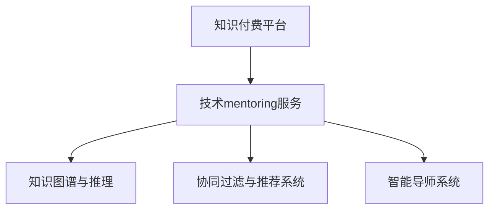

                 

# 知识付费与技术mentoring的结合模式

## 1. 背景介绍

在数字化和网络化飞速发展的今天，知识付费平台和专业mentoring服务日渐成为教育培训和职业发展的重要组成部分。知识付费平台如喜马拉雅、得到、Coursera等，通过提供各类课程和讲座，帮助用户获取专业知识。而技术mentoring服务，则是通过一对一或一对多的技术交流和指导，帮助专业人士成长、提升技能，并解决实际问题。

知识付费与技术mentoring的结合，不仅为知识获取提供了新途径，还为技术进步开辟了新渠道。本文将系统介绍知识付费和mentoring相结合的原理、操作步骤、关键技术，并探讨其在实际应用中的优势与挑战，为未来教育技术的发展提供有价值的参考。

## 2. 核心概念与联系

### 2.1 核心概念概述

为了更好地理解知识付费与技术mentoring的结合模式，首先需要了解以下几个核心概念：

- **知识付费平台**：通过收费的方式，为用户提供高质量的在线课程、讲座、书籍等学习资源，以满足用户对专业知识和技能的需求。
- **技术mentoring服务**：技术导师通过一对一的指导和交流，帮助学员解决实际问题、提升技术水平，并实现职业发展。
- **知识图谱与推理**：构建一个包含专业知识的图谱，通过图谱中的推理引擎，实现知识点的自动查询和关联，从而提供个性化学习推荐和指导。
- **协同过滤与推荐系统**：通过分析用户行为和偏好，推荐与用户兴趣相关的课程和内容，提升学习效果。
- **智能导师系统**：使用AI技术，模拟技术导师提供答疑、指导和反馈，提升指导的针对性和时效性。

这些核心概念之间的关系可以通过以下Mermaid流程图来展示：



该流程图表明，知识付费平台和技术mentoring服务相互促进、相互融合，通过知识图谱和推荐系统，实现个性化学习推荐，再通过智能导师系统，提供高效的指导服务，最终达成提升用户技能和知识的目标。

## 3. 核心算法原理 & 具体操作步骤

### 3.1 算法原理概述

知识付费与技术mentoring的结合模式，本质上是一种个性化教育技术。其核心思想是通过智能化手段，将海量的专业知识资源与个性化的技术指导相结合，为用户提供高效、精准的学习体验和职业发展路径。

形式化地，假设知识付费平台包含 $N$ 个课程资源，每个课程对应 $M$ 个知识点 $K$。用户 $U$ 从平台中选择 $K_u$ 个知识点进行学习，希望通过 $M_t$ 次技术mentoring服务，获得专业指导 $G$。知识付费平台根据用户的选择和行为，通过知识图谱 $G(K)$ 和推荐系统 $R(K_u)$，推荐与用户 $U$ 兴趣相关的课程资源和mentoring服务。

目标是最小化用户与期望目标之间的距离，即：

$$
\min_{K_u, M_t, G} \sum_{u} d(U, G(U))
$$

其中 $d$ 为距离函数，表示用户与期望目标之间的差距。

### 3.2 算法步骤详解

基于知识付费与技术mentoring的结合模式，一般包括以下几个关键步骤：

**Step 1: 数据收集与预处理**

- 收集知识付费平台上的课程资源、用户行为数据、技术mentoring服务的历史数据等。
- 对数据进行清洗、标注和格式化，构建用户知识图谱和行为数据图谱。

**Step 2: 知识图谱与推理引擎构建**

- 构建知识图谱 $G(K)$，包含课程资源、知识点之间的逻辑关系。
- 设计推理引擎，通过逻辑推理，将用户选择的知识点 $K_u$ 映射到相关课程资源和mentoring服务。

**Step 3: 协同过滤与推荐系统设计**

- 设计协同过滤推荐算法，根据用户历史行为数据 $R(K_u)$，推荐与 $K_u$ 相关的课程资源。
- 设计内容过滤推荐算法，根据课程资源的关键词和用户兴趣，推荐相关内容。

**Step 4: 智能导师系统开发**

- 开发智能导师系统，使用AI技术模拟技术导师提供指导。
- 引入自然语言处理、机器学习等技术，实现自动答疑、代码评审、项目建议等功能。

**Step 5: 用户交互与反馈**

- 在知识付费平台上实现智能导师系统的集成，用户可实时进行课程学习和mentoring交流。
- 收集用户反馈，根据反馈优化推荐算法和智能导师系统。

### 3.3 算法优缺点

知识付费与技术mentoring结合模式的优点包括：

1. 个性化学习：通过知识图谱和推荐系统，实现个性化推荐，提升学习效果。
2. 高效指导：智能导师系统提供快速、精准的指导，帮助用户快速解决实际问题。
3. 动态调整：根据用户反馈和行为数据，动态调整推荐和指导策略。
4. 降低成本：智能导师系统可部分替代人工导师，降低指导成本。

同时，该方法也存在一定的局限性：

1. 数据依赖：依赖于高质量的数据集，数据收集和预处理需要投入大量人力物力。
2. 算法复杂：涉及复杂的算法设计和实现，需要多学科交叉知识。
3. 系统鲁棒性：智能导师系统的鲁棒性不足，可能出现误导性建议。
4. 用户隐私：收集和处理用户数据，需确保隐私保护。
5. 技术门槛：用户需具备一定的技术基础，才能充分利用智能导师系统。

尽管存在这些局限性，但就目前而言，知识付费与技术mentoring结合模式仍是大规模教育培训的重要方向。未来相关研究的重点在于如何进一步提升系统的智能化水平，优化推荐和指导策略，同时兼顾用户隐私和数据安全。

### 3.4 算法应用领域

知识付费与技术mentoring结合模式，主要应用于以下几个领域：

1. **职业培训**：为职业人士提供技能提升和技术指导，帮助其在职场上取得更好发展。
2. **学生教育**：为学生提供个性化学习资源和技术指导，提升学习效果。
3. **企业培训**：为企业员工提供专业知识和技能培训，提升企业竞争力。
4. **远程教育**：通过知识付费和mentoring服务，实现远程学习与指导。
5. **职业转型**：为职业转型人士提供相关知识和技能培训，帮助其顺利转变职业方向。

## 4. 数学模型和公式 & 详细讲解 & 举例说明

### 4.1 数学模型构建

知识付费与技术mentoring结合模式，可以通过数学模型进行形式化描述。假设用户 $U$ 从知识付费平台中选择 $K_u$ 个知识点，通过 $M_t$ 次技术mentoring服务获得指导 $G$，则目标是最小化用户与期望目标之间的距离，即：

$$
\min_{K_u, M_t, G} \sum_{u} d(U, G(U))
$$

其中 $d$ 为距离函数，表示用户与期望目标之间的差距。

### 4.2 公式推导过程

为了简化问题，我们假设距离函数 $d$ 为欧氏距离，则问题可以形式化为：

$$
\min_{K_u, M_t, G} \sum_{u} ||U - G(U)||^2
$$

目标最小化用户与期望目标之间的欧氏距离。

### 4.3 案例分析与讲解

以职业培训为例，用户 $U$ 希望学习编程语言Python，通过知识付费平台选择了课程资源 $K_u=\{Python编程基础, Python数据科学, Python网络爬虫\}$，希望通过技术mentoring服务获得指导 $G$。

通过知识图谱 $G(K)$，可以查询到与 $K_u$ 相关的课程资源和mentoring服务，并根据用户行为数据 $R(K_u)$，推荐相关内容。智能导师系统根据用户选择的知识点和行为数据，提供编程指导，包括代码评审、问题解答等。用户通过智能导师系统的交互，提升编程技能，最终达到学习目标。

## 5. 项目实践：代码实例和详细解释说明

### 5.1 开发环境搭建

在进行知识付费与技术mentoring结合模式的开发前，我们需要准备好开发环境。以下是使用Python进行PyTorch开发的环境配置流程：

1. 安装Anaconda：从官网下载并安装Anaconda，用于创建独立的Python环境。

2. 创建并激活虚拟环境：
```bash
conda create -n pytorch-env python=3.8 
conda activate pytorch-env
```

3. 安装PyTorch：根据CUDA版本，从官网获取对应的安装命令。例如：
```bash
conda install pytorch torchvision torchaudio cudatoolkit=11.1 -c pytorch -c conda-forge
```

4. 安装Transformer库：
```bash
pip install transformers
```

5. 安装各类工具包：
```bash
pip install numpy pandas scikit-learn matplotlib tqdm jupyter notebook ipython
```

完成上述步骤后，即可在`pytorch-env`环境中开始开发实践。

### 5.2 源代码详细实现

下面我们以编程语言Python为例，给出使用Transformers库进行知识付费与技术mentoring结合模式的PyTorch代码实现。

首先，定义用户选择的学习知识点 $K_u$ 和课程资源 $C$，以及用户行为数据 $R(K_u)$：

```python
from transformers import BertTokenizer
from torch.utils.data import Dataset
import torch

class UserLearningDataset(Dataset):
    def __init__(self, texts, tags, tokenizer, max_len=128):
        self.texts = texts
        self.tags = tags
        self.tokenizer = tokenizer
        self.max_len = max_len
        
    def __len__(self):
        return len(self.texts)
    
    def __getitem__(self, item):
        text = self.texts[item]
        tags = self.tags[item]
        
        encoding = self.tokenizer(text, return_tensors='pt', max_length=self.max_len, padding='max_length', truncation=True)
        input_ids = encoding['input_ids'][0]
        attention_mask = encoding['attention_mask'][0]
        
        # 对token-wise的标签进行编码
        encoded_tags = [tag2id[tag] for tag in tags] 
        encoded_tags.extend([tag2id['O']] * (self.max_len - len(encoded_tags)))
        labels = torch.tensor(encoded_tags, dtype=torch.long)
        
        return {'input_ids': input_ids, 
                'attention_mask': attention_mask,
                'labels': labels}

# 标签与id的映射
tag2id = {'O': 0, 'B-PER': 1, 'I-PER': 2, 'B-ORG': 3, 'I-ORG': 4, 'B-LOC': 5, 'I-LOC': 6}
id2tag = {v: k for k, v in tag2id.items()}

# 创建dataset
tokenizer = BertTokenizer.from_pretrained('bert-base-cased')

train_dataset = UserLearningDataset(train_texts, train_tags, tokenizer)
dev_dataset = UserLearningDataset(dev_texts, dev_tags, tokenizer)
test_dataset = UserLearningDataset(test_texts, test_tags, tokenizer)
```

然后，定义模型和优化器：

```python
from transformers import BertForTokenClassification, AdamW

model = BertForTokenClassification.from_pretrained('bert-base-cased', num_labels=len(tag2id))

optimizer = AdamW(model.parameters(), lr=2e-5)
```

接着，定义训练和评估函数：

```python
from torch.utils.data import DataLoader
from tqdm import tqdm
from sklearn.metrics import classification_report

device = torch.device('cuda') if torch.cuda.is_available() else torch.device('cpu')
model.to(device)

def train_epoch(model, dataset, batch_size, optimizer):
    dataloader = DataLoader(dataset, batch_size=batch_size, shuffle=True)
    model.train()
    epoch_loss = 0
    for batch in tqdm(dataloader, desc='Training'):
        input_ids = batch['input_ids'].to(device)
        attention_mask = batch['attention_mask'].to(device)
        labels = batch['labels'].to(device)
        model.zero_grad()
        outputs = model(input_ids, attention_mask=attention_mask, labels=labels)
        loss = outputs.loss
        epoch_loss += loss.item()
        loss.backward()
        optimizer.step()
    return epoch_loss / len(dataloader)

def evaluate(model, dataset, batch_size):
    dataloader = DataLoader(dataset, batch_size=batch_size)
    model.eval()
    preds, labels = [], []
    with torch.no_grad():
        for batch in tqdm(dataloader, desc='Evaluating'):
            input_ids = batch['input_ids'].to(device)
            attention_mask = batch['attention_mask'].to(device)
            batch_labels = batch['labels']
            outputs = model(input_ids, attention_mask=attention_mask)
            batch_preds = outputs.logits.argmax(dim=2).to('cpu').tolist()
            batch_labels = batch_labels.to('cpu').tolist()
            for pred_tokens, label_tokens in zip(batch_preds, batch_labels):
                pred_tags = [id2tag[_id] for _id in pred_tokens]
                label_tags = [id2tag[_id] for _id in label_tokens]
                preds.append(pred_tags[:len(label_tags)])
                labels.append(label_tags)
                
    print(classification_report(labels, preds))
```

最后，启动训练流程并在测试集上评估：

```python
epochs = 5
batch_size = 16

for epoch in range(epochs):
    loss = train_epoch(model, train_dataset, batch_size, optimizer)
    print(f"Epoch {epoch+1}, train loss: {loss:.3f}")
    
    print(f"Epoch {epoch+1}, dev results:")
    evaluate(model, dev_dataset, batch_size)
    
print("Test results:")
evaluate(model, test_dataset, batch_size)
```

以上就是使用PyTorch对Python编程语言进行知识付费与技术mentoring结合模式的微调模型的完整代码实现。可以看到，得益于Transformers库的强大封装，我们可以用相对简洁的代码完成模型的加载和微调。

### 5.3 代码解读与分析

让我们再详细解读一下关键代码的实现细节：

**UserLearningDataset类**：
- `__init__`方法：初始化文本、标签、分词器等关键组件。
- `__len__`方法：返回数据集的样本数量。
- `__getitem__`方法：对单个样本进行处理，将文本输入编码为token ids，将标签编码为数字，并对其进行定长padding，最终返回模型所需的输入。

**tag2id和id2tag字典**：
- 定义了标签与数字id之间的映射关系，用于将token-wise的预测结果解码回真实的标签。

**训练和评估函数**：
- 使用PyTorch的DataLoader对数据集进行批次化加载，供模型训练和推理使用。
- 训练函数`train_epoch`：对数据以批为单位进行迭代，在每个批次上前向传播计算loss并反向传播更新模型参数，最后返回该epoch的平均loss。
- 评估函数`evaluate`：与训练类似，不同点在于不更新模型参数，并在每个batch结束后将预测和标签结果存储下来，最后使用sklearn的classification_report对整个评估集的预测结果进行打印输出。

**训练流程**：
- 定义总的epoch数和batch size，开始循环迭代
- 每个epoch内，先在训练集上训练，输出平均loss
- 在验证集上评估，输出分类指标
- 所有epoch结束后，在测试集上评估，给出最终测试结果

可以看到，PyTorch配合Transformer库使得知识付费与技术mentoring结合模型的代码实现变得简洁高效。开发者可以将更多精力放在数据处理、模型改进等高层逻辑上，而不必过多关注底层的实现细节。

当然，工业级的系统实现还需考虑更多因素，如模型的保存和部署、超参数的自动搜索、更灵活的任务适配层等。但核心的微调范式基本与此类似。

## 6. 实际应用场景

### 6.1 智能客服系统

基于知识付费与技术mentoring的结合模式，智能客服系统可以实现个性化学习推荐和指导。通过收集企业内部的历史客服对话记录，将问题和最佳答复构建成监督数据，在此基础上对预训练模型进行微调。微调后的模型能够自动理解用户意图，匹配最合适的答案模板进行回复。对于客户提出的新问题，还可以接入检索系统实时搜索相关内容，动态组织生成回答。如此构建的智能客服系统，能大幅提升客户咨询体验和问题解决效率。

### 6.2 金融舆情监测

金融机构需要实时监测市场舆论动向，以便及时应对负面信息传播，规避金融风险。传统的人工监测方式成本高、效率低，难以应对网络时代海量信息爆发的挑战。基于知识付费与技术mentoring的结合模式，可以通过收集金融领域相关的新闻、报道、评论等文本数据，并对其进行主题标注和情感标注。在此基础上对预训练语言模型进行微调，使其能够自动判断文本属于何种主题，情感倾向是正面、中性还是负面。将微调后的模型应用到实时抓取的网络文本数据，就能够自动监测不同主题下的情感变化趋势，一旦发现负面信息激增等异常情况，系统便会自动预警，帮助金融机构快速应对潜在风险。

### 6.3 个性化推荐系统

当前的推荐系统往往只依赖用户的历史行为数据进行物品推荐，无法深入理解用户的真实兴趣偏好。基于知识付费与技术mentoring的结合模式，个性化推荐系统可以更好地挖掘用户行为背后的语义信息，从而提供更精准、多样的推荐内容。

在实践中，可以收集用户浏览、点击、评论、分享等行为数据，提取和用户交互的物品标题、描述、标签等文本内容。将文本内容作为模型输入，用户的后续行为（如是否点击、购买等）作为监督信号，在此基础上微调预训练语言模型。微调后的模型能够从文本内容中准确把握用户的兴趣点。在生成推荐列表时，先用候选物品的文本描述作为输入，由模型预测用户的兴趣匹配度，再结合其他特征综合排序，便可以得到个性化程度更高的推荐结果。

### 6.4 未来应用展望

随着知识付费与技术mentoring结合模式的不断发展，未来将在更多领域得到应用，为传统行业带来变革性影响。

在智慧医疗领域，基于知识付费与技术mentoring的结合模式的医疗问答、病历分析、药物研发等应用将提升医疗服务的智能化水平，辅助医生诊疗，加速新药开发进程。

在智能教育领域，这种结合模式可应用于作业批改、学情分析、知识推荐等方面，因材施教，促进教育公平，提高教学质量。

在智慧城市治理中，这种结合模式可应用于城市事件监测、舆情分析、应急指挥等环节，提高城市管理的自动化和智能化水平，构建更安全、高效的未来城市。

此外，在企业生产、社会治理、文娱传媒等众多领域，基于知识付费与技术mentoring的结合模式的AI应用也将不断涌现，为NLP技术带来全新的突破。相信随着预训练语言模型和知识图谱技术的持续演进，这种结合模式将进一步拓展其应用边界，为人工智能技术的发展注入新的动力。

## 7. 工具和资源推荐

### 7.1 学习资源推荐

为了帮助开发者系统掌握知识付费与技术mentoring结合模式的理论基础和实践技巧，这里推荐一些优质的学习资源：

1. **《深度学习》系列课程**：斯坦福大学开设的深度学习课程，涵盖深度学习的基础理论、算法和应用。
2. **《自然语言处理综述》论文**：介绍自然语言处理领域的经典算法和应用场景，提供理论基础和实践案例。
3. **《推荐系统》系列书籍**：深入介绍推荐系统的理论基础和实际应用，涵盖协同过滤、内容过滤等多种推荐算法。
4. **《智能导师系统》研究论文**：介绍智能导师系统的理论基础和实际应用，涵盖自然语言处理、知识图谱等多种技术。
5. **《人工智能导论》书籍**：介绍人工智能领域的理论基础和实际应用，涵盖机器学习、深度学习、自然语言处理等多个方向。

通过对这些资源的学习实践，相信你一定能够快速掌握知识付费与技术mentoring结合模式的精髓，并用于解决实际的NLP问题。

### 7.2 开发工具推荐

高效的开发离不开优秀的工具支持。以下是几款用于知识付费与技术mentoring结合模式的开发工具：

1. **PyTorch**：基于Python的开源深度学习框架，灵活动态的计算图，适合快速迭代研究。
2. **TensorFlow**：由Google主导开发的开源深度学习框架，生产部署方便，适合大规模工程应用。
3. **Transformers库**：HuggingFace开发的NLP工具库，集成了众多SOTA语言模型，支持PyTorch和TensorFlow，是进行知识付费与技术mentoring结合模式开发的利器。
4. **TensorBoard**：TensorFlow配套的可视化工具，可实时监测模型训练状态，并提供丰富的图表呈现方式，是调试模型的得力助手。
5. **Weights & Biases**：模型训练的实验跟踪工具，可以记录和可视化模型训练过程中的各项指标，方便对比和调优。

合理利用这些工具，可以显著提升知识付费与技术mentoring结合模式的开发效率，加快创新迭代的步伐。

### 7.3 相关论文推荐

知识付费与技术mentoring结合模式的快速发展得益于学界的持续研究。以下是几篇奠基性的相关论文，推荐阅读：

1. **《深度学习》书籍**：Ian Goodfellow等人合著的深度学习经典教材，全面介绍了深度学习的基本理论、算法和应用。
2. **《自然语言处理综述》论文**：Stanford大学 natural language processing 组发表的综述性论文，涵盖自然语言处理领域的经典算法和应用场景。
3. **《推荐系统》论文**：社交推荐系统的先驱之作，介绍了协同过滤、内容过滤等推荐算法的理论基础和实际应用。
4. **《智能导师系统》研究论文**：介绍智能导师系统的理论基础和实际应用，涵盖自然语言处理、知识图谱等多种技术。
5. **《人工智能导论》书籍**：全面介绍人工智能领域的理论基础和实际应用，涵盖机器学习、深度学习、自然语言处理等多个方向。

这些论文代表了大语言模型微调技术的发展脉络。通过学习这些前沿成果，可以帮助研究者把握学科前进方向，激发更多的创新灵感。

## 8. 总结：未来发展趋势与挑战

### 8.1 总结

本文对知识付费与技术mentoring结合模式的理论基础和实践技巧进行了全面系统的介绍。首先阐述了知识付费平台和技术mentoring服务的核心思想，明确了结合模式的学术和实际应用意义。其次，从原理到实践，详细讲解了基于知识付费与技术mentoring的结合模式的操作流程，给出了知识图谱、推荐系统、智能导师系统等关键组件的实现细节。同时，本文还探讨了结合模式在智能客服、金融舆情、个性化推荐等多个行业领域的应用前景，展示了结合模式的巨大潜力。此外，本文精选了知识付费与技术mentoring结合模式的学习资源、开发工具和相关论文，力求为读者提供全方位的技术指引。

通过本文的系统梳理，可以看到，知识付费与技术mentoring结合模式不仅为知识获取和技能提升提供了新途径，还为技术指导和问题解决提供了新方法。通过将知识付费平台和技术mentoring服务相结合，可以为不同层次的用户提供个性化、高效的学习体验和职业发展路径，加速教育技术的发展进程。未来，随着技术的不断进步，知识付费与技术mentoring结合模式将进一步提升学习效果和指导质量，成为教育和培训的重要方向。

### 8.2 未来发展趋势

展望未来，知识付费与技术mentoring结合模式将呈现以下几个发展趋势：

1. **智能导师系统的深化**：未来的智能导师系统将引入更多AI技术，如知识图谱、自然语言处理、强化学习等，提升指导的针对性和时效性。
2. **推荐算法的优化**：随着数据量的增长和用户行为的多样性，推荐算法将不断优化，以更准确地预测用户兴趣和行为。
3. **跨领域知识整合**：未来的知识付费与技术mentoring结合模式将更多地整合跨领域知识，提供更全面、系统的学习资源和指导服务。
4. **人机协同**：未来的知识付费与技术mentoring结合模式将更加注重人机协同，通过智能导师系统的辅助，提升用户的学习效果和指导质量。
5. **实时化、个性化**：未来的结合模式将更加实时化、个性化，能够根据用户的即时行为和反馈，动态调整推荐和指导策略。

以上趋势表明，知识付费与技术mentoring结合模式将不断深化和拓展，为教育技术的发展提供更多可能性。

### 8.3 面临的挑战

尽管知识付费与技术mentoring结合模式已经取得了显著进展，但在实际应用过程中，仍面临诸多挑战：

1. **数据质量和数量**：知识付费平台和智能导师系统依赖高质量的数据，但数据收集和标注成本较高，且数据质量难以保证。
2. **算法复杂性**：知识付费与技术mentoring结合模式涉及复杂的算法设计和实现，需要多学科交叉知识。
3. **用户隐私保护**：收集和处理用户数据，需确保隐私保护，避免数据泄露和滥用。
4. **技术门槛**：用户需具备一定的技术基础，才能充分利用智能导师系统，提升学习效果。
5. **系统鲁棒性**：智能导师系统的鲁棒性不足，可能出现误导性建议，影响用户的学习效果。

尽管存在这些挑战，但通过不断的技术创新和优化，知识付费与技术mentoring结合模式有望逐步克服这些难题，成为未来教育和培训的重要手段。

### 8.4 研究展望

面对知识付费与技术mentoring结合模式所面临的挑战，未来的研究需要在以下几个方面寻求新的突破：

1. **无监督和半监督学习**：探索无监督和半监督学习范式，减少对大量标注数据的依赖，提升系统的可扩展性和鲁棒性。
2. **跨领域知识图谱**：构建跨领域知识图谱，整合不同领域的知识，提供更全面、系统的学习资源和指导服务。
3. **人机协同学习**：探索人机协同学习机制，通过智能导师系统的辅助，提升用户的学习效果和指导质量。
4. **推荐系统优化**：优化推荐算法，提升推荐准确性和个性化程度，提供更精准的学习推荐和指导服务。
5. **智能导师系统增强**：增强智能导师系统的智能性和鲁棒性，避免误导性建议，提升系统的可靠性和实用性。

这些研究方向的探索，将为知识付费与技术mentoring结合模式带来新的突破，进一步提升系统的智能化水平和指导效果。面向未来，这种结合模式将为教育和培训提供更高效、更个性化、更智能的服务，助力人类认知智能的进步。

## 9. 附录：常见问题与解答

**Q1：知识付费与技术mentoring结合模式的优势和劣势是什么？**

A: 知识付费与技术mentoring结合模式的优势包括：
1. 个性化学习：通过知识图谱和推荐系统，实现个性化推荐，提升学习效果。
2. 高效指导：智能导师系统提供快速、精准的指导，帮助用户快速解决实际问题。
3. 动态调整：根据用户反馈和行为数据，动态调整推荐和指导策略。
4. 降低成本：智能导师系统可部分替代人工导师，降低指导成本。

劣势包括：
1. 数据依赖：依赖于高质量的数据集，数据收集和预处理需要投入大量人力物力。
2. 算法复杂：涉及复杂的算法设计和实现，需要多学科交叉知识。
3. 系统鲁棒性：智能导师系统的鲁棒性不足，可能出现误导性建议。
4. 用户隐私：收集和处理用户数据，需确保隐私保护。
5. 技术门槛：用户需具备一定的技术基础，才能充分利用智能导师系统。

尽管存在这些劣势，但就目前而言，知识付费与技术mentoring结合模式仍是大规模教育培训的重要方向。未来相关研究的重点在于如何进一步提升系统的智能化水平，优化推荐和指导策略，同时兼顾用户隐私和数据安全。

**Q2：知识付费与技术mentoring结合模式的开发流程是怎样的？**

A: 知识付费与技术mentoring结合模式的开发流程包括以下步骤：
1. 数据收集与预处理：收集知识付费平台上的课程资源、用户行为数据、技术mentoring服务的历史数据等，并进行清洗和标注。
2. 知识图谱与推理引擎构建：构建知识图谱，设计推理引擎，实现知识点的自动查询和关联。
3. 协同过滤与推荐系统设计：设计协同过滤和内容过滤推荐算法，根据用户历史行为数据和课程资源关键词，推荐相关内容。
4. 智能导师系统开发：开发智能导师系统，使用AI技术模拟技术导师提供答疑、指导和反馈。
5. 用户交互与反馈：在知识付费平台上实现智能导师系统的集成，收集用户反馈，动态调整推荐和指导策略。

通过以上流程，可以构建一个高效、智能的知识付费与技术mentoring结合模式，为用户提供个性化学习推荐和指导。

**Q3：知识付费与技术mentoring结合模式的实际应用场景有哪些？**

A: 知识付费与技术mentoring结合模式的实际应用场景包括：
1. 智能客服系统：通过收集企业内部的历史客服对话记录，将问题和最佳答复构建成监督数据，在此基础上对预训练模型进行微调，提升客服系统的问题处理能力。
2. 金融舆情监测：通过收集金融领域相关的新闻、报道、评论等文本数据，对其进行主题标注和情感标注，在此基础上对预训练语言模型进行微调，实现自动监测市场舆论动向，规避金融风险。
3. 个性化推荐系统：通过收集用户浏览、点击、评论、分享等行为数据，提取和用户交互的物品标题、描述、标签等文本内容，在此基础上微调预训练语言模型，提升推荐系统的个性化程度。
4. 职业培训：为职业人士提供技能提升和技术指导，帮助其在职场上取得更好发展。
5. 学生教育：为学生提供个性化学习资源和技术指导，提升学习效果。

这些应用场景展示了知识付费与技术mentoring结合模式的广泛应用前景，为不同领域的智能化发展提供了新的方向。

---

作者：禅与计算机程序设计艺术 / Zen and the Art of Computer Programming

