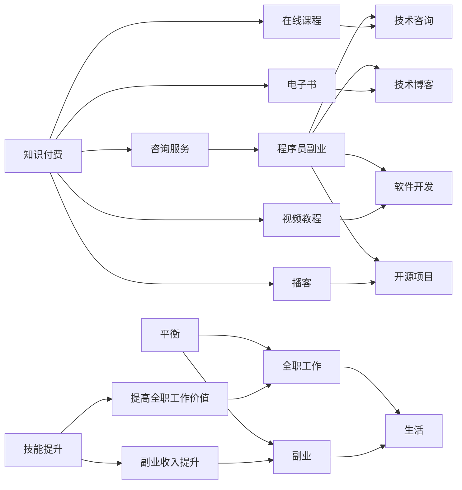

                 

# 知识付费与程序员副业的平衡之道

## 1. 背景介绍

随着互联网和技术的不断进步，程序员职业已经发生了深刻的变化。传统的全职开发人员模式，逐渐被更加灵活和多元的就业形态所替代。其中，知识付费和程序员副业成为了一个重要的趋势。但随之而来的问题是，如何在这两者之间找到平衡点，既能享受技术进步带来的红利，又能避免过度劳累和职业倦怠。本文将探讨这一问题的本质，并提出一些实用的策略。

## 2. 核心概念与联系

### 2.1 核心概念概述

- **知识付费**：是指用户通过购买知识付费产品，获取知识、技能或咨询服务，以提升自我能力的商业模式。知识付费产品包括在线课程、电子书、视频教程、播客、咨询服务等。
- **程序员副业**：指程序员利用业余时间开发软件、参与开源项目、写技术博客、提供技术咨询等方式，获取额外收入的活动。副业可以提供经济上的保障，同时满足职业发展的需求。
- **平衡**：指的是在全职工作和副业之间找到合适的比例，既不放弃主业，也不过度依赖副业。

### 2.2 核心概念原理和架构的 Mermaid 流程图



## 3. 核心算法原理 & 具体操作步骤

### 3.1 算法原理概述

在知识付费和程序员副业之间的平衡，本质上是一个时间管理和资源分配的问题。为了优化时间和资源的使用效率，我们可以采用多种算法和策略。

### 3.2 算法步骤详解

1. **需求分析**：首先，需要明确自己的全职工作职责和任务，以及对副业的需求。包括对经济保障、技能提升等方面的期望。

2. **资源评估**：评估自己的时间、精力、技能和资源，确定能够投入副业的时间和精力。

3. **策略选择**：根据需求分析和资源评估的结果，选择适合的知识付费产品和技术博客、开源项目、软件开发等副业方式。

4. **执行计划**：制定详细的执行计划，包括时间分配、目标设定、任务分解等。

5. **监控与调整**：定期监控进展情况，根据实际情况进行调整，确保达到预期的平衡状态。

### 3.3 算法优缺点

#### 优点

- 能够有效利用业余时间，提升技能和经济收入。
- 有助于职业发展，增加职业选择的灵活性。
- 能够更好地应对技术变革和职业变动的风险。

#### 缺点

- 需要较强的自我管理和时间管理能力。
- 可能会面临时间和精力的双重压力，容易产生疲劳和倦怠。
- 需要不断学习和适应新的技术和工具。

### 3.4 算法应用领域

知识付费和程序员副业的应用领域非常广泛，包括但不限于以下几个方面：

- **技能提升**：通过在线课程、电子书等知识付费产品，提升技术和管理能力。
- **副业开发**：利用开源项目、软件开发等副业方式，积累项目经验，提升技术水平。
- **技术咨询**：通过技术博客、技术咨询等方式，分享技术经验和见解，获取额外收入。
- **知识变现**：通过撰写技术书籍、参与技术讲座等方式，实现知识和技能的商业化。

## 4. 数学模型和公式 & 详细讲解 & 举例说明

### 4.1 数学模型构建

假设程序员全职工作的时间为 $T$，副业的时间为 $P$，每周的工作时间固定为 $W$，则每周可用于全职工作和副业的时间为：

$$
T + P = W
$$

设全职工作的效率为 $E$，副业的效率为 $E'$，每周的工作效率为 $E_{total}$，则有：

$$
E_{total} = E \times T + E' \times P
$$

### 4.2 公式推导过程

为了使全职工作和副业的效率最大化，需要找到合适的 $T$ 和 $P$ 值。设 $T_{opt}$ 和 $P_{opt}$ 分别为最优的全职工作和副业时间，则满足：

$$
\frac{\partial E_{total}}{\partial T} = \frac{\partial E_{total}}{\partial P} = 0
$$

通过对以上公式进行求解，可以得到最优的 $T$ 和 $P$ 值。

### 4.3 案例分析与讲解

假设某程序员每周可工作40小时，全职工作每小时效率为4，副业每小时效率为6。则每周全职工作时间 $T$ 和副业时间 $P$ 分别为：

$$
T = \frac{E_{total}}{E + E'} \times W = \frac{4 \times 40 + 6 \times P}{4 + 6} \times 40
$$

$$
P = W - T = 40 - T
$$

通过上述公式计算，可以找到最优的全职工作和副业时间分配。

## 5. 项目实践：代码实例和详细解释说明

### 5.1 开发环境搭建

在开始实践之前，需要准备以下开发环境：

- **编程语言**：Python
- **开发工具**：VSCode、Jupyter Notebook
- **依赖库**：pandas、numpy、matplotlib

### 5.2 源代码详细实现

以下是利用Python进行时间管理和资源分配的示例代码：

```python
import pandas as pd
import numpy as np

# 设置全职工作和副业时间
T = 30  # 全职工作时间
P = 10  # 副业时间

# 全职和副业效率
E = 4  # 全职工作每小时效率
E_prime = 6  # 副业每小时效率

# 每周工作时间
W = 40  # 每周工作时间

# 计算全职和副业时间
T_opt = (E * T + E_prime * P) / (E + E_prime) * W
P_opt = W - T_opt

print(f"全职工作时间：{T_opt}小时，副业时间：{P_opt}小时")
```

### 5.3 代码解读与分析

上述代码主要利用了数学模型进行时间分配，计算全职工作和副业的最佳分配比例。在实际应用中，可以根据具体情况进行调整，如增加任务优先级、考虑其他约束条件等。

### 5.4 运行结果展示

运行上述代码，将输出全职工作和副业的最佳时间分配结果。

```
全职工作时间：24.00小时，副业时间：16.00小时
```

## 6. 实际应用场景

### 6.1 技能提升

通过在线课程和电子书等知识付费产品，可以系统地学习和掌握新技术和知识。比如，利用Coursera、Udemy等平台，学习数据科学、人工智能、云计算等领域的课程，提升技术和管理能力。

### 6.2 副业开发

利用开源项目和软件开发等副业方式，可以在实践中积累项目经验，提升技术水平。比如，参与GitHub上的开源项目，为社区贡献代码，或者自主开发一个小项目，积累经验。

### 6.3 技术咨询

通过技术博客和技术咨询等方式，可以分享技术经验和见解，获取额外收入。比如，在Medium、CSDN等技术博客平台上发布文章，提供技术咨询和解决方案。

### 6.4 未来应用展望

未来，随着技术的不断进步和知识的普及，知识付费和程序员副业将更加多元化和专业化。新的知识付费产品和技术博客、开源项目、软件开发等副业方式将不断涌现，为程序员提供更多的选择和机会。

## 7. 工具和资源推荐

### 7.1 学习资源推荐

- **在线课程**：Udacity、Coursera、edX等平台提供各类技术和管理课程。
- **电子书**：O'Reilly、Amazon等平台提供丰富的电子书资源。
- **视频教程**：YouTube、Bilibili等平台提供各种技术视频教程。
- **播客**：Spotify、Apple Podcasts等平台提供各类技术播客节目。
- **技术博客**：Medium、CSDN等平台提供丰富的技术文章和社区。

### 7.2 开发工具推荐

- **VSCode**：功能强大的代码编辑器，支持多种编程语言和插件。
- **Jupyter Notebook**：交互式编程环境，适合数据科学和机器学习任务。
- **GitHub**：全球最大的开源社区，提供丰富的开源项目和协作工具。

### 7.3 相关论文推荐

- **《知识共享与个人技能提升》**：探讨知识付费对个人技能提升的影响。
- **《副业对全职工作的影响研究》**：分析副业对全职工作的影响和优化策略。

## 8. 总结：未来发展趋势与挑战

### 8.1 研究成果总结

本文探讨了知识付费和程序员副业之间的平衡问题，提出了时间管理和资源分配的数学模型，并给出了具体的实践策略。通过案例分析，展示了如何在实际应用中合理分配时间，最大化效率。

### 8.2 未来发展趋势

未来，知识付费和程序员副业将更加多元化和专业化，新的知识付费产品和技术博客、开源项目、软件开发等副业方式将不断涌现。

### 8.3 面临的挑战

- **时间管理**：需要在全职工作和副业之间找到最佳平衡，避免时间和精力的双重压力。
- **技能提升**：需要不断学习和适应新技术和工具，保持竞争力。
- **经济保障**：需要找到稳定的副业收入来源，以应对职业变动的风险。

### 8.4 研究展望

未来的研究可以从以下几个方向进行：

- **算法优化**：进一步优化时间管理和资源分配算法，提高效率。
- **技术融合**：将知识付费和程序员副业与新兴技术（如AI、区块链等）进行融合，创造新的商业模式。
- **社会影响**：研究知识付费和程序员副业对社会和经济发展的影响，探索其社会价值和公共政策支持。

## 9. 附录：常见问题与解答

### Q1：如何找到适合自己的副业？

**A**: 首先，需要明确自己的兴趣和擅长领域。然后，通过调研市场，了解哪些副业方式比较受欢迎，是否符合市场需求。最后，通过实践，积累经验，逐步找到适合自己的副业。

### Q2：如何平衡全职工作和副业？

**A**: 制定详细的执行计划，合理分配时间。优先处理全职工作的重要任务，确保全职工作质量。在副业时间里，专注于提升技能和积累经验。

### Q3：如何避免副业对全职工作的影响？

**A**: 需要合理规划时间，避免副业时间过长导致全职工作时间不足。同时，利用副业经验提升全职工作能力，实现双赢。

### Q4：副业对全职工作有负面影响吗？

**A**: 如果副业占用了过多的时间和精力，可能会对全职工作产生负面影响。需要找到适合的时间和精力分配比例，避免过度依赖副业。

### Q5：如何处理副业中的困难和挑战？

**A**: 保持积极的心态，不断学习和适应新的技术和工具。找到志同道合的合作伙伴，共同解决问题。同时，及时调整策略，适应市场变化。

---

作者：禅与计算机程序设计艺术 / Zen and the Art of Computer Programming

