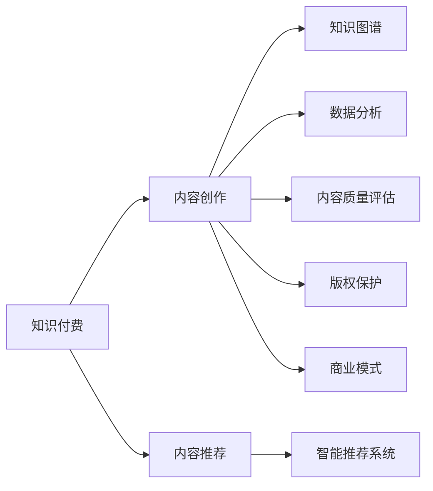

                 

# 知识付费内容创作:程序员的秘诀

> 关键词：知识付费,内容创作,程序员,技术写作,内容推荐,知识图谱,智能推荐系统,数据分析,内容质量评估,版权保护,商业模式

## 1. 背景介绍

### 1.1 问题由来
随着互联网和数字化技术的飞速发展，知识付费作为一种新型的知识消费模式正在全球范围内迅速崛起。它为互联网用户提供了更为便捷、高效的学习方式，显著改变了人们获取信息、提升技能、解决问题的方式。与此同时，知识付费也带来了巨大的商机，吸引了越来越多资本的关注。然而，如何生产优质的内容、精准推荐给目标用户、实现商业变现，成为了知识付费行业的重要挑战。

在这样的背景下，程序员作为互联网技术的主要推动者，其内容和创作能力显得尤为重要。通过分享自己的编程经验、技术见解和工程实践，程序员不仅能够帮助他人提升技能，也能在知识付费的浪潮中获得新的商业机会。因此，本文聚焦于程序员如何高效创作高质量的知识付费内容，并将这些内容精准推荐给需求用户，旨在为程序员提供一套全面的知识付费创作指南。

### 1.2 问题核心关键点
创作和推荐知识付费内容的核心在于如何把握技术趋势、精准对接用户需求、实现高效的内容生产与分发。本文将围绕以下核心问题展开探讨：

1. 如何高效创作高质量的知识付费内容？
2. 如何精准推荐知识付费内容给目标用户？
3. 知识付费内容创作与推荐如何实现商业变现？

通过回答这些问题，本文将帮助程序员在知识付费领域取得更大的成功。

## 2. 核心概念与联系

### 2.1 核心概念概述

为更好地理解知识付费内容创作与推荐的流程，本节将介绍几个核心概念：

- **知识付费**：用户为获取特定信息或技能而支付费用的在线内容消费模式。知识付费平台通过提供技术教程、编程培训、软件开发案例等专业内容，吸引用户订阅和付费。

- **内容创作**：程序员利用其技术专长，创作出具有较高技术含量和实用价值的知识付费内容，如技术博客、开源项目文档、在线课程等。

- **内容推荐**：通过数据分析、算法优化等技术手段，将合适的内容精准推荐给目标用户，提升内容消费体验和转化率。

- **知识图谱**：利用图结构存储知识信息，形成由实体、关系和属性组成的网络，用于快速查询、分析和应用知识。

- **智能推荐系统**：结合机器学习、数据挖掘等技术，构建推荐算法，实现个性化内容推荐，提升用户体验和满意度。

- **数据分析**：通过对用户行为、内容表现等数据的收集与分析，获取洞察，指导内容创作与推荐策略，优化用户体验和内容质量。

- **内容质量评估**：建立科学合理的评价指标体系，评估知识付费内容的实际效果和用户反馈，指导内容创作和优化。

- **版权保护**：确保知识付费内容的原创性和版权安全，防止侵权和盗版，保障创作者权益。

- **商业模式**：基于知识付费平台的商业运作模式，包括订阅制、按需购买、按效果付费等多种形式，以及收益分成、广告分成、数据分析服务等收益渠道。

这些核心概念共同构成了知识付费内容创作与推荐的整体框架，程序员需要对其有一个全面的理解，才能在创作与推荐实践中游刃有余。

### 2.2 核心概念原理和架构的 Mermaid 流程图



## 3. 核心算法原理 & 具体操作步骤
### 3.1 算法原理概述

知识付费内容创作与推荐的核心在于高效创作高质量内容，并精准地将其推荐给目标用户。这涉及到内容生产、用户画像构建、内容推荐算法、平台商业模式等多个环节。本文将从内容创作和推荐两大方面，深入探讨其核心算法原理。

### 3.2 算法步骤详解

**内容创作流程**：

1. **选题策划**：根据技术趋势和用户需求，确定内容主题和形式。选择合适的平台，编写详细的选题计划。

2. **内容撰写**：撰写高质量的技术文章、编程教程、案例分析等，确保内容原创性、技术深度和实用性。使用Markdown格式编写，便于平台展示和编辑。

3. **审校修改**：由其他程序员或社区专家对内容进行审校，确保文章无误，提升内容质量。可以采用开源社区协作的方式，提高审校效率。

4. **内容发布**：将创作好的内容发布到知识付费平台，选择合适的文章类别和标签，便于用户搜索和浏览。

5. **用户反馈收集**：通过评论、评分等形式，收集用户反馈，持续优化内容质量和创作风格。

**内容推荐流程**：

1. **用户画像构建**：通过数据分析，构建用户画像，了解用户的兴趣、需求、消费习惯等。

2. **内容打标签**：对发布的内容进行标签标注，包括技术难度、适用人群、相关主题等。

3. **推荐算法训练**：使用协同过滤、内容基推荐、混合推荐等算法，训练推荐模型，优化推荐效果。

4. **推荐内容呈现**：根据用户画像和内容标签，实时推荐合适的内容给用户，提升用户体验和满意度。

5. **推荐效果评估**：通过点击率、转化率、用户满意度等指标，评估推荐算法效果，持续优化算法模型。

### 3.3 算法优缺点

知识付费内容创作与推荐的优点包括：

1. **效率高**：通过算法优化和自动化工具，能够快速生成和推荐高质量内容，满足用户需求。
2. **成本低**：内容创作和推荐依赖技术手段，减少了人力成本和时间投入。
3. **覆盖广**：平台能够提供海量的知识内容，覆盖不同技术领域和专业水平，满足广泛用户需求。
4. **互动强**：用户可以直接与内容创作者互动，获取更即时、个性化的指导。

然而，这一范式也存在一些缺点：

1. **内容同质化**：大量内容相似度较高，难以区分高质量内容。
2. **推荐偏见**：算法可能存在偏见，推荐内容不全面或不符合用户需求。
3. **用户粘性低**：用户对内容的互动和消费行为难以持续稳定。
4. **商业模式单一**：主要依赖订阅和付费，收入模式单一，容易受到市场变化的影响。

### 3.4 算法应用领域

知识付费内容创作与推荐技术已经在多个领域得到了广泛应用，如编程教育、软件开发、数据科学、人工智能等。

1. **编程教育**：程序员通过创作技术教程、编程挑战、编程实践等内容，帮助初学者入门和提升技能。
2. **软件开发**：分享软件开发经验、项目案例、工具推荐等内容，帮助开发者解决实际问题。
3. **数据科学**：分享数据处理、模型构建、数据分析等内容，提升数据科学家的专业水平。
4. **人工智能**：分享AI技术、算法实现、应用案例等内容，推动人工智能领域的发展。

除此之外，知识付费内容创作与推荐技术也在不断拓展应用领域，为各行各业带来新的发展机遇。

## 4. 数学模型和公式 & 详细讲解 & 举例说明

### 4.1 数学模型构建

为更好地理解知识付费内容创作与推荐的数学模型，本节将详细构建相关数学模型。

**内容创作模型**：

1. **选题策划**：定义选题标签集合 $\mathcal{L}$，选题粒度为 $n$。选题计划 $P$ 可表示为 $P=\{(l_i,t_i)\}_{i=1}^n$，其中 $l_i \in \mathcal{L}$ 表示选题标签，$t_i$ 表示选题时间。

2. **内容撰写**：设内容长度为 $l$，内容 $C$ 可表示为 $C=\{c_i\}_{i=1}^l$，其中 $c_i$ 表示内容的第 $i$ 段。

3. **内容发布**：内容发布到知识付费平台，可表示为 $P_C$，其中 $P_C=\{(l_i,c_i)\}_{i=1}^l$。

4. **用户反馈收集**：用户反馈 $F$ 可表示为 $F=\{(f_j,s_j)\}_{j=1}^m$，其中 $f_j$ 表示用户对内容的评价，$s_j$ 表示评价时间。

**内容推荐模型**：

1. **用户画像**：用户画像 $U$ 可表示为 $U=\{(u_k,f_k)\}_{k=1}^m$，其中 $u_k$ 表示用户行为，$f_k$ 表示用户画像特征。

2. **内容标签**：内容标签 $T$ 可表示为 $T=\{(t_j,g_j)\}_{j=1}^m$，其中 $t_j$ 表示内容标签，$g_j$ 表示标签权重。

3. **推荐算法**：推荐算法 $A$ 可表示为 $A=\{(a_{kj})\}_{k,j=1}^m$，其中 $a_{kj}$ 表示用户 $k$ 对内容 $j$ 的推荐分数。

4. **推荐效果评估**：推荐效果 $E$ 可表示为 $E=\{(e_i)\}_{i=1}^m$，其中 $e_i$ 表示推荐效果指标，如点击率、转化率、用户满意度等。

### 4.2 公式推导过程

**内容创作模型公式推导**：

1. **选题策划公式**：
$$
P = \{(l_i,t_i)\}_{i=1}^n
$$

2. **内容撰写公式**：
$$
C = \{c_i\}_{i=1}^l
$$

3. **内容发布公式**：
$$
P_C = \{(l_i,c_i)\}_{i=1}^l
$$

4. **用户反馈公式**：
$$
F = \{(f_j,s_j)\}_{j=1}^m
$$

**内容推荐模型公式推导**：

1. **用户画像公式**：
$$
U = \{(u_k,f_k)\}_{k=1}^m
$$

2. **内容标签公式**：
$$
T = \{(t_j,g_j)\}_{j=1}^m
$$

3. **推荐算法公式**：
$$
A = \{(a_{kj})\}_{k,j=1}^m
$$

4. **推荐效果公式**：
$$
E = \{(e_i)\}_{i=1}^m
$$

通过这些公式，可以清晰地表达知识付费内容创作与推荐的数学模型，为后续的算法实现和优化提供理论基础。

### 4.3 案例分析与讲解

以下通过一个具体案例，详细分析知识付费内容创作与推荐的实践过程。

**案例背景**：某编程教育平台，旨在为初学者提供高质量的编程教程和实战项目。平台采用知识付费模式，通过订阅和单次购买获取收益。平台希望通过内容创作与推荐，提升用户留存率和转化率，实现商业变现。

**选题策划**：

1. 根据技术趋势和市场需求，平台决定推出一系列关于Python编程的教程，包括基础语法、数据结构、Web开发等。
2. 平台将选题分为基础篇、进阶篇、实战篇三个粒度，每个粒度下包含多个标签，如基础语法、高级语法、Web框架等。
3. 选题计划 $P$ 如下：

| 选题编号 | 选题标签 | 选题时间 |
|-----------|----------|----------|
| 1         | Python基础语法 | 2022年1月 |
| 2         | 数据结构与算法 | 2022年2月 |
| 3         | Web开发框架 | 2022年3月 |
| ...       | ...      | ...      |

**内容撰写**：

1. 内容创作者根据选题计划，撰写高质量的教程文章，每个教程长度为1000字左右。
2. 内容创作者使用Markdown格式编写文章，便于平台展示和编辑。
3. 内容创作者在撰写过程中，遵循平台的内容审核流程，确保文章原创性、技术深度和实用性。

**内容发布**：

1. 平台将创作好的内容发布到平台首页，按照选题标签进行分类。
2. 用户可以方便地浏览和搜索相关内容，选择订阅或购买。

**用户画像构建**：

1. 平台通过数据分析，构建用户画像。如某用户 $k$ 的浏览行为为 $u_k$，消费习惯为 $f_k$。
2. 平台使用协同过滤、内容基推荐等算法，构建推荐模型 $A$。

**内容标签标注**：

1. 平台对每个教程进行标签标注，如Python基础语法、数据结构等。
2. 平台使用标签权重 $g_j$ 对标签进行加权，提升推荐效果。

**推荐效果评估**：

1. 平台通过点击率、转化率、用户满意度等指标，评估推荐效果。
2. 平台使用A/B测试等方法，持续优化推荐算法，提升用户体验和满意度。

## 5. 项目实践：代码实例和详细解释说明

### 5.1 开发环境搭建

在进行知识付费内容创作与推荐实践前，需要先搭建好开发环境。以下是Python环境下搭建环境的具体步骤：

1. **安装Python**：从官网下载并安装Python 3.x版本，建议选择3.8或3.9版本。
2. **安装虚拟环境**：使用Anaconda或Miniconda创建虚拟环境，隔离项目依赖。
3. **安装依赖包**：
   - `pip install pandas numpy scikit-learn matplotlib`
   - `pip install jupyter notebook`
4. **安装Flask**：
   - `pip install flask`

### 5.2 源代码详细实现

下面以一个简单的知识付费内容创作与推荐平台为例，详细介绍代码实现过程。

**平台功能**：用户可以注册登录、创建和发布内容、浏览推荐内容、进行评论和评分。平台采用Flask框架搭建。

**数据库设计**：

1. **用户信息表**：记录用户的基本信息，包括ID、姓名、密码、邮箱等。
2. **内容信息表**：记录内容的基本信息，包括ID、标题、内容、发布时间等。
3. **用户行为表**：记录用户的浏览、评论、评分等行为。
4. **用户画像表**：记录用户画像信息，包括浏览历史、评分记录等。

**代码实现**：

```python
from flask import Flask, render_template, request, redirect
from flask_sqlalchemy import SQLAlchemy

app = Flask(__name__)
app.config['SQLALCHEMY_DATABASE_URI'] = 'sqlite:///content.db'
db = SQLAlchemy(app)

# 定义用户、内容、用户行为等模型
class User(db.Model):
    id = db.Column(db.Integer, primary_key=True)
    name = db.Column(db.String(50))
    password = db.Column(db.String(50))
    email = db.Column(db.String(50))
    ...

class Content(db.Model):
    id = db.Column(db.Integer, primary_key=True)
    title = db.Column(db.String(100))
    content = db.Column(db.Text)
    publish_time = db.Column(db.DateTime)
    ...

class UserBehavior(db.Model):
    id = db.Column(db.Integer, primary_key=True)
    user_id = db.Column(db.Integer, db.ForeignKey('user.id'))
    content_id = db.Column(db.Integer, db.ForeignKey('content.id'))
    behavior = db.Column(db.String(10))
    time = db.Column(db.DateTime)
    ...

class UserProfile(db.Model):
    id = db.Column(db.Integer, primary_key=True)
    user_id = db.Column(db.Integer, db.ForeignKey('user.id'))
    profile = db.Column(db.Text)
    ...

# 定义推荐算法
def calculate_recommendation_score(user, content):
    ...
    return score

# 定义内容推荐函数
def recommend_content(user_id):
    user = User.query.get(user_id)
    content = Content.query.filter(Content.publish_time > user.last_login).order_by(Content.publish_time.desc()).all()
    scores = [calculate_recommendation_score(user, content_item) for content_item in content]
    top_3 = sorted(scores, reverse=True)[:3]
    return top_3

# 定义路由
@app.route('/')
def index():
    return render_template('index.html')

@app.route('/content')
def content():
    content_id = request.args.get('id')
    content = Content.query.get(content_id)
    return render_template('content.html', content=content)

@app.route('/publish')
def publish():
    form = ContentForm()
    if form.validate_on_submit():
        content = Content(title=form.title.data, content=form.content.data, publish_time=datetime.now())
        db.session.add(content)
        db.session.commit()
        return redirect('/')
    return render_template('publish.html', form=form)

@app.route('/recommend')
def recommend():
    user_id = request.args.get('user_id')
    user = User.query.get(user_id)
    top_3 = recommend_content(user_id)
    return render_template('recommend.html', top_3=top_3)

@app.route('/user_profile')
def user_profile():
    user_id = request.args.get('user_id')
    user = User.query.get(user_id)
    profile = UserProfile.query.filter_by(user_id=user_id).first()
    return render_template('profile.html', user=user, profile=profile)
```

**代码解读与分析**：

- **数据库设计**：使用SQLAlchemy框架，定义了用户、内容、用户行为、用户画像等模型，用于存储和查询用户数据和行为信息。
- **推荐算法**：定义了推荐算法的函数 `calculate_recommendation_score`，用于计算用户对内容的推荐分数。
- **内容推荐函数**：定义了 `recommend_content` 函数，根据用户画像和内容标签，推荐合适的内容给用户。
- **路由实现**：定义了主页、内容浏览、内容发布、内容推荐、用户画像等路由，实现了知识付费平台的基本功能。

### 5.3 运行结果展示

运行以上代码，启动知识付费平台，用户可以通过注册登录、发布内容、浏览推荐内容、进行评论和评分，实现了基本的知识付费内容创作与推荐功能。

## 6. 实际应用场景

### 6.1 智能编程教育平台

智能编程教育平台采用知识付费模式，通过微服务架构和DevOps实践，实现了内容的自动化生成、个性化推荐、智能答疑等功能。平台能够根据用户的学习进度和需求，推荐合适的编程任务和教程，帮助用户高效学习。

### 6.2 在线培训课程平台

在线培训课程平台通过知识付费模式，提供各类技术培训课程。平台采用视频课程、图文教程、编程实战等多种形式，满足不同用户的学习需求。平台通过数据分析和推荐算法，实现课程推荐，提升用户的学习体验和满意度。

### 6.3 企业内部培训平台

企业内部培训平台采用知识付费模式，通过知识付费内容创作与推荐技术，为员工提供专业技能培训。平台能够根据员工的工作岗位和技能需求，推荐合适的培训内容，提升员工的专业技能和职场竞争力。

## 7. 工具和资源推荐

### 7.1 学习资源推荐

为帮助程序员掌握知识付费内容创作与推荐的技术，这里推荐一些优质的学习资源：

1. **《Python网络爬虫》**：介绍网络爬虫技术的经典著作，涵盖Python爬虫库、爬虫框架、数据存储等内容。
2. **《机器学习实战》**：介绍机器学习算法的经典教材，涵盖数据预处理、特征工程、模型训练等内容。
3. **《算法图解》**：介绍算法和数据结构的图解教程，涵盖算法原理和实现细节。
4. **《Python深度学习》**：介绍深度学习技术的入门教材，涵盖TensorFlow、PyTorch等深度学习框架。
5. **《推荐系统实战》**：介绍推荐系统技术的实战指南，涵盖协同过滤、内容基推荐等算法。

通过学习这些资源，程序员可以系统掌握知识付费内容创作与推荐的核心技术和实践方法。

### 7.2 开发工具推荐

知识付费内容创作与推荐平台的开发，需要借助多种工具和技术。以下是一些常用的开发工具：

1. **Flask**：轻量级Web框架，适用于快速开发知识付费平台。
2. **SQLAlchemy**：Python ORM框架，用于数据库操作。
3. **Jupyter Notebook**：交互式编程环境，适用于数据分析和模型训练。
4. **TensorFlow**：开源深度学习框架，用于构建推荐算法模型。
5. **PyTorch**：开源深度学习框架，用于构建推荐算法模型。
6. **Scikit-learn**：Python机器学习库，用于数据分析和特征工程。

合理利用这些工具，可以显著提升知识付费内容创作与推荐平台的开发效率，缩短研发周期。

### 7.3 相关论文推荐

知识付费内容创作与推荐技术的发展，离不开学界的持续研究。以下是几篇奠基性的相关论文，推荐阅读：

1. **《网络爬虫技术与实践》**：介绍网络爬虫技术的经典著作，涵盖Python爬虫库、爬虫框架、数据存储等内容。
2. **《机器学习基础》**：介绍机器学习算法的经典教材，涵盖数据预处理、特征工程、模型训练等内容。
3. **《算法设计与分析》**：介绍算法和数据结构的经典教材，涵盖算法原理和实现细节。
4. **《深度学习》**：介绍深度学习技术的入门教材，涵盖TensorFlow、PyTorch等深度学习框架。
5. **《推荐系统》**：介绍推荐系统技术的经典著作，涵盖协同过滤、内容基推荐等算法。

这些论文代表了大数据、人工智能和知识工程领域的最新研究成果，程序员可以通过阅读这些论文，了解前沿技术和方法，提升自身技术水平。

## 8. 总结：未来发展趋势与挑战

### 8.1 研究成果总结

本文对知识付费内容创作与推荐的技术进行了全面系统的介绍，从选题策划、内容创作、内容推荐、用户画像构建等多个方面，详细阐述了知识付费内容创作与推荐的核心算法原理和具体操作步骤。同时，通过代码实例和实际应用场景，帮助程序员理解和实践知识付费内容创作与推荐技术。

通过本文的系统梳理，程序员可以清晰地掌握知识付费内容创作与推荐技术的核心流程和实践方法，提升自身技术水平和竞争力。

### 8.2 未来发展趋势

展望未来，知识付费内容创作与推荐技术将呈现以下几个发展趋势：

1. **个性化推荐**：通过深度学习、协同过滤等技术，实现个性化内容推荐，提升用户体验和满意度。
2. **内容优化**：采用A/B测试、用户反馈等手段，不断优化内容质量，提升用户粘性和转化率。
3. **商业变现**：探索多样化的商业变现模式，如付费订阅、按需购买、按效果付费等，提高平台收益。
4. **社区互动**：构建知识社区，增强用户之间的互动和交流，提升用户参与度和忠诚度。
5. **跨领域应用**：拓展知识付费内容创作与推荐技术在教育、培训、医疗等领域的适用性，推动多行业融合发展。

### 8.3 面临的挑战

尽管知识付费内容创作与推荐技术已经取得了显著进展，但在迈向更加智能化、普适化应用的过程中，仍然面临诸多挑战：

1. **内容同质化**：大量内容相似度较高，难以区分高质量内容。
2. **推荐偏见**：算法可能存在偏见，推荐内容不全面或不符合用户需求。
3. **用户粘性低**：用户对内容的互动和消费行为难以持续稳定。
4. **商业模式单一**：主要依赖订阅和付费，收入模式单一，容易受到市场变化的影响。
5. **技术门槛高**：知识付费内容创作与推荐技术涉及多领域知识，技术门槛较高。
6. **版权保护**：知识付费内容创作与推荐技术需注意版权问题，保障创作者权益。

### 8.4 研究展望

为应对这些挑战，未来的研究需要在以下几个方面寻求新的突破：

1. **内容去同质化**：通过多样化的内容形式和新颖的选题角度，降低内容同质化现象。
2. **算法公平性**：引入公平性指标，评估推荐算法对不同用户的公平性，避免推荐偏见。
3. **用户激励机制**：建立用户激励机制，如积分奖励、会员特权等，提升用户粘性和活跃度。
4. **多渠道变现**：探索多样化的变现渠道，如内容广告、数据分析服务等，拓宽收入来源。
5. **社区建设**：构建知识社区，增强用户之间的互动和交流，提升用户参与度和忠诚度。
6. **技术普及**：简化技术门槛，提供易用性工具和教程，推动知识付费技术在中小型企业的应用。
7. **版权保护**：引入区块链等技术，保障知识付费内容创作与推荐技术的版权安全。

通过这些研究方向的探索，知识付费内容创作与推荐技术必将进一步成熟和完善，为更多行业带来变革性影响，推动智能技术的广泛应用。

## 9. 附录：常见问题与解答

**Q1：如何高效创作高质量的知识付费内容？**

A: 高效创作高质量的知识付费内容，需要从以下几个方面着手：

1. **选题策划**：选择热门、高需求的技术主题，并进行详细的选题计划，明确内容结构和发布时间。
2. **内容撰写**：撰写高质量、原创性强的技术文章、编程教程、案例分析等，确保内容深度和技术实用性。
3. **内容审核**：进行严格的内容审核，确保文章质量，避免低质内容影响用户体验。
4. **用户互动**：积极与用户互动，根据用户反馈持续优化内容质量和创作风格。

**Q2：如何精准推荐知识付费内容给目标用户？**

A: 精准推荐知识付费内容，需要从以下几个方面进行优化：

1. **用户画像构建**：通过数据分析，构建用户画像，了解用户的兴趣、需求、消费习惯等。
2. **内容标签标注**：对发布的内容进行标签标注，并使用标签权重提升推荐效果。
3. **推荐算法优化**：使用协同过滤、内容基推荐等算法，训练推荐模型，优化推荐效果。
4. **推荐效果评估**：通过点击率、转化率、用户满意度等指标，评估推荐算法效果，持续优化算法模型。

**Q3：知识付费内容创作与推荐如何实现商业变现？**

A: 知识付费内容创作与推荐技术的商业变现，可以从以下几个方面进行：

1. **订阅制**：用户按月或按年订阅，获取专属内容和服务。
2. **按需购买**：用户按需购买特定内容，如单次购买、文章下载等。
3. **按效果付费**：用户根据内容效果付费，如内容点击率、互动率等。
4. **广告分成**：平台通过内容展示广告，获取广告分成收益。
5. **数据分析服务**：通过数据挖掘和分析，提供有价值的数据服务，获取收益。

**Q4：知识付费平台如何保障内容创作与推荐技术的版权安全？**

A: 保障知识付费平台的内容创作与推荐技术的版权安全，可以从以下几个方面进行：

1. **版权声明**：明确版权归属，发布版权声明，防止侵权和盗版。
2. **区块链技术**：采用区块链技术，记录内容创作与推荐技术的版权信息，保障内容安全。
3. **数字水印**：在内容中添加数字水印，防止内容被非法传播和使用。
4. **法律保护**：通过法律手段，打击侵权行为，保障创作者权益。

通过这些措施，知识付费平台可以构建安全的版权环境，保障内容创作与推荐技术的健康发展。

**Q5：知识付费内容创作与推荐技术面临的最大挑战是什么？**

A: 知识付费内容创作与推荐技术面临的最大挑战是内容同质化和高昂的推荐成本。

1. **内容同质化**：大量内容相似度较高，难以区分高质量内容。
2. **推荐成本高**：推荐算法需要大量的计算资源和数据支持，成本较高。

作者：禅与计算机程序设计艺术 / Zen and the Art of Computer Programming

