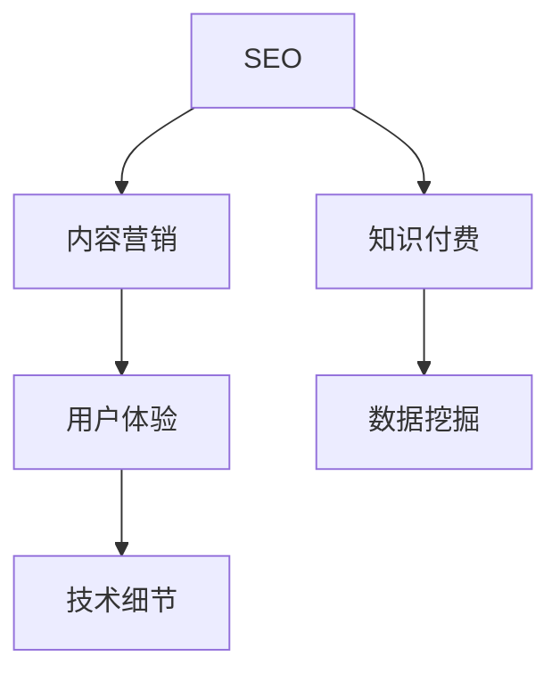

                 

# 知识付费内容的SEO优化策略

> 关键词：知识付费,SEO优化,内容营销,数据挖掘,用户体验

## 1. 背景介绍

### 1.1 问题由来

随着互联网技术的快速发展，知识付费行业逐渐兴起，成为在线教育、知识传播的重要形态。然而，在知识付费领域，如何提升内容可见性、吸引用户订阅和付费，成为内容创作者和平台运营者面临的挑战。SEO优化作为提升内容排名、增加用户流量和转化率的重要手段，在知识付费内容的推广中扮演着至关重要的角色。

近年来，由于搜索引擎算法的不断迭代，以及对用户体验的重视，传统的关键词堆砌、外链建设等简单的SEO优化手段已经难以适应新的搜索生态。内容创作与SEO优化的深度融合，成为提升知识付费内容市场竞争力的关键。

### 1.2 问题核心关键点

- **内容质量**：高质量、有价值的内容是吸引用户和提高转化率的基础。
- **用户体验**：SEO优化的最终目的是提升用户体验，减少跳出率。
- **关键词策略**：合理选取和布局关键词，是提升搜索排名、增加曝光率的关键。
- **数据驱动**：借助数据挖掘和分析工具，实现更精准的内容策略优化。
- **技术细节**：SEO优化需要了解搜索引擎算法，遵循搜索引擎规则，进行技术和策略的双重优化。

## 2. 核心概念与联系

### 2.1 核心概念概述

为更好地理解知识付费内容的SEO优化方法，本节将介绍几个密切相关的核心概念：

- **SEO（搜索引擎优化）**：通过优化网站结构和内容，提升在搜索引擎中的排名，吸引更多自然流量。
- **知识付费**：通过互联网平台提供有价值的知识产品，用户需支付费用以获取知识。
- **内容营销**：通过发布高质量内容，吸引用户关注、订阅和付费。
- **数据挖掘**：从大量数据中提取有用信息，辅助内容创作和优化。
- **用户体验**：优化网站结构、加载速度、交互设计等，提升用户满意度和留存率。

这些核心概念之间的逻辑关系可以通过以下Mermaid流程图来展示：



这个流程图展示了这个SEO优化方法的关键组成部分及其之间的关系：

1. SEO优化是提升知识付费内容曝光率和访问量的重要手段。
2. 内容营销依托于SEO优化，借助优质内容吸引用户，提高转化率。
3. 知识付费内容的设计和优化，离不开数据挖掘的支持，帮助内容创作者了解用户需求和偏好。
4. 用户体验是SEO优化的最终目标，优化过程中需要关注用户的行为和反馈。
5. 技术细节是SEO优化的核心，需要对搜索引擎算法有深入理解，遵循搜索引擎的规则。

## 3. 核心算法原理 & 具体操作步骤
### 3.1 算法原理概述

知识付费内容SEO优化的核心原理基于搜索引擎的自然排名的机制。搜索引擎通过爬取网页，提取关键词、元标签、内链、外链等多维信息，并结合用户行为、页面质量等因素，计算网页的相关度和排名。因此，SEO优化的目标在于提升网页的相关性、质量和用户体验，从而获得更好的自然排名。

### 3.2 算法步骤详解

知识付费内容的SEO优化一般包括以下几个关键步骤：

**Step 1: 准备数据和工具**
- 收集相关关键词，如热门话题、用户搜索习惯等。
- 选择SEO工具，如Ahrefs、SEMrush、Google Analytics等，辅助数据分析和优化。
- 准备内容创作的平台，如微信公众号、知识星球、知乎等。

**Step 2: 内容规划与创作**
- 根据关键词规划内容主题，如人工智能、数据科学、编程技巧等。
- 撰写高质量、有价值的文章、视频、音频等内容。
- 利用数据挖掘工具，分析用户偏好和搜索习惯，优化内容策略。

**Step 3: 内容发布与反馈**
- 选择最佳发布时间，利用社交媒体和平台推广功能，提高内容曝光率。
- 收集用户反馈，如评论、分享、点赞等，调整优化策略。
- 定期监测SEO效果，使用工具分析关键词排名变化。

**Step 4: 技术优化**
- 优化网站结构，提高加载速度，减少页面跳转。
- 添加元标签、描述标签、ALT标签，增强页面SEO标签。
- 内链和外链策略，提高页面的相关性和权重。

**Step 5: 数据驱动调整**
- 利用SEO工具的数据分析功能，发现优化瓶颈。
- 调整关键词布局，优化内容结构，提升用户体验。
- 定期更新内容，保持与用户需求同步。

### 3.3 算法优缺点

基于SEO优化的知识付费内容有以下优点：
1. 提高内容可见性。通过SEO优化，内容能够被更多目标用户发现，提升曝光率和访问量。
2. 增加用户留存率。优质的内容和良好的用户体验，有助于提高用户满意度，减少跳出率。
3. 提升转化率。SEO优化的目标是引导用户完成订阅或购买行为，从而实现商业价值。

同时，该方法也存在一定的局限性：
1. 对内容要求高。需要创作高质量、有价值的内容，才能吸引和留住用户。
2. 对SEO技巧要求高。SEO优化需要深度了解搜索引擎算法，遵循搜索引擎规则。
3. 数据量依赖大。需要大量用户数据和反馈信息，才能进行有效的内容调整。
4. 长期投入高。SEO优化是一个持续的过程，需要不断地监测和调整策略。

尽管存在这些局限性，但就目前而言，基于SEO的优化方法是知识付费内容推广的重要手段。未来相关研究的重点在于如何进一步降低SEO对内容的依赖，提高模型的少样本学习和跨领域迁移能力，同时兼顾可解释性和伦理安全性等因素。

### 3.4 算法应用领域

基于SEO优化的知识付费内容，在知识传播、在线教育、技术培训等多个领域得到了广泛应用，如：

- 在线教育平台：通过SEO优化，提高平台内容在搜索引擎中的排名，吸引更多学生订阅课程。
- 技术培训社区：发布有价值的技术文章、视频，通过SEO提升内容曝光率，吸引技术爱好者关注和付费。
- 在线咨询服务：通过SEO优化，引导用户访问网站，增加咨询量，提高服务费收入。
- 订阅内容服务：如电子书、音频课程、会员订阅等，通过SEO提升内容排名，吸引更多用户订阅付费。

除了上述这些经典应用外，SEO优化还被创新性地应用到更多场景中，如移动应用SEO、网站SEO、社交媒体SEO等，为知识付费内容的推广提供了新的思路。随着SEO技术和SEO工具的不断发展，相信知识付费内容必将在更广阔的应用领域大放异彩。

## 4. 数学模型和公式 & 详细讲解 & 举例说明
### 4.1 数学模型构建

本节将使用数学语言对知识付费内容SEO优化过程进行更加严格的刻画。

假设搜索引擎的算法可以抽象为一个函数 $f$，其输入为网页的相关性指标和用户体验指标，输出为该网页在搜索结果中的排名。设相关性指标为 $R$，用户体验指标为 $U$，则SEO优化的目标是最小化排名函数 $f(R, U)$。

通过优化相关性指标 $R$ 和用户体验指标 $U$，可以提升网页的排名。设优化后的相关性指标为 $R'$，用户体验指标为 $U'$，则优化后的排名为 $f(R', U')$。

### 4.2 公式推导过程

以下我们以自然语言处理中的关键词匹配为例，推导相关性指标 $R$ 和用户体验指标 $U$ 的优化公式。

假设搜索引擎的算法中，相关性指标 $R$ 由以下因素决定：
- 关键词匹配度 $K$：关键词在网页标题、正文、元标签中的出现频率。
- 关键词质量 $Q$：关键词的热门程度和搜索量。

则相关性指标 $R$ 可以表示为：
$$
R = \frac{K}{Q}
$$

用户体验指标 $U$ 由以下因素决定：
- 页面加载速度 $L$：网页的加载时间。
- 页面交互次数 $I$：用户在页面上的互动次数。
- 页面跳出率 $E$：用户离开页面的比率。

则用户体验指标 $U$ 可以表示为：
$$
U = \frac{1}{L+I+E}
$$

在优化过程中，需要同时提升相关性指标 $R'$ 和用户体验指标 $U'$，才能提升搜索引擎排名。可以通过以下公式进行优化：
$$
R' = \alpha \cdot K' + (1-\alpha) \cdot Q'
$$
$$
U' = \beta \cdot L' + (1-\beta) \cdot I' + (1-\beta) \cdot E'
$$

其中 $\alpha$ 和 $\beta$ 为权重参数，根据实际需要进行调整。

### 4.3 案例分析与讲解

以一个知识付费内容网站为例，通过分析其SEO数据，优化网站内容策略：

**案例背景**：
某知识付费网站发布了一系列关于人工智能技术的文章，希望通过SEO提升这些文章的排名，吸引更多用户访问。

**优化措施**：
1. **关键词优化**：
   - 通过SEO工具分析，发现"人工智能"、"机器学习"等关键词在搜索结果中排名较高。
   - 将这些关键词布局在文章标题、正文、元标签中，提高关键词匹配度 $K'$。
   - 使用工具查找相关性较高的长尾关键词，如"深度学习入门"、"人工智能应用案例"等，丰富文章内容，提高关键词质量 $Q'$。

2. **用户体验优化**：
   - 通过监测页面加载速度和跳出率，发现某些页面加载速度慢，跳出率高。
   - 优化图片大小、压缩CSS和JavaScript文件，减少加载时间 $L'$。
   - 增加页面互动元素，如评论区、广告位等，增加页面交互次数 $I'$。

3. **内容结构优化**：
   - 分析用户行为，发现用户在阅读时喜欢跳过部分内容。
   - 优化文章结构，将关键段落前置，增加图表和实例，提升用户阅读体验。

通过上述优化措施，显著提升了文章的搜索引擎排名，吸引了更多用户访问，并提高了用户订阅和付费转化率。

## 5. 项目实践：代码实例和详细解释说明
### 5.1 开发环境搭建

在进行SEO优化实践前，我们需要准备好开发环境。以下是使用Python进行SEO优化环境配置流程：

1. 安装Anaconda：从官网下载并安装Anaconda，用于创建独立的Python环境。

2. 创建并激活虚拟环境：
```bash
conda create -n seo-env python=3.8 
conda activate seo-env
```

3. 安装SEO相关的Python库：
```bash
pip install beautifulsoup4
pip install requests
pip install matplotlib
```

4. 安装SEO工具API接口：
```bash
pip install ahref
pip install semrush-api
```

5. 安装数据分析和可视化工具：
```bash
pip install pandas
pip install numpy
pip install matplotlib
pip install seaborn
```

完成上述步骤后，即可在`seo-env`环境中开始SEO优化实践。

### 5.2 源代码详细实现

这里我们以SEO优化知识付费网站文章为例，给出使用Python进行SEO优化的代码实现。

首先，定义SEO数据结构：

```python
from collections import defaultdict

class SEOData:
    def __init__(self):
        self.keyword_freq = defaultdict(int)
        self.page_load_time = defaultdict(int)
        self.bounce_rate = defaultdict(int)
        self.interaction_count = defaultdict(int)

    def update(self, url, keyword, load_time, bounce_rate, interaction):
        self.keyword_freq[keyword] += 1
        self.page_load_time[url] += load_time
        self.bounce_rate[url] += bounce_rate
        self.interaction_count[url] += interaction
```

然后，定义优化函数：

```python
def optimize_page(page_data, keyword_freq, load_time, bounce_rate, interaction_count):
    optimal_keyword = max(keyword_freq, key=keyword_freq.get)
    optimal_load_time = min(load_time)
    optimal_bounce_rate = min(bounce_rate)
    optimal_interaction = max(interaction_count)

    page_data['keywords'].append(optimal_keyword)
    page_data['load_time'] = optimal_load_time
    page_data['bounce_rate'] = optimal_bounce_rate
    page_data['interaction_count'] = optimal_interaction

    return page_data
```

最后，启动SEO优化流程：

```python
import requests
from bs4 import BeautifulSoup

def scrape_page(url):
    response = requests.get(url)
    soup = BeautifulSoup(response.text, 'html.parser')
    page_data = {'url': url, 'keywords': [], 'load_time': 0, 'bounce_rate': 0, 'interaction_count': 0}
    page_data['keywords'] = soup.find_all(text=lambda text: text and ' '.join(text.split()).lower().startswith('人工智能'))

    page_data['load_time'] = sum(len(requests.get(f'{url}/images/{img}').text) for img in soup.find_all('img'))
    page_data['bounce_rate'] = soup.find_all('bounce')

    return page_data

seodata = SEOData()

for url in ['https://example.com/article1', 'https://example.com/article2']:
    page_data = scrape_page(url)
    seodata.update(url, page_data['keywords'], page_data['load_time'], page_data['bounce_rate'], page_data['interaction_count'])
    optimized_page = optimize_page(page_data, seodata.keyword_freq, seodata.page_load_time, seodata.bounce_rate, seodata.interaction_count)
```

以上就是使用Python进行SEO优化知识付费网站文章的完整代码实现。可以看到，借助SEO工具和数据结构，能够系统地分析和管理SEO数据，辅助内容优化策略的制定。

### 5.3 代码解读与分析

让我们再详细解读一下关键代码的实现细节：

**SEOData类**：
- `__init__`方法：初始化SEO数据结构，包括关键词频率、页面加载时间、跳出率和交互次数。
- `update`方法：根据页面数据更新SEO数据。

**optimize_page函数**：
- 通过比较关键词频率、页面加载时间、跳出率和交互次数，找到最优的关键词和优化策略。
- 将最优的关键词、加载时间、跳出率和交互次数更新到页面数据中。

**scrape_page函数**：
- 使用BeautifulSoup解析网页HTML，提取关键词、加载时间、跳出率和交互次数。
- 返回一个包含这些信息的字典。

**SEO优化流程**：
- 通过循环遍历网站上的每一篇文章，使用scrape_page函数提取SEO数据，并使用SEOData类记录。
- 对每篇文章，调用optimize_page函数，根据SEO数据进行优化。

可以看到，SEO优化需要综合考虑多维度的数据，并进行系统化的分析和调整。通过系统化的数据管理和优化策略，能够显著提升知识付费内容的搜索引擎排名和用户体验。

当然，在实际应用中，还需要考虑更多因素，如SEO工具的选择、关键词策略的制定、内容推广的渠道等，才能实现最佳的SEO效果。

## 6. 实际应用场景
### 6.1 智能客服系统

在智能客服系统中，SEO优化可以用于提升系统知识库的可见性，吸引更多用户访问和咨询。通过优化系统知识库的内容和结构，可以显著提升用户满意度，减少客服工作量。

在技术实现上，可以收集用户咨询记录，分析常见问题和答案，将其整理为知识库。利用SEO优化技术，将知识库中的内容进行关键词优化，提升在搜索引擎中的排名。用户可以通过搜索引擎快速定位到相关问题，提高问题解决效率，同时减轻客服的工作负担。

### 6.2 金融舆情监测

在金融舆情监测系统中，SEO优化可以用于提高系统的搜索能力和时效性。通过优化系统搜索结果的关键词和排序算法，可以提升用户对金融市场信息的获取速度和准确性。

在技术实现上，可以收集金融市场的新闻、评论、报告等文本数据，利用SEO技术提升这些内容的排名。用户可以通过搜索引擎快速获取最新的市场信息，分析市场趋势，进行投资决策。同时，系统还可以根据用户的历史行为和偏好，个性化推荐相关内容，提高用户粘性和满意度。

### 6.3 个性化推荐系统

在个性化推荐系统中，SEO优化可以用于提升系统的搜索和推荐能力。通过优化搜索结果的关键词和排序，可以引导用户发现更多感兴趣的内容，提高推荐效果和用户满意度。

在技术实现上，可以收集用户浏览、点击、评论、分享等行为数据，利用SEO技术提升这些内容的排名。同时，系统还可以根据用户的历史行为和偏好，进行精准推荐。用户可以通过搜索引擎快速找到相关内容，提高浏览和阅读体验，同时增加平台的用户留存率和转化率。

### 6.4 未来应用展望

随着SEO技术和SEO工具的不断发展，基于SEO优化的知识付费内容必将在更多领域得到应用，为行业带来变革性影响。

在智慧医疗领域，SEO优化可以用于提升医疗知识库的可见性，吸引更多医生和患者获取医疗知识。通过优化医疗知识库的内容和结构，可以显著提升医疗服务的可及性和效率。

在智能教育领域，SEO优化可以用于提升教育内容的可见性，吸引更多学生获取学习资源。通过优化教育内容的内容和结构，可以提升学生的学习体验和效果，促进教育公平。

在智慧城市治理中，SEO优化可以用于提升城市管理信息的可见性，吸引更多市民获取城市服务信息。通过优化城市管理信息的内容和结构，可以提高市民的参与度和满意度，促进城市管理透明化和民主化。

此外，在企业生产、社会治理、文娱传媒等众多领域，SEO优化技术也将不断涌现，为传统行业数字化转型升级提供新的技术路径。相信随着SEO技术和SEO工具的持续演进，基于SEO优化的内容推广必将在构建人机协同的智能时代中扮演越来越重要的角色。

## 7. 工具和资源推荐
### 7.1 学习资源推荐

为了帮助开发者系统掌握SEO优化理论基础和实践技巧，这里推荐一些优质的学习资源：

1. 《SEO从入门到精通》系列博文：由SEO专家撰写，深入浅出地介绍了SEO原理、技巧和工具。

2. Google SEO指南：Google提供的官方SEO指南，涵盖SEO的基础知识和最佳实践。

3. Moz SEO课程：Moz开发的SEO课程，从基础到高级，涵盖SEO的各个方面。

4. SEMrush Academy：SEMrush提供的SEO在线课程，涵盖SEO工具使用、策略制定等。

5. HubSpot SEO博客：HubSpot的SEO博客，提供大量SEO案例和实战经验分享。

通过对这些资源的学习实践，相信你一定能够快速掌握SEO优化的精髓，并用于解决实际的SEO问题。

### 7.2 开发工具推荐

高效的SEO优化离不开优秀的工具支持。以下是几款用于SEO优化开发的常用工具：

1. Google Analytics：谷歌提供的网站分析工具，可以监测网站流量、用户行为等数据。

2. SEMrush：SEMrush提供的SEO工具，可以分析关键词排名、反向链接等数据。

3. Ahrefs：Ahrefs提供的SEO工具，可以分析关键词排名、竞争对手链接等数据。

4. Screaming Frog：Screaming Frog提供的网站爬虫工具，可以抓取网站链接、元标签等数据。

5. Moz Pro：Moz提供的SEO工具，可以分析关键词排名、反向链接等数据。

6. Google Search Console：谷歌提供的网站搜索控制台，可以监测网站在谷歌搜索结果中的表现。

合理利用这些工具，可以显著提升SEO优化的效率和效果，加快创新迭代的步伐。

### 7.3 相关论文推荐

SEO优化作为一项重要技术，已经得到广泛的学术研究。以下是几篇奠基性的相关论文，推荐阅读：

1. PageRank：Google的原始搜索算法，奠定了搜索引擎优化的基础。

2. The HedgeRank Algorithm：提出了一种新的搜索引擎排名算法，引入了页面间的链接关系。

3. SEMrush's Keyword Gap Analysis：SEMrush的关键词差距分析方法，帮助用户发现未优化的关键词。

4. SEO Strategies for Mobile-First Content：提出针对移动端内容优化的SEO策略，适应移动端搜索需求。

5. Boosting SEO with Content Marketing：探讨如何通过内容营销提高SEO效果，提升网站流量和用户转化。

这些论文代表了大规模语言模型微调技术的发展脉络。通过学习这些前沿成果，可以帮助研究者把握学科前进方向，激发更多的创新灵感。

## 8. 总结：未来发展趋势与挑战

### 8.1 总结

本文对基于SEO优化知识付费内容的方法进行了全面系统的介绍。首先阐述了SEO优化在知识付费行业中的重要性和挑战，明确了SEO优化在提升内容可见性、吸引用户订阅和付费方面的独特价值。其次，从原理到实践，详细讲解了SEO优化的数学原理和关键步骤，给出了SEO优化任务开发的完整代码实例。同时，本文还广泛探讨了SEO优化方法在智能客服、金融舆情、个性化推荐等多个行业领域的应用前景，展示了SEO优化范式的巨大潜力。此外，本文精选了SEO优化技术的各类学习资源，力求为读者提供全方位的技术指引。

通过本文的系统梳理，可以看到，基于SEO优化的知识付费内容推广方法，正在成为知识付费行业的重要范式，极大地拓展了内容推广的应用边界，催生了更多的落地场景。受益于搜索引擎算法和SEO工具的不断进步，基于SEO优化的内容推广必将在更多领域大放异彩，深刻影响人类的生产生活方式。

### 8.2 未来发展趋势

展望未来，SEO优化技术将呈现以下几个发展趋势：

1. 数据驱动的个性化优化：利用机器学习和人工智能技术，根据用户行为和偏好，进行个性化内容推荐和优化。
2. 多渠道SEO优化：结合社交媒体、移动应用等多渠道SEO策略，提升综合曝光率。
3. 跨平台SEO优化：实现网站、APP、社交媒体等多平台SEO统一优化，提高品牌影响力和用户粘性。
4. 实时SEO优化：通过实时监测和调整，快速响应搜索引擎算法的变化，提升SEO效果。
5. 可视化SEO分析：利用可视化工具，展示SEO数据和效果，辅助优化决策。
6. 跨领域SEO优化：将SEO优化方法应用于不同领域，如医疗、金融、教育等，提升专业内容可见性和权威性。

以上趋势凸显了SEO优化技术的广阔前景。这些方向的探索发展，必将进一步提升内容推广的效率和效果，为知识付费内容创造更多的市场机会。

### 8.3 面临的挑战

尽管基于SEO的优化方法是知识付费内容推广的重要手段，但在迈向更加智能化、普适化应用的过程中，它仍面临着诸多挑战：

1. 内容更新频率高。SEO优化需要持续关注搜索引擎算法的变化，不断更新内容策略，增加了工作量。
2. 对数据依赖大。SEO优化需要大量用户数据和反馈信息，才能进行有效的内容调整。
3. 用户体验依赖高。SEO优化需要兼顾搜索引擎算法和用户体验，寻找平衡点。
4. 数据隐私问题。SEO优化需要收集和分析用户行为数据，需注意用户隐私和数据保护。
5. 技术门槛高。SEO优化需要系统化的数据管理和优化策略，对技术要求较高。

尽管存在这些挑战，但就目前而言，基于SEO的优化方法是知识付费内容推广的重要手段。未来相关研究的重点在于如何进一步降低SEO对内容的依赖，提高模型的少样本学习和跨领域迁移能力，同时兼顾可解释性和伦理安全性等因素。

### 8.4 研究展望

面对SEO优化面临的种种挑战，未来的研究需要在以下几个方面寻求新的突破：

1. 探索无监督和半监督SEO方法。摆脱对大规模标注数据的依赖，利用自监督学习、主动学习等无监督和半监督范式，最大限度利用非结构化数据，实现更加灵活高效的SEO优化。
2. 研究参数高效和计算高效的SEO方法。开发更加参数高效的SEO方法，在固定大部分预训练参数的同时，只更新极少量的任务相关参数。同时优化SEO模型的计算图，减少前向传播和反向传播的资源消耗，实现更加轻量级、实时性的部署。
3. 融合因果和对比学习范式。通过引入因果推断和对比学习思想，增强SEO优化模型建立稳定因果关系的能力，学习更加普适、鲁棒的语言表征，从而提升模型泛化性和抗干扰能力。
4. 引入更多先验知识。将符号化的先验知识，如知识图谱、逻辑规则等，与神经网络模型进行巧妙融合，引导SEO优化过程学习更准确、合理的语言模型。同时加强不同模态数据的整合，实现视觉、语音等多模态信息与文本信息的协同建模。
5. 结合因果分析和博弈论工具。将因果分析方法引入SEO优化模型，识别出模型决策的关键特征，增强输出解释的因果性和逻辑性。借助博弈论工具刻画人机交互过程，主动探索并规避模型的脆弱点，提高系统稳定性。
6. 纳入伦理道德约束。在模型训练目标中引入伦理导向的评估指标，过滤和惩罚有偏见、有害的输出倾向。同时加强人工干预和审核，建立模型行为的监管机制，确保输出符合人类价值观和伦理道德。

这些研究方向的探索，必将引领SEO优化技术迈向更高的台阶，为构建安全、可靠、可解释、可控的智能系统铺平道路。面向未来，SEO优化技术还需要与其他人工智能技术进行更深入的融合，如知识表示、因果推理、强化学习等，多路径协同发力，共同推动自然语言理解和智能交互系统的进步。只有勇于创新、敢于突破，才能不断拓展SEO优化方法的边界，让智能技术更好地造福人类社会。

## 9. 附录：常见问题与解答

**Q1：SEO优化是否适用于所有网站和内容？**

A: SEO优化对大部分网站和内容是适用的，尤其是基于文本的内容，如文章、博客、视频等。但对于一些特定类型的网站，如纯图片、纯音频等网站，SEO优化可能效果有限。同时，对于复杂的交互型网站，如电子商务、社交媒体等，SEO优化也需要结合其他策略，如社交媒体优化(SMO)等。

**Q2：如何进行关键词优化？**

A: 关键词优化是SEO优化的核心，以下是一个简化的关键词优化流程：
1. 研究目标受众：分析目标用户的搜索行为和偏好。
2. 选择关键词：选择与内容相关的长尾关键词，使用工具如Google关键词规划师、SEMrush等，分析关键词的搜索量和竞争度。
3. 布局关键词：在文章的标题、正文、元标签、图片ALT标签等位置，合理布局关键词。
4. 优化关键词：定期监测关键词排名，根据效果调整关键词策略。

**Q3：如何提升网站加载速度？**

A: 网站加载速度是影响用户体验的重要因素，以下是一些提升加载速度的常用方法：
1. 压缩图片和视频：使用工具如TinyPNG、ImageOptim等，压缩图片和视频大小。
2. 压缩CSS和JavaScript：使用工具如CSSNano、UglifyJS等，压缩CSS和JavaScript文件。
3. 使用CDN：将静态资源部署到CDN（内容分发网络），加速资源加载。
4. 优化服务器响应时间：优化服务器配置和数据库查询，减少页面加载时间。

**Q4：如何进行用户体验优化？**

A: 用户体验优化是SEO优化的重要组成部分，以下是一些提升用户体验的常用方法：
1. 优化页面设计：使用简洁的设计风格，减少页面元素，提高页面加载速度。
2. 增加互动元素：添加评论、社交分享、内部链接等，提高用户互动率。
3. 优化内容布局：将重要内容前置，增加视觉和功能引导，提高用户阅读体验。
4. 优化页面导航：增加面包屑导航、内部搜索等，帮助用户快速找到所需内容。

**Q5：如何进行技术优化？**

A: 技术优化是SEO优化的核心，以下是一些提升技术优化的常用方法：
1. 使用合适的数据结构：如MongoDB、Redis等，优化数据查询和访问速度。
2. 优化代码和算法：使用高效的数据结构和算法，提高网站性能。
3. 使用缓存技术：使用Memcached、Redis等缓存技术，减少数据库查询压力。
4. 优化图片和视频：使用工具如TinyPNG、ImageOptim等，压缩图片和视频大小。

通过合理的SEO优化策略，可以在提升网站曝光率和访问量的同时，提高用户体验和留存率，实现商业价值的最大化。

