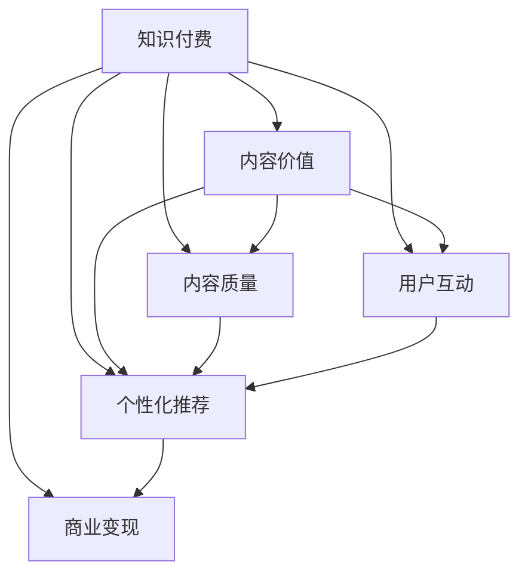

                 

# 知识付费创业中的内容价值提升

> 关键词：知识付费,内容价值,内容质量,用户互动,个性化推荐,内容优化,商业变现

## 1. 背景介绍

### 1.1 问题由来

随着互联网技术的发展和知识经济的崛起，知识付费已成为内容创业领域的新趋势。各类知识付费平台如雨后春笋般涌现，内容形式从文章、音频、视频到直播等日益多样化。然而，尽管内容付费用户群体不断扩大，如何提升内容价值，保持用户黏性，实现商业变现，成为知识付费创业成功的关键因素。

### 1.2 问题核心关键点

在知识付费行业中，内容价值的高低直接决定了用户的付费意愿和平台营收。高质量的内容不仅能提供有价值的知识，还能帮助用户建立长期信任关系，增加用户黏性。为了提升内容价值，平台需要从多个维度出发，包括内容质量提升、用户互动增强、个性化推荐优化等，才能在激烈的市场竞争中脱颖而出。

### 1.3 问题研究意义

提升知识付费平台的内容价值，不仅能够吸引更多用户订阅付费内容，还能通过高质量内容进行商业变现，实现平台的持续健康发展。内容价值提升能够提高用户满意度，提升品牌影响力，为平台带来更多商业合作机会。研究如何提升知识付费平台的内容价值，具有重要的理论和实际意义。

## 2. 核心概念与联系

### 2.1 核心概念概述

为更好地理解知识付费平台内容价值提升的策略，本节将介绍几个密切相关的核心概念：

- **知识付费**：用户为获取特定知识或技能而支付费用的模式，常见形式包括订阅、单次付费、会员制等。
- **内容价值**：内容对用户的实用性和吸引力，能够解决用户实际问题、提供新颖知识、满足用户情感需求等。
- **内容质量**：内容的专业性、准确性、逻辑性、原创性、更新频率等因素的综合体现。
- **用户互动**：用户与内容创作者之间的交流、反馈、评价等，能够提升用户对内容的认可度和满意度。
- **个性化推荐**：根据用户兴趣、行为等特征，智能推荐高质量内容，提升用户体验和平台留存率。
- **商业变现**：通过内容付费、广告、电商、增值服务等方式实现内容变现，增加平台收入。

这些核心概念之间的逻辑关系可以通过以下Mermaid流程图来展示：



这个流程图展示了几大核心概念及其之间的关系：

1. **知识付费**：基于内容价值和质量，通过用户互动提升用户粘性，并利用个性化推荐优化用户体验，最终实现商业变现。
2. **内容质量**：直接影响用户对内容的认可度和满意度，是提升内容价值的基础。
3. **用户互动**：通过用户反馈，增强内容创作和推荐的精准性，进一步提升内容价值。
4. **个性化推荐**：根据用户偏好，智能推荐高质量内容，提高用户满意度。
5. **商业变现**：通过多种方式实现内容变现，增强平台的盈利能力。

## 3. 核心算法原理 & 具体操作步骤
### 3.1 算法原理概述

提升知识付费平台的内容价值，核心在于优化内容质量、增强用户互动、优化个性化推荐。本节将从这三个方面分别介绍算法原理和具体操作步骤。

### 3.2 算法步骤详解

#### 3.2.1 内容质量提升

1. **内容审核机制**：建立严格的内容审核机制，确保内容符合平台规则和用户需求。
2. **专家评估**：引入行业专家和用户评分机制，对内容质量进行客观评估。
3. **数据驱动优化**：利用大数据分析，识别内容流量和互动高的主题，优化内容发布策略。

#### 3.2.2 用户互动增强

1. **社区建设**：构建用户社区，促进用户之间交流和讨论，增加平台活跃度。
2. **互动激励**：设置互动奖励机制，鼓励用户积极反馈和参与内容创作。
3. **内容迭代**：根据用户反馈，及时调整内容发布和推荐策略，提高内容相关性和质量。

#### 3.2.3 个性化推荐优化

1. **用户画像构建**：通过用户行为数据，构建用户画像，识别用户兴趣和需求。
2. **协同过滤推荐**：利用协同过滤算法，推荐相似用户喜欢的内容。
3. **内容特征提取**：对内容进行特征提取，识别核心关键词和主题，提升推荐精准度。
4. **深度学习推荐**：利用深度学习算法，对用户和内容进行建模，实现个性化推荐。

### 3.3 算法优缺点

#### 3.3.1 内容质量提升

**优点**：
1. **多角度评估**：综合考虑内容审核和专家评估，提供多角度的内容质量反馈。
2. **数据驱动优化**：通过大数据分析，精准识别高流量主题，优化内容发布策略。

**缺点**：
1. **审核成本高**：严格的内容审核机制需要大量人力物力投入。
2. **专家评估主观性**：专家评估可能受到主观因素影响，难以客观公正。

#### 3.3.2 用户互动增强

**优点**：
1. **用户粘性强**：通过社区建设和互动激励，增加用户粘性和平台活跃度。
2. **内容迭代快**：及时根据用户反馈调整内容策略，提升内容相关性和质量。

**缺点**：
1. **互动激励成本高**：设置互动奖励机制可能带来较高运营成本。
2. **社区管理复杂**：社区建设和管理需要持续投入，存在运营难度。

#### 3.3.3 个性化推荐优化

**优点**：
1. **推荐精准度高**：通过深度学习和大数据，实现高度个性化的内容推荐。
2. **用户满意度提升**：精准的推荐内容能满足用户需求，提升用户体验。

**缺点**：
1. **算法复杂度高**：深度学习算法需要较长的训练时间和计算资源。
2. **数据质量要求高**：推荐系统对数据质量要求高，需要大量准确的数据支持。

### 3.4 算法应用领域

提升知识付费平台的内容价值，不仅适用于在线教育、在线阅读、职场技能等领域，还广泛应用在企业培训、行业研究、个人兴趣等领域。具体应用场景包括：

1. **在线教育**：利用个性化推荐，为学生推荐适合的课程和资源，提高学习效果。
2. **在线阅读**：根据用户阅读习惯，推荐高质量文章和书籍，提升阅读体验。
3. **职场技能**：提供职业技能培训课程和资源，帮助用户提升职场竞争力。
4. **企业培训**：定制化培训内容，满足企业员工学习需求，提高员工技能水平。
5. **行业研究**：提供行业最新动态和研究报告，帮助专业人士获取前沿知识。
6. **个人兴趣**：推荐符合个人兴趣的内容，满足用户个性化的需求。

## 4. 数学模型和公式 & 详细讲解 & 举例说明

### 4.1 数学模型构建

为了实现个性化推荐，我们假设用户 $u$ 和内容 $i$ 的评分 $r_{ui}$ 遵循协同过滤模型的公式：

$$
r_{ui} = \alpha \sum_{j \in \mathcal{N}(u)} \frac{\hat{r}_{uj} r_{ij}}{\sigma(\hat{r}_{uj} + \epsilon_{ij})}
$$

其中 $\mathcal{N}(u)$ 是用户 $u$ 的邻居集合，$\hat{r}_{uj}$ 是用户 $u$ 对用户 $j$ 的评分预测，$\sigma$ 是sigmoid函数，$\epsilon_{ij}$ 是误差项。

在实际操作中，我们需要对模型进行优化，以适应不同业务场景和用户数据特点。常见的方法包括协同过滤、深度学习等。

### 4.2 公式推导过程

**协同过滤模型**：

1. **用户协同过滤**：通过相似用户对内容的评分，预测用户 $u$ 对内容 $i$ 的评分。
2. **物品协同过滤**：通过相似物品被用户 $u$ 的评分，预测用户 $u$ 对物品 $i$ 的评分。
3. **混合协同过滤**：结合用户协同过滤和物品协同过滤，提升推荐效果。

**深度学习模型**：

1. **基于神经网络的推荐模型**：利用深度神经网络，对用户和物品进行建模，实现个性化推荐。
2. **序列推荐模型**：利用序列数据，预测用户下一步可能选择的物品。
3. **内容嵌入模型**：对内容进行特征提取，嵌入高维空间，实现相似性匹配。

### 4.3 案例分析与讲解

#### 4.3.1 协同过滤模型

**案例**：某在线教育平台利用协同过滤模型为用户推荐课程。
**分析**：
1. **数据准备**：收集用户对课程的评分数据，构建用户和课程的评分矩阵。
2. **模型训练**：对评分矩阵进行分解，得到用户和课程的潜在特征向量。
3. **评分预测**：利用用户和课程的潜在特征向量，预测用户对课程的评分。
4. **推荐排序**：根据预测评分对课程进行排序，推荐给用户。

#### 4.3.2 深度学习模型

**案例**：某在线阅读平台利用深度学习模型为用户推荐书籍。
**分析**：
1. **数据预处理**：对用户行为数据进行特征提取，生成用户和书籍的特征向量。
2. **模型训练**：构建神经网络模型，对用户和书籍进行建模，优化推荐函数。
3. **推荐排序**：利用模型预测用户对书籍的兴趣度，进行推荐排序。
4. **效果评估**：在测试集上评估模型性能，优化模型参数。

## 5. 项目实践：代码实例和详细解释说明

### 5.1 开发环境搭建

在进行个性化推荐系统开发前，我们需要准备好开发环境。以下是使用Python进行PyTorch开发的环境配置流程：

1. 安装Anaconda：从官网下载并安装Anaconda，用于创建独立的Python环境。
2. 创建并激活虚拟环境：
```bash
conda create -n pytorch-env python=3.8 
conda activate pytorch-env
```

3. 安装PyTorch：根据CUDA版本，从官网获取对应的安装命令。例如：
```bash
conda install pytorch torchvision torchaudio cudatoolkit=11.1 -c pytorch -c conda-forge
```

4. 安装TensorFlow：由Google主导开发的开源深度学习框架，生产部署方便，适合大规模工程应用。同样有丰富的预训练语言模型资源。

5. 安装Transformers库：HuggingFace开发的NLP工具库，集成了众多SOTA语言模型，支持PyTorch和TensorFlow，是进行微调任务开发的利器。

6. 安装各类工具包：
```bash
pip install numpy pandas scikit-learn matplotlib tqdm jupyter notebook ipython
```

完成上述步骤后，即可在`pytorch-env`环境中开始微调实践。

### 5.2 源代码详细实现

这里我们以协同过滤模型为例，给出使用PyTorch进行推荐系统的代码实现。

首先，定义协同过滤模型的评分预测函数：

```python
import numpy as np
import torch
from sklearn.metrics.pairwise import cosine_similarity

def predict_ratings(user_matrix, item_matrix, user_idx, item_idx):
    user_scores = user_matrix[user_idx] @ item_matrix.T
    item_scores = item_matrix[item_idx] @ user_matrix.T
    ratings = np.dot(user_scores, item_scores)
    return ratings
```

然后，定义模型训练和推荐函数：

```python
def train_model(train_data, user_matrix, item_matrix):
    for epoch in range(num_epochs):
        for user_idx, user in train_data.items():
            for item_idx, item in user.items():
                ratings = predict_ratings(user_matrix, item_matrix, user_idx, item_idx)
                loss = F.mse_loss(torch.tensor(ratings), torch.tensor(user[item_idx]))
                optimizer.zero_grad()
                loss.backward()
                optimizer.step()
```

最后，启动模型训练和推荐流程：

```python
train_model(train_data, user_matrix, item_matrix)
predicted_ratings = predict_ratings(user_matrix, item_matrix, user_idx, item_idx)
sorted_indices = predicted_ratings.argsort()
top_recommendations = [item_idx for item_idx in sorted_indices[:n]]
```

### 5.3 代码解读与分析

让我们再详细解读一下关键代码的实现细节：

**协同过滤模型**：
- `predict_ratings`函数：计算用户和物品之间的协同过滤评分。
- `train_model`函数：利用优化器对评分预测函数进行训练，最小化预测评分与真实评分之间的均方误差。

**推荐排序**：
- `predict_ratings`函数：根据训练好的协同过滤模型，预测用户对物品的评分。
- `sorted_indices`：将预测评分排序，取前N个推荐给用户。

## 6. 实际应用场景

### 6.1 智能推荐系统

智能推荐系统是知识付费平台的核心功能，通过个性化推荐，提升用户满意度，增加用户粘性。推荐系统通常包括三大组件：用户画像、物品画像和推荐算法。通过协同过滤、深度学习等算法，根据用户行为数据，构建用户和物品的特征向量，实现个性化推荐。

### 6.2 课程推荐

在线教育平台利用推荐系统为用户推荐课程。通过分析用户学习历史、行为数据和课程特征，推荐用户可能感兴趣的课程。推荐系统能够提高课程的点击率和完成率，增加用户对平台的黏性。

### 6.3 内容分类

知识付费平台通过内容分类，将相似内容归为一类，提高内容的可发现性。例如，将同一主题的课程、文章、书籍归为一类，方便用户查找和浏览。

### 6.4 社区推荐

社区平台通过推荐系统，为社区用户推荐相似用户和热门帖子，增加用户互动和社区活跃度。推荐系统能够提升社区内容的多样性和丰富性，增强社区用户的粘性。

## 7. 工具和资源推荐

### 7.1 学习资源推荐

为了帮助开发者系统掌握推荐系统的理论和实践，这里推荐一些优质的学习资源：

1. 《推荐系统实战》系列博文：由大模型技术专家撰写，深入浅出地介绍了推荐系统的原理和应用场景。

2. CS231n《深度学习计算机视觉》课程：斯坦福大学开设的深度学习明星课程，涵盖推荐系统等前沿技术。

3. 《Deep Learning for Recommendation Systems》书籍：针对深度学习在推荐系统中的应用，提供详细案例分析和代码实现。

4. KDD比赛：Kaggle等平台上的推荐系统比赛，提供大量开源数据集和模型样例，助力推荐系统开发。

5. TensorFlow官方文档：TensorFlow的推荐系统模块，提供丰富的API和示例，方便快速上手。

通过对这些资源的学习实践，相信你一定能够快速掌握推荐系统的精髓，并用于解决实际的推荐问题。

### 7.2 开发工具推荐

高效的开发离不开优秀的工具支持。以下是几款用于推荐系统开发的常用工具：

1. PyTorch：基于Python的开源深度学习框架，灵活动态的计算图，适合快速迭代研究。大部分推荐系统有PyTorch版本的实现。

2. TensorFlow：由Google主导开发的开源深度学习框架，生产部署方便，适合大规模工程应用。同样有丰富的推荐系统资源。

3. TensorFlow推荐系统模块：TensorFlow配套的推荐系统工具库，提供了丰富的API和示例，方便推荐系统开发。

4. Weights & Biases：模型训练的实验跟踪工具，可以记录和可视化模型训练过程中的各项指标，方便对比和调优。与主流深度学习框架无缝集成。

5. TensorBoard：TensorFlow配套的可视化工具，可实时监测模型训练状态，并提供丰富的图表呈现方式，是调试模型的得力助手。

6. Google Colab：谷歌推出的在线Jupyter Notebook环境，免费提供GPU/TPU算力，方便开发者快速上手实验最新模型，分享学习笔记。

合理利用这些工具，可以显著提升推荐系统的开发效率，加快创新迭代的步伐。

### 7.3 相关论文推荐

推荐系统的发展源于学界的持续研究。以下是几篇奠基性的相关论文，推荐阅读：

1. The BellKor@CW11 Recommendation Challenge（即协同过滤算法）：提出协同过滤算法，为推荐系统奠定基础。

2. Parallel Co-training for Deep Learning: Exploiting Parallelism in Data（即并行协同训练）：提出并行协同训练算法，提高推荐系统训练效率。

3. Beyond Implicit Feedback（即深度推荐系统）：提出深度推荐系统，利用深度学习提升推荐精度。

4. Neural Collaborative Filtering：提出基于神经网络的推荐系统，实现个性化推荐。

5. Attention Is All You Need（即Transformer）：提出Transformer结构，引入自注意力机制，提升推荐系统效果。

这些论文代表了大模型推荐系统的发展脉络。通过学习这些前沿成果，可以帮助研究者把握学科前进方向，激发更多的创新灵感。

## 8. 总结：未来发展趋势与挑战

### 8.1 总结

本文对知识付费平台中的内容价值提升方法进行了全面系统的介绍。首先阐述了知识付费平台的背景和内容价值提升的重要性，明确了内容质量提升、用户互动增强、个性化推荐优化等核心问题。其次，从算法原理到具体操作步骤，详细讲解了协同过滤、深度学习等推荐系统实现技术。最后，探讨了推荐系统在实际应用中的场景，推荐资源和开发工具，展望了推荐系统的未来发展趋势。

通过本文的系统梳理，可以看到，提升知识付费平台的内容价值，需要从多个维度综合发力，内容质量提升是基础，用户互动增强和个性化推荐优化是关键。推荐系统需要结合业务特点和数据特性，灵活应用多种算法，才能实现理想的效果。

### 8.2 未来发展趋势

展望未来，知识付费平台的内容价值提升将呈现以下几个发展趋势：

1. **深度学习占据主导**：深度学习算法因其高精度、泛化能力强的特点，将成为推荐系统的主流技术。

2. **跨模态推荐兴起**：结合文本、图像、音频等多种模态数据，实现更加全面和精准的推荐。

3. **实时推荐系统**：利用实时数据流，实现个性化推荐系统的实时更新和推荐，提升用户体验。

4. **多任务学习**：利用多任务学习技术，实现推荐系统中的跨任务协同优化，提高推荐精度和效率。

5. **融合其他AI技术**：结合知识图谱、因果推理、强化学习等AI技术，提升推荐系统的智能水平和优化能力。

6. **优化推荐系统结构**：通过模型压缩、剪枝等技术，提高推荐系统的计算效率和可解释性。

以上趋势凸显了知识付费平台推荐系统的发展方向，这些方向的探索发展，必将进一步提升推荐系统的性能和应用范围，为知识付费平台带来更多商业机会和用户价值。

### 8.3 面临的挑战

尽管知识付费平台推荐系统已经取得了瞩目成就，但在迈向更加智能化、普适化应用的过程中，仍面临诸多挑战：

1. **数据质量问题**：推荐系统对数据质量要求高，数据缺失、噪声等问题可能影响推荐效果。

2. **模型可解释性不足**：深度学习模型往往黑盒化，难以解释其内部决策过程。

3. **推荐算法复杂度高**：深度学习模型训练复杂度高，需要大量计算资源和时间。

4. **用户隐私保护**：推荐系统需要收集用户行为数据，可能涉及用户隐私保护问题。

5. **多模态数据融合**：不同模态数据融合难度大，需要考虑数据一致性和模型适配性。

6. **实时推荐系统挑战**：实时数据流处理、模型更新和推理速度等问题，仍是技术难点。

7. **跨领域应用挑战**：知识付费平台推荐系统需要在不同领域中实现泛化，可能面临领域差异、数据分布不均等问题。

这些挑战需要推荐系统开发者不断优化算法和模型，加强用户隐私保护，提升推荐系统可解释性，才能实现更好的推荐效果和用户体验。

### 8.4 研究展望

面对知识付费平台推荐系统所面临的挑战，未来的研究需要在以下几个方面寻求新的突破：

1. **数据清洗与预处理**：利用数据清洗、补全、噪声过滤等技术，提升数据质量，减少数据对推荐系统的不良影响。

2. **可解释性研究**：结合符号化表示、因果分析等方法，提升推荐系统的可解释性和用户信任度。

3. **多模态推荐系统**：利用深度学习、知识图谱等技术，实现多模态数据的融合和推荐。

4. **实时推荐系统优化**：研究实时数据流的处理和推荐模型的增量更新，提升实时推荐系统的性能和效率。

5. **跨领域推荐系统**：结合领域知识、跨领域融合技术，提升推荐系统在不同领域中的泛化能力。

6. **推荐系统结构优化**：通过模型压缩、剪枝、参数共享等技术，提升推荐系统的计算效率和可解释性。

这些研究方向的探索，必将引领知识付费平台推荐系统迈向更高的台阶，为内容价值提升和用户体验优化带来新的突破。面向未来，推荐系统需要与其他AI技术进行更深入的融合，共同推动知识付费平台推荐系统的进步。只有勇于创新、敢于突破，才能不断拓展推荐系统的边界，让智能技术更好地造福用户。

## 9. 附录：常见问题与解答

**Q1：知识付费平台如何构建用户画像？**

A: 构建用户画像需要收集和分析用户的各类行为数据，包括浏览历史、购买记录、搜索行为、互动评价等。通过机器学习算法，识别用户的兴趣和需求，生成用户特征向量，构建用户画像。常见的用户画像构建方法包括协同过滤、深度学习等。

**Q2：如何提升推荐系统的实时性？**

A: 提升推荐系统的实时性需要优化数据流处理和模型增量更新。采用流式数据处理框架，如Apache Kafka、Apache Flink等，实现实时数据流处理。利用增量学习算法，如在线梯度下降，实现模型增量更新，减少计算延迟。

**Q3：推荐系统如何处理用户隐私问题？**

A: 处理用户隐私问题需要采用数据匿名化、差分隐私等技术，减少对用户数据的直接访问。在推荐模型中，可以加入隐私保护技术，如差分隐私、联邦学习等，确保用户数据安全。

**Q4：推荐系统如何提升可解释性？**

A: 提升推荐系统的可解释性需要结合符号化表示、因果分析等方法，解释推荐系统的决策过程。利用可解释性算法，如LIME、SHAP等，生成推荐系统的特征重要性解释。

**Q5：推荐系统如何提升跨领域泛化能力？**

A: 提升跨领域泛化能力需要结合领域知识、跨领域融合技术，如知识图谱、领域特定信息提取等，提高推荐系统在不同领域中的泛化能力。利用多任务学习、迁移学习等方法，实现跨领域推荐的优化。

这些问题的解答，能为知识付费平台推荐系统的开发者提供实用的指导，帮助他们在实际应用中解决具体的技术问题，提升推荐系统的性能和用户体验。

---

作者：禅与计算机程序设计艺术 / Zen and the Art of Computer Programming

