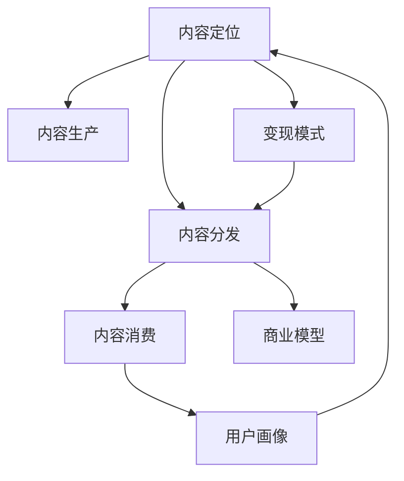

                 

# 知识付费创业中的内容价值最大化

## 1. 背景介绍

### 1.1 问题由来
知识付费领域自2015年以来，随着互联网的发展和普及，用户对于个性化、定制化学习内容的需求日益增长。传统教育模式逐渐向知识付费模式转型，从单一的学术教育扩展到各种领域的知识分享与消费。知识付费模式本质上是一种新兴的经济活动，旨在通过付费机制将有价值的内容传递给有需求的消费者，同时也激励了内容生产者持续提供高质量的内容。

然而，在知识付费创业的过程中，如何最大化内容价值、提升用户体验、构建可持续发展的商业模式成为核心的挑战。尤其是内容价值最大化这一环节，往往涉及诸多复杂因素，如内容定位、用户画像、价格策略、运营机制等。本文将从内容价值最大化的角度，探讨知识付费创业中的核心问题，并通过实际案例进行剖析。

### 1.2 问题核心关键点
知识付费创业中，内容价值最大化涉及以下几个核心关键点：

1. **内容定位与用户需求匹配**：精准定位内容，满足用户需求是实现内容价值最大化的基础。
2. **内容质量与生产效率**：确保内容高质量的同时，提升内容生产效率，实现规模化内容生产。
3. **用户互动与反馈机制**：建立有效的用户互动与反馈机制，优化内容和服务，提升用户体验。
4. **变现模式与商业模型**：构建多渠道、多层次的变现模式，确保内容的经济价值最大化。
5. **技术支撑与创新**：利用先进技术，提升内容生产、分发、消费的效率和体验，驱动内容价值最大化。

这些核心关键点共同构成了知识付费创业中的内容价值最大化策略。

## 2. 核心概念与联系

### 2.1 核心概念概述

为更好地理解知识付费创业中的内容价值最大化，本节将介绍几个密切相关的核心概念：

- **内容定位**：根据用户需求和市场趋势，确定内容的主题、形式和呈现方式。
- **内容生产**：通过技术或专业团队，将内容创意转化为具体内容作品的过程。
- **内容分发**：将内容作品通过合适渠道传递给目标用户的过程。
- **内容消费**：用户对内容作品的直接或间接使用，包括学习、娱乐、社交等。
- **用户画像**：根据用户行为数据构建的用户特征模型，用于内容个性化推荐和用户精准营销。
- **变现模式**：内容变现的方式，包括单次付费、订阅制、广告、流量分成等。
- **商业模型**：知识付费平台的核心盈利模式，包括会员制、课程销售、内容电商等。

这些核心概念之间的逻辑关系可以通过以下Mermaid流程图来展示：



这个流程图展示的内容定位、内容生产、内容分发、内容消费、用户画像、变现模式和商业模型共同构成了知识付费创业的内容价值最大化过程，其中每一步都直接影响着内容的价值和平台的发展。

## 3. 核心算法原理 & 具体操作步骤

### 3.1 算法原理概述

知识付费创业中的内容价值最大化，本质上是通过优化内容的生产、分发、消费过程，实现内容和用户的最佳匹配，进而最大化内容的经济价值和社会价值。这一过程可以通过以下步骤来实现：

1. **用户画像建模**：通过分析用户行为数据，构建用户画像，识别用户需求和偏好。
2. **内容定位与个性化推荐**：根据用户画像，定位合适的内容主题和形式，并利用推荐算法进行个性化推荐。
3. **内容生产与质量控制**：通过内容生产平台或专业团队，高效生产高质量内容，并建立内容质量控制机制。
4. **内容分发与渠道优化**：选择合适的分发渠道，并优化分发策略，确保内容能够到达目标用户。
5. **内容消费与用户反馈**：通过用户反馈机制，了解用户对内容的满意度，优化内容和服务。
6. **变现模式设计**：结合用户行为和内容价值，设计合理的变现模式，最大化内容的经济收益。
7. **商业模型构建**：将变现模式与平台策略结合，构建完整商业模型，实现平台的可持续发展。

### 3.2 算法步骤详解

**Step 1: 用户画像建模**
- 收集用户行为数据：如浏览历史、购买记录、学习时长等。
- 分析用户特征：通过聚类、分类等方法，提取用户的基本特征，如兴趣、年龄、职业等。
- 构建用户画像：使用机器学习算法，如决策树、随机森林等，构建用户画像模型，为内容推荐提供依据。

**Step 2: 内容定位与个性化推荐**
- 确定内容主题与形式：根据市场趋势和用户需求，确定内容的主题、形式和呈现方式。
- 使用推荐算法：如协同过滤、内容嵌入等，将用户画像与内容特征进行匹配，生成个性化推荐列表。
- 实时调整推荐：根据用户反馈和行为变化，实时调整推荐策略，优化推荐效果。

**Step 3: 内容生产与质量控制**
- 建立内容生产平台：引入专业团队和先进技术，提升内容生产效率。
- 制定内容质量标准：建立内容质量评估体系，确保内容的高质量和高价值。
- 进行内容审查与监管：使用NLP等技术，进行内容质量检测，防止低质量内容上线。

**Step 4: 内容分发与渠道优化**
- 选择合适的分发渠道：如App、网页、社交媒体等，将内容传递给目标用户。
- 优化分发策略：根据用户画像和内容特征，调整分发策略，提升分发效果。
- 提高分发效率：利用先进技术，如CDN、缓存等，提高内容分发效率。

**Step 5: 内容消费与用户反馈**
- 收集用户反馈：通过问卷调查、评价系统等，收集用户对内容的反馈信息。
- 分析用户满意度：使用情感分析、文本挖掘等技术，分析用户反馈，了解用户满意度。
- 优化内容与服务：根据用户反馈，优化内容和服务，提升用户体验。

**Step 6: 变现模式设计**
- 设计变现策略：根据用户行为和内容价值，设计合理的变现策略，如单次付费、订阅制、广告等。
- 制定价格政策：根据市场竞争和用户需求，制定合理的价格政策，确保变现效益。
- 多渠道变现：通过多渠道变现，实现内容的最大化经济收益。

**Step 7: 商业模型构建**
- 结合平台策略：将内容生产、分发、消费与变现策略结合，构建完整的商业模型。
- 设计盈利模式：选择适合的盈利模式，如会员制、课程销售等，实现平台的可持续发展。
- 实现财务目标：确保商业模型能够实现平台的财务目标，并不断优化和调整。

### 3.3 算法优缺点

知识付费创业中的内容价值最大化方法具有以下优点：
1. 精准匹配用户需求：通过用户画像和个性化推荐，能够精准匹配用户需求，提升内容的相关性和价值。
2. 高效生产高质量内容：通过内容生产平台和质量控制机制，能够高效生产高质量内容，提升内容的吸引力。
3. 实时优化分发策略：通过实时调整推荐策略和分发策略，能够提高内容的到达率和消费效果。
4. 灵活设计变现模式：根据市场和用户需求，设计多种变现模式，实现内容的经济最大化。

同时，该方法也存在一些局限性：
1. 依赖数据质量：用户画像和推荐系统的准确性依赖于高质量的数据。数据不足或质量差会导致推荐效果不佳。
2. 成本较高：高质量内容的生产、分发和运营需要大量资源投入，成本较高。
3. 用户粘性难以保证：难以保证用户长期粘性，容易流失。
4. 市场风险较大：市场竞争激烈，用户需求变化快，市场风险较大。

尽管存在这些局限性，但总体而言，内容价值最大化方法是知识付费创业中不可或缺的一部分，通过合理的策略和工具，可以有效提升内容的经济价值和社会价值。

### 3.4 算法应用领域

知识付费创业中的内容价值最大化方法，已经在多个领域得到了广泛的应用，例如：

1. **在线教育**：通过个性化推荐和内容优化，提升学习效果和用户体验。
2. **职业技能培训**：提供高质量的课程内容，帮助用户提升职业技能，实现职业发展。
3. **生活知识分享**：提供实用的生活知识和技能，提升用户的生活品质。
4. **娱乐内容创作**：提供优质娱乐内容，满足用户的娱乐需求。
5. **专业领域研究**：提供专业领域的深度内容，帮助用户进行深入研究和学习。

除了上述这些经典领域外，内容价值最大化方法也被创新性地应用到更多场景中，如智能导购、健康管理、金融知识普及等，为知识付费创业提供了更多的发展空间。

## 4. 数学模型和公式 & 详细讲解 & 举例说明

### 4.1 数学模型构建

本节将使用数学语言对知识付费创业中的内容价值最大化进行更加严格的刻画。

记用户集合为 $U$，内容集合为 $C$，用户画像模型为 $P: U \rightarrow \mathbb{R}^d$，其中 $d$ 为特征维度。内容特征向量为 $X: C \rightarrow \mathbb{R}^m$，其中 $m$ 为特征维度。内容推荐系统为 $R: (P(U), X(C)) \rightarrow [0,1]^n$，其中 $n$ 为用户数量。推荐系统的目标是最小化预测误差 $L(R)$，即：

$$
\min_{R} L(R) = \frac{1}{N} \sum_{u \in U} \sum_{c \in C} \|R(P(u), X(c)) - y_{uc}\|^2
$$

其中 $y_{uc} \in \{0,1\}$ 为内容 $c$ 是否被用户 $u$ 消费的标签。

### 4.2 公式推导过程

以下我们以协同过滤推荐系统为例，推导推荐算法的计算公式。

假设推荐系统使用协同过滤算法，对用户 $u$ 推荐内容 $c$，推荐结果为 $R(P(u), X(c))$，根据余弦相似度计算推荐结果：

$$
R(P(u), X(c)) = \frac{\langle P(u), X(c) \rangle}{\|P(u)\| \cdot \|X(c)\|}
$$

其中 $\langle \cdot, \cdot \rangle$ 表示向量的点积，$\|\cdot\|$ 表示向量的范数。

为了最小化预测误差，使用均方误差损失函数：

$$
L(R) = \frac{1}{N} \sum_{u \in U} \sum_{c \in C} (R(P(u), X(c)) - y_{uc})^2
$$

通过求解上述优化问题，可以确定推荐系统的参数，使得推荐结果尽可能接近实际消费情况。

### 4.3 案例分析与讲解

以在线教育平台Coursera为例，分析其内容价值最大化策略。

1. **用户画像建模**：Coursera通过分析用户注册信息、课程购买记录、学习行为等数据，构建用户画像。
2. **内容定位与个性化推荐**：根据用户画像，Coursera使用协同过滤算法，为用户推荐相关的课程和专项课程，提升学习效果。
3. **内容生产与质量控制**：Coursera通过与全球顶尖大学和机构合作，生产高质量课程内容，并建立严格的课程质量审核机制。
4. **内容分发与渠道优化**：Coursera在App、网页、邮件等多个渠道分发课程内容，并根据用户行为调整分发策略。
5. **内容消费与用户反馈**：Coursera通过课程评价、学习进度反馈等方式，收集用户反馈，优化课程内容和学习体验。
6. **变现模式设计**：Coursera通过课程销售、会员制、广告等多种变现模式，实现平台的可持续发展。
7. **商业模型构建**：Coursera结合内容生产、分发、消费与变现策略，构建完整的商业模型，实现平台的长期发展。

通过Coursera的例子，可以看到，内容价值最大化方法在知识付费创业中能够发挥巨大的作用，提升内容的用户价值和经济价值。

## 5. 项目实践：代码实例和详细解释说明

### 5.1 开发环境搭建

在进行知识付费创业的内容价值最大化实践前，我们需要准备好开发环境。以下是使用Python进行PyTorch开发的环境配置流程：

1. 安装Anaconda：从官网下载并安装Anaconda，用于创建独立的Python环境。

2. 创建并激活虚拟环境：
```bash
conda create -n pytorch-env python=3.8 
conda activate pytorch-env
```

3. 安装PyTorch：根据CUDA版本，从官网获取对应的安装命令。例如：
```bash
conda install pytorch torchvision torchaudio cudatoolkit=11.1 -c pytorch -c conda-forge
```

4. 安装其他必要的库：
```bash
pip install numpy pandas scikit-learn sklearn-utils gensim
```

完成上述步骤后，即可在`pytorch-env`环境中开始内容价值最大化实践。

### 5.2 源代码详细实现

这里我们以构建一个简单的协同过滤推荐系统为例，给出使用PyTorch进行内容推荐开发的PyTorch代码实现。

首先，定义用户画像和内容特征的表示方式：

```python
import torch
import torch.nn as nn
from sklearn.metrics.pairwise import cosine_similarity

class UserEmbedding(nn.Module):
    def __init__(self, num_users, embedding_dim):
        super(UserEmbedding, self).__init__()
        self.embedding = nn.Embedding(num_users, embedding_dim)

    def forward(self, user_ids):
        user_embeddings = self.embedding(user_ids)
        return user_embeddings

class ItemEmbedding(nn.Module):
    def __init__(self, num_items, embedding_dim):
        super(ItemEmbedding, self).__init__()
        self.embedding = nn.Embedding(num_items, embedding_dim)

    def forward(self, item_ids):
        item_embeddings = self.embedding(item_ids)
        return item_embeddings

# 构建用户画像和内容特征
user_embedding = UserEmbedding(num_users, embedding_dim)
item_embedding = ItemEmbedding(num_items, embedding_dim)
```

然后，定义推荐系统的参数和模型：

```python
# 定义模型参数
num_factors = 100
num_users = 10000
num_items = 1000
embedding_dim = 100

# 定义协同过滤推荐模型
class CollaborativeFiltering(nn.Module):
    def __init__(self, num_factors, num_users, num_items, embedding_dim):
        super(CollaborativeFiltering, self).__init__()
        self.num_factors = num_factors
        self.num_users = num_users
        self.num_items = num_items
        self.embedding_dim = embedding_dim

        # 定义参数
        self.user_factors = nn.Embedding(num_users, num_factors)
        self.item_factors = nn.Embedding(num_items, num_factors)
        self.user_bias = nn.Parameter(torch.zeros(num_users))
        self.item_bias = nn.Parameter(torch.zeros(num_items))

        # 定义评分矩阵
        self.W_u = nn.Parameter(torch.empty(num_users, num_factors, num_items))
        self.W_i = nn.Parameter(torch.empty(num_items, num_factors, num_users))

    def forward(self, user_ids, item_ids):
        # 获取用户和物品的嵌入表示
        user_embeddings = self.user_factors(user_ids)
        item_embeddings = self.item_factors(item_ids)

        # 计算预测评分
        pred_scores = self.predict_scores(user_embeddings, item_embeddings)

        # 输出预测评分
        return pred_scores

    def predict_scores(self, user_embeddings, item_embeddings):
        user_factors = self.user_factors.weight
        item_factors = self.item_factors.weight

        # 计算预测评分
        user_factors_u = user_factors[user_ids]
        user_factors_i = user_factors_i[user_ids]
        item_factors_u = item_factors_i[item_ids]
        item_factors_i = item_factors_i[item_ids]

        # 预测评分
        pred_scores = torch.matmul(user_factors_u, item_factors_i.t()) + self.user_bias[user_ids].unsqueeze(-1) + self.item_bias[item_ids].unsqueeze(-1)
        return pred_scores
```

最后，定义推荐系统的训练和评估函数：

```python
from sklearn.metrics import mean_squared_error

def train_epoch(model, user_ids, item_ids, ratings, optimizer):
    # 将用户和物品的嵌入表示进行计算
    user_embeddings = user_embedding(user_ids)
    item_embeddings = item_embedding(item_ids)

    # 将预测评分与实际评分进行对比
    pred_scores = model(user_ids, item_ids)
    mse_loss = mean_squared_error(ratings, pred_scores)

    # 反向传播并更新模型参数
    optimizer.zero_grad()
    mse_loss.backward()
    optimizer.step()

    # 输出损失值
    return mse_loss.item()

def evaluate(model, user_ids, item_ids, ratings):
    # 将用户和物品的嵌入表示进行计算
    user_embeddings = user_embedding(user_ids)
    item_embeddings = item_embedding(item_ids)

    # 将预测评分与实际评分进行对比
    pred_scores = model(user_ids, item_ids)

    # 计算均方误差
    mse_loss = mean_squared_error(ratings, pred_scores)

    # 输出均方误差
    return mse_loss.item()
```

启动训练流程并在测试集上评估：

```python
# 定义优化器
optimizer = torch.optim.Adam(model.parameters(), lr=0.01)

# 定义训练和测试数据集
train_data = ...
test_data = ...

# 定义训练和测试过程
for epoch in range(num_epochs):
    train_loss = train_epoch(model, train_data['user_ids'], train_data['item_ids'], train_data['ratings'], optimizer)
    print(f"Epoch {epoch+1}, train loss: {train_loss:.3f}")
    
    print(f"Epoch {epoch+1}, test results:")
    test_loss = evaluate(model, test_data['user_ids'], test_data['item_ids'], test_data['ratings'])
    print(f"Test loss: {test_loss:.3f}")
```

以上就是使用PyTorch构建协同过滤推荐系统的完整代码实现。可以看到，通过PyTorch封装好的推荐系统模型，我们能够快速地实现推荐算法的开发和训练。

### 5.3 代码解读与分析

让我们再详细解读一下关键代码的实现细节：

**UserEmbedding和ItemEmbedding类**：
- 定义了用户和物品的嵌入表示，通过嵌入层将ID映射到低维向量空间中，方便进行计算。

**CollaborativeFiltering类**：
- 定义了协同过滤推荐模型，包括用户和物品的因子矩阵、偏置项以及评分矩阵等。
- 通过计算用户和物品的嵌入表示，预测评分矩阵中的每个元素。

**train_epoch和evaluate函数**：
- 训练函数`train_epoch`：对训练集进行迭代，计算预测评分与实际评分之间的均方误差，并进行反向传播更新模型参数。
- 评估函数`evaluate`：对测试集进行迭代，计算预测评分与实际评分之间的均方误差，并返回评估结果。

**训练流程**：
- 定义优化器，用于更新模型参数。
- 定义训练和测试数据集，并进行模型训练和评估。
- 在每个epoch结束后，输出训练和测试的损失值，评估模型效果。

可以看到，通过PyTorch框架，我们可以快速实现推荐算法的开发和训练，并输出模型效果，便于进一步优化和改进。

## 6. 实际应用场景

### 6.1 智能导购平台

智能导购平台通过内容价值最大化方法，将商品推荐与个性化内容推荐相结合，提升用户购买体验和转化率。具体而言，平台可以根据用户的历史购买记录、浏览行为、评价反馈等数据，构建用户画像，并根据用户画像进行商品推荐和内容推荐，形成完整的购物体验闭环。例如，通过推荐系统推荐相关商品，同时提供商品评价、用户评论等丰富信息，帮助用户做出决策。

### 6.2 健康管理应用

健康管理应用通过内容价值最大化方法，提供个性化的健康指导和专业内容推荐，提升用户健康意识和健康管理效果。平台可以结合用户健康数据、生活习惯等信息，构建健康画像，并根据健康画像进行健康内容推荐，如饮食建议、运动指导、疾病预防等。通过个性化推荐，提升用户对健康内容的关注度和使用率。

### 6.3 金融知识普及平台

金融知识普及平台通过内容价值最大化方法，提供丰富的金融知识和理财建议，提升用户金融素养和投资能力。平台可以结合用户投资行为、风险偏好等信息，构建用户画像，并根据用户画像进行金融内容推荐，如投资策略、市场分析、风险管理等。通过个性化推荐，帮助用户进行更加理性的投资决策。

### 6.4 未来应用展望

随着知识付费创业的不断发展和用户需求的多样化，内容价值最大化方法将得到更广泛的应用，以下是未来应用展望：

1. **全场景内容推荐**：结合多模态数据，提供跨领域的个性化内容推荐，如视频、音频、文本等。
2. **智能客服系统**：通过内容价值最大化方法，提升智能客服系统的回答质量和用户满意度。
3. **社交网络平台**：结合用户画像和内容价值最大化方法，提供高质量的社交内容推荐，增强平台粘性。
4. **在线教育平台**：通过内容价值最大化方法，提升课程推荐和学习效果，提供更加个性化的教育体验。
5. **智能家居应用**：通过内容价值最大化方法，提供个性化的家居建议和智能内容推荐，提升用户生活品质。

## 7. 工具和资源推荐

### 7.1 学习资源推荐

为了帮助开发者系统掌握知识付费创业中的内容价值最大化方法，这里推荐一些优质的学习资源：

1. 《推荐系统实战》书籍：详细介绍推荐系统原理和实现方法，涵盖协同过滤、矩阵分解、深度学习等多种推荐算法。
2. Coursera的《推荐系统课程》：由斯坦福大学教授讲授，涵盖推荐系统基础、协同过滤、深度学习等多个方面，适合深入学习。
3. Kaggle的推荐系统竞赛：通过实际竞赛，练习和提高推荐系统的设计和优化能力。
4. PyTorch官方文档：PyTorch框架的官方文档，提供丰富的教程和样例代码，适合快速上手和实践。
5. NLP速查表：提供自然语言处理相关工具和库的快速查找和使用方法，适合快速学习和开发。

通过对这些资源的学习实践，相信你一定能够系统掌握内容价值最大化的方法，并应用于知识付费创业中。

### 7.2 开发工具推荐

高效的开发离不开优秀的工具支持。以下是几款用于知识付费创业中内容价值最大化开发的常用工具：

1. Jupyter Notebook：交互式编程环境，方便进行数据处理和模型训练。
2. TensorBoard：可视化工具，用于监控模型训练状态和性能。
3. Weights & Biases：模型训练的实验跟踪工具，可以记录和可视化模型训练过程中的各项指标。
4. Annoy：高效向量空间索引库，用于加速相似度计算。
5. Scikit-learn：机器学习库，提供丰富的算法和工具，适合快速搭建推荐系统。

合理利用这些工具，可以显著提升知识付费创业中内容价值最大化方法的开发效率，加快创新迭代的步伐。

### 7.3 相关论文推荐

知识付费创业中的内容价值最大化方法涉及到机器学习、数据挖掘、自然语言处理等多个领域，以下是几篇奠基性的相关论文，推荐阅读：

1. Surprise：Python推荐系统库，提供丰富的算法和工具，适合快速搭建推荐系统。
2. The Bellkhop of Recommendation Systems: A User Study and Comparative Evaluation of Recommendation Algorithms：通过用户研究对比多种推荐算法的效果，提供推荐系统优化方法。
3. Matrix Factorization Techniques for Recommender Systems：介绍矩阵分解推荐算法，深入分析算法原理和实现方法。
4. Deep Personalized Recommendation Using User-Item Matrix Factorization：介绍深度学习推荐系统，提供推荐系统优化方法。
5. Knowledge-Intensive Recommendation Systems：结合知识图谱、领域知识等多模态数据，提升推荐系统效果。

这些论文代表了大数据和人工智能在推荐系统中的应用前沿，通过学习这些前沿成果，可以帮助研究者把握学科前进方向，激发更多的创新灵感。

## 8. 总结：未来发展趋势与挑战

### 8.1 总结

本文对知识付费创业中的内容价值最大化进行了全面系统的介绍。首先，阐述了知识付费创业的背景和意义，明确了内容价值最大化在提升用户体验和平台盈利中的重要性。其次，从原理到实践，详细讲解了内容价值最大化的数学模型和关键步骤，给出了内容推荐系统的完整代码实例。同时，本文还探讨了内容价值最大化方法在多个领域的应用前景，展示了其在知识付费创业中的巨大潜力。

通过本文的系统梳理，可以看到，内容价值最大化方法是知识付费创业中不可或缺的一部分，通过合理的策略和工具，可以有效提升内容的经济价值和社会价值。未来，伴随技术的发展和应用的推广，内容价值最大化方法将在更多领域得到应用，为知识付费创业带来新的机遇和挑战。

### 8.2 未来发展趋势

展望未来，知识付费创业中的内容价值最大化方法将呈现以下几个发展趋势：

1. **多模态内容推荐**：结合多模态数据，提供跨领域的个性化内容推荐，如视频、音频、文本等。
2. **深度学习推荐**：利用深度学习技术，提升推荐系统的准确性和效果。
3. **实时推荐系统**：通过实时数据处理和推荐算法优化，实现实时内容推荐，提升用户体验。
4. **跨平台内容推荐**：结合不同平台的用户数据，提供跨平台的内容推荐，提升用户粘性。
5. **推荐算法优化**：结合领域知识，优化推荐算法，提升推荐效果和推荐质量。

这些趋势凸显了内容价值最大化方法的广阔前景。这些方向的探索发展，必将进一步提升内容推荐系统的性能和用户体验，推动知识付费创业迈向新的高度。

### 8.3 面临的挑战

尽管知识付费创业中的内容价值最大化方法已经取得了不少进展，但在迈向更加智能化、普适化应用的过程中，它仍面临着诸多挑战：

1. **数据质量问题**：用户数据质量差、数据不完整等问题，导致推荐系统效果不佳。
2. **模型复杂度**：复杂推荐算法需要大量计算资源，难以在大规模数据集上运行。
3. **隐私保护**：用户数据隐私保护和用户行为分析之间的平衡，是推荐系统面临的重要挑战。
4. **推荐偏见**：推荐系统容易产生推荐偏见，影响用户体验和平台公平性。
5. **用户粘性难以保证**：难以保证用户长期粘性，容易流失。

尽管存在这些挑战，但通过不断优化推荐算法和改进数据质量，这些挑战是可以逐步克服的。知识付费创业中，内容价值最大化方法需要结合实际需求和用户行为，不断迭代和优化，方能实现理想的效果。

### 8.4 研究展望

面对知识付费创业中内容价值最大化所面临的诸多挑战，未来的研究需要在以下几个方面寻求新的突破：

1. **数据增强和数据清洗**：提升数据质量，增强推荐系统效果。
2. **轻量化推荐算法**：开发轻量级推荐算法，降低计算复杂度，实现大规模数据集上的实时推荐。
3. **隐私保护和用户权益**：研究隐私保护技术，提升用户数据安全性。
4. **推荐算法公平性**：优化推荐算法，减少推荐偏见，提升推荐公平性。
5. **用户行为分析**：深入分析用户行为，提升推荐系统效果和用户体验。

这些研究方向的探索，必将引领知识付费创业中内容价值最大化方法迈向更高的台阶，为知识付费创业带来新的突破和创新。

## 9. 附录：常见问题与解答

**Q1：内容价值最大化方法在知识付费创业中的关键点是什么？**

A: 内容价值最大化方法在知识付费创业中的关键点在于精准匹配用户需求、高效生产高质量内容、实时优化分发策略、设计合理的变现模式和构建完整的商业模型。这些关键点共同构成了内容价值最大化的策略，能够在用户和内容之间建立最佳的匹配关系，提升内容的经济价值和社会价值。

**Q2：推荐系统如何平衡推荐效果和用户隐私保护？**

A: 推荐系统可以通过以下方法平衡推荐效果和用户隐私保护：
1. 数据匿名化：对用户数据进行匿名化处理，保护用户隐私。
2. 数据最小化：只收集必要的用户数据，减少隐私风险。
3. 用户控制：让用户自行选择是否共享数据，并提供数据删除和修改功能。
4. 数据加密：对用户数据进行加密处理，防止数据泄露。

**Q3：推荐系统如何处理推荐偏见问题？**

A: 推荐系统可以通过以下方法处理推荐偏见问题：
1. 数据平衡：确保训练数据中包含各种类型的用户行为和内容特征，避免偏见。
2. 公平性算法：使用公平性算法，减少推荐偏见。
3. 用户反馈：收集用户反馈，及时调整推荐策略，避免推荐偏见。

**Q4：推荐系统如何提升用户粘性？**

A: 推荐系统可以通过以下方法提升用户粘性：
1. 个性化推荐：根据用户行为和偏好，提供个性化的推荐内容。
2. 互动机制：通过互动机制，提升用户参与度和粘性。
3. 社区建设：建立社区，增强用户之间的交流和粘性。
4. 激励机制：通过激励机制，鼓励用户持续使用平台。

通过这些方法，推荐系统可以提升用户粘性，减少用户流失。

**Q5：推荐系统如何应对市场竞争和用户需求变化？**

A: 推荐系统可以通过以下方法应对市场竞争和用户需求变化：
1. 动态调整策略：根据市场变化和用户需求，动态调整推荐策略。
2. 多渠道分发：通过多渠道分发内容，提升内容的到达率和覆盖率。
3. 持续创新：不断创新推荐算法和内容形式，保持平台的竞争力。

通过这些方法，推荐系统可以应对市场竞争和用户需求变化，保持平台的长久发展。

---

作者：禅与计算机程序设计艺术 / Zen and the Art of Computer Programming

