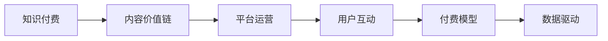

                 

# 知识付费创业中的内容价值链构建

> 关键词：知识付费,内容价值链,平台运营,用户互动,付费模型,数据驱动

## 1. 背景介绍

在知识经济的时代，内容成为最核心的资产之一。无论是传统出版业还是互联网创业，内容都是用户获取价值的主要渠道。在知识付费兴起的新浪潮下，内容创业更是迎来了新的黄金机遇期。然而，如何构建高效的内容价值链，实现优质内容的最大化价值，成为知识付费创业的关键问题。本文将从内容价值链的构建和运营的视角，探讨知识付费创业中的核心策略和方法。

## 2. 核心概念与联系

### 2.1 核心概念概述

本节将介绍几个核心概念及其相互关系：

- **知识付费**：指用户为获取专业、系统、深度的知识内容而支付费用的商业模式。与传统免费获取内容相比，知识付费强调内容价值，用户支付的不仅仅是货币，更是对知识和信任的支付。

- **内容价值链**：指从内容创作、分发、运营、变现到用户获取的全链条过程。在这个过程中，每个环节都蕴含着价值的传递和增值。构建高效的内容价值链，是知识付费创业成功的关键。

- **平台运营**：指通过搭建和管理线上平台，为内容创作者和用户提供互动交流和价值交换的场所。运营的好坏直接关系到内容价值链的顺畅程度和用户满意度。

- **用户互动**：指内容创作者与用户之间的交流和反馈。高互动性是知识付费的核心优势之一，可以促进内容价值的最大化释放。

- **付费模型**：指如何设计和优化用户支付内容的机制。不同的付费模型会影响用户支付意愿和内容价值链的循环效率。

- **数据驱动**：指以数据分析为依据，指导内容价值链的运营决策。数据驱动可以显著提升运营效率和效果，降低风险。

这些核心概念共同构成了知识付费创业的框架，通过理解这些概念，我们可以更好地把握知识付费的运营逻辑和价值转化路径。

### 2.2 核心概念原理和架构的 Mermaid 流程图



这张流程图展示了核心概念之间的逻辑关系：

1. **知识付费**：起因和基础，指用户愿意为优质内容支付费用的商业模式。
2. **内容价值链**：核心流程，涵盖内容创作、分发、运营、变现到用户获取的全过程。
3. **平台运营**：关键环节，通过搭建和管理平台，实现内容价值链的流畅运作。
4. **用户互动**：重要手段，通过增强互动性，提升用户满意度和忠诚度。
5. **付费模型**：关键策略，设计合理的付费模型，驱动用户支付。
6. **数据驱动**：重要支撑，通过数据分析，指导运营决策，提升运营效果。

这些环节相互影响，构成了一个完整的知识付费创业体系。

## 3. 核心算法原理 & 具体操作步骤

### 3.1 算法原理概述

知识付费的内容价值链构建，主要基于以下几大核心算法原理：

- **内容推荐算法**：根据用户行为数据和兴趣模型，推荐优质内容，提升用户满意度。
- **付费转化算法**：设计激励机制，提高用户支付意愿，增加变现效率。
- **用户行为分析算法**：通过分析用户行为数据，优化内容运营策略，提升平台粘性。
- **数据驱动决策算法**：基于数据分析结果，指导运营决策，提升运营效果。

这些算法原理共同作用，构建起高效的内容价值链。

### 3.2 算法步骤详解

构建高效的内容价值链，需要经过以下几个关键步骤：

**Step 1: 内容定位与评估**
- 收集用户反馈和行为数据，分析用户兴趣和需求。
- 评估内容的价值和吸引力，确定核心内容方向和主题。

**Step 2: 内容创作与优化**
- 邀请专家、学者等进行内容创作，保证内容的深度和专业性。
- 使用内容推荐算法，优化内容的发布时机和频率，提升用户点击率。

**Step 3: 内容分发与运营**
- 通过平台运营，搭建高效的内容分发渠道，如图文、视频、音频等。
- 使用用户行为分析算法，实时监控和调整内容分发策略，提升用户粘性。

**Step 4: 内容变现与激励**
- 设计合理的付费模型，如订阅制、按需购买、免费试用等。
- 通过付费转化算法，提高用户支付转化率，增加变现收入。

**Step 5: 数据分析与决策**
- 收集平台运营数据，使用数据驱动决策算法，分析运营效果。
- 根据分析结果，调整运营策略，优化内容价值链。

通过这些步骤，可以实现内容价值链的高效构建和运营，提升知识付费创业的效果。

### 3.3 算法优缺点

构建内容价值链的算法具有以下优点：

- 提高用户满意度：通过个性化推荐和优化分发策略，提升用户对内容的满意度。
- 增加变现效率：通过有效的付费模型设计，提高用户支付意愿，增加变现效率。
- 提升平台粘性：通过用户行为分析，优化平台运营，提升用户粘性和忠诚度。
- 优化运营效果：通过数据驱动决策，指导运营策略，提升运营效果。

同时，这些算法也存在一些局限性：

- 对数据质量要求高：算法效果依赖于高质量的用户行为数据，数据获取和处理成本较高。
- 算法复杂度高：内容推荐和付费转化等算法模型复杂，实现和调优难度较大。
- 难以快速适应变化：平台环境变化快速，算法模型的调整和优化需要一定时间。
- 依赖于平台运营：算法效果与平台运营质量密切相关，需要综合考虑运营策略。

尽管如此，基于这些算法构建的内容价值链，仍能够显著提升知识付费创业的效果，成为行业内的重要参考。

### 3.4 算法应用领域

这些算法在知识付费创业中有着广泛的应用，例如：

- **内容推荐**：如知乎、得到等平台，通过推荐系统为用户推荐高质量内容，提升用户满意度和留存率。
- **付费模型设计**：如腾讯音乐、网易云课堂等平台，通过订阅制、单次购买等付费模型，增加用户支付意愿。
- **用户行为分析**：如微信读书、简书等平台，通过分析用户阅读、评论、分享等行为数据，优化内容分发和运营策略。
- **数据驱动决策**：如豆瓣阅读、得到等平台，通过数据分析结果，指导内容创作和运营策略，提升平台效果。

这些应用场景展示了内容价值链构建的广泛价值，为知识付费创业提供了有力的技术支撑。

## 4. 数学模型和公式 & 详细讲解 & 举例说明

### 4.1 数学模型构建

构建内容价值链的核心数学模型包括：

- **内容推荐模型**：$R_{u,i} = f(u, i)$，其中 $u$ 表示用户，$i$ 表示内容，$f$ 表示推荐函数。
- **付费转化模型**：$C_{u,p} = g(u, p)$，其中 $u$ 表示用户，$p$ 表示付费选项，$g$ 表示转化函数。
- **用户行为分析模型**：$B_u = h(u)$，其中 $u$ 表示用户，$h$ 表示分析函数。
- **数据驱动决策模型**：$D = k(D_{train})$，其中 $D_{train}$ 表示训练数据集，$k$ 表示决策函数。

### 4.2 公式推导过程

以内容推荐模型为例，推导推荐函数 $f(u, i)$ 的计算公式：

1. 用户兴趣表示：假设用户 $u$ 对内容 $i$ 的兴趣度为 $I_{u,i}$。
2. 内容质量表示：假设内容 $i$ 的质量为 $Q_i$。
3. 内容推荐：根据用户兴趣和内容质量，计算推荐度 $R_{u,i} = I_{u,i} \times Q_i$。

使用余弦相似度作为兴趣度计算公式，具体推导如下：

$$
I_{u,i} = \cos(\theta_u, \theta_i)
$$

其中 $\theta_u$ 和 $\theta_i$ 分别为用户 $u$ 和内容 $i$ 的兴趣向量。

### 4.3 案例分析与讲解

以知乎为例，分析其内容推荐算法的具体实现：

1. **用户兴趣分析**：通过分析用户的阅读历史、点赞评论等行为数据，构建用户兴趣向量 $\theta_u$。
2. **内容质量评估**：对每篇文章进行评分和标签，构建内容质量向量 $\theta_i$。
3. **内容推荐计算**：使用余弦相似度计算用户对每篇文章的推荐度 $R_{u,i}$，选择推荐度最高的几篇文章展示给用户。
4. **反馈机制**：收集用户对推荐内容的反馈数据，如点赞、收藏等，进一步优化推荐算法。

知乎通过这些步骤，实现了高效的内容推荐，提升了用户满意度。

## 5. 项目实践：代码实例和详细解释说明

### 5.1 开发环境搭建

进行内容价值链构建的项目实践，需要搭建相应的开发环境。以下是使用Python进行TensorFlow开发的环境配置流程：

1. 安装Anaconda：从官网下载并安装Anaconda，用于创建独立的Python环境。
2. 创建并激活虚拟环境：
```bash
conda create -n tf-env python=3.8 
conda activate tf-env
```

3. 安装TensorFlow：根据CUDA版本，从官网获取对应的安装命令。例如：
```bash
conda install tensorflow tensorflow-gpu -c conda-forge
```

4. 安装各类工具包：
```bash
pip install numpy pandas scikit-learn matplotlib tqdm jupyter notebook ipython
```

完成上述步骤后，即可在`tf-env`环境中开始项目实践。

### 5.2 源代码详细实现

我们以内容推荐算法为例，给出使用TensorFlow实现的内容推荐系统代码。

```python
import tensorflow as tf
from tensorflow.keras.layers import Input, Embedding, Dot, Dense

# 用户兴趣表示
user_input = Input(shape=(1,), name='user')
user_embed = Embedding(1000, 64)(user_input)
user_sum = tf.reduce_sum(user_embed, axis=1)

# 内容质量表示
content_input = Input(shape=(1,), name='content')
content_embed = Embedding(1000, 64)(content_input)
content_sum = tf.reduce_sum(content_embed, axis=1)

# 内容推荐
dot = Dot(axes=1)([user_sum, content_sum])
recommender = Dense(1, activation='sigmoid')(dot)

# 定义模型
model = tf.keras.Model(inputs=[user_input, content_input], outputs=[recommender])

# 编译模型
model.compile(optimizer='adam', loss='binary_crossentropy', metrics=['accuracy'])

# 训练模型
model.fit(x=[user_input_train, content_input_train], y=label_train, epochs=10, batch_size=32)
```

### 5.3 代码解读与分析

**代码实现**：
- 使用TensorFlow定义用户和内容的Embedding层，表示用户和内容的兴趣度。
- 通过Sum函数计算用户和内容的兴趣度之和，得到用户对内容的推荐度。
- 使用Dense层进行二分类，输出推荐结果。
- 定义模型并编译，使用交叉熵损失和Adam优化器进行训练。

**数据分析**：
- 用户行为数据：包括阅读时间、点赞数、评论数等。
- 内容质量数据：包括文章评分、标签、阅读量等。
- 推荐效果数据：包括推荐度、用户点击率、满意度等。

通过这些数据，可以不断优化推荐算法，提升内容价值链的效果。

### 5.4 运行结果展示

运行上述代码，可以输出推荐系统的效果评估指标，如准确率、召回率、F1分数等。通过这些指标，可以直观地评估内容推荐算法的效果，指导进一步优化。

## 6. 实际应用场景

### 6.4 未来应用展望

知识付费创业中的内容价值链构建，有着广泛的应用前景。未来，内容价值链的构建将更加智能化、个性化、数据驱动，主要趋势包括：

- **智能推荐系统**：通过深度学习和强化学习技术，实现更加精准的内容推荐，提升用户满意度和留存率。
- **个性化内容创作**：利用自然语言处理技术，分析用户需求，指导内容创作，提升内容质量和吸引力。
- **多渠道分发**：通过多平台分发机制，实现内容的多渠道覆盖，增加内容曝光和用户覆盖面。
- **社区互动**：建立社区互动机制，增强用户粘性和忠诚度，提升平台生态。
- **AI辅助运营**：利用AI技术辅助内容运营决策，提升运营效率和效果。

这些趋势将进一步推动知识付费创业的发展，带来更多新的商业模式和机会。

## 7. 工具和资源推荐

### 7.1 学习资源推荐

为了帮助开发者系统掌握内容价值链的构建和运营，这里推荐一些优质的学习资源：

1. 《深度学习理论与实践》系列博文：由知名数据科学家撰写，深入浅出地介绍了深度学习在内容推荐、用户行为分析等场景中的应用。
2. 《自然语言处理与深度学习》课程：斯坦福大学开设的NLP明星课程，涵盖自然语言处理和深度学习的核心概念和技术。
3. 《内容推荐系统：深度学习实践》书籍：详细介绍内容推荐系统从算法设计到工程实现的全面过程，是内容推荐实践的必备参考资料。
4. Weights & Biases：模型训练的实验跟踪工具，可以记录和可视化模型训练过程中的各项指标，方便对比和调优。
5. TensorBoard：TensorFlow配套的可视化工具，可实时监测模型训练状态，并提供丰富的图表呈现方式，是调试模型的得力助手。

通过对这些资源的学习实践，相信你一定能够快速掌握内容价值链构建的精髓，并用于解决实际的运营问题。

### 7.2 开发工具推荐

高效的开发离不开优秀的工具支持。以下是几款用于内容价值链构建开发的常用工具：

1. TensorFlow：基于Python的开源深度学习框架，灵活动态的计算图，适合快速迭代研究。
2. PyTorch：基于Python的开源深度学习框架，动态图机制，灵活高效。
3. TensorFlow Lite：将TensorFlow模型优化为轻量级移动端模型，适合在移动设备上进行内容推荐和分析。
4. Weights & Biases：模型训练的实验跟踪工具，可以记录和可视化模型训练过程中的各项指标，方便对比和调优。
5. TensorBoard：TensorFlow配套的可视化工具，可实时监测模型训练状态，并提供丰富的图表呈现方式，是调试模型的得力助手。

合理利用这些工具，可以显著提升内容价值链构建的开发效率，加快创新迭代的步伐。

### 7.3 相关论文推荐

内容价值链的构建和运营涉及到深度学习、自然语言处理、推荐系统等多个领域的最新研究。以下是几篇奠基性的相关论文，推荐阅读：

1. Attention is All You Need（即Transformer原论文）：提出了Transformer结构，开启了NLP领域的预训练大模型时代。
2. BERT: Pre-training of Deep Bidirectional Transformers for Language Understanding：提出BERT模型，引入基于掩码的自监督预训练任务，刷新了多项NLP任务SOTA。
3. Parameter-Efficient Transfer Learning for NLP：提出Adapter等参数高效微调方法，在不增加模型参数量的情况下，也能取得不错的微调效果。
4. Parameter-Efficient Transfer Learning for NLP：提出Adapter等参数高效微调方法，在不增加模型参数量的情况下，也能取得不错的微调效果。
5. Knowledge-Graph-Enhanced Deep Reinforcement Learning for Personalized Recommendation：融合知识图谱和深度学习技术，提升推荐系统的效果。

这些论文代表了大语言模型微调技术的发展脉络。通过学习这些前沿成果，可以帮助研究者把握学科前进方向，激发更多的创新灵感。

## 8. 总结：未来发展趋势与挑战

### 8.1 研究成果总结

本文对知识付费创业中的内容价值链构建进行了系统阐述。通过介绍内容价值链的构建原理和步骤，给出了具体的项目实践代码和数据分析方法，并探讨了未来发展趋势和面临的挑战。

通过本文的详细讲解，相信你一定能够更好地理解知识付费创业中的核心运营策略，掌握内容价值链构建的关键技术和工具。

### 8.2 未来发展趋势

展望未来，内容价值链的构建将呈现以下几个发展趋势：

- **智能化**：随着深度学习和大数据技术的发展，内容推荐系统将更加智能化，能够实时处理和分析海量数据，提供更精准的推荐服务。
- **个性化**：通过用户行为分析和大数据挖掘，内容创作将更加个性化，满足不同用户群体的需求。
- **多渠道**：内容分发渠道将更加多样化，覆盖更多平台和用户群体，提升内容覆盖面和曝光率。
- **社区互动**：社区互动机制将更加完善，增强用户粘性和忠诚度，形成良性生态。
- **AI辅助**：AI技术将在内容运营中得到更广泛应用，提升运营效率和效果。

这些趋势将进一步推动知识付费创业的发展，带来更多新的商业模式和机会。

### 8.3 面临的挑战

尽管内容价值链的构建有着广阔的应用前景，但在实施过程中，仍面临着诸多挑战：

- **数据隐私和安全**：用户行为数据的收集和处理需要严格遵守隐私保护法规，确保数据安全。
- **用户需求多变**：用户需求千差万别，如何准确把握用户需求并快速响应，是内容价值链构建的重要难题。
- **技术复杂度**：内容推荐和付费转化等算法模型复杂，实现和调优难度较大。
- **资源投入**：内容价值链构建需要大量数据和计算资源，投入成本较高。
- **运营风险**：内容价值链的构建和运营涉及多个环节，任何环节的失误都可能影响整体效果。

这些挑战需要综合考虑，制定科学的运营策略，确保内容价值链的高效运转。

### 8.4 研究展望

面对内容价值链构建中的挑战，未来的研究需要在以下几个方面寻求新的突破：

- **数据隐私保护**：开发更加安全和隐私友好的数据处理技术，确保用户数据的安全和隐私。
- **用户需求识别**：结合自然语言处理技术，开发更加智能的需求识别系统，快速响应用户需求变化。
- **推荐算法优化**：继续优化内容推荐算法，提升推荐精度和效率。
- **社区互动机制**：建立更加有效的社区互动机制，增强用户粘性和平台生态。
- **技术融合**：融合知识图谱、强化学习等技术，提升内容价值链的智能化水平。

这些研究方向的探索，必将引领内容价值链构建技术迈向更高的台阶，为知识付费创业提供更强大的技术支撑。面向未来，内容价值链的构建需要多方协同，共同推动人工智能技术在知识付费领域的深入应用。

## 9. 附录：常见问题与解答

**Q1：内容价值链构建对数据质量和多样性有什么要求？**

A: 内容价值链构建对数据质量和多样性要求较高。高质量的数据能够提供更加准确的推荐和分析结果，而多样性的数据可以覆盖更广泛的用户需求，提升平台的覆盖面和用户体验。

**Q2：如何平衡内容推荐算法和付费模型？**

A: 内容推荐算法和付费模型需要相互配合，达到平衡。推荐优质内容可以提升用户满意度，增加内容曝光率，但需要同时设计合理的付费模型，驱动用户支付，增加变现效率。可以通过A/B测试等方法，不断优化推荐算法和付费模型，找到最佳平衡点。

**Q3：如何评估内容推荐算法的效果？**

A: 评估内容推荐算法的效果，可以使用准确率、召回率、F1分数等指标。通过实验对比不同算法模型和策略的效果，找到最优推荐方案。同时，还可以通过用户满意度调查等方式，了解用户对推荐内容的反馈，进一步优化算法。

**Q4：如何处理内容推荐中的冷启动问题？**

A: 内容推荐中的冷启动问题是指新用户或新内容缺乏历史数据，无法得到推荐。解决方法包括：
1. 利用专家推荐：邀请领域专家推荐新内容，增加新内容曝光率。
2. 利用相似度推荐：通过内容相似度匹配，推荐与新内容类似的热门内容。
3. 利用用户兴趣引导：通过用户行为分析，预测新用户的兴趣，推荐相关内容。

通过这些方法，可以有效地解决冷启动问题，提升新用户和内容的用户体验。

**Q5：如何在内容推荐中引入多样性？**

A: 在内容推荐中引入多样性，可以提升用户覆盖面，避免推荐内容的单调性。具体方法包括：
1. 多维度标签推荐：通过内容的多维度标签，如技术、文化、娱乐等，推荐多样化的内容。
2. 交叉推荐：推荐不同领域的内容，增加用户曝光率。
3. 个性化推荐：结合用户兴趣和行为，推荐多样化且个性化的内容。

通过这些方法，可以提升内容推荐的多样性，满足不同用户的需求。

---

作者：禅与计算机程序设计艺术 / Zen and the Art of Computer Programming

