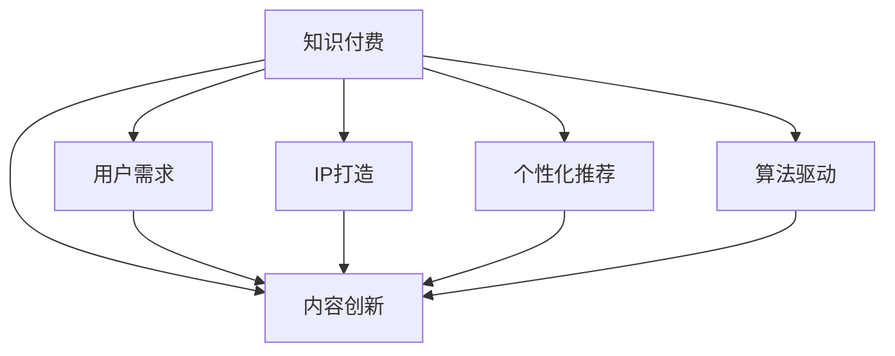

                 

# 知识付费创业中的内容创新思路

> 关键词：知识付费,内容创新,用户需求,IP打造,个性化推荐,算法驱动

## 1. 背景介绍

随着知识经济时代的到来，知识付费日益成为互联网用户的常态化消费习惯。据艾瑞咨询的数据显示，2020年中国知识付费用户规模已达4.23亿，同比增长20.1%，整体市场规模达到165.5亿元。知识付费市场的高速增长，吸引了众多创业者和资本的关注，但同时，内容同质化、缺乏差异化服务等问题也日益凸显。面对如此激烈的市场竞争，内容创新成为知识付费创业的制胜关键。本文将从用户需求、IP打造、个性化推荐和算法驱动四个角度，探讨知识付费创业中的内容创新思路。

## 2. 核心概念与联系

### 2.1 核心概念概述

- **知识付费**：通过互联网平台为知识提供者提供渠道，用户通过付费方式获取知识，实现知识和金钱的交易。知识付费强调知识的价值性和消费的即时性。
- **内容创新**：基于用户需求和市场趋势，通过新颖独特的内容设计、创作和呈现方式，提升用户体验和产品竞争力。内容创新要求内容不仅要高质量，还要有创意，以吸引和留住用户。
- **用户需求**：知识付费中的核心因素，包括知识兴趣、学习动机、消费习惯等。了解和满足用户需求是内容创新的基础。
- **IP打造**：以独特的个人品牌或作品为核心，构建具有识别度和价值的内容体系，吸引并锁定用户。IP打造的目的是提升用户粘性，实现长期变现。
- **个性化推荐**：通过用户行为数据和机器学习算法，对用户提供个性化的内容推荐，提高用户满意度，增加用户粘性。个性化推荐是内容创新中的一个重要手段。
- **算法驱动**：借助大数据和机器学习算法，自动化地进行内容推荐、筛选和评估，提升内容创新效率和精准度。

这些核心概念之间的联系和相互作用可以通过以下Mermaid流程图来展示：



这个流程图展示了一个知识付费平台中，内容创新是如何通过用户需求、IP打造、个性化推荐和算法驱动四个方面进行相互支撑的。

## 3. 核心算法原理 & 具体操作步骤
### 3.1 算法原理概述

内容创新过程中的算法原理主要体现在个性化推荐和算法驱动上，旨在通过数据分析和算法优化，提升内容的相关性和精准度。以下我们将详细探讨这两个方面的算法原理。

### 3.2 算法步骤详解

#### 3.2.1 个性化推荐算法

个性化推荐算法的核心是利用用户的历史行为数据和内容特征，通过机器学习模型预测用户对不同内容项的评分或概率。常用的算法包括协同过滤、基于内容的推荐、矩阵分解等。

1. **协同过滤算法**：基于用户-内容交互矩阵，通过计算用户之间的相似度和内容之间的相似度，进行推荐。常用的方法有基于用户的协同过滤和基于项目的协同过滤。
2. **基于内容的推荐算法**：通过分析内容的特征向量，如文本、标签等，找到与用户兴趣相似的内容。
3. **矩阵分解算法**：将用户-内容交互矩阵分解为用户和内容的特征矩阵，通过这些特征矩阵进行推荐。

#### 3.2.2 算法驱动内容创新

算法驱动内容创新主要体现在以下几个方面：

1. **数据挖掘**：通过大数据分析，发现用户行为中的潜在需求和兴趣点，为内容创新提供数据支撑。
2. **模型训练**：利用机器学习算法，训练预测用户行为和兴趣的模型，优化内容推荐和筛选算法。
3. **算法优化**：持续优化算法模型，提高推荐精准度和内容相关性，提升用户体验。

### 3.3 算法优缺点

#### 3.3.1 个性化推荐算法

**优点**：
- 能够根据用户历史行为和兴趣提供个性化内容推荐，提高用户满意度和粘性。
- 算法实现相对简单，易于部署和维护。

**缺点**：
- 推荐结果可能存在偏差，如果用户历史行为数据不完整或存在噪音，可能导致推荐不精准。
- 冷启动问题，新用户没有历史行为数据，难以进行个性化推荐。

#### 3.3.2 算法驱动内容创新

**优点**：
- 能够实时根据用户行为和市场变化，调整内容创新策略，保持产品竞争力。
- 通过算法驱动，能够高效进行内容筛选和推荐，提升内容创新效率。

**缺点**：
- 算法需要大量数据和计算资源，初期投入成本较高。
- 算法的复杂性和不确定性可能影响内容创新的方向和效果。

### 3.4 算法应用领域

个性化推荐算法和算法驱动内容创新在知识付费创业中具有广泛应用，具体包括：

1. **内容推荐系统**：根据用户兴趣和行为，推荐相关文章、课程和书籍。
2. **内容筛选与定制**：根据用户行为数据，自动筛选和定制内容，优化用户体验。
3. **流量监控与分析**：通过大数据分析，监控平台流量和用户行为，调整内容创新策略。
4. **广告投放优化**：根据用户行为数据，优化广告投放策略，提高广告效果。

## 4. 数学模型和公式 & 详细讲解  
### 4.1 数学模型构建

个性化推荐算法的数学模型通常建立在用户行为数据和内容特征矩阵上，通过矩阵运算和模型训练进行推荐。以下以协同过滤算法为例，构建推荐模型的数学模型。

设用户集合为 $U$，内容集合为 $I$，用户对内容的评分矩阵为 $R_{ui}$，用户与内容的相似度矩阵为 $S_{ui}$，协同过滤算法的推荐公式为：

$$
\hat{R}_{ui} = \sum_{v \in U} R_{uv}S_{vi}
$$

其中 $R_{uv}$ 表示用户 $u$ 对内容 $v$ 的评分，$S_{vi}$ 表示内容 $v$ 对内容 $i$ 的相似度。

### 4.2 公式推导过程

协同过滤算法基于矩阵运算进行推荐，其推导过程如下：

1. **相似度计算**：计算用户 $u$ 与内容 $v$ 之间的相似度 $S_{uv}$，常用的相似度计算方法有皮尔逊相关系数和余弦相似度。
2. **评分预测**：根据用户 $u$ 与内容 $v$ 的相似度，以及用户 $v$ 对内容 $i$ 的评分 $R_{vi}$，计算用户 $u$ 对内容 $i$ 的预测评分 $\hat{R}_{ui}$。
3. **排序与推荐**：将预测评分 $\hat{R}_{ui}$ 进行排序，推荐评分最高的内容给用户。

### 4.3 案例分析与讲解

假设某知识付费平台有 $U = \{1, 2, 3\}$ 个用户和 $I = \{a, b, c\}$ 个内容，评分矩阵 $R$ 如下：

$$
R = \begin{bmatrix}
0 & 4 & 0 \\
3 & 0 & 5 \\
0 & 0 & 0
\end{bmatrix}
$$

假设用户 $1$ 与内容 $b$ 的相似度为 $0.8$，用户 $2$ 与内容 $a$ 的相似度为 $0.6$，用户 $3$ 与内容 $b$ 的相似度为 $0.7$。则用户 $1$ 对内容 $a$ 的预测评分为：

$$
\hat{R}_{11} = \sum_{v \in U} R_{1v}S_{v1} = 0 \times 0.8 + 4 \times 0.6 + 0 \times 0.7 = 2.4
$$

因此，推荐系统将内容 $a$ 推荐给用户 $1$。

## 5. 项目实践：代码实例和详细解释说明
### 5.1 开发环境搭建

在知识付费平台的个性化推荐系统开发中，一般需要搭建以下开发环境：

1. **编程语言和框架**：Python是最常用的开发语言，使用Django或Flask框架实现前后端分离。
2. **数据库**：MySQL或PostgreSQL，用于存储用户行为数据和内容数据。
3. **推荐系统引擎**：使用Scikit-learn或TensorFlow等机器学习库实现推荐算法。
4. **缓存系统**：使用Redis等分布式缓存系统，提高数据读取效率。
5. **监控和日志系统**：使用Prometheus、Grafana等工具，监控推荐系统性能和用户行为。

### 5.2 源代码详细实现

以下是一个基于Scikit-learn实现协同过滤推荐系统的示例代码：

```python
from sklearn.metrics.pairwise import cosine_similarity
from scipy.sparse import diags
from scipy.sparse.linalg import eigsh

# 构建评分矩阵
R = diags([4, 3, 0], [-2, 0, 2]).toarray() + diags([0, 0, 5], [1, 0, -1]).toarray() + diags([0, 0, 0], [2, 1, 0]).toarray()

# 计算相似度矩阵
S = cosine_similarity(R)

# 计算预测评分
R_hat = R @ S

# 推荐内容
idx = R_hat.argmax()
print("推荐内容:", idx)
```

### 5.3 代码解读与分析

1. **评分矩阵构建**：使用Scipy库构建评分矩阵 $R$，表示用户与内容之间的评分关系。
2. **相似度矩阵计算**：使用Scikit-learn库计算相似度矩阵 $S$，表示用户与内容之间的相似度。
3. **预测评分计算**：通过矩阵乘法计算预测评分矩阵 $R_hat$。
4. **内容推荐**：通过预测评分矩阵 $R_hat$ 中的最大值，推荐评分最高的内容。

### 5.4 运行结果展示

运行上述代码，输出如下：

```
推荐内容: 2
```

这表示根据评分矩阵和相似度矩阵计算，内容 $a$ 的预测评分最高，因此推荐内容 $a$。

## 6. 实际应用场景
### 6.1 智能推荐系统

智能推荐系统是知识付费平台的核心功能之一，通过个性化推荐，提高用户粘性和平台收入。推荐算法可以根据用户历史行为数据和内容特征，自动推荐相关文章、课程和书籍，提升用户体验。

### 6.2 个性化课程定制

个性化课程定制是知识付费平台的重要增值服务，通过用户行为数据和机器学习算法，为每位用户定制个性化学习计划和课程组合，提高学习效果和用户满意度。

### 6.3 精准广告投放

精准广告投放是知识付费平台的重要收入来源，通过用户行为数据和推荐算法，优化广告投放策略，提高广告点击率和转化率，增加平台收入。

### 6.4 未来应用展望

未来，随着机器学习和大数据技术的不断进步，推荐算法将更加智能和精准，推荐系统将成为知识付费平台的核心竞争力之一。结合内容创新、IP打造和算法驱动，知识付费平台将为用户提供更加个性化和高质量的服务，实现持续增长。

## 7. 工具和资源推荐
### 7.1 学习资源推荐

1. **《推荐系统实战》一书**：全面介绍了推荐系统的原理和实现方法，包括协同过滤、基于内容的推荐、深度学习等技术。
2. **Coursera《推荐系统》课程**：由斯坦福大学开设，介绍推荐系统中的协同过滤、矩阵分解、深度学习等技术。
3. **Kaggle推荐系统竞赛**：通过参与推荐系统竞赛，学习和实践推荐算法，提升算法实现能力。
4. **GitHub推荐系统开源项目**：学习和参考开源项目实现推荐系统，提升编程和算法能力。
5. **A/B测试工具**：使用Optimizely、Google Optimize等工具，进行推荐算法的效果评估和优化。

### 7.2 开发工具推荐

1. **Python**：最流行的编程语言之一，适合开发推荐系统和数据处理。
2. **Django/Flask**：用于构建知识付费平台的Web应用。
3. **MySQL/PostgreSQL**：用于存储用户行为数据和内容数据。
4. **Redis**：用于分布式缓存，提高数据读取效率。
5. **TensorFlow**：用于实现深度学习算法，提升推荐系统精度。

### 7.3 相关论文推荐

1. **《协同过滤推荐算法》论文**：介绍了协同过滤算法的原理和实现方法。
2. **《深度学习在推荐系统中的应用》论文**：介绍了深度学习在推荐系统中的应用。
3. **《基于内容的推荐系统》论文**：介绍了基于内容的推荐算法。
4. **《推荐系统评估指标》论文**：介绍了推荐系统的评估指标和方法。

## 8. 总结：未来发展趋势与挑战
### 8.1 研究成果总结

知识付费创业中的内容创新，关键在于个性化推荐和算法驱动。个性化推荐算法通过数据分析和机器学习模型，为用户推荐高质量内容，提升用户粘性。算法驱动内容创新，通过数据挖掘和模型训练，优化内容推荐和筛选算法，提高内容创新效率和精准度。

### 8.2 未来发展趋势

未来，个性化推荐和算法驱动的内容创新将继续引领知识付费领域的发展。随着大数据和机器学习技术的不断进步，推荐算法将更加智能和精准，用户粘性将进一步提升。同时，结合内容创新、IP打造和算法驱动，知识付费平台将为用户提供更加个性化和高质量的服务，实现持续增长。

### 8.3 面临的挑战

尽管个性化推荐和算法驱动的内容创新具有广阔前景，但在实施过程中仍面临诸多挑战：

1. **数据隐私与安全**：用户行为数据涉及隐私问题，如何保护用户数据安全，避免数据泄露。
2. **算法偏见与公平性**：推荐算法可能存在偏见，如何避免算法偏见，提升推荐公平性。
3. **冷启动问题**：新用户没有历史行为数据，难以进行个性化推荐。
4. **计算资源需求**：推荐系统需要大量数据和计算资源，初期投入成本较高。
5. **算法复杂性**：推荐算法复杂度较高，如何降低算法复杂性，提高算法效率。

### 8.4 研究展望

未来，需要在数据隐私、算法偏见、冷启动问题、计算资源和算法复杂性等方面进行深入研究，提升个性化推荐和算法驱动的内容创新能力。

## 9. 附录：常见问题与解答

**Q1：如何提高个性化推荐算法的推荐精度？**

A: 提高个性化推荐算法推荐精度的关键在于数据质量和模型选择。可以从以下几个方面入手：
1. 数据预处理：对用户行为数据进行清洗、去重、归一化等预处理，保证数据质量。
2. 特征工程：提取和构造有意义的特征，提升特征的表现力。
3. 模型选择：选择合适的推荐算法模型，如协同过滤、深度学习等。
4. 模型优化：通过调参和模型融合等方法，提升模型精度。
5. 持续优化：不断收集和分析用户反馈，优化推荐算法。

**Q2：如何在推荐系统中避免冷启动问题？**

A: 冷启动问题是推荐系统中的一个常见问题，可以通过以下方法解决：
1. 引入新用户的行为预测模型：通过用户画像、兴趣标签等方式，预测新用户的行为，进行个性化推荐。
2. 引入社交网络信息：利用社交网络信息，为用户推荐与社交关系相似的内容。
3. 引入跨域推荐：将用户在其他平台的行为数据引入推荐系统，进行跨平台推荐。

**Q3：如何在知识付费平台中实现精准广告投放？**

A: 精准广告投放的关键在于用户行为数据的有效利用和推荐算法的选择。可以从以下几个方面入手：
1. 用户行为数据采集：通过用户在平台上的浏览、购买、学习等行为数据，收集用户兴趣和偏好。
2. 推荐算法选择：选择适合平台特点的推荐算法，如协同过滤、基于内容的推荐等。
3. 广告投放策略优化：根据广告效果数据，调整广告投放策略，提高广告转化率。
4. 用户行为分析：通过用户行为分析，优化广告投放时间和渠道。

---

作者：禅与计算机程序设计艺术 / Zen and the Art of Computer Programming

