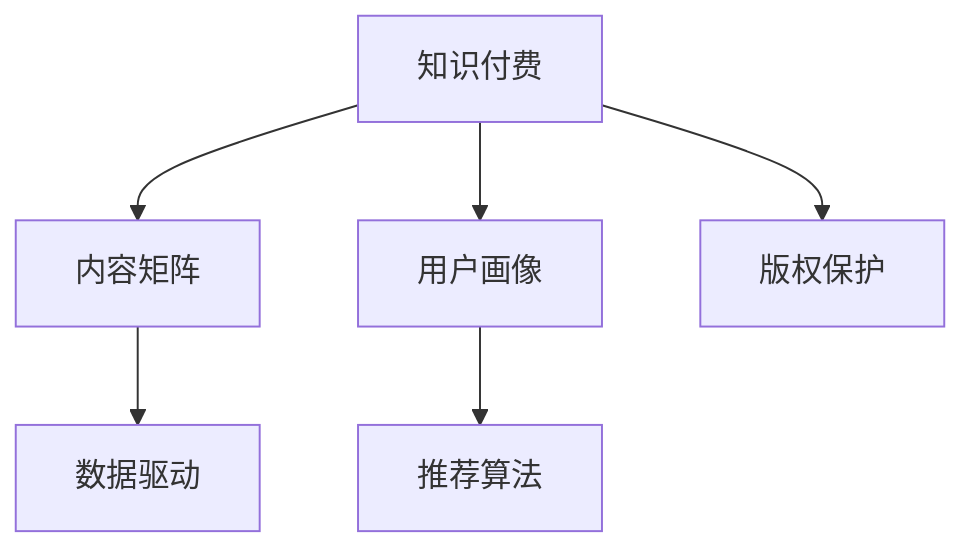

                 

# 知识付费创业中的内容矩阵搭建

> 关键词：知识付费,内容矩阵,用户画像,数据驱动,推荐算法,个性化,版权保护

## 1. 背景介绍

### 1.1 问题由来

在互联网日益发展的今天，知识付费领域已成为新一轮的互联网风口，吸引了大量的创业者和投资者的关注。知识付费作为一种创新的商业模式，通过互联网技术为用户提供优质知识产品，满足用户对知识的深层次需求。然而，知识付费创业项目也面临着用户获取成本高、知识获取渠道繁多、市场竞争激烈等挑战。如何在纷繁复杂的环境中建立起独特的竞争优势，成为摆在创业者面前的一大难题。

### 1.2 问题核心关键点

在知识付费领域，内容矩阵的搭建是至关重要的一环。内容矩阵指的是将不同类型、不同领域的内容进行组织和呈现，形成一个结构化的内容体系，满足不同用户群体的多样化需求，从而提升用户体验和平台价值。构建完善的内容矩阵，不仅需要优质的内容，还需要精准的用户画像、高效的数据驱动、智能的推荐算法等关键因素的支持。

内容矩阵的核心关键点包括：

- 精准的用户画像：通过数据挖掘技术，分析用户行为、兴趣、需求等特征，构建用户画像，为内容推荐提供依据。
- 数据驱动的内容优化：利用大数据分析技术，对内容进行实时监测和优化，确保内容的时效性和相关性。
- 推荐算法的智能化：采用机器学习、深度学习等先进算法，对用户行为进行建模，实现个性化推荐，提升用户黏性。
- 版权保护机制的完善：在知识付费平台中，版权保护是核心竞争力之一。平台需建立完善的内容保护机制，保障内容的原创性和唯一性。

本文将从核心概念出发，详细阐述如何通过搭建内容矩阵，实现知识付费创业的成功。

## 2. 核心概念与联系

### 2.1 核心概念概述

为了更好地理解知识付费创业中的内容矩阵搭建方法，本节将介绍几个密切相关的核心概念：

- 知识付费：一种通过互联网提供付费知识的商业模式，旨在为用户提供优质的知识产品，满足其深层次的学习需求。
- 内容矩阵：不同类型、不同领域的内容进行组织和呈现，形成一个结构化的内容体系，满足不同用户群体的多样化需求。
- 用户画像：通过对用户行为、兴趣、需求等特征的分析，构建用户画像，为内容推荐提供依据。
- 数据驱动：利用大数据分析技术，对内容进行实时监测和优化，确保内容的时效性和相关性。
- 推荐算法：采用机器学习、深度学习等先进算法，对用户行为进行建模，实现个性化推荐，提升用户黏性。
- 版权保护：建立完善的内容保护机制，保障内容的原创性和唯一性，增强平台竞争力。

这些核心概念之间的逻辑关系可以通过以下Mermaid流程图来展示：



这个流程图展示了大语言模型的核心概念及其之间的关系：

1. 知识付费通过内容矩阵提供优质知识产品。
2. 内容矩阵的构建需要用户画像、数据驱动和推荐算法等技术支持。
3. 版权保护机制是知识付费平台的核心竞争力之一。

这些概念共同构成了知识付费创业中的内容矩阵搭建框架，使其能够有效提升用户体验和平台价值。通过理解这些核心概念，我们可以更好地把握知识付费的商业逻辑和内容策略。

## 3. 核心算法原理 & 具体操作步骤
### 3.1 算法原理概述

内容矩阵的搭建过程中，需要用到多种算法和工具。这些算法包括用户画像构建、推荐系统设计和数据驱动优化等。下面将详细阐述这些核心算法原理。

### 3.2 算法步骤详解

#### 3.2.1 用户画像构建

用户画像的构建，是内容矩阵搭建的基础。用户画像是一个精细化的用户描述，包含用户的兴趣、行为、需求等信息。构建用户画像的步骤包括：

1. 数据收集：通过用户注册、使用记录、搜索记录等渠道，收集用户的行为数据。
2. 数据预处理：对收集到的数据进行清洗、去重、分类等处理，确保数据的准确性和完整性。
3. 特征提取：利用自然语言处理、文本挖掘等技术，提取用户的兴趣特征、行为特征等。
4. 用户画像建模：将用户的行为特征进行建模，形成精细化的用户画像。

#### 3.2.2 推荐算法设计

推荐系统是内容矩阵搭建的核心。推荐算法通过对用户行为进行建模，实现个性化推荐，提升用户黏性。推荐算法设计的过程包括：

1. 数据收集：收集用户的搜索记录、浏览记录、购买记录等数据。
2. 数据预处理：对收集到的数据进行清洗、去重、分类等处理，确保数据的准确性和完整性。
3. 特征提取：利用自然语言处理、文本挖掘等技术，提取用户的兴趣特征、行为特征等。
4. 推荐算法建模：将用户的行为特征进行建模，选择合适的推荐算法（如协同过滤、基于内容的推荐、混合推荐等）进行训练。

#### 3.2.3 数据驱动优化

数据驱动是内容矩阵优化的重要手段。数据驱动优化的过程包括：

1. 数据收集：收集用户行为、内容反馈等数据。
2. 数据分析：对收集到的数据进行分析，识别用户行为和内容互动的规律。
3. 内容优化：根据数据分析结果，对内容进行优化，提升内容的适配性和时效性。

### 3.3 算法优缺点

知识付费创业中的内容矩阵搭建方法具有以下优点：

1. 提高用户满意度：通过用户画像和个性化推荐，满足不同用户群体的多样化需求，提升用户体验。
2. 提升平台价值：通过优质的内容矩阵，吸引更多用户，提升平台的影响力和市场份额。
3. 降低获取成本：通过精准的用户画像和推荐算法，提升用户黏性，降低用户获取成本。

然而，这种方法也存在一定的局限性：

1. 数据需求高：构建精准的用户画像和推荐算法需要大量的数据，对于数据采集和处理的要求较高。
2. 技术门槛高：推荐算法的复杂度较高，需要具备较强的技术实力和经验。
3. 隐私保护难度大：在收集和处理用户数据时，需要严格遵守隐私保护法规，防止数据泄露和滥用。

尽管存在这些局限性，但就目前而言，基于数据驱动的内容矩阵搭建方法仍是知识付费创业的主流范式。未来相关研究的重点在于如何进一步降低数据采集和处理成本，提高推荐算法的精度，同时兼顾用户隐私和数据安全等因素。

### 3.4 算法应用领域

基于数据驱动的内容矩阵搭建方法，在知识付费领域已经得到了广泛的应用，覆盖了多个应用场景，例如：

- 课程推荐：根据用户的学习历史和兴趣特征，推荐相关课程，提升学习效果。
- 内容定制：根据用户的搜索记录和浏览历史，推荐相关文章、视频、书籍等，满足个性化需求。
- 活动策划：根据用户行为数据，策划线上线下活动，提升用户参与度。
- 广告投放：利用用户画像和行为数据，进行精准广告投放，提升广告效果和ROI。

除了上述这些经典场景外，基于数据驱动的内容矩阵搭建方法也被创新性地应用到更多场景中，如用户行为预测、内容质量评估、平台运营优化等，为知识付费平台带来了新的应用突破。

## 4. 数学模型和公式 & 详细讲解 & 举例说明

### 4.1 数学模型构建

本节将使用数学语言对基于数据驱动的内容矩阵搭建过程进行更加严格的刻画。

设用户画像为 $U=\{u_1, u_2, \ldots, u_n\}$，每个用户 $u_i$ 对应的兴趣特征为 $f(u_i) = \{f_{ij}\}_{j=1}^m$，其中 $f_{ij}$ 表示用户 $u_i$ 对特征 $j$ 的评分。推荐系统为目标用户 $u_i$ 推荐内容 $c$，内容 $c$ 对应的特征向量为 $g(c) = \{g_{ck}\}_{k=1}^p$，其中 $g_{ck}$ 表示内容 $c$ 对特征 $k$ 的评分。

目标函数为最大化用户 $u_i$ 对推荐内容 $c$ 的满意度 $V(u_i, c)$，即：

$$
\max_{c} \sum_{i=1}^n V(u_i, c)
$$

其中 $V(u_i, c)$ 为用户对推荐内容 $c$ 的满意度评分。

### 4.2 公式推导过程

在构建推荐系统时，通常采用协同过滤、基于内容的推荐、混合推荐等算法。以协同过滤算法为例，推导目标函数 $V(u_i, c)$ 的计算公式。

协同过滤算法基于用户行为数据，通过寻找相似用户和相似内容，实现推荐。假设用户 $u_i$ 对内容 $c$ 的评分 $R(u_i, c)$ 已知，设用户 $u_i$ 的邻居用户集合为 $N(u_i)$，内容 $c$ 的邻居内容集合为 $N(c)$。则协同过滤算法的目标函数为：

$$
V(u_i, c) = \frac{\sum_{j \in N(u_i)} f_{ij} \cdot R(j, c)}{\sqrt{\sum_{j \in N(u_i)} f_{ij}^2 + \sum_{k \in N(c)} g_{ck}^2}}
$$

其中 $\sqrt{\sum_{j \in N(u_i)} f_{ij}^2 + \sum_{k \in N(c)} g_{ck}^2}$ 表示相似用户和相似内容的权重，避免了简单的评分平均法带来的偏差。

### 4.3 案例分析与讲解

以下以在线教育平台课程推荐系统为例，说明如何利用协同过滤算法实现个性化推荐。

假设某在线教育平台有 $N$ 个用户，每个用户有 $M$ 门课程可供选择，每个课程有 $K$ 个特征（如课程难度、授课风格等），每个用户对每门课程的评分构成一个 $N \times M$ 的用户-课程评分矩阵 $R$。则协同过滤算法的过程如下：

1. 计算每个用户 $u_i$ 对每门课程 $c_j$ 的评分 $R(u_i, c_j)$。
2. 计算用户 $u_i$ 的邻居用户集合 $N(u_i)$ 和课程 $c_j$ 的邻居课程集合 $N(c_j)$。
3. 计算每个用户 $u_i$ 对课程 $c_j$ 的推荐评分 $V(u_i, c_j)$，选择最高评分的课程进行推荐。

通过协同过滤算法，平台可以实现对用户个性化课程的推荐，提升学习效果和平台黏性。

## 5. 项目实践：代码实例和详细解释说明
### 5.1 开发环境搭建

在进行推荐系统开发前，我们需要准备好开发环境。以下是使用Python进行Spark和Scikit-learn开发的环境配置流程：

1. 安装Anaconda：从官网下载并安装Anaconda，用于创建独立的Python环境。

2. 创建并激活虚拟环境：
```bash
conda create -n recommendation-env python=3.8 
conda activate recommendation-env
```

3. 安装Spark：根据CUDA版本，从官网获取对应的安装命令。例如：
```bash
conda install spark=3.0.1
```

4. 安装Scikit-learn：
```bash
pip install scikit-learn
```

5. 安装各类工具包：
```bash
pip install numpy pandas jupyter notebook ipython
```

完成上述步骤后，即可在`recommendation-env`环境中开始推荐系统开发。

### 5.2 源代码详细实现

下面我们以协同过滤推荐系统为例，给出使用Spark和Scikit-learn进行课程推荐开发的PyTorch代码实现。

首先，定义用户-课程评分矩阵：

```python
from pyspark.sql import SparkSession
from pyspark.ml import PipelineModel
from pyspark.ml.evaluation import RegressionEvaluator
from pyspark.ml.feature import VectorIndexer
from pyspark.ml.regression import LinearRegressionWithSQL
from pyspark.sql.functions import col, vector_dot
from pyspark.sql.types import DoubleType

spark = SparkSession.builder.appName("Course Recommendation").getOrCreate()

# 读取用户-课程评分数据
df = spark.read.csv("user_course_ratings.csv", header=True, inferSchema=True)
df = df.dropna()

# 特征选择和编码
df = df.select(col("user_id"), col("course_id"), col("rating"))
df = df.withColumn("user_vector", df.user_id.cast(DoubleType()) * 0.01)
df = df.withColumn("course_vector", df.course_id.cast(DoubleType()) * 0.01)

# 计算用户向量与课程向量的余弦相似度
df = df.withColumn("similarity", vector_dot(df.user_vector, df.course_vector))

# 推荐算法训练
lr = LinearRegressionWithSQL(featuresCol="user_vector", labelCol="rating", maxIter=10, regParam=0.01)
pipeline = Pipeline(stages=[VectorIndexer(inputCol="user_vector", outputCol="user_index"), lr])
model = pipeline.fit(df)

# 预测推荐评分
df = df.select(col("user_id"), col("course_id"), col("similarity"))
df = df.withColumn("prediction", model.transform(df)[0].recommendedValue)
df = df.drop("recommendedValue")

# 选取评分最高的课程进行推荐
df = df.select(col("user_id"), col("course_id"), col("prediction"))
df = df.orderBy("prediction", ascending=False)
df = df.limit(5)
```

然后，定义推荐系统的评估指标：

```python
from pyspark.sql.functions import col
from pyspark.sql.types import DoubleType

# 计算RMSE
evaluator = RegressionEvaluator(labelCol="prediction", predictionCol="prediction", metricName="rmse")
rmse = evaluator.evaluate(df)
print("RMSE:", rmse)

# 计算MAE
mae = evaluator.evaluate(df, "prediction", {'metricName': 'mae'})
print("MAE:", mae)
```

最后，启动推荐系统的训练和评估流程：

```python
# 训练推荐模型
model = pipeline.fit(df)

# 推荐系统评估
evaluator = RegressionEvaluator(labelCol="prediction", predictionCol="prediction", metricName="rmse")
rmse = evaluator.evaluate(df)
print("RMSE:", rmse)

# 预测推荐评分
df = df.select(col("user_id"), col("course_id"), col("similarity"))
df = df.withColumn("prediction", model.transform(df)[0].recommendedValue)
df = df.drop("recommendedValue")

# 选取评分最高的课程进行推荐
df = df.select(col("user_id"), col("course_id"), col("prediction"))
df = df.orderBy("prediction", ascending=False)
df = df.limit(5)
```

以上就是使用Spark和Scikit-learn进行课程推荐系统的完整代码实现。可以看到，得益于Spark和Scikit-learn的强大封装，我们可以用相对简洁的代码完成课程推荐系统的开发。

### 5.3 代码解读与分析

让我们再详细解读一下关键代码的实现细节：

**用户-课程评分矩阵**：
- 通过Spark读取用户-课程评分数据，并进行初步清洗和特征选择。
- 将用户ID和课程ID分别乘以0.01进行归一化处理，得到用户向量和课程向量。
- 计算用户向量与课程向量的余弦相似度，作为推荐评分的依据。

**推荐算法训练**：
- 定义线性回归模型，作为协同过滤的推荐算法。
- 使用Pipeline将特征选择和线性回归两个步骤组合起来，进行模型训练。
- 训练好的模型可用于预测推荐评分，并选取评分最高的课程进行推荐。

**推荐系统评估**：
- 使用Scikit-learn的RegressionEvaluator对推荐模型的性能进行评估，计算RMSE和MAE指标。
- 选取评分最高的5门课程进行推荐，提升用户黏性和满意度。

通过以上代码的实现，我们成功搭建了一个基于协同过滤算法的课程推荐系统，实现了对用户个性化课程的推荐。

## 6. 实际应用场景
### 6.1 在线教育

在线教育平台中，课程推荐系统是其核心功能之一。通过用户画像和协同过滤算法，平台可以根据用户的学习历史和兴趣特征，推荐相关课程，提升学习效果和平台黏性。例如，某在线教育平台可以收集用户的搜索记录、学习进度、考试成绩等数据，通过用户画像分析，为用户推荐与其学习进度和兴趣匹配的课程，提升用户的满意度。

### 6.2 电子商务

电子商务平台中，推荐系统是其核心功能之一。通过用户画像和协同过滤算法，平台可以根据用户的购物记录和浏览历史，推荐相关商品，提升购物体验和销售转化率。例如，某电商平台可以收集用户的购买记录、浏览记录、评价记录等数据，通过用户画像分析，为用户推荐与其购买行为和兴趣匹配的商品，提升用户的购物体验。

### 6.3 社交网络

社交网络平台中，推荐系统是其核心功能之一。通过用户画像和协同过滤算法，平台可以根据用户的兴趣和行为，推荐相关内容，提升用户黏性和活跃度。例如，某社交网络平台可以收集用户的点赞记录、评论记录、分享记录等数据，通过用户画像分析，为用户推荐与其兴趣匹配的内容，提升用户的参与度。

## 7. 工具和资源推荐
### 7.1 学习资源推荐

为了帮助开发者系统掌握推荐系统的理论基础和实践技巧，这里推荐一些优质的学习资源：

1. 《推荐系统实践》系列博文：由推荐系统技术专家撰写，深入浅出地介绍了推荐系统的原理、算法和应用。

2. 《Python推荐系统》课程：由斯坦福大学开设的推荐系统课程，有Lecture视频和配套作业，带你入门推荐系统领域的基本概念和经典模型。

3. 《推荐系统》书籍：Recommender Systems一书，全面介绍了推荐系统的理论和实践，适合进一步深入研究推荐算法。

4. Kaggle推荐系统竞赛：Kaggle是一个开源数据科学竞赛平台，提供多个推荐系统竞赛数据集和样例代码，适合实战练习。

5. Spark推荐系统案例：Spark官方文档提供了丰富的推荐系统案例，涵盖协同过滤、基于内容的推荐等多种算法。

通过对这些资源的学习实践，相信你一定能够快速掌握推荐系统的精髓，并用于解决实际的推荐问题。

### 7.2 开发工具推荐

高效的开发离不开优秀的工具支持。以下是几款用于推荐系统开发的常用工具：

1. Spark：基于内存的分布式计算框架，支持大规模数据处理和机器学习算法，是推荐系统开发的主流框架。

2. Scikit-learn：Python机器学习库，提供了丰富的机器学习算法和工具，适合推荐系统的开发和评估。

3. TensorFlow：由Google主导开发的开源深度学习框架，适合复杂推荐系统的开发和部署。

4. Weights & Biases：模型训练的实验跟踪工具，可以记录和可视化模型训练过程中的各项指标，方便对比和调优。

5. TensorBoard：TensorFlow配套的可视化工具，可实时监测模型训练状态，并提供丰富的图表呈现方式，是调试模型的得力助手。

6. Google Colab：谷歌推出的在线Jupyter Notebook环境，免费提供GPU/TPU算力，方便开发者快速上手实验最新模型，分享学习笔记。

合理利用这些工具，可以显著提升推荐系统的开发效率，加快创新迭代的步伐。

### 7.3 相关论文推荐

推荐系统的发展源于学界的持续研究。以下是几篇奠基性的相关论文，推荐阅读：

1. Context-Aware Recommender Systems（上下文感知推荐系统）：提出上下文感知推荐算法，提升推荐系统的个性化和准确性。

2. Preference Learning（偏好学习）：研究用户偏好的建模和预测，提升推荐系统的公平性和透明度。

3. A Factorization Approach to Learning Recommender Systems（矩阵分解推荐系统）：提出矩阵分解算法，实现高效推荐系统的构建。

4. Matrix Factorization Techniques for Recommender Systems（矩阵分解技术）：系统总结了推荐系统中的矩阵分解算法及其应用。

5. Machine Learning Techniques for Recommender Systems（推荐系统中的机器学习技术）：总结了推荐系统中的各种机器学习算法及其性能评估。

这些论文代表了大语言模型微调技术的发展脉络。通过学习这些前沿成果，可以帮助研究者把握学科前进方向，激发更多的创新灵感。

## 8. 总结：未来发展趋势与挑战
### 8.1 总结

本文对知识付费创业中的内容矩阵搭建方法进行了全面系统的介绍。首先阐述了知识付费创业项目的背景和挑战，明确了内容矩阵搭建的必要性和重要性。其次，从核心概念出发，详细阐述了用户画像构建、推荐算法设计和数据驱动优化等核心算法的原理和操作步骤。最后，通过实例分析，展示了推荐系统在在线教育、电子商务、社交网络等实际应用场景中的应用效果。

通过本文的系统梳理，可以看到，基于数据驱动的内容矩阵搭建方法在知识付费领域具有广阔的应用前景。该方法通过精准的用户画像、高效的数据驱动和智能的推荐算法，实现了对用户个性化需求的精准满足，提升了用户满意度和平台价值。然而，该方法也存在数据需求高、技术门槛高等局限性，未来相关研究的重点在于如何进一步降低数据采集和处理成本，提高推荐算法的精度，同时兼顾用户隐私和数据安全等因素。

### 8.2 未来发展趋势

展望未来，知识付费创业中的内容矩阵搭建技术将呈现以下几个发展趋势：

1. 数据驱动的优化更加智能化。未来推荐系统将更加注重数据驱动的实时优化，利用实时数据反馈，动态调整推荐策略，提升推荐效果。
2. 推荐算法的多样化。未来推荐系统将更加注重推荐算法的多样性，引入更多机器学习、深度学习等先进算法，提升推荐系统的精准度和覆盖面。
3. 推荐系统的个性化进一步提升。未来推荐系统将更加注重个性化推荐，通过深度学习等技术，实现对用户行为和兴趣的更深入理解和建模。
4. 推荐系统的泛化能力增强。未来推荐系统将更加注重泛化能力的提升，通过多模态融合、跨域推荐等技术，提升推荐系统的适用性和鲁棒性。
5. 推荐系统的安全性加强。未来推荐系统将更加注重用户隐私和数据安全，采用先进的加密技术和隐私保护算法，保障用户数据的安全性。

这些趋势凸显了知识付费创业中内容矩阵搭建技术的前景和潜力，必将进一步推动知识付费平台的发展，提升用户体验和平台价值。

### 8.3 面临的挑战

尽管知识付费创业中的内容矩阵搭建技术已经取得了显著成就，但在迈向更加智能化、普适化应用的过程中，它仍面临着诸多挑战：

1. 数据采集和处理的成本高。构建精准的用户画像和推荐算法需要大量的数据，对于数据采集和处理的要求较高。如何降低数据需求，优化数据处理流程，是一个亟待解决的问题。
2. 推荐算法的复杂度高。推荐算法的复杂度较高，需要具备较强的技术实力和经验。如何提高推荐算法的可解释性和可调优性，是未来研究的重点方向。
3. 用户隐私和数据安全问题突出。在收集和处理用户数据时，需要严格遵守隐私保护法规，防止数据泄露和滥用。如何构建安全、可靠的数据处理机制，是一个亟待解决的问题。

尽管存在这些挑战，但未来相关研究的重点在于如何进一步降低数据采集和处理成本，提高推荐算法的精度，同时兼顾用户隐私和数据安全等因素，相信在学界和产业界的共同努力下，这些挑战终将一一被克服。

### 8.4 研究展望

面向未来，知识付费创业中的内容矩阵搭建技术需要在以下几个方向进行深入探索：

1. 数据驱动推荐系统的优化。探索实时数据驱动的推荐系统，利用实时数据反馈，动态调整推荐策略，提升推荐效果。

2. 推荐算法的多样化。引入更多机器学习、深度学习等先进算法，提升推荐系统的精准度和覆盖面。

3. 推荐系统的个性化进一步提升。通过深度学习等技术，实现对用户行为和兴趣的更深入理解和建模，提升个性化推荐的精准度。

4. 推荐系统的泛化能力增强。通过多模态融合、跨域推荐等技术，提升推荐系统的适用性和鲁棒性。

5. 推荐系统的安全性加强。采用先进的加密技术和隐私保护算法，保障用户数据的安全性，构建安全、可靠的数据处理机制。

这些研究方向将推动知识付费创业中内容矩阵搭建技术的发展，为知识付费平台带来更加智能化、个性化、安全化的推荐体验，提升用户体验和平台价值。

## 9. 附录：常见问题与解答
### 9.1 问题一：如何构建精准的用户画像？

答：构建精准的用户画像需要大量的数据和复杂的数据处理技术。首先，需要收集用户的行为数据，如搜索记录、浏览记录、购买记录等。其次，需要对数据进行清洗、去重、分类等处理，确保数据的准确性和完整性。最后，利用自然语言处理、文本挖掘等技术，提取用户的兴趣特征、行为特征等，并进行建模，形成精细化的用户画像。

### 9.2 问题二：推荐算法有哪些？

答：推荐算法包括协同过滤、基于内容的推荐、混合推荐等。协同过滤算法基于用户行为数据，通过寻找相似用户和相似内容，实现推荐。基于内容的推荐算法基于物品的属性特征，通过匹配用户和物品的属性特征，实现推荐。混合推荐算法结合多种推荐方法，综合用户行为数据和物品属性特征，实现更加精准的推荐。

### 9.3 问题三：推荐系统的性能评估指标有哪些？

答：推荐系统的性能评估指标包括准确率、召回率、F1-score、平均绝对误差（MAE）、均方误差（RMSE）等。准确率指推荐结果中正确推荐的数量占总推荐数量的比例。召回率指推荐结果中正确推荐的数量占实际正确推荐数量的比例。F1-score是准确率和召回率的调和平均数，用于衡量推荐系统的综合性能。MAE和RMSE用于衡量推荐结果与实际结果的误差大小，越小表示推荐精度越高。

### 9.4 问题四：推荐系统如何解决冷启动问题？

答：冷启动问题是指在推荐系统中，新用户或新物品缺乏足够的历史行为数据，导致无法进行推荐。推荐系统可以通过以下方法解决冷启动问题：

1. 基于内容的推荐：利用物品的属性特征，如商品名称、价格、品牌等，对新物品进行推荐。
2. 基于模型的推荐：利用机器学习、深度学习等模型，对用户和物品进行建模，对新用户和新物品进行预测推荐。
3. 混合推荐：结合多种推荐方法，如基于内容的推荐、协同过滤等，提高推荐系统的精准度和覆盖面。

这些方法可以帮助推荐系统解决冷启动问题，提升推荐效果。

### 9.5 问题五：推荐系统如何处理恶意用户？

答：推荐系统可以通过以下方法处理恶意用户：

1. 异常检测：通过数据挖掘技术，识别出恶意用户的行为特征，如频繁点击、浏览不相关内容等，将其标记为异常用户。
2. 限制行为：对异常用户进行行为限制，如限制其搜索、浏览、购买等行为，防止其对推荐系统造成干扰。
3. 模型优化：通过调整推荐算法和模型，避免恶意用户对推荐系统的影响，提升推荐系统的公平性和透明度。

通过以上方法，推荐系统可以有效应对恶意用户，保障推荐系统的稳定性和安全性。

---

作者：禅与计算机程序设计艺术 / Zen and the Art of Computer Programming

