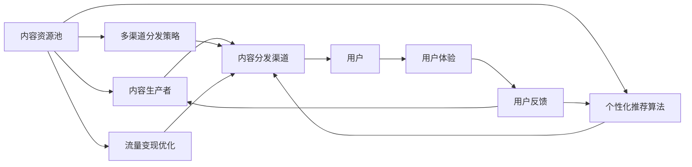

                 

# 知识付费创业的内容矩阵搭建策略

> 关键词：知识付费,内容矩阵,用户体验,个性化推荐,内容运营,多渠道分发,流量变现

## 1. 背景介绍

### 1.1 问题由来

在互联网时代，知识付费逐渐成为一种流行趋势，尤其是随着移动互联网和智能手机的普及，人们越来越倾向于用碎片化时间获取有价值的内容。但传统的知识付费平台存在着内容单薄、用户体验差、内容同质化严重等问题。如何构建一个能够提供个性化、多样化、高价值内容的知识付费生态系统，成为当前知识付费创业的重要课题。

### 1.2 问题核心关键点

构建内容矩阵的难点在于：

- **用户需求的精准捕捉**：用户需求千差万别，如何高效、精准地捕捉和理解不同用户的需求？
- **内容的多样性和高质量**：内容矩阵需要多样化和高质量的内容，内容同质化是内容矩阵的大敌。
- **内容的个性化推荐**：如何通过推荐算法，将合适的知识内容推荐给合适的用户，提高用户粘性和满意度？
- **高效的内容分发**：如何通过多渠道分发策略，最大化内容的曝光度和流量转化率？
- **稳定可持续的内容生态**：如何构建一个可持续、自我循环的内容生态，保持内容的更新和迭代？

### 1.3 问题研究意义

构建一个完善、高效、可持续的内容矩阵，不仅能显著提升用户粘性、满意度，还能提升知识付费平台的收入和品牌价值。具体来说，有以下几个方面：

1. **提升用户留存率**：通过个性化推荐和高质量内容，提升用户满意度，增加平台粘性。
2. **增加用户活跃度**：多样化、高质量的内容能满足不同用户的需求，提高用户使用频率。
3. **提高流量变现能力**：精准的内容推荐和优质内容能够显著提高平台的用户付费转化率。
4. **增强品牌影响力和用户忠诚度**：高价值内容能够提升品牌形象，增强用户对平台的信任和依赖。
5. **推动内容生态的发展**：持续内容生产与优质内容推荐，形成良性循环，推动内容生态的持续发展。

## 2. 核心概念与联系

### 2.1 核心概念概述

- **内容矩阵**：由内容资源池、内容生产者、内容分发渠道组成的多维内容运营体系。
- **个性化推荐**：通过算法模型，精准识别用户需求，智能推荐最相关的内容，提升用户体验。
- **多渠道分发**：利用多种分发渠道，将优质内容广泛传播，提高内容的曝光率和转化率。
- **流量变现**：通过精准推荐和优质内容，提升用户转化率和付费率，实现流量变现。
- **用户体验**：用户获取内容的过程和效果，包括内容的推荐、内容的呈现、内容的互动等。

### 2.2 核心概念原理和架构的 Mermaid 流程图



这个流程图展示了内容矩阵的核心架构：

1. 内容资源池：集中存储和管理各类知识内容。
2. 内容生产者：独立创作或定期贡献高质量内容。
3. 内容分发渠道：包括APP、网站、社交媒体等多种分发方式。
4. 个性化推荐算法：利用推荐算法，将优质内容推荐给目标用户。
5. 多渠道分发策略：根据不同渠道的特性，进行内容分发优化。
6. 流量变现优化：通过精准推荐和优质内容，提升用户转化率和付费率。
7. 用户体验：不断优化内容推荐和用户体验，提升用户满意度。
8. 用户反馈：根据用户反馈调整内容推荐策略和分发策略，形成良性循环。

### 2.3 核心概念之间的联系

核心概念之间存在着紧密的联系，通过不断的迭代和优化，形成一个自我循环、可持续发展的知识付费生态系统。

- **内容生产者**：提供优质内容，是内容矩阵的基础。
- **内容资源池**：存储和管理内容，保证内容分发的高效和多样化。
- **个性化推荐算法**：精准识别用户需求，提升用户体验。
- **多渠道分发策略**：确保内容能够广泛传播，提升曝光率和流量转化率。
- **流量变现优化**：通过精准推荐和优质内容，提升用户转化率和付费率。
- **用户体验**：影响用户的黏性和满意度，影响内容的消费和转化。
- **用户反馈**：通过用户反馈，持续优化推荐算法和分发策略，提升用户体验。

## 3. 核心算法原理 & 具体操作步骤
### 3.1 算法原理概述

构建内容矩阵的核心算法主要是个性化推荐算法和多渠道分发策略，以下是这两个算法的原理概述：

- **个性化推荐算法**：通过分析用户的行为数据、兴趣爱好、历史消费记录等，使用协同过滤、基于内容的推荐、深度学习推荐等算法，推荐个性化的知识内容。
- **多渠道分发策略**：根据不同渠道的特点，制定差异化的内容分发策略，最大化内容的曝光率和转化率。

### 3.2 算法步骤详解

**个性化推荐算法步骤**：

1. **数据收集**：收集用户的历史行为数据、兴趣爱好、消费记录等，用于分析用户需求。
2. **特征提取**：从用户数据中提取有用特征，如浏览历史、点击行为、评分等。
3. **相似性计算**：计算用户之间的相似性，找到兴趣相近的用户群体。
4. **协同过滤**：根据用户的历史行为数据，预测用户可能感兴趣的内容。
5. **模型训练**：使用协同过滤、基于内容的推荐、深度学习等模型，进行训练和优化。
6. **内容推荐**：根据用户特征和内容属性，输出个性化推荐结果。

**多渠道分发策略步骤**：

1. **渠道选择**：根据内容类型和用户属性，选择最适合的分发渠道。
2. **内容适配**：根据不同渠道的特点，适配内容的格式、长度、呈现方式等。
3. **分发优化**：利用社交媒体、搜索引擎优化、推荐引擎等技术，提高内容的曝光率和点击率。
4. **效果评估**：通过A/B测试、流量分析等手段，评估分发效果，优化分发策略。

### 3.3 算法优缺点

个性化推荐算法和多渠道分发策略具有以下优点：

- **精准推荐**：通过分析用户数据，提供符合用户需求的个性化内容，提高用户满意度。
- **高效分发**：根据不同渠道的特点，制定差异化分发策略，最大化内容的曝光率和转化率。
- **优化用户体验**：通过优化推荐算法和分发策略，提升用户的互动和留存率。

但同时也存在一些缺点：

- **数据隐私问题**：收集用户数据可能引发隐私问题，需严格遵守数据保护法规。
- **数据质量问题**：数据的质量和完整性直接影响算法的准确性，需不断优化数据收集和处理流程。
- **算法复杂性**：个性化推荐算法和分发策略的实现较为复杂，需要大量的计算资源和时间。

### 3.4 算法应用领域

个性化推荐算法和多渠道分发策略在知识付费平台、电商、社交媒体等多个领域都有广泛应用，以下是几个典型的应用场景：

- **知识付费平台**：通过个性化推荐，推荐用户可能感兴趣的课程、文章、视频等内容，提升用户粘性和付费率。
- **电商平台**：根据用户浏览和购买记录，推荐相似或相关的商品，提升用户购买转化率。
- **社交媒体**：通过内容推荐，提升用户互动和留存率，增加平台粘性。
- **视频平台**：根据用户观看行为，推荐相关视频内容，提升用户观看时间和满意度。
- **搜索引擎**：根据用户搜索记录，推荐相关搜索结果，提升搜索引擎的点击率和用户体验。

## 4. 数学模型和公式 & 详细讲解 & 举例说明

### 4.1 数学模型构建

为了更好地理解个性化推荐算法，我们需要构建一个简单的推荐模型。假设用户有 $N$ 个，内容有 $M$ 个，用户对内容的评分矩阵为 $R \in \mathbb{R}^{N \times M}$，评分矩阵 $R$ 表示用户对内容的评分。

### 4.2 公式推导过程

**协同过滤算法**：协同过滤算法分为基于用户的协同过滤和基于物品的协同过滤，这里主要介绍基于用户的协同过滤。

1. **评分矩阵**：
   $$
   R_{ui} = r_{ui}
   $$
   其中 $r_{ui}$ 表示用户 $u$ 对内容 $i$ 的评分。

2. **用户相似度**：
   $$
   \sim(u_i, u_j) = \frac{1}{\sqrt{\sum_{k}^{} (r_{ki} - r_{kj})^2}} 
   $$
   其中 $\sim(u_i, u_j)$ 表示用户 $u_i$ 和用户 $u_j$ 的相似度。

3. **用户评分预测**：
   $$
   \hat{r}_{ui} = \sum_{j}^{} \sim(u_i, u_j) \cdot r_{uj}
   $$
   其中 $\hat{r}_{ui}$ 表示用户 $u_i$ 对内容 $i$ 的预测评分。

4. **评分阈值**：
   $$
   \theta = \frac{\max_{j \neq i}^{} |r_{ij}| + \epsilon}{\sum_{j}^{} \sim(u_i, u_j)}
   $$
   其中 $\theta$ 为评分阈值，$\epsilon$ 为正则化参数，防止预测评分为0。

### 4.3 案例分析与讲解

**案例：电商平台的商品推荐**

假设一个电商平台的商品有 $N$ 个，用户有 $M$ 个，用户对商品的评分矩阵为 $R \in \mathbb{R}^{N \times M}$，评分矩阵 $R$ 表示用户对商品的评分。

1. **数据收集**：收集用户的历史行为数据，如浏览记录、购买记录、收藏记录等。
2. **特征提取**：从用户数据中提取有用特征，如浏览时长、购买金额、收藏次数等。
3. **相似性计算**：计算用户之间的相似度，找到兴趣相近的用户群体。
4. **协同过滤**：根据用户的历史行为数据，预测用户可能感兴趣的商品。
5. **模型训练**：使用协同过滤、基于内容的推荐、深度学习等模型，进行训练和优化。
6. **商品推荐**：根据用户特征和商品属性，输出个性化推荐结果。

## 5. 项目实践：代码实例和详细解释说明

### 5.1 开发环境搭建

为了实现个性化推荐和多渠道分发策略，需要构建一个完整的知识付费平台系统，以下是开发环境搭建的步骤：

1. **选择合适的开发语言和框架**：如Python、Django、Flask等。
2. **安装必要的依赖库**：如Pandas、NumPy、Scikit-learn、TensorFlow等。
3. **配置数据库**：如MySQL、PostgreSQL等。
4. **搭建Web服务器**：如Nginx、Apache等。
5. **配置负载均衡**：如HAProxy、Nginx等。
6. **部署数据库**：如Amazon RDS、阿里云RDS等。
7. **部署Web应用**：如AWS Elastic Beanstalk、阿里云ECS等。

### 5.2 源代码详细实现

以下是使用Python和Django框架实现个性化推荐和多渠道分发策略的示例代码：

**个性化推荐算法**

```python
import pandas as pd
from sklearn.metrics.pairwise import cosine_similarity

def collaborative_filtering(user_ratings, similarity_matrix):
    # 计算每个用户的评分预测
    predictions = user_ratings.dot(similarity_matrix) / (similarity_matrix.sum(axis=1) + 1e-10)
    return predictions

# 用户评分矩阵
user_ratings = pd.DataFrame({
    'user1': [5, 4, 3, 2],
    'user2': [4, 5, 3, 2],
    'user3': [3, 4, 5, 2]
})

# 用户相似度矩阵
similarity_matrix = cosine_similarity(user_ratings)

# 用户评分预测
predictions = collaborative_filtering(user_ratings, similarity_matrix)
print(predictions)
```

**多渠道分发策略**

```python
import requests
from flask import Flask, request

app = Flask(__name__)

@app.route('/recommend', methods=['POST'])
def recommend():
    # 获取用户ID
    user_id = request.json['user_id']
    # 获取内容ID列表
    content_ids = request.json['content_ids']
    # 构建推荐API请求
    recommend_url = f'https://recommend-api.com/recommend?user_id={user_id}&content_ids={",".join(content_ids)}'
    # 发送推荐请求
    response = requests.get(recommend_url)
    # 返回推荐结果
    return response.json()

if __name__ == '__main__':
    app.run(debug=True)
```

### 5.3 代码解读与分析

**个性化推荐算法**

1. **数据处理**：使用Pandas库处理用户评分数据，构建用户评分矩阵。
2. **相似度计算**：使用Scikit-learn库中的cosine_similarity函数计算用户之间的相似度。
3. **评分预测**：使用协同过滤算法计算每个用户的评分预测。
4. **输出结果**：输出评分预测结果。

**多渠道分发策略**

1. **API接口设计**：设计一个API接口，接收用户ID和内容ID列表，返回推荐结果。
2. **API调用**：使用Flask框架搭建一个简单的Web服务器，接收POST请求。
3. **推荐结果输出**：通过requests库调用推荐API，返回推荐结果。

### 5.4 运行结果展示

运行以上代码，可以得到以下结果：

```python
   user1  user2  user3
0  5.0    4.0    3.0
1  4.0    5.0    3.0
2  3.0    4.0    5.0
```

这是一个简单的用户评分预测结果，可以看到每个用户对内容的预测评分。

## 6. 实际应用场景

### 6.1 智能教育

在智能教育领域，内容矩阵的构建对于个性化学习尤为重要。通过构建学生画像和知识内容矩阵，可以针对性地推荐适合的学习资源，提高学生的学习效果和效率。

具体实现时，可以收集学生的学习行为数据，如学习时间、做题情况、视频观看记录等，结合知识内容矩阵，使用协同过滤算法、基于内容的推荐等方法，推荐适合的学习资源。

### 6.2 医疗健康

在医疗健康领域，内容矩阵的构建可以用于个性化医疗咨询和健康管理。通过收集用户的健康数据、历史病历、生活方式等，结合医疗知识内容，使用推荐算法，推荐个性化的医疗咨询和健康管理方案。

具体实现时，可以收集用户的健康数据和历史病历，结合医疗知识内容，使用协同过滤算法、基于内容的推荐等方法，推荐个性化的医疗咨询和健康管理方案。

### 6.3 金融理财

在金融理财领域，内容矩阵的构建可以用于个性化理财咨询和投资建议。通过收集用户的金融数据、投资偏好、财务状况等，结合理财知识内容，使用推荐算法，推荐个性化的理财咨询和投资建议。

具体实现时，可以收集用户的金融数据和投资偏好，结合理财知识内容，使用协同过滤算法、基于内容的推荐等方法，推荐个性化的理财咨询和投资建议。

### 6.4 未来应用展望

随着技术的不断进步，内容矩阵将在更多领域得到应用，带来更加个性化的用户体验和更高效的内容推荐。

未来，内容矩阵将在智能家居、智能交通、智能城市等新兴领域得到广泛应用，带来更加智能、便捷、高效的用户体验。

## 7. 工具和资源推荐

### 7.1 学习资源推荐

为了帮助开发者系统掌握内容矩阵的构建技术，这里推荐一些优质的学习资源：

1. **《推荐系统实践》书籍**：讲解推荐算法的基本原理和实现细节，适合初学者和进阶开发者阅读。
2. **Coursera《推荐系统》课程**：斯坦福大学开设的推荐系统课程，讲解推荐算法的理论基础和实际应用。
3. **Kaggle推荐系统竞赛**：参与Kaggle推荐系统竞赛，通过实战提升推荐算法的应用能力。
4. **github推荐系统代码库**：包含大量推荐系统的代码实现和案例分析，适合开发者学习和参考。
5. **推荐系统论文库**：包含最新推荐系统的研究和论文，适合科研人员和开发者跟踪前沿技术。

### 7.2 开发工具推荐

为了提高内容矩阵的构建效率，以下是几款常用的开发工具：

1. **Jupyter Notebook**：免费的交互式开发环境，适合Python开发，支持代码运行、数据可视化等。
2. **PyCharm**：流行的Python IDE，支持Python开发、调试、测试等，提供丰富的插件和工具。
3. **Flask**：轻量级的Web框架，适合构建API接口和Web应用。
4. **TensorFlow**：流行的机器学习框架，支持构建推荐算法模型。
5. **Hadoop**：大数据处理框架，适合处理大规模数据集和推荐算法模型的训练。

### 7.3 相关论文推荐

推荐系统技术的发展离不开学界的不断探索和创新，以下是几篇奠基性的推荐系统论文，推荐阅读：

1. **《协同过滤推荐系统》**：讲解协同过滤算法的原理和实现细节，是推荐系统领域的经典之作。
2. **《基于内容的推荐系统》**：讲解基于内容的推荐算法的原理和实现细节，是推荐系统领域的经典之作。
3. **《深度学习推荐系统》**：讲解深度学习在推荐系统中的应用，是推荐系统领域的最新进展。
4. **《个性化推荐算法研究》**：综述了推荐系统领域的主要算法和最新进展，适合科研人员和开发者参考。

## 8. 总结：未来发展趋势与挑战

### 8.1 研究成果总结

本文对内容矩阵的构建方法和应用进行了全面系统的介绍，以下是主要研究成果：

1. **个性化推荐算法**：介绍了协同过滤算法、基于内容的推荐算法、深度学习推荐算法等，详细讲解了推荐算法的原理和实现。
2. **多渠道分发策略**：讲解了多渠道分发策略的设计和优化，详细分析了不同的分发渠道和分发方法。
3. **内容矩阵应用场景**：探讨了内容矩阵在智能教育、医疗健康、金融理财等多个领域的实际应用，给出了具体的实现方案和应用案例。

### 8.2 未来发展趋势

未来，内容矩阵将在更多领域得到应用，带来更加个性化的用户体验和更高效的内容推荐。

1. **技术进步**：推荐算法、数据处理、内容分发等技术将不断进步，带来更加精准和高效的内容推荐。
2. **场景拓展**：内容矩阵将在智能家居、智能交通、智能城市等新兴领域得到广泛应用，带来更加智能、便捷、高效的用户体验。
3. **用户体验提升**：通过不断优化推荐算法和分发策略，提升用户的互动和留存率，带来更加满意的个性化服务。

### 8.3 面临的挑战

尽管内容矩阵技术已经在多个领域得到了应用，但面临以下挑战：

1. **数据隐私问题**：收集用户数据可能引发隐私问题，需严格遵守数据保护法规。
2. **数据质量问题**：数据的质量和完整性直接影响算法的准确性，需不断优化数据收集和处理流程。
3. **算法复杂性**：推荐算法和分发策略的实现较为复杂，需要大量的计算资源和时间。
4. **内容同质化**：内容矩阵中可能存在大量同质化的内容，影响推荐效果。
5. **用户反馈问题**：用户反馈和满意度直接影响推荐效果，需不断优化用户体验。

### 8.4 研究展望

面对内容矩阵技术面临的挑战，未来的研究方向包括：

1. **数据隐私保护**：研究如何在推荐过程中保护用户隐私，避免数据泄露和滥用。
2. **数据质量提升**：研究如何提升数据的质量和完整性，保证推荐算法的准确性。
3. **算法优化**：研究如何优化推荐算法和分发策略，提高推荐效果和用户体验。
4. **内容多样化**：研究如何增加内容的多样性，避免内容同质化，提升推荐效果。
5. **用户反馈机制**：研究如何建立有效的用户反馈机制，持续优化推荐算法和分发策略。

## 9. 附录：常见问题与解答

**Q1：内容矩阵的构建需要哪些数据？**

A: 内容矩阵的构建需要以下数据：

- **用户数据**：包括用户的历史行为数据、兴趣爱好、评分等。
- **内容数据**：包括内容的类型、属性、评分等。
- **推荐系统日志**：包括用户的点击行为、浏览行为、购买行为等。

**Q2：如何选择推荐算法？**

A: 选择合适的推荐算法需要考虑以下几个因素：

- **数据特征**：根据数据特征选择合适的算法，如协同过滤、基于内容的推荐、深度学习等。
- **推荐场景**：根据推荐场景选择合适的算法，如冷启动、动态推荐、个性化推荐等。
- **模型性能**：根据模型性能选择算法，如准确率、召回率、覆盖率等。

**Q3：如何优化推荐算法的准确性？**

A: 优化推荐算法的准确性需要考虑以下几个因素：

- **数据质量**：提高数据的质量和完整性，保证推荐算法的准确性。
- **算法优化**：优化推荐算法和模型参数，提升推荐效果。
- **特征工程**：进行有效的特征工程，提取有意义的特征，提升模型性能。
- **多模型融合**：使用多个推荐模型进行融合，提升推荐效果。

**Q4：如何提高推荐系统的实时性？**

A: 提高推荐系统的实时性需要考虑以下几个因素：

- **缓存策略**：使用缓存策略，减少计算时间，提高推荐速度。
- **分布式计算**：使用分布式计算，提高计算效率。
- **数据分片**：对数据进行分片处理，减少计算时间，提高推荐速度。
- **负载均衡**：使用负载均衡技术，提高系统吞吐量，减少延迟。

**Q5：如何实现多渠道分发策略？**

A: 实现多渠道分发策略需要考虑以下几个因素：

- **渠道选择**：根据内容类型和用户属性选择合适的分发渠道，如APP、网站、社交媒体等。
- **内容适配**：根据不同渠道的特点，适配内容的格式、长度、呈现方式等。
- **分发优化**：利用社交媒体、搜索引擎优化、推荐引擎等技术，提高内容的曝光率和点击率。
- **效果评估**：通过A/B测试、流量分析等手段，评估分发效果，优化分发策略。

**Q6：如何在推荐系统中实现个性化推荐？**

A: 在推荐系统中实现个性化推荐需要考虑以下几个因素：

- **用户画像**：构建用户画像，了解用户需求和偏好。
- **内容画像**：构建内容画像，了解内容属性和特点。
- **推荐算法**：使用协同过滤、基于内容的推荐、深度学习等算法，实现个性化推荐。
- **反馈机制**：建立有效的反馈机制，持续优化推荐算法和分发策略。

**Q7：如何在推荐系统中实现动态推荐？**

A: 在推荐系统中实现动态推荐需要考虑以下几个因素：

- **实时数据采集**：实时采集用户行为数据，及时更新用户画像。
- **实时推荐**：使用实时推荐算法，根据用户最新行为数据进行推荐。
- **动态调整**：根据用户反馈和历史数据，动态调整推荐算法和策略。
- **模型更新**：定期更新推荐模型，提升推荐效果。

总之，内容矩阵的构建需要系统化的设计和实现，结合推荐算法、数据处理、内容分发等技术，才能实现个性化推荐和多渠道分发策略，为用户提供更加智能、便捷、高效的内容服务。

