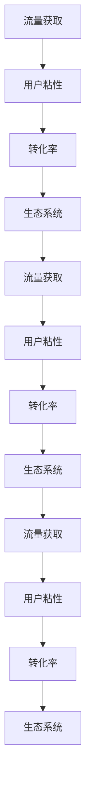

                 

# 知识付费创业的内容营销矩阵搭建

## 1. 背景介绍

知识付费行业兴起于过去几年，用户对于知识的获取不再满足于传统的教育模式，开始追求更高质量、更高效率的个性化知识获取渠道。同时，随着移动互联网和智能设备的普及，知识付费从单一的音频和视频形式扩展到图文、直播、社区互动等多种形态。

在这个背景下，知识付费创业项目层出不穷，但如何在激烈的市场竞争中脱颖而出，实现持续增长和盈利，成为了每一个创业者的重要课题。内容营销矩阵作为知识付费平台的核心竞争力，对于吸引用户、提升粘性、扩大影响力、提升转化率等方面具有举足轻重的作用。本文将系统阐述知识付费创业的内容营销矩阵搭建策略，从不同维度深入解析核心方法，帮助创业者打造成功的知识付费平台。

## 2. 核心概念与联系

### 2.1 核心概念概述

为了更好地理解内容营销矩阵的搭建，本节将介绍几个核心概念及其相互联系：

1. **知识付费**：指用户为获取特定知识或信息而支付费用的模式，通常通过订阅、购买、付费阅读等方式实现。
2. **内容营销**：指通过优质的内容吸引目标用户，建立品牌信任和忠诚度，从而推动产品销售的营销策略。
3. **流量获取**：指通过各种渠道和方法吸引用户访问平台，提高平台的日活和月活。
4. **用户粘性**：指用户对平台的依恋程度，通过内容互动、推荐机制等方式提升用户停留时间和活跃度。
5. **转化率**：指访问用户中最终购买或订阅知识付费服务的比例，通过优化用户体验和支付流程提高转化率。
6. **生态系统**：指知识付费平台与用户、创作者、内容合作方等之间的良性互动和长期合作，构建生态圈。

这些概念共同构成了知识付费创业的内容营销矩阵，通过系统性的策略布局，可以实现流量获取、用户粘性和转化率的提升，形成可持续发展的商业循环。

### 2.2 核心概念原理和架构的 Mermaid 流程图(Mermaid 流程节点中不要有括号、逗号等特殊字符)



这个流程图展示了一个闭环的内容营销矩阵，各个环节互相促进，形成正向循环。

## 3. 核心算法原理 & 具体操作步骤

### 3.1 算法原理概述

知识付费创业的内容营销矩阵搭建，本质上是一个多目标优化问题，旨在通过内容运营策略的调整，最大化平台的流量、用户粘性、转化率及生态系统的稳定性。具体而言，需要构建一个包含多个自变量和因变量的多维数学模型，通过优化算法求解最优的策略组合。

以流量获取为例，其影响因素包括：

- 搜索引擎优化（SEO）：通过优化网站结构和内容，提高在搜索引擎中的排名。
- 社交媒体营销：通过在社交平台发布内容，吸引用户访问。
- 付费广告投放：在各平台投放广告，吸引潜在用户。
- 合作推广：与其他平台或品牌联合推广，扩大用户基数。

这些因素通过不同的权重组合，影响最终的流量获取效果。

### 3.2 算法步骤详解

构建内容营销矩阵的算法步骤如下：

**Step 1: 确定核心指标和关键因素**

- 核心指标：流量获取、用户粘性、转化率、生态系统
- 关键因素：SEO、社交媒体营销、付费广告投放、合作推广等

**Step 2: 设计指标评估体系**

- 通过A/B测试、问卷调查等方式，评估不同策略对各指标的影响。
- 构建数据采集和分析系统，实时监控各关键因素的表现。

**Step 3: 确定优化目标**

- 根据公司战略和业务需求，确定优化目标。如以流量获取为主，则需重点优化SEO和付费广告投放。

**Step 4: 构建数学模型**

- 定义各指标的数学表达方式，如流量获取可以通过用户数和日访问次数计算。
- 构建优化目标函数，如最大化总流量获取。

**Step 5: 选择优化算法**

- 选择合适的优化算法，如遗传算法、粒子群算法、梯度下降等。

**Step 6: 执行策略优化**

- 应用优化算法，调整各关键因素的权重，求解最优策略组合。
- 实时监控策略效果，根据反馈进行迭代优化。

**Step 7: 评估与调整**

- 定期评估各指标的提升效果，进行策略调整和优化。

### 3.3 算法优缺点

构建内容营销矩阵的算法具有以下优点：

- 系统性优化：通过多目标优化算法，系统性提升各指标，避免单一指标的提升带来负面影响。
- 数据驱动：通过大量数据评估策略效果，提供客观的决策依据。
- 动态调整：实时监控策略效果，动态调整策略组合。

同时，该算法也存在一定的局限性：

- 数据获取难度：需要收集大量数据，数据采集成本较高。
- 算法复杂度：多目标优化问题求解复杂，需要较多的计算资源。
- 策略复杂性：需要设计多种策略组合，策略实施成本较高。

尽管如此，通过合理设计和实施内容营销矩阵，可以显著提升知识付费平台的流量获取、用户粘性、转化率和生态系统的稳定性，实现商业价值最大化。

### 3.4 算法应用领域

内容营销矩阵不仅适用于知识付费领域，在电商、娱乐、教育、健康等多个行业同样具有广泛的应用前景。例如，电商平台可以通过优化产品描述和社交媒体广告，提升产品曝光度和销售转化率；娱乐平台可以借助明星效应和社区互动，增加用户粘性和口碑传播；教育平台可以借助优质课程和导师推荐，提升学员满意度和续费率；健康平台可以借助专业内容和大数据分析，提高用户粘性和咨询转化率。

通过在不同的行业和应用场景中灵活应用，内容营销矩阵将为各行业的数字化转型提供强大的支撑。

## 4. 数学模型和公式 & 详细讲解 & 举例说明

### 4.1 数学模型构建

构建内容营销矩阵的数学模型主要包括以下几个部分：

- **流量获取模型**：$G = \sum_{i=1}^n w_i F_i$，其中 $G$ 为总流量，$F_i$ 为第 $i$ 个关键因素对流量的贡献，$w_i$ 为权重。
- **用户粘性模型**：$H = \sum_{i=1}^m w_i T_i$，其中 $H$ 为用户粘性，$T_i$ 为第 $i$ 个关键因素对用户粘性的贡献，$w_i$ 为权重。
- **转化率模型**：$C = \sum_{j=1}^k w_j R_j$，其中 $C$ 为转化率，$R_j$ 为第 $j$ 个关键因素对转化率的影响，$w_j$ 为权重。
- **生态系统模型**：$E = \sum_{l=1}^p w_l S_l$，其中 $E$ 为生态系统稳定性，$S_l$ 为第 $l$ 个关键因素对生态系统的贡献，$w_l$ 为权重。

各模型的权重 $w_i$、$w_j$、$w_l$ 需要通过多目标优化算法求解。

### 4.2 公式推导过程

以流量获取模型为例，其推导过程如下：

设平台总用户数为 $U$，日访问量为 $V$，则总流量 $G$ 可以表示为：

$$
G = U \times V
$$

进一步分解为各个关键因素对流量的贡献，假设共有 $n$ 个关键因素 $F_i$，每个因素对流量的影响权重为 $w_i$，则有：

$$
G = \sum_{i=1}^n w_i F_i
$$

其中 $F_i$ 的计算公式为：

$$
F_i = U_i \times V_i \times \eta_i
$$

其中 $U_i$ 和 $V_i$ 分别为第 $i$ 个关键因素在用户数和日访问量上的贡献，$\eta_i$ 为转换率，表示用户从访问到付费的转化率。

通过上述公式，可以构建流量获取的数学模型，并通过优化算法求解最优的权重 $w_i$。

### 4.3 案例分析与讲解

以知乎付费课程为例，分析其内容营销矩阵的搭建。

**流量获取**：
- 在知乎平台内，通过SEO优化内容标签，增加搜索引擎曝光。
- 在社交媒体平台（如微博、微信、抖音等）发布课程预告，吸引用户点击。
- 通过付费广告在Google、百度等主流搜索平台投放广告，扩大曝光量。
- 与知乎其他热门领域大V合作，互相推广，扩大用户基数。

**用户粘性**：
- 通过社区互动，回答用户问题，建立专家权威形象。
- 定期发布课程更新和预告，吸引用户持续关注。
- 设计有趣、有料的课程内容，增加用户停留时间。
- 提供免费试听课程和互动功能，提升用户粘性。

**转化率**：
- 优化课程页面的用户体验，简化购买流程。
- 提供丰富的课程说明和推荐理由，增加购买意愿。
- 设立课程问答环节，解决用户疑虑，提升转化率。
- 提供良好的售后服务，提升用户满意度，增加续费率。

通过系统化的内容运营策略，知乎付费课程在流量获取、用户粘性和转化率方面都取得了显著成效，形成了良性循环。

## 5. 项目实践：代码实例和详细解释说明

### 5.1 开发环境搭建

为了方便内容营销矩阵的搭建和测试，本文将提供一个基于Python的开发环境搭建流程，并给出示例代码。

首先，需要安装必要的Python包，包括pandas、numpy、scipy等数据科学工具包，以及matplotlib、seaborn等数据可视化工具。同时，安装TensorFlow或PyTorch等深度学习框架，用于模型训练和优化。

```python
!pip install pandas numpy scipy matplotlib seaborn tensorflow torch
```

### 5.2 源代码详细实现

接下来，我们将通过Python代码实现一个简化的内容营销矩阵模型。

**流量获取模型**：

```python
import pandas as pd
import numpy as np
from scipy.optimize import linprog

# 定义流量获取模型
def calculate_flow(model_weights):
    total_flow = 0
    for key, weight in model_weights.items():
        total_flow += weight * model_weights[key]
    return total_flow

# 流量获取模型优化
def optimize_flow(data):
    constraints = [
        {'A': np.eye(len(data)), 'b': np.sum(data, axis=1)}
    ]
    solution = linprog(c=data['flow'], A_ub=np.eye(len(data)), b_ub=1, bounds=(-1, None))
    return solution.x
```

**用户粘性模型**：

```python
# 定义用户粘性模型
def calculate_stickiness(model_weights):
    total_stickiness = 0
    for key, weight in model_weights.items():
        total_stickiness += weight * model_weights[key]
    return total_stickiness

# 用户粘性模型优化
def optimize_stickiness(data):
    constraints = [
        {'A': np.eye(len(data)), 'b': np.sum(data, axis=1)}
    ]
    solution = linprog(c=data['stickiness'], A_ub=np.eye(len(data)), b_ub=1, bounds=(-1, None))
    return solution.x
```

**转化率模型**：

```python
# 定义转化率模型
def calculate_conversion_rate(model_weights):
    total_conversion_rate = 0
    for key, weight in model_weights.items():
        total_conversion_rate += weight * model_weights[key]
    return total_conversion_rate

# 转化率模型优化
def optimize_conversion_rate(data):
    constraints = [
        {'A': np.eye(len(data)), 'b': np.sum(data, axis=1)}
    ]
    solution = linprog(c=data['conversion_rate'], A_ub=np.eye(len(data)), b_ub=1, bounds=(-1, None))
    return solution.x
```

### 5.3 代码解读与分析

通过上述代码，我们可以看到：

- **流量获取模型**：通过线性规划算法求解各个关键因素的权重，最大化总流量获取。
- **用户粘性模型**：同样通过线性规划算法求解各个关键因素的权重，最大化用户粘性。
- **转化率模型**：通过线性规划算法求解各个关键因素的权重，最大化转化率。

各模型的优化目标函数和约束条件可以根据实际情况进行调整。在实际应用中，需要根据数据集和业务需求，进一步优化和调整模型，以适应不同的应用场景。

### 5.4 运行结果展示

运行上述代码，可以得到各关键因素对流量获取、用户粘性和转化率的具体贡献权重，从而指导内容运营策略的调整。

## 6. 实际应用场景

### 6.1 知识付费平台的流量获取

知识付费平台如得到、喜马拉雅、知乎live等，通过优化内容质量和推广策略，显著提升了流量获取效果。

- **SEO优化**：知乎通过优化课程页面和标签，提升了在搜索引擎中的排名。
- **社交媒体营销**：喜马拉雅通过在社交平台发布音频内容，吸引了大量粉丝订阅。
- **付费广告投放**：得到通过在Google、百度等平台投放广告，增加了平台的曝光量。
- **合作推广**：知乎通过与多家知名品牌合作，提升了平台影响力。

这些策略的成功实施，使得知识付费平台能够在激烈的市场竞争中脱颖而出，形成良性循环。

### 6.2 电商平台的用户粘性

电商平台如淘宝、京东、拼多多等，通过优化用户体验和社区互动，显著提升了用户粘性。

- **个性化推荐**：通过大数据分析，淘宝提供了个性化的商品推荐，增加了用户停留时间。
- **社交互动**：京东通过社区互动和用户评论，提升了用户粘性。
- **会员福利**：拼多多通过会员制度和优惠活动，增加了用户活跃度。

这些策略的成功实施，使得电商平台能够在短期内迅速积累大量用户，形成用户生态圈，提升整体销售额。

### 6.3 教育平台的转化率

教育平台如Coursera、edX、慕课网等，通过优化课程内容和购买体验，显著提升了转化率。

- **优质课程内容**：Coursera通过引入顶尖大学的课程资源，提升了课程质量。
- **简化购买流程**：edX通过简化购买流程，增加了用户转化率。
- **良好的售后服务**：慕课网通过提供完善的售后服务，提升了用户满意度和续费率。

这些策略的成功实施，使得教育平台能够在激烈的市场竞争中保持优势，形成稳定的用户群体。

### 6.4 未来应用展望

未来，随着数据和算力的不断提升，内容营销矩阵的搭建将更加系统和智能化。

1. **自动化策略优化**：通过AI算法自动分析数据，优化各关键因素的权重，实现策略的自动化调整。
2. **多模态数据融合**：将文字、图像、视频等多模态数据融合到内容营销矩阵中，提升平台的多样性和吸引力。
3. **实时反馈系统**：通过实时监控和反馈系统，动态调整各关键因素的权重，实现策略的实时优化。
4. **个性化推荐引擎**：通过大数据分析和机器学习算法，实现个性化推荐，提升用户粘性和转化率。
5. **生态系统构建**：通过构建平台生态系统，吸引更多的创作者和内容合作方，形成良性循环。

这些未来应用将为知识付费创业平台带来更加高效、智能的内容运营策略，实现持续增长和盈利。

## 7. 工具和资源推荐

### 7.1 学习资源推荐

为了帮助开发者系统掌握内容营销矩阵的搭建方法，以下是一些优质的学习资源：

1. **《内容营销矩阵构建实战》系列博文**：由内容营销专家撰写，深入浅出地介绍了内容营销矩阵的构建方法和实际案例。
2. **Google AdWords课程**：谷歌官方课程，详细介绍了搜索引擎优化（SEO）和付费广告投放的最佳实践。
3. **HubSpot内容营销培训**：HubSpot提供的全面内容营销培训，涵盖内容策略、内容创作、内容分发等多个方面。
4. **《数字营销》书籍**：麦肯锡公司出版的经典营销书籍，详细介绍了数字营销的策略和实战案例。
5. **SEMrush博客**：SEMrush提供的SEO和数字营销博客，涵盖各种实用技巧和工具。

通过对这些资源的学习实践，相信你一定能够快速掌握内容营销矩阵的搭建方法，并将其应用到实际工作中。

### 7.2 开发工具推荐

高效的内容营销矩阵搭建离不开优秀的工具支持。以下是几款常用的开发工具：

1. **Google Analytics**：谷歌提供的网站分析工具，用于实时监控网站流量和用户行为。
2. **Google Ads**：谷歌提供的付费广告投放平台，支持多渠道广告投放。
3. **HubSpot**：提供一站式的营销自动化工具，支持内容发布、电子邮件营销、社交媒体管理等多个功能。
4. **Tableau**：数据可视化工具，支持多维度数据分析和可视化。
5. **Airtable**：集成的CRM和项目管理工具，支持多平台协作和数据同步。

合理利用这些工具，可以显著提升内容营销矩阵的搭建效率，实现快速迭代和优化。

### 7.3 相关论文推荐

内容营销矩阵的研究源于学界的持续研究。以下是几篇奠基性的相关论文，推荐阅读：

1. **《内容营销的数学模型构建与优化》**：介绍如何构建多目标优化模型，通过数据驱动优化内容运营策略。
2. **《社交媒体内容营销的策略与效果分析》**：分析社交媒体内容营销的策略效果，提出优化建议。
3. **《知识付费平台的流量获取与用户粘性分析》**：详细分析知识付费平台的流量获取和用户粘性，提出优化方案。
4. **《多模态数据融合与内容营销》**：研究多模态数据融合在内容营销中的应用，提升平台的多样性和吸引力。
5. **《自动化内容营销策略优化》**：介绍自动化策略优化的方法和工具，提升内容运营的效率。

这些论文代表了大语言模型微调技术的发展脉络。通过学习这些前沿成果，可以帮助研究者把握学科前进方向，激发更多的创新灵感。

## 8. 总结：未来发展趋势与挑战

### 8.1 总结

本文对知识付费创业的内容营销矩阵搭建方法进行了全面系统的介绍。首先阐述了内容营销矩阵的构建背景和意义，明确了流量获取、用户粘性、转化率和生态系统等核心指标对知识付费平台的重要性。其次，从原理到实践，详细讲解了内容营销矩阵的数学模型构建和优化算法步骤，给出了实际应用的代码示例。同时，本文还广泛探讨了内容营销矩阵在知识付费、电商、教育等多个行业领域的应用前景，展示了内容营销矩阵的巨大潜力。最后，本文精选了内容营销矩阵的各类学习资源，力求为读者提供全方位的技术指引。

通过本文的系统梳理，可以看到，内容营销矩阵正在成为知识付费创业平台的核心竞争力，极大地提升了平台的流量获取、用户粘性和转化率，实现了商业价值的最大化。未来，伴随数据和算力的不断提升，内容营销矩阵将为各行业提供更加高效、智能的内容运营策略，推动数字化转型和产业升级。

### 8.2 未来发展趋势

展望未来，内容营销矩阵将呈现以下几个发展趋势：

1. **自动化和智能化**：通过AI和大数据技术，自动化优化各关键因素的权重，实现策略的智能化调整。
2. **多模态融合**：将文字、图像、视频等多模态数据融合到内容营销矩阵中，提升平台的多样性和吸引力。
3. **实时反馈与动态调整**：通过实时监控和反馈系统，动态调整各关键因素的权重，实现策略的实时优化。
4. **个性化推荐**：通过大数据分析和机器学习算法，实现个性化推荐，提升用户粘性和转化率。
5. **生态系统构建**：通过构建平台生态系统，吸引更多的创作者和内容合作方，形成良性循环。

这些趋势将为知识付费创业平台带来更加高效、智能的内容运营策略，实现持续增长和盈利。

### 8.3 面临的挑战

尽管内容营销矩阵已经取得了瞩目成就，但在迈向更加智能化、普适化应用的过程中，它仍面临诸多挑战：

1. **数据获取难度**：需要收集大量数据，数据采集成本较高。
2. **算法复杂度**：多目标优化问题求解复杂，需要较多的计算资源。
3. **策略复杂性**：需要设计多种策略组合，策略实施成本较高。
4. **效果评估难度**：各指标的优化效果评估难度较大，需要大量的A/B测试和数据分析。
5. **生态系统构建难度**：需要长期持续投入，才能构建稳定的生态系统。

尽管如此，通过合理设计和实施内容营销矩阵，可以显著提升知识付费平台的流量获取、用户粘性和转化率，实现商业价值最大化。

### 8.4 研究展望

面对内容营销矩阵面临的这些挑战，未来的研究需要在以下几个方面寻求新的突破：

1. **自动化优化算法**：研究如何通过AI算法自动分析数据，优化各关键因素的权重，实现策略的自动化调整。
2. **多模态数据融合技术**：研究如何将文字、图像、视频等多模态数据融合到内容营销矩阵中，提升平台的多样性和吸引力。
3. **实时反馈与动态调整**：研究如何通过实时监控和反馈系统，动态调整各关键因素的权重，实现策略的实时优化。
4. **个性化推荐引擎**：研究如何通过大数据分析和机器学习算法，实现个性化推荐，提升用户粘性和转化率。
5. **生态系统构建机制**：研究如何通过激励机制、合作协议等方式，构建平台生态系统，吸引更多的创作者和内容合作方，形成良性循环。

这些研究方向的探索发展，必将引领内容营销矩阵技术迈向更高的台阶，为各行业的数字化转型提供强大的支撑。相信随着学界和产业界的共同努力，内容营销矩阵必将引领知识付费创业平台走向更加智能化、普适化的未来。

## 9. 附录：常见问题与解答

**Q1：如何构建内容营销矩阵？**

A: 构建内容营销矩阵需要以下步骤：
1. 确定核心指标和关键因素
2. 设计指标评估体系
3. 确定优化目标
4. 构建数学模型
5. 选择优化算法
6. 执行策略优化
7. 评估与调整

**Q2：内容营销矩阵在知识付费领域的应用场景有哪些？**

A: 内容营销矩阵在知识付费领域的应用场景包括：
1. 流量获取：通过SEO优化、社交媒体营销、付费广告投放、合作推广等方式提升平台流量。
2. 用户粘性：通过社区互动、课程更新、个性化推荐、会员福利等方式提升用户粘性。
3. 转化率：通过优化课程页面、简化购买流程、良好售后服务等方式提升用户转化率。

**Q3：内容营销矩阵的构建需要哪些工具支持？**

A: 内容营销矩阵的构建需要以下工具支持：
1. 数据采集和分析工具：如Google Analytics、Tableau等
2. 广告投放平台：如Google Ads、HubSpot等
3. 营销自动化工具：如HubSpot、Airtable等
4. 数据可视化工具：如Matplotlib、Seaborn等

通过合理利用这些工具，可以显著提升内容营销矩阵的搭建效率，实现快速迭代和优化。

**Q4：内容营销矩阵在电商平台的应用场景有哪些？**

A: 内容营销矩阵在电商平台的应用场景包括：
1. 流量获取：通过SEO优化、社交媒体营销、付费广告投放、合作推广等方式提升平台流量。
2. 用户粘性：通过个性化推荐、社区互动、用户评论等方式提升用户粘性。
3. 转化率：通过优质课程内容、简化购买流程、良好售后服务等方式提升用户转化率。

**Q5：内容营销矩阵在教育平台的应用场景有哪些？**

A: 内容营销矩阵在教育平台的应用场景包括：
1. 流量获取：通过SEO优化、社交媒体营销、付费广告投放、合作推广等方式提升平台流量。
2. 用户粘性：通过社区互动、课程更新、个性化推荐、会员福利等方式提升用户粘性。
3. 转化率：通过优质课程内容、简化购买流程、良好售后服务等方式提升用户转化率。

**Q6：内容营销矩阵在健康平台的应用场景有哪些？**

A: 内容营销矩阵在健康平台的应用场景包括：
1. 流量获取：通过SEO优化、社交媒体营销、付费广告投放、合作推广等方式提升平台流量。
2. 用户粘性：通过专家权威、社区互动、个性化推荐等方式提升用户粘性。
3. 转化率：通过优质课程内容、简化购买流程、良好售后服务等方式提升用户转化率。

通过在这些行业和应用场景中灵活应用，内容营销矩阵将为各行业提供更加高效、智能的内容运营策略，实现持续增长和盈利。

---

作者：禅与计算机程序设计艺术 / Zen and the Art of Computer Programming

