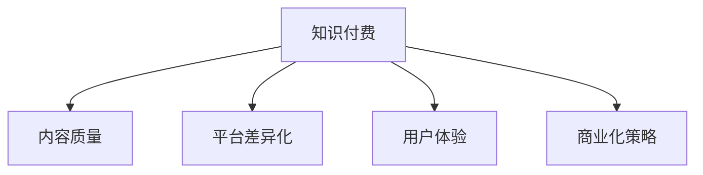

                 

# 知识付费创业的商业模式优化策略

## 1. 背景介绍

### 1.1 问题由来

随着移动互联网和信息技术的快速发展，知识付费行业进入黄金时代。内容付费的浪潮涌现，推动了从传统的电子书销售到知识服务直播的转变。知识付费平台的兴起，不仅满足了人们对知识信息的获取需求，也促进了知识变现的新模式。然而，在快速发展的同时，知识付费平台也面临诸多问题，如内容质量参差不齐、平台同质化严重、用户体验不佳等。这些问题严重制约了行业的健康发展。

### 1.2 问题核心关键点

知识付费行业的健康发展，需从以下几个方面着手：
- 内容质量控制。保障内容的专业性和原创性，提供价值导向的高质量内容。
- 平台差异化。利用差异化策略吸引用户，打造独特品牌。
- 用户体验优化。提高平台易用性，提升用户粘性。
- 商业化策略。探索多种商业模式，实现良性循环。

## 2. 核心概念与联系

### 2.1 核心概念概述

为更好地理解知识付费创业的商业模式优化策略，本节将介绍几个密切相关的核心概念：

- 知识付费：基于知识内容进行付费的服务模式，满足用户对知识、信息、技能等的刚性需求。
- 内容质量：衡量知识产品价值的关键指标，直接影响用户体验和留存率。
- 平台差异化：通过独特的内容、技术、服务等方式，使平台在激烈竞争中脱颖而出。
- 用户体验：指用户在使用平台过程中的满意度和体验感受，直接影响用户粘性和留存率。
- 商业化策略：指通过多种盈利方式，使知识付费平台实现可持续发展的策略。

这些核心概念之间的逻辑关系可以通过以下Mermaid流程图来展示：



这个流程图展示了一个知识付费平台的基本构成和关键要素：

1. 知识付费平台的核心在于提供优质内容，满足用户需求。
2. 平台差异化是吸引用户的重要手段，通过独特性赢得竞争优势。
3. 用户体验是平台长久运营的关键，良好的体验可以提升用户粘性和留存率。
4. 商业化策略是平台的生存基石，只有实现盈利才能实现可持续发展。

## 3. 核心算法原理 & 具体操作步骤
### 3.1 算法原理概述

知识付费创业的商业模式优化策略，从根本上讲是一种基于用户行为分析和市场需求的综合性优化。其核心思想是通过数据分析和用户研究，识别平台存在的问题和短板，针对性进行内容质量控制、平台差异化策略、用户体验优化和商业化策略优化，从而实现平台的健康、高效发展。

具体地，这一过程包括以下几个关键步骤：

**Step 1: 数据收集与处理**
- 收集用户在平台上的行为数据，包括内容阅读、购买、评价等。
- 利用数据挖掘技术对数据进行清洗和处理，去除噪声和冗余数据。

**Step 2: 用户画像构建**
- 通过聚类、分类等算法构建用户画像，识别不同用户群体的需求和行为模式。
- 分析不同用户群体对内容、功能、服务等方面的偏好和反馈。

**Step 3: 内容质量评估**
- 建立内容质量评估体系，包括专业性、原创性、实用性和互动性等维度。
- 利用自然语言处理（NLP）、图像处理等技术，对内容进行自动化评估。

**Step 4: 平台差异化策略设计**
- 分析同质化平台与自身平台的差异点，挖掘优势和特色。
- 设计差异化内容和服务，如专属课程、个性化推荐等。

**Step 5: 用户体验优化**
- 利用用户反馈和行为数据，识别影响用户体验的关键因素。
- 针对性地改进平台功能和服务设计，如界面优化、交互设计等。

**Step 6: 商业化策略优化**
- 分析平台收入构成，优化盈利模式，如内容付费、增值服务、广告等。
- 设计可持续发展的商业模式，如会员制、联盟合作等。

### 3.2 算法步骤详解

以下将详细介绍每一个关键步骤的具体操作流程：

**Step 1: 数据收集与处理**

数据收集是知识付费创业的基础。可通过以下几种方式进行：

- **平台行为数据**：收集用户在平台上的行为数据，包括阅读时长、购买记录、评价评分等。
- **用户反馈数据**：收集用户在平台上的反馈信息，如评论、投诉、建议等。
- **外部数据源**：利用公开数据集或第三方数据平台，获取用户兴趣、社交行为等相关信息。

数据处理主要涉及数据清洗和特征提取：

- **数据清洗**：去除噪声和重复数据，处理缺失值，确保数据质量。
- **特征提取**：从原始数据中提取有意义的特征，如阅读时长、购买频率、用户满意度等。

**Step 2: 用户画像构建**

用户画像构建旨在深入了解用户需求和行为，为个性化服务和差异化策略设计提供依据。主要步骤包括：

- **聚类分析**：使用聚类算法（如K-means、层次聚类等）将用户分为不同的群体。
- **分类分析**：使用分类算法（如决策树、随机森林等）预测用户行为，如是否购买课程、是否订阅会员等。
- **用户画像绘制**：结合聚类和分类结果，绘制用户画像，识别不同用户群体的特征和需求。

**Step 3: 内容质量评估**

内容质量评估是知识付费平台的核心环节，直接影响用户满意度和留存率。主要步骤包括：

- **内容打分系统**：建立内容打分标准，如专家评审、用户评分等。
- **自动化评估工具**：开发自然语言处理（NLP）工具，对内容进行自动打分和评价。
- **人工审核机制**：引入人工审核环节，补充自动化评估的不足。

**Step 4: 平台差异化策略设计**

平台差异化策略是吸引用户的关键。主要步骤包括：

- **竞争分析**：分析同质化平台的优势和劣势，挖掘自身平台差异点。
- **特色内容打造**：开发特色课程、专家讲座等，提升平台的独特性。
- **品牌建设**：通过社交媒体、KOL合作等手段，提升平台品牌知名度和影响力。

**Step 5: 用户体验优化**

用户体验优化是平台长期发展的基石。主要步骤包括：

- **用户反馈收集**：定期收集用户反馈，识别影响用户体验的问题和痛点。
- **功能改进**：针对性地改进平台功能，如搜索优化、交互设计等。
- **界面设计**：优化平台界面设计，提升用户操作体验。

**Step 6: 商业化策略优化**

商业化策略优化是平台可持续发展的保障。主要步骤包括：

- **收入分析**：分析平台收入构成，包括内容付费、广告、增值服务等。
- **盈利模式优化**：设计可持续的盈利模式，如会员制、联盟合作等。
- **成本控制**：优化平台运营成本，提升盈利能力。

### 3.3 算法优缺点

知识付费创业的商业模式优化策略具有以下优点：

1. **系统性**：通过全面数据分析和用户研究，识别平台存在的问题，进行系统性优化。
2. **科学性**：利用数据科学和机器学习等技术，提升决策的科学性和准确性。
3. **个性化**：通过用户画像和行为分析，实现个性化服务和差异化策略设计，提升用户满意度。

同时，该方法也存在一些局限性：

1. **数据依赖**：优化策略的有效性依赖于高质量的数据，数据获取和处理成本较高。
2. **模型复杂度**：涉及多个环节和复杂算法，模型设计和优化难度较大。
3. **实时性**：优化策略需要持续监控和调整，难以实现实时响应。
4. **用户隐私**：在收集和处理用户数据时，需注意用户隐私保护，防止数据泄露。

尽管存在这些局限性，但就目前而言，基于数据分析和用户研究的商业模式优化策略，仍是大规模知识付费平台常用的有效手段。未来相关研究的重点在于如何进一步提升数据分析的效率和准确性，降低数据获取成本，同时兼顾用户隐私保护和实时响应性。

### 3.4 算法应用领域

知识付费创业的商业模式优化策略已广泛应用于多个领域，如在线教育、职业培训、财经资讯等。这些领域中的知名平台，通过不断的优化和创新，形成了多样化的盈利模式，提升了平台的用户粘性和市场竞争力。

- **在线教育**：如Coursera、Udacity等平台，通过提供高质量课程，吸引用户付费。
- **职业培训**：如LinkedIn Learning、Udemy等平台，提供职业培训课程，满足职场需求。
- **财经资讯**：如华尔街见闻、财新网等平台，提供实时财经信息，满足投资者的知识需求。

除了上述这些经典领域外，知识付费平台还在新兴领域，如健康管理、育儿教育、时尚生活等，探索新的应用场景，推动知识的普惠化。随着知识付费行业的不断发展，基于数据驱动的商业模式优化策略，将在更多领域得到应用，为知识传播和价值变现带来新的可能性。

## 4. 数学模型和公式 & 详细讲解  
### 4.1 数学模型构建

本节将使用数学语言对知识付费创业的商业模式优化策略进行更加严格的刻画。

记知识付费平台的用户数量为 $N$，总点击量为 $T$，内容质量为 $Q$，平台差异化为 $D$，用户体验为 $U$，商业化策略为 $C$。

定义用户满意度函数为 $S(N, T, Q, D, U, C)$，其值越高，用户越满意。假设其他因素保持不变，则用户满意度函数可以表示为：

$$
S(N, T, Q, D, U, C) = \alpha \times Q + \beta \times D + \gamma \times U + \delta \times C
$$

其中 $\alpha, \beta, \gamma, \delta$ 为系数，分别表示内容质量、平台差异化、用户体验和商业化策略对用户满意度的影响权重。

### 4.2 公式推导过程

以下我们以在线教育平台为例，推导用户满意度的计算公式。

假设在线教育平台提供 $K$ 门课程，用户选择课程的概率为 $P_i$，课程价格为 $P_i$，课程内容质量为 $Q_i$，用户评价为 $E_i$，则用户满意度函数可以表示为：

$$
S = \sum_{i=1}^K \alpha_i \times P_i \times (1 - \beta_i \times E_i) \times Q_i
$$

其中 $\alpha_i, \beta_i$ 为系数，分别表示课程选择概率和评价对满意度的影响权重。

为了简化问题，我们引入内容质量打分系统，将课程内容质量转化为标准化的打分值 $Q_i' = Q_i / \max(Q_i)$。同时，考虑用户评价的平均影响权重 $\beta = \frac{\sum \beta_i}{K}$，则用户满意度函数可以进一步简化为：

$$
S = \sum_{i=1}^K P_i \times (1 - \beta \times E_i) \times Q_i'
$$

通过优化 $\alpha_i, \beta_i$，可以最大化用户满意度函数 $S$，从而实现商业模式优化。

### 4.3 案例分析与讲解

**案例1: 内容质量评估**

以某在线教育平台为例，其内容质量评估体系包括课程难度、内容更新、教师资质等指标。平台通过专家评审和用户评分，综合这些指标，构建内容质量打分系统。

假设平台有 10 门课程，每门课程的评分标准如下：

| 课程 | 难度 | 更新 | 教师资质 |
|------|------|------|---------|
| A    | 4    | 3    | 4       |
| B    | 3    | 4    | 4       |
| C    | 2    | 2    | 3       |
| D    | 3    | 4    | 4       |
| E    | 4    | 3    | 4       |
| F    | 2    | 2    | 3       |
| G    | 4    | 4    | 5       |
| H    | 4    | 3    | 4       |
| I    | 4    | 4    | 4       |
| J    | 2    | 2    | 3       |

平台通过专家评审和用户评分，计算每门课程的综合评分。假设专家评审权重为 0.5，用户评分权重为 0.5，则每门课程的评分计算如下：

- 课程A的综合评分 $Q_A = 0.5 \times 4 + 0.5 \times 4 = 4$
- 课程B的综合评分 $Q_B = 0.5 \times 3 + 0.5 \times 4 = 3.5$
- 课程C的综合评分 $Q_C = 0.5 \times 2 + 0.5 \times 2 = 2$
- 课程D的综合评分 $Q_D = 0.5 \times 3 + 0.5 \times 4 = 3.5$
- 课程E的综合评分 $Q_E = 0.5 \times 4 + 0.5 \times 3 = 3.5$
- 课程F的综合评分 $Q_F = 0.5 \times 2 + 0.5 \times 2 = 2$
- 课程G的综合评分 $Q_G = 0.5 \times 4 + 0.5 \times 4 = 4$
- 课程H的综合评分 $Q_H = 0.5 \times 3 + 0.5 \times 4 = 3.5$
- 课程I的综合评分 $Q_I = 0.5 \times 4 + 0.5 \times 4 = 4$
- 课程J的综合评分 $Q_J = 0.5 \times 2 + 0.5 \times 2 = 2$

在得到每门课程的综合评分后，平台可以利用这些评分进行内容推荐，提升用户满意度。

**案例2: 用户体验优化**

以某知识付费平台为例，其用户画像构建通过聚类分析和分类分析，将用户分为不同群体，如学生、职场人士、专业人士等。

假设平台有 1000 名用户，通过聚类分析，将用户分为两个群体：

- 学生群体（800 人）：主要关注学习效果，注重内容质量。
- 职场人士（200 人）：主要关注实用性，注重平台差异化和用户体验。

针对不同用户群体的需求，平台可以设计不同的推荐策略：

- 对于学生群体，重点推荐内容质量高的课程，如科学课程、数学课程等。
- 对于职场人士，重点推荐差异化课程，如职业发展课程、市场分析课程等。

通过精准的推荐策略，提升用户满意度，增强用户粘性。

**案例3: 商业化策略优化**

以某财经资讯平台为例，其商业化策略主要通过内容付费和广告盈利。

假设平台有 10000 名用户，通过用户行为分析，发现平台用户对内容付费的偏好为 80%，对广告的容忍度为 30%。平台每月总收入为 1000 元，其中 800 元来自内容付费，200 元来自广告。

为了优化商业化策略，平台可以引入会员制和广告系统：

- 会员制：吸引用户成为月度会员，提供会员专享内容和服务，如优先推荐课程、专属增值服务等。
- 广告系统：引入精准广告投放，增加平台广告收入，如根据用户行为展示个性化广告。

通过这些策略，平台可以实现更高效的盈利模式，提升平台盈利能力。

## 5. 项目实践：代码实例和详细解释说明
### 5.1 开发环境搭建

在进行商业模式优化策略的实践前，我们需要准备好开发环境。以下是使用Python进行Pandas开发的环境配置流程：

1. 安装Anaconda：从官网下载并安装Anaconda，用于创建独立的Python环境。

2. 创建并激活虚拟环境：
```bash
conda create -n pythontest python=3.8 
conda activate pythontest
```

3. 安装Pandas：
```bash
conda install pandas
```

4. 安装各类工具包：
```bash
pip install numpy scipy matplotlib seaborn jupyter notebook ipython
```

完成上述步骤后，即可在`pythontest`环境中开始商业模式优化策略的实践。

### 5.2 源代码详细实现

下面我们以在线教育平台为例，给出使用Pandas进行用户画像构建的PyTorch代码实现。

首先，定义用户行为数据和特征提取函数：

```python
import pandas as pd

# 用户行为数据
data = pd.read_csv('user_behavior.csv')

# 特征提取
features = ['duration', 'cost', 'score']
data['class'] = data['cost'].apply(lambda x: 1 if x <= 20 else 0)
```

然后，进行聚类分析和分类分析：

```python
from sklearn.cluster import KMeans
from sklearn.ensemble import RandomForestClassifier

# 聚类分析
kmeans = KMeans(n_clusters=2, random_state=42).fit(data[['duration', 'score']])
data['cluster'] = kmeans.labels_

# 分类分析
rf = RandomForestClassifier(n_estimators=100, random_state=42).fit(data[['cost', 'score', 'class']], data['class'])
```

接着，绘制用户画像：

```python
import matplotlib.pyplot as plt

# 绘制用户画像
plt.figure(figsize=(8, 6))
plt.scatter(data['duration'], data['score'], c=data['class'], cmap='viridis')
plt.title('User Portrait')
plt.xlabel('Duration')
plt.ylabel('Score')
plt.show()
```

最后，输出用户画像结果：

```python
print(data.groupby(['cluster', 'class']).size())
```

以上就是使用Pandas对用户画像进行构建的完整代码实现。可以看到，通过Pandas的强大数据处理能力，可以轻松进行特征提取、聚类分析和分类分析，绘制用户画像。

### 5.3 代码解读与分析

让我们再详细解读一下关键代码的实现细节：

**数据处理**

- **读取数据**：使用Pandas的`read_csv`方法读取用户行为数据，并保存在DataFrame对象中。
- **特征提取**：将用户行为数据中的`duration`、`cost`、`score`等特征进行提取，构建特征向量。
- **分类标签**：根据用户支付成本，将用户分为付费用户和免费用户。

**聚类分析**

- **K-means聚类**：使用K-means算法对用户特征进行聚类，将用户分为两个群体。
- **标签提取**：将聚类结果作为新的特征，标记到用户行为数据中。

**分类分析**

- **随机森林分类**：使用随机森林算法对用户特征进行分类，判断用户是否购买课程。
- **标签提取**：将分类结果作为新的特征，标记到用户行为数据中。

**用户画像**

- **散点图绘制**：使用Matplotlib库绘制用户行为数据在`duration`和`score`特征上的分布，区分付费用户和免费用户。
- **标题和标签设置**：设置图表标题和坐标轴标签，提升图表的可读性。

通过这些关键步骤和代码，可以清晰地展示用户画像的构建过程，为平台差异化策略设计提供依据。

当然，实际应用中还需要考虑更多因素，如用户隐私保护、数据安全等，确保用户画像构建的合规性。

## 6. 实际应用场景
### 6.1 智能客服系统

基于知识付费创业的商业模式优化策略，智能客服系统可以广泛应用于知识付费平台的客户服务中。智能客服系统通过构建用户画像，分析用户需求和行为，提供个性化的服务支持，提升客户体验和满意度。

在技术实现上，可以收集平台的用户行为数据，如课程购买记录、咨询历史等，构建用户画像，实时分析用户需求。系统通过自然语言处理（NLP）技术，自动识别用户意图，匹配相应的课程推荐或咨询服务，提升客户服务效率和质量。

### 6.2 在线教育平台

知识付费创业的商业模式优化策略，对在线教育平台的运营有重要意义。通过构建用户画像，平台可以深入了解用户需求和行为，设计个性化的推荐策略，提高课程销售转化率和用户满意度。

具体而言，平台可以通过数据分析，识别高价值用户群体，提供专属课程推荐。同时，根据用户画像，设计差异化内容和服务，如专属会员权益、个性化学习路径等，提升用户体验和粘性。

### 6.3 金融理财平台

知识付费创业的商业模式优化策略，同样适用于金融理财平台。通过构建用户画像，平台可以深入了解用户的财务状况和投资需求，提供个性化的理财建议和服务，提升用户粘性和满意度。

具体而言，平台可以通过数据分析，识别高净值用户群体，提供专属的理财顾问服务和投资建议。同时，根据用户画像，设计差异化理财课程和工具，提升用户的理财能力和金融素养。

### 6.4 未来应用展望

随着知识付费行业的不断发展和数据技术的进步，基于用户画像和数据分析的商业模式优化策略，将在更多领域得到应用，为各行各业带来变革性影响。

在智慧医疗领域，知识付费创业的商业模式优化策略，可以为医疗平台提供个性化健康管理方案，提升用户健康水平和满意度。

在智能家居领域，平台通过用户画像和行为分析，可以提供个性化的家居解决方案，提升用户生活品质和满意度。

在社交媒体平台，通过构建用户画像，平台可以提供个性化的内容推荐和广告投放，提升用户体验和平台收益。

总之，知识付费创业的商业模式优化策略，将为各行各业带来新的机遇，推动智能化、个性化的发展方向。未来，伴随数据技术的进一步发展，这种策略将更加精准、高效，为经济社会发展注入新的动力。

## 7. 工具和资源推荐
### 7.1 学习资源推荐

为了帮助开发者系统掌握知识付费创业的商业模式优化策略，这里推荐一些优质的学习资源：

1. 《数据驱动的商业模式优化》系列博文：由数据分析专家撰写，深入浅出地介绍了数据驱动的商业模式优化方法，包括用户画像构建、数据挖掘、机器学习等。

2. Coursera《数据科学与商业智能》课程：由顶级商学院教授授课，系统讲解数据科学在商业中的应用，涵盖数据分析、数据可视化、商业决策等。

3. Kaggle数据科学竞赛平台：提供大量真实场景下的数据集和挑战任务，锻炼数据处理和分析能力，提升实战经验。

4. DataCamp在线学习平台：提供丰富的数据科学课程和实战项目，覆盖数据分析、机器学习、可视化等多个方面，适合系统学习。

5. Python数据科学社区：汇集了大量数据分析和机器学习的优质资源，包括代码示例、算法解读、案例分析等。

通过对这些资源的学习实践，相信你一定能够快速掌握知识付费创业的商业模式优化策略，并用于解决实际的商业问题。

### 7.2 开发工具推荐

高效的开发离不开优秀的工具支持。以下是几款用于知识付费创业的商业模式优化策略开发的常用工具：

1. Jupyter Notebook：交互式编程环境，支持多种编程语言，适合数据处理和算法开发。

2. R语言：数据科学和统计分析的主流语言，适合进行复杂的数据分析和机器学习建模。

3. Tableau：数据可视化工具，支持多种数据源，适用于快速生成交互式报表和可视化图表。

4. Microsoft Power BI：商业智能分析工具，支持丰富的数据连接和可视化功能，适合企业级数据报告。

5. Python可视化库：如Matplotlib、Seaborn、Plotly等，用于生成高质量的图表和可视化结果。

6. Git版本控制：如GitHub、GitLab等，方便团队协作和代码版本管理。

合理利用这些工具，可以显著提升知识付费创业的商业模式优化策略的开发效率，加快创新迭代的步伐。

### 7.3 相关论文推荐

知识付费创业的商业模式优化策略的研究源于学界的持续研究。以下是几篇奠基性的相关论文，推荐阅读：

1. "Customer Segmentation Using Clustering Algorithms"（基于聚类算法进行客户细分）：介绍了基于K-means、层次聚类等聚类算法的客户细分方法。

2. "A Random Forest Ensemble Method for Customer Classification"（基于随机森林算法进行客户分类）：介绍了使用随机森林算法进行客户分类的算法和技术。

3. "Natural Language Processing in Customer Service"（自然语言处理在客户服务中的应用）：介绍了自然语言处理技术在智能客服系统中的应用。

4. "Predictive Analytics for Customer Behavior"（预测分析客户行为）：介绍了基于机器学习算法预测客户行为的方法。

5. "Customer Lifetime Value Prediction"（客户终身价值预测）：介绍了客户终身价值的预测方法和技术。

这些论文代表了大数据驱动的商业模式优化策略的发展脉络。通过学习这些前沿成果，可以帮助研究者把握学科前进方向，激发更多的创新灵感。

## 8. 总结：未来发展趋势与挑战

### 8.1 总结

本文对知识付费创业的商业模式优化策略进行了全面系统的介绍。首先阐述了知识付费行业的背景和问题，明确了商业模式优化策略的核心关键点，包括内容质量控制、平台差异化策略、用户体验优化和商业化策略优化。其次，从原理到实践，详细讲解了用户画像构建、内容质量评估、平台差异化策略设计和用户体验优化等关键步骤，给出了系统化的优化方法。同时，本文还广泛探讨了知识付费平台在多个领域的应用前景，展示了商业模式的广泛价值。

通过本文的系统梳理，可以看到，基于用户画像和数据分析的商业模式优化策略，在知识付费领域具有重要意义。这种策略通过系统化的数据分析和用户研究，实现了平台的高效运营和商业化，推动了知识付费行业的发展。未来，伴随数据技术和业务模式的不断演进，这种策略将更加精准、高效，为知识付费平台带来新的发展机遇。

### 8.2 未来发展趋势

展望未来，知识付费创业的商业模式优化策略将呈现以下几个发展趋势：

1. 数据质量提升。随着数据采集和处理技术的进步，用户行为数据的质量将进一步提升，为平台提供更准确的用户画像和行为分析。

2. 算法优化。利用更先进的算法模型和优化技术，提升数据分析和用户画像构建的准确性和效率。

3. 个性化服务。通过更深入的用户需求分析，设计更精准、个性化的服务方案，提升用户体验和粘性。

4. 多领域应用。商业模式优化策略将在更多行业领域得到应用，如医疗、旅游、社交等，推动各行各业的智能化和个性化发展。

5. 商业化创新。探索更多的盈利模式，如订阅制、联盟合作、智能营销等，实现平台的可持续发展。

以上趋势凸显了知识付费创业的商业模式优化策略的广阔前景。这些方向的探索发展，必将进一步提升知识付费平台的价值，推动智能化、个性化的发展方向。

### 8.3 面临的挑战

尽管知识付费创业的商业模式优化策略具有广泛的应用前景，但在实施过程中仍面临诸多挑战：

1. 数据获取难度。获取高质量、大规模的用户行为数据，需要投入大量成本和时间。

2. 数据隐私保护。在收集和处理用户数据时，需注意用户隐私保护，防止数据泄露。

3. 算法复杂度。涉及多维度的数据分析和复杂算法，开发和优化难度较大。

4. 实时响应要求。在快速变化的市场环境中，平台需实时调整策略，响应用户需求。

5. 用户参与度。用户画像和数据分析结果需反馈到实际运营中，提升用户参与度和满意度。

尽管存在这些挑战，但通过不断的技术创新和业务改进，知识付费创业的商业模式优化策略将逐步克服这些困难，实现平台的健康、高效发展。

### 8.4 研究展望

面向未来，知识付费创业的商业模式优化策略的研究方向将更加多样和深入。以下研究方向值得关注：

1. 跨领域融合。将知识付费平台与其他领域的数据和业务进行深度融合，提升平台的服务质量和创新能力。

2. 实时分析和预测。开发实时数据分析和预测系统，及时发现和应对市场变化，提升平台的响应速度。

3. 伦理和隐私保护。在商业模式优化策略中引入伦理和隐私保护机制，确保用户数据安全和隐私权益。

4. 交互式优化。开发交互式优化工具，通过用户反馈和实时调整，优化商业模式和用户体验。

5. 个性化推荐。利用先进算法和机器学习技术，提升个性化推荐系统的准确性和效果，增强用户粘性。

6. 多模态融合。将文本、图像、语音等多种数据源进行融合，提升平台的综合服务能力。

这些研究方向将推动知识付费平台的创新发展，为知识付费行业带来新的突破。

## 9. 附录：常见问题与解答

**Q1：如何构建高质量的用户画像？**

A: 构建高质量的用户画像，需从数据采集、数据处理和数据分析三个方面入手：

1. 数据采集：通过多种渠道收集用户行为数据，如课程购买记录、平台访问日志等。

2. 数据处理：对原始数据进行清洗和处理，去除噪声和冗余数据，保证数据质量。

3. 数据分析：利用聚类、分类等算法，将用户分为不同的群体，分析不同用户群体的需求和行为。

通过以上步骤，可以构建出全面、准确的用户画像，为平台运营提供科学依据。

**Q2：如何在用户画像中引入机器学习算法？**

A: 在用户画像构建中引入机器学习算法，可以进一步提升数据分析的准确性和效率。具体步骤如下：

1. 特征提取：将用户行为数据中的关键特征进行提取，如课程购买次数、平台访问时长等。

2. 模型选择：选择适合的机器学习算法，如K-means、随机森林、神经网络等。

3. 模型训练：使用用户行为数据对模型进行训练，生成用户画像。

4. 画像应用：将用户画像应用于平台运营中，如课程推荐、用户分群等。

通过以上步骤，可以构建出更加精准、高效的用户画像，提升平台的用户体验和运营效果。

**Q3：如何在用户画像中保护用户隐私？**

A: 在用户画像构建中保护用户隐私，需采取以下措施：

1. 匿名化处理：对用户数据进行匿名化处理，去除用户标识信息。

2. 数据访问控制：对用户数据进行严格的访问控制，限制数据访问权限。

3. 数据加密：对用户数据进行加密处理，防止数据泄露。

4. 用户同意机制：在数据收集和处理过程中，明确告知用户并获取用户同意。

通过以上措施，可以保护用户隐私，确保用户数据的安全性和合规性。

**Q4：如何评估用户画像的质量？**

A: 评估用户画像的质量，可以从以下几个方面进行：

1. 画像完整性：用户画像应包含全面的用户特征和行为信息，如购买记录、访问历史等。

2. 画像准确性：用户画像应准确反映用户需求和行为，如高价值用户、高潜在用户等。

3. 画像一致性：用户画像应在不同时间和数据源上保持一致，反映用户真实情况。

4. 画像应用效果：用户画像应能提升平台的运营效果，如用户粘性、推荐精准度等。

通过以上评估指标，可以全面衡量用户画像的质量，确保其准确性和实用性。

**Q5：如何优化商业化策略？**

A: 优化商业化策略，需从以下几个方面进行：

1. 盈利模式多样化：探索多种盈利模式，如内容付费、广告、增值服务等。

2. 精准化推荐：利用先进算法和机器学习技术，提升个性化推荐系统的准确性。

3. 用户细分：对用户进行细分，提供差异化的服务方案，提升用户体验和粘性。

4. 数据驱动：利用数据驱动的决策，及时发现和应对市场变化，提升平台竞争力。

通过以上措施，可以优化商业化策略，实现平台的可持续发展和盈利。

---

作者：禅与计算机程序设计艺术 / Zen and the Art of Computer Programming

