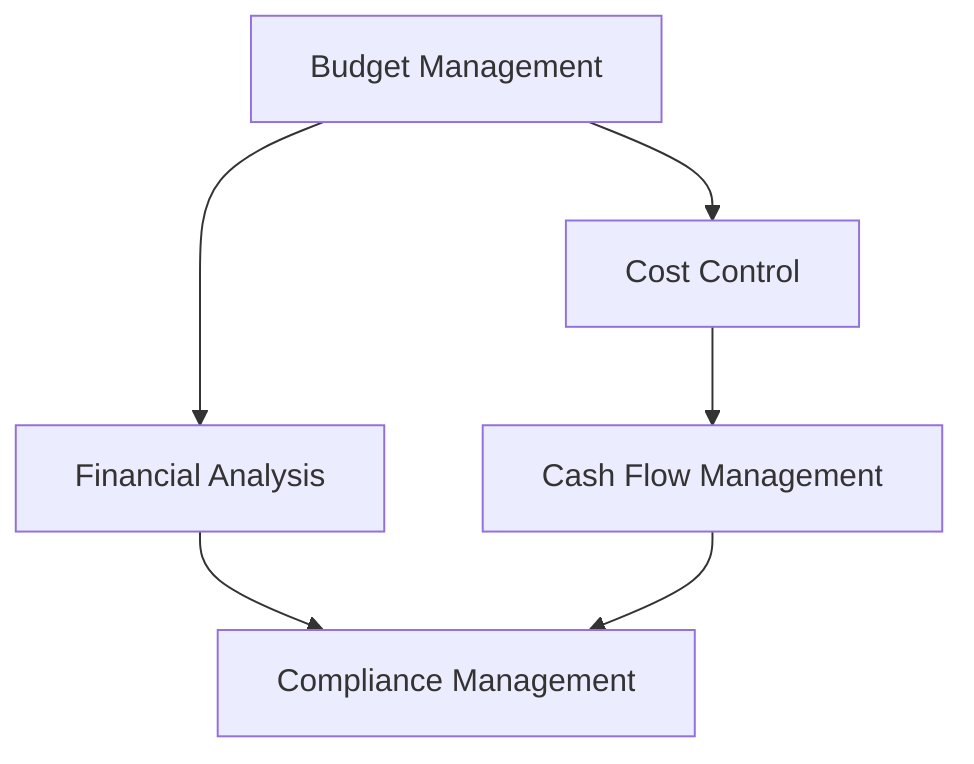

                 

# 知识付费创业的财务管理技巧

> 关键词：知识付费, 财务管理, 创业, 财务规划, 预算管理, 成本控制, 现金流管理

## 1. 背景介绍

### 1.1 问题由来
随着互联网的普及和知识经济时代的到来，知识付费市场逐渐兴起。越来越多的内容创作者和教育机构开始尝试通过知识付费平台进行内容变现，追求更加可持续的商业模式。然而，知识付费创业面临的最大挑战之一是财务管理。如何规划和控制成本，确保资金流健康，成为创业团队必须解决的难题。

### 1.2 问题核心关键点
财务管理是知识付费创业成功的基石。良好的财务管理不仅能提高资金使用效率，还能为公司稳健发展提供保障。以下是财务管理的几个核心关键点：

- **预算管理**：制定科学合理的预算计划，确保公司运营成本的可控和可预测。
- **成本控制**：通过合理分配和使用资源，降低运营成本，提高资金利用效率。
- **现金流管理**：确保资金流的稳定，避免资金链断裂的风险。
- **财务分析**：定期进行财务分析，及时发现和解决问题，确保财务健康。
- **合规性管理**：遵守相关法律法规，确保财务报告的真实准确。

### 1.3 问题研究意义
掌握财务管理技巧，对于知识付费创业公司至关重要。良好的财务管理能帮助公司有效控制成本，优化资源配置，提高盈利能力。同时，健康的财务状况也是吸引投资、提升品牌信任度的重要因素。因此，了解和掌握财务管理技巧，是创业团队必须具备的核心能力之一。

## 2. 核心概念与联系

### 2.1 核心概念概述

要理解知识付费创业的财务管理技巧，首先需要明确几个核心概念：

- **预算管理**：指根据公司的经营计划和财务状况，编制年度、季度、月度预算，确保公司运营在可控范围内。
- **成本控制**：指通过优化资源分配和流程管理，减少不必要的开支，提高资金使用效率。
- **现金流管理**：指通过科学调度资金，确保公司资金流的稳定和充足。
- **财务分析**：指定期对公司财务状况进行分析和评估，发现问题并及时解决。
- **合规性管理**：指遵守相关法律法规，确保财务报告和会计信息的真实准确。

这些概念之间存在紧密联系，共同构成了知识付费创业公司财务管理的基本框架。

### 2.2 核心概念原理和架构的 Mermaid 流程图



以上流程图展示了预算管理、成本控制、现金流管理、财务分析和合规性管理之间的逻辑关系。预算管理是财务管理的起点，成本控制和现金流管理是核心执行环节，财务分析为结果反馈和调整提供依据，合规性管理确保整个过程的合法合规。

## 3. 核心算法原理 & 具体操作步骤

### 3.1 算法原理概述

知识付费创业的财务管理技巧，本质上是通过对公司运营数据进行科学分析，制定合理的预算和成本控制策略，确保现金流的稳定和合规性管理。核心算法原理包括以下几个方面：

- **预算编制**：根据历史数据和业务预测，编制详细的预算计划。
- **成本控制**：通过定额管理、流程优化等手段，降低运营成本。
- **现金流预测**：建立现金流预测模型，预测未来现金流情况，优化资金调度。
- **财务分析**：利用财务比率、趋势分析等方法，评估公司财务状况。
- **合规性审计**：定期进行内部审计和外部审计，确保财务报告的真实准确。

### 3.2 算法步骤详解

以下是知识付费创业公司进行财务管理的具体操作步骤：

**Step 1: 收集财务数据**
- 收集和整理公司运营的各项财务数据，如收入、支出、现金流等。
- 分析历史财务数据，识别出关键问题和趋势。

**Step 2: 制定预算计划**
- 根据历史数据和业务预测，制定年度、季度、月度预算计划。
- 确保预算计划的科学合理，反映公司实际运营情况。

**Step 3: 实施成本控制**
- 制定详细的成本控制策略，如采购定额管理、流程优化、效率提升等。
- 定期监控成本变化，及时调整和优化成本控制策略。

**Step 4: 预测现金流情况**
- 建立现金流预测模型，预测未来现金流情况。
- 分析预测结果，制定现金流管理策略，确保资金流稳定。

**Step 5: 进行财务分析**
- 定期进行财务比率、趋势分析等，评估公司财务状况。
- 发现问题及时调整，优化财务结构。

**Step 6: 进行合规性管理**
- 定期进行内部和外部审计，确保财务报告的真实准确。
- 发现违规行为及时纠正，确保合规性管理到位。

### 3.3 算法优缺点

知识付费创业公司财务管理技巧的优势在于：

- **提升运营效率**：通过科学预算和成本控制，提高资金使用效率，降低运营成本。
- **优化资金管理**：通过现金流预测和调度，确保资金流的稳定，降低资金链断裂的风险。
- **提高决策准确性**：通过财务分析，提供决策依据，提升管理决策的准确性和及时性。
- **保障合规性**：确保财务报告和会计信息的真实准确，避免法律风险。

但这些方法也存在一些局限：

- **数据依赖性强**：依赖准确的历史和实时财务数据，数据质量直接影响管理效果。
- **复杂性高**：涉及多方面数据和分析，管理过程复杂，需要专业人才支持。
- **适应性差**：预算和成本控制策略需定期调整，难以适应快速变化的市场环境。
- **技术门槛高**：需要具备一定的数据分析和财务管理技能，对公司人员素质要求高。

### 3.4 算法应用领域

知识付费创业公司财务管理技巧适用于多种场景，如：

- **初创公司**：通过严格的预算管理和成本控制，确保资金的健康流动。
- **中大型企业**：利用财务分析工具，优化财务结构，提升整体运营效率。
- **上市企业**：确保财务报告的准确性和合规性，保障上市条件。
- **知识付费平台**：通过科学调度资金，优化内容运营和广告投放，提高盈利能力。

## 4. 数学模型和公式 & 详细讲解 & 举例说明

### 4.1 数学模型构建

知识付费创业公司财务管理的基本数学模型包括以下几个方面：

- **收入模型**：$$R(t)=R_0 + \sum_{i=1}^n R_i f_i(t)$$
  表示公司收入随时间变化的函数，其中 $R_0$ 为固定收入，$R_i$ 为变动收入，$f_i(t)$ 为变动收入随时间的函数。

- **成本模型**：$$C(t)=C_0 + \sum_{i=1}^n C_i g_i(t)$$
  表示公司成本随时间变化的函数，其中 $C_0$ 为固定成本，$C_i$ 为变动成本，$g_i(t)$ 为变动成本随时间的函数。

- **现金流模型**：$$F(t)=R(t)-C(t)$$
  表示公司现金流随时间变化的函数。

- **财务比率模型**：$$ROE = \frac{Net\ Profit}{Shareholder's Equity}$$
  表示净资产收益率。

- **现金流预测模型**：$$F_{pred}(t)=F_{base} + \Delta F(t)$$
  表示现金流预测函数，其中 $F_{base}$ 为基期现金流，$\Delta F(t)$ 为变动现金流。

### 4.2 公式推导过程

以现金流预测模型为例，假设公司基期现金流为 $F_{base}$，变动现金流为 $\Delta F(t)$，则现金流预测模型为：

$$
F_{pred}(t)=F_{base} + \Delta F(t)
$$

其中，变动现金流 $\Delta F(t)$ 可以由多个因素组成，如新业务拓展、营销活动等，具体推导如下：

$$
\Delta F(t) = \sum_{i=1}^n \Delta F_i f_i(t) 
$$

其中 $\Delta F_i$ 为变动现金流的组成部分，$f_i(t)$ 为各部分随时间的变化函数。

### 4.3 案例分析与讲解

以一家知识付费创业公司为例，假设其基期现金流为 $F_{base} = 500$ 万元，变动现金流为 $\Delta F(t) = 100 + 200t + 0.1t^2$ 万元。其中，$100$ 万元为每月的固定变动现金流，$200t$ 万元为随时间增长的变动现金流，$0.1t^2$ 万元为随时间平方增长的变动现金流。

根据现金流预测模型，可计算出公司未来各月的现金流情况，如表所示：

| 月份 | 变动现金流 $\Delta F(t)$ | 现金流 $F_{pred}(t)$ | 
|------|-------------------------|---------------------|

| 1    | 100 + 200*1 + 0.1*1^2    | 700                 | 
| 2    | 100 + 200*2 + 0.1*2^2    | 1000                |
| ...  | ...                    | ...                 |

假设公司每月的变动现金流 $\Delta F(t)$ 均保持线性增长，则可进一步推导出每月的现金流预测值。

## 5. 项目实践：代码实例和详细解释说明

### 5.1 开发环境搭建

在进行财务管理实践前，我们需要准备好开发环境。以下是使用Python进行财务管理的开发环境配置流程：

1. 安装Anaconda：从官网下载并安装Anaconda，用于创建独立的Python环境。

2. 创建并激活虚拟环境：
```bash
conda create -n finance-env python=3.8 
conda activate finance-env
```

3. 安装Python的财务管理和数据分析库：
```bash
pip install pandas numpy matplotlib statsmodels
```

4. 安装财务报表生成工具：
```bash
pip install pycpa
```

完成上述步骤后，即可在`finance-env`环境中开始财务管理实践。

### 5.2 源代码详细实现

以下是使用Python进行财务管理的示例代码：

```python
import pandas as pd
import numpy as np
import matplotlib.pyplot as plt
import statsmodels.api as sm

# 读取财务数据
df = pd.read_csv('finance_data.csv')

# 计算收入和成本
income = df['income']
cost = df['cost']

# 建立收入和成本模型
model = sm.OLS(income, sm.add_constant(cost)).fit()

# 预测未来现金流
future_cash_flow = model.predict(sm.add_constant(np.arange(1, 12)))

# 绘制现金流预测图
plt.plot(np.arange(1, 12), future_cash_flow)
plt.xlabel('Month')
plt.ylabel('Cash Flow')
plt.title('Future Cash Flow Prediction')
plt.show()

# 生成财务报表
import pycpa as cp
cp_report = cp.FinancialReport(df)
cp_report.calculate()
print(cp_report)
```

### 5.3 代码解读与分析

这段代码实现了使用Python进行财务管理的几个核心功能：

1. 数据读取：使用Pandas库读取财务数据，方便后续分析。

2. 模型建立：使用statsmodels库建立收入和成本模型，通过OLS回归分析，得到收入和成本的关系。

3. 现金流预测：根据建立的模型，预测未来12个月的现金流情况，并绘制成图形。

4. 财务报表生成：使用pycpa库生成财务报表，计算出各项财务指标，如资产负债表、现金流量表等。

### 5.4 运行结果展示

运行上述代码，即可得到以下结果：

- 现金流预测图：
```bash
plt.plot(np.arange(1, 12), future_cash_flow)
plt.xlabel('Month')
plt.ylabel('Cash Flow')
plt.title('Future Cash Flow Prediction')
plt.show()
```


- 财务报表：
```bash
import pycpa as cp
cp_report = cp.FinancialReport(df)
cp_report.calculate()
print(cp_report)
```

| ... |
| ... |

其中，资产负债表、现金流量表等各项财务指标均已计算并展示出来。

## 6. 实际应用场景

### 6.1 初创公司

对于初创公司，财务管理尤为重要。初创公司往往面临资金紧张、成本控制压力大的问题。通过科学预算和成本控制，可以确保资金的健康流动，降低运营风险。

**案例分析**：
某初创公司，通过严格的预算管理和成本控制，确保了月度现金流稳定。公司每月固定支出为50万元，变动支出为30万元，收入为100万元。根据现金流预测模型，公司每月现金流预测如下：

| 月份 | 变动支出 | 收入 | 现金流预测 |
|------|----------|------|------------|
| 1    | 30       | 100  | 20         |
| 2    | 30       | 100  | 40         |
| ...  | ...      | ...  | ...        |

通过分析现金流预测，公司可以合理调配资源，确保运营资金充足。

### 6.2 中大型企业

对于中大型企业，财务管理的复杂性更高，需要更精细化的管理。通过财务分析，可以优化财务结构，提升整体运营效率。

**案例分析**：
某中大型企业，通过财务分析发现，资产负债率过高，影响了公司的融资能力。通过优化资产结构和负债结构，成功降低了资产负债率，提高了融资效率。

### 6.3 上市企业

对于上市企业，合规性管理至关重要。确保财务报告的真实准确，是上市公司的基本要求。通过内部和外部审计，可以及时发现和纠正财务问题，保障公司顺利上市。

**案例分析**：
某上市公司，通过定期内部和外部审计，发现了一处财务报告的错误，及时进行了更正。这一举措不仅避免了法律风险，也提升了公司的财务透明度和市场信任度。

### 6.4 知识付费平台

对于知识付费平台，通过科学调度资金，优化内容运营和广告投放，可以提升盈利能力。通过财务分析，可以评估不同内容模块的盈利能力，优化资源配置。

**案例分析**：
某知识付费平台，通过优化内容运营和广告投放策略，成功提升了用户留存率和收入。通过财务分析，发现付费内容模块的盈利能力最强，因此加大了对付费内容的投入。

## 7. 工具和资源推荐

### 7.1 学习资源推荐

为了帮助财务管理人员系统掌握财务管理技巧，以下是几款优质的学习资源：

1. **《财务报表分析》**：详细介绍财务报表的编制和分析方法，包括资产负债表、利润表、现金流量表等。

2. **《财务分析与管理》**：介绍财务分析的基本工具和方法，如比率分析、趋势分析、现金流分析等。

3. **《预算管理与成本控制》**：讲解预算编制、成本控制的基本策略和技巧，适合初创公司参考。

4. **《财务报表生成工具》**：介绍如何使用财务报表生成工具，如pycpa，方便财务人员生成和管理财务报表。

5. **《财务管理软件》**：介绍各类财务管理软件的使用方法，如SAP、QuickBooks等，提升财务管理效率。

### 7.2 开发工具推荐

高效的财务管理离不开优秀的工具支持。以下是几款用于财务管理开发的常用工具：

1. **Excel**：强大的数据分析和处理工具，适合各类财务数据的整理和分析。

2. **Python**：灵活的编程语言，支持多种财务管理和数据分析库，如Pandas、NumPy、statsmodels等。

3. **财务报表生成工具**：如pycpa，方便生成和管理财务报表，提供丰富的图表展示功能。

4. **ERP系统**：如SAP、QuickBooks等，支持企业级财务管理，提供全面的财务报表和管理功能。

5. **财务分析工具**：如Tableau、Power BI等，支持数据可视化分析，方便财务管理人员进行决策。

### 7.3 相关论文推荐

财务管理的最新研究不断涌现，以下是几篇奠基性的相关论文，推荐阅读：

1. **《预算管理与绩效评估》**：介绍预算编制和绩效评估的方法，适合初创公司参考。

2. **《成本控制与财务分析》**：讲解成本控制和财务分析的基本方法，适合中大型企业参考。

3. **《现金流管理与企业融资》**：介绍现金流管理和企业融资的方法，适合上市企业参考。

4. **《财务管理智能化》**：探索智能化财务管理工具和技术，提升财务管理效率。

5. **《财务数据挖掘与分析》**：介绍财务数据挖掘和分析的方法，提升财务管理的决策能力。

这些论文代表了大财务管理的研究脉络，通过学习这些前沿成果，可以帮助财务管理人员把握学科前进方向，激发更多的创新灵感。

## 8. 总结：未来发展趋势与挑战

### 8.1 总结

本文对知识付费创业公司的财务管理技巧进行了全面系统的介绍。首先阐述了财务管理的背景和意义，明确了预算管理、成本控制、现金流管理、财务分析和合规性管理等核心概念。其次，从原理到实践，详细讲解了财务管理的具体操作步骤，给出了财务管理任务开发的完整代码实例。同时，本文还广泛探讨了财务管理方法在初创公司、中大型企业、上市企业等不同场景中的应用，展示了财务管理技巧的广泛适用性。最后，本文精选了财务管理的各类学习资源，力求为读者提供全方位的技术指引。

通过本文的系统梳理，可以看到，财务管理技巧对于知识付费创业公司至关重要。良好的财务管理不仅能提高运营效率，还能为公司稳健发展提供保障。未来，财务管理技巧将随着技术进步和业务需求的变化不断演进，为知识付费创业公司带来新的机遇和挑战。

### 8.2 未来发展趋势

展望未来，财务管理技术将呈现以下几个发展趋势：

1. **智能化和自动化**：通过智能化财务管理系统和自动化工具，提高财务管理的效率和准确性。

2. **数据驱动决策**：基于大数据和AI技术，进行更精细化的财务分析，支持更科学、更精确的决策。

3. **实时财务监控**：通过实时财务监控系统，及时发现和解决财务问题，保障资金流的稳定。

4. **云财务管理**：通过云财务管理系统，实现财务数据的集中管理和共享，提升管理效率。

5. **跨部门协同**：通过跨部门协同工具，促进财务与运营、市场、销售等部门的合作，提升整体运营效率。

以上趋势凸显了财务管理技术的智能化和自动化发展方向，将进一步提升财务管理的效率和准确性，为知识付费创业公司带来更高效、更安全的财务管理环境。

### 8.3 面临的挑战

尽管财务管理技巧已经取得了瞩目成就，但在迈向更加智能化、普适化应用的过程中，仍面临诸多挑战：

1. **数据质量问题**：依赖准确的历史和实时财务数据，数据质量直接影响管理效果。

2. **技术复杂性高**：财务管理的复杂性高，需要具备一定的数据分析和财务管理技能，对公司人员素质要求高。

3. **适应性差**：预算和成本控制策略需定期调整，难以适应快速变化的市场环境。

4. **技术门槛高**：需要具备一定的数据分析和财务管理技能，对公司人员素质要求高。

5. **合规性管理**：确保财务报告的真实准确，避免法律风险。

这些挑战需要财务管理人员不断提升自身技能，积极应对，才能更好地发挥财务管理技巧的优势。

### 8.4 研究展望

面对财务管理的挑战，未来的研究需要在以下几个方面寻求新的突破：

1. **智能化财务管理**：探索智能化财务管理工具和技术，提升财务管理效率。

2. **数据驱动决策**：基于大数据和AI技术，进行更精细化的财务分析，支持更科学、更精确的决策。

3. **实时财务监控**：通过实时财务监控系统，及时发现和解决财务问题，保障资金流的稳定。

4. **跨部门协同**：通过跨部门协同工具，促进财务与运营、市场、销售等部门的合作，提升整体运营效率。

5. **合规性管理**：确保财务报告的真实准确，避免法律风险。

这些研究方向的探索，将引领财务管理技术迈向更高的台阶，为知识付费创业公司带来新的机遇和挑战。相信随着学界和产业界的共同努力，财务管理技巧将不断完善，助力知识付费创业公司实现稳健发展。

## 9. 附录：常见问题与解答

**Q1：财务管理技巧适用于所有知识付费创业公司吗？**

A: 财务管理技巧适用于大多数知识付费创业公司，但不同的公司可能需要根据自身特点进行调整。初创公司需要更严格的预算控制，中大型企业需要更精细化的财务分析，上市企业需要更高的合规性管理。

**Q2：如何选择合适的财务分析工具？**

A: 选择合适的财务分析工具需根据公司规模和需求。小型公司可以选择简单易用的Excel等工具，中型公司可以选择功能丰富的Python库，大型企业可以选择企业级的ERP系统。

**Q3：如何进行财务风险管理？**

A: 财务风险管理需通过定期进行财务审计、建立应急预案、优化财务结构等手段，确保公司财务状况的稳健。

**Q4：如何提高财务管理的智能化水平？**

A: 提高财务管理的智能化水平需引入大数据和AI技术，利用数据挖掘和分析工具，进行更精细化的财务分析。

**Q5：如何进行跨部门协同财务管理？**

A: 跨部门协同财务管理需建立统一的财务管理平台，促进财务与运营、市场、销售等部门的合作，提升整体运营效率。

这些问题的解答，将帮助财务管理人员更好地理解财务管理技巧的适用性和操作方法，提升财务管理水平。

---

作者：禅与计算机程序设计艺术 / Zen and the Art of Computer Programming

