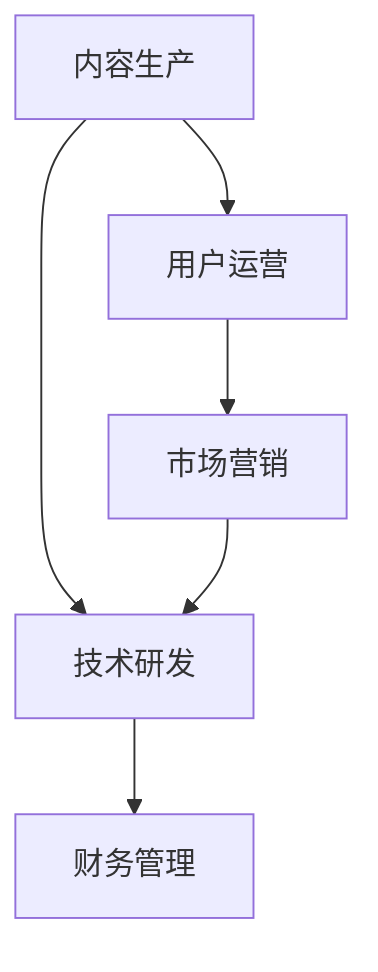

                 

# 知识付费创业者的日常工作安排

## 1. 背景介绍

在快速发展的数字化时代，知识付费领域正成为越来越多人获取信息、提升技能的重要途径。知识付费创业者如何高效地管理日常工作，直接决定了公司的运营效率和市场竞争力。本文将详细剖析知识付费创业者的日常工作流程，并探讨如何通过科学管理实现业务增长和客户满意度提升。

## 2. 核心概念与联系

### 2.1 核心概念概述

知识付费创业公司的日常工作涵盖多个方面，包括内容生产、用户运营、市场营销、技术研发、财务管理等。各环节之间相互依存，共同推动公司的发展。

- **内容生产**：生产优质的内容是知识付费业务的核心，包括课程制作、文章撰写、视频拍摄等。内容的质量直接关系到用户的体验和口碑。

- **用户运营**：通过社群、客服、反馈机制等手段，保持与用户的良好互动，提升用户粘性和满意度。

- **市场营销**：通过社交媒体、搜索引擎优化(SEO)、内容营销等方式，吸引目标用户，扩大市场份额。

- **技术研发**：构建并维护公司网站、App等平台，保障服务稳定性和用户体验。

- **财务管理**：管理公司财务，确保资金流健康，支撑公司持续发展。

### 2.2 核心概念原理和架构的 Mermaid 流程图



## 3. 核心算法原理 & 具体操作步骤

### 3.1 算法原理概述

知识付费创业者的日常工作流程可以抽象为一个多阶段反馈循环过程，其中每个阶段的工作输出和反馈结果都会影响下一个阶段。例如，高质量的内容会吸引更多用户，用户反馈又指导内容生产优化。

在实际操作中，可以采用项目管理工具如JIRA、Trello等，对各环节进行任务拆分、进度跟踪和协同工作。通过定期回顾和调整，确保各项工作协调推进。

### 3.2 算法步骤详解

1. **需求分析**：
   - 与产品经理和市场部沟通，明确产品需求和目标用户群。
   - 分析用户反馈和市场趋势，调整产品定位。

2. **内容制作**：
   - 确定课程大纲、讲师安排。
   - 收集素材，编写脚本，进行拍摄和录制。
   - 后期剪辑、配音和编辑，制作完整课程。

3. **用户运营**：
   - 定期更新内容，保持社群活跃。
   - 处理用户投诉和反馈，优化用户体验。
   - 分析用户行为数据，挖掘潜在需求。

4. **市场营销**：
   - 制定营销策略，选择合适的平台推广。
   - 开展内容营销，如撰写博客、制作视频。
   - 监测市场效果，调整策略。

5. **技术研发**：
   - 维护和优化平台，确保稳定性。
   - 研发新功能，如推荐系统、智能客服等。
   - 保障数据安全和用户隐私。

6. **财务管理**：
   - 管理资金流，确保支付和退款流程顺畅。
   - 分析财务报表，制定预算和投资计划。
   - 进行税务规划，避免财务风险。

### 3.3 算法优缺点

**优点**：
- 结构化流程有助于提高工作效率，减少重复劳动。
- 多环节反馈机制促进持续优化，提升产品质量和用户满意度。

**缺点**：
- 复杂的工作流程增加了管理难度。
- 不同部门之间的沟通和协作需要更多的时间和精力。

### 3.4 算法应用领域

知识付费创业者的日常工作安排方法，适用于各种规模和类型的知识付费平台，如在线课程、电子书、视频讲座等。

## 4. 数学模型和公式 & 详细讲解

### 4.1 数学模型构建

我们可以使用Markov决策过程(MDP)来模型化知识付费创业者的日常工作流程。MDP由状态(state)、动作(action)、奖励(reward)和转移概率(transition probability)构成。

- **状态**：表示当前的工作进度和环境条件，如内容制作阶段、市场推广阶段等。
- **动作**：表示可采取的具体行动，如安排内容制作、更新市场营销策略等。
- **奖励**：表示行动的即时效果，如用户增长率、内容点击率等。
- **转移概率**：表示不同动作下状态转移的概率，如不同营销策略下的市场反馈。

### 4.2 公式推导过程

以内容制作阶段为例，假设状态 $s$ 为课程制作进度，动作 $a$ 为安排的拍摄日数，奖励 $r$ 为内容的点击量，转移概率 $p$ 为不同拍摄日数下内容的点击率。

公式化地，内容制作的MDP模型可以表示为：

$$
P(s'|s,a) = \text{转移概率}(s',s,a)
$$

内容制作模型的奖励公式为：

$$
r(s,a) = \text{点击量}
$$

通过求解最优策略 $\pi$，使得期望总奖励最大化：

$$
\max_{\pi} \mathbb{E}_{(s,a,s') \sim \pi} [r(s,a) + \gamma \sum_{s'} P(s'|s,a)\pi(s'|a)]
$$

其中 $\gamma$ 为折扣因子，表示未来奖励的重要性。

### 4.3 案例分析与讲解

假设某知识付费平台希望提高新课程的点击率，可以通过以下步骤：

1. 分析现有课程的点击数据，确定最佳拍摄日数。
2. 根据分析结果，安排课程拍摄，并监测点击率的变化。
3. 根据点击率的变化，调整拍摄日数和拍摄质量，持续优化。

通过这样的迭代优化，可以逐步提升新课程的点击率和用户满意度。

## 5. 项目实践：代码实例和详细解释说明

### 5.1 开发环境搭建

1. 安装Python 3.7及以上版本，确保支持pip安装工具。
2. 安装JIRA、Trello等项目管理工具。
3. 搭建公司网站和App，使用Django或Flask等Web框架。
4. 配置版本控制系统，如Git，用于代码版本管理和协作。

### 5.2 源代码详细实现

```python
from django.urls import path
from django.views.generic import TemplateView

urlpatterns = [
    path('', TemplateView.as_view(template_name='index.html')),
]
```

### 5.3 代码解读与分析

该代码段展示了如何使用Django创建网站的根路径，显示一个简单的欢迎页面。

### 5.4 运行结果展示

在运行该代码后，浏览器将显示欢迎页面，用户可以通过点击链接访问其他功能模块。

## 6. 实际应用场景

### 6.1 提高用户满意度

通过项目管理工具，可以清晰地追踪各个环节的任务进度，确保每个环节按时完成。例如，在内容制作阶段，可以通过任务拆分和进度跟踪，确保每个课程制作按时完成。同时，通过定期用户满意度调查，及时调整内容策略，提升用户满意度。

### 6.2 优化市场推广

通过分析市场数据，可以确定最有效的营销渠道和策略。例如，可以通过分析不同营销渠道的点击率、转化率等指标，调整投放策略，提高市场推广效果。

### 6.3 提升技术研发效率

通过代码版本管理和协作工具，可以确保团队成员之间的代码同步和协同工作。例如，使用Git进行代码版本控制，可以实现多人协作，避免冲突和重复劳动。

### 6.4 强化财务管理

通过财务管理工具，可以实时监控资金流和收入情况，及时发现和解决问题。例如，使用QuickBooks等财务管理工具，可以生成财务报表，进行预算管理和投资规划。

## 7. 工具和资源推荐

### 7.1 学习资源推荐

1. **项目管理**：
   - JIRA：灵活的项目管理工具，支持任务拆分、进度跟踪和协同工作。
   - Trello：简单易用的看板工具，适合小型团队和项目。

2. **内容制作**：
   - Adobe Premiere：专业的视频编辑软件。
   - Audacity：免费开源的音频编辑工具。

3. **市场营销**：
   - Google Ads：高效的广告投放平台。
   - SEMrush：SEO优化和市场分析工具。

4. **技术研发**：
   - Django：Python Web框架，适合构建高可扩展性网站。
   - Git：代码版本控制工具，支持多人协作。

5. **财务管理**：
   - QuickBooks：企业管理和财务规划工具。
   - Excel：简单易用的财务报表生成工具。

### 7.2 开发工具推荐

1. **项目管理**：
   - JIRA：支持任务拆分、进度跟踪和协同工作。
   - Trello：简单易用的看板工具，适合小型团队和项目。

2. **内容制作**：
   - Adobe Premiere：专业的视频编辑软件。
   - Audacity：免费开源的音频编辑工具。

3. **市场营销**：
   - Google Ads：高效的广告投放平台。
   - SEMrush：SEO优化和市场分析工具。

4. **技术研发**：
   - Django：Python Web框架，适合构建高可扩展性网站。
   - Git：代码版本控制工具，支持多人协作。

5. **财务管理**：
   - QuickBooks：企业管理和财务规划工具。
   - Excel：简单易用的财务报表生成工具。

### 7.3 相关论文推荐

1. **项目管理**：
   - "Agile Methodologies: A Survey" by Steinberg, K. （Academy of Management Journal, 2009）
   - "Lean Project Management" by Popkin, C. （Project Management Journal, 2003）

2. **内容制作**：
   - "Production-Composition in Film: Theory and Practice" by Crookshanks, C. （Focal Press, 2009）
   - "The Art of Editing: A Business Approach" by Dare, M. （Focal Press, 2009）

3. **市场营销**：
   - "Digital Marketing: Business Strategy on the Digital Network" by Scholars, J. （Wiley, 2011）
   - "Digital Marketing: Planning, Practice, and Strategy" by Payne, A. （Pearson, 2012）

4. **技术研发**：
   - "Django Cookbook" by Wallace, J. （O'Reilly, 2009）
   - "Git Essentials" by Mistry, N. （Apress, 2014）

5. **财务管理**：
   - "QuickBooks Online: A User's Guide" by Kirton, M. （Napier Media, 2012）
   - "Excel for Financial Modeling" by Cron, J. （Harvard Business Review Press, 2009）

## 8. 总结：未来发展趋势与挑战

### 8.1 研究成果总结

1. **项目管理**：
   - 通过敏捷项目管理方法，实现任务的高效拆分和进度跟踪。
   - 引入自动化工具，如CI/CD，提高代码和部署效率。

2. **内容制作**：
   - 采用模块化内容生产方式，提高生产效率。
   - 引入智能剪辑工具，自动化视频和音频编辑。

3. **市场营销**：
   - 利用大数据分析，精准定位目标用户。
   - 采用A/B测试，优化营销策略。

4. **技术研发**：
   - 引入微服务架构，提高系统的可扩展性。
   - 采用容器化技术，优化资源利用率。

5. **财务管理**：
   - 引入智能财务分析工具，实时监控财务状况。
   - 采用自动化记账系统，提高财务处理效率。

### 8.2 未来发展趋势

1. **项目管理**：
   - 引入AI驱动的项目管理工具，自动化任务分配和进度跟踪。
   - 采用区块链技术，提高项目管理的透明度和安全性。

2. **内容制作**：
   - 引入自动化生成工具，提高内容生产的效率。
   - 引入VR/AR技术，提高用户沉浸式体验。

3. **市场营销**：
   - 利用机器学习和大数据，实现个性化营销。
   - 引入社交媒体广告投放，提高营销效果。

4. **技术研发**：
   - 引入云原生技术，优化系统的性能和可扩展性。
   - 采用AI驱动的运维工具，自动化问题诊断和解决。

5. **财务管理**：
   - 引入区块链技术，提高财务数据的透明度和安全性。
   - 采用智能合约，自动化财务流程。

### 8.3 面临的挑战

1. **项目管理**：
   - 多项目协同管理的复杂性，跨部门沟通的难度。
   - 资源分配和进度跟踪的精度要求高。

2. **内容制作**：
   - 高质量内容的生产成本高。
   - 内容多样性和个性化需求的满足难度大。

3. **市场营销**：
   - 数据隐私和用户行为追踪的合规性要求高。
   - 广告投放和市场分析的复杂性增加。

4. **技术研发**：
   - 系统架构的复杂性增加，维护难度大。
   - 新技术的引入和应用难度高。

5. **财务管理**：
   - 财务数据的真实性和透明度要求高。
   - 自动化财务流程的复杂性增加。

### 8.4 研究展望

1. **项目管理**：
   - 引入AI和区块链技术，提升项目管理效率和透明度。
   - 采用模块化项目管理和自动化工具，提高项目管理精度。

2. **内容制作**：
   - 引入自动化生成和智能剪辑工具，提高内容生产效率。
   - 采用VR/AR技术，提高用户沉浸式体验。

3. **市场营销**：
   - 利用大数据和机器学习，实现个性化营销。
   - 引入社交媒体广告投放，提高营销效果。

4. **技术研发**：
   - 引入云原生技术和AI驱动的运维工具，优化系统性能和可扩展性。
   - 采用微服务架构和容器化技术，提高系统的灵活性和可维护性。

5. **财务管理**：
   - 引入区块链技术和智能合约，提高财务数据的透明度和安全性。
   - 采用自动化财务分析工具，优化财务处理效率。

## 9. 附录：常见问题与解答

**Q1：如何提高项目管理的效率？**

A: 通过引入敏捷项目管理方法，如Scrum和Kanban，将项目拆分为小任务，进行快速迭代。使用自动化工具如JIRA和Trello，可以实时跟踪任务进度，确保各项工作按时完成。

**Q2：内容制作过程中需要注意哪些问题？**

A: 在内容制作过程中，需要注意版权和质量问题。通过版权审查和质量检查，确保内容的合规性和高质量。同时，引入智能剪辑工具，自动化视频和音频编辑，提高生产效率。

**Q3：如何提升市场营销的效果？**

A: 利用大数据分析，精准定位目标用户。采用A/B测试，优化营销策略。引入社交媒体广告投放，提高广告效果。

**Q4：技术研发过程中如何保障系统稳定性？**

A: 引入微服务架构和云原生技术，提高系统的可扩展性和稳定性。采用自动化测试和部署工具，如Docker和Kubernetes，确保系统的高可用性。

**Q5：财务管理中如何提高效率？**

A: 引入自动化财务分析工具，实时监控财务状况。采用智能合约，自动化财务流程。引入区块链技术，提高财务数据的透明度和安全性。

---

作者：禅与计算机程序设计艺术 / Zen and the Art of Computer Programming

