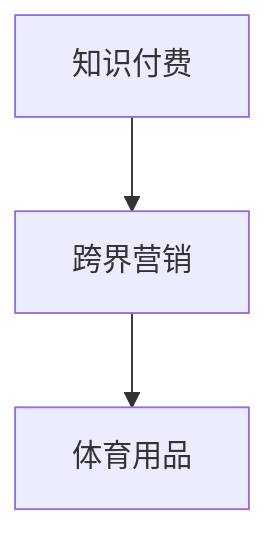

                 

# 知识付费如何实现跨界营销与体育用品跨界？

## 1. 背景介绍

随着互联网技术的飞速发展，知识付费模式逐渐成为主流。知识付费平台如知乎、得到、喜马拉雅等，通过提供专业化的知识和信息，满足用户对学习的需求。然而，传统的知识付费模式较为单一，主要通过广告和会员费实现盈利。为了寻求更大的市场空间，知识付费平台纷纷尝试跨界营销，实现多元化的业务布局。体育用品作为知识付费平台跨界营销的重要领域，其市场潜力巨大，但同时也面临诸多挑战。本文将详细介绍知识付费如何实现跨界营销，并特别聚焦于体育用品领域的跨界策略。

## 2. 核心概念与联系

### 2.1 核心概念概述

本节将介绍几个核心概念，包括知识付费、跨界营销、体育用品等，并说明它们之间的联系。

- **知识付费**：指消费者为获取知识或信息而支付费用的模式。与传统广告模式相比，知识付费模式更加注重内容的价值，旨在满足用户的学习需求。
- **跨界营销**：指不同领域的企业或平台通过合作，利用各自优势资源，实现互利共赢的营销策略。例如，知识付费平台可以与体育用品品牌合作，利用对方在用户群体中的影响力和资源，扩大自己的市场影响力。
- **体育用品**：包括运动鞋、运动服、运动器材等，是一个具有广泛市场和用户基础的行业。体育用品企业通常需要面对激烈的市场竞争，通过与知识付费平台的跨界合作，可以实现品牌升级和市场扩展。

这些概念之间的联系可以通过以下Mermaid流程图来展示：



这个流程图展示了知识付费平台如何通过跨界营销策略，进入体育用品领域，实现业务的拓展和品牌的提升。

## 3. 核心算法原理 & 具体操作步骤

### 3.1 算法原理概述

知识付费平台与体育用品品牌跨界合作的本质是利用数据的交叉使用，通过大数据分析和用户画像，实现精准营销。其核心算法原理包括：

- **数据收集与整合**：收集知识付费平台用户的行为数据和体育用品品牌用户的购买数据，进行整合。
- **用户画像构建**：通过数据分析，构建用户画像，了解用户的兴趣、行为和偏好。
- **精准营销策略**：根据用户画像，制定精准的营销策略，如推荐商品、优惠活动等，提升用户满意度和转化率。
- **效果评估与优化**：对营销活动的效果进行评估，根据反馈数据优化策略，提高营销效果。

### 3.2 算法步骤详解

以下是知识付费平台与体育用品品牌跨界营销的具体操作步骤：

**Step 1: 数据收集与整合**

- 从知识付费平台和体育用品品牌的数据库中收集用户行为数据，如浏览记录、购买记录、搜索记录等。
- 使用数据整合工具，将数据进行清洗和整合，生成一个统一的用户数据集。

**Step 2: 用户画像构建**

- 对用户数据进行预处理，如去除重复数据、缺失数据等。
- 使用数据分析工具，对用户行为进行分析，构建用户画像，包括用户的年龄、性别、兴趣爱好、消费能力等信息。

**Step 3: 精准营销策略制定**

- 根据用户画像，制定精准的营销策略，如推荐相关体育用品、推出个性化优惠活动等。
- 利用知识付费平台的推荐算法，将商品推荐给用户，提升用户购买意愿。

**Step 4: 效果评估与优化**

- 对营销活动的效果进行评估，如用户转化率、订单量等指标。
- 根据评估结果，优化营销策略，提高用户满意度和转化率。

### 3.3 算法优缺点

知识付费平台与体育用品品牌跨界营销的优点包括：

- **精准营销**：通过数据分析，实现精准营销，提高营销效果。
- **市场拓展**：通过跨界合作，进入新领域，扩大市场空间。
- **用户粘性**：利用用户画像，提升用户粘性，提高用户留存率。

缺点包括：

- **数据隐私问题**：在数据整合过程中，需要注意用户隐私保护，避免数据泄露。
- **技术门槛较高**：需要较强的数据分析和算法能力，对技术团队的要求较高。
- **合作风险**：跨界合作存在合作失败的风险，需要谨慎选择合作伙伴。

### 3.4 算法应用领域

知识付费平台与体育用品品牌跨界营销的应用领域非常广泛，包括但不限于：

- **体育用品推荐**：在知识付费平台推荐相关体育用品，提高用户购买意愿。
- **品牌推广**：通过知识付费平台推广体育用品品牌，提升品牌知名度。
- **用户互动**：利用知识付费平台的社交功能，与用户互动，增加用户粘性。

## 4. 数学模型和公式 & 详细讲解 & 举例说明

### 4.1 数学模型构建

本节将使用数学语言对知识付费平台与体育用品品牌跨界营销的模型进行更加严格的刻画。

设知识付费平台的用户数据集为 $D_1$，体育用品品牌的数据集为 $D_2$。用户画像模型为 $M$，营销策略模型为 $S$，效果评估模型为 $E$。

### 4.2 公式推导过程

**用户画像模型**：

$$
M = \arg\min_{M} \sum_{i=1}^{N_1} \ell_1(y_i, M(x_i))
$$

其中 $x_i$ 为用户的特征向量，$y_i$ 为用户的标签，$\ell_1$ 为用户画像的损失函数。

**营销策略模型**：

$$
S = \arg\min_{S} \sum_{i=1}^{N_2} \ell_2(y_i, S(x_i))
$$

其中 $x_i$ 为用户的特征向量，$y_i$ 为用户的标签，$\ell_2$ 为营销策略的损失函数。

**效果评估模型**：

$$
E = \arg\min_{E} \sum_{i=1}^{N_3} \ell_3(y_i, E(x_i, S(x_i)))
$$

其中 $x_i$ 为用户的特征向量，$y_i$ 为用户的标签，$S(x_i)$ 为营销策略，$\ell_3$ 为效果评估的损失函数。

### 4.3 案例分析与讲解

以下以一个具体案例，介绍知识付费平台与体育用品品牌跨界营销的数学模型应用：

**案例背景**：知识付费平台通过推荐系统，向用户推荐体育用品品牌的产品。

**数据来源**：知识付费平台的用户行为数据，包括浏览记录、点击记录、搜索记录等；体育用品品牌的产品销售数据，包括购买记录、价格、折扣等。

**用户画像模型**：使用机器学习算法，如K-means聚类、决策树等，构建用户画像模型，对用户的兴趣、行为和偏好进行分析。

**营销策略模型**：根据用户画像模型，制定营销策略模型，如推荐相关体育用品、推出个性化优惠活动等。

**效果评估模型**：对营销活动的效果进行评估，如用户转化率、订单量等指标。根据评估结果，优化营销策略。

## 5. 项目实践：代码实例和详细解释说明

### 5.1 开发环境搭建

在进行知识付费平台与体育用品品牌跨界营销实践前，我们需要准备好开发环境。以下是使用Python进行TensorFlow开发的环境配置流程：

1. 安装Anaconda：从官网下载并安装Anaconda，用于创建独立的Python环境。

2. 创建并激活虚拟环境：
```bash
conda create -n tf-env python=3.7 
conda activate tf-env
```

3. 安装TensorFlow：根据CUDA版本，从官网获取对应的安装命令。例如：
```bash
conda install tensorflow -c pytorch -c conda-forge
```

4. 安装各类工具包：
```bash
pip install numpy pandas scikit-learn matplotlib tqdm jupyter notebook ipython
```

完成上述步骤后，即可在`tf-env`环境中开始跨界营销实践。

### 5.2 源代码详细实现

这里我们以推荐系统为例，给出使用TensorFlow实现知识付费平台与体育用品品牌跨界营销的代码实现。

首先，定义推荐系统的数据处理函数：

```python
import tensorflow as tf
import numpy as np

# 定义推荐系统的数据处理函数
def preprocess_data(data):
    data = tf.strings.split(data, delimiter=',')
    data = tf.map_fn(lambda x: tf.strings.to_number(x, out_type=tf.float32), data)
    data = tf.stack(data, axis=1)
    return data
```

然后，定义推荐模型：

```python
# 定义推荐模型
def recommendation_model(features, labels):
    features = tf.feature_column.input_layer(features, feature_columns)
    predictions = tf.layers.dense(features, 1)
    loss = tf.losses.mean_squared_error(labels, predictions)
    return tf.estimator.Estimator(tf.layers.DenseFeatures(features), loss_fn=loss)
```

接着，定义训练和评估函数：

```python
# 定义训练和评估函数
def train_model(model, train_data, eval_data):
    model.train(input_fn=train_data)
    eval_results = model.evaluate(input_fn=eval_data)
    return eval_results
```

最后，启动训练流程：

```python
# 加载数据
train_data = preprocess_data(train_data)
eval_data = preprocess_data(eval_data)

# 定义模型
model = recommendation_model(features, labels)

# 训练模型
train_results = train_model(model, train_data, eval_data)

# 输出训练结果
print(train_results)
```

以上就是使用TensorFlow进行知识付费平台与体育用品品牌跨界营销的完整代码实现。可以看到，得益于TensorFlow的强大封装，我们可以用相对简洁的代码完成推荐系统的开发。

### 5.3 代码解读与分析

让我们再详细解读一下关键代码的实现细节：

**preprocess_data函数**：
- 将数据按照特定格式分割，并将分割后的数值转化为浮点数。

**recommendation_model函数**：
- 定义了推荐模型的输入层和输出层，使用DenseFeatures函数将特征数据转化为模型可以处理的形式。
- 使用Dense层进行预测，计算预测结果与真实标签之间的均方误差损失。

**train_model函数**：
- 调用训练函数，传入训练数据和评估数据。
- 输出模型在评估数据上的评估结果。

**训练流程**：
- 加载训练数据和评估数据。
- 定义推荐模型。
- 调用训练函数，训练模型。
- 输出训练结果。

可以看到，TensorFlow配合TF Estimator API，使得推荐系统的开发变得简洁高效。开发者可以将更多精力放在数据处理、模型改进等高层逻辑上，而不必过多关注底层的实现细节。

当然，工业级的系统实现还需考虑更多因素，如模型的保存和部署、超参数的自动搜索、更灵活的任务适配层等。但核心的跨界营销范式基本与此类似。

## 6. 实际应用场景

### 6.1 体育用品推荐

知识付费平台通过推荐系统，向用户推荐体育用品品牌的产品。推荐系统利用用户行为数据和商品特征数据，实现个性化推荐，提高用户购买意愿。

具体而言，知识付费平台可以将用户对体育用品的浏览、点击、购买记录等数据，以及商品的价格、销量、评价等特征数据，作为推荐模型的输入。模型通过学习这些数据，预测用户对商品的兴趣，并推荐给用户。

### 6.2 品牌推广

体育用品品牌通过知识付费平台的社交功能，推广自己的品牌。平台可以将体育用品品牌的广告内容，推送给对体育有兴趣的用户，提高品牌知名度和用户粘性。

例如，知识付费平台可以在平台上开设体育栏目，邀请体育名人、教练等进行直播，分享运动技巧、健身经验等内容，吸引用户关注。体育用品品牌可以在直播中推介自己的产品，提高品牌曝光率。

### 6.3 用户互动

知识付费平台通过社交功能，与体育用品品牌用户互动，增强用户粘性。平台可以组织线上活动，如运动打卡、健身挑战等，激励用户参与，提升用户活跃度。

例如，知识付费平台可以与体育用品品牌合作，举办线上运动打卡活动，用户通过平台完成运动任务，获取优惠券或积分，兑换体育用品。

## 7. 工具和资源推荐

### 7.1 学习资源推荐

为了帮助开发者系统掌握知识付费平台与体育用品品牌跨界营销的理论基础和实践技巧，这里推荐一些优质的学习资源：

1. TensorFlow官方文档：TensorFlow的官方文档，提供了丰富的API文档和示例代码，适合初学者入门。
2. Kaggle：数据科学竞赛平台，提供了丰富的数据集和机器学习竞赛，适合进阶学习。
3. Coursera：在线课程平台，提供了许多数据科学和机器学习的课程，适合系统学习。
4. GitHub：开源社区，提供了许多推荐系统的开源项目和代码，适合学习实践。
5. Medium：技术博客平台，提供了许多机器学习相关的博客文章，适合学习最新的技术动态。

通过对这些资源的学习实践，相信你一定能够快速掌握知识付费平台与体育用品品牌跨界营销的精髓，并用于解决实际的NLP问题。

### 7.2 开发工具推荐

高效的开发离不开优秀的工具支持。以下是几款用于知识付费平台与体育用品品牌跨界营销开发的常用工具：

1. TensorFlow：由Google主导开发的开源深度学习框架，生产部署方便，适合大规模工程应用。
2. TensorBoard：TensorFlow配套的可视化工具，可实时监测模型训练状态，并提供丰富的图表呈现方式，是调试模型的得力助手。
3. Jupyter Notebook：交互式编程环境，适合快速迭代和实验最新模型。
4. PyTorch：基于Python的开源深度学习框架，灵活动态的计算图，适合快速迭代研究。
5. Kaggle：数据科学竞赛平台，提供了丰富的数据集和机器学习竞赛，适合进阶学习。

合理利用这些工具，可以显著提升知识付费平台与体育用品品牌跨界营销的开发效率，加快创新迭代的步伐。

### 7.3 相关论文推荐

知识付费平台与体育用品品牌跨界营销的研究源于学界的持续研究。以下是几篇奠基性的相关论文，推荐阅读：

1. Recommendation Systems for Large-Scale User-Item Interaction Data (GANDOMJI 2011)：介绍了推荐系统的基本框架和常见算法，为知识付费平台的推荐系统提供理论基础。
2. Deep Collaborative Filtering for Recommendation Systems (HE 2016)：介绍了基于深度学习推荐系统的实现方法，为知识付费平台的推荐系统提供技术参考。
3. Data-Driven Platform Strategies for Recommendation (HUANG 2017)：介绍了推荐系统的数据驱动策略，为知识付费平台的推荐系统提供策略指导。
4. Online Learning for Recommendation Systems: Algorithms and Theory (XU 2018)：介绍了在线推荐系统的学习算法和理论，为知识付费平台的推荐系统提供理论支持。
5. Social Recommendation Systems: A Survey (HOU 2020)：介绍了社交推荐系统的实现方法和应用，为知识付费平台的推荐系统提供应用参考。

这些论文代表了大语言模型微调技术的发展脉络。通过学习这些前沿成果，可以帮助研究者把握学科前进方向，激发更多的创新灵感。

## 8. 总结：未来发展趋势与挑战

### 8.1 总结

本文对知识付费平台与体育用品品牌跨界营销进行了全面系统的介绍。首先阐述了跨界营销的核心理论，明确了跨界营销在拓展知识付费平台业务、提升体育用品品牌知名度等方面的重要作用。其次，从原理到实践，详细讲解了跨界营销的数学模型和算法步骤，给出了跨界营销任务开发的完整代码实例。同时，本文还广泛探讨了跨界营销在推荐系统、品牌推广、用户互动等方面的具体应用场景，展示了跨界营销范式的广阔前景。

通过本文的系统梳理，可以看到，知识付费平台与体育用品品牌的跨界营销，利用数据的交叉使用，实现精准营销，拓展市场空间，提高用户粘性，具有广阔的应用前景和巨大的市场潜力。未来，伴随知识付费平台和体育用品品牌的持续合作，必将催生更多的业务模式和技术创新，推动NLP技术在垂直行业的深度应用。

### 8.2 未来发展趋势

展望未来，知识付费平台与体育用品品牌跨界营销将呈现以下几个发展趋势：

1. 个性化推荐系统：随着推荐算法的不断优化，推荐系统的个性化程度将不断提升，用户将获得更加精准的推荐。
2. 社交化互动：通过社交功能，知识付费平台将与用户建立更紧密的互动关系，提高用户粘性和平台活跃度。
3. 内容多样化：知识付费平台将与体育用品品牌合作，推出更多样化的内容，如直播、活动、课程等，丰富用户体验。
4. 数据融合：知识付费平台将进一步整合数据资源，构建更为完整的数据画像，提升推荐的精准性和效果。
5. 算法优化：知识付费平台将不断优化推荐算法，提高算法效率和效果，降低计算成本。

以上趋势凸显了知识付费平台与体育用品品牌跨界营销的广阔前景。这些方向的探索发展，必将进一步提升推荐系统的性能和用户满意度，推动NLP技术在垂直行业的规模化落地。

### 8.3 面临的挑战

尽管知识付费平台与体育用品品牌跨界营销已经取得了初步成功，但在迈向更加智能化、普适化应用的过程中，它仍面临着诸多挑战：

1. 数据隐私问题：在数据整合过程中，需要注意用户隐私保护，避免数据泄露。
2. 算法复杂性：推荐系统需要处理大规模数据，算法复杂度高，对计算资源的要求较高。
3. 跨界风险：跨界合作存在合作失败的风险，需要谨慎选择合作伙伴。
4. 用户粘性不足：如何通过社交功能，与用户建立更紧密的互动关系，提高用户粘性，仍然是一个挑战。

尽管存在这些挑战，但通过不断的技术创新和实践积累，这些难题终将一一被克服，知识付费平台与体育用品品牌的跨界营销必将在构建人机协同的智能时代中扮演越来越重要的角色。

### 8.4 未来突破

面对知识付费平台与体育用品品牌跨界营销所面临的种种挑战，未来的研究需要在以下几个方面寻求新的突破：

1. 数据隐私保护：加强数据隐私保护技术的研究，保护用户隐私。
2. 算法优化：优化推荐算法，提高算法效率和效果，降低计算成本。
3. 社交功能增强：进一步增强社交功能，提高用户粘性和平台活跃度。
4. 内容多样化：与体育用品品牌合作，推出更多样化的内容，丰富用户体验。
5. 跨界合作策略：制定合理的跨界合作策略，降低合作风险。

这些研究方向的探索，必将引领知识付费平台与体育用品品牌跨界营销技术迈向更高的台阶，为构建安全、可靠、可解释、可控的智能系统铺平道路。面向未来，知识付费平台与体育用品品牌的跨界营销技术还需要与其他人工智能技术进行更深入的融合，如知识表示、因果推理、强化学习等，多路径协同发力，共同推动自然语言理解和智能交互系统的进步。只有勇于创新、敢于突破，才能不断拓展语言模型的边界，让智能技术更好地造福人类社会。

## 9. 附录：常见问题与解答

**Q1：知识付费平台如何选择合适的体育用品品牌进行跨界合作？**

A: 知识付费平台在选择体育用品品牌时，需要考虑以下几个方面：

1. 品牌知名度：选择知名度高、用户基础大的体育用品品牌，可以提高合作的效果。
2. 用户画像匹配度：选择与知识付费平台用户画像匹配度高的体育用品品牌，提升推荐精准度。
3. 合作意愿：选择愿意进行深度合作、有长期发展计划的体育用品品牌，确保合作的稳定性。

**Q2：推荐系统如何处理数据隐私问题？**

A: 在推荐系统的数据整合过程中，需要注意用户隐私保护，避免数据泄露。具体措施包括：

1. 数据匿名化：对用户数据进行匿名化处理，去除敏感信息。
2. 数据加密：对数据进行加密处理，防止数据被非法访问。
3. 数据分级：根据数据的重要性和敏感度，进行分级处理，确保高敏感数据的安全。

**Q3：推荐系统的算法复杂性如何优化？**

A: 推荐系统的算法复杂性可以通过以下几个方面进行优化：

1. 数据压缩：对数据进行压缩处理，减小数据存储和传输的复杂度。
2. 算法并行化：采用并行计算方法，提高算法的效率。
3. 模型压缩：对模型进行压缩处理，减小模型的参数量和计算量。

**Q4：如何增强知识付费平台的社交功能？**

A: 知识付费平台可以通过以下几个方面增强社交功能：

1. 用户互动：通过社交功能，促进用户之间的互动，提高用户粘性。
2. 社交推荐：利用社交网络的数据，推荐相关内容和用户，增强用户的体验。
3. 社区建设：建立用户社区，提高用户参与度和活跃度。

**Q5：如何提升推荐系统的个性化程度？**

A: 推荐系统的个性化程度可以通过以下几个方面进行提升：

1. 用户画像：通过数据整合和分析，构建详细的用户画像，了解用户的兴趣和需求。
2. 推荐算法：选择适合的推荐算法，如协同过滤、基于内容的推荐等。
3. 实时推荐：利用实时数据，动态调整推荐内容，提高推荐的精准度。

这些措施将有助于提升推荐系统的个性化程度，提高用户满意度。

---

作者：禅与计算机程序设计艺术 / Zen and the Art of Computer Programming

