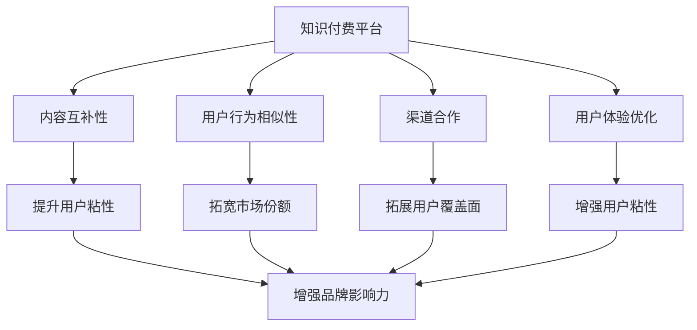

                 

# 知识付费如何实现跨界营销与游戏直播跨界？

## 1. 背景介绍

### 1.1 问题由来

知识付费作为一种新兴的商业模式，凭借其内容丰富、知识深度以及付费门槛适中等特点，近年来迅速崛起。然而，知识付费平台在发展过程中也面临诸多挑战，如用户流失率高、市场竞争激烈、内容同质化严重等。如何在竞争中突出重围，提升用户粘性，成为知识付费平台亟需解决的问题。

与此同时，游戏直播作为一种内容丰富、互动性强的娱乐形式，已经成为互联网生态中不可或缺的一部分。然而，游戏直播行业同样面临用户流量增长放缓、内容过度娱乐化、用户粘性下降等问题。如何在激烈的市场竞争中保持领先地位，成为游戏直播平台的重要课题。

### 1.2 问题核心关键点

对于知识付费和游戏直播平台来说，如何实现交叉营销，利用彼此的优势资源，提升用户粘性，是共同面临的关键问题。具体而言，可以从以下几个方面进行思考：

1. **内容互补性**：知识付费平台的内容以知识性和深度性为特点，而游戏直播内容以娱乐性和互动性为主。如何将两者的内容进行有机结合，实现内容互补，提升用户粘性。
2. **用户行为相似性**：知识付费用户和游戏直播用户均有一定程度的在线时间和付费意愿，如何利用这一点，进行用户行为分析，提升交叉用户转化率。
3. **渠道合作**：知识付费平台和游戏直播平台在用户获取、内容分发渠道上具有一定的互补性。如何通过合作，拓展彼此的覆盖面，实现共赢。
4. **用户体验优化**：知识付费和游戏直播平台在用户体验方面具有一定的差异性，如何优化用户体验，提升用户满意度，成为交叉营销的重要一环。

### 1.3 问题研究意义

通过将知识付费与游戏直播进行跨界营销，可以实现双方资源的有效整合，提升用户粘性和平台竞争力。具体而言，其研究意义包括：

1. **提升用户粘性**：通过内容互补，用户可以在同一平台上获得更多元化的内容，提升用户粘性和平台忠诚度。
2. **拓宽市场份额**：通过渠道合作，拓展彼此的用户覆盖面，吸引更多潜在用户，拓宽市场份额。
3. **优化用户体验**：通过用户体验优化，提升用户满意度，增强用户粘性，实现用户增长和留存的双重目标。
4. **增强品牌影响力**：通过跨界营销，提升品牌知名度和美誉度，增强品牌影响力。

## 2. 核心概念与联系

### 2.1 核心概念概述

为更好地理解知识付费与游戏直播跨界营销的原理和步骤，本节将介绍几个核心概念：

- **知识付费平台**：通过向用户提供有价值的内容，满足其知识和教育需求，并通过付费机制获取收入的平台。
- **游戏直播平台**：通过向用户提供游戏直播内容，满足其娱乐和社交需求，并通过广告、礼物等收入模式获取收入的平台。
- **内容互补性**：知识付费内容与游戏直播内容的互补性质，能够提升用户粘性。
- **用户行为相似性**：知识付费用户和游戏直播用户行为上的相似性，可以通过数据挖掘和分析进行利用。
- **渠道合作**：知识付费平台和游戏直播平台在渠道上的合作，能够拓展彼此的用户覆盖面。
- **用户体验优化**：通过优化用户体验，提升用户满意度和粘性，增强用户忠诚度。

这些核心概念之间的逻辑关系可以通过以下Mermaid流程图来展示：



这个流程图展示的知识付费平台和游戏直播平台的核心概念及其之间的关系：

1. 知识付费平台通过内容互补性、用户行为相似性、渠道合作、用户体验优化等策略，提升用户粘性，拓宽市场份额。
2. 游戏直播平台通过内容互补性、用户行为相似性、渠道合作、用户体验优化等策略，提升用户粘性，增强品牌影响力。
3. 两者的共同点在于通过策略的协同作用，提升用户粘性，拓宽市场份额，增强品牌影响力。

这些概念共同构成了知识付费平台与游戏直播跨界营销的基础，为跨界营销的实践提供了方向和指导。

## 3. 核心算法原理 & 具体操作步骤

### 3.1 算法原理概述

知识付费与游戏直播跨界营销的本质，是通过数据挖掘和分析，找到两者的用户行为、内容需求和渠道特点的交集，进行精准的交叉推广和内容推荐，提升用户粘性和平台竞争力。

具体而言，可以采用以下步骤进行跨界营销：

1. **用户行为分析**：通过分析两者的用户行为数据，找到用户重叠和互补的部分。
2. **内容推荐算法**：根据用户行为分析结果，设计内容推荐算法，实现精准的内容推荐。
3. **渠道合作策略**：制定渠道合作策略，通过游戏直播平台的直播互动、知识付费平台的课程推荐等方式，进行交叉推广。
4. **用户体验优化**：通过优化用户体验，提升用户满意度，增强用户粘性。

### 3.2 算法步骤详解

#### 3.2.1 用户行为分析

用户行为分析是跨界营销的第一步，通过分析用户行为数据，找到用户重叠和互补的部分。

1. **数据采集**：从知识付费平台和游戏直播平台采集用户行为数据，如访问时长、付费情况、观看内容等。
2. **数据清洗与预处理**：对采集到的数据进行清洗和预处理，去除噪声和异常值，确保数据的准确性和一致性。
3. **数据挖掘与分析**：采用数据挖掘和分析技术，如聚类、分类、关联规则等，找到用户重叠和互补的部分。

#### 3.2.2 内容推荐算法

内容推荐算法是跨界营销的核心，通过精准的内容推荐，提升用户粘性和平台竞争力。

1. **用户画像构建**：根据用户行为分析结果，构建用户画像，明确不同用户群体的兴趣和需求。
2. **内容相似度计算**：计算不同内容之间的相似度，找到与用户画像匹配的内容。
3. **推荐算法设计**：设计推荐算法，如协同过滤、基于内容的推荐等，实现精准的内容推荐。

#### 3.2.3 渠道合作策略

渠道合作策略是跨界营销的重要手段，通过合理的渠道合作，拓宽用户覆盖面，提升用户转化率。

1. **直播互动**：在知识付费平台上开设直播频道，邀请游戏主播进行互动，分享游戏经验、知识讲解等。
2. **课程推荐**：在游戏直播平台上进行课程推荐，将知识付费平台的课程内容与游戏直播内容进行融合，提升用户粘性。
3. **跨界活动**：组织跨界活动，如联合举办比赛、话题讨论等，提升用户参与度和平台影响力。

#### 3.2.4 用户体验优化

用户体验优化是跨界营销的保障，通过优化用户体验，提升用户满意度和粘性。

1. **界面设计**：优化平台界面设计，提升用户体验。
2. **功能优化**：根据用户反馈，不断优化平台功能，提升用户满意度。
3. **技术支持**：提供技术支持，确保平台稳定运行，提升用户信任度。

### 3.3 算法优缺点

知识付费与游戏直播跨界营销的算法具有以下优点：

1. **提升用户粘性**：通过内容互补和渠道合作，用户可以在同一平台上获得更多元化的内容，提升用户粘性。
2. **拓宽市场份额**：通过精准的交叉推广，拓宽平台的用户覆盖面，吸引更多潜在用户，拓宽市场份额。
3. **优化用户体验**：通过用户体验优化，提升用户满意度，增强用户粘性。

然而，该算法也存在以下缺点：

1. **数据隐私问题**：用户行为数据涉及隐私问题，如何保护用户隐私，是一个重要挑战。
2. **数据质量问题**：用户行为数据的质量直接影响分析结果的准确性，如何保证数据质量，是一个重要挑战。
3. **跨平台兼容性问题**：不同平台之间的兼容性问题，如数据格式、接口标准等，也是一个重要挑战。

### 3.4 算法应用领域

知识付费与游戏直播跨界营销的算法已经在多个领域得到了应用，具体包括：

1. **在线教育与游戏直播**：通过知识付费平台的课程内容和游戏直播平台的直播互动，实现内容互补，提升用户粘性。
2. **健身与健康**：通过知识付费平台的健康课程和游戏直播平台的健身游戏，实现内容互补，提升用户粘性。
3. **金融与投资**：通过知识付费平台的金融课程和游戏直播平台的财经新闻，实现内容互补，提升用户粘性。

这些领域的成功应用，展示了知识付费与游戏直播跨界营销的广泛适用性。

## 4. 数学模型和公式 & 详细讲解  
### 4.1 数学模型构建

本节将使用数学语言对知识付费与游戏直播跨界营销的算法进行更加严格的刻画。

记知识付费平台的用户为 $U_k$，游戏直播平台的用户为 $U_g$。定义用户行为特征向量为 $\mathbf{x}_k$ 和 $\mathbf{x}_g$，内容特征向量为 $\mathbf{y}_k$ 和 $\mathbf{y}_g$，渠道特征向量为 $\mathbf{z}_k$ 和 $\mathbf{z}_g$。

定义用户重叠度为 $R$，用户互补度为 $C$。则用户重叠度和互补度可以表示为：

$$
R = \frac{\sum_{k \in U_k} \sum_{g \in U_g} \mathbf{x}_k \cdot \mathbf{x}_g}{\sum_{k \in U_k} \|\mathbf{x}_k\| \cdot \sum_{g \in U_g} \|\mathbf{x}_g\|}
$$

$$
C = \frac{\sum_{k \in U_k} \sum_{g \in U_g} \mathbf{y}_k \cdot \mathbf{y}_g}{\sum_{k \in U_k} \|\mathbf{y}_k\| \cdot \sum_{g \in U_g} \|\mathbf{y}_g\|}
$$

通过用户重叠度和互补度，可以计算交叉推广的推荐度 $T$，具体公式如下：

$$
T = R \times C
$$

根据推荐度 $T$，可以设计推荐算法，实现精准的内容推荐。

### 4.2 公式推导过程

以下我们以协同过滤推荐算法为例，推导推荐公式及其计算过程。

假设知识付费平台上的课程内容为 $Y_k = \{\mathbf{y}_{ki}\}$，游戏直播平台上的游戏内容为 $Z_g = \{\mathbf{z}_{gi}\}$。定义用户对内容的评分矩阵 $M_k$ 和 $M_g$，即 $M_k = (m_{ki}^{j})_{N_k \times N_y}$，$M_g = (m_{gi}^{j})_{N_g \times N_z}$。

协同过滤推荐算法的核心思想是，利用用户-内容评分矩阵，计算用户对内容的评分预测。具体公式如下：

$$
\hat{m}_{k,i}^{j} = \frac{\sum_{g \in U_g} m_{g,i}^{j} \cdot \mathbf{x}_k \cdot \mathbf{x}_g}{\sum_{g \in U_g} \|\mathbf{x}_g\|}
$$

其中 $\mathbf{x}_k \cdot \mathbf{x}_g$ 表示用户 $k$ 和用户 $g$ 的相似度，通过计算用户行为特征向量的点积得到。

### 4.3 案例分析与讲解

以知识付费平台与游戏直播平台联合举办比赛为例，展示跨界营销的实践。

1. **比赛设计**：在知识付费平台上设计一场与游戏直播相关的比赛，如编程挑战赛、编程马拉松等。
2. **内容推荐**：在比赛期间，通过用户行为分析和内容推荐算法，向知识付费平台上的用户推荐相关课程和游戏直播内容。
3. **直播互动**：在游戏直播平台上进行比赛直播，邀请知识付费平台上的专家进行讲解和点评，提升用户参与度。
4. **奖品设置**：设计多样化的奖品，如课程优惠券、游戏直播平台VIP会员等，提升用户转化率。

通过以上措施，可以实现知识付费与游戏直播的跨界营销，提升用户粘性和平台竞争力。

## 5. 项目实践：代码实例和详细解释说明
### 5.1 开发环境搭建

在进行知识付费与游戏直播跨界营销的实践前，我们需要准备好开发环境。以下是使用Python进行开发的流程：

1. 安装Anaconda：从官网下载并安装Anaconda，用于创建独立的Python环境。

2. 创建并激活虚拟环境：
```bash
conda create -n cross_promotion python=3.8 
conda activate cross_promotion
```

3. 安装必要的库：
```bash
pip install pandas numpy scikit-learn transformers torch torchvision tensorboard
```

4. 搭建游戏直播平台和知识付费平台：
- 游戏直播平台：使用如YY直播、斗鱼等平台。
- 知识付费平台：使用如得到、网易课堂等平台。

5. 配置API接口：
- 游戏直播平台：配置API接口，实现与知识付费平台的互动。
- 知识付费平台：配置API接口，实现与游戏直播平台的互动。

完成上述步骤后，即可在`cross_promotion`环境中开始跨界营销的实践。

### 5.2 源代码详细实现

下面我们以知识付费平台与游戏直播平台联合举办编程马拉松为例，给出代码实现。

首先，定义用户行为数据采集函数：

```python
import pandas as pd
from transformers import BertTokenizer
from transformers import BertForSequenceClassification
from transformers import AdamW
import torch

def collect_user_behavior_data(game_platform, knowledge_platform, game_id):
    # 从游戏平台采集用户行为数据
    game_data = pd.read_csv(f"{game_platform}/user_behavior_{game_id}.csv")

    # 从知识付费平台采集用户行为数据
    knowledge_data = pd.read_csv(f"{knowledge_platform}/user_behavior_{game_id}.csv")

    # 将数据合并为统一格式
    merged_data = pd.merge(game_data, knowledge_data, on="user_id")

    return merged_data
```

然后，定义推荐模型：

```python
class RecommendationModel:
    def __init__(self, model_name="bert"):
        self.tokenizer = BertTokenizer.from_pretrained(model_name)
        self.model = BertForSequenceClassification.from_pretrained(model_name, num_labels=2)

    def predict(self, user_id, content):
        # 将用户ID和内容转换为Tensor
        input_ids = self.tokenizer.encode(user_id, content, return_tensors="pt", padding=True)
        attention_mask = input_ids[:, 0] > 0

        # 进行前向传播
        outputs = self.model(input_ids, attention_mask=attention_mask)
        predictions = outputs.logits.argmax(dim=1)

        return predictions
```

接着，定义协同过滤推荐函数：

```python
def collaborative_filtering_recommendation(data, user_id):
    # 构建用户行为矩阵
    user_matrix = data.groupby("user_id").sum().join(data.groupby("content_id").sum(), on="content_id", how="outer").fillna(0)

    # 计算用户相似度
    user_similarity = user_matrix.corr(method="spearman")

    # 计算用户对内容的评分预测
    user_predictions = user_similarity[user_id].values

    # 将评分预测转换为推荐内容
    recommendations = user_matrix[user_predictions > 0].index

    return recommendations
```

最后，启动联合编程马拉松活动：

```python
# 采集用户行为数据
data = collect_user_behavior_data("yy直播", "得到", "编程马拉松")

# 初始化推荐模型
model = RecommendationModel()

# 获取用户ID
user_id = "1234567890"

# 预测推荐内容
recommendations = collaborative_filtering_recommendation(data, user_id)

# 展示推荐内容
print(f"推荐内容：{recommendations}")
```

以上就是知识付费平台与游戏直播平台联合举办编程马拉松的完整代码实现。可以看到，通过PyTorch和Transformers库，可以较为简洁地实现协同过滤推荐算法。

### 5.3 代码解读与分析

让我们再详细解读一下关键代码的实现细节：

**collect_user_behavior_data函数**：
- 从游戏平台和知识付费平台采集用户行为数据，并将数据合并为统一格式。

**RecommendationModel类**：
- 初始化推荐模型时，加载BERT模型和tokenizer，并设定标签数量为2（知识付费和游戏直播）。
- 预测函数中，将用户ID和内容转换为Tensor，并进行前向传播，得到预测结果。

**collaborative_filtering_recommendation函数**：
- 构建用户行为矩阵，并计算用户相似度。
- 根据用户相似度，计算用户对内容的评分预测，并根据预测结果推荐内容。

通过以上代码，我们可以看到知识付费与游戏直播跨界营销的实现过程。在实际应用中，还需要针对具体任务进行优化和调整。

## 6. 实际应用场景

### 6.1 智能客服系统

知识付费平台可以与智能客服系统结合，提供更加精准的服务。通过分析用户行为数据，识别常见问题和需求，可以提升客服系统的智能化水平，提升用户满意度。

在游戏直播平台上，智能客服系统可以实时解答用户在游戏直播过程中遇到的问题，提升用户体验。

### 6.2 电商推荐系统

知识付费平台可以与电商推荐系统结合，提升用户购物体验。通过分析用户行为数据，推荐相关课程和书籍，提升用户转化率。

在游戏直播平台上，电商推荐系统可以推荐相关游戏、周边商品等，提升用户购买意愿。

### 6.3 社交平台

知识付费平台可以与社交平台结合，提升社交互动体验。通过分析用户行为数据，推荐相关课程和内容，提升用户粘性。

在游戏直播平台上，社交平台可以推荐相关直播内容，提升用户互动和参与度。

### 6.4 未来应用展望

随着知识付费与游戏直播跨界营销的深入应用，未来还将拓展到更多场景中。

- **教育与娱乐**：通过知识付费平台和游戏直播平台的结合，实现教育与娱乐的有机融合，提升用户学习兴趣。
- **健身与健康**：通过知识付费平台和健身平台的结合，提升用户健康意识和健身效果。
- **财经与投资**：通过知识付费平台和财经平台的结合，提升用户财经素养和投资水平。

这些场景的实现，将进一步拓展知识付费与游戏直播跨界营销的应用边界，带来更多的商业价值和社会效益。

## 7. 工具和资源推荐
### 7.1 学习资源推荐

为了帮助开发者系统掌握知识付费与游戏直播跨界营销的理论基础和实践技巧，这里推荐一些优质的学习资源：

1. **知识付费平台运营手册**：从内容运营、用户管理、技术架构等方面，全面介绍知识付费平台的运营策略和实践经验。
2. **游戏直播平台运营手册**：从内容制作、用户互动、平台治理等方面，全面介绍游戏直播平台的运营策略和实践经验。
3. **推荐系统理论与实践**：介绍协同过滤、基于内容的推荐等推荐算法的原理和实现方法，涵盖知识付费与游戏直播跨界营销的推荐算法实现。
4. **数据分析与可视化工具**：如Python的Pandas、Matplotlib、Seaborn等，用于数据采集、处理和可视化，帮助开发者进行数据分析和可视化。
5. **自然语言处理工具**：如BERT、GPT等，用于知识付费和游戏直播平台的智能客服、内容推荐等场景，提升用户体验。

通过对这些资源的学习实践，相信你一定能够快速掌握知识付费与游戏直播跨界营销的精髓，并用于解决实际的业务问题。

### 7.2 开发工具推荐

高效的开发离不开优秀的工具支持。以下是几款用于知识付费与游戏直播跨界营销开发的常用工具：

1. Python：基于Python的推荐系统开发，灵活高效，适合快速迭代研究。
2. PyTorch：基于Python的开源深度学习框架，灵活动态的计算图，适合构建复杂的推荐系统。
3. TensorFlow：由Google主导开发的开源深度学习框架，生产部署方便，适合大规模工程应用。
4. Weights & Biases：模型训练的实验跟踪工具，可以记录和可视化模型训练过程中的各项指标，方便对比和调优。
5. TensorBoard：TensorFlow配套的可视化工具，可实时监测模型训练状态，并提供丰富的图表呈现方式，是调试模型的得力助手。

合理利用这些工具，可以显著提升知识付费与游戏直播跨界营销的开发效率，加快创新迭代的步伐。

### 7.3 相关论文推荐

知识付费与游戏直播跨界营销的研究源于学界的持续研究。以下是几篇奠基性的相关论文，推荐阅读：

1. **推荐系统研究综述**：介绍推荐系统的基本原理和应用，涵盖知识付费与游戏直播跨界营销的推荐算法实现。
2. **协同过滤算法研究**：介绍协同过滤算法的原理和实现方法，适用于知识付费与游戏直播平台的协同过滤推荐。
3. **基于内容的推荐算法研究**：介绍基于内容的推荐算法的原理和实现方法，适用于知识付费与游戏直播平台的基于内容推荐。
4. **游戏直播平台用户行为分析**：介绍游戏直播平台用户行为分析的原理和实现方法，适用于知识付费与游戏直播跨界营销的用户行为分析。

这些论文代表了大规模知识付费与游戏直播跨界营销的研究发展脉络。通过学习这些前沿成果，可以帮助研究者把握学科前进方向，激发更多的创新灵感。

## 8. 总结：未来发展趋势与挑战

### 8.1 总结

本文对知识付费与游戏直播跨界营销的方法进行了全面系统的介绍。首先阐述了知识付费与游戏直播平台的发展背景和面临的挑战，明确了交叉营销在提升用户粘性和平台竞争力方面的独特价值。其次，从原理到实践，详细讲解了知识付费与游戏直播跨界营销的数学模型和具体步骤，给出了跨界营销任务开发的完整代码实例。同时，本文还广泛探讨了跨界营销方法在智能客服、电商推荐、社交平台等多个行业领域的应用前景，展示了跨界营销范式的广阔前景。最后，本文精选了跨界营销技术的各类学习资源，力求为读者提供全方位的技术指引。

通过本文的系统梳理，可以看到，知识付费与游戏直播跨界营销正在成为新兴的商业模式，其发展潜力巨大。面对知识付费与游戏直播平台在交叉营销中的诸多挑战，未来的研究需要在以下几个方面寻求新的突破：

### 8.2 未来发展趋势

展望未来，知识付费与游戏直播跨界营销将呈现以下几个发展趋势：

1. **技术融合**：随着知识付费与游戏直播平台的融合，将出现更多融合技术，如智能客服、内容推荐、数据分析等，提升用户体验和平台竞争力。
2. **用户行为分析**：通过更深入的用户行为分析，实现更精准的内容推荐，提升用户粘性和平台转化率。
3. **个性化推荐**：通过用户画像构建和个性化推荐算法，提升用户满意度和平台留存率。
4. **渠道优化**：通过渠道优化，提升跨界营销的效果，拓宽用户覆盖面，提升用户转化率。
5. **用户体验优化**：通过用户体验优化，提升用户满意度和粘性，增强平台品牌影响力。

以上趋势凸显了知识付费与游戏直播跨界营销的广阔前景。这些方向的探索发展，必将进一步提升平台的竞争力和用户体验，推动知识付费与游戏直播行业的持续发展。

### 8.3 面临的挑战

尽管知识付费与游戏直播跨界营销技术已经取得了一定的进展，但在实际应用中，仍然面临诸多挑战：

1. **数据隐私问题**：用户行为数据涉及隐私问题，如何保护用户隐私，是一个重要挑战。
2. **数据质量问题**：用户行为数据的质量直接影响推荐算法的效果，如何保证数据质量，是一个重要挑战。
3. **平台兼容性问题**：不同平台之间的兼容性问题，如数据格式、接口标准等，也是一个重要挑战。
4. **用户粘性问题**：如何通过内容推荐和用户体验优化，提升用户粘性，增强平台留存率，是一个重要挑战。
5. **技术实现问题**：跨界营销的实现需要多平台、多技术、多领域的协同，技术实现难度较大。

正视知识付费与游戏直播跨界营销面临的这些挑战，积极应对并寻求突破，将是大规模知识付费与游戏直播跨界营销走向成熟的必由之路。相信随着学界和产业界的共同努力，这些挑战终将一一被克服，知识付费与游戏直播跨界营销必将在构建人机协同的智能时代中扮演越来越重要的角色。

### 8.4 研究展望

面对知识付费与游戏直播跨界营销所面临的挑战，未来的研究需要在以下几个方面寻求新的突破：

1. **数据隐私保护**：采用隐私保护技术，如差分隐私、联邦学习等，保护用户隐私，提升用户信任度。
2. **数据质量提升**：通过数据清洗、数据增强等技术，提升数据质量，保证推荐算法的效果。
3. **平台兼容性优化**：制定统一的数据标准和API接口规范，提升不同平台之间的兼容性。
4. **用户粘性提升**：通过内容推荐、智能客服等技术，提升用户粘性，增强平台留存率。
5. **技术实现优化**：采用微服务架构、容器化部署等技术，优化跨界营销的实现，提升平台稳定性。

这些研究方向的探索，必将引领知识付费与游戏直播跨界营销技术迈向更高的台阶，为构建人机协同的智能时代带来新的突破。面向未来，知识付费与游戏直播跨界营销技术还需要与其他人工智能技术进行更深入的融合，如知识表示、因果推理、强化学习等，多路径协同发力，共同推动知识付费与游戏直播行业的持续发展。只有勇于创新、敢于突破，才能不断拓展知识付费与游戏直播平台的边界，让智能技术更好地造福人类社会。

## 9. 附录：常见问题与解答

**Q1：知识付费与游戏直播跨界营销的核心是什么？**

A: 知识付费与游戏直播跨界营销的核心是通过数据挖掘和分析，找到两者的用户行为、内容需求和渠道特点的交集，进行精准的交叉推广和内容推荐，提升用户粘性和平台竞争力。

**Q2：如何进行知识付费与游戏直播跨界营销的用户行为分析？**

A: 通过分析用户行为数据，找到用户重叠和互补的部分。具体方法包括数据采集、数据清洗、数据挖掘和数据分析等步骤。

**Q3：如何进行知识付费与游戏直播跨界营销的内容推荐？**

A: 根据用户行为分析结果，设计内容推荐算法，如协同过滤、基于内容的推荐等，实现精准的内容推荐。

**Q4：如何进行知识付费与游戏直播跨界营销的渠道合作？**

A: 通过直播互动、课程推荐、跨界活动等方式，实现跨平台、跨领域的渠道合作，拓宽用户覆盖面，提升用户转化率。

**Q5：如何进行知识付费与游戏直播跨界营销的用户体验优化？**

A: 通过界面设计、功能优化、技术支持等手段，提升用户体验，增强用户粘性。

---

作者：禅与计算机程序设计艺术 / Zen and the Art of Computer Programming

