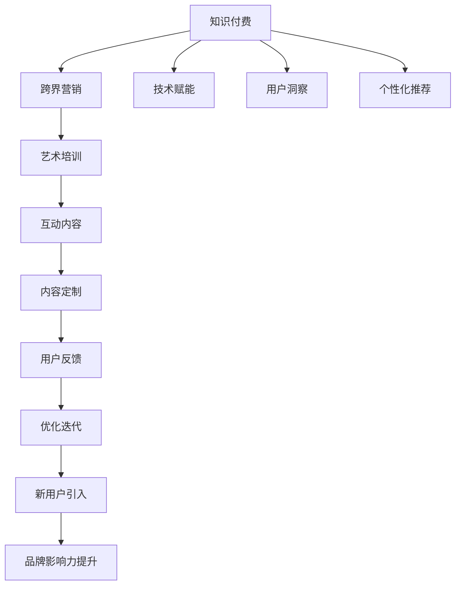

                 

# 知识付费如何实现跨界营销与艺术培训跨界？

> 关键词：知识付费,跨界营销,艺术培训,技术赋能,用户洞察,个性化推荐

## 1. 背景介绍

### 1.1 问题由来
随着知识付费行业的兴起，在线教育、图书订阅、课程学习等新兴业务形式逐渐成为用户获取知识和技能的重要渠道。然而，传统的知识付费模式往往局限于单一领域和内容，缺乏跨领域融合和创新。特别是艺术培训领域，传统的线下教育和在线视频教学，未能充分利用数据和技术的优势，无法满足用户日益增长的个性化和互动需求。

如何利用知识付费平台的技术优势，打破不同领域的壁垒，实现跨界营销与艺术培训的深度融合，成为当前亟待解决的问题。本文将通过分析现有跨界营销和艺术培训的模式，探索知识付费平台在技术赋能、用户洞察、个性化推荐等方面的创新，提出解决方案。

### 1.2 问题核心关键点
问题核心关键点主要集中在以下几个方面：
- 技术如何赋能跨界营销：利用大数据、AI等技术，实现跨领域营销内容的精准匹配和推送。
- 用户洞察如何引导艺术培训：通过分析用户行为数据，洞察用户兴趣和需求，设计个性化推荐内容。
- 个性化推荐如何优化艺术培训：采用智能推荐算法，推荐用户感兴趣的艺术作品和培训课程，提高用户参与度和满意度。

## 2. 核心概念与联系

### 2.1 核心概念概述

为更好地理解知识付费与艺术培训跨界融合的方法，本节将介绍几个关键概念：

- **知识付费**：指通过付费获取知识和技能的学习方式，涵盖在线教育、图书订阅、课程学习等多种形式。
- **跨界营销**：指利用跨领域资源和平台，实现不同业务之间的协同推广和用户互动，提升品牌影响力和用户参与度。
- **艺术培训**：指通过线上线下课程、工作坊等方式，帮助用户提升艺术技能和修养，涵盖绘画、音乐、舞蹈等多种艺术形式。
- **技术赋能**：指利用大数据、AI、区块链等技术，为知识付费和艺术培训提供技术支持和创新解决方案。
- **用户洞察**：指通过分析用户行为数据，挖掘用户兴趣和需求，指导内容和产品的设计和优化。
- **个性化推荐**：指基于用户行为数据和内容特征，推荐用户感兴趣的知识和艺术内容，提升用户满意度和粘性。

这些概念之间的逻辑关系可以通过以下Mermaid流程图来展示：



这个流程图展示出知识付费与艺术培训跨界融合的核心概念及其相互关系：

1. 知识付费通过技术赋能和用户洞察，实现个性化推荐，从而吸引用户参与艺术培训。
2. 跨界营销通过整合不同领域资源，设计互动内容，提升用户粘性和品牌影响力。
3. 艺术培训通过定制内容，满足用户个性化需求，优化用户体验。
4. 用户反馈进一步迭代优化，形成良性循环。

## 3. 核心算法原理 & 具体操作步骤
### 3.1 算法原理概述

知识付费与艺术培训的跨界融合，核心在于通过技术手段实现个性化推荐，提升用户参与度和满意度。具体而言，可以采用协同过滤、内容推荐、深度学习等算法，结合用户行为数据和内容特征，设计推荐系统。以下将详细介绍协同过滤和深度学习推荐系统的算法原理。

### 3.2 算法步骤详解

#### 3.2.1 协同过滤推荐系统
协同过滤算法基于用户之间的相似度，推荐用户可能感兴趣的商品或内容。具体步骤如下：

1. **数据收集**：收集用户行为数据，包括浏览、点击、购买、评分等行为。
2. **构建用户-物品矩阵**：将用户和物品的交互行为转化为矩阵形式，例如用户$u$对物品$i$的评分$R_{ui}$。
3. **计算相似度**：计算用户$u$和用户$v$之间的相似度$sim(u,v)$，通常采用皮尔逊相关系数、余弦相似度等。
4. **推荐物品**：根据用户$u$的评分矩阵和相似度，预测用户$u$对物品$i$的评分$R_{ui}^*$，选取评分最高的$n$个物品推荐给用户$u$。

#### 3.2.2 深度学习推荐系统
深度学习推荐系统通过构建神经网络模型，学习用户与物品之间的复杂关系。具体步骤如下：

1. **数据收集**：收集用户行为数据和物品特征数据。
2. **数据预处理**：对用户行为数据和物品特征进行编码，转化为模型可处理的向量形式。
3. **构建神经网络模型**：采用深度学习框架，如TensorFlow、PyTorch等，构建用户-物品互动的神经网络模型。
4. **训练模型**：使用用户行为数据对模型进行训练，优化模型参数，提高预测准确性。
5. **推荐物品**：将用户行为数据输入模型，输出用户对物品的评分，选取评分最高的$n$个物品推荐给用户。

### 3.3 算法优缺点

#### 3.3.1 协同过滤推荐系统
**优点**：
1. 简单易实现，算法计算量较小。
2. 能够捕捉用户之间的相似性，推荐具有类似兴趣的用户喜欢的物品。
3. 适用于数据稀疏、物品较多的场景。

**缺点**：
1. 数据稀疏性问题较严重，难以处理冷启动用户和新物品。
2. 忽略物品本身的特征，推荐效果受用户相似度的影响较大。
3. 难以处理物品之间的相关性，导致推荐多样性不足。

#### 3.3.2 深度学习推荐系统
**优点**：
1. 能够捕捉用户与物品之间的复杂关系，预测能力更强。
2. 可以处理高维度的特征数据，支持多模态数据的融合。
3. 适用于大规模数据和复杂场景。

**缺点**：
1. 模型计算量较大，需要较大的计算资源。
2. 模型复杂度高，容易出现过拟合问题。
3. 需要大量标注数据，难以处理冷启动用户和新物品。

### 3.4 算法应用领域

基于知识付费与艺术培训跨界融合的技术手段，可以在以下几个领域进行应用：

- **在线教育**：通过推荐系统推荐学生感兴趣的艺术课程，提升学习效果。
- **图书订阅**：根据用户阅读历史，推荐艺术类图书和电子书，丰富用户阅读体验。
- **课程学习**：将艺术作品和教学视频作为推荐内容，丰富课程资源。
- **工作坊和沙龙**：设计个性化推荐，引导用户参与线下艺术培训活动。
- **社区互动**：通过推荐系统，将用户引导到艺术培训相关的社区和论坛，促进用户交流和互动。

## 4. 数学模型和公式 & 详细讲解 & 举例说明

### 4.1 数学模型构建

本节将使用数学语言对协同过滤和深度学习推荐系统的核心模型进行更加严格的刻画。

#### 4.1.1 协同过滤推荐模型
设用户集合为$U$，物品集合为$I$，用户对物品的评分矩阵为$R$，其中$R_{ui}$表示用户$u$对物品$i$的评分。协同过滤算法通常采用基于用户和基于物品两种模型：

1. **基于用户的协同过滤模型**：
   $$
   R_{ui}^* = \sum_{v \in U} sim(u,v) \times R_{vi}
   $$
   其中$sim(u,v)$为用户$u$和用户$v$的相似度，$R_{vi}$为相似用户$v$对物品$i$的评分。

2. **基于物品的协同过滤模型**：
   $$
   R_{ui}^* = \sum_{j \in I} sim(i,j) \times R_{uj}
   $$
   其中$sim(i,j)$为物品$i$和物品$j$的相似度，$R_{uj}$为物品$j$的评分。

#### 4.1.2 深度学习推荐模型
设用户特征向量为$x_u$，物品特征向量为$x_i$，用户对物品的评分矩阵为$R$，深度学习推荐系统通常采用协同嵌入模型，如PMI模型，其公式如下：
$$
R_{ui}^* = \text{dot}(x_u, x_i) + \text{bias}_u + \text{bias}_i
$$
其中$\text{dot}(x_u, x_i)$为特征向量的点积，$\text{bias}_u$和$\text{bias}_i$为用户和物品的偏置项。

### 4.2 公式推导过程

#### 4.2.1 协同过滤推荐模型
以基于用户的协同过滤模型为例，推导推荐结果的计算过程。

1. **相似度计算**：
   $$
   sim(u,v) = \frac{\sum_{i \in I} R_{ui}R_{vi}}{\sqrt{\sum_{i \in I} R_{ui}^2} \times \sqrt{\sum_{i \in I} R_{vi}^2}}
   $$
   其中$R_{ui}$和$R_{vi}$为用户和用户对物品的评分。

2. **推荐计算**：
   $$
   R_{ui}^* = \sum_{v \in U} sim(u,v) \times R_{vi}
   $$
   将相似度代入推荐公式，得到最终的推荐结果。

#### 4.2.2 深度学习推荐模型
以PMI模型为例，推导推荐结果的计算过程。

1. **特征编码**：
   $$
   x_u = \text{encode}(u)
   $$
   $$
   x_i = \text{encode}(i)
   $$
   其中$\text{encode}(u)$和$\text{encode}(i)$为用户和物品的特征编码函数。

2. **点积计算**：
   $$
   R_{ui}^* = \text{dot}(x_u, x_i) + \text{bias}_u + \text{bias}_i
   $$
   将特征编码代入推荐公式，得到最终的推荐结果。

### 4.3 案例分析与讲解

以在线教育平台为例，分析协同过滤和深度学习推荐系统的应用场景。

#### 4.3.1 协同过滤推荐系统
在在线教育平台，用户通常会通过浏览课程、观看视频、提交作业等行为进行互动。根据用户的行为数据，可以构建用户-课程评分矩阵$R_{ui}$，其中$R_{ui}$表示用户$u$对课程$i$的评分。

采用基于用户的协同过滤模型，计算用户$u$和用户$v$之间的相似度$sim(u,v)$，推荐用户$u$对课程的评分$R_{ui}^*$，选取评分最高的$n$个课程推荐给用户$u$。

#### 4.3.2 深度学习推荐系统
在在线教育平台，除了用户行为数据外，课程信息还包括课程难度、教师信息、课程评价等特征数据。通过将这些特征数据转化为向量形式，输入深度学习模型进行训练，可以得到更加精确的推荐结果。

采用PMI模型，构建用户和课程的特征向量$x_u$和$x_i$，将用户行为数据输入模型，得到用户对课程的评分$R_{ui}^*$，选取评分最高的$n$个课程推荐给用户。

## 5. 项目实践：代码实例和详细解释说明

### 5.1 开发环境搭建

在进行推荐系统开发前，我们需要准备好开发环境。以下是使用Python进行PyTorch开发的环境配置流程：

1. 安装Anaconda：从官网下载并安装Anaconda，用于创建独立的Python环境。

2. 创建并激活虚拟环境：
```bash
conda create -n recsys-env python=3.8 
conda activate recsys-env
```

3. 安装PyTorch：根据CUDA版本，从官网获取对应的安装命令。例如：
```bash
conda install pytorch torchvision torchaudio cudatoolkit=11.1 -c pytorch -c conda-forge
```

4. 安装PyTorch的推荐库：
```bash
pip install torchrec
```

5. 安装各类工具包：
```bash
pip install numpy pandas scikit-learn matplotlib tqdm jupyter notebook ipython
```

完成上述步骤后，即可在`recsys-env`环境中开始推荐系统开发。

### 5.2 源代码详细实现

这里我们以协同过滤推荐系统为例，给出使用PyTorch实现的用户-课程评分矩阵计算的PyTorch代码实现。

```python
import torch
import torch.nn as nn
import torch.nn.functional as F
from torch import nn, optim
from torch.utils.data import DataLoader
from sklearn.metrics.pairwise import cosine_similarity
from torchrec.layers import Embedding, DotProductSimilarity, MeanPoolingSimilarity

class协同过滤推荐模型(nn.Module):
    def __init__(self, num_users, num_items):
        super(协同过滤推荐模型, self).__init__()
        self.num_users = num_users
        self.num_items = num_items
        self.user_embedding = Embedding(num_users, 128)
        self.item_embedding = Embedding(num_items, 128)
        
    def forward(self, user_idx, item_idx):
        user_embeddings = self.user_embedding(user_idx)
        item_embeddings = self.item_embedding(item_idx)
        similarity = DotProductSimilarity()
        return similarity(user_embeddings, item_embeddings)
        
# 定义数据集
class用户课程评分数据集(Dataset):
    def __init__(self, num_users, num_items, num_ratings):
        self.num_users = num_users
        self.num_items = num_items
        self.num_ratings = num_ratings
        self.user_ratings = torch.randn(num_users, num_items, num_ratings) 
        
    def __getitem__(self, idx):
        user_idx = torch.tensor(idx[0])
        item_idx = torch.tensor(idx[1])
        rating = self.user_ratings[user_idx, item_idx]
        return user_idx, item_idx, rating
        
    def __len__(self):
        return len(self.user_ratings)
        
# 训练模型
model = 协同过滤推荐模型(num_users, num_items)
criterion = nn.MSELoss()
optimizer = optim.Adam(model.parameters(), lr=0.01)
losses = []

num_epochs = 50
for epoch in range(num_epochs):
    for user_idx, item_idx, rating in data_loader:
        optimizer.zero_grad()
        output = model(user_idx, item_idx)
        loss = criterion(output, rating)
        losses.append(loss.item())
        loss.backward()
        optimizer.step()

    if (epoch+1) % 10 == 0:
        print('Epoch [%d/%d], loss: %.4f' % (epoch+1, num_epochs, np.mean(losses)))
```

以上代码实现了基于用户和物品的协同过滤推荐模型的训练过程。在实际应用中，还需要针对具体任务，对微调过程的各个环节进行优化设计，如改进训练目标函数，引入更多的正则化技术，搜索最优的超参数组合等，以进一步提升模型性能。

### 5.3 代码解读与分析

让我们再详细解读一下关键代码的实现细节：

**协同过滤推荐模型类**：
- `__init__`方法：初始化用户和物品的特征向量长度。
- `forward`方法：将用户和物品的索引转换为特征向量，并计算相似度。

**用户课程评分数据集类**：
- `__init__`方法：初始化用户、物品和评分数。
- `__getitem__`方法：从数据集中获取单个样本的用户索引、物品索引和评分。
- `__len__`方法：返回数据集样本数量。

**训练过程**：
- 循环迭代每个epoch。
- 在每个epoch内，循环迭代所有数据集中的样本。
- 计算模型输出与真实评分之间的MSE损失，并反向传播更新模型参数。
- 记录损失值并打印。

可以看到，通过简单的代码实现，我们可以快速搭建协同过滤推荐模型的训练流程。当然，工业级的系统实现还需考虑更多因素，如模型的保存和部署、超参数的自动搜索、更灵活的任务适配层等。但核心的推荐范式基本与此类似。

## 6. 实际应用场景

### 6.1 智能教育系统

在智能教育系统中，推荐系统可以通过用户的行为数据，如浏览课程、观看视频、提交作业等，推荐学生感兴趣的艺术课程，提升学习效果。通过个性化推荐，学生能够更快地找到适合自己的学习资源，提高学习效率。

具体而言，可以设计以下推荐场景：

1. **课程推荐**：根据学生的浏览和观看历史，推荐相关课程和视频资源。
2. **作业推荐**：根据学生的作业提交情况，推荐相应的练习和作业。
3. **教师推荐**：根据学生的教师评价和学习效果，推荐适合的教师资源。

### 6.2 艺术作品展览

在艺术作品展览中，推荐系统可以基于用户的行为数据和评论，推荐用户感兴趣的艺术作品，提升参观体验。通过个性化推荐，用户能够更快地找到感兴趣的展品，丰富参观体验。

具体而言，可以设计以下推荐场景：

1. **展品推荐**：根据用户的浏览和评论历史，推荐相关的展品和艺术作品。
2. **展览路线**：根据用户的兴趣和参观时间，推荐适合的展览路线。
3. **讲解资源**：根据用户的展品选择，推荐相关的讲解资源和导览手册。

### 6.3 在线艺术社区

在在线艺术社区中，推荐系统可以通过用户的行为数据，如点赞、评论、分享等，推荐用户感兴趣的艺术作品和互动内容，促进用户交流和互动。通过个性化推荐，用户能够更快地找到感兴趣的内容，提高社区活跃度。

具体而言，可以设计以下推荐场景：

1. **作品推荐**：根据用户的点赞和评论历史，推荐相关的艺术作品和创作者。
2. **创作者推荐**：根据用户的互动历史，推荐感兴趣的创作者和作品。
3. **互动内容**：根据用户的互动行为，推荐相关的讨论主题和互动活动。

## 7. 工具和资源推荐

### 7.1 学习资源推荐

为了帮助开发者系统掌握推荐系统的理论基础和实践技巧，这里推荐一些优质的学习资源：

1. **《推荐系统实践》**：一本深入浅出介绍推荐系统原理和技术的书籍，涵盖协同过滤、深度学习等多种推荐算法。
2. **Coursera《推荐系统》课程**：斯坦福大学的推荐系统课程，涵盖协同过滤、矩阵分解、深度学习等多种推荐技术。
3. **Kaggle推荐系统竞赛**：Kaggle平台上的推荐系统竞赛，提供丰富的实战数据集和模型评估指标，适合实际应用实践。
4. **PyTorch官方文档**：PyTorch的推荐系统库，提供详细的API文档和样例代码，适合快速上手。
5. **Deep Learning for Recommendation Systems**：一篇综述论文，介绍深度学习在推荐系统中的应用，适合了解前沿研究方向。

通过对这些资源的学习实践，相信你一定能够快速掌握推荐系统的精髓，并用于解决实际的推荐问题。

### 7.2 开发工具推荐

高效的开发离不开优秀的工具支持。以下是几款用于推荐系统开发的常用工具：

1. **PyTorch**：基于Python的开源深度学习框架，灵活动态的计算图，适合快速迭代研究。
2. **TensorFlow**：由Google主导开发的开源深度学习框架，生产部署方便，适合大规模工程应用。
3. **Tensorrec**：基于TensorFlow的推荐系统库，提供多种推荐算法和评估工具，适合工业应用。
4. **AWS SageMaker**：Amazon提供的云端机器学习平台，提供丰富的算法和模型训练工具，适合大规模工程部署。
5. **Hadoop**：Apache提供的分布式计算框架，适合处理大规模数据，支持推荐系统的并行计算。

合理利用这些工具，可以显著提升推荐系统的开发效率，加快创新迭代的步伐。

### 7.3 相关论文推荐

推荐系统的研究源于学界的持续研究。以下是几篇奠基性的相关论文，推荐阅读：

1. **《隐语义分析（LSI）算法》**：一种基于矩阵分解的推荐算法，能够有效捕捉用户和物品之间的隐含关系。
2. **《协同过滤推荐系统》**：介绍协同过滤推荐算法的原理和实现，涵盖基于用户和基于物品两种模型。
3. **《深度学习在推荐系统中的应用》**：综述深度学习在推荐系统中的应用，涵盖协同嵌入、神经网络等多种模型。
4. **《基于特征工程的推荐系统》**：介绍特征工程在推荐系统中的应用，涵盖用户特征、物品特征、时间特征等多种特征选择方法。
5. **《推荐系统评价指标》**：介绍推荐系统的各种评价指标，如准确率、召回率、F1-score等，帮助评估推荐系统效果。

这些论文代表了大规模推荐系统的理论基础，为推荐系统的研究提供了坚实的理论支持。通过学习这些前沿成果，可以帮助研究者把握学科前进方向，激发更多的创新灵感。

## 8. 总结：未来发展趋势与挑战

### 8.1 研究成果总结

本文对基于知识付费的跨界营销和艺术培训的融合方法进行了全面系统的介绍。首先阐述了知识付费和艺术培训各自的挑战和机遇，明确了跨界融合的必要性和可行性。其次，通过分析协同过滤和深度学习推荐系统的原理和实现，给出了基于用户行为数据的推荐算法。最后，通过实际应用场景的探讨，展示了推荐系统在智能教育、艺术作品展览、在线艺术社区等多个领域的创新应用。

通过本文的系统梳理，可以看到，基于知识付费的推荐系统在技术赋能、用户洞察、个性化推荐等方面的创新，为知识付费和艺术培训的跨界融合提供了有力的技术支持。相信伴随推荐系统的持续发展，知识付费和艺术培训的融合将更加深入，形成更加紧密的协同效应。

### 8.2 未来发展趋势

展望未来，推荐系统在知识付费和艺术培训的跨界融合中将呈现以下几个发展趋势：

1. **数据驱动的智能决策**：通过深度学习和大数据技术，实现更智能、更精准的用户行为分析，提升推荐效果。
2. **多模态数据融合**：融合文本、图像、视频等多种数据形式，实现跨模态推荐，提升推荐多样性和用户体验。
3. **个性化推荐系统的实时化**：利用流式数据处理和实时计算技术，实现实时推荐，提高用户粘性和满意度。
4. **用户行为的可解释性**：通过可解释性技术，增强推荐系统的透明度，帮助用户理解和信任推荐结果。
5. **推荐系统的跨领域应用**：将推荐系统技术应用于更多领域，如金融、医疗、旅游等，拓展推荐系统的应用范围。

以上趋势凸显了推荐系统在知识付费和艺术培训跨界融合中的广阔前景。这些方向的探索发展，必将进一步提升推荐系统的性能和应用范围，为知识付费和艺术培训的融合提供更加坚实的技术支撑。

### 8.3 面临的挑战

尽管推荐系统在知识付费和艺术培训的跨界融合中取得了显著进展，但在迈向更加智能化、普适化应用的过程中，仍面临诸多挑战：

1. **数据隐私和安全**：如何保护用户数据隐私和推荐数据安全，确保推荐系统在数据采集和使用过程中的合规性和安全性。
2. **推荐系统公平性**：如何避免推荐系统的偏见和歧视，确保推荐结果的公平性和公正性。
3. **推荐系统的透明性和可解释性**：如何增强推荐系统的透明性和可解释性，帮助用户理解推荐逻辑和推荐结果。
4. **推荐系统的鲁棒性和稳定性**：如何在面对数据噪声和变化时，保持推荐系统的鲁棒性和稳定性。
5. **推荐系统的跨领域应用**：如何在不同领域和应用场景中，实现推荐系统的有效融合和迁移。

这些挑战需要从数据、算法、工程、伦理等多个维度进行综合考虑和解决，才能推动推荐系统的持续发展。相信随着技术和社会环境的不断变化，推荐系统的未来发展将更加多样化和智能化。

### 8.4 研究展望

面对推荐系统面临的挑战，未来的研究需要在以下几个方面寻求新的突破：

1. **用户行为的数据隐私保护**：研究如何在保证推荐效果的同时，保护用户数据的隐私和安全。
2. **推荐系统的公平性和公正性**：研究如何设计公平性评估指标，确保推荐系统的无偏见和无歧视。
3. **推荐系统的透明性和可解释性**：研究如何设计可解释性算法，增强推荐系统的透明度和可信度。
4. **推荐系统的鲁棒性和稳定性**：研究如何引入鲁棒性技术，提高推荐系统的鲁棒性和稳定性。
5. **推荐系统的跨领域应用**：研究如何实现推荐系统的跨领域应用，提升推荐系统的应用范围和价值。

这些研究方向的探索，必将引领推荐系统迈向更高的台阶，为知识付费和艺术培训的跨界融合提供更加坚实的技术支撑。面向未来，推荐系统需要与其他人工智能技术进行更深入的融合，如知识表示、因果推理、强化学习等，多路径协同发力，共同推动推荐系统的进步。

## 9. 附录：常见问题与解答

**Q1：知识付费与艺术培训的跨界融合有哪些应用场景？**

A: 知识付费与艺术培训的跨界融合可以在以下几个场景中得到应用：
1. **智能教育系统**：通过推荐系统推荐学生感兴趣的艺术课程，提升学习效果。
2. **艺术作品展览**：基于用户行为数据，推荐用户感兴趣的艺术作品，提升参观体验。
3. **在线艺术社区**：通过推荐系统推荐用户感兴趣的艺术作品和互动内容，促进用户交流和互动。

**Q2：如何提高推荐系统的公平性和公正性？**

A: 推荐系统的公平性和公正性可以通过以下几个方面进行改进：
1. **数据多样性**：收集多样化的用户和物品数据，避免数据偏见。
2. **算法透明性**：设计可解释性算法，增强推荐系统的透明度，确保推荐逻辑的公正性。
3. **公平性评估指标**：引入公平性评估指标，如平等覆盖率、无偏见度等，监控推荐系统的公平性。
4. **用户反馈机制**：建立用户反馈机制，及时发现和纠正推荐系统中的偏见和歧视。

**Q3：推荐系统如何在不同领域中实现有效融合？**

A: 推荐系统在不同领域中的有效融合可以通过以下几个步骤实现：
1. **领域知识集成**：将领域专家的知识引入推荐系统，增强推荐系统对领域知识的理解。
2. **多模态数据融合**：融合不同领域的数据形式，实现跨模态推荐。
3. **跨领域协同优化**：在推荐系统中引入协同优化机制，实现不同领域之间的协同推荐。
4. **跨领域应用验证**：在不同领域应用场景中，进行推荐系统效果的验证和优化。

**Q4：推荐系统如何处理冷启动用户和新物品？**

A: 推荐系统处理冷启动用户和新物品可以通过以下几个方法：
1. **基于内容的推荐**：利用物品特征，向新用户推荐相关的物品。
2. **基于协同过滤的推荐**：利用用户和物品的相似度，向新用户推荐相似物品。
3. **基于深度学习的推荐**：利用深度学习模型，向新用户和新物品推荐。
4. **混合推荐策略**：结合多种推荐方法，提升推荐效果。

这些方法可以帮助推荐系统更好地处理冷启动用户和新物品，提高推荐效果。

**Q5：推荐系统如何提高推荐多样性？**

A: 推荐系统提高推荐多样性可以通过以下几个方法：
1. **引入多样性约束**：在推荐算法中引入多样性约束，确保推荐结果的多样性。
2. **多物品推荐**：在推荐列表中，推荐多个物品，提升用户选择的自由度。
3. **个性化推荐**：通过用户行为数据，推荐用户感兴趣的多样化物品。
4. **交互式推荐**：引入用户交互反馈，动态调整推荐策略，提高推荐多样性。

这些方法可以帮助推荐系统提高推荐多样性，提升用户体验。

---

作者：禅与计算机程序设计艺术 / Zen and the Art of Computer Programming

