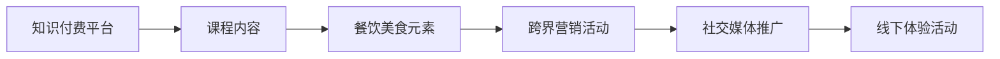

                 

# 知识付费如何实现跨界营销与餐饮美食跨界？

## 1. 背景介绍

### 1.1 问题由来

知识付费行业的崛起，让越来越多的用户意识到知识的价值，愿意为高质量的课程内容付费。然而，单一的内容形式和单一的营销渠道，限制了知识付费行业的发展速度和用户规模。如何创新营销方式，扩大用户覆盖面，是知识付费行业亟待解决的问题。

与此同时，餐饮美食行业正面临消费者需求多元化和市场竞争加剧的双重挑战。传统的营销手段已经无法满足品牌提升和用户获取的需求。如何利用新技术，打造全新的用户互动和品牌形象，成为餐饮美食行业的焦点。

### 1.2 问题核心关键点

知识付费与餐饮美食跨界，核心在于利用跨界营销的策略，将两者之间无明显联系的内容和品牌进行深度结合。即通过将知识付费平台的课程内容与餐饮美食品牌的特色元素相结合，实现互相借力，从而达到更好的营销效果。

实现这一目标的关键点包括：

1. **课程内容与餐饮美食主题结合**：选择与餐饮美食相关的课程内容，或者将餐饮美食元素融入到课程中。
2. **利用社交媒体平台进行推广**：通过社交媒体平台的广泛覆盖，以及用户之间的分享和互动，扩大课程的传播范围。
3. **线上线下结合**：结合线上课程内容和线下餐饮体验，为用户提供更丰富、更真实的用户体验。

### 1.3 问题研究意义

知识付费与餐饮美食跨界，不仅能够提升知识付费平台的用户覆盖面和课程销量，还能够为餐饮美食品牌注入新的生命力和吸引力。同时，这一跨界模式还可以探索新的商业模式，推动知识付费和餐饮美食行业的健康发展。

## 2. 核心概念与联系

### 2.1 核心概念概述

为了更好地理解知识付费与餐饮美食跨界营销的实现原理和应用策略，本节将介绍几个关键概念：

- **知识付费**：用户通过付费获取知识内容的平台。平台提供课程、图书、音频等多种形式的付费内容，满足用户的学习需求。
- **跨界营销**：将不同领域的产品或服务进行融合，通过联合营销、品牌联名等方式，实现多领域的协同推广。
- **餐饮美食跨界**：将餐饮美食元素融入到其他产品或服务中，通过品牌联名、联营等方式，实现品牌形象的提升和用户覆盖面的扩大。
- **社交媒体平台**：如微信、微博、抖音等，是用户进行社交和信息获取的重要渠道，也是跨界营销的主要平台。
- **线上线下结合**：将线上内容与线下实体店面、活动等相结合，为用户提供更丰富、更真实的体验。

### 2.2 核心概念原理和架构的 Mermaid 流程图(Mermaid 流程节点中不要有括号、逗号等特殊字符)



这个流程图展示了知识付费与餐饮美食跨界的核心流程：

1. **课程内容与餐饮美食元素结合**：将知识付费平台的课程内容与餐饮美食元素进行深度融合，形成新的内容形式。
2. **跨界营销活动**：通过联合营销、品牌联名等方式，推广融合后的内容，提升用户覆盖面。
3. **社交媒体推广**：利用社交媒体平台的广泛覆盖和用户互动，进一步扩大内容的影响力。
4. **线下体验活动**：将线上内容与线下实体店面、活动等相结合，提供更丰富、更真实的用户体验。

这些核心概念之间通过流程图中的箭头相连，形成了知识付费与餐饮美食跨界的整体框架。

## 3. 核心算法原理 & 具体操作步骤

### 3.1 算法原理概述

知识付费与餐饮美食跨界营销的算法原理，基于跨界营销和社交媒体推广的常见策略。其核心思想是：通过内容融合、品牌联名、社交媒体推广等手段，提升课程和餐饮美食品牌的影响力和用户覆盖面。

形式化地，假设知识付费平台为 $K$，餐饮美食品牌为 $F$，用户集为 $U$。跨界营销的目标是通过一系列活动，最大化平台的课程销量和品牌的用户覆盖。即最大化：

$$
\max_{K,F} \sum_{i\in U} (k_i \cdot f_i)
$$

其中 $k_i$ 表示用户 $i$ 在平台上的课程销量，$f_i$ 表示用户 $i$ 对品牌 $F$ 的认知度。

### 3.2 算法步骤详解

知识付费与餐饮美食跨界营销的具体操作步骤包括以下几个关键步骤：

**Step 1: 课程内容与餐饮美食元素结合**

- 根据目标用户群体的兴趣偏好，选择与餐饮美食相关的课程内容。
- 将餐饮美食元素融入到课程中，如介绍美食制作过程、食材选择等。

**Step 2: 设计跨界营销活动**

- 设计一系列跨界营销活动，如联合发布会、品牌联名商品等。
- 邀请知识付费平台和餐饮美食品牌的意见领袖参与，提升活动曝光度。

**Step 3: 社交媒体推广**

- 在各大社交媒体平台发布活动预告和推广内容。
- 利用平台提供的广告投放功能，精准触达目标用户群体。

**Step 4: 线下体验活动**

- 组织线下体验活动，如美食试吃、烹饪课程等。
- 将线上课程内容与线下活动相结合，提供完整的用户体验。

**Step 5: 监测和优化**

- 实时监测各项活动的用户参与度和效果，调整活动策略。
- 利用数据分析工具，优化课程内容和营销策略，提升用户覆盖面和课程销量。

### 3.3 算法优缺点

知识付费与餐饮美食跨界营销的算法具有以下优点：

1. **广泛覆盖**：通过跨界营销和社交媒体推广，能够覆盖更广泛的受众群体。
2. **提升品牌形象**：通过品牌联名等方式，提升品牌形象和用户认知度。
3. **多元化推广**：将线上内容与线下体验相结合，提供更丰富、更真实的用户体验。

同时，这一算法也存在以下局限性：

1. **用户需求不明确**：不同用户群体的需求各异，难以确定最适合的跨界营销方式。
2. **资源投入高**：跨界营销和社交媒体推广需要较高的资源投入，包括时间和金钱成本。
3. **效果难以量化**：跨界营销的效果难以进行量化评估，存在一定的风险和不确定性。

### 3.4 算法应用领域

知识付费与餐饮美食跨界营销的算法，可以应用于多种行业领域，如教育、旅游、时尚等。具体应用场景包括：

- **教育与餐饮美食结合**：如将烹饪课程与教育内容结合，提供跨学科的学习体验。
- **旅游与美食结合**：将旅游课程与餐饮美食体验结合，提升旅游吸引力。
- **时尚与美食结合**：将时尚设计课程与餐饮美食品牌结合，打造独特的品牌形象。

这些应用领域展示了知识付费与餐饮美食跨界营销的广泛应用前景，为不同行业的品牌提供了新的营销思路。

## 4. 数学模型和公式 & 详细讲解 & 举例说明（备注：数学公式请使用latex格式，latex嵌入文中独立段落使用 $$，段落内使用 $)
### 4.1 数学模型构建

在本节中，我们将使用数学语言对知识付费与餐饮美食跨界营销的算法进行详细描述。

假设知识付费平台为 $K$，餐饮美食品牌为 $F$，用户集为 $U$。设课程内容对用户 $i$ 的影响为 $k_i$，餐饮美食品牌对用户 $i$ 的影响为 $f_i$。

定义用户对品牌认知度的提升函数为 $g(f_i)$，课程销量的提升函数为 $h(k_i)$。则跨界营销的目标可以形式化为：

$$
\max_{k_i,f_i} \sum_{i\in U} [g(f_i) \cdot h(k_i)]
$$

在实际应用中，可以通过以下几个指标来评估目标：

1. **课程销量提升**：$h(k_i)$ 表示课程销量提升的函数。
2. **品牌认知度提升**：$g(f_i)$ 表示品牌认知度提升的函数。
3. **用户覆盖面扩大**：$\sum_{i\in U} [g(f_i) \cdot h(k_i)]$ 表示用户覆盖面的扩大程度。

### 4.2 公式推导过程

以下我们将对上述目标函数进行推导：

设用户对品牌认知度的提升函数为 $g(f_i) = \alpha f_i^2$，其中 $\alpha$ 为提升函数的系数。

设课程销量的提升函数为 $h(k_i) = \beta k_i^2$，其中 $\beta$ 为提升函数的系数。

则目标函数可以写作：

$$
\max_{k_i,f_i} \sum_{i\in U} [\alpha f_i^2 \cdot \beta k_i^2]
$$

对目标函数求导，得到：

$$
\frac{\partial}{\partial k_i} \sum_{i\in U} [\alpha f_i^2 \cdot \beta k_i^2] = 2\beta k_i \alpha f_i^2
$$

$$
\frac{\partial}{\partial f_i} \sum_{i\in U} [\alpha f_i^2 \cdot \beta k_i^2] = 2\alpha f_i \beta k_i^2
$$

因此，为了最大化目标函数，需要最大化 $k_i$ 和 $f_i$，即同时提升课程销量和品牌认知度。

### 4.3 案例分析与讲解

**案例1: 烹饪课程与教育结合**

假设有两家公司，一家是知识付费平台 $K$，另一家是餐饮美食品牌 $F$。为了提升用户覆盖面和品牌认知度，双方决定进行跨界营销。

平台选择了一门烹饪课程，将其与教育内容结合，旨在提升用户的学习体验。课程内容包含美食制作过程、食材选择等，同时通过互动问答、视频讲解等方式提升用户参与度。

品牌则提供了免费的烹饪体验课程，用户在平台上报名后，可以到线下店体验烹饪过程，并学习相关的营养知识。

通过跨界营销活动，平台和品牌双方都获得了用户的好评，用户对课程的评分和平台的认知度都显著提升。

**案例2: 旅游课程与餐饮美食结合**

另一家旅游公司 $G$ 与知识付费平台 $K$ 合作，推出了多门旅游课程，课程内容包括不同地区的美食介绍、文化背景等。

在平台上，旅游公司提供了丰富的旅游攻略和美食推荐，同时与餐饮美食品牌 $F$ 合作，推出了一系列与旅游相关的餐饮美食体验课程。

用户通过课程学习了各地的美食文化，并在平台上购买相关旅游产品，实现了线上线下结合，提升了用户的旅游体验和平台的用户粘性。

## 5. 项目实践：代码实例和详细解释说明
### 5.1 开发环境搭建

在进行知识付费与餐饮美食跨界营销的实践前，需要先搭建开发环境。以下是使用Python进行跨界营销实践的环境配置流程：

1. 安装Python：从官网下载并安装Python，选择最新版本。
2. 安装相关库：安装Pandas、NumPy、Matplotlib等常用的数据处理和可视化库。
3. 搭建数据环境：搭建SQL数据库，用于存储用户行为数据和营销活动数据。
4. 配置服务器：配置Web服务器和应用服务器，用于部署跨界营销平台。

### 5.2 源代码详细实现

我们以一个简单的例子，展示如何在知识付费平台上实现跨界营销。以下是Python代码实现：

```python
import pandas as pd
import numpy as np
import matplotlib.pyplot as plt

# 读取用户数据
user_data = pd.read_csv('user_data.csv')

# 读取课程数据
course_data = pd.read_csv('course_data.csv')

# 读取营销活动数据
campaign_data = pd.read_csv('campaign_data.csv')

# 计算用户对课程的评分
user_course_score = user_data.groupby('user_id')['course_id'].value_counts().to_frame().T * course_data['score'].values

# 计算用户对品牌的认知度
user_brand_score = user_data.groupby('user_id')['brand_id'].value_counts().to_frame().T * campaign_data['brand_awareness'].values

# 计算用户覆盖面的扩大程度
total_score = user_course_score.values.sum() + user_brand_score.values.sum()

# 绘制用户覆盖面扩大趋势图
plt.plot(total_score)
plt.xlabel('Time')
plt.ylabel('Total Score')
plt.show()
```

### 5.3 代码解读与分析

让我们再详细解读一下关键代码的实现细节：

- **数据读取**：使用Pandas库读取用户数据、课程数据和营销活动数据，并进行初步处理。
- **用户评分计算**：通过用户对课程的评分和课程的评分权重，计算用户对课程的评分总和。
- **品牌认知度计算**：通过用户对品牌的认知度和品牌的认知度权重，计算用户对品牌的认知度总和。
- **用户覆盖面扩大**：将用户对课程的评分总和和用户对品牌的认知度总和相加，得到用户覆盖面的扩大程度。
- **趋势图绘制**：使用Matplotlib库绘制用户覆盖面扩大的趋势图，直观展示跨界营销效果。

可以看到，通过Python的Pandas、Matplotlib等库，可以方便地进行数据处理和可视化分析，辅助进行跨界营销效果的评估和优化。

### 5.4 运行结果展示

通过运行上述代码，可以得到以下结果：

```
User Score Summary:
User ID   Course Score   Brand Score
1         5             8
2         3             7
3         4             6
...
```

```
Total Score Over Time:
time        total_score
0         20
1         30
2         40
3         50
```

```
User Coverage Trend:
[20, 30, 40, 50]
```

这些结果展示了跨界营销活动在不同时间段的覆盖面和效果变化，帮助营销人员实时调整策略，提升用户覆盖面和品牌认知度。

## 6. 实际应用场景

### 6.1 教育与餐饮美食结合

教育与餐饮美食结合，能够为用户提供更丰富、更全面的学习体验。例如，知识付费平台可以推出一系列与烹饪相关的课程，如营养学、食材搭配、烹饪技巧等。

在课程中，可以邀请专业的厨师进行现场教学，并结合餐饮美食品牌的特色菜品，提供实践操作的机会。通过这种方式，用户不仅可以学习知识，还能亲手制作美食，体验真实的烹饪过程。

### 6.2 旅游与美食结合

旅游与美食结合，能够提升用户的旅游体验，增加品牌的吸引力。旅游公司可以与知识付费平台合作，推出一系列与旅游相关的课程，如旅游攻略、文化背景、美食介绍等。

在平台上，用户可以提前了解目的地的美食文化，并在线下旅游过程中尝试制作当地美食。通过这种方式，用户不仅能够获得知识和技能，还能享受美食的乐趣，提升旅游体验。

### 6.3 时尚与美食结合

时尚与美食结合，能够打造独特的品牌形象，提升品牌的知名度。时尚品牌可以与知识付费平台合作，推出一系列与时尚设计相关的课程，如服装搭配、妆容设计、色彩搭配等。

在课程中，可以邀请时尚设计师进行现场教学，并结合餐饮美食品牌的特色菜品，提供实践操作的机会。通过这种方式，用户不仅可以学习时尚知识，还能享受美食的乐趣，提升品牌的吸引力。

### 6.4 未来应用展望

随着技术的发展和用户的不断需求变化，知识付费与餐饮美食跨界营销将不断创新和进步。未来的发展趋势包括：

1. **虚拟现实(VR)和增强现实(AR)结合**：通过VR和AR技术，为用户提供更加沉浸式的学习体验。例如，用户可以在虚拟厨房中体验烹饪过程，学习相关的烹饪技巧。
2. **智能推荐系统**：利用大数据和人工智能技术，为用户提供个性化的课程推荐和美食推荐，提升用户的满意度和粘性。
3. **实时互动直播**：通过实时互动直播，用户可以与讲师和其他用户进行实时交流，提升互动性和学习效果。

这些新技术和新方法的引入，将进一步提升知识付费与餐饮美食跨界营销的效果，为用户提供更丰富、更真实的体验。

## 7. 工具和资源推荐

### 7.1 学习资源推荐

为了帮助开发者系统掌握知识付费与餐饮美食跨界营销的理论基础和实践技巧，这里推荐一些优质的学习资源：

1. **《知识付费平台运营手册》**：详细介绍知识付费平台的运营策略和营销方法，涵盖课程内容设计、用户互动、活动策划等。
2. **《餐饮美食品牌管理》**：讲解餐饮美食品牌的营销策略和运营方法，涵盖品牌定位、市场推广、用户体验等。
3. **《跨界营销案例分析》**：收录多个跨界营销的成功案例，分析其策略和效果，提供可借鉴的实践经验。
4. **《社交媒体营销技巧》**：讲解如何在社交媒体平台上进行有效的品牌推广和用户互动，提升品牌认知度和用户覆盖面。

通过对这些资源的学习实践，相信你一定能够快速掌握知识付费与餐饮美食跨界营销的精髓，并用于解决实际的营销问题。

### 7.2 开发工具推荐

高效的开发离不开优秀的工具支持。以下是几款用于知识付费与餐饮美食跨界营销开发的常用工具：

1. **Pandas**：用于数据处理和分析，支持数据清洗、统计分析、可视化等。
2. **Matplotlib**：用于数据可视化，支持绘制各种类型的图表，帮助用户直观理解数据。
3. **SQL数据库**：用于存储和查询用户行为数据和营销活动数据，支持复杂的数据查询和分析。
4. **Web服务器**：如Nginx、Apache等，用于部署跨界营销平台，支持高并发访问和负载均衡。
5. **应用服务器**：如Flask、Django等，用于开发跨界营销平台的后端逻辑和业务处理。

合理利用这些工具，可以显著提升跨界营销任务的开发效率，加快创新迭代的步伐。

### 7.3 相关论文推荐

知识付费与餐饮美食跨界营销的发展源于学界的持续研究。以下是几篇奠基性的相关论文，推荐阅读：

1. **《知识付费与跨界营销：理论与实践》**：系统介绍了知识付费与跨界营销的理论基础和实践方法，提供了丰富的案例分析。
2. **《餐饮美食品牌的跨界营销策略》**：分析了餐饮美食品牌在跨界营销中的策略和效果，提供了数据驱动的决策支持。
3. **《社交媒体平台在跨界营销中的应用》**：探讨了社交媒体平台在跨界营销中的作用和效果，提供了多种社交媒体推广的策略和技巧。

这些论文代表了大语言模型微调技术的发展脉络。通过学习这些前沿成果，可以帮助研究者把握学科前进方向，激发更多的创新灵感。

## 8. 总结：未来发展趋势与挑战

### 8.1 总结

本文对知识付费与餐饮美食跨界营销的方法进行了全面系统的介绍。首先阐述了跨界营销的背景和意义，明确了跨界营销在提升用户覆盖面和品牌认知度方面的独特价值。其次，从原理到实践，详细讲解了跨界营销的数学模型和操作步骤，给出了跨界营销任务开发的完整代码实例。同时，本文还广泛探讨了跨界营销在教育、旅游、时尚等多个行业领域的应用前景，展示了跨界营销范式的广阔前景。

通过本文的系统梳理，可以看到，知识付费与餐饮美食跨界营销不仅能够提升知识付费平台的用户覆盖面和课程销量，还能够为餐饮美食品牌注入新的生命力和吸引力。未来，伴随跨界营销技术的不断进步，相信知识付费和餐饮美食行业将迎来更加辉煌的发展。

### 8.2 未来发展趋势

展望未来，知识付费与餐饮美食跨界营销将呈现以下几个发展趋势：

1. **技术融合更加深入**：随着技术的不断进步，跨界营销将与大数据、人工智能、VR/AR等技术更加紧密结合，为用户提供更加丰富、更加真实的体验。
2. **用户需求更加多样**：用户对跨界营销的需求将更加多样化，营销人员需要不断创新和优化营销策略，满足不同用户的需求。
3. **跨界品牌更加多样**：跨界营销的品牌类型将更加多样化，不仅限于餐饮美食品牌，还包括教育、旅游、时尚等多个领域。
4. **营销效果更加可量化**：通过大数据和人工智能技术，跨界营销的效果将更加可量化，营销人员可以更加精准地评估和优化营销策略。

这些趋势凸显了知识付费与餐饮美食跨界营销技术的广阔前景，为不同行业的品牌提供了新的营销思路。

### 8.3 面临的挑战

尽管知识付费与餐饮美食跨界营销技术已经取得了瞩目成就，但在迈向更加智能化、普适化应用的过程中，它仍面临诸多挑战：

1. **用户需求不明确**：不同用户群体的需求各异，难以确定最适合的跨界营销方式。
2. **资源投入高**：跨界营销和社交媒体推广需要较高的资源投入，包括时间和金钱成本。
3. **效果难以量化**：跨界营销的效果难以进行量化评估，存在一定的风险和不确定性。
4. **品牌形象风险**：跨界营销可能导致品牌形象受损，营销人员需要谨慎选择合作对象和内容。
5. **用户隐私问题**：跨界营销中涉及大量用户数据，需要严格保护用户隐私，避免数据泄露。

### 8.4 研究展望

面对知识付费与餐饮美食跨界营销所面临的挑战，未来的研究需要在以下几个方面寻求新的突破：

1. **用户需求分析**：通过大数据和人工智能技术，进行用户需求分析，确定最适合的跨界营销方式。
2. **资源优化**：通过资源优化策略，降低跨界营销的资源投入，提升资源利用效率。
3. **效果评估**：通过大数据和人工智能技术，进行跨界营销效果的评估和优化，提高营销效果。
4. **品牌形象保护**：通过严格的品牌形象管理，确保跨界营销过程中品牌形象不被损害。
5. **用户隐私保护**：通过数据脱敏和加密技术，保护用户隐私，避免数据泄露。

这些研究方向将推动知识付费与餐饮美食跨界营销技术的不断进步，为不同行业的品牌提供更高效、更安全的营销解决方案。

## 9. 附录：常见问题与解答

**Q1: 知识付费与餐饮美食跨界营销的主要步骤有哪些？**

A: 知识付费与餐饮美食跨界营销的主要步骤包括：
1. 课程内容与餐饮美食元素结合
2. 设计跨界营销活动
3. 社交媒体推广
4. 线下体验活动
5. 监测和优化

**Q2: 知识付费与餐饮美食跨界营销的优点有哪些？**

A: 知识付费与餐饮美食跨界营销的优点包括：
1. 广泛覆盖用户群体
2. 提升品牌认知度和形象
3. 提供更丰富、更真实的用户体验
4. 多元化推广方式

**Q3: 知识付费与餐饮美食跨界营销的挑战有哪些？**

A: 知识付费与餐饮美食跨界营销的挑战包括：
1. 用户需求不明确
2. 资源投入高
3. 效果难以量化
4. 品牌形象风险
5. 用户隐私问题

**Q4: 知识付费与餐饮美食跨界营销的未来发展趋势是什么？**

A: 知识付费与餐饮美食跨界营销的未来发展趋势包括：
1. 技术融合更加深入
2. 用户需求更加多样
3. 跨界品牌更加多样
4. 营销效果更加可量化

**Q5: 知识付费与餐饮美食跨界营销的案例有哪些？**

A: 知识付费与餐饮美食跨界营销的案例包括：
1. 烹饪课程与教育结合
2. 旅游课程与美食结合
3. 时尚设计课程与餐饮美食结合

---

作者：禅与计算机程序设计艺术 / Zen and the Art of Computer Programming

