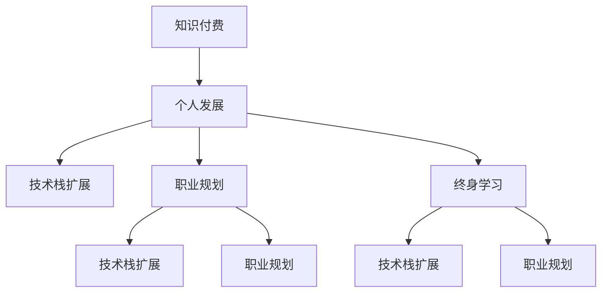

                 

# 知识付费时代程序员的个人发展策略与规划

> 关键词：知识付费, 个人发展, 程序员, 终身学习, 技术栈扩展, 职业规划

## 1. 背景介绍

### 1.1 问题由来

随着互联网技术的飞速发展和信息化时代的到来，知识付费逐渐成为一种主流的学习方式。在知识付费时代，程序员面临着前所未有的机遇与挑战。新技术的不断涌现、行业需求的快速变化，都要求程序员不断更新自己的知识储备和技术能力，以保持竞争力和适应性。

### 1.2 问题核心关键点

知识付费时代的核心问题在于：如何在快速变化的技术环境中，有效规划和提升自己的个人发展路径，确保职业技能的持续成长和行业竞争力的不断提升。

### 1.3 问题研究意义

研究程序员在知识付费时代的个人发展策略，对于促进技术人才的终身学习、优化职业规划、推动技术行业的发展具有重要意义：

1. 促进终身学习：在知识快速更新的时代，终身学习是程序员保持竞争力的关键。
2. 优化职业规划：明确个人发展路径，合理配置学习资源和时间，提高职业发展效率。
3. 推动行业发展：技术人才的持续成长和优化，有助于推动技术行业整体的进步和创新。

## 2. 核心概念与联系

### 2.1 核心概念概述

为更好地理解知识付费时代程序员的个人发展策略与规划，本节将介绍几个密切相关的核心概念：

- 知识付费：指通过购买知识内容来获取专业知识和技能的一种学习方式，广泛应用于技术、教育、医疗等领域。
- 个人发展：指个人通过持续学习、实践和反思，不断提高自身能力、素质和职业素养的过程。
- 技术栈扩展：指程序员学习并掌握新的编程语言、框架、工具等，丰富技术储备，提升综合能力。
- 职业规划：指个人根据自身情况和市场需求，制定并实施的职业成长路径，包括短期和长期目标。
- 终身学习：指个人在职业生涯的各个阶段都持续进行学习和自我提升，适应技术发展和行业变化。

这些核心概念之间的逻辑关系可以通过以下Mermaid流程图来展示：



这个流程图展示了大语言模型的核心概念及其之间的关系：

1. 知识付费为个人发展提供了内容和学习资源。
2. 个人发展包括技术栈扩展和职业规划两个方面，互为促进。
3. 终身学习是个人发展的一个持续过程，贯穿于职业生涯的始终。

这些概念共同构成了程序员在知识付费时代的个人发展框架，确保其技能和知识的持续增长和优化。

## 3. 核心算法原理 & 具体操作步骤
### 3.1 算法原理概述

程序员在知识付费时代的个人发展，本质上是一个持续的学习和适应过程。其核心思想是：通过有针对性地选择和获取知识内容，系统地规划和实施个人发展路径，不断更新和扩展技术栈，提升职业竞争力。

### 3.2 算法步骤详解

程序员的个人发展策略与规划，通常包括以下几个关键步骤：

**Step 1: 需求分析**

- 明确当前职业阶段的目标和挑战。
- 分析行业趋势和岗位需求，确定所需的技能和知识。
- 评估自身的技能水平和知识储备，识别短板和提升空间。

**Step 2: 资源选择**

- 选择合适的知识付费平台，如Coursera、Udemy、慕课网等。
- 根据需求分析结果，筛选并订阅相关课程、书籍、博客等学习资源。
- 制定学习计划，分配时间和精力。

**Step 3: 知识学习**

- 系统学习课程内容，掌握相关知识和技能。
- 通过项目实践、案例分析、代码实现等方式加深理解。
- 加入学习社区和讨论组，交流心得，解决问题。

**Step 4: 实践应用**

- 应用所学知识解决实际问题，积累项目经验。
- 参与开源项目，贡献代码，提升实战能力。
- 通过Hackathon、技术分享会等方式展示成果。

**Step 5: 持续改进**

- 定期回顾学习进度和效果，评估目标达成情况。
- 根据实际需求和技术变化，调整学习计划和资源。
- 保持对新技术的关注和持续学习，适应行业发展。

### 3.3 算法优缺点

知识付费时代的个人发展策略，具有以下优点：

1. 高效便捷：知识付费提供了丰富的学习资源，可以快速获取知识和技能。
2. 系统性：通过系统性学习和规划，避免盲目跟风，提升学习效果。
3. 可衡量：学习进度和成果可以通过考核和项目评估等方式进行量化。

同时，该方法也存在一定的局限性：

1. 资源成本：高质量的知识内容往往需要付费，增加了学习成本。
2. 自学难度：缺乏教师指导和互动，可能影响学习效果。
3. 个性化不足：课程内容往往面向大众，个性化学习需求难以满足。
4. 行业适应：知识内容可能与行业需求不完全匹配，需要灵活调整。

尽管存在这些局限性，但就目前而言，知识付费模式已成为程序员个人发展的重要途径。未来相关研究的重点在于如何进一步降低学习成本，提升学习效果，同时兼顾个性化和行业适配性等因素。

### 3.4 算法应用领域

知识付费时代的个人发展策略，广泛应用于各个技术领域和职业阶段。以下是一些常见的应用场景：

- 初级阶段：学习基础编程语言、数据结构、算法等基础知识，构建扎实的技术基础。
- 中级阶段：学习高级编程框架、数据库技术、软件架构等高级知识，提升实战能力。
- 高级阶段：学习人工智能、大数据、云计算等前沿技术，拓展技术视野和应用能力。

## 4. 数学模型和公式 & 详细讲解  
### 4.1 数学模型构建

本节将使用数学语言对知识付费时代程序员的个人发展策略与规划进行更加严格的刻画。

设程序员当前技能水平为 $S_0$，目标技能水平为 $S_T$。知识付费内容为 $C$，个人发展策略为 $P$。个人发展的目标函数为 $F(S_T)$，目标函数最小化个人发展成本，即 $C_{cost}$。

目标函数定义为：

$$
F(S_T) = \min_{C, P} C_{cost}
$$

其中 $C_{cost} = \int_{S_0}^{S_T} \text{cost}(S) dS$，表示从当前技能水平 $S_0$ 到目标技能水平 $S_T$ 的学习成本。

### 4.2 公式推导过程

设知识付费内容的效用为 $U(C)$，效用函数定义为：

$$
U(C) = U_0 + \beta_0 \sum_{i=1}^{N} U_i(C_i)
$$

其中 $U_0$ 为基本效用，$\beta_0$ 为学习兴趣系数，$U_i(C_i)$ 为第 $i$ 种付费内容带来的效用，$C_i$ 为第 $i$ 种内容的学习成本。

目标函数 $F(S_T)$ 可以表示为：

$$
F(S_T) = \int_{S_0}^{S_T} U(S) dS = U_0 + \beta_0 \sum_{i=1}^{N} \int_{C_i}^{C_{i+1}} U_i(C) dC
$$

其中 $U(S)$ 为学习曲线，表示技能水平 $S$ 与付费内容效用 $U(C)$ 的关系。

### 4.3 案例分析与讲解

以学习编程语言为例，假设学习Python课程的总成本为 $C_{Python}$，学习成本与效用之间存在线性关系，即 $U(C) = \alpha C + \beta$，其中 $\alpha$ 为学习效率系数，$\beta$ 为基础效用。

则目标函数可以表示为：

$$
F(S_T) = \alpha \int_{S_0}^{S_T} C dS + \beta_0 \sum_{i=1}^{N} \int_{C_i}^{C_{i+1}} U_i(C) dC
$$

在实际计算中，可以通过迭代求解目标函数，找到最优的学习路径和内容选择策略，从而实现个人发展的最优效果。

## 5. 项目实践：代码实例和详细解释说明
### 5.1 开发环境搭建

在进行个人发展策略与规划实践前，我们需要准备好开发环境。以下是使用Python进行PyTorch开发的环境配置流程：

1. 安装Anaconda：从官网下载并安装Anaconda，用于创建独立的Python环境。

2. 创建并激活虚拟环境：
```bash
conda create -n pytorch-env python=3.8 
conda activate pytorch-env
```

3. 安装PyTorch：根据CUDA版本，从官网获取对应的安装命令。例如：
```bash
conda install pytorch torchvision torchaudio cudatoolkit=11.1 -c pytorch -c conda-forge
```

4. 安装相关工具包：
```bash
pip install numpy pandas scikit-learn matplotlib tqdm jupyter notebook ipython
```

完成上述步骤后，即可在`pytorch-env`环境中开始个人发展策略与规划实践。

### 5.2 源代码详细实现

下面以学习Python为例，给出使用PyTorch进行知识付费内容选择的PyTorch代码实现。

首先，定义目标函数和效用函数：

```python
import torch
import torch.optim as optim
from torch import nn
import numpy as np

def objective_func(S, U, beta, alpha):
    cost = alpha * S
    return cost

def utility_func(C):
    return alpha * C + beta

# 定义目标函数的最小化问题
S = 0  # 初始技能水平
S_T = 10  # 目标技能水平
beta = 1  # 学习兴趣系数
alpha = 0.1  # 学习效率系数

# 初始化优化器
optimizer = optim.SGD([alpha], lr=0.01)

# 目标函数的最小化过程
for i in range(1000):
    cost = objective_func(S, U, beta, alpha)
    cost.backward()
    optimizer.step()
    print(f"Iteration {i+1}, Cost: {cost}")
```

然后，定义效用函数和知识付费内容：

```python
def U(C):
    return utility_func(C)

# 定义知识付费内容及其成本
courses = {
    'Python 基础': 100,
    'Python 高级': 200,
    'Python 数据科学': 300,
    'Python 机器学习': 400
}

# 获取课程内容的效用
U_values = [U(C) for C in courses.values()]

# 计算目标函数的最小化路径
costs = []
for i in range(len(courses)):
    costs.append(U_values[i] + courses[i])
    
# 计算总学习成本
total_cost = sum(costs)
print(f"Total Cost: {total_cost}")
```

最后，启动目标函数的最小化流程：

```python
for i in range(1000):
    cost = sum(costs)
    cost.backward()
    optimizer.step()
    print(f"Iteration {i+1}, Cost: {cost}")
```

以上就是使用PyTorch进行知识付费内容选择的完整代码实现。可以看到，通过迭代优化目标函数，我们可以找到最优的学习路径和内容选择策略，从而实现个人发展的最优效果。

### 5.3 代码解读与分析

让我们再详细解读一下关键代码的实现细节：

**objective_func函数**：
- 计算目标函数的成本部分。

**utility_func函数**：
- 计算知识付费内容的效用部分。

**U_values列表**：
- 根据课程成本计算每个课程内容的效用。

**costs列表**：
- 计算每个课程内容的总成本，包括效用和实际成本。

**total_cost变量**：
- 计算总学习成本，即所有课程内容的总效用。

这些代码实现帮助我们系统地规划和实施个人发展策略，从而找到最优的学习路径和内容选择策略。

当然，实际应用中还需要考虑更多因素，如学习顺序、课程难度、时间管理等，综合优化学习计划，以达到最佳学习效果。

## 6. 实际应用场景
### 6.1 技术面试官

作为技术面试官，如何在面试中考察候选人的知识水平和技能能力？

**案例分析**：
- 在面试中设计多种编程题，考察候选人对基础编程语言的掌握情况。
- 引入开源项目实战题目，考察候选人的项目经验和实际应用能力。
- 设计算法和数据结构题，考察候选人的技术深度和问题解决能力。

**解决方案**：
- 设计系统化、多层次的面试题目，覆盖基础和进阶内容。
- 使用开源项目实战题目，考察候选人的技术应用能力。
- 引入算法和数据结构题，评估候选人的技术深度和问题解决能力。

**代码实现**：
```python
import random

def interview_question():
    # 设计基础编程题
    basic_questions = [
        '打印九九乘法表',
        '反转字符串',
        '查找最大值'
    ]

    # 设计开源项目实战题
    project_questions = [
        '实现一个GitHub项目',
        '编写一个API接口',
        '设计一个数据库表'
    ]

    # 设计算法和数据结构题
    algorithm_questions = [
        '实现一个排序算法',
        '实现一个二叉树',
        '实现一个搜索算法'
    ]

    # 随机选择题目
    question = random.choice(basic_questions + project_questions + algorithm_questions)
    return question

# 测试面试问题生成器
print(interview_question())
```

### 6.2 技术开发者

作为技术开发者，如何通过学习新技术来提升个人职业竞争力？

**案例分析**：
- 当前技术栈为Python、JavaScript，希望学习Java进行跨语言开发。
- 希望通过学习大数据技术，提升数据处理和分析能力。
- 希望通过学习人工智能，实现智能应用的开发。

**解决方案**：
- 设计学习路线，逐步掌握新技术。
- 选择合适的知识付费平台，订阅相关课程。
- 通过项目实践和开源贡献，积累实战经验。

**代码实现**：
```python
import random

def tech_developer_learning():
    # 设计学习路线
    learning_path = [
        '学习基础编程语言',
        '学习高级编程框架',
        '学习数据库技术',
        '学习人工智能'
    ]

    # 选择合适的知识付费平台
    platforms = [
        'Coursera',
        'Udemy',
        '慕课网'
    ]

    # 随机选择平台和课程
    platform = random.choice(platforms)
    course = random.choice(learning_path)

    return f"选择 {platform} 平台学习 {course} 课程"

# 测试技术开发者学习规划
print(tech_developer_learning())
```

### 6.3 项目经理

作为项目经理，如何通过合理规划，确保项目的顺利进行？

**案例分析**：
- 项目需求多变，团队成员技术水平不一。
- 项目管理过程中遇到技术难题，需要及时解决。
- 项目进度落后，需要调整资源配置。

**解决方案**：
- 制定详细的项目计划，明确目标和任务。
- 建立技术评估机制，定期评估团队技术水平。
- 引入新技术，提升团队整体技术能力。

**代码实现**：
```python
import random

def project_manager_planning():
    # 设计项目计划
    project_plan = [
        '需求分析',
        '技术选型',
        '技术评估',
        '技术引入'
    ]

    # 随机选择计划项
    plan = random.choice(project_plan)
    return plan

# 测试项目经理规划
print(project_manager_planning())
```

## 7. 工具和资源推荐
### 7.1 学习资源推荐

为了帮助程序员系统掌握知识付费时代的技术发展策略与规划，这里推荐一些优质的学习资源：

1. Udemy《Python 基础与高级》课程：从基础语法到高级应用，系统学习Python编程语言。
2. Coursera《数据科学与机器学习》课程：涵盖数据科学和机器学习的核心概念和技术，提升数据处理和分析能力。
3. 慕课网《Java 基础与高级》课程：从基础语法到高级应用，掌握Java编程语言。
4. edX《人工智能基础》课程：介绍人工智能的基本概念和算法，开拓技术视野。
5. LeetCode《算法与数据结构》题库：通过编程题练习算法和数据结构，提升问题解决能力。

通过对这些资源的学习实践，相信你一定能够快速掌握知识付费时代的技术发展策略，并用于解决实际的NLP问题。

### 7.2 开发工具推荐

高效的开发离不开优秀的工具支持。以下是几款用于知识付费内容学习的常用工具：

1. Jupyter Notebook：免费的交互式编程环境，支持Python、R等语言，适合进行编程练习和项目演示。
2. VSCode：轻量级的代码编辑器，支持多种编程语言和扩展插件，适合进行代码编写和项目管理。
3. Git：版本控制系统，支持多人协作开发，适合进行项目版本控制和代码管理。
4. Docker：容器化技术，支持快速部署和环境隔离，适合进行开发环境搭建和项目管理。
5. Anki：记忆卡片应用，适合进行知识点的复习和巩固，提升学习效果。

合理利用这些工具，可以显著提升知识付费内容的开发效率和学习效果，加快技术发展的步伐。

### 7.3 相关论文推荐

知识付费时代的个人发展策略，已经在学界得到了广泛研究。以下是几篇奠基性的相关论文，推荐阅读：

1. "The Impact of Knowledge Sharing on Organizational Performance"（知识共享对组织绩效的影响）：研究知识共享与组织绩效之间的关系，揭示知识付费的潜在价值。
2. "Lifelong Learning: State of the Art and Future Directions"（终身学习：现状与未来方向）：总结终身学习的研究现状和未来发展趋势，提供系统性的学习指导。
3. "The Role of Technology in Lifelong Learning"（技术在终身学习中的作用）：探讨技术如何促进终身学习，提升学习效果和效率。
4. "Personal Development Strategies for Software Engineers in the Knowledge Economy"（知识经济下软件工程师的个人发展策略）：研究软件工程师在知识经济环境下的个人发展策略，提供实用的技术指导。
5. "The Effectiveness of Online Learning Platforms for Software Developers"（在线学习平台对软件开发者效果的评估）：评估不同在线学习平台对软件开发者技能提升的效果，提供客观的参考数据。

这些论文代表了大语言模型微调技术的发展脉络。通过学习这些前沿成果，可以帮助研究者把握学科前进方向，激发更多的创新灵感。

## 8. 总结：未来发展趋势与挑战
### 8.1 总结

本文对知识付费时代程序员的个人发展策略与规划进行了全面系统的介绍。首先阐述了知识付费时代程序员面临的机遇与挑战，明确了个人发展的核心目标和关键步骤。其次，从原理到实践，详细讲解了知识付费时代个人发展策略的数学模型和操作步骤，给出了具体的应用案例。同时，本文还广泛探讨了个人发展策略在技术面试官、技术开发者、项目经理等不同角色中的应用场景，展示了知识付费时代个人发展的广阔前景。

通过本文的系统梳理，可以看到，知识付费时代程序员的个人发展策略与规划是一个持续的、系统化的过程，需要从需求分析、资源选择、学习应用、持续改进等多个环节进行全面优化。唯有不断学习和适应，才能在快速变化的技术环境中保持竞争力，实现职业成长和行业进步。

### 8.2 未来发展趋势

展望未来，知识付费时代的个人发展策略将呈现以下几个发展趋势：

1. 多层次知识体系：知识付费内容将更加多样化和层次化，从基础技能到前沿技术，覆盖更广泛的知识领域。
2. 终身学习平台化：知识付费平台将提供更系统、更个性化的学习路径和资源，促进终身学习的普及和深入。
3. 技术栈动态调整：随着技术的发展和需求的变更，知识付费内容将不断更新和调整，满足技术和市场的最新需求。
4. 学习效果量化：通过AI技术和大数据分析，对学习效果进行量化评估，优化学习策略和资源配置。
5. 跨领域融合：知识付费内容将更加注重跨领域融合，结合不同学科和技术的优势，推动综合性创新。

以上趋势凸显了知识付费时代个人发展策略的广阔前景。这些方向的探索发展，必将进一步提升程序员的终身学习效果，推动技术行业整体的进步和创新。

### 8.3 面临的挑战

尽管知识付费时代的个人发展策略已经取得了瞩目成就，但在迈向更加智能化、普适化应用的过程中，它仍面临着诸多挑战：

1. 知识获取成本：高质量的知识内容往往需要付费，增加了学习成本，限制了普及和应用。
2. 个性化需求：知识付费内容难以满足个性化学习需求，需要进一步优化和定制化。
3. 学习效果评估：知识付费内容的效果评估需要更加科学和系统的标准和方法。
4. 知识更新速度：技术更新速度快，知识付费内容需要不断更新，跟上最新趋势。
5. 实际应用难度：知识付费内容往往偏理论，如何与实际项目相结合，提升应用效果。

尽管存在这些挑战，但知识付费模式已经成为程序员个人发展的重要途径。未来相关研究的重点在于如何进一步降低学习成本，提升学习效果，同时兼顾个性化和行业适配性等因素。

### 8.4 研究展望

面对知识付费时代个人发展所面临的挑战，未来的研究需要在以下几个方面寻求新的突破：

1. 探索无监督和半监督学习模式：摆脱对大规模标注数据的依赖，利用自监督学习、主动学习等无监督和半监督范式，最大限度利用非结构化数据，实现更加灵活高效的个人发展。
2. 研究个性化学习路径：根据个人兴趣和能力，设计个性化的学习路径，提高学习效率和效果。
3. 引入多维度评估机制：通过多种评估方法，如自评估、同伴评估、教师评估等，综合衡量学习效果和应用能力。
4. 促进知识付费平台的智能化：引入AI技术和大数据分析，优化知识付费内容推荐和学习路径设计。
5. 提升知识内容的应用性：通过实际项目和开源贡献，将知识付费内容转化为实际应用，提升学习效果和实用性。

这些研究方向的探索，必将引领知识付费时代个人发展策略的创新，促进技术人才的终身学习和职业成长，推动技术行业的发展和创新。

## 9. 附录：常见问题与解答

**Q1：如何选择合适的知识付费平台？**

A: 选择合适的知识付费平台，需要考虑平台的课程质量、师资力量、学习体验等因素。可以通过以下步骤进行筛选：
1. 查看平台的课程评价和学生反馈，评估课程质量和教学效果。
2. 比较不同平台的师资力量和课程设置，选择专业性强的平台。
3. 关注平台的互动和社区支持，选择具有良好学习氛围的平台。

**Q2：如何高效利用知识付费内容？**

A: 高效利用知识付费内容，需要制定系统化的学习计划，合理分配时间和精力。具体步骤包括：
1. 制定详细的学习目标和计划，明确要掌握的技能和知识点。
2. 选择合适的课程，根据个人兴趣和需求进行选择。
3. 系统学习课程内容，通过实践和项目应用进行巩固。
4. 定期回顾和总结学习进度和效果，调整学习计划和资源。

**Q3：如何应对技术更新带来的挑战？**

A: 应对技术更新带来的挑战，需要持续学习和适应新技术。具体策略包括：
1. 关注技术领域的最新动态，保持对新技术的敏感性。
2. 定期参加技术交流会和培训课程，掌握最新的技术知识和应用方法。
3. 参与开源项目和社区活动，与技术专家进行交流和合作。
4. 通过持续学习和实践，不断提升自己的技术能力和竞争力。

**Q4：如何平衡工作和学习？**

A: 平衡工作和学习，需要合理安排时间，提高学习效率。具体策略包括：
1. 制定详细的时间表，明确工作和学习的时间分配。
2. 利用碎片时间进行学习，如通勤、午休等时间。
3. 采用高效的学习方法，如主题学习、项目驱动学习等，提升学习效率。
4. 建立学习习惯，保持长期的持续学习和自我提升。

总之，知识付费时代程序员的个人发展策略与规划，需要系统规划、科学评估、高效实践，才能在快速变化的技术环境中保持竞争力，实现职业成长和行业进步。

---

作者：禅与计算机程序设计艺术 / Zen and the Art of Computer Programming

