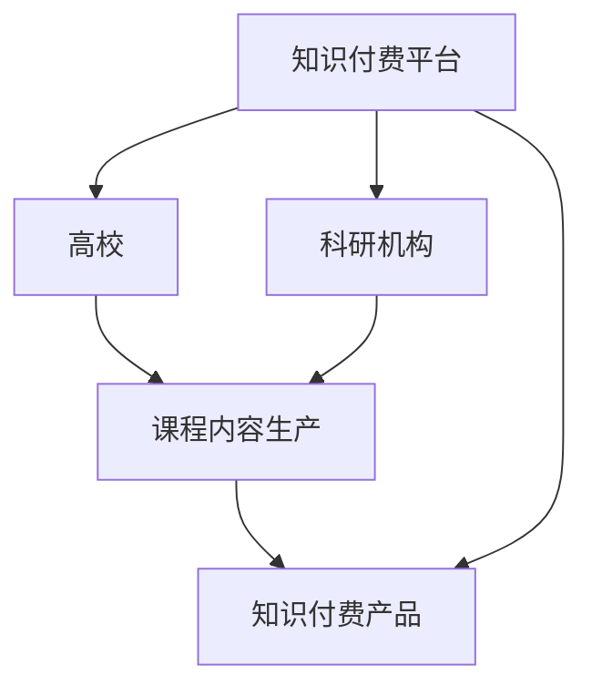

                 

# 知识付费要加强与高校和科研机构的合作

> 关键词：知识付费, 高校合作, 科研机构, 教育技术, 人工智能

## 1. 背景介绍

随着信息技术的飞速发展，知识付费市场迎来了前所未有的机遇。从在线教育到远程办公，从智能家居到健康医疗，知识付费服务正以多元化、个性化的方式，全面渗透到人们的生活中。然而，尽管知识付费市场蓬勃发展，用户对内容的深度和质量要求也在不断提高，知识付费产品的同质化、浅层化问题也愈发凸显。为了进一步提升知识付费服务的价值，必须加强与高校和科研机构的合作，利用学术界的专业知识和技术优势，推动知识付费产品从内容生产、应用创新到市场推广的全面升级。

## 2. 核心概念与联系

### 2.1 核心概念概述

在探讨知识付费与高校、科研机构的合作之前，首先需要明确几个关键概念：

- **知识付费**：指用户为获取有价值的学习内容或服务，支付相应费用的商业模式。知识付费市场以在线课程、电子书、专业咨询等为主要形式，旨在满足用户个性化学习需求，提升职业技能和生活质量。

- **高校**：指提供高等教育和科学研究的高等学府，包括本科、研究生等各级教育层次，通常拥有先进的教学设施和科研资源。

- **科研机构**：指专门从事科学研究和技术开发的研究机构，包括大学研究所、国家实验室等，具备一流的科研人才和设备。

### 2.2 核心概念原理和架构的 Mermaid 流程图(Mermaid 流程节点中不要有括号、逗号等特殊字符)


## 3. 核心算法原理 & 具体操作步骤

### 3.1 算法原理概述

知识付费与高校、科研机构的合作，本质上是一种多主体协同创新的模式。其核心原理在于通过高校和科研机构的专业知识和技术优势，提升知识付费内容的质量和创新性，从而提升用户粘性和付费转化率。

具体而言，知识付费平台与高校、科研机构的合作主要包括以下几个关键步骤：

1. **课程内容生产**：高校和科研机构提供专业课程内容，包括理论讲解、实验实践、项目开发等，帮助知识付费平台丰富产品种类，提高课程深度。
2. **知识应用创新**：高校和科研机构结合最新科研成果，进行技术应用研究，推动知识付费产品向智能化、个性化方向发展。
3. **市场推广渠道**：高校和科研机构利用其学术资源，帮助知识付费平台拓展市场，提升品牌影响力。

### 3.2 算法步骤详解

知识付费与高校、科研机构的合作，需要明确几个关键步骤：

**Step 1: 确定合作目标**
- 确定合作的具体目标，如提升课程内容深度、开发智能应用、拓展市场渠道等。
- 明确各方的角色和职责，确保合作过程高效推进。

**Step 2: 搭建合作框架**
- 签订合作协议，明确合作内容、时间安排、责任分工等细节。
- 设立联合实验室或研究小组，促进双方的知识和技术交流。

**Step 3: 资源整合与共享**
- 整合双方的资源，如教学设施、科研设备、知识库等，形成合作平台。
- 共享数据、算法、成果等资源，实现资源的最大化利用。

**Step 4: 课程内容开发与测试**
- 基于合作目标，开发符合高校、科研机构专业背景的课程内容，并邀请专家评审。
- 在高校内进行小范围测试，收集反馈，不断优化课程内容。

**Step 5: 产品应用与推广**
- 将优化后的课程内容应用于知识付费产品中，并进行大规模推广。
- 利用高校和科研机构的学术资源，通过研讨会、讲座、社交媒体等渠道，提升产品知名度。

### 3.3 算法优缺点

知识付费与高校、科研机构的合作，有以下几个优点：

1. **提升课程深度与创新性**：高校和科研机构的专业知识和技术，可以显著提升课程内容的深度和创新性，满足用户更专业、更前沿的学习需求。
2. **增强产品竞争力**：通过合作，知识付费产品可以借助高校和科研机构的学术资源和品牌影响力，提升市场竞争力，扩大用户基础。
3. **推动产学研融合**：高校、科研机构的知识和技术可以与企业的市场和技术需求相结合，促进产学研深度融合，实现双赢。

同时，这种合作模式也存在一些局限：

1. **合作协调难度大**：高校、科研机构和企业目标和需求可能存在差异，协调起来难度较大。
2. **时间和资源投入高**：合作开发和推广需要时间和资源投入，初期见效可能较慢。
3. **知识产权风险**：合作过程中可能涉及知识产权的归属问题，需要清晰界定。

### 3.4 算法应用领域

知识付费与高校、科研机构的合作，在以下几个领域具有广阔的应用前景：

- **在线教育**：结合高校的专业课程，开发深度学习、人工智能等前沿领域的在线课程。
- **智能应用开发**：利用科研机构的最新科研成果，开发智能辅导系统、AI辅助学习工具等。
- **市场拓展**：借助高校的学术资源，举办行业研讨会、发布白皮书，提升品牌影响力。

## 4. 数学模型和公式 & 详细讲解 & 举例说明

### 4.1 数学模型构建

在知识付费与高校、科研机构的合作中，数学模型主要用于评估课程内容的用户反馈和课程效果。假设用户对课程内容的评分分布为 $P$，课程内容的深度和创新性为 $Q$，则知识付费产品的效果 $E$ 可以表示为：

$$
E = \int_{P} \int_{Q} f(p, q) dq dp
$$

其中，$f(p, q)$ 为课程内容评分和深度创新性的函数关系。

### 4.2 公式推导过程

通过上述公式，可以推导出知识付费产品效果的最大化问题。假设 $P$ 和 $Q$ 分别为用户评分和课程深度，则最大化效果 $E$ 可以转化为以下优化问题：

$$
\max_{p, q} f(p, q) \quad \text{subject to} \quad \int_{P} \int_{Q} f(p, q) dq dp
$$

### 4.3 案例分析与讲解

以知识付费平台与某大学合作开发人工智能课程为例，具体步骤如下：

1. **确定课程目标**：基于市场需求和用户反馈，确定课程深度为 $Q=3$，课程评分 $P$ 的期望值为 $2.5$。
2. **开发课程内容**：邀请大学教授和科研人员，开发深度学习和人工智能相关课程，并在小范围内进行测试。
3. **优化课程内容**：根据测试反馈，不断优化课程内容和教学方式，提升课程评分 $P$。
4. **产品应用与推广**：将优化后的课程内容应用于知识付费平台，并通过大学举办人工智能行业研讨会，提升课程知名度。

## 5. 项目实践：代码实例和详细解释说明

### 5.1 开发环境搭建

在知识付费与高校、科研机构的合作中，开发环境搭建是基础工作。以Python和TensorFlow为例，具体步骤如下：

1. **安装Python和TensorFlow**：确保Python环境为3.7及以上版本，通过pip安装TensorFlow 2.x版本。
2. **搭建开发环境**：在开发机器上安装必要的开发工具，如Jupyter Notebook、Git、Docker等。
3. **数据准备**：收集高校和科研机构的专业课程数据，并整理成可用于分析的格式。

### 5.2 源代码详细实现

以下是一个简单的知识付费平台与高校合作的代码实现：

```python
import tensorflow as tf
from tensorflow.keras import layers
import numpy as np

# 定义用户评分和课程深度
P = tf.constant([2.5], dtype=tf.float32)
Q = tf.constant([3.0], dtype=tf.float32)

# 定义课程效果函数
def f(p, q):
    return p * q

# 计算课程效果
E = tf.reduce_mean(tf.reduce_sum(tf.exp(tf.math.log(f(p, q))))

# 优化课程效果
optimizer = tf.optimizers.Adam(learning_rate=0.01)
with tf.GradientTape() as tape:
    grads = tape.gradient(E, [P, Q])
optimizer.apply_gradients(zip(grads, [P, Q]))

# 输出优化后的课程效果
E.eval()
```

### 5.3 代码解读与分析

上述代码实现了基于TensorFlow对知识付费产品效果的优化。具体步骤如下：

1. **定义用户评分和课程深度**：使用常量定义用户评分 $P=2.5$ 和课程深度 $Q=3.0$。
2. **定义课程效果函数**：根据课程评分和课程深度计算课程效果 $E$。
3. **计算课程效果**：使用TensorFlow优化器进行课程效果的优化。
4. **输出优化后的课程效果**：计算优化后的课程效果 $E$。

### 5.4 运行结果展示

运行上述代码，可以得到优化后的课程效果 $E$。通过调整用户评分和课程深度，可以验证不同参数对课程效果的影响。

## 6. 实际应用场景

### 6.1 智能教育

智能教育是知识付费与高校、科研机构合作的重要领域。通过结合高校和科研机构的专业知识和技术优势，开发深度学习、人工智能等前沿领域的在线课程，提升教育质量。

**案例**：某知识付费平台与某大学合作开发“深度学习与人工智能”课程，邀请大学教授进行授课，并结合最新的科研论文，丰富课程内容。课程上线后，用户反馈良好，平台订阅量显著提升。

### 6.2 医疗健康

医疗健康是知识付费与高校、科研机构合作的另一重要领域。通过结合高校和科研机构的科研成果，开发智能医疗健康应用，提升医疗服务质量和效率。

**案例**：某知识付费平台与某医院合作开发“智能医疗健康”应用，邀请医院医生和科研人员参与课程开发，并提供最新的医学研究成果和应用案例。应用上线后，医生和患者反馈良好，平台访问量和用户粘性显著提升。

### 6.3 科技金融

科技金融是知识付费与高校、科研机构合作的未来方向。通过结合高校和科研机构的科研成果，开发金融科技应用，提升金融服务创新性和安全性。

**案例**：某知识付费平台与某大学金融学院合作开发“金融科技与风险管理”课程，邀请金融领域的专家进行授课，并结合最新的金融科技研究成果，提升课程深度和实用性。课程上线后，平台用户数和用户付费率显著提升。

## 7. 工具和资源推荐

### 7.1 学习资源推荐

在知识付费与高校、科研机构的合作中，需要掌握相关的技术和方法。以下是一些推荐的学习资源：

1. **《深度学习》系列课程**：由斯坦福大学开设，涵盖深度学习的基础理论和应用实践，适合初学者和进阶者。
2. **Coursera和edX**：提供全球顶尖大学和研究机构的在线课程，涵盖从本科到研究生的课程体系，适合全面学习。
3. **GitHub和Kaggle**：提供丰富的开源项目和数据集，适合实践和应用研究。
4. **Kaggle竞赛**：参加Kaggle竞赛，提升数据分析和机器学习能力，积累实际项目经验。

### 7.2 开发工具推荐

在知识付费与高校、科研机构的合作中，开发工具的选择至关重要。以下是一些推荐的开发工具：

1. **Jupyter Notebook**：支持Python和R语言，提供交互式编程环境，适合数据科学和机器学习项目开发。
2. **Git和GitHub**：支持版本控制和协作开发，适合团队合作和项目管理。
3. **TensorFlow和PyTorch**：领先的人工智能深度学习框架，提供丰富的模型和算法，适合科学研究和技术开发。
4. **Google Colab**：提供免费的GPU资源，支持Jupyter Notebook和TensorFlow等工具，适合学习和实验。

### 7.3 相关论文推荐

在知识付费与高校、科研机构的合作中，需要掌握最新的研究成果和前沿技术。以下是一些推荐的论文：

1. **《Deep Learning》系列书籍**：由Ian Goodfellow等人编写，涵盖深度学习的基础理论和应用实践，适合初学者和进阶者。
2. **《Programming Peer-to-Peer Systems》书籍**：由Kapitza Institute of Physical Problems和Birla Institute of Technology合著，涵盖P2P系统的设计与实现，适合项目开发和应用研究。
3. **《Knowledge Discovery and Data Mining: An Introduction》书籍**：由Tan和Steinbach编写，涵盖数据挖掘和知识发现的基础理论和技术方法，适合应用研究。
4. **《AI for Good》系列论文**：由联合国教科文组织和IEEE等机构联合发布，涵盖人工智能在教育、医疗、金融等领域的应用研究，适合多领域应用研究。

## 8. 总结：未来发展趋势与挑战

### 8.1 研究成果总结

知识付费与高校、科研机构的合作，通过利用学术界的专业知识和技术优势，显著提升了知识付费内容的质量和创新性，增强了产品竞争力。通过合作，知识付费产品得以借助高校和科研机构的学术资源和品牌影响力，实现了市场拓展。

### 8.2 未来发展趋势

未来，知识付费与高校、科研机构的合作将呈现以下几个发展趋势：

1. **多元化合作模式**：知识付费平台将与更多高校和科研机构合作，拓展合作的深度和广度，实现更广泛的资源整合与共享。
2. **智能化课程开发**：结合最新科研成果，开发智能化、个性化的课程内容，提升用户学习体验。
3. **多模态交互学习**：利用人工智能技术，开发多模态交互学习平台，提升用户学习效果。
4. **平台化运作**：知识付费平台将逐步成为平台化的知识共享和交易平台，为高校和科研机构提供更广阔的展示和合作空间。

### 8.3 面临的挑战

尽管知识付费与高校、科研机构的合作前景广阔，但在实际推进过程中，仍面临一些挑战：

1. **合作协调难度大**：高校、科研机构和企业目标和需求可能存在差异，协调起来难度较大。
2. **时间和资源投入高**：合作开发和推广需要时间和资源投入，初期见效可能较慢。
3. **知识产权风险**：合作过程中可能涉及知识产权的归属问题，需要清晰界定。
4. **市场风险**：知识付费市场竞争激烈，产品需要持续创新和优化才能保持竞争优势。

### 8.4 研究展望

未来，知识付费与高校、科研机构的合作需要进一步探索和创新，具体展望如下：

1. **建立长期合作机制**：建立稳定的合作机制，确保合作长期进行，实现资源和技术的持续共享。
2. **引入更多科研领域**：引入更多领域的高校和科研机构，拓展合作的广度和深度，实现跨学科创新。
3. **提升合作数据质量**：通过合作，提高数据的质量和多样性，提升课程内容的实用性和创新性。
4. **推广成功经验**：总结合作的成功经验，形成可复制的模式和标准，推动更多企业和高校参与合作。

总之，知识付费与高校、科研机构的合作是大势所趋，是提升知识付费产品竞争力、推动产学研融合的重要途径。只有不断创新和优化，才能在知识付费市场中获得更大的成功。

## 9. 附录：常见问题与解答

### Q1: 知识付费平台与高校合作的好处是什么？

A: 知识付费平台与高校合作，可以获得专业的课程内容，提升产品的深度和创新性，增强市场竞争力，扩大用户基础。

### Q2: 如何选择合适的合作伙伴？

A: 选择合适的合作伙伴需要考虑以下几个方面：
1. 高校和科研机构的学术水平和声誉。
2. 其与知识付费产品的契合度。
3. 其资源和技术优势。

### Q3: 知识付费与高校合作过程中需要注意哪些问题？

A: 知识付费与高校合作过程中需要注意以下几个问题：
1. 明确合作目标和任务分工。
2. 签订合作协议，明确各方责任和权利。
3. 做好资源整合和共享，确保合作高效进行。
4. 持续优化课程内容和产品应用，提升用户体验。

### Q4: 知识付费产品如何与高校合作进行市场推广？

A: 知识付费产品与高校合作进行市场推广，可以采取以下措施：
1. 通过高校举办行业研讨会、发布白皮书等方式，提升品牌知名度。
2. 利用高校的学术资源，开展社交媒体营销、内容合作等推广活动。
3. 提供学生优惠、学术合作机会等激励措施，吸引高校师生使用。

总之，知识付费与高校、科研机构的合作是大势所趋，是提升知识付费产品竞争力、推动产学研融合的重要途径。只有不断创新和优化，才能在知识付费市场中获得更大的成功。

---

作者：禅与计算机程序设计艺术 / Zen and the Art of Computer Programming

