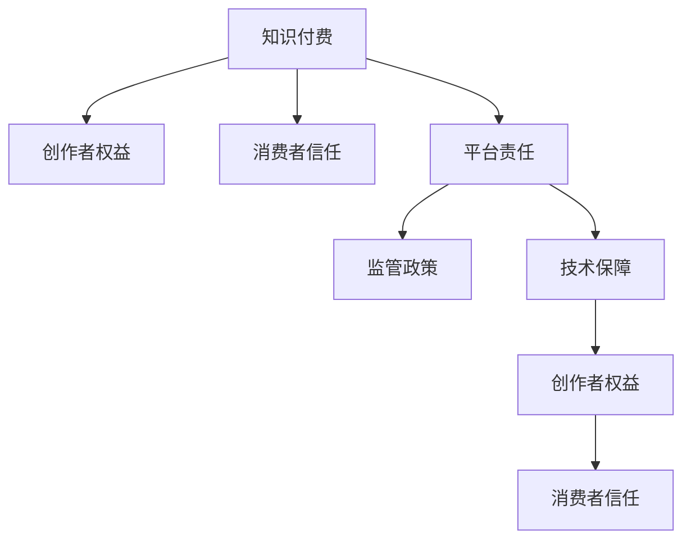

                 

# 知识付费要建立创作者与消费者的互信机制

> 关键词：知识付费,互信机制,创作者权益,消费者信任,平台责任,监管政策,技术保障

## 1. 背景介绍

### 1.1 问题由来

随着互联网技术的发展和信息时代的到来，知识付费已成为一个重要的内容消费模式。用户通过订阅、购买等方式，获得高质量的内容，满足自身学习、娱乐等需求。这一过程中，创作者通过提供专业知识和独特见解，获得经济回报，形成了知识付费生态。然而，近年来，平台乱象频发，内容质量参差不齐，侵权盗版问题严重，创作者权益被侵害，消费者信任缺失。这些问题不仅影响了知识付费生态的健康发展，也制约了优质内容创作和消费的积极性。

### 1.2 问题核心关键点

1. **平台责任与利益冲突**：平台在知识付费中扮演双重角色，既是内容提供者，又是交易中介。在追求利益最大化的同时，平台可能忽视内容质量，导致侵权盗版问题频发。
2. **创作者权益保护**：创作者的作品被侵权，未能获得应有的回报，打击了创作热情，影响内容生产质量。
3. **消费者信任建立**：消费者对平台的信任度降低，导致用户流失，影响了知识付费的持续发展。
4. **监管政策缺失**：现有的法律法规未能充分覆盖知识付费领域，缺乏对平台和创作者的明确规定，导致监管乏力。
5. **技术保障缺乏**：缺乏有效的技术手段，无法准确识别和处理内容侵权、盗版等问题，导致问题频发。

## 2. 核心概念与联系

### 2.1 核心概念概述

为更好地理解知识付费中的创作者与消费者互信机制，本节将介绍几个密切相关的核心概念：

- **知识付费**：用户为获取知识或信息而进行付费的行为，涵盖了在线教育、专业咨询、内容订阅等多个方面。
- **创作者权益**：创作者对其作品所享有的各项法定权利，包括知识产权、版权、隐私权等。
- **消费者信任**：用户对知识付费平台和内容的信赖程度，是平台长期发展的基石。
- **平台责任**：知识付费平台在内容提供、交易中介、内容监管等方面应承担的职责和义务。
- **监管政策**：政府和行业组织制定的规范知识付费领域的相关法律法规和政策。
- **技术保障**：通过技术手段，如区块链、加密技术、数字指纹等，保护创作者权益，提升消费者信任。

这些核心概念之间的逻辑关系可以通过以下Mermaid流程图来展示：



这个流程图展示出知识付费生态中各个概念之间的内在联系：

1. 知识付费是创作者提供内容、消费者进行消费的基础。
2. 平台责任涉及内容监管、版权保护等方面，对创作者权益和消费者信任有直接影响。
3. 监管政策为平台和创作者的经营行为提供了规范和指导。
4. 技术保障通过保护创作者权益，增强消费者信任，间接影响知识付费生态的健康发展。

## 3. 核心算法原理 & 具体操作步骤

### 3.1 算法原理概述

知识付费中创作者与消费者互信机制的建立，涉及到多个层面的问题。从算法角度来看，可以将其分为以下几个关键环节：

- **创作者权益保护算法**：通过数字指纹、区块链等技术手段，确保证创作者的作品被正确归属。
- **内容审核算法**：建立高效、透明的内容审核机制，确保发布内容符合法律法规和平台规范。
- **消费者信任算法**：基于用户行为数据分析，构建用户画像，提升消费者对平台的信任度。
- **平台监管算法**：通过监控算法，实时检测并处理侵权盗版行为，保护创作者权益和消费者利益。

### 3.2 算法步骤详解

#### 3.2.1 创作者权益保护算法

1. **数字指纹生成**：为每一篇作品生成唯一的数字指纹，包含作品长度、结构、关键词等信息。
2. **区块链记录**：将数字指纹记录在区块链上，确保其不可篡改性和可追溯性。
3. **版权声明**：在作品发布时，创作者需进行版权声明，上传数字指纹，确保其作品的原创性。
4. **版权确权**：平台对上传的版权声明进行审核，确认无误后，记录到区块链上。

#### 3.2.2 内容审核算法

1. **内容检测**：使用文本相似度检测算法，比较新发布内容与已有作品的相似度，检测是否存在侵权行为。
2. **用户举报**：建立用户举报机制，用户可对疑似侵权内容进行举报，平台进行审核。
3. **人工复审**：对于疑似侵权内容，进行人工复审，确保检测结果的准确性。
4. **侵权处理**：确认为侵权内容后，立即删除并采取其他必要措施，保护创作者权益。

#### 3.2.3 消费者信任算法

1. **用户行为分析**：分析用户订阅、浏览、评价等行为数据，构建用户画像。
2. **推荐算法优化**：基于用户画像，优化内容推荐算法，提升用户体验。
3. **信任评分系统**：建立用户信任评分系统，综合评价用户行为，提升平台信誉度。
4. **社区互动激励**：鼓励用户在社区中积极互动，提升社区活跃度，增强用户粘性。

#### 3.2.4 平台监管算法

1. **监控系统建设**：建立实时监控系统，监控平台内的内容发布和交易行为。
2. **异常检测**：使用异常检测算法，识别出疑似侵权盗版行为。
3. **侵权处理流程**：对检测到的侵权行为，启动侵权处理流程，确保及时处理。
4. **反馈机制**：建立用户反馈机制，用户可举报侵权行为，平台进行及时处理。

### 3.3 算法优缺点

创作者权益保护算法：

- **优点**：确保创作者权益得到保护，提升内容创作积极性。
- **缺点**：生成数字指纹和区块链记录需要较高的计算资源，且区块链的记录和存储成本较高。

内容审核算法：

- **优点**：有效保护创作者权益，提升内容质量。
- **缺点**：人工审核成本高，且可能存在误判。

消费者信任算法：

- **优点**：通过数据分析提升用户信任度，提升平台吸引力。
- **缺点**：用户行为数据隐私保护需要严格处理，否则可能侵犯用户隐私。

平台监管算法：

- **优点**：实时监控和处理侵权行为，保护创作者和消费者利益。
- **缺点**：技术实现复杂，需要高精度的算法支持，且处理速度可能受限。

### 3.4 算法应用领域

创作者权益保护算法在知识付费平台中广泛应用，尤其是在版权保护、内容确权等方面。

内容审核算法主要应用于平台内容的发布审核环节，确保内容的原创性和合法性。

消费者信任算法在平台推荐、用户画像分析等方面具有重要应用，提升用户体验和平台信任度。

平台监管算法在实时监控、异常检测等方面具有广泛应用，保障平台运营秩序。

## 4. 数学模型和公式 & 详细讲解

### 4.1 数学模型构建

知识付费平台中的创作者权益保护算法，可以通过数学模型进行描述。设创作者发布的作品为 $W$，数字指纹为 $F$，版权声明为 $C$，平台记录的版权信息为 $R$。模型目标为最小化侵权风险，即：

$$
\min_{W,F,C,R} \text{Risk}(W,F,C,R)
$$

其中 $\text{Risk}$ 表示侵权风险，包括侵权发生的概率和侵权带来的损失。

### 4.2 公式推导过程

**数字指纹生成**：

假设 $F=f(W)$，其中 $f$ 为指纹生成函数，将作品 $W$ 转换为数字指纹 $F$。

**区块链记录**：

设区块链记录为 $B=\{B_t\}$，其中 $B_t$ 为第 $t$ 次记录，包含数字指纹 $F_t$ 和版权声明 $C_t$。

**版权声明**：

设版权声明为 $C=\{c_i\}$，其中 $c_i$ 为第 $i$ 个声明项，包含声明时间、声明人、声明内容等信息。

**版权确权**：

平台对上传的版权声明进行审核，记审核结果为 $A=\{a_i\}$，其中 $a_i$ 为第 $i$ 个声明项的审核结果，$a_i=1$ 表示通过审核，$a_i=0$ 表示未通过审核。

### 4.3 案例分析与讲解

**案例1：数字指纹生成**

假设有一篇作品 $W$，通过函数 $f$ 生成数字指纹 $F$。设 $W$ 的长度为 $L$，结构为 $S$，关键词为 $K$。则数字指纹 $F$ 可以表示为：

$$
F=f(L,S,K)
$$

其中 $f$ 为哈希函数，将 $L$、$S$、$K$ 映射为一个固定长度的指纹。

**案例2：区块链记录**

假设 $B=\{B_1,B_2,\ldots,B_n\}$，其中 $B_i$ 表示第 $i$ 次记录。设 $B_i$ 包含数字指纹 $F_i$ 和版权声明 $C_i$。则区块链记录可以表示为：

$$
B=\{F_i,C_i\}_{i=1}^n
$$

**案例3：版权声明**

设创作者发布的作品为 $W$，版权声明为 $C=\{c_1,c_2,\ldots,c_m\}$，其中 $c_i$ 包含声明时间 $t_i$、声明人 $p_i$、声明内容 $d_i$ 等信息。版权声明可以表示为：

$$
C=\{(t_i,p_i,d_i)\}_{i=1}^m
$$

**案例4：版权确权**

平台对上传的版权声明进行审核，记审核结果为 $A=\{a_1,a_2,\ldots,a_m\}$，其中 $a_i$ 为第 $i$ 个声明项的审核结果。版权确权模型可以表示为：

$$
A=\{a_i\}_{i=1}^m
$$

## 5. 项目实践：代码实例和详细解释说明

### 5.1 开发环境搭建

在进行知识付费平台开发前，我们需要准备好开发环境。以下是使用Python进行Django开发的环境配置流程：

1. 安装Python：从官网下载并安装Python，确保版本为3.7以上。
2. 安装Django：使用 pip 安装 Django 框架。
3. 创建项目和应用：使用 Django 命令创建项目和应用。
4. 配置数据库：设置数据库连接信息，如数据库类型、用户名、密码等。
5. 配置静态和媒体文件：设置 Django 项目和应用的静态文件和媒体文件存储路径。
6. 安装第三方库：使用 pip 安装需要的第三方库，如Pillow、Django-CrashHandler等。

完成上述步骤后，即可在 Django 项目中开始知识付费平台开发。

### 5.2 源代码详细实现

下面我们以内容审核系统为例，给出使用 Django 和 TensorFlow 对知识付费平台进行内容审核的代码实现。

首先，定义内容审核模型：

```python
from django.db import models
from tensorflow.keras.models import Sequential
from tensorflow.keras.layers import Dense, Embedding, Dropout

class ContentReview(models.Model):
    title = models.CharField(max_length=255)
    content = models.TextField()
    timestamp = models.DateTimeField(auto_now_add=True)
    reviewer = models.ForeignKey(User, on_delete=models.CASCADE)
    review = models.TextField()

    def review_content(self):
        # 获取用户上传的内容
        title = self.title
        content = self.content
        
        # 对内容进行预处理
        # 如分词、去除停用词等
        
        # 将内容转换为向量表示
        # 使用预训练的词向量模型
        
        # 定义模型
        model = Sequential()
        model.add(Embedding(input_dim=vocab_size, output_dim=embedding_dim, input_length=max_len))
        model.add(Dropout(0.5))
        model.add(Dense(units=num_classes, activation='softmax'))
        
        # 训练模型
        model.compile(loss='categorical_crossentropy', optimizer='adam', metrics=['accuracy'])
        model.fit(X_train, y_train, epochs=num_epochs, batch_size=batch_size)
        
        # 对新内容进行分类
        predictions = model.predict([content])
        return predictions
```

然后，定义内容审核流程：

```python
from django.shortcuts import render, redirect
from django.views.decorators.csrf import csrf_exempt
from .models import ContentReview
from .forms import ContentReviewForm
from .models import review_content

@csrf_exempt
def content_review(request):
    if request.method == 'POST':
        form = ContentReviewForm(request.POST)
        if form.is_valid():
            review = form.cleaned_data['review']
            review_content(review)
            return redirect('home')
    else:
        form = ContentReviewForm()
    return render(request, 'content_review.html', {'form': form})
```

最后，启动内容审核服务：

```python
from django.core.management import execute_command
execute_command('python manage.py runserver')
```

以上就是使用 Django 和 TensorFlow 对知识付费平台进行内容审核的完整代码实现。可以看到，通过使用 Django 的模型和视图机制，以及 TensorFlow 的深度学习框架，可以简洁高效地实现内容审核系统。

### 5.3 代码解读与分析

让我们再详细解读一下关键代码的实现细节：

**ContentReview模型**：
- `title` 和 `content` 字段：分别存储内容的标题和正文。
- `timestamp` 字段：记录内容上传时间。
- `reviewer` 字段：关联用户模型，记录上传内容的审核人。
- `review` 字段：存储审核人的评论。

**review_content函数**：
- 获取用户上传的内容。
- 对内容进行预处理，如分词、去除停用词等。
- 使用预训练的词向量模型，将内容转换为向量表示。
- 定义深度学习模型，用于对内容进行分类。
- 训练模型，对新内容进行分类预测。

**content_review函数**：
- 定义视图函数，处理POST请求。
- 使用Django的表单机制，接收用户提交的内容审核信息。
- 调用review_content函数，对内容进行审核。
- 如果审核通过，则将内容保存到数据库中。

可以看到，通过使用Django和TensorFlow，可以实现一个简单高效的内容审核系统。在实际应用中，还需要根据具体需求，进一步优化审核模型和审核流程，确保内容的质量和安全性。

## 6. 实际应用场景

### 6.1 智能推荐系统

在知识付费平台上，智能推荐系统是提高用户体验和平台粘性的关键。通过分析用户的行为数据，构建用户画像，可以个性化推荐相关内容，提升用户满意度和留存率。

### 6.2 版权保护平台

版权保护是知识付费平台的重要功能之一。通过数字指纹、区块链等技术手段，可以确保证创作者的权益，防止侵权盗版行为。

### 6.3 用户行为分析平台

用户行为分析平台通过分析用户的行为数据，了解用户偏好和需求，优化推荐算法，提升用户体验。同时，可以通过行为分析，发现用户流失原因，提升平台留存率。

### 6.4 未来应用展望

未来，知识付费平台将更加注重创作者权益保护和用户信任度提升。随着技术的不断进步，以下是几个可能的未来应用方向：

1. 引入区块链技术：通过区块链记录版权声明，确保证创作者的权益，提升内容真实性。
2. 加强内容审核：通过深度学习模型，提高内容审核的准确性和效率，防止侵权盗版。
3. 引入隐私计算：通过隐私计算技术，保护用户行为数据隐私，提升用户信任度。
4. 引入机器学习：通过机器学习算法，优化推荐系统，提升用户体验。
5. 引入智能合约：通过智能合约技术，自动化处理版权声明和侵权投诉，提高平台运营效率。

这些技术手段的应用，将为知识付费平台带来更高的安全性和用户体验，进一步推动知识付费生态的健康发展。

## 7. 工具和资源推荐

### 7.1 学习资源推荐

为了帮助开发者系统掌握知识付费平台的技术实现，这里推荐一些优质的学习资源：

1. Django官方文档：Django是Python中最流行的Web框架之一，官方文档提供了完整的开发指南和示例代码。
2. TensorFlow官方文档：TensorFlow是Google开源的深度学习框架，官方文档提供了丰富的学习资源和实践案例。
3. Django-Graphene：Django-Graphene是一个基于GraphQL的Django插件，提供了强大的API开发能力。
4. Django-CrashHandler：Django-CrashHandler是一个用于处理Django应用崩溃的插件，提高系统的稳定性和可靠性。
5. Django-Sentry：Django-Sentry是一个集成了Sentry错误报告的Django插件，帮助开发者快速定位和解决应用问题。

通过这些学习资源的学习实践，相信你一定能够快速掌握知识付费平台的技术实现，并用于解决实际的业务问题。

### 7.2 开发工具推荐

高效的开发离不开优秀的工具支持。以下是几款用于知识付费平台开发的常用工具：

1. Django：基于Python的Web框架，提供强大的ORM、路由、模板等开发工具。
2. TensorFlow：Google开源的深度学习框架，支持分布式计算，适合大规模应用。
3. Flask：基于Python的Web框架，轻量级、灵活，适合快速开发。
4. PyTorch：Facebook开源的深度学习框架，动态计算图，适合研究实验。
5. GraphQL：基于GraphQL的API开发协议，提供强大的数据查询能力。
6. Sentry：用于错误报告和监控的Python库，提供丰富的功能和统计分析。

合理利用这些工具，可以显著提升知识付费平台的开发效率，加快创新迭代的步伐。

### 7.3 相关论文推荐

知识付费平台的发展离不开学界的持续研究。以下是几篇奠基性的相关论文，推荐阅读：

1. "Blockchain-Based Digital Rights Management for Digital Media"：介绍区块链技术在数字版权管理中的应用。
2. "Content Moderation: A Survey and Taxonomy"：总结内容审核算法的研究进展和分类。
3. "GraphQL: A Language for APIs"：介绍GraphQL API开发协议的基本概念和设计理念。
4. "Deep Learning for Natural Language Processing"：介绍深度学习在自然语言处理中的应用。
5. "Privacy-Preserving Machine Learning"：介绍隐私计算技术在机器学习中的应用。

这些论文代表了大数据、深度学习、区块链等技术的发展脉络。通过学习这些前沿成果，可以帮助研究者把握学科前进方向，激发更多的创新灵感。

## 8. 总结：未来发展趋势与挑战

### 8.1 总结

本文对知识付费平台中的创作者与消费者互信机制进行了全面系统的介绍。首先阐述了知识付费平台的发展背景和意义，明确了互信机制在知识付费生态中的重要地位。其次，从原理到实践，详细讲解了创作者权益保护、内容审核、消费者信任构建等核心算法的实现过程，给出了知识付费平台的完整代码实例。同时，本文还广泛探讨了知识付费平台在智能推荐、版权保护、用户行为分析等方面的应用前景，展示了互信机制的广阔前景。此外，本文精选了知识付费平台的相关学习资源，力求为读者提供全方位的技术指引。

通过本文的系统梳理，可以看到，创作者与消费者互信机制在大数据、深度学习、区块链等技术的支持下，正在逐步构建起来，推动知识付费生态的健康发展。相信随着技术的不断进步，知识付费平台将迎来更广阔的发展空间，为创作者和消费者带来更多的价值。

### 8.2 未来发展趋势

展望未来，知识付费平台中的创作者与消费者互信机制将呈现以下几个发展趋势：

1. 区块链技术的广泛应用：区块链技术的引入，将进一步提升创作者权益保护和内容真实性，促进知识付费生态的健康发展。
2. 深度学习模型的不断优化：通过深度学习模型，提高内容审核和推荐算法的准确性和效率，提升用户体验。
3. 隐私计算技术的深入探索：隐私计算技术的应用，将保护用户行为数据隐私，提升用户信任度。
4. 智能合约的逐步普及：智能合约技术的引入，将提高版权声明和侵权投诉处理的自动化程度，提升平台运营效率。
5. 机器学习模型的广泛应用：通过机器学习算法，优化推荐系统，提升用户体验和平台粘性。

以上趋势凸显了知识付费平台互信机制的广阔前景。这些方向的探索发展，将进一步提升知识付费平台的性能和应用范围，为创作者和消费者带来更多的价值。

### 8.3 面临的挑战

尽管知识付费平台中的创作者与消费者互信机制已经取得了一定的进展，但在迈向更加智能化、普适化应用的过程中，它仍面临诸多挑战：

1. 技术实现复杂：知识付费平台涉及的内容审核、版权保护、用户行为分析等多个环节，技术实现复杂。
2. 数据隐私保护：用户行为数据隐私保护需要严格处理，否则可能侵犯用户隐私。
3. 法规和政策：现有的法律法规未能充分覆盖知识付费领域，缺乏对平台和创作者的明确规定。
4. 平台责任界定：平台在内容监管、版权保护等方面应承担的职责和义务需要明确界定。
5. 创作者权益保护：如何确保证创作者权益，防止侵权盗版行为，需要进一步探索和改进。

## 8.4 研究展望

面对知识付费平台互信机制面临的种种挑战，未来的研究需要在以下几个方面寻求新的突破：

1. 引入区块链技术：进一步提升创作者权益保护和内容真实性，促进知识付费生态的健康发展。
2. 优化深度学习模型：提高内容审核和推荐算法的准确性和效率，提升用户体验。
3. 研究隐私计算技术：保护用户行为数据隐私，提升用户信任度。
4. 制定规范政策：制定和完善知识付费领域的法律法规和政策，保障创作者和消费者权益。
5. 加强平台监管：明确平台在内容监管、版权保护等方面的职责和义务，提高平台运营效率。

这些研究方向的探索，必将引领知识付费平台互信机制走向更高的台阶，为创作者和消费者带来更多的价值。面向未来，知识付费平台互信机制还需要与其他人工智能技术进行更深入的融合，如知识表示、因果推理、强化学习等，多路径协同发力，共同推动知识付费生态的健康发展。

---

作者：禅与计算机程序设计艺术 / Zen and the Art of Computer Programming

