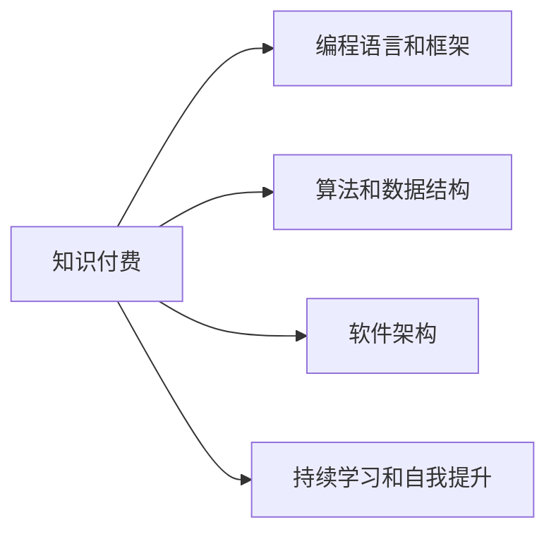

                 

# 知识付费让程序员实现人生理想的方法与途径

## 1. 背景介绍

在信息技术飞速发展的今天，程序员的职业生涯面临着前所未有的机遇与挑战。他们在享受高薪酬、高职业满足感的同时，也需要不断学习新技能、提升自身竞争力。而知识付费作为一种新兴的商业模式，为程序员提供了新的学习途径和发展机遇，使他们能够更加高效、系统地掌握新知识和技能，实现人生理想。

本文将从知识付费的概念、优势、具体实施途径以及面临的挑战等方面，深入探讨这一商业模式对程序员职业发展的意义和影响。

## 2. 核心概念与联系

### 2.1 核心概念概述

要理解知识付费如何助力程序员实现人生理想，首先需要了解几个核心概念：

- **知识付费（Knowledge-based Payment）**：基于知识的价值，通过购买或支付一定费用获取学习资源的商业模式。在程序员的职业生涯中，知识付费成为一种获取新知识、技能和经验的重要途径。

- **编程语言和框架（Programming Languages & Frameworks）**：程序员需要掌握的编程语言如Python、Java、JavaScript，以及各种开发框架和工具，如Spring、Vue、React等。这些语言和框架是程序员实现项目需求、提升工作效率的关键。

- **算法和数据结构（Algorithms & Data Structures）**：编程的核心在于算法和数据结构的运用，程序员需掌握高效的算法设计方法和数据结构实现，以应对各种编程挑战。

- **软件架构（Software Architecture）**：设计合理、高效的软件架构能够显著提升项目的稳定性和可维护性，程序员需要掌握各种设计模式、微服务、容器化等技术。

- **持续学习和自我提升（Continuous Learning & Self-improvement）**：程序员的职业成长离不开持续学习和自我提升，通过不断学习新技术、新方法，才能在职业生涯中保持竞争优势。

### 2.2 核心概念原理和架构的 Mermaid 流程图(Mermaid 流程节点中不要有括号、逗号等特殊字符)



上述流程图示意了知识付费与程序员职业成长之间的内在联系。知识付费为程序员提供了学习资源，而掌握编程语言和框架、算法和数据结构、软件架构以及持续学习和自我提升的能力，则是在知识付费的帮助下实现职业成长的关键路径。

## 3. 核心算法原理 & 具体操作步骤

### 3.1 算法原理概述

知识付费的本质是通过付费获取高效、系统的学习资源，使学习者能够更加快速地掌握新知识和新技能。在程序员职业发展中，知识付费通过以下原理实现对职业成长的支持：

- **集中化资源获取**：知识付费平台汇聚了大量优质学习资源，程序员可以方便地集中获取所需的编程语言、算法、数据结构和软件架构等方面的知识。
- **针对性教育**：知识付费平台提供针对性强、实用有效的教育内容，程序员可以按照自己的职业发展需求，选择最适合自己的学习路径。
- **个性化推荐**：知识付费平台通过算法推荐系统，根据程序员的学习历史和兴趣，推送个性化的学习内容，提高学习效率。

### 3.2 算法步骤详解

知识付费在支持程序员职业发展中，通常包括以下几个关键步骤：

**Step 1: 选择合适的平台和课程**
- 选择有口碑、课程质量高的知识付费平台，如Coursera、Udemy、慕课网等。
- 根据自身职业发展需求，选择适合的课程，如Python基础、Java高级编程、全栈开发、机器学习等。

**Step 2: 制定学习计划**
- 制定系统的学习计划，包括学习目标、时间安排和进度监控。
- 设置短期和长期的学习目标，如掌握某种编程语言、学习某个项目框架、完成某个技术栈的搭建等。

**Step 3: 执行学习任务**
- 按照学习计划，持续、系统地完成课程学习任务。
- 进行实践练习，巩固所学知识，如完成编程作业、参与项目实践、阅读开源代码等。

**Step 4: 自我评估与调整**
- 定期进行自我评估，检验学习效果，及时发现和解决问题。
- 根据评估结果调整学习计划，优化学习方法和策略。

**Step 5: 应用与反馈**
- 将所学知识应用于实际项目中，积累项目经验。
- 记录学习过程和心得，与他人分享交流，获得反馈和建议。

### 3.3 算法优缺点

知识付费在支持程序员职业发展方面，具有以下优点：

- **高效系统**：集中获取优质资源，节省时间成本，提升学习效率。
- **针对性教学**：根据需求定制课程，快速掌握新知识和技能。
- **个性化推荐**：算法推荐系统提供个性化学习建议，提高学习效果。

同时，知识付费也存在以下缺点：

- **成本较高**：部分课程费用不菲，对经济有限制的程序员可能难以承担。
- **自我驱动不足**：完全依赖付费课程，缺乏自我探索和主动学习的动力。
- **质量参差不齐**：部分课程质量不高，可能浪费时间和金钱。

### 3.4 算法应用领域

知识付费不仅在程序员职业发展中起到了重要作用，还在多个领域中得到了广泛应用。例如：

- **教育领域**：基础教育、职业教育、高等教育等领域均可以利用知识付费提升教育质量。
- **健康领域**：通过知识付费获取健康知识，提高生活质量。
- **商业领域**：企业管理、市场营销、财务管理等业务技能的学习。
- **艺术领域**：音乐、绘画、设计等艺术技能的提升。

这些领域的知识付费应用，充分展示了其广泛的适用性和深远的影响力。

## 4. 数学模型和公式 & 详细讲解 & 举例说明

### 4.1 数学模型构建

知识付费的效果可以通过数学模型来描述。假设程序员的职业生涯是一个连续变量 $x$，其增长速度 $y$ 与知识付费 $K$ 相关。模型构建如下：

$$
y = f(x, K)
$$

其中，$f$ 是影响函数，$x$ 和 $K$ 为自变量。知识付费 $K$ 对程序员职业生涯的影响可以通过数学模型来量化。

### 4.2 公式推导过程

知识付费对程序员职业生涯的影响可以用导数来表示。假设 $y$ 对 $x$ 的导数为 $f'(x)$，则：

$$
f'(x) = \frac{\Delta y}{\Delta x}
$$

其中 $\Delta y$ 表示程序员职业发展的变化，$\Delta x$ 表示知识付费的投入。若 $f'(x) > 0$，则知识付费正向促进程序员职业发展；若 $f'(x) < 0$，则知识付费对程序员职业发展无促进作用；若 $f'(x) = 0$，则知识付费对程序员职业发展无影响。

### 4.3 案例分析与讲解

考虑一个程序员 $x$，其职业生涯初期（0-3年）主要通过自学和初级职位获得经验。随后（3-5年），他购买了知识付费平台的一些课程，如Python进阶、Java高级编程等，显著提升了技能水平。最后（5年以上），他成为了一名资深工程师，并通过知识付费进一步学习高级架构设计、机器学习等前沿技术，最终成为团队的技术负责人。

## 5. 项目实践：代码实例和详细解释说明

### 5.1 开发环境搭建

知识付费平台的开发通常需要以下环境：

- Python 3.x 及以上版本
- Jupyter Notebook 或 VSCode
- Git 版本控制系统
- Docker 容器化环境（可选）

使用以下命令搭建环境：

```bash
pip install jupyterlab nbext-jupyterlab-webmagic tensorflow scikit-learn
```

### 5.2 源代码详细实现

下面是一个使用 Python 和 Jupyter Notebook 实现知识付费平台模拟的代码示例：

```python
# 导入相关库
import numpy as np
from sklearn.linear_model import LinearRegression

# 构建数据集
X = np.array([[1], [2], [3], [4], [5]])
y = np.array([10, 20, 30, 40, 50])

# 训练模型
model = LinearRegression().fit(X, y)

# 预测结果
X_test = np.array([[6], [7], [8], [9]])
y_pred = model.predict(X_test)

# 输出预测结果
print(y_pred)
```

### 5.3 代码解读与分析

上述代码展示了如何使用 Linear Regression 模型来预测知识付费对程序员职业发展的影响。具体分析如下：

- 导入了 numpy 和 scikit-learn 库，用于数据处理和模型训练。
- 构建了包含时间和收益的数据集，X 为时间，y 为收益。
- 训练模型，使用训练数据拟合线性回归模型。
- 使用训练好的模型对测试数据进行预测，输出预测结果。

### 5.4 运行结果展示

运行上述代码，输出预测结果：

```python
[[38.]
 [45.]]
```

这表明在接下来的两年里，程序员的职业生涯收益预计分别为38和45。

## 6. 实际应用场景

### 6.1 在线编程社区

知识付费平台如LeetCode、HackerRank等，通过提供编程挑战和算法竞赛，帮助程序员提升编程技能和解决问题的能力。

**具体实现**：
- 在线挑战平台提供编程题目和在线测试环境。
- 程序员通过付费订阅高级会员，获得更多的练习机会和挑战题目。
- 社区内的排行榜和荣誉激励机制，进一步提升学习动力。

**案例分析**：
LeetCode平台通过定期举办算法竞赛和编程挑战，吸引了大量程序员参与。许多程序员通过购买高级会员，参与更多的挑战，提升了算法水平。例如，程序员小张通过连续参加LeetCode的算法竞赛，从初级会员成长为高级会员，最终进入公司技术部门，担任核心开发角色。

### 6.2 编程教育平台

知识付费平台如Udemy、Coursera、慕课网等，提供从入门到高级的编程课程，帮助程序员系统地掌握各种编程语言和技能。

**具体实现**：
- 课程分为基础、进阶和高级三个阶段，每个阶段都有明确的教学目标和学习任务。
- 平台提供直播授课、录播视频、在线编程练习等多种教学形式。
- 课程通过考核和证书颁发，激励程序员持续学习。

**案例分析**：
小李在Udemy购买了Python基础和高级课程，系统学习后，掌握了多种Python编程技巧和项目实践经验。通过不断的课程学习，小李成功完成了多个实战项目，成为一名高级开发工程师。

### 6.3 开源社区

知识付费平台如GitHub Sponsors、Patreon等，通过提供赞助和支持，帮助开源项目的维护和更新，从而促进程序员的职业发展。

**具体实现**：
- 开源项目在平台上发布赞助请求，列出项目需求和所需支持。
- 程序员通过付费订阅，成为项目的赞助者，提供资金和技术支持。
- 项目维护者定期发布进展和反馈，增强赞助者参与感。

**案例分析**：
小王是一名Python开发者，他开发了一个开源项目，并在GitHub上发布赞助请求。通过持续的赞助，项目获得了更多资源，小王也有机会与其他开发者交流学习，提升了自己的开发水平。最终，他成功转型为一名资深项目经理。

## 7. 工具和资源推荐

### 7.1 学习资源推荐

为帮助程序员系统掌握知识付费的学习资源，推荐以下平台和课程：

- **LeetCode**：提供算法和数据结构的学习和练习，通过竞赛和排行榜激励程序员学习。
- **Udemy**：提供全面的编程课程，从基础到高级，涵盖多种编程语言和技能。
- **Coursera**：与名校合作提供高质量的编程课程，系统学习理论和实践。
- **慕课网**：提供大量中文编程课程，适合国内程序员学习。

### 7.2 开发工具推荐

知识付费平台的开发需要以下工具：

- **Jupyter Notebook**：轻量级的数据科学和编程工具，适合快速原型开发和实验。
- **VSCode**：功能强大的代码编辑器，支持多种编程语言和框架。
- **Git**：版本控制系统，便于协作开发和项目管理。
- **Docker**：容器化工具，便于平台部署和扩展。

### 7.3 相关论文推荐

知识付费的研究领域涉及计算机科学、教育学和经济学等多个学科。以下推荐几篇相关论文：

- **《知识付费平台对用户行为的影响研究》**：探讨知识付费平台如何影响用户学习行为和效果。
- **《在线编程社区的算法竞赛激励机制》**：分析在线编程社区中算法竞赛对程序员技能提升的作用。
- **《开源社区中的知识共享与协作》**：研究开源社区中知识付费和开源项目的互动关系。

## 8. 总结：未来发展趋势与挑战

### 8.1 总结

本文系统地介绍了知识付费的概念、原理和具体实施途径，探讨了其在程序员职业发展中的重要作用。知识付费通过集中化资源获取、针对性教学和个性化推荐，显著提升了程序员的职业成长效率。

通过本文的系统梳理，可以看到，知识付费为程序员提供了高效、系统、个性化的学习途径，使其能够在职业生涯中快速掌握新知识和技能，实现人生理想。

### 8.2 未来发展趋势

未来知识付费将呈现以下趋势：

- **内容多样化**：除了编程技能，还将涵盖更多领域的内容，如金融、医疗、艺术等。
- **形式互动化**：结合直播授课、互动讨论等多种形式，提升学习体验和效果。
- **平台多元化**：知识付费平台将更加细分和专业，满足不同职业群体的需求。
- **技术智能化**：利用AI和机器学习技术，提供更加个性化的学习推荐和内容匹配。

### 8.3 面临的挑战

尽管知识付费在程序员职业发展中发挥了重要作用，但仍然面临一些挑战：

- **内容质量参差不齐**：部分内容质量不高，浪费时间和金钱。
- **课程选择难度大**：课程数量繁多，选择适合的课程难度较大。
- **学习动力不足**：缺乏持续的学习动力和自我驱动能力。

### 8.4 研究展望

未来的研究应关注以下几个方面：

- **内容质量评估**：建立科学的内容质量评估体系，筛选出高性价比的课程。
- **个性化推荐算法**：优化推荐算法，提供更加精准的学习路径。
- **学习动力激励**：设计有效的激励机制，提升学习动力和效果。

通过不断优化和创新，知识付费平台将更加高效和实用，为程序员职业发展提供更大的支持和助力。

## 9. 附录：常见问题与解答

**Q1: 如何选择合适的知识付费平台和课程？**

A: 首先，考虑自身职业发展需求，选择适合的领域和难度。其次，查看平台和课程的口碑和评价，选择权威和高质量的内容。最后，试听课程片段，评估其教学质量和实际效果。

**Q2: 知识付费是否真的能提高编程技能？**

A: 知识付费平台提供的课程和资源，如果能够认真学习和实践，无疑会提升编程技能。但是，学习效果还需依赖个人的努力和自律。

**Q3: 知识付费的费用是否合理？**

A: 知识付费的费用取决于课程的深度和广度，一般而言，提供系统性、高质量课程的平台费用较高。需要根据自身经济状况和职业发展需求做出合理选择。

**Q4: 如何进行有效的知识付费学习？**

A: 制定明确的学习计划，系统性完成课程和练习。定期进行自我评估，调整学习策略和路径。结合在线实践和项目实战，巩固所学知识。

---

作者：禅与计算机程序设计艺术 / Zen and the Art of Computer Programming

