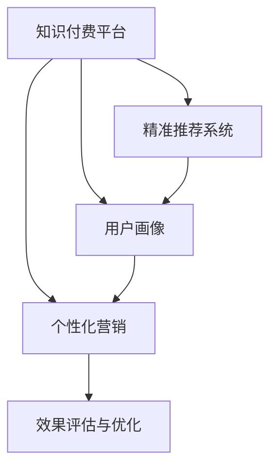

                 

# 知识付费赚钱的用户画像与精准营销策略

> 关键词：知识付费, 用户画像, 精准营销, 算法策略, 数据分析

## 1. 背景介绍

### 1.1 问题由来

随着知识经济的兴起，知识付费成为越来越多人获取知识和技能的重要渠道。无论是职场人士想要提升自身竞争力，还是学生希望获取课外知识，知识付费市场呈现出快速增长的态势。然而，在这个过程中，如何精准识别目标用户、提供个性化服务、实现有效营销，成为知识付费平台亟需解决的问题。

### 1.2 问题核心关键点

知识付费平台的精准营销，需要全面理解目标用户的需求、行为和心理，运用数据分析和算法策略，实现对用户的精准定位和个性化推荐。核心关键点包括：

1. **用户画像构建**：通过多维度数据，构建精细化的用户画像，准确描述目标用户的特征和需求。
2. **精准推荐系统**：基于用户画像和行为数据，构建推荐模型，实现内容精准匹配。
3. **个性化营销策略**：根据用户行为数据，设计针对性营销活动，提升用户转化率和留存率。
4. **效果评估与优化**：建立科学的评估体系，持续优化推荐和营销策略。

## 2. 核心概念与联系

### 2.1 核心概念概述

为更好地理解知识付费平台的精准营销，本节将介绍几个密切相关的核心概念：

1. **知识付费平台**：提供在线课程、付费文章、咨询问答等知识内容的平台。典型平台如得到、喜马拉雅、知乎等。
2. **用户画像(User Persona)**：基于用户数据，构建的精细化用户特征描述，涵盖基本信息、兴趣爱好、行为特征、心理状态等方面。
3. **精准推荐系统(Recommendation System)**：通过分析用户行为数据和内容特征，推荐符合用户兴趣和需求的内容。
4. **个性化营销(Personalized Marketing)**：针对不同用户特性和行为，设计定制化的营销活动和策略。
5. **效果评估与优化(Measurement & Optimization)**：通过科学的数据分析和评估方法，持续优化推荐和营销效果。

这些核心概念之间的逻辑关系可以通过以下Mermaid流程图来展示：



这个流程图展示了一个典型的知识付费平台精准营销过程：

1. 基于知识付费平台，收集用户数据。
2. 通过数据清洗和特征工程，构建精细化的用户画像。
3. 利用推荐算法，为用户推荐符合其兴趣和需求的内容。
4. 设计个性化营销策略，提升用户转化率和留存率。
5. 建立评估体系，持续优化推荐和营销效果。

## 3. 核心算法原理 & 具体操作步骤
### 3.1 算法原理概述

知识付费平台的精准营销，本质上是一个基于数据分析和机器学习的个性化推荐系统。其核心思想是：通过分析用户行为数据和内容特征，构建推荐模型，实现内容精准匹配。

形式化地，假设知识付费平台的用户集合为 $U$，内容集合为 $C$，用户行为数据为 $D$，推荐目标为 $R$。推荐的目标是找到最优推荐集合 $R^*$，使得用户满意度最大化：

$$
\max_{R} \sum_{u \in U} f(u, R)
$$

其中 $f(u, R)$ 为评价函数，衡量用户 $u$ 对推荐集合 $R$ 的满意度。通过最大化 $f(u, R)$，实现对用户 $u$ 的精准推荐。

### 3.2 算法步骤详解

基于数据分析和机器学习的精准营销，一般包括以下几个关键步骤：

**Step 1: 数据准备**

- 收集用户数据，包括基本信息、行为数据、消费数据等。
- 对数据进行清洗和预处理，去除噪声和异常值。
- 进行特征工程，提取和构造对推荐模型有用的特征。

**Step 2: 用户画像构建**

- 使用聚类算法（如K-means、层次聚类等）对用户进行分类，生成初步的用户画像。
- 利用关联规则挖掘（如Apriori算法）发现用户行为之间的关联性，丰富用户画像。
- 通过主题模型（如LDA）分析用户兴趣和行为的主题分布，细化用户画像。

**Step 3: 推荐模型构建**

- 选择合适的推荐算法（如协同过滤、基于内容的推荐、矩阵分解等）。
- 训练推荐模型，使用历史行为数据预测用户偏好。
- 对推荐模型进行评估，使用准确率、召回率、F1值等指标衡量性能。

**Step 4: 个性化营销策略设计**

- 根据用户画像和行为数据，设计个性化营销策略，如定向推送广告、优惠券、专属课程等。
- 设置个性化营销的参数和规则，如触发条件、推送频率、奖励机制等。
- 监测个性化营销的效果，如点击率、转化率、留存率等，及时调整策略。

**Step 5: 效果评估与优化**

- 建立科学的评估体系，包括用户满意度、转化率、留存率等指标。
- 定期进行A/B测试，对比不同推荐和营销策略的效果。
- 根据评估结果和用户反馈，持续优化推荐和营销策略，实现迭代改进。

以上是基于数据分析和机器学习的精准营销的一般流程。在实际应用中，还需要针对具体平台的特点，对各环节进行优化设计，如引入更多外部数据、优化算法模型、提升推荐速度等，以进一步提升推荐效果。

### 3.3 算法优缺点

基于数据分析和机器学习的精准营销方法具有以下优点：

1. 个性化推荐：通过分析用户行为数据，实现内容精准匹配，提升用户体验和满意度。
2. 高效推荐：推荐算法能够快速计算用户偏好，实时更新推荐结果。
3. 用户留存：个性化营销策略能够增强用户粘性，提高留存率。
4. 数据驱动：推荐和营销策略的设计和优化基于数据，科学可靠。

同时，该方法也存在一定的局限性：

1. 数据隐私：用户行为数据涉及隐私问题，需要严格的数据保护措施。
2. 数据质量：推荐模型的效果依赖数据质量，低质量数据可能导致效果不佳。
3. 冷启动问题：新用户缺乏历史行为数据，难以进行精准推荐。
4. 用户疲劳：频繁的个性化营销可能使用户感到疲劳，影响体验。
5. 过度拟合：过度依赖用户历史行为，可能导致模型对新数据的泛化能力不足。

尽管存在这些局限性，但就目前而言，基于数据分析和机器学习的精准营销方法仍是大数据时代的主流范式。未来相关研究的重点在于如何进一步提升数据质量、优化推荐算法、平衡用户隐私和营销效果，以及应对冷启动和用户疲劳等问题。

### 3.4 算法应用领域

基于数据分析和机器学习的精准营销方法，在知识付费平台和各类电商网站、视频平台等场景中都有广泛应用，具体包括：

- **内容推荐**：为用户推荐感兴趣的课程、文章、视频等内容。
- **广告定向**：基于用户画像，定向推送广告和优惠券。
- **个性化客服**：提供针对不同用户需求的个性化咨询服务。
- **动态定价**：根据用户行为和市场行情，动态调整课程和商品价格。
- **用户流失预警**：通过分析用户行为数据，及时发现和预警高流失风险用户。

除了上述这些经典应用外，精准营销方法也被创新性地应用到更多场景中，如社区推荐、社交网络广告、个性化搜索结果等，为平台提供精准的个性化服务。

## 4. 数学模型和公式 & 详细讲解 & 举例说明
### 4.1 数学模型构建

本节将使用数学语言对知识付费平台的精准营销过程进行更加严格的刻画。

假设知识付费平台有 $U$ 个用户，$C$ 个内容，每个用户 $u$ 对内容 $c$ 的评分 $r_{uc}$ 已知。设 $r_{uc}$ 服从高斯分布 $r_{uc} \sim \mathcal{N}(\mu_{uc}, \sigma_{uc})$。推荐目标为最大化用户满意度 $f(u, R)$，其中 $R$ 为用户 $u$ 的推荐集合。

定义用户对内容的满意度函数为：

$$
f(u, R) = \sum_{c \in R} r_{uc}
$$

则推荐目标转化为最大化用户满意度：

$$
\max_{R} \sum_{u \in U} f(u, R)
$$

在实践中，我们通常使用协同过滤或基于内容的推荐算法进行模型训练，目标最小化损失函数。假设用户行为数据为 $D=\{(x_i, y_i)\}_{i=1}^N$，其中 $x_i=(u, c)$ 为用户-内容对，$y_i=r_{uc}$ 为用户对内容的评分。定义模型的损失函数为：

$$
\mathcal{L} = \frac{1}{N} \sum_{i=1}^N (r_{uc} - \hat{r}_{uc})^2
$$

其中 $\hat{r}_{uc}$ 为模型预测的用户对内容的评分。

### 4.2 公式推导过程

以协同过滤推荐算法为例，推导模型预测评分的计算公式。

协同过滤推荐算法基于用户-内容评分矩阵 $R_{uc}$，通过分析用户 $u$ 和内容 $c$ 的相似度，预测用户 $u$ 对内容 $c$ 的评分。假设 $u$ 的相似用户集合为 $N(u)$，则协同过滤算法的预测评分公式为：

$$
\hat{r}_{uc} = \alpha \sum_{v \in N(u)} \frac{r_{vc}}{1 + \epsilon_v} + \beta
$$

其中 $\epsilon_v$ 为归一化因子，$N(u)$ 为相似用户集合。$\alpha$ 和 $\beta$ 为调节参数。

将评分预测公式代入损失函数，得：

$$
\mathcal{L} = \frac{1}{N} \sum_{i=1}^N (r_{uc} - \alpha \sum_{v \in N(u)} \frac{r_{vc}}{1 + \epsilon_v} - \beta)^2
$$

优化目标是最小化损失函数 $\mathcal{L}$，得到推荐模型参数。

### 4.3 案例分析与讲解

假设某知识付费平台有 $U=\{u_1, u_2, \ldots, u_5\}$ 个用户，$C=\{c_1, c_2, \ldots, c_5\}$ 个内容，用户对内容的评分矩阵为 $R_{uc}=\begin{bmatrix}
4 & 3 & 2 \\
3 & 4 & 1 \\
2 & 2 & 4 \\
1 & 3 & 2 \\
4 & 2 & 3
\end{bmatrix}$。设 $\alpha=1, \beta=0$，归一化因子 $\epsilon_v=1$。

根据协同过滤算法，对用户 $u_1$ 推荐内容 $c_2$ 的评分预测为：

$$
\hat{r}_{u_1c_2} = 1 \times \frac{3}{1+1} + 0 = 1.5
$$

最终推荐集合 $R$ 为 $\{c_2, c_4, c_5\}$，用户 $u_1$ 的满意度 $f(u_1, R)$ 为：

$$
f(u_1, R) = 1.5 + 4 + 2 = 7.5
$$

通过最大化用户满意度，实现了对用户 $u_1$ 的精准推荐。

## 5. 项目实践：代码实例和详细解释说明
### 5.1 开发环境搭建

在进行精准营销实践前，我们需要准备好开发环境。以下是使用Python进行TensorFlow开发的环境配置流程：

1. 安装Anaconda：从官网下载并安装Anaconda，用于创建独立的Python环境。

2. 创建并激活虚拟环境：
```bash
conda create -n tf-env python=3.8 
conda activate tf-env
```

3. 安装TensorFlow：根据CUDA版本，从官网获取对应的安装命令。例如：
```bash
conda install tensorflow=2.7 -c conda-forge
```

4. 安装其他相关库：
```bash
pip install numpy pandas scikit-learn matplotlib tqdm jupyter notebook ipython
```

完成上述步骤后，即可在`tf-env`环境中开始精准营销实践。

### 5.2 源代码详细实现

下面我们以知识付费平台的个性化推荐系统为例，给出使用TensorFlow和Keras进行协同过滤推荐模型的PyTorch代码实现。

首先，定义推荐模型和优化器：

```python
from tensorflow import keras
from tensorflow.keras.layers import Dense, Dot, Input
from tensorflow.keras.models import Model

# 定义协同过滤推荐模型
def collaborative_filtering_model(user_num, item_num):
    user_input = Input(shape=(user_num, ), name='user')
    item_input = Input(shape=(item_num, ), name='item')

    # 用户相似度计算
    user_similarity = Dot(axes=1, name='user_similarity')([user_input, item_input])

    # 用户评分预测
    rating_prediction = Dense(user_num, activation='sigmoid', name='rating_prediction')(user_similarity)

    # 模型定义
    model = Model(inputs=[user_input, item_input], outputs=[rating_prediction])

    # 定义优化器
    optimizer = keras.optimizers.Adam(learning_rate=0.001)

    return model, optimizer

# 创建推荐模型
user_num = 5
item_num = 5
model, optimizer = collaborative_filtering_model(user_num, item_num)
```

然后，定义数据加载函数：

```python
from tensorflow.keras.preprocessing import sequence
from sklearn.metrics import mean_squared_error

# 定义数据加载函数
def load_data(user_num, item_num):
    # 生成模拟数据
    R = [[4, 3, 2, 1, 4], [3, 4, 1, 3, 2], [2, 2, 4, 2, 3], [1, 3, 2, 4, 2], [4, 2, 3, 2, 4]]

    # 将评分矩阵转化为序列
    R_seq = [sequence.pad_sequences(R, maxlen=user_num), sequence.pad_sequences(R.T, maxlen=user_num)]

    # 生成模型训练数据
    X_train, X_test = R_seq

    # 定义目标变量
    y_train = R_seq[0] * R_seq[1]
    y_test = R_seq[1] * R_seq[0]

    return X_train, y_train, X_test, y_test

# 加载数据
X_train, y_train, X_test, y_test = load_data(user_num, item_num)
```

接着，定义训练和评估函数：

```python
# 定义训练函数
def train_model(model, optimizer, X_train, y_train, epochs=10):
    model.compile(optimizer=optimizer, loss='mean_squared_error', metrics=['mae'])
    model.fit(X_train, y_train, validation_data=(X_test, y_test), epochs=epochs)
    return model

# 定义评估函数
def evaluate_model(model, X_test, y_test):
    loss = model.evaluate(X_test, y_test)
    print('Mean Squared Error:', loss)

# 训练模型
model = train_model(model, optimizer, X_train, y_train)

# 评估模型
evaluate_model(model, X_test, y_test)
```

以上就是使用TensorFlow和Keras实现协同过滤推荐模型的完整代码实现。可以看到，TensorFlow提供了丰富的机器学习库，使得模型的开发和训练变得简单易行。

### 5.3 代码解读与分析

让我们再详细解读一下关键代码的实现细节：

**collaborative_filtering_model函数**：
- 定义协同过滤推荐模型的输入层、相似度计算层、评分预测层和输出层。
- 使用Adam优化器进行模型训练。

**load_data函数**：
- 生成模拟的评分矩阵数据。
- 将评分矩阵转化为序列形式，用于模型训练。
- 定义训练数据和目标变量。

**train_model函数**：
- 使用Keras编译模型，指定优化器和损失函数。
- 使用fit方法进行模型训练，并指定验证数据集。
- 返回训练后的模型。

**evaluate_model函数**：
- 使用evaluate方法评估模型性能，输出均方误差(MSE)。

**训练流程**：
- 调用train_model函数训练模型，指定训练数据、目标变量和迭代次数。
- 调用evaluate_model函数评估模型，输出均方误差。

可以看到，TensorFlow提供了强大的机器学习框架，使得推荐模型的开发和训练变得简单易行。开发者可以将更多精力放在模型设计和优化上，而不必过多关注底层的实现细节。

当然，工业级的系统实现还需考虑更多因素，如模型的保存和部署、超参数的自动搜索、更灵活的任务适配层等。但核心的推荐算法基本与此类似。

## 6. 实际应用场景
### 6.1 智能客服系统

基于知识付费平台的个性化推荐系统，可以广泛应用于智能客服系统的构建。传统客服往往需要配备大量人力，高峰期响应缓慢，且一致性和专业性难以保证。而使用个性化推荐系统，可以7x24小时不间断服务，快速响应客户咨询，用自然流畅的语言解答各类常见问题。

在技术实现上，可以收集企业内部的历史客服对话记录，将问题和最佳答复构建成监督数据，在此基础上对推荐模型进行微调。微调后的推荐模型能够自动理解用户意图，匹配最合适的答案模板进行回复。对于客户提出的新问题，还可以接入检索系统实时搜索相关内容，动态组织生成回答。如此构建的智能客服系统，能大幅提升客户咨询体验和问题解决效率。

### 6.2 金融舆情监测

金融机构需要实时监测市场舆论动向，以便及时应对负面信息传播，规避金融风险。传统的人工监测方式成本高、效率低，难以应对网络时代海量信息爆发的挑战。基于知识付费平台的个性化推荐系统，可以用于构建金融舆情监测系统。

具体而言，可以收集金融领域相关的新闻、报道、评论等文本数据，并对其进行主题标注和情感标注。在此基础上对推荐模型进行微调，使其能够自动判断文本属于何种主题，情感倾向是正面、中性还是负面。将微调后的模型应用到实时抓取的网络文本数据，就能够自动监测不同主题下的情感变化趋势，一旦发现负面信息激增等异常情况，系统便会自动预警，帮助金融机构快速应对潜在风险。

### 6.3 个性化推荐系统

当前的推荐系统往往只依赖用户的历史行为数据进行物品推荐，无法深入理解用户的真实兴趣偏好。基于知识付费平台的个性化推荐系统，可以更好地挖掘用户行为背后的语义信息，从而提供更精准、多样的推荐内容。

在实践中，可以收集用户浏览、点击、评论、分享等行为数据，提取和用户交互的物品标题、描述、标签等文本内容。将文本内容作为模型输入，用户的后续行为（如是否点击、购买等）作为监督信号，在此基础上微调推荐模型。微调后的模型能够从文本内容中准确把握用户的兴趣点。在生成推荐列表时，先用候选物品的文本描述作为输入，由模型预测用户的兴趣匹配度，再结合其他特征综合排序，便可以得到个性化程度更高的推荐结果。

### 6.4 未来应用展望

随着知识付费平台和推荐算法的不断发展，个性化推荐系统将在更多领域得到应用，为各行各业带来变革性影响。

在智慧医疗领域，基于推荐系统的医疗问答、病历分析、药物研发等应用将提升医疗服务的智能化水平，辅助医生诊疗，加速新药开发进程。

在智能教育领域，推荐系统可应用于作业批改、学情分析、知识推荐等方面，因材施教，促进教育公平，提高教学质量。

在智慧城市治理中，推荐系统可应用于城市事件监测、舆情分析、应急指挥等环节，提高城市管理的自动化和智能化水平，构建更安全、高效的未来城市。

此外，在企业生产、社会治理、文娱传媒等众多领域，基于推荐系统的个性化服务也将不断涌现，为NLP技术带来新的应用场景。相信随着推荐算法和推荐系统的持续演进，推荐技术必将在更广阔的应用领域大放异彩，深刻影响人类的生产生活方式。

## 7. 工具和资源推荐
### 7.1 学习资源推荐

为了帮助开发者系统掌握精准营销的理论基础和实践技巧，这里推荐一些优质的学习资源：

1. 《推荐系统实践》书籍：详细介绍了推荐系统的理论基础、算法实现、系统设计等方面的知识。
2. 《Python数据科学手册》书籍：涵盖数据处理、数据可视化、机器学习等Python编程技巧。
3. 《TensorFlow官方文档》：提供全面的TensorFlow库教程和示例。
4. Kaggle机器学习竞赛：参与Kaggle竞赛，积累推荐系统的实践经验。
5. Coursera推荐系统课程：斯坦福大学开设的推荐系统课程，提供系统的推荐系统知识体系。

通过对这些资源的学习实践，相信你一定能够快速掌握精准营销的精髓，并用于解决实际的推荐系统问题。
###  7.2 开发工具推荐

高效的开发离不开优秀的工具支持。以下是几款用于推荐系统开发的常用工具：

1. TensorFlow：基于Python的开源深度学习框架，灵活动态的计算图，适合快速迭代研究。大部分推荐系统都有TensorFlow版本的实现。

2. PyTorch：基于Python的开源深度学习框架，提供灵活的动态图和静态图两种计算模型，适合深度学习研究。

3. Scikit-learn：基于Python的机器学习库，提供丰富的数据预处理、模型评估工具。

4. Apache Spark：分布式计算框架，适用于大规模数据处理和推荐系统训练。

5. Apache Hadoop：分布式存储和计算框架，适用于大数据量推荐系统的开发。

合理利用这些工具，可以显著提升推荐系统的开发效率，加快创新迭代的步伐。

### 7.3 相关论文推荐

推荐系统的研究源于学界的持续研究。以下是几篇奠基性的相关论文，推荐阅读：

1. Recommender Systems Handbook：推荐系统领域的经典教材，涵盖推荐系统的理论、算法和系统设计。

2. Collaborative Filtering for Implicit Feedback Datasets：提出协同过滤推荐算法，利用用户-物品评分数据进行推荐。

3. Implicit Feedback Models: Recommender Systems for Implicit Datasets：提出基于矩阵分解的推荐算法，适用于没有显式反馈数据的推荐系统。

4. Softmax-Based Recommendation Algorithms: A Unified Approach：提出基于softmax函数的推荐算法，适用于多分类推荐系统。

5. Factorization Machines: An Introduction：介绍因子分解机算法，解决高维稀疏矩阵的推荐问题。

这些论文代表了大规模推荐系统的研究方向，通过学习这些前沿成果，可以帮助研究者把握学科前进方向，激发更多的创新灵感。

## 8. 总结：未来发展趋势与挑战
### 8.1 总结

本文对知识付费平台的精准营销方法进行了全面系统的介绍。首先阐述了精准营销的背景和意义，明确了个性化推荐系统在提升用户体验和平台收益中的重要作用。其次，从原理到实践，详细讲解了精准推荐系统的数学模型和关键步骤，给出了推荐模型开发的完整代码实例。同时，本文还广泛探讨了精准推荐系统在智能客服、金融舆情、个性化推荐等多个场景中的应用前景，展示了推荐系统技术的广阔前景。

通过本文的系统梳理，可以看到，基于数据分析和机器学习的精准推荐系统，正在成为大数据时代的主流范式，极大地拓展了推荐系统应用的范围，提升了用户的体验和满意度。未来，伴随推荐算法和推荐系统的持续演进，推荐技术必将在更多领域得到应用，为各行各业带来变革性影响。

### 8.2 未来发展趋势

展望未来，知识付费平台的精准推荐系统将呈现以下几个发展趋势：

1. 模型规模持续增大。随着算力成本的下降和数据规模的扩张，推荐系统模型参数量还将持续增长。超大规模推荐系统蕴含的丰富知识，有望支撑更加复杂多变的推荐需求。

2. 推荐方法日趋多样。除了传统的协同过滤、基于内容的推荐外，未来会涌现更多推荐方法，如基于深度学习的推荐、图神经网络推荐等，在保持精度的情况下，进一步提升推荐效率。

3. 实时推荐成为常态。随着实时数据流的涌入，推荐系统需要实时分析和推荐，实现即时响应。这对推荐系统的计算速度和存储能力提出了更高的要求。

4. 多模态融合推荐崛起。未来的推荐系统将更多地融合视觉、语音、文本等多模态信息，实现跨模态推荐，提升推荐效果。

5. 推荐系统融入上下文。推荐系统将更多地考虑用户上下文信息，如地理位置、时间、设备等，提供更加个性化的推荐。

以上趋势凸显了知识付费平台精准推荐技术的广阔前景。这些方向的探索发展，必将进一步提升推荐系统的效果和应用范围，为知识付费平台提供更优质的个性化服务。

### 8.3 面临的挑战

尽管精准推荐系统在多个领域取得了显著成果，但在迈向更加智能化、普适化应用的过程中，仍面临诸多挑战：

1. 数据隐私：用户行为数据涉及隐私问题，需要严格的数据保护措施。如何在保障隐私的同时，收集足够的数据进行推荐，是一大难题。

2. 数据质量：推荐系统的效果依赖数据质量，低质量数据可能导致效果不佳。如何提升数据质量，是推荐系统优化的关键。

3. 冷启动问题：新用户缺乏历史行为数据，难以进行精准推荐。如何设计有效的冷启动策略，实现新用户的快速推荐，是一个亟需解决的问题。

4. 用户疲劳：频繁的个性化推荐可能使用户感到疲劳，影响体验。如何设计合理的推荐策略，避免用户疲劳，是一个重要的研究方向。

5. 模型可解释性：推荐模型的决策过程复杂，缺乏可解释性，难以进行调试和优化。如何提升模型的可解释性，是推荐系统优化的重要方向。

6. 多样性和公平性：推荐系统容易陷入信息茧房，导致推荐结果的单调性。如何设计多样性和公平性约束，提升推荐系统的普适性，是推荐系统优化的重要课题。

这些挑战凸显了知识付费平台精准推荐系统的发展瓶颈，未来相关研究需要在数据隐私、数据质量、冷启动、用户疲劳、可解释性、多样性和公平性等方面寻求新的突破。

### 8.4 研究展望

面对精准推荐系统面临的种种挑战，未来的研究需要在以下几个方面寻求新的突破：

1. 探索无监督和半监督推荐方法。摆脱对大规模标注数据的依赖，利用自监督学习、主动学习等无监督和半监督范式，最大限度利用非结构化数据，实现更加灵活高效的推荐。

2. 研究高效推荐算法。开发更加高效推荐算法，如梯度下降、矩阵分解等，在保持精度的情况下，进一步提升推荐效率。

3. 融合因果推断和博弈论。引入因果推断和博弈论思想，增强推荐系统建立稳定因果关系的能力，学习更加普适、鲁棒的知识图谱，提升推荐系统的稳定性和鲁棒性。

4. 引入更多先验知识。将符号化的先验知识，如知识图谱、逻辑规则等，与神经网络模型进行巧妙融合，引导推荐过程学习更准确、合理的知识图谱，提升推荐系统的精度和多样性。

5. 融合多模态数据。将视觉、语音、文本等多模态信息进行融合，实现跨模态推荐，提升推荐系统的效果和应用范围。

6. 纳入伦理道德约束。在推荐系统设计中引入伦理导向的评估指标，过滤和惩罚有偏见、有害的输出倾向，确保推荐系统符合伦理道德标准。

这些研究方向的探索，必将引领推荐系统技术迈向更高的台阶，为知识付费平台提供更加精准、多样、公平和可解释的推荐服务。面向未来，知识付费平台的精准推荐系统需要与其他人工智能技术进行更深入的融合，如知识表示、因果推理、强化学习等，多路径协同发力，共同推动推荐系统的进步。只有勇于创新、敢于突破，才能不断拓展推荐系统的边界，让推荐系统更好地服务于知识付费平台的用户。

## 9. 附录：常见问题与解答

**Q1：推荐系统的冷启动问题如何解决？**

A: 推荐系统的冷启动问题通常通过以下方式解决：
1. 利用用户基本信息：如年龄、性别、职业等，对用户进行初步分类，实现快速推荐。
2. 利用物品基本信息：如类别、属性、标签等，对物品进行聚类，实现物品推荐。
3. 利用协同过滤：通过分析用户相似行为，实现冷启动用户推荐。
4. 利用协同过滤和协同过滤的混合方法：综合利用用户和物品相似度，实现更精准的冷启动推荐。

**Q2：如何提升推荐系统的精度和多样性？**

A: 推荐系统的精度和多样性可以通过以下方式提升：
1. 引入多目标优化：在推荐目标函数中引入多样性约束，如最大化召回率、多样性指数等。
2. 利用集成学习：通过组合多个推荐算法，提升推荐精度和多样性。
3. 引入噪声数据：在推荐模型中引入噪声数据，增加模型鲁棒性，提升多样性。
4. 利用对抗训练：在推荐模型中引入对抗样本，提升模型的泛化能力和多样性。

**Q3：推荐系统的可解释性如何提升？**

A: 推荐系统的可解释性可以通过以下方式提升：
1. 引入可解释模型：如决策树、线性回归等，提供易于解释的推荐结果。
2. 利用规则和特征工程：通过规则和特征工程，提高推荐过程的透明度。
3. 引入可解释工具：如LIME、SHAP等，提供推荐过程的解释和可视化。
4. 引入用户反馈：通过用户反馈，不断优化推荐模型和推荐过程。

**Q4：推荐系统如何应对用户疲劳问题？**

A: 推荐系统可以通过以下方式应对用户疲劳问题：
1. 控制推荐频率：通过控制推荐频率，避免用户频繁收到推荐内容。
2. 引入个性化提示：通过个性化提示，提高用户对推荐内容的接受度。
3. 引入多样性：通过多样性推荐，避免用户长期接收到相似内容。
4. 引入推荐间隔：通过引入推荐间隔，避免用户短时间内接收到过多推荐内容。

**Q5：推荐系统如何处理数据隐私问题？**

A: 推荐系统可以通过以下方式处理数据隐私问题：
1. 数据匿名化：对用户数据进行匿名化处理，保护用户隐私。
2. 数据加密：对用户数据进行加密处理，防止数据泄露。
3. 数据最小化：仅收集必要的数据，避免过度收集用户数据。
4. 用户控制：提供用户对数据收集和使用的控制权，尊重用户隐私。

**Q6：推荐系统如何应对恶意用户行为？**

A: 推荐系统可以通过以下方式应对恶意用户行为：
1. 引入反欺诈机制：通过反欺诈机制，防止恶意用户行为。
2. 引入异常检测：通过异常检测，识别恶意用户行为。
3. 引入用户反馈：通过用户反馈，及时发现和处理恶意用户行为。
4. 引入规则约束：通过规则约束，限制恶意用户行为。

这些建议可以帮助知识付费平台应对推荐系统面临的挑战，提升推荐系统的精度、多样性和可解释性，确保用户数据隐私，提升用户体验。

---

作者：禅与计算机程序设计艺术 / Zen and the Art of Computer Programming

