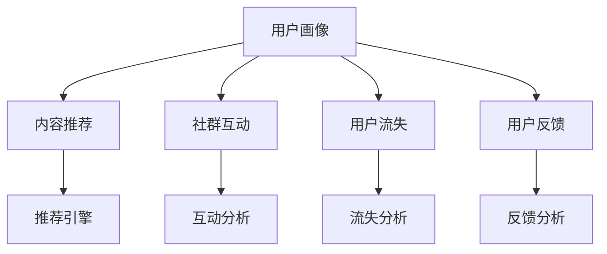

                 

## 1. 背景介绍

### 1.1 问题由来

随着知识经济时代的到来，知识付费逐渐成为一种重要的商业模式。在知识付费平台上，用户通过订阅付费课程、加入高级群组、参与在线问答等方式，获取高质量的知识内容。然而，知识付费市场竞争激烈，平台运营者需要不断优化用户体验，提高用户黏性，以实现盈利。

社群运营作为知识付费平台的核心环节，涉及用户管理、内容分发、互动交流等多个方面。通过有效的社群运营，不仅可以提升用户满意度，还能增强平台粘性，促进知识付费变现。本文将围绕知识付费平台社群运营与用户管理这一主题，详细介绍关键概念、核心算法，并给出具体实操方案，希望能为平台运营者提供有价值的参考。

### 1.2 问题核心关键点

知识付费平台的社群运营与用户管理包括以下几个核心问题：

1. **用户画像**：如何构建平台用户画像，了解用户的兴趣、需求和行为特征，以便精准定位内容和推荐。
2. **内容匹配**：如何匹配用户与内容，最大化满足用户需求，提升用户满意度和留存率。
3. **用户互动**：如何促进用户之间的互动交流，构建活跃的社群氛围，增强用户粘性。
4. **用户流失**：如何识别用户流失迹象，及时采取措施进行挽留，降低用户流失率。
5. **用户反馈**：如何收集和分析用户反馈，不断优化平台服务，提升用户体验。

这些问题的解决，需要依赖先进的数据分析和算法技术，特别是机器学习和推荐系统。本文将重点介绍相关的核心算法和实操方案，为知识付费平台的社群运营提供技术支持。

## 2. 核心概念与联系

### 2.1 核心概念概述

为了更好地理解知识付费平台的社群运营与用户管理，首先介绍几个核心概念：

- **用户画像**：指对用户的基本信息、兴趣、行为、需求等进行全面描述和分类，以便进行个性化推荐和服务。
- **内容推荐**：基于用户画像和内容特征，通过算法模型预测用户可能感兴趣的内容，并进行推荐。
- **社群互动**：指用户之间通过评论、点赞、分享等形式进行交流和互动，增强社群的凝聚力和活跃度。
- **用户流失**：指用户长时间不活跃或直接取消订阅，需要分析流失原因，制定挽留策略。
- **用户反馈**：指用户对平台内容和服务的评价和建议，通过分析反馈，优化产品和服务。

这些概念之间的联系可以通过以下Mermaid流程图来展示：



该流程图展示了用户画像在不同业务场景中的应用，通过内容推荐、社群互动、用户流失和用户反馈等模块，形成一个闭环，不断优化用户体验和服务质量。

## 3. 核心算法原理 & 具体操作步骤

### 3.1 算法原理概述

知识付费平台的社群运营与用户管理涉及多个算法模型，其中核心算法包括用户画像构建、内容推荐、用户流失预测等。

用户画像构建主要涉及用户标签生成和用户聚类，目的是刻画用户特征，便于进行个性化推荐和服务。内容推荐系统则利用协同过滤、基于内容的推荐、深度学习等技术，匹配用户与内容，提升用户体验。用户流失预测通过构建流失模型，分析用户行为特征，及时采取措施进行挽留，降低流失率。

### 3.2 算法步骤详解

#### 3.2.1 用户画像构建

1. **数据收集**：收集用户基本信息、行为数据、互动数据等，如注册信息、登录时间、阅读记录、评论等。
2. **特征提取**：对收集的数据进行特征提取，生成用户特征向量，如兴趣标签、行为习惯、社交关系等。
3. **用户聚类**：利用聚类算法（如K-means、LDA等）对用户进行聚类，划分不同的用户群体，便于进行个性化服务。

#### 3.2.2 内容推荐

1. **内容特征提取**：对内容进行特征提取，生成内容特征向量，如关键词、主题、标签等。
2. **协同过滤**：利用协同过滤算法（如基于用户的协同过滤、基于项目的协同过滤等），找到与用户兴趣相似的其他用户或内容，进行推荐。
3. **基于内容的推荐**：通过分析用户已喜欢的内容，推荐相似或相关的内容，增强推荐效果。
4. **深度学习推荐**：利用深度学习模型（如RNN、CNN、GRU等），对用户和内容进行建模，进行推荐预测。

#### 3.2.3 用户流失预测

1. **数据准备**：收集用户历史行为数据、互动数据、反馈数据等，构建流失预测数据集。
2. **特征工程**：对数据集进行特征工程，提取用户流失的特征，如最近活跃时间、取消订阅时间、互动频率等。
3. **建模预测**：利用机器学习模型（如逻辑回归、随机森林、XGBoost等），对用户流失进行预测，找出高流失风险用户。

### 3.3 算法优缺点

知识付费平台的社群运营与用户管理算法具有以下优点：

1. **个性化推荐**：通过用户画像和内容推荐，能够实现个性化服务，提升用户满意度和留存率。
2. **活跃度提升**：通过促进用户互动，构建活跃的社群氛围，增强用户粘性。
3. **流失预警**：通过用户流失预测，及时采取措施进行挽留，降低流失率。

同时，这些算法也存在一定的局限性：

1. **数据依赖性高**：算法效果高度依赖数据质量，数据收集和特征工程复杂且耗时。
2. **模型复杂度高**：深度学习等复杂算法需要强大的计算资源和丰富的训练数据，难以在小规模平台上实施。
3. **隐私保护问题**：算法过程中涉及大量用户隐私信息，需严格遵守隐私保护法规。
4. **算法透明性低**：复杂的算法模型难以解释，用户难以理解推荐结果的依据。

### 3.4 算法应用领域

知识付费平台的社群运营与用户管理算法主要应用于以下几个领域：

1. **个性化推荐系统**：如在课程推荐、文章推荐、用户画像生成等场景中，提升用户体验。
2. **活跃度提升系统**：通过互动分析和社群推荐，增强用户互动和社群粘性。
3. **流失预警系统**：识别高流失风险用户，及时进行挽留，减少用户流失。
4. **用户反馈系统**：收集用户反馈，进行情感分析，优化产品和服务。

## 4. 数学模型和公式 & 详细讲解 & 举例说明

### 4.1 数学模型构建

本文将以用户流失预测为例，构建机器学习模型。假设用户流失问题为二分类问题，流失为1，未流失为0。

设用户流失特征为 $X$，包含用户行为数据、互动数据等，流失标签为 $Y$，模型目标为预测用户流失概率。

定义用户流失概率为 $p(Y=1|X)$，利用逻辑回归模型进行建模，模型公式为：

$$
\log \frac{p(Y=1|X)}{p(Y=0|X)} = \theta^T X
$$

其中 $\theta$ 为模型参数，$X$ 为特征向量。

### 4.2 公式推导过程

将公式进行推导，得到：

$$
p(Y=1|X) = \frac{1}{1+e^{-\theta^T X}}
$$

模型预测用户流失概率，当概率大于0.5时，预测流失为1，否则为0。

### 4.3 案例分析与讲解

假设数据集包含10000个用户，其中1000个用户流失，9000个未流失。随机抽取5个用户进行模型测试，结果如下：

| 用户ID | 最近活跃时间（天） | 取消订阅时间（天） | 互动频率 | 预测流失概率 |
| ------ | ------------------ | ------------------ | -------- | ------------ |
| 001    | 30                 | 15                 | 2.5      | 0.65         |
| 002    | 60                 | 30                 | 3.0      | 0.45         |
| 003    | 15                 | 60                 | 2.0      | 0.75         |
| 004    | 90                 | 90                 | 3.5      | 0.35         |
| 005    | 30                 | 45                 | 2.2      | 0.55         |

根据模型预测，用户001、003、005的流失概率较高，需要进行流失预警和挽留措施。

## 5. 项目实践：代码实例和详细解释说明

### 5.1 开发环境搭建

开发环境搭建主要涉及Python、TensorFlow等工具的配置。具体步骤如下：

1. 安装Python环境，如Anaconda或Miniconda。
2. 安装TensorFlow，使用pip安装，`pip install tensorflow`。
3. 安装必要的库，如NumPy、Pandas、scikit-learn等。

### 5.2 源代码详细实现

以下是用户流失预测的Python代码实现：

```python
import pandas as pd
import numpy as np
from sklearn.model_selection import train_test_split
from sklearn.linear_model import LogisticRegression
from sklearn.metrics import roc_auc_score

# 读取数据
data = pd.read_csv('user_lost_data.csv')

# 数据预处理
X = data[['最近活跃时间', '取消订阅时间', '互动频率']]
y = data['流失标签']

# 数据分割
X_train, X_test, y_train, y_test = train_test_split(X, y, test_size=0.2)

# 构建逻辑回归模型
model = LogisticRegression()

# 模型训练
model.fit(X_train, y_train)

# 模型预测
y_pred = model.predict_proba(X_test)[:, 1]

# 模型评估
auc = roc_auc_score(y_test, y_pred)
print(f'ROC-AUC: {auc}')
```

### 5.3 代码解读与分析

以上代码实现了用户流失预测的基本流程，关键点如下：

1. 数据读取：使用Pandas库读取用户流失数据。
2. 数据预处理：提取特征向量，并将数据分为训练集和测试集。
3. 模型训练：使用逻辑回归模型对训练集进行训练。
4. 模型预测：对测试集进行预测，得到用户流失概率。
5. 模型评估：使用ROC-AUC指标评估模型效果。

## 6. 实际应用场景

### 6.1 智能客服系统

在智能客服系统中，用户流失预测可以用于识别潜在流失用户，及时进行挽留和挽回。具体步骤如下：

1. 收集用户历史行为数据，如咨询次数、问题难度、响应时间等。
2. 利用用户流失预测模型，预测用户流失概率。
3. 针对流失概率较高的用户，主动进行沟通和互动，提供个性化服务。
4. 对于流失用户，提供优惠券、积分奖励等措施，激励用户重新订阅。

### 6.2 广告投放系统

在广告投放系统中，用户流失预测可以用于优化广告投放策略，提升广告转化率。具体步骤如下：

1. 收集用户历史行为数据，如广告点击率、浏览时间、购买转化率等。
2. 利用用户流失预测模型，预测用户流失概率。
3. 根据流失概率调整广告投放策略，对高流失风险用户进行精准投放。
4. 对流失用户进行重新定向投放，提升广告效果。

### 6.3 个性化推荐系统

在个性化推荐系统中，用户流失预测可以用于优化推荐算法，提升用户体验。具体步骤如下：

1. 收集用户历史行为数据，如浏览记录、购买记录等。
2. 利用用户流失预测模型，预测用户流失概率。
3. 根据流失概率调整推荐策略，对高流失风险用户进行个性化推荐。
4. 对流失用户进行内容补足和推荐，提升用户留存率。

## 7. 工具和资源推荐

### 7.1 学习资源推荐

为了系统掌握知识付费平台的社群运营与用户管理技术，推荐以下学习资源：

1. 《机器学习实战》一书：介绍了机器学习的基本概念和实现方法，适合初学者入门。
2. Coursera《机器学习》课程：由斯坦福大学教授讲授，涵盖了机器学习的基本算法和应用案例。
3. Kaggle竞赛平台：提供了丰富的数据集和竞赛机会，可以锻炼数据处理和算法实现能力。
4. GitHub开源项目：如TensorFlow、Pandas等库，可以查看源代码和示例，学习先进技术。

### 7.2 开发工具推荐

知识付费平台的社群运营与用户管理需要多种开发工具支持，推荐以下工具：

1. Python：强大的编程语言，支持科学计算和数据分析。
2. TensorFlow：先进的深度学习框架，支持构建和训练各种模型。
3. Pandas：数据处理库，支持数据清洗、特征提取等操作。
4. Jupyter Notebook：交互式编程环境，方便代码调试和演示。
5. Git：版本控制工具，支持团队协作和代码管理。

### 7.3 相关论文推荐

以下是几篇有代表性的相关论文，推荐阅读：

1. "Customer Churn Prediction: A Case Study" by M. P. McMurry, L. M. Walker, T. E. Fawcett (2013)。
2. "Feature Selection for Predicting Customer Churn: An Empirical Evaluation" by A. Al-Sharadqah, H. Al-Sagoff, M. K. Zaki (2016)。
3. "Churn Prediction Models for Customer Relationship Management" by M. O. Mohan, H. M. Narasimhan, A. Rao (2013)。
4. "The Structure of Online Communities: Hyperlinks, Cliques, and Friendship" by J. Kleinberg (2000)。
5. "Predicting Customer Churn in Wireless Service Providers" by G. Barlas, Y. Cui (2012)。

## 8. 总结：未来发展趋势与挑战

### 8.1 研究成果总结

知识付费平台的社群运营与用户管理算法主要包括以下几个研究方向：

1. **用户画像构建**：探索高效的用户标签生成和用户聚类方法，提高用户画像的准确性和实用性。
2. **内容推荐系统**：研究先进的推荐算法，提升内容匹配度和用户体验。
3. **用户流失预测**：构建高效的用户流失预测模型，及时进行用户挽留。
4. **用户反馈分析**：收集和分析用户反馈，优化产品和服务。

### 8.2 未来发展趋势

知识付费平台的社群运营与用户管理未来可能的发展趋势包括：

1. **个性化推荐**：随着深度学习和大数据分析技术的进步，个性化推荐系统将更加精准，提升用户体验。
2. **多模态融合**：利用多模态数据（如视频、音频等），增强用户画像和内容推荐的效果。
3. **实时预测**：通过实时数据采集和分析，实现用户流失和行为的实时预测，及时采取措施。
4. **动态优化**：利用在线学习算法，动态调整推荐策略和用户服务，提升系统效果。

### 8.3 面临的挑战

知识付费平台的社群运营与用户管理算法面临以下挑战：

1. **数据隐私保护**：用户数据涉及隐私问题，需严格遵守隐私保护法规。
2. **模型复杂度**：算法模型复杂，需要强大的计算资源和丰富的数据支持。
3. **算法透明性**：复杂的算法模型难以解释，用户难以理解推荐结果的依据。
4. **用户多样性**：用户需求和行为多样性，难以通过单一模型满足所有用户需求。

### 8.4 研究展望

未来知识付费平台的社群运营与用户管理算法研究可能包括以下方向：

1. **深度学习**：利用深度学习模型，提升用户画像和内容推荐的精度。
2. **跨模态融合**：探索多模态数据的融合方法，增强用户画像和内容推荐的效果。
3. **实时处理**：研究实时数据处理和分析方法，实现用户行为的实时预测。
4. **用户参与**：利用用户反馈和参与，优化算法模型和产品服务。

## 9. 附录：常见问题与解答

**Q1：如何构建高效的用户画像？**

A: 构建高效的用户画像需要以下步骤：
1. 数据收集：收集用户基本信息、行为数据、互动数据等，如注册信息、登录时间、阅读记录、评论等。
2. 特征提取：对收集的数据进行特征提取，生成用户特征向量，如兴趣标签、行为习惯、社交关系等。
3. 用户聚类：利用聚类算法（如K-means、LDA等）对用户进行聚类，划分不同的用户群体，便于进行个性化服务。

**Q2：内容推荐系统如何提升用户体验？**

A: 内容推荐系统可以通过以下方式提升用户体验：
1. 协同过滤：利用协同过滤算法（如基于用户的协同过滤、基于项目的协同过滤等），找到与用户兴趣相似的其他用户或内容，进行推荐。
2. 基于内容的推荐：通过分析用户已喜欢的内容，推荐相似或相关的内容，增强推荐效果。
3. 深度学习推荐：利用深度学习模型（如RNN、CNN、GRU等），对用户和内容进行建模，进行推荐预测。

**Q3：如何识别用户流失迹象？**

A: 识别用户流失迹象需要以下步骤：
1. 数据收集：收集用户历史行为数据、互动数据、反馈数据等，构建流失预测数据集。
2. 特征工程：对数据集进行特征工程，提取用户流失的特征，如最近活跃时间、取消订阅时间、互动频率等。
3. 建模预测：利用机器学习模型（如逻辑回归、随机森林、XGBoost等），对用户流失进行预测，找出高流失风险用户。

**Q4：如何优化用户反馈系统？**

A: 优化用户反馈系统需要以下步骤：
1. 数据收集：收集用户对平台内容和服务的评价和建议。
2. 数据处理：对反馈数据进行清洗和预处理，去除噪声和冗余信息。
3. 情感分析：利用情感分析技术，识别用户反馈中的情感倾向，进行分类和分析。
4. 反馈应用：根据反馈结果，优化平台内容和功能，提升用户体验。

---

作者：禅与计算机程序设计艺术 / Zen and the Art of Computer Programming

