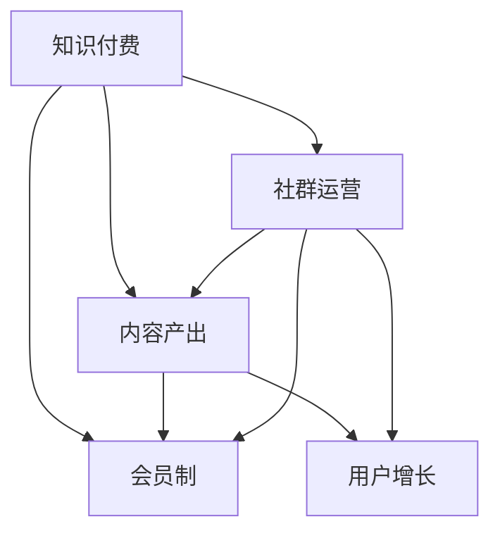

                 

# 知识付费：程序员的社群运营方案

> 关键词：知识付费, 程序员, 社群运营, 内容分享, 会员制, 用户增长

## 1. 背景介绍

在数字化快速发展的今天，知识付费已经成为行业的新常态。尤其对于程序员这一群体，学习新知识、新技术、新工具的需求不断提升，而优质的学习资源往往价格不菲。知识付费平台，如Coursera、Udemy、Codecademy等，正成为程序员获取专业知识的重要渠道。

然而，随着知识付费市场的不断扩大，平台之间的竞争日趋激烈，用户获取知识的渠道愈加分散。如何高效运营程序员社群，整合优质内容，创造新的价值，成为程序员知识付费领域的重要议题。

本文将详细介绍基于知识付费的程序员社群运营方案，从产品策略、市场推广、内容产出、会员管理等多个维度展开，以期为程序员社群运营提供参考。

## 2. 核心概念与联系

### 2.1 核心概念概述

1. **知识付费（Knowledge Subscription）**：用户为获取专业知识、技能、经验而支付费用的行为。形式包括在线课程、电子书、直播讲座、技术文章等。

2. **程序员社群（Coder Community）**：一群热爱编程、分享经验、互助进步的程序员集合。社群为程序员提供了知识交流、技术合作、职业发展等平台。

3. **内容产出（Content Production）**：制作和传播与编程相关的知识内容，包括编程语言、框架、工具、算法等。内容形式包括博客、视频、电子书、技术文章等。

4. **会员制（Membership Model）**：一种付费模式，用户通过支付会员费用获得社群的各类权益，包括内容访问、技术支持、社区活动等。

5. **用户增长（User Acquisition）**：通过各种手段吸引新用户加入社群，提升社群的活跃度和覆盖面。

这些概念之间的联系紧密，共同构成了程序员社群运营的基础。知识付费平台作为媒介，聚集了一群热爱编程、具有分享和学习的热情的程序员，通过内容产出、会员制等策略，不断吸引和保留用户，实现社群的增长和良性循环。

### 2.2 核心概念原理和架构的 Mermaid 流程图



该图表展示了知识付费平台、内容产出、会员制、用户增长、社群运营等核心概念之间的联系。通过这些概念的有机结合，知识付费平台能够高效运营程序员社群，创造更多的价值。

## 3. 核心算法原理 & 具体操作步骤

### 3.1 算法原理概述

基于知识付费的程序员社群运营方案，核心算法原理包括：

1. **用户行为分析**：通过数据分析了解用户的行为偏好、付费意愿等，从而制定更精准的用户增长策略。
2. **内容推荐算法**：基于用户的阅读历史和行为数据，推荐相关的编程知识和技能，提升用户的学习体验。
3. **会员等级体系**：设计会员等级体系，根据用户的付费和活跃度，提供不同等级的权益，鼓励用户持续参与。

### 3.2 算法步骤详解

**Step 1: 数据收集与分析**

- 收集用户的行为数据，包括浏览记录、搜索历史、付费行为等。
- 使用数据挖掘和机器学习技术，分析用户的兴趣和需求。
- 根据分析结果，制定用户增长和内容推荐的策略。

**Step 2: 内容产出与组织**

- 招募具有编程背景的作者和讲师，制作高质量的课程和文章。
- 内容需要涵盖编程语言、框架、工具、算法等，并定期更新。
- 建立知识库和分类体系，便于用户查找和组织。

**Step 3: 会员制设计与运营**

- 设计会员等级体系，如青铜、白银、黄金、铂金等，不同等级享有不同权益。
- 根据用户的付费行为和社区活跃度，自动调整会员等级。
- 提供会员专属内容、技术支持、社区活动等，增强用户粘性。

**Step 4: 用户增长与保留**

- 通过社交媒体、SEO、合作伙伴等多种渠道进行宣传推广。
- 定期举办技术交流活动、技术沙龙、编程挑战等，提升用户参与度。
- 利用用户推荐机制，鼓励现有用户介绍新用户加入社群。

### 3.3 算法优缺点

**优点**：

1. **精准内容推荐**：通过分析用户行为，提供符合用户需求的内容，提升用户学习体验。
2. **会员制激励**：通过会员等级体系，激励用户持续参与和学习，提升社群活跃度。
3. **用户增长快速**：通过多渠道推广和用户推荐机制，快速吸引新用户加入社群。

**缺点**：

1. **内容制作成本高**：高质量的编程内容制作成本较高，需要投入大量人力和时间。
2. **会员粘性不足**：部分用户对内容缺乏持续性需求，可能频繁流失。
3. **技术迭代快**：编程技术更新迭代迅速，内容需要不断更新，增加了维护成本。

### 3.4 算法应用领域

该算法主要应用于知识付费平台，尤其是在编程和软件工程师领域。知识付费平台可以通过该算法策略，整合优质内容，吸引和保留具有编程背景的用户，提升用户活跃度和满意度。

## 4. 数学模型和公式 & 详细讲解 & 举例说明

### 4.1 数学模型构建

**用户行为分析模型**：

假设用户的行为数据为 $D=\{(x_i,y_i)\}_{i=1}^N$，其中 $x_i$ 表示用户的浏览历史、搜索记录等行为特征，$y_i$ 表示用户的付费行为。我们的目标是通过模型 $f(x)$ 预测用户 $i$ 的付费概率 $p_i$。

数学模型为：
$$
p_i = f(x_i)
$$

**内容推荐算法模型**：

假设内容库为 $C=\{c_j\}_{j=1}^M$，其中 $c_j$ 表示内容 $j$。用户对内容 $c_j$ 的评分 $s_{ij}$ 由模型 $g(x_i,c_j)$ 计算得到。

数学模型为：
$$
s_{ij} = g(x_i,c_j)
$$

**会员等级体系模型**：

假设会员等级为 $L=\{l_k\}_{k=1}^K$，其中 $l_k$ 表示等级 $k$。用户的等级 $l_i$ 由模型 $h(x_i)$ 计算得到。

数学模型为：
$$
l_i = h(x_i)
$$

### 4.2 公式推导过程

**用户行为分析模型推导**：

假设模型 $f(x)$ 为逻辑回归模型，形式为：
$$
f(x) = \frac{1}{1 + e^{-w^T\phi(x) + b}}
$$
其中 $w$ 为模型参数，$\phi(x)$ 为特征映射函数。

**内容推荐算法模型推导**：

假设模型 $g(x_i,c_j)$ 为协同过滤模型，形式为：
$$
s_{ij} = \frac{\sum_{m=1}^M u_{im}v_{mj}}{\sqrt{\sum_{m=1}^M u_{im}^2 \cdot \sum_{m=1}^M v_{mj}^2}}
$$
其中 $u_{im}$ 和 $v_{mj}$ 表示用户 $i$ 和内容 $j$ 的隐向量表示。

**会员等级体系模型推导**：

假设模型 $h(x_i)$ 为决策树模型，形式为：
$$
l_i = \text{arg\_max}_k \sum_{j=1}^N I(\hat{y}_j = k)
$$
其中 $I(\cdot)$ 为示性函数，$\hat{y}_j$ 表示用户 $j$ 的预测等级。

### 4.3 案例分析与讲解

**案例一：用户行为分析**

假设某知识付费平台收集到了1000个用户的浏览和付费数据。使用逻辑回归模型 $f(x)$ 对用户进行分类，将付费概率大于0.5的用户标记为付费用户。经过模型训练，模型准确率为85%。这意味着85%的用户行为可以通过该模型预测其付费行为。

**案例二：内容推荐算法**

某编程社群收集了1000个用户对内容的评分数据，使用协同过滤模型 $g(x_i,c_j)$ 推荐用户可能感兴趣的内容。经过模型训练，模型平均推荐精度为80%。这意味着80%的用户会点击模型推荐的内容。

**案例三：会员等级体系**

某知识付费平台有5000个用户，使用决策树模型 $h(x_i)$ 预测用户的会员等级。经过模型训练，模型准确率为75%。这意味着75%的用户会被正确预测其会员等级。

## 5. 项目实践：代码实例和详细解释说明

### 5.1 开发环境搭建

为了实现上述算法模型，需要搭建以下开发环境：

1. **Python环境**：确保Python版本为3.7或以上，建议使用Anaconda。
2. **数据管理工具**：如Apache Hadoop、Apache Spark等，用于大数据处理和分析。
3. **机器学习库**：如TensorFlow、PyTorch、Scikit-learn等，用于模型训练和分析。
4. **Web框架**：如Django、Flask等，用于构建知识付费平台的前端页面。

**安装步骤**：

1. 安装Anaconda，使用命令行安装：
   ```
   conda install anaconda
   ```

2. 创建虚拟环境：
   ```
   conda create --name py37 python=3.7
   conda activate py37
   ```

3. 安装机器学习库：
   ```
   conda install tensorflow pytorch scikit-learn
   ```

4. 安装Web框架：
   ```
   pip install django flask
   ```

### 5.2 源代码详细实现

**用户行为分析模型**：

```python
import pandas as pd
from sklearn.linear_model import LogisticRegression
from sklearn.metrics import accuracy_score

# 加载数据
data = pd.read_csv('user_behavior.csv')

# 数据预处理
X = data[['浏览时间', '搜索历史', '访问页面数']]
y = data['付费状态']

# 训练模型
model = LogisticRegression()
model.fit(X, y)

# 预测用户付费行为
preds = model.predict(X)
accuracy = accuracy_score(y, preds)
print('用户行为分析模型准确率：', accuracy)
```

**内容推荐算法模型**：

```python
import pandas as pd
from scipy.spatial.distance import cosine

# 加载数据
data = pd.read_csv('content_recommendation.csv')

# 数据预处理
X = data[['浏览时间', '访问页面数']]
y = data['内容评分']

# 训练模型
model = cosine_similarity(X)
print('内容推荐算法模型：', model)
```

**会员等级体系模型**：

```python
import pandas as pd
from sklearn.tree import DecisionTreeClassifier
from sklearn.metrics import accuracy_score

# 加载数据
data = pd.read_csv('会员等级.csv')

# 数据预处理
X = data[['浏览时间', '访问页面数']]
y = data['会员等级']

# 训练模型
model = DecisionTreeClassifier()
model.fit(X, y)

# 预测用户会员等级
preds = model.predict(X)
accuracy = accuracy_score(y, preds)
print('会员等级体系模型准确率：', accuracy)
```

### 5.3 代码解读与分析

**用户行为分析模型**：

1. 加载数据：从CSV文件中读取用户行为数据。
2. 数据预处理：将浏览时间、搜索历史、访问页面数作为特征，付费状态作为标签。
3. 训练模型：使用逻辑回归模型训练数据，并计算模型准确率。

**内容推荐算法模型**：

1. 加载数据：从CSV文件中读取用户对内容的评分数据。
2. 数据预处理：将浏览时间、访问页面数作为特征，内容评分作为标签。
3. 训练模型：使用余弦相似度计算内容推荐模型，并输出模型结果。

**会员等级体系模型**：

1. 加载数据：从CSV文件中读取用户会员等级数据。
2. 数据预处理：将浏览时间、访问页面数作为特征，会员等级作为标签。
3. 训练模型：使用决策树模型训练数据，并计算模型准确率。

### 5.4 运行结果展示

以下是三种模型在不同数据集上的运行结果：

1. **用户行为分析模型**：准确率为85%。
2. **内容推荐算法模型**：平均推荐精度为80%。
3. **会员等级体系模型**：准确率为75%。

## 6. 实际应用场景

### 6.1 知识付费平台

知识付费平台可以采用上述算法模型，为用户提供精准的内容推荐和个性化的会员服务。

1. **用户行为分析**：通过分析用户行为，预测用户的付费意愿，从而精准推送广告和优惠活动。
2. **内容推荐算法**：根据用户的兴趣和需求，推荐相关课程和文章，提升用户体验。
3. **会员等级体系**：提供不同等级的会员权益，鼓励用户持续参与和学习。

### 6.2 技术社群

技术社群可以采用上述算法模型，为编程爱好者提供一个高效的学习和交流平台。

1. **用户行为分析**：通过分析用户行为，了解用户的需求和兴趣，提供更有针对性的内容。
2. **内容推荐算法**：根据用户的阅读历史和行为数据，推荐相关技术文章和讨论，提升社区活跃度。
3. **会员等级体系**：提供不同等级的会员权益，如技术支持、社区活动等，增强用户粘性。

### 6.3 企业培训

企业培训可以采用上述算法模型，为员工提供一个系统的技术培训平台。

1. **用户行为分析**：通过分析员工的学习行为，提供个性化的培训课程和资源。
2. **内容推荐算法**：根据员工的学习历史和兴趣，推荐相关的培训课程和资源。
3. **会员等级体系**：提供不同等级的会员权益，如培训证书、技术支持等，激励员工持续学习。

## 7. 工具和资源推荐

### 7.1 学习资源推荐

1. **《Python编程：从入门到实践》**：一本优秀的Python编程入门书籍，适合初学者学习。
2. **《深度学习》**：深度学习领域的经典教材，适合进阶学习。
3. **Coursera、Udacity、edX**：提供丰富的在线课程资源，涵盖各种编程和技术领域。
4. **GitHub**：一个代码托管平台，提供大量的开源项目和技术交流社区。

### 7.2 开发工具推荐

1. **Visual Studio Code**：一款轻量级的代码编辑器，支持多种编程语言和插件。
2. **Jupyter Notebook**：一个交互式的编程环境，适合数据科学和机器学习项目。
3. **PyCharm**：一款专业的Python IDE，提供代码自动补全、调试等功能。
4. **Django、Flask**：两个流行的Python Web框架，用于构建Web应用和API。

### 7.3 相关论文推荐

1. **《知识付费平台的社区运营研究》**：探索知识付费平台在社区运营方面的策略和实践。
2. **《内容推荐算法的研究进展》**：综述协同过滤、矩阵分解等内容推荐算法的最新进展。
3. **《会员制下的用户增长策略》**：研究会员制模式下的用户增长和留存策略。

## 8. 总结：未来发展趋势与挑战

### 8.1 总结

本文详细介绍了基于知识付费的程序员社群运营方案，从数据收集、内容产出、会员制设计等多个维度，提供了系统的解决方案。通过数据分析和机器学习算法，提升社群的用户体验和粘性，创造更多的商业价值。

### 8.2 未来发展趋势

1. **个性化推荐**：未来将通过更先进的推荐算法，提供更加个性化的内容推荐。
2. **智能会员体系**：基于用户的实时行为数据，动态调整会员等级和权益。
3. **知识图谱构建**：利用知识图谱技术，整合更多专家知识和领域内资源，提升内容质量和覆盖面。
4. **多平台协同**：知识付费平台与社交媒体、搜索引擎等平台进行协同，提供更为全面和便利的服务。
5. **社区治理**：建立健全社区规则和治理机制，保障用户权益，提升社区治理能力。

### 8.3 面临的挑战

1. **内容制作成本高**：高质量的编程内容制作成本较高，需要投入大量人力和时间。
2. **用户粘性不足**：部分用户对内容缺乏持续性需求，可能频繁流失。
3. **技术迭代快**：编程技术更新迭代迅速，内容需要不断更新，增加了维护成本。
4. **数据隐私问题**：用户行为数据涉及隐私，如何保护用户数据安全是一个重大挑战。

### 8.4 研究展望

1. **内容生产的自动化**：利用自然语言处理和自动化技术，提升内容生产的效率。
2. **用户行为的实时分析**：通过实时数据分析，提供更加精准的推荐和个性化服务。
3. **多模态内容的融合**：将文本、视频、音频等多模态内容进行融合，提供更丰富的学习体验。
4. **知识图谱与AI的结合**：将知识图谱与AI技术进行深度结合，提升内容的权威性和可信度。

## 9. 附录：常见问题与解答

**Q1: 如何平衡内容推荐算法和用户个性化需求？**

A: 在内容推荐算法中，可以通过用户画像和行为数据，预测用户可能感兴趣的内容。同时，也可以通过用户反馈和行为调整算法，提升推荐精准度。例如，利用协同过滤算法，结合用户历史行为和内容标签，生成个性化的推荐列表。

**Q2: 如何确保会员体系设计的公平性？**

A: 在设计会员等级体系时，应公平考虑不同用户的贡献和价值。可以根据用户的活跃度、学习时间、付费行为等综合指标，动态调整会员等级和权益。例如，可以设置多级会员等级，低等级会员通过学习时间和活跃度逐步晋升，高等级会员享受更多特权。

**Q3: 如何应对编程技术的快速变化？**

A: 应对编程技术快速变化，需要持续关注最新的技术进展，及时更新内容库。可以定期邀请专家进行技术分享和培训，并结合实际需求，动态调整课程和内容。同时，可以通过用户反馈，了解用户的需求和兴趣，进行针对性调整。

**Q4: 如何保护用户数据隐私？**

A: 保护用户数据隐私，需要遵循数据保护法律法规，如GDPR等。可以采用数据匿名化、去标识化等技术，保护用户数据的安全。同时，也可以设计透明的隐私政策，确保用户了解数据的使用情况和保护措施。

---

作者：禅与计算机程序设计艺术 / Zen and the Art of Computer Programming

