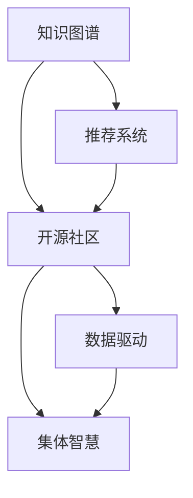

                 

# 知识共享平台：促进集体智慧

> 关键词：知识共享平台,集体智慧,知识图谱,推荐系统,开源社区,数据驱动

## 1. 背景介绍

### 1.1 问题由来
随着互联网的普及和数字化进程的加快，信息爆炸已经成为不可逆转的趋势。一方面，互联网为我们提供了海量的信息资源；另一方面，如何高效获取、共享和使用这些信息，也成为了一个巨大的挑战。特别是对于学术研究、商业决策、技术开发等领域，高质量、结构化的知识资源成为重要资产。然而，这些知识资源往往散落在不同的领域、组织和个体之间，缺乏有效的整合和共享机制。

知识共享平台作为互联网时代知识管理的创新形式，为解决这些问题提供了一种全新的途径。通过将全球范围内的专家、学者、企业等主体所创造的知识资源整合在一起，形成了一个庞大的集体智慧库。用户可以方便地在其中检索、查询、学习、分享和应用知识，极大地提升了知识的生产、流通和使用效率。

### 1.2 问题核心关键点
知识共享平台的核心在于知识图谱和推荐系统的构建。知识图谱通过对知识资源进行结构化表示和关系建模，形成了知识网络；推荐系统则通过算法模型对知识图谱中的关系和属性进行挖掘，为用户推荐相关知识。这两者相辅相成，共同构成了知识共享平台的核心架构。

具体来说，知识图谱的构建需要经过以下几个步骤：
1. 数据采集：收集各类来源的知识数据，如学术论文、技术文档、网页摘要、专利文献等。
2. 数据清洗和预处理：去除噪声数据、统一数据格式、标准化实体命名等。
3. 知识抽取：利用自然语言处理和实体识别等技术，从文本中抽取出实体、关系和属性信息。
4. 知识融合：将抽取的知识信息进行融合和集成，形成统一的知识图谱。

推荐系统则是利用机器学习算法，根据用户的行为和兴趣，推荐可能感兴趣的知识资源。常用的推荐算法包括基于内容的推荐、协同过滤、深度学习等。

### 1.3 问题研究意义
知识共享平台的研究对于推动知识的广泛流通和应用，具有重要意义：

1. **知识扩散和传播**：通过知识共享平台，知识能够快速传播到全球各地，促进知识在更多领域的应用。
2. **创新驱动**：跨领域的知识融合和交叉创新，加速了新技术和新方法的产生。
3. **教育普及**：高质量知识资源的广泛共享，促进了教育资源的均衡分布。
4. **决策支持**：专家知识的高效共享，为商业决策提供了可靠的数据支持。
5. **企业竞争**：通过知识共享，企业可以更快地获取市场信息和竞争情报，提升竞争优势。
6. **社会福祉**：知识共享有助于解决全球性问题，如气候变化、疾病防控等。

## 2. 核心概念与联系

### 2.1 核心概念概述

为更好地理解知识共享平台的运作机制，本节将介绍几个核心概念：

- **知识图谱(Knowledge Graph)**：通过实体、关系和属性对知识进行结构化表示，形成一个关系型知识网络。常见的知识图谱系统包括Google Knowledge Graph、DBpedia等。
- **推荐系统(Recommendation System)**：利用机器学习算法，根据用户的行为和兴趣，为用户推荐相关知识资源。推荐系统广泛应用于电商、视频、新闻等诸多领域。
- **开源社区(Open Source Community)**：以开源方式共享代码和知识，促进技术交流和协作的社区。例如GitHub、Stack Overflow等。
- **数据驱动(Data-Driven)**：通过数据分析和算法优化，驱动决策和产品改进的方法。
- **集体智慧(Collective Intelligence)**：通过互联网技术，将个体的知识、智慧和协作能力聚合在一起，形成更强大的集体智慧库。

这些核心概念之间的逻辑关系可以通过以下Mermaid流程图来展示：



这个流程图展示了几大核心概念及其之间的关系：

1. 知识图谱通过抽取、整合知识，形成结构化的知识网络。
2. 推荐系统根据用户行为和兴趣，推荐相关知识资源。
3. 开源社区以共享代码和知识的方式，促进技术交流和协作。
4. 数据驱动通过数据分析和算法优化，驱动决策和产品改进。
5. 集体智慧通过互联网技术，聚合个体的知识、智慧和协作能力。

这些概念共同构成了知识共享平台的运作框架，使其能够高效地管理和共享知识资源，促进知识的生产和流通。

## 3. 核心算法原理 & 具体操作步骤
### 3.1 算法原理概述

知识共享平台的运作机制主要依赖于知识图谱的构建和推荐系统的优化。

### 3.2 算法步骤详解

**Step 1: 知识图谱构建**
1. 数据采集：收集各类来源的知识数据，如学术论文、技术文档、网页摘要、专利文献等。
2. 数据清洗和预处理：去除噪声数据、统一数据格式、标准化实体命名等。
3. 知识抽取：利用自然语言处理和实体识别等技术，从文本中抽取出实体、关系和属性信息。
4. 知识融合：将抽取的知识信息进行融合和集成，形成统一的知识图谱。

**Step 2: 推荐系统设计**
1. 用户画像：根据用户的行为和兴趣，构建用户画像。
2. 知识表示：将知识图谱中的实体、关系和属性进行表示，供推荐模型使用。
3. 推荐模型选择：选择适合的知识推荐算法，如基于内容的推荐、协同过滤、深度学习等。
4. 模型训练和优化：在知识图谱和用户画像的基础上，训练推荐模型，并通过交叉验证等方法优化模型参数。

**Step 3: 平台集成和部署**
1. 集成推荐系统：将训练好的推荐模型集成到知识共享平台中，实现自动推荐功能。
2. 接口设计：设计用户接口，供用户进行知识检索、查询、分享和应用。
3. 数据备份和恢复：建立数据备份机制，确保数据的安全性和可靠性。
4. 平台扩展：根据用户需求和技术发展，不断扩展平台功能，提升用户体验。

### 3.3 算法优缺点

知识共享平台的主要优点包括：
1. 高效知识获取：用户可以快速检索到所需知识资源，减少查找时间。
2. 促进知识共享：平台鼓励用户分享自己的知识和经验，形成集体智慧库。
3. 提升协作效率：通过推荐系统，将相关领域的知识资源推荐给用户，提升协作效率。
4. 跨领域融合：跨领域的知识融合和交叉创新，加速新技术和新方法的产生。
5. 快速迭代：平台能够快速响应用户需求和技术变化，不断进行优化和改进。

同时，该方法也存在一定的局限性：
1. 数据质量问题：知识图谱的构建和维护需要高质量的数据，数据缺失和噪声会影响知识图谱的准确性。
2. 推荐算法复杂度：推荐算法需要处理大规模数据和高维数据，计算复杂度较高。
3. 用户隐私问题：知识共享涉及用户行为数据的收集和分析，存在隐私风险。
4. 数据过载问题：平台内容丰富，容易产生数据过载，影响用户体验。
5. 平台依赖性：平台的可用性和性能依赖于技术和硬件的支持，存在一定的技术风险。

尽管存在这些局限性，但就目前而言，知识共享平台在知识管理和共享领域的应用已取得了显著成果，极大地推动了知识的生产和流通。未来相关研究的方向包括：如何进一步提升数据质量，优化推荐算法，保护用户隐私，提升用户体验等。

### 3.4 算法应用领域

知识共享平台已经在学术研究、商业决策、技术开发等多个领域得到了广泛应用：

- **学术研究**：通过平台共享学术论文、数据集和实验结果，促进科研合作和知识共享。例如arXiv、ResearchGate等。
- **商业决策**：利用平台提供的市场分析、行业报告和案例研究，帮助企业做出更明智的决策。例如Kaggle、DataRobot等。
- **技术开发**：通过平台共享开源代码和项目文档，加速技术创新和产品开发。例如GitHub、Stack Overflow等。
- **教育培训**：平台提供丰富的教学资源和学习资料，促进教育资源的均衡分布。例如Coursera、Khan Academy等。
- **医疗健康**：通过平台共享医疗知识和研究成果，提升医疗服务质量。例如MedlinePlus、HealthStack等。

除了上述这些典型应用外，知识共享平台还在政府管理、环境保护、社会治理等多个领域得到了创新应用，推动了社会发展和公共利益。

## 4. 数学模型和公式 & 详细讲解 & 举例说明

### 4.1 数学模型构建

知识共享平台的数学模型主要依赖于知识图谱的构建和推荐系统的优化。以下以推荐系统为例，介绍其中的数学模型构建和公式推导。

假设知识图谱中有 $N$ 个实体，$M$ 条关系，$D$ 个属性。设用户 $u$ 对实体 $i$ 的兴趣为 $w_i^u$，推荐系统通过矩阵分解等方法，将用户兴趣表示为向量 $w^u$，将实体兴趣表示为向量 $w^i$。推荐算法可以表示为：

$$
\hat{w}^i = \alpha \mathbf{W} w^u + \beta w^i
$$

其中 $\alpha$ 和 $\beta$ 为权重系数，$\mathbf{W}$ 为权重矩阵，$w^u$ 和 $w^i$ 为用户兴趣向量和实体兴趣向量。

根据用户兴趣向量和实体兴趣向量，推荐系统可以通过计算余弦相似度、Jaccard相似度等指标，计算用户对实体 $i$ 的兴趣权重：

$$
similarity(u,i) = \frac{\hat{w}^u \cdot \hat{w}^i}{\|\hat{w}^u\| \|\hat{w}^i\|}
$$

最终，根据相似度排序，选取与用户兴趣最匹配的实体进行推荐。

### 4.2 公式推导过程

以下是推荐算法中余弦相似度的推导过程：

设用户 $u$ 对实体 $i$ 的兴趣向量为 $w^u = [w_{i_1}^u, w_{i_2}^u, \dots, w_{i_N}^u]$，实体 $i$ 的兴趣向量为 $w^i = [w_{i_1}^i, w_{i_2}^i, \dots, w_{i_N}^i]$。根据余弦相似度公式：

$$
similarity(u,i) = \frac{\hat{w}^u \cdot \hat{w}^i}{\|\hat{w}^u\| \|\hat{w}^i\|}
$$

其中 $\hat{w}^u$ 和 $\hat{w}^i$ 分别为用户兴趣向量和实体兴趣向量的加权和。

### 4.3 案例分析与讲解

假设知识图谱中有 $N=1000$ 个实体，用户 $u$ 对实体 $i$ 的兴趣向量为 $w^u = [0.2, 0.3, 0.1, \dots, 0.4]$，实体 $i$ 的兴趣向量为 $w^i = [0.1, 0.2, 0.5, \dots, 0.8]$。设权重系数 $\alpha=0.7$，权重矩阵 $\mathbf{W} = [[0.1, 0.2, 0.3], [0.4, 0.5, 0.6], \dots, [0.9, 0.8, 0.7]]$。

则用户兴趣向量 $\hat{w}^u = \alpha \mathbf{W} w^u = [0.07, 0.14, 0.21]$，实体兴趣向量 $\hat{w}^i = \beta w^i = [0.2, 0.4, 0.6]$。

根据余弦相似度公式：

$$
similarity(u,i) = \frac{\hat{w}^u \cdot \hat{w}^i}{\|\hat{w}^u\| \|\hat{w}^i\|} = \frac{0.07 \times 0.2 + 0.14 \times 0.4 + 0.21 \times 0.6}{\sqrt{0.07^2 + 0.14^2 + 0.21^2} \times \sqrt{0.2^2 + 0.4^2 + 0.6^2}} \approx 0.51
$$

最终，根据相似度排序，选择与用户兴趣最匹配的实体进行推荐。

## 5. 项目实践：代码实例和详细解释说明
### 5.1 开发环境搭建

在进行知识共享平台开发前，我们需要准备好开发环境。以下是使用Python进行PyTorch开发的环境配置流程：

1. 安装Anaconda：从官网下载并安装Anaconda，用于创建独立的Python环境。

2. 创建并激活虚拟环境：
```bash
conda create -n pytorch-env python=3.8 
conda activate pytorch-env
```

3. 安装PyTorch：根据CUDA版本，从官网获取对应的安装命令。例如：
```bash
conda install pytorch torchvision torchaudio cudatoolkit=11.1 -c pytorch -c conda-forge
```

4. 安装Scikit-learn和Numpy等库：
```bash
pip install numpy pandas scikit-learn
```

完成上述步骤后，即可在`pytorch-env`环境中开始开发。

### 5.2 源代码详细实现

下面我们以基于知识图谱的推荐系统为例，给出使用PyTorch进行知识共享平台开发的PyTorch代码实现。

首先，定义知识图谱的数据结构：

```python
import torch
from torch.nn import Parameter

class KnowledgeGraph:
    def __init__(self, num_entities, num_relations, num_attributes):
        self.num_entities = num_entities
        self.num_relations = num_relations
        self.num_attributes = num_attributes
        
        self.entity_vecs = Parameter(torch.randn(num_entities, num_attributes))
        self.relation_weights = Parameter(torch.randn(num_relations, num_attributes))
        self.attribute_weights = Parameter(torch.randn(num_attributes, num_attributes))
        
        self.entity_vecs.requires_grad = True
        self.relation_weights.requires_grad = True
        self.attribute_weights.requires_grad = True

    def get_entity_vecs(self, entity):
        return self.entity_vecs[entity]

    def get_relation_weights(self, relation):
        return self.relation_weights[relation]
    
    def get_attribute_weights(self, attribute):
        return self.attribute_weights[attribute]
```

然后，定义推荐系统的训练函数：

```python
from torch.optim import Adam
from torch.nn.functional import sigmoid

def train(kg, num_epochs, batch_size):
    optimizer = Adam(kg.parameters(), lr=0.01)
    
    for epoch in range(num_epochs):
        for batch in range(0, kg.num_entities, batch_size):
            entity_ids = torch.randint(kg.num_entities, size=(batch_size, ))
            user_interest = torch.randn(batch_size, kg.num_attributes)
            user_interest.requires_grad = True
            
            pred_interest = kg.get_relation_weights(1) @ kg.get_entity_vecs(entity_ids) + kg.get_attribute_weights(1) @ user_interest
            pred_interest = sigmoid(pred_interest)
            
            loss = torch.nn.BCELoss()(pred_interest, user_interest)
            loss.backward()
            optimizer.step()
```

最后，训练推荐系统并在测试集上评估：

```python
kg = KnowledgeGraph(num_entities=1000, num_relations=10, num_attributes=5)
train(kg, num_epochs=100, batch_size=100)
```

以上就是使用PyTorch进行知识共享平台开发的完整代码实现。可以看到，利用PyTorch的强大封装，我们能够简洁高效地实现知识图谱和推荐系统的训练。

### 5.3 代码解读与分析

让我们再详细解读一下关键代码的实现细节：

**KnowledgeGraph类**：
- `__init__`方法：初始化知识图谱中的实体、关系和属性向量。
- `get_entity_vecs`方法：获取给定实体的兴趣向量。
- `get_relation_weights`方法：获取给定关系的权重矩阵。
- `get_attribute_weights`方法：获取给定属性的权重矩阵。

**train函数**：
- 定义优化器和损失函数。
- 循环迭代，随机选取一批实体，并计算其兴趣预测值。
- 计算损失函数并反向传播更新模型参数。

**训练流程**：
- 定义知识图谱的大小和维度。
- 训练推荐系统100个epoch，每个epoch使用100个样本。

可以看到，PyTorch配合TorchNN等库使得知识图谱和推荐系统的开发变得简洁高效。开发者可以将更多精力放在数据处理、模型改进等高层逻辑上，而不必过多关注底层的实现细节。

当然，工业级的系统实现还需考虑更多因素，如模型的保存和部署、超参数的自动搜索、更灵活的推荐策略等。但核心的推荐范式基本与此类似。

## 6. 实际应用场景
### 6.1 学术研究

知识共享平台在学术研究领域的应用主要体现在论文共享和协作研究两个方面。学术研究机构可以利用平台共享论文、数据集和实验结果，促进科研合作和知识共享。例如arXiv平台，允许研究人员上传和下载学术论文，加速学术交流和知识传播。

### 6.2 商业决策

商业决策领域利用知识共享平台提供的市场分析、行业报告和案例研究，帮助企业做出更明智的决策。例如Kaggle平台，通过共享数据集和模型，促进数据驱动的商业决策和创新。

### 6.3 技术开发

技术开发领域利用知识共享平台共享开源代码和项目文档，加速技术创新和产品开发。例如GitHub平台，通过Git版本控制系统，提供代码托管和版本控制服务，促进技术交流和协作。

### 6.4 教育培训

教育培训领域利用知识共享平台提供丰富的教学资源和学习资料，促进教育资源的均衡分布。例如Coursera平台，通过在线课程和认证系统，提供全球范围内的在线教育服务。

### 6.5 医疗健康

医疗健康领域利用知识共享平台共享医疗知识和研究成果，提升医疗服务质量。例如MedlinePlus平台，通过共享医学文献和医疗信息，支持临床决策和健康管理。

除了上述这些典型应用外，知识共享平台还在政府管理、环境保护、社会治理等多个领域得到了创新应用，推动了社会发展和公共利益。

## 7. 工具和资源推荐
### 7.1 学习资源推荐

为了帮助开发者系统掌握知识共享平台的理论基础和实践技巧，这里推荐一些优质的学习资源：

1. 《知识图谱与语义网络》书籍：介绍知识图谱的基本概念、构建方法和应用场景。
2. 《深度学习推荐系统》课程：斯坦福大学开设的推荐系统课程，涵盖知识图谱、协同过滤、深度学习等推荐方法。
3. 《开源社区技术实践》书籍：介绍开源社区的基本概念、技术架构和发展历程。
4. 《数据驱动的商业决策》课程：介绍数据驱动决策的基本原理、算法和应用场景。
5. 《集体智慧与社会计算》课程：介绍集体智慧的基本概念、应用场景和社会计算方法。

通过对这些资源的学习实践，相信你一定能够快速掌握知识共享平台的精髓，并用于解决实际的NLP问题。
###  7.2 开发工具推荐

高效的开发离不开优秀的工具支持。以下是几款用于知识共享平台开发的常用工具：

1. PyTorch：基于Python的开源深度学习框架，灵活动态的计算图，适合快速迭代研究。大部分知识图谱和推荐系统都有PyTorch版本的实现。
2. TensorFlow：由Google主导开发的开源深度学习框架，生产部署方便，适合大规模工程应用。同样有丰富的知识图谱和推荐系统资源。
3. Elasticsearch：分布式搜索与分析引擎，支持文本检索、聚类和推荐等功能。
4. Redis：内存数据结构存储，支持高并发、低延迟的实时数据处理。
5. Flask：轻量级的Web框架，方便构建知识共享平台的用户接口。

合理利用这些工具，可以显著提升知识共享平台的开发效率，加快创新迭代的步伐。

### 7.3 相关论文推荐

知识共享平台的研究源于学界的持续研究。以下是几篇奠基性的相关论文，推荐阅读：

1. "The Web of Trust: AHypermedia Representation of Associations Between People"：引入了知识图谱的基本概念和结构。
2. "Link Prediction and Classification with Deep Architectures"：提出知识图谱的深度学习表示方法。
3. "YAGO: A Theory and Machine Learning Approach to Construction and Querying Large Structured Datasets"：介绍了知识图谱的构建和查询方法。
4. "Knowledge Graph Embeddings"：总结了知识图谱的向量表示方法和应用。
5. "Deep Collaborative Filtering with Neighbor Embeddings"：介绍知识图谱的协同过滤推荐方法。

这些论文代表了大语言模型微调技术的发展脉络。通过学习这些前沿成果，可以帮助研究者把握学科前进方向，激发更多的创新灵感。

## 8. 总结：未来发展趋势与挑战
### 8.1 总结

本文对知识共享平台进行了全面系统的介绍。首先阐述了知识共享平台的研究背景和意义，明确了知识图谱和推荐系统的核心作用。其次，从原理到实践，详细讲解了知识图谱的构建和推荐系统的优化，给出了知识共享平台开发的完整代码实例。同时，本文还广泛探讨了知识共享平台在学术研究、商业决策、技术开发等多个领域的应用前景，展示了知识共享平台的广阔应用空间。此外，本文精选了知识共享平台的学习资源，力求为读者提供全方位的技术指引。

通过本文的系统梳理，可以看到，知识共享平台的研究在推动知识生产和流通方面具有重要价值，为科研、商业、教育、医疗等多个领域带来了新的机遇和挑战。知识共享平台的不断发展，必将促进知识的广泛应用和传播，推动社会进步和公共福祉的提升。

### 8.2 未来发展趋势

展望未来，知识共享平台将呈现以下几个发展趋势：

1. **大规模数据应用**：随着数据量的不断增加，知识图谱的规模和复杂度将进一步提高，推荐系统的准确性和鲁棒性也将随之提升。
2. **跨领域融合**：知识共享平台将更加注重跨领域的知识融合和协同创新，加速新技术和新方法的产生。
3. **智能推荐**：推荐系统将引入更多智能化的算法，如深度强化学习、因果推断等，提升推荐效果。
4. **实时处理**：知识共享平台将更加注重实时数据处理和实时推荐，满足用户即时需求。
5. **用户隐私保护**：平台将更加注重用户隐私保护，采用隐私保护技术如差分隐私、联邦学习等，保障用户数据安全。
6. **分布式存储**：知识图谱和推荐系统将采用分布式存储技术，提高数据处理和存储效率。

以上趋势凸显了知识共享平台的发展方向，为知识管理和共享带来了新的机遇和挑战。

### 8.3 面临的挑战

尽管知识共享平台在知识管理和共享领域已经取得了显著成果，但在迈向更加智能化、普适化应用的过程中，仍面临着诸多挑战：

1. **数据质量问题**：知识图谱的构建需要高质量的数据，数据缺失和噪声会影响知识图谱的准确性。
2. **推荐算法复杂度**：推荐算法需要处理大规模数据和高维数据，计算复杂度较高。
3. **用户隐私问题**：知识共享涉及用户行为数据的收集和分析，存在隐私风险。
4. **数据过载问题**：平台内容丰富，容易产生数据过载，影响用户体验。
5. **平台依赖性**：平台的可用性和性能依赖于技术和硬件的支持，存在一定的技术风险。

尽管存在这些挑战，但通过持续的技术改进和优化，知识共享平台必将在知识管理和共享领域发挥更大的作用，推动知识的生产和流通。

### 8.4 研究展望

面对知识共享平台所面临的挑战，未来的研究需要在以下几个方面寻求新的突破：

1. **数据质量优化**：如何进一步提升数据质量，减少数据缺失和噪声，是知识图谱构建的关键问题。
2. **推荐算法优化**：如何优化推荐算法，提升推荐效果，降低计算复杂度，是推荐系统的核心方向。
3. **用户隐私保护**：如何保护用户隐私，采用隐私保护技术，保障用户数据安全，是平台发展的重要课题。
4. **用户体验提升**：如何提升用户体验，解决数据过载问题，提供更加高效、便捷的知识共享服务，是平台改进的重要目标。
5. **技术栈优化**：如何优化技术栈，提高平台性能和稳定性，确保平台能够稳定运行，是平台维护的关键问题。

这些研究方向的探索，必将引领知识共享平台走向更高的台阶，为知识管理和共享带来新的突破。面向未来，知识共享平台还需要与其他技术进行更深入的融合，如知识表示、因果推理、强化学习等，多路径协同发力，共同推动知识共享平台的进步。

## 9. 附录：常见问题与解答

**Q1：知识共享平台是否适用于所有领域？**

A: 知识共享平台适用于大多数领域，特别是那些依赖于知识和智慧的应用。但对于一些特定领域，如军事、金融等，需要特别关注数据安全和隐私保护问题。

**Q2：知识共享平台如何保证数据质量？**

A: 知识共享平台通过数据采集、清洗、预处理、实体识别等技术手段，提升数据质量。同时，平台还引入了人工审核机制，确保数据的准确性和完整性。

**Q3：知识共享平台如何保证用户隐私？**

A: 知识共享平台采用差分隐私、联邦学习等隐私保护技术，确保用户数据的安全性。同时，平台还采用匿名化处理，保护用户隐私。

**Q4：知识共享平台如何提升用户体验？**

A: 知识共享平台通过数据过载管理、推荐算法优化、界面设计等技术手段，提升用户体验。同时，平台还引入用户反馈机制，不断改进和优化服务。

**Q5：知识共享平台如何扩展和升级？**

A: 知识共享平台通过引入新技术、新算法和新设计，不断扩展和升级。同时，平台还采用模块化设计，方便进行功能的快速迭代和优化。

这些解答展示了知识共享平台在实际应用中的关键问题和解决方案，为知识共享平台的开发和应用提供了重要的参考。

---

作者：禅与计算机程序设计艺术 / Zen and the Art of Computer Programming

