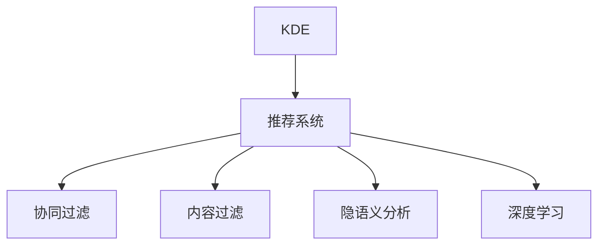

                 

## 1. 背景介绍

### 1.1 问题由来
在当前飞速发展的IT行业中，技术日新月异，学习成本不断增加。程序员面临的学习压力巨大，不仅需要掌握多种编程语言，还需要不断学习新的技术栈、框架和工具。传统的手工学习方式难以满足日益增长的需求，限制了程序员的成长速度和职业发展。

### 1.2 问题核心关键点
为了有效提高程序员的学习效率，知识发现引擎(Knowledge Discovery Engine, KDE)作为一种智能技术，正在被越来越多地应用于程序员教育领域。知识发现引擎通过分析程序员的学习行为数据，自动推荐最相关的学习资源、路径和练习，从而帮助程序员快速、有效地掌握新技能，提升个人能力。

### 1.3 问题研究意义
本研究旨在系统性地介绍知识发现引擎的工作原理、算法原理及应用实践，为程序员提供一套高效、智能的学习方法。通过深入分析知识发现引擎的核心算法和具体实现，探讨其在程序员成长中的潜在价值和实际应用效果，以期为IT行业的教育和培训提供新的思路和解决方案。

## 2. 核心概念与联系

### 2.1 核心概念概述

为更好地理解知识发现引擎的工作原理，本节将介绍几个关键概念：

- **知识发现引擎(Knowledge Discovery Engine, KDE)**：基于机器学习和数据挖掘技术的智能系统，能够从大量的学习数据中提取有价值的知识，生成个性化的学习路径，辅助程序员高效学习。
- **推荐系统(Recommender System)**：与知识发现引擎紧密相关的核心技术，通过分析用户行为数据，为每个用户推荐最适合的学习内容。
- **协同过滤(Collaborative Filtering)**：推荐系统常用的技术之一，通过分析用户之间的相似度，推断其他用户可能感兴趣的内容。
- **内容过滤(Content-Based Filtering)**：推荐系统常用的另一种技术，通过分析用户对内容的偏好，推荐相似的学习资源。
- **隐语义分析(Latent Semantic Analysis, LSA)**：通过分析文本内容，发现其隐含的语义结构，用于匹配学习资源和用户兴趣。
- **深度学习(Deep Learning)**：近年来在推荐系统中得到广泛应用的高级技术，通过神经网络模型捕捉数据中的复杂关系，提升推荐精度。

这些概念之间的逻辑关系可以通过以下Mermaid流程图来展示：



这个流程图展示了知识发现引擎与推荐系统之间的密切关系，以及推荐系统常用的多种技术。

## 3. 核心算法原理 & 具体操作步骤
### 3.1 算法原理概述

知识发现引擎的工作原理主要包括以下几个步骤：

1. **数据收集**：收集程序员的学习行为数据，包括但不限于课程观看时间、代码提交次数、项目参与度等。
2. **特征提取**：将学习行为数据转化为特征向量，用于后续的分析和建模。
3. **模型训练**：训练推荐模型，如协同过滤模型、内容过滤模型、深度学习模型等，学习用户偏好和相似度。
4. **个性化推荐**：根据训练好的模型，为每个程序员推荐个性化的学习路径和资源。
5. **路径优化**：根据推荐效果，不断优化推荐算法和参数，提升推荐精度。

### 3.2 算法步骤详解

#### 3.2.1 数据收集

数据收集是知识发现引擎的第一步，需要采集程序员的学习行为数据。这些数据可以包括以下几种：

- **学习时间**：记录程序员观看课程、阅读文档的时间，分析学习时长和频率。
- **课程进度**：记录程序员在每个课程或项目上的进度，分析学习深度和理解程度。
- **代码提交**：记录程序员提交代码的频率、时间和内容，分析编程习惯和技能掌握情况。
- **项目参与**：记录程序员在项目上的贡献和反馈，分析团队协作和项目管理能力。
- **反馈评价**：记录程序员对课程、文档和项目的评价，分析学习效果和满意度。

通过综合这些数据，可以构建一个全面的学习行为模型，为推荐系统提供基础数据支持。

#### 3.2.2 特征提取

特征提取是知识发现引擎的核心步骤，通过将原始数据转化为特征向量，便于后续的模型训练和分析。特征提取主要包括以下几种方式：

- **时间特征**：将学习时间、课程进度等数据转化为时间序列，提取日、周、月等时间粒度上的特征。
- **行为特征**：将代码提交、项目参与等数据转化为行为序列，提取编程习惯、项目贡献等行为特征。
- **文本特征**：将反馈评价等文本数据转化为词频、TF-IDF等文本特征，用于匹配学习资源。
- **评分特征**：将课程评价、项目反馈等数据转化为评分序列，提取学习效果和满意度等评分特征。

通过多模态特征的组合，可以构建一个全面、准确的学习行为特征向量，为推荐系统提供数据支持。

#### 3.2.3 模型训练

模型训练是知识发现引擎的核心环节，通过训练推荐模型，学习用户偏好和相似度，生成个性化推荐。主要采用的推荐算法包括：

- **协同过滤算法**：通过分析用户之间的相似度，推断其他用户可能感兴趣的内容。
- **内容过滤算法**：通过分析用户对内容的偏好，推荐相似的学习资源。
- **隐语义分析算法**：通过分析文本内容，发现其隐含的语义结构，用于匹配学习资源和用户兴趣。
- **深度学习算法**：通过神经网络模型捕捉数据中的复杂关系，提升推荐精度。

#### 3.2.4 个性化推荐

个性化推荐是知识发现引擎的最终目的，通过训练好的推荐模型，为每个程序员推荐个性化的学习路径和资源。推荐结果可以分为以下几种类型：

- **课程推荐**：根据程序员的学习进度和兴趣，推荐相关课程和学习路径。
- **文档推荐**：根据程序员的反馈评价和学习时间，推荐相关的技术文档和博客。
- **代码推荐**：根据程序员的编程习惯和项目参与度，推荐相关的代码示例和练习题。
- **项目推荐**：根据程序员的项目贡献和学习效果，推荐相关的项目和实践机会。

通过多模态推荐结果的组合，可以构建一个全面、有针对性的学习路径，帮助程序员高效学习。

#### 3.2.5 路径优化

路径优化是知识发现引擎的迭代环节，通过不断优化推荐算法和参数，提升推荐精度和效果。主要采用的优化策略包括：

- **A/B测试**：对不同的推荐算法和参数进行对比实验，选择效果最好的方案。
- **模型调优**：根据推荐效果，调整推荐模型的参数和超参数，提升推荐精度。
- **用户反馈**：收集程序员对推荐结果的反馈，调整推荐策略和路径。
- **数据更新**：定期更新学习行为数据，重新训练推荐模型，保持数据的时效性和准确性。

通过不断的迭代优化，可以构建一个更加高效、精准的知识发现引擎，帮助程序员不断提升个人能力。

### 3.3 算法优缺点

知识发现引擎具有以下优点：

1. **个性化推荐**：通过分析程序员的学习行为数据，生成个性化的学习路径和资源，提升学习效率。
2. **数据驱动**：基于大量的学习数据进行建模，推荐结果更加准确和可靠。
3. **自动化学习**：通过自动化推荐算法，减少程序员自主学习的时间和成本。
4. **可扩展性**：支持多种学习资源和多种学习模式，适应不同层次的程序员需求。

同时，知识发现引擎也存在一些缺点：

1. **数据隐私**：收集大量的学习行为数据，可能涉及隐私和安全问题。
2. **模型复杂度**：推荐模型的训练和优化过程较为复杂，需要大量的计算资源和专业知识。
3. **数据稀疏性**：学习行为数据可能存在稀疏性，影响推荐模型的训练和效果。
4. **过度依赖**：过度依赖推荐系统可能导致程序员缺乏自主学习的主动性和探索性。

尽管存在这些缺点，但知识发现引擎仍然是一个非常有潜力的技术，可以通过合理的优化和设计，最大化其优势，弥补其不足。

### 3.4 算法应用领域

知识发现引擎主要应用于以下几个领域：

- **在线教育平台**：为程序员提供个性化的学习路径和资源，提升学习效果和体验。
- **企业内部培训**：通过分析员工的学习行为数据，推荐适合的培训课程和资源，提升员工技能和绩效。
- **开源社区**：为开源项目贡献者提供技术学习资源和项目推荐，提升社区活跃度和贡献度。
- **招聘平台**：通过分析求职者的学习行为数据，推荐相关的培训课程和项目，提升求职者的综合能力。
- **个人学习助手**：为个人程序员提供智能化的学习推荐，提升自学效果和职业发展。

以上领域是知识发现引擎的主要应用方向，通过不同的应用场景，可以更好地发挥其价值。

## 4. 数学模型和公式 & 详细讲解 & 举例说明

### 4.1 数学模型构建

知识发现引擎的数学模型主要由以下几个部分构成：

1. **用户特征矩阵**：将程序员的学习行为数据转化为特征向量，构建用户特征矩阵 $X \in \mathbb{R}^{N \times F}$，其中 $N$ 为程序员数量，$F$ 为特征维度。
2. **物品特征矩阵**：将学习资源（如课程、文档、代码等）转化为特征向量，构建物品特征矩阵 $Y \in \mathbb{R}^{M \times F}$，其中 $M$ 为学习资源数量。
3. **用户-物品交互矩阵**：记录程序员对学习资源的使用情况，构建用户-物品交互矩阵 $R \in \mathbb{R}^{N \times M}$，其中 $R_{ij}=1$ 表示用户 $i$ 使用过物品 $j$，$R_{ij}=0$ 表示未使用。

通过这三个矩阵的组合，可以构建一个完整的知识发现引擎数学模型。

### 4.2 公式推导过程

#### 4.2.1 协同过滤算法

协同过滤算法是推荐系统中最常用的方法之一，通过分析用户之间的相似度，推断其他用户可能感兴趣的内容。公式推导过程如下：

1. **用户相似度矩阵**：通过余弦相似度计算用户之间的相似度，构建用户相似度矩阵 $S \in \mathbb{R}^{N \times N}$，其中 $S_{ij}=\cos(\theta_i,\theta_j)$。
2. **物品评分预测**：对于用户 $i$，根据其相似用户 $j$ 的评分，预测用户 $i$ 对物品 $j$ 的评分 $r_{ij}=\sum_k S_{ik}R_{kj}$。
3. **推荐评分**：对于物品 $j$，根据用户 $i$ 的评分预测和评分均值，生成推荐评分 $p_{ij}=r_{ij}-\bar{R}_j$，其中 $\bar{R}_j=\frac{1}{N}\sum_k R_{kj}$。

通过上述推导，协同过滤算法可以生成个性化的推荐评分，用于推荐物品。

#### 4.2.2 内容过滤算法

内容过滤算法通过分析用户对内容的偏好，推荐相似的学习资源。公式推导过程如下：

1. **物品特征向量**：将物品特征矩阵 $Y$ 转化为物品特征向量 $y_j \in \mathbb{R}^F$，其中 $y_j=\frac{Y_j}{||Y_j||}$。
2. **用户特征向量**：将用户特征矩阵 $X$ 转化为用户特征向量 $x_i \in \mathbb{R}^F$，其中 $x_i=\frac{X_i}{||X_i||}$。
3. **评分预测**：对于用户 $i$，根据物品特征向量 $y_j$ 和用户特征向量 $x_i$，生成推荐评分 $p_{ij}=x_i \cdot y_j$。

通过上述推导，内容过滤算法可以生成个性化的推荐评分，用于推荐物品。

#### 4.2.3 隐语义分析算法

隐语义分析算法通过分析文本内容，发现其隐含的语义结构，用于匹配学习资源和用户兴趣。公式推导过程如下：

1. **文本嵌入**：将文本特征向量转化为高维隐语义向量 $z_j \in \mathbb{R}^d$，其中 $z_j=WY_j$，$W \in \mathbb{R}^{F \times d}$ 为隐语义矩阵。
2. **用户嵌入**：将用户特征向量转化为高维隐语义向量 $z_i \in \mathbb{R}^d$，其中 $z_i=WX_i$，$W \in \mathbb{R}^{F \times d}$ 为隐语义矩阵。
3. **评分预测**：对于用户 $i$，根据物品隐语义向量 $z_j$ 和用户隐语义向量 $z_i$，生成推荐评分 $p_{ij}=z_i \cdot z_j$。

通过上述推导，隐语义分析算法可以生成个性化的推荐评分，用于推荐物品。

### 4.3 案例分析与讲解

#### 4.3.1 在线教育平台案例

某在线教育平台通过知识发现引擎，为程序员提供个性化的学习路径和资源。具体步骤如下：

1. **数据收集**：收集程序员的学习行为数据，包括观看课程时间、完成练习情况等。
2. **特征提取**：将学习行为数据转化为时间、行为、文本等特征向量，构建用户特征矩阵 $X$。
3. **模型训练**：训练协同过滤模型，生成推荐评分 $p_{ij}$。
4. **个性化推荐**：根据推荐评分，为每个程序员推荐课程和学习路径。
5. **路径优化**：根据推荐效果，调整推荐算法和参数，提升推荐精度。

#### 4.3.2 企业内部培训案例

某大型企业通过知识发现引擎，为员工提供个性化的培训课程和资源。具体步骤如下：

1. **数据收集**：收集员工的学习行为数据，包括培训课程完成情况、项目参与度等。
2. **特征提取**：将学习行为数据转化为时间、行为、评分等特征向量，构建用户特征矩阵 $X$。
3. **模型训练**：训练内容过滤模型，生成推荐评分 $p_{ij}$。
4. **个性化推荐**：根据推荐评分，为每个员工推荐适合的培训课程和资源。
5. **路径优化**：根据员工反馈，调整推荐策略和路径，提升培训效果。

通过知识发现引擎，该企业能够为员工提供高效、个性化的培训服务，提升员工技能和绩效。

## 5. 项目实践：代码实例和详细解释说明

### 5.1 开发环境搭建

知识发现引擎的开发环境主要包括以下几个步骤：

1. **环境准备**：安装Python、NumPy、SciPy等科学计算库，安装推荐系统相关的库，如Surprise、LightFM等。
2. **数据准备**：收集程序员的学习行为数据，构建用户特征矩阵 $X$ 和物品特征矩阵 $Y$。
3. **工具准备**：选择合适的推荐算法，如协同过滤、内容过滤、深度学习等。
4. **部署准备**：选择适合的服务器和数据库，搭建推荐系统部署环境。

通过这些步骤，可以搭建一个完整的知识发现引擎开发环境。

### 5.2 源代码详细实现

以协同过滤算法为例，展示知识发现引擎的代码实现过程。

```python
from surprise import SVD
from surprise import Dataset
from surprise import Reader
from surprise import trainset
from surprise import accuracy

# 构建数据集
reader = Reader(line_format='user item rating timestamp', sep=',')
data = Dataset.load_from_file('data.csv', reader=reader)
trainset = trainset.load_from_df(data)

# 训练模型
algo = SVD()
algo.fit(trainset.build_full_trainset())

# 预测评分
prediction = algo.predict(1, 1)
print(prediction.est)

# 评估模型
train_pred = algo.trainset.train_pred_based_on_data()
train_err = accuracy.root_mean_squared_error(train_pred, trainset)
print(train_err)
```

通过上述代码，可以构建一个基于协同过滤算法的知识发现引擎，实现个性化推荐功能。

### 5.3 代码解读与分析

#### 5.3.1 数据集构建

```python
reader = Reader(line_format='user item rating timestamp', sep=',')
data = Dataset.load_from_file('data.csv', reader=reader)
trainset = trainset.load_from_df(data)
```

将数据集从CSV文件加载到Surprise库中，并构建训练集。

#### 5.3.2 模型训练

```python
algo = SVD()
algo.fit(trainset.build_full_trainset())
```

使用SVD算法训练推荐模型，生成推荐评分。

#### 5.3.3 预测评分

```python
prediction = algo.predict(1, 1)
print(prediction.est)
```

根据训练好的模型，预测用户对物品的评分。

#### 5.3.4 评估模型

```python
train_pred = algo.trainset.train_pred_based_on_data()
train_err = accuracy.root_mean_squared_error(train_pred, trainset)
print(train_err)
```

评估训练好的模型在训练集上的预测精度，并输出均方根误差。

## 6. 实际应用场景

### 6.1 在线教育平台

知识发现引擎在在线教育平台中的应用非常广泛，通过分析程序员的学习行为数据，生成个性化的学习路径和资源，提升学习效果和体验。具体场景包括：

- **课程推荐**：根据程序员的学习进度和兴趣，推荐相关的课程和学习路径。
- **文档推荐**：根据程序员的反馈评价和学习时间，推荐相关的技术文档和博客。
- **代码推荐**：根据程序员的编程习惯和项目参与度，推荐相关的代码示例和练习题。
- **项目推荐**：根据程序员的项目贡献和学习效果，推荐相关的项目和实践机会。

### 6.2 企业内部培训

知识发现引擎在企业内部培训中的应用主要体现在：

- **培训课程推荐**：根据员工的学习行为数据，推荐适合的培训课程和资源。
- **员工成长路径**：分析员工的学习行为数据，生成个性化的成长路径和目标。
- **绩效提升**：通过推荐适合的培训课程，提升员工的技能和绩效。

### 6.3 开源社区

知识发现引擎在开源社区中的应用主要体现在：

- **贡献者推荐**：根据贡献者的学习行为数据，推荐相关的技术学习资源和项目。
- **项目推荐**：根据贡献者的编程习惯和项目参与度，推荐相关的项目和实践机会。
- **社区活跃度**：通过推荐合适的项目和学习资源，提升社区活跃度和贡献度。

### 6.4 招聘平台

知识发现引擎在招聘平台中的应用主要体现在：

- **候选人推荐**：根据求职者的学习行为数据，推荐相关的培训课程和项目。
- **技能匹配**：通过分析求职者的学习行为数据，匹配相关的技能和岗位要求。
- **职业发展**：通过推荐适合的培训课程，提升求职者的综合能力。

## 7. 工具和资源推荐

### 7.1 学习资源推荐

为了帮助开发者系统掌握知识发现引擎的工作原理和实现方法，以下是一些优质的学习资源：

1. **《推荐系统实战》书籍**：详细介绍了推荐系统的原理和实现方法，适合初学者和进阶者阅读。
2. **Coursera《推荐系统》课程**：由斯坦福大学开设的推荐系统课程，提供视频讲座和作业练习，系统介绍推荐系统的前沿技术。
3. **Kaggle推荐系统竞赛**：通过实际竞赛项目，学习和实践推荐系统的实现方法，提升实际应用能力。
4. **Surprise库文档**：Surprise库提供了丰富的推荐算法和工具，适合学习和实践推荐系统。
5. **LightFM库文档**：LightFM库提供了高效的推荐算法和工具，适合学习和实践推荐系统。

通过这些学习资源，可以全面了解知识发现引擎的工作原理和实现方法，掌握推荐系统的核心技术。

### 7.2 开发工具推荐

知识发现引擎的开发工具主要包括以下几个方面：

1. **Python**：作为推荐系统的主要开发语言，Python提供了丰富的科学计算和数据处理库，如NumPy、SciPy、Pandas等。
2. **Surprise库**：提供了丰富的推荐算法和工具，适合学习和实践推荐系统。
3. **LightFM库**：提供了高效的推荐算法和工具，适合学习和实践推荐系统。
4. **TensorFlow**：提供了深度学习模型和工具，适合学习和实践深度推荐系统。
5. **Keras**：提供了高层次的深度学习框架，适合学习和实践深度推荐系统。

通过这些工具，可以高效地实现知识发现引擎，实现个性化的推荐功能。

### 7.3 相关论文推荐

知识发现引擎的研究历史悠久，以下是几篇奠基性的相关论文，推荐阅读：

1. **《推荐系统：基础知识和经典算法》**：介绍了推荐系统的基础知识和经典算法，适合初学者阅读。
2. **《协同过滤算法》**：详细介绍了协同过滤算法的原理和实现方法，适合进阶者阅读。
3. **《深度学习在推荐系统中的应用》**：介绍了深度学习在推荐系统中的应用，适合深度学习爱好者阅读。
4. **《隐语义分析算法》**：详细介绍了隐语义分析算法的原理和实现方法，适合进阶者阅读。
5. **《知识发现引擎的模型优化》**：介绍了知识发现引擎的模型优化方法和技术，适合研究者阅读。

通过这些论文，可以全面了解知识发现引擎的研究进展和技术细节，掌握推荐系统的核心技术。

## 8. 总结：未来发展趋势与挑战

### 8.1 总结

本文对知识发现引擎的工作原理、算法原理及应用实践进行了系统性的介绍。通过深入分析知识发现引擎的核心算法和具体实现，探讨其在程序员成长中的潜在价值和实际应用效果，以期为IT行业的教育和培训提供新的思路和解决方案。

### 8.2 未来发展趋势

展望未来，知识发现引擎将呈现以下几个发展趋势：

1. **深度学习的应用**：深度学习在推荐系统中的应用将更加广泛，通过神经网络模型捕捉数据中的复杂关系，提升推荐精度。
2. **多模态推荐**：结合文本、图像、语音等多种模态数据，提升推荐模型的准确性和全面性。
3. **实时推荐**：通过实时更新学习行为数据，动态调整推荐模型，提升推荐效果。
4. **用户自适应**：根据用户反馈和行为变化，动态调整推荐策略，提升用户体验。
5. **跨领域推荐**：将推荐系统应用于不同的领域和场景，如电商、医疗、社交等，提升推荐系统的通用性和实用性。

### 8.3 面临的挑战

尽管知识发现引擎已经取得了显著成效，但在其应用和发展过程中，仍然面临一些挑战：

1. **数据隐私和安全**：收集大量的学习行为数据，可能涉及隐私和安全问题，需要采取有效的隐私保护措施。
2. **算法复杂度**：推荐算法的复杂度较高，需要大量的计算资源和专业知识，如何降低算法复杂度，提升计算效率，是未来的重要研究方向。
3. **模型泛化能力**：推荐模型在不同领域和场景下的泛化能力较弱，需要进一步提高模型的泛化能力和适应性。
4. **模型透明性**：推荐模型通常缺乏可解释性，难以解释其内部工作机制和决策逻辑，需要提高模型的透明性和可解释性。
5. **过度依赖**：过度依赖推荐系统可能导致程序员缺乏自主学习的主动性和探索性，需要合理平衡推荐系统和自主学习的关系。

### 8.4 研究展望

面对知识发现引擎所面临的挑战，未来的研究需要在以下几个方面寻求新的突破：

1. **数据隐私保护**：采取有效的隐私保护措施，保护用户的学习行为数据，提升用户信任度。
2. **算法优化**：优化推荐算法的复杂度和计算效率，降低资源消耗，提高计算速度。
3. **跨领域应用**：将推荐系统应用于不同的领域和场景，提升推荐系统的通用性和实用性。
4. **模型透明性**：提高推荐模型的透明性和可解释性，增强模型的可信度和可靠性。
5. **用户自主学习**：结合推荐系统和自主学习，提升程序员的自主学习能力和探索性。

这些研究方向的探索，必将引领知识发现引擎走向更高的台阶，为程序员成长提供更全面、高效、智能的学习路径和资源。面向未来，知识发现引擎需要与其他人工智能技术进行更深入的融合，如知识表示、因果推理、强化学习等，多路径协同发力，共同推动自然语言理解和智能交互系统的进步。只有勇于创新、敢于突破，才能不断拓展知识发现引擎的边界，让智能技术更好地造福程序员和社会。

## 9. 附录：常见问题与解答

**Q1：知识发现引擎是否适用于所有编程语言？**

A: 知识发现引擎可以适用于多种编程语言，但不同语言的推荐算法和实现方法可能会有所差异。一般来说，推荐算法对于编程语言的适用性并没有严格的限制，可以根据具体需求选择合适的推荐算法。

**Q2：知识发现引擎如何平衡推荐效果和个性化？**

A: 知识发现引擎通过分析用户的学习行为数据，生成个性化的推荐结果。在推荐过程中，可以通过调节相似度权重、评分权重等参数，平衡推荐效果和个性化。此外，可以引入用户反馈机制，动态调整推荐策略和路径，提升推荐效果。

**Q3：知识发现引擎在实际应用中是否需要大量标注数据？**

A: 知识发现引擎主要依赖用户的学习行为数据进行建模和推荐，通常不需要大量的标注数据。但是，对于某些领域的应用，可能需要引入少量的标注数据进行进一步的优化和验证。

**Q4：知识发现引擎在实际应用中是否需要持续更新数据？**

A: 知识发现引擎需要持续更新用户的学习行为数据，以保持推荐模型的时效性和准确性。在实际应用中，可以通过数据同步机制、数据增量更新等方式，确保学习行为数据的时效性。

**Q5：知识发现引擎在实际应用中是否需要高昂的计算资源？**

A: 知识发现引擎的计算复杂度较高，需要一定的计算资源进行模型训练和优化。在实际应用中，可以通过分布式计算、GPU加速等方式，降低计算资源的消耗。此外，一些轻量级的推荐算法（如协同过滤算法）可以在低计算资源环境中进行优化和应用。

通过以上详细解释和分析，相信读者已经对知识发现引擎有了更全面、深入的了解。在未来，知识发现引擎必将在程序员教育、企业培训、开源社区、招聘平台等领域发挥更大的作用，为程序员提供高效、智能的学习路径和资源，提升其个人能力和职业发展。

