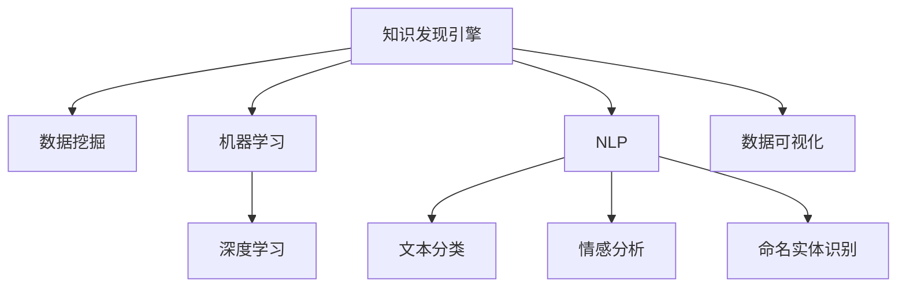

                 

# 知识发现引擎在生物多样性研究中的应用

> 关键词：知识发现引擎,生物多样性,生态系统,基因组分析,数据挖掘,模型预测,自然语言处理(NLP)

## 1. 背景介绍

### 1.1 问题由来
生物多样性是人类生存和发展的基础，是地球生态系统的重要组成部分。随着全球气候变化、人类活动加剧等因素的影响，生物多样性面临严重的威胁。科学研究和有效管理需要借助数据驱动的方法，从海量数据中发现潜在的知识，提升对生物多样性的认知和保护水平。

### 1.2 问题核心关键点
生物多样性研究涉及环境数据、基因组数据、行为数据等多种类型的数据，而数据分散、标准不一、质量参差不齐等问题，给研究工作带来巨大挑战。知识发现引擎(Knowledge Discovery Engine, KDE)是一种能够自动挖掘和发现数据的潜在知识的方法，通过结合数据挖掘、机器学习等技术，可以从大规模生物多样性数据中发现规律和模式，为保护生物多样性提供科学依据。

### 1.3 问题研究意义
利用知识发现引擎，可以从生物多样性数据中发现潜在的知识，提升对生态系统的理解和保护水平。通过自动化、智能化的知识发现过程，降低研究成本，提高研究效率，加速相关研究成果的应用。此外，通过知识发现引擎的应用，可以更好地预测生物多样性的变化趋势，制定科学合理的保护措施，为生物多样性的保护和可持续发展提供决策支持。

## 2. 核心概念与联系

### 2.1 核心概念概述

为更好地理解知识发现引擎在生物多样性研究中的应用，本节将介绍几个密切相关的核心概念：

- **知识发现引擎(KDE)**：基于数据挖掘和机器学习等技术，自动发现和挖掘数据中潜在知识的工具。KDE包括数据预处理、特征选择、模型训练和结果解释等多个环节。

- **生物多样性**：指特定生态系统或地理区域内生物种类的丰富性和变异性。生物多样性包括遗传多样性、物种多样性和生态系统多样性等多个层面。

- **数据挖掘**：从大规模数据中自动发现有用知识和规律的过程，包括数据预处理、特征选择、模型训练和结果解释等多个环节。

- **机器学习**：利用算法从数据中学习知识，并进行预测或决策的方法，包括监督学习、非监督学习和强化学习等多种方式。

- **深度学习**：一种基于人工神经网络的机器学习方法，能够处理高维度、大规模的数据，常用于图像、语音和文本等复杂任务。

- **自然语言处理(NLP)**：处理和理解自然语言的技术，包括文本分类、情感分析、命名实体识别等任务。

- **数据可视化**：将数据以图形或图表形式展示，便于发现数据中的规律和模式。

这些核心概念之间的逻辑关系可以通过以下Mermaid流程图来展示：



这个流程图展示的知识发现引擎的核心概念及其之间的关系：

1. 知识发现引擎利用数据挖掘和机器学习等技术，自动发现和挖掘数据中潜在知识。
2. 数据挖掘包括数据预处理、特征选择、模型训练和结果解释等多个环节，是知识发现引擎的关键技术。
3. 机器学习利用算法从数据中学习知识，是数据挖掘和知识发现引擎的重要组成部分。
4. 深度学习是机器学习的一种重要形式，能够处理高维度、大规模的数据。
5. 自然语言处理是知识发现引擎应用的重要方向之一，可以处理和理解文本数据。
6. 数据可视化是知识发现引擎结果呈现的重要手段，便于发现数据中的规律和模式。

这些概念共同构成了知识发现引擎在生物多样性研究中的应用框架，使得科学家能够从大规模生物多样性数据中发现有用的知识，为生物多样性保护提供科学依据。

## 3. 核心算法原理 & 具体操作步骤
### 3.1 算法原理概述

知识发现引擎在生物多样性研究中，主要利用数据挖掘和机器学习技术，从海量的生物多样性数据中发现潜在的知识。其核心思想是：

1. **数据预处理**：清洗、归一化、降维等预处理步骤，提升数据质量，为后续分析提供保障。
2. **特征选择**：通过特征选择算法，提取对生物多样性有影响的特征，减少数据维度，提升模型训练效率。
3. **模型训练**：选择适合的机器学习模型，如分类、回归、聚类等，对数据进行训练，发现数据中的规律和模式。
4. **结果解释**：通过可视化、自然语言处理等技术，将发现的知识呈现给用户，便于理解和使用。

### 3.2 算法步骤详解

知识发现引擎在生物多样性研究中的应用，主要包括以下几个关键步骤：

**Step 1: 数据收集与预处理**
- 收集生物多样性相关的环境数据、基因组数据、行为数据等。
- 清洗数据，去除噪音和缺失值，保证数据质量。
- 进行数据归一化、降维等预处理，提升数据处理效率和精度。

**Step 2: 特征选择与提取**
- 通过统计分析、相关性分析等方法，选择对生物多样性有影响的特征。
- 使用主成分分析(PCA)、独立成分分析(ICA)等算法，进行特征提取，提升模型训练效果。

**Step 3: 模型训练与评估**
- 选择适合的机器学习模型，如决策树、随机森林、支持向量机等。
- 利用训练数据集对模型进行训练，并在验证集上评估模型性能。
- 调整模型参数，优化模型性能。

**Step 4: 结果解释与可视化**
- 将模型训练结果进行可视化，如分类图、聚类图等。
- 使用自然语言处理技术，将发现的知识和规律以文本形式呈现，便于理解和使用。

**Step 5: 应用与验证**
- 将训练好的模型应用于实际问题，如预测物种分布、评估生态系统健康等。
- 在实际应用中验证模型的效果，并进行优化。

### 3.3 算法优缺点

知识发现引擎在生物多样性研究中的应用，具有以下优点：

1. **自动化高效**：自动发现和挖掘数据中的潜在知识，大大降低了人工分析和处理的工作量。
2. **客观性高**：通过数学模型和算法，避免了人为因素对结果的影响，结果客观可信。
3. **灵活性高**：可以适应多种类型的数据，包括环境数据、基因组数据等，具有较高的灵活性。

同时，该方法也存在一定的局限性：

1. **对数据质量要求高**：数据预处理和特征选择等环节，对数据质量和处理技术的要求较高。
2. **模型选择复杂**：需要根据具体问题选择合适的模型，对用户的机器学习知识要求较高。
3. **结果可解释性不足**：模型训练结果往往以图形或图表形式呈现，难以直接解释和理解。

尽管存在这些局限性，但就目前而言，知识发现引擎仍是生物多样性研究中最有效的数据处理方法之一。未来相关研究的重点在于如何进一步降低数据处理技术要求，提高结果的可解释性，同时兼顾模型选择和应用效率等因素。

### 3.4 算法应用领域

知识发现引擎在生物多样性研究中的应用，已经涵盖了多个领域，包括但不限于：

- **生态系统研究**：利用环境数据和生物多样性数据，发现生态系统健康状况的规律和模式。
- **物种分布预测**：利用基因组数据和环境数据，预测物种的分布和数量。
- **生物多样性评估**：利用行为数据和环境数据，评估生物多样性的健康状况。
- **保护策略制定**：基于发现的知识和规律，制定科学合理的保护策略，提升生物多样性的保护效果。

## 4. 数学模型和公式 & 详细讲解 & 举例说明

### 4.1 数学模型构建

本节将使用数学语言对知识发现引擎在生物多样性研究中的应用进行更加严格的刻画。

记生物多样性数据为 $\mathcal{D}=\{(x_i,y_i)\}_{i=1}^N$，其中 $x_i$ 为特征向量，$y_i$ 为生物多样性标签。

定义知识发现引擎的训练过程如下：

1. **数据预处理**：通过归一化、降维等方法，将原始数据转换为训练集 $\mathcal{D}_{train}$ 和验证集 $\mathcal{D}_{valid}$。
2. **特征选择**：选择对生物多样性有影响的特征 $\mathcal{F}$。
3. **模型训练**：选择适合的机器学习模型 $M$，利用训练集 $\mathcal{D}_{train}$ 对模型进行训练。
4. **结果解释**：将训练好的模型应用于新数据 $\mathcal{D}_{test}$，并通过可视化、自然语言处理等技术，呈现发现的知识和规律。

### 4.2 公式推导过程

以下我们以分类任务为例，推导决策树模型的构建过程。

**Step 1: 数据预处理**
- 将原始数据归一化，使得不同特征在同一个量级上。
- 使用主成分分析(PCA)等算法，将高维度数据降维。

**Step 2: 特征选择**
- 通过统计分析，选择对生物多样性有影响的特征 $\mathcal{F}$。
- 假设选择了 $k$ 个特征，特征向量 $x_i = (x_{i1}, x_{i2}, ..., x_{ik})$。

**Step 3: 模型训练**
- 利用训练集 $\mathcal{D}_{train}$，构建决策树模型 $M$。
- 决策树模型的构建过程如下：
  1. 计算每个特征的信息增益，选择信息增益最大的特征作为当前节点的分裂属性。
  2. 根据特征值将数据集划分到不同的子节点。
  3. 对每个子节点重复上述过程，直到满足停止条件。

**Step 4: 结果解释**
- 将训练好的决策树模型应用于新数据 $\mathcal{D}_{test}$。
- 使用分类图、热力图等可视化技术，呈现模型的预测结果。

### 4.3 案例分析与讲解

假设我们有一组关于某生态系统的数据，包括物种数量、栖息地类型、气温等特征，以及相应的生物多样性标签。我们的目标是通过知识发现引擎，发现影响生物多样性的因素，并进行分类预测。

**Step 1: 数据预处理**
- 对数据进行归一化，使得不同特征在同一个量级上。
- 使用主成分分析(PCA)将高维度数据降维，得到一个低维度的特征向量。

**Step 2: 特征选择**
- 通过统计分析，选择对生物多样性有影响的特征，如物种数量、栖息地类型、气温等。
- 假设选择了 $k$ 个特征，特征向量 $x_i = (x_{i1}, x_{i2}, ..., x_{ik})$。

**Step 3: 模型训练**
- 利用训练集 $\mathcal{D}_{train}$，构建决策树模型 $M$。
- 使用信息增益等方法，选择信息增益最大的特征作为当前节点的分裂属性。
- 根据特征值将数据集划分到不同的子节点。
- 对每个子节点重复上述过程，直到满足停止条件。

**Step 4: 结果解释**
- 将训练好的决策树模型应用于新数据 $\mathcal{D}_{test}$。
- 使用分类图、热力图等可视化技术，呈现模型的预测结果。

通过上述过程，可以发现影响生物多样性的关键因素，并预测新数据点的生物多样性标签，为生态系统的保护和可持续发展提供科学依据。

## 5. 项目实践：代码实例和详细解释说明
### 5.1 开发环境搭建

在进行生物多样性研究的知识发现引擎实践前，我们需要准备好开发环境。以下是使用Python进行Scikit-learn开发的开发环境配置流程：

1. 安装Anaconda：从官网下载并安装Anaconda，用于创建独立的Python环境。

2. 创建并激活虚拟环境：
```bash
conda create -n biodiv_env python=3.8 
conda activate biodiv_env
```

3. 安装Scikit-learn：
```bash
pip install scikit-learn
```

4. 安装各类工具包：
```bash
pip install numpy pandas matplotlib seaborn scikit-learn
```

完成上述步骤后，即可在`biodiv_env`环境中开始生物多样性研究的知识发现引擎实践。

### 5.2 源代码详细实现

下面我们以分类任务为例，给出使用Scikit-learn对生物多样性数据进行分类预测的Python代码实现。

首先，定义数据处理函数：

```python
from sklearn.preprocessing import StandardScaler, PCA
from sklearn.model_selection import train_test_split
from sklearn.ensemble import RandomForestClassifier
from sklearn.metrics import classification_report

def preprocess_data(data):
    scaler = StandardScaler()
    data_scaled = scaler.fit_transform(data)
    pca = PCA(n_components=3)
    data_pca = pca.fit_transform(data_scaled)
    return data_pca

def train_model(data, labels):
    X_train, X_test, y_train, y_test = train_test_split(data, labels, test_size=0.2, random_state=42)
    model = RandomForestClassifier(n_estimators=100, random_state=42)
    model.fit(X_train, y_train)
    return model

def evaluate_model(model, X_test, y_test):
    y_pred = model.predict(X_test)
    print(classification_report(y_test, y_pred))
```

然后，加载数据并训练模型：

```python
# 加载数据
data = load_data('biodiversity.csv')

# 预处理数据
data_pca = preprocess_data(data)

# 分割数据集
labels = get_labels(data_pca)
X_train, X_test, y_train, y_test = train_test_split(data_pca, labels, test_size=0.2, random_state=42)

# 训练模型
model = train_model(X_train, y_train)

# 评估模型
evaluate_model(model, X_test, y_test)
```

以上就是使用Scikit-learn进行生物多样性数据分类预测的完整代码实现。可以看到，得益于Scikit-learn的强大封装，我们可以用相对简洁的代码完成生物多样性数据分类预测。

### 5.3 代码解读与分析

让我们再详细解读一下关键代码的实现细节：

**preprocess_data函数**：
- 使用StandardScaler对数据进行归一化，使得不同特征在同一个量级上。
- 使用PCA将高维度数据降维，得到一个低维度的特征向量。

**train_model函数**：
- 利用训练集数据集，训练随机森林分类器。
- 使用train_test_split将数据集分为训练集和测试集。
- 返回训练好的模型。

**evaluate_model函数**：
- 使用训练好的模型对测试集进行预测。
- 使用classification_report打印模型分类报告，评估模型性能。

通过这些函数的组合调用，可以完成生物多样性数据分类预测的整个流程。值得注意的是，Scikit-learn提供了丰富的模型和工具，开发者可以灵活选择适合的数据和问题。

## 6. 实际应用场景
### 6.1 生态系统健康监测

利用知识发现引擎，可以对生态系统的健康状况进行监测和评估。通过对生态系统的环境数据和生物多样性数据进行分析，发现关键影响因素，预测未来生态系统的变化趋势，制定科学合理的保护措施。

在技术实现上，可以收集生态系统的气象数据、水文数据、土壤数据等，结合生物多样性数据，利用知识发现引擎进行特征选择和模型训练。通过模型的预测结果，可以及时发现生态系统中的问题，并采取相应的保护措施。

### 6.2 物种保护策略制定

通过对生物多样性数据的分析，可以发现影响物种生存的关键因素，制定科学合理的保护策略。通过知识发现引擎对基因组数据、行为数据、环境数据进行分析，发现物种分布、物种数量变化等规律，为制定物种保护策略提供科学依据。

在技术实现上，可以收集物种的基因组数据、行为数据、环境数据等，结合生物多样性数据，利用知识发现引擎进行特征选择和模型训练。通过模型的预测结果，可以制定科学的物种保护策略，提升物种保护效果。

### 6.3 生态系统修复方案设计

通过知识发现引擎，可以发现生态系统修复的关键因素，设计科学的生态系统修复方案。通过对生态系统的环境数据和生物多样性数据进行分析，发现影响生态系统健康状况的关键因素，设计科学的修复方案，提升生态系统的健康状况。

在技术实现上，可以收集生态系统的环境数据、生物多样性数据等，结合历史数据和修复方案，利用知识发现引擎进行特征选择和模型训练。通过模型的预测结果，可以设计科学的生态系统修复方案，提升生态系统的健康状况。

### 6.4 未来应用展望

随着知识发现引擎技术的不断发展，其在生物多样性研究中的应用将更加广泛和深入。未来，知识发现引擎有望在以下几个方面取得更大的突破：

1. **多模态数据融合**：结合环境数据、基因组数据、行为数据等多种类型的数据，提升分析的全面性和准确性。
2. **数据自动化采集**：利用物联网技术，实现数据的自动化采集，提升数据的时效性和准确性。
3. **深度学习应用**：结合深度学习技术，提升模型的精度和泛化能力，处理更加复杂的数据。
4. **模型自动化优化**：利用自动化技术，优化模型参数和结构，提升模型的效率和性能。
5. **结果可视化**：通过可视化技术，将知识发现的结果以图形和图表的形式呈现，便于理解和使用。

## 7. 工具和资源推荐
### 7.1 学习资源推荐

为了帮助开发者系统掌握知识发现引擎的理论基础和实践技巧，这里推荐一些优质的学习资源：

1. 《机器学习》（周志华著）：全面介绍了机器学习的理论基础和算法，是机器学习领域的经典教材。

2. 《Python数据科学手册》（Jake VanderPlas著）：介绍了Python在数据科学中的应用，包括数据处理、数据可视化等。

3. 《Scikit-learn实战》（Jake VanderPlas著）：详细介绍了Scikit-learn库的使用，包括特征选择、模型训练等。

4. 《深度学习》（Ian Goodfellow等著）：介绍了深度学习的理论基础和应用，是深度学习领域的经典教材。

5. 《数据挖掘导论》（Witten等著）：全面介绍了数据挖掘的原理和算法，是数据挖掘领域的经典教材。

通过对这些资源的学习实践，相信你一定能够快速掌握知识发现引擎在生物多样性研究中的应用，并用于解决实际的生物多样性问题。

### 7.2 开发工具推荐

高效的开发离不开优秀的工具支持。以下是几款用于生物多样性研究的知识发现引擎开发的常用工具：

1. Python：开源的动态语言，非常适合数据处理和科学计算。

2. Scikit-learn：基于Python的开源机器学习库，提供了丰富的机器学习算法和工具。

3. Pandas：基于Python的数据处理库，提供了强大的数据处理和分析功能。

4. Matplotlib和Seaborn：基于Python的数据可视化库，提供了丰富的图表和可视化功能。

5. Jupyter Notebook：基于Web的交互式编程环境，适合数据科学和机器学习的研究和开发。

合理利用这些工具，可以显著提升生物多样性研究的知识发现引擎开发效率，加快创新迭代的步伐。

### 7.3 相关论文推荐

知识发现引擎在生物多样性研究中的应用，源于学界的持续研究。以下是几篇奠基性的相关论文，推荐阅读：

1. "A Tutorial on Data Preprocessing"（Guyon等著）：介绍了数据预处理的原理和算法，是数据处理领域的经典论文。

2. "Feature Selection for Research on Biodiversity"（Shieh等著）：介绍了特征选择的原理和算法，是生物多样性研究领域的经典论文。

3. "Random Forests"（Breiman等著）：介绍了随机森林算法，是机器学习领域的经典论文。

4. "Ensemble Methods: Diversity, stability and consistency of committee classifiers"（Dietterich著）：介绍了集成学习的方法，是机器学习领域的经典论文。

5. "Learning from Data: A Machine Learning Perspective"（Devrim等著）：介绍了机器学习的方法和算法，是机器学习领域的经典教材。

这些论文代表了大语言模型微调技术的发展脉络。通过学习这些前沿成果，可以帮助研究者把握学科前进方向，激发更多的创新灵感。

## 8. 总结：未来发展趋势与挑战
### 8.1 总结

本文对知识发现引擎在生物多样性研究中的应用进行了全面系统的介绍。首先阐述了知识发现引擎在生物多样性研究中的背景和意义，明确了知识发现引擎在生物多样性研究中的重要地位。其次，从原理到实践，详细讲解了知识发现引擎的数学原理和关键步骤，给出了生物多样性数据分类预测的完整代码实现。同时，本文还广泛探讨了知识发现引擎在生态系统健康监测、物种保护策略制定等领域的实际应用，展示了知识发现引擎的强大应用潜力。此外，本文精选了知识发现引擎学习的相关资源，力求为读者提供全方位的技术指引。

通过本文的系统梳理，可以看到，知识发现引擎在生物多样性研究中的应用具有广阔的前景。随着知识发现引擎技术的不断发展，其在生物多样性研究中的应用将更加广泛和深入，为生态系统的保护和可持续发展提供强有力的科学支持。

### 8.2 未来发展趋势

展望未来，知识发现引擎在生物多样性研究中的应用将呈现以下几个发展趋势：

1. **多模态数据融合**：结合环境数据、基因组数据、行为数据等多种类型的数据，提升分析的全面性和准确性。

2. **数据自动化采集**：利用物联网技术，实现数据的自动化采集，提升数据的时效性和准确性。

3. **深度学习应用**：结合深度学习技术，提升模型的精度和泛化能力，处理更加复杂的数据。

4. **模型自动化优化**：利用自动化技术，优化模型参数和结构，提升模型的效率和性能。

5. **结果可视化**：通过可视化技术，将知识发现的结果以图形和图表的形式呈现，便于理解和使用。

以上趋势凸显了知识发现引擎在生物多样性研究中的广阔前景。这些方向的探索发展，必将进一步提升生物多样性研究的科学水平，为生态系统的保护和可持续发展提供强有力的支持。

### 8.3 面临的挑战

尽管知识发现引擎在生物多样性研究中已经取得了瞩目成就，但在迈向更加智能化、普适化应用的过程中，它仍面临着诸多挑战：

1. **数据质量瓶颈**：数据预处理和特征选择等环节，对数据质量和处理技术的要求较高。

2. **模型选择复杂**：需要根据具体问题选择合适的模型，对用户的机器学习知识要求较高。

3. **结果可解释性不足**：模型训练结果往往以图形或图表形式呈现，难以直接解释和理解。

4. **数据隐私和安全**：生物多样性数据涉及敏感信息，如何在保护数据隐私和安全的前提下，进行数据分析和保护策略制定，是一个重要的挑战。

5. **模型泛化性不足**：模型在特定数据集上的表现优异，但面对新数据时泛化能力不足，难以应对生态系统的变化。

6. **算力成本高**：大规模数据处理和模型训练需要高算力支持，算力成本较高。

正视知识发现引擎面临的这些挑战，积极应对并寻求突破，将是大语言模型微调走向成熟的必由之路。相信随着学界和产业界的共同努力，这些挑战终将一一被克服，知识发现引擎必将在生物多样性研究中发挥更大的作用。

### 8.4 研究展望

面向未来，知识发现引擎在生物多样性研究中的应用，需要在以下几个方面寻求新的突破：

1. **多模态数据融合**：结合环境数据、基因组数据、行为数据等多种类型的数据，提升分析的全面性和准确性。

2. **数据自动化采集**：利用物联网技术，实现数据的自动化采集，提升数据的时效性和准确性。

3. **深度学习应用**：结合深度学习技术，提升模型的精度和泛化能力，处理更加复杂的数据。

4. **模型自动化优化**：利用自动化技术，优化模型参数和结构，提升模型的效率和性能。

5. **结果可视化**：通过可视化技术，将知识发现的结果以图形和图表的形式呈现，便于理解和使用。

6. **数据隐私和安全**：在保护数据隐私和安全的前提下，进行数据分析和保护策略制定，确保数据的使用安全。

这些研究方向的探索，必将引领知识发现引擎在生物多样性研究中的应用走向更高的台阶，为生态系统的保护和可持续发展提供强有力的科学支持。

## 9. 附录：常见问题与解答

**Q1：知识发现引擎在生物多样性研究中的应用有哪些？**

A: 知识发现引擎在生物多样性研究中的应用主要包括以下几个方面：

1. **生态系统健康监测**：通过对生态系统的环境数据和生物多样性数据进行分析，发现关键影响因素，预测未来生态系统的变化趋势，制定科学合理的保护措施。

2. **物种保护策略制定**：通过对生物多样性数据的分析，发现影响物种生存的关键因素，制定科学合理的保护策略。

3. **生态系统修复方案设计**：通过知识发现引擎，发现生态系统修复的关键因素，设计科学的生态系统修复方案。

4. **物种多样性预测**：通过对基因组数据、行为数据、环境数据等进行分析，预测物种的分布和数量。

**Q2：知识发现引擎的实现流程是什么？**

A: 知识发现引擎的实现流程主要包括以下几个步骤：

1. **数据收集与预处理**：收集生物多样性相关的环境数据、基因组数据、行为数据等，进行数据清洗、归一化、降维等预处理。

2. **特征选择与提取**：通过统计分析、相关性分析等方法，选择对生物多样性有影响的特征，使用主成分分析(PCA)等算法进行特征提取。

3. **模型训练与评估**：选择适合的机器学习模型，如决策树、随机森林、支持向量机等，利用训练数据集对模型进行训练，并在验证集上评估模型性能。

4. **结果解释与可视化**：将训练好的模型应用于新数据，使用分类图、热力图等可视化技术，呈现模型的预测结果。

**Q3：知识发现引擎在生物多样性研究中的优缺点有哪些？**

A: 知识发现引擎在生物多样性研究中，具有以下优点：

1. **自动化高效**：自动发现和挖掘数据中的潜在知识，大大降低了人工分析和处理的工作量。

2. **客观性高**：通过数学模型和算法，避免了人为因素对结果的影响，结果客观可信。

3. **灵活性高**：可以适应多种类型的数据，包括环境数据、基因组数据等，具有较高的灵活性。

同时，该方法也存在一定的局限性：

1. **数据质量要求高**：数据预处理和特征选择等环节，对数据质量和处理技术的要求较高。

2. **模型选择复杂**：需要根据具体问题选择合适的模型，对用户的机器学习知识要求较高。

3. **结果可解释性不足**：模型训练结果往往以图形或图表形式呈现，难以直接解释和理解。

4. **数据隐私和安全**：生物多样性数据涉及敏感信息，如何在保护数据隐私和安全的前提下，进行数据分析和保护策略制定，是一个重要的挑战。

5. **模型泛化性不足**：模型在特定数据集上的表现优异，但面对新数据时泛化能力不足，难以应对生态系统的变化。

6. **算力成本高**：大规模数据处理和模型训练需要高算力支持，算力成本较高。

尽管存在这些局限性，但就目前而言，知识发现引擎仍是生物多样性研究中最有效的数据处理方法之一。未来相关研究的重点在于如何进一步降低数据处理技术要求，提高结果的可解释性，同时兼顾模型选择和应用效率等因素。

**Q4：知识发现引擎在生物多样性研究中如何处理数据？**

A: 知识发现引擎在生物多样性研究中，主要通过以下步骤处理数据：

1. **数据收集**：收集生物多样性相关的环境数据、基因组数据、行为数据等。

2. **数据预处理**：进行数据清洗、归一化、降维等预处理，提升数据质量，为后续分析提供保障。

3. **特征选择**：通过统计分析、相关性分析等方法，选择对生物多样性有影响的特征，使用主成分分析(PCA)等算法进行特征提取。

4. **模型训练**：选择适合的机器学习模型，如决策树、随机森林、支持向量机等，利用训练数据集对模型进行训练。

5. **结果解释**：将训练好的模型应用于新数据，使用分类图、热力图等可视化技术，呈现模型的预测结果。

通过这些步骤，可以发现影响生物多样性的关键因素，并预测新数据点的生物多样性标签，为生态系统的保护和可持续发展提供科学依据。

**Q5：知识发现引擎在生物多样性研究中的未来展望是什么？**

A: 知识发现引擎在生物多样性研究中的未来展望主要包括以下几个方面：

1. **多模态数据融合**：结合环境数据、基因组数据、行为数据等多种类型的数据，提升分析的全面性和准确性。

2. **数据自动化采集**：利用物联网技术，实现数据的自动化采集，提升数据的时效性和准确性。

3. **深度学习应用**：结合深度学习技术，提升模型的精度和泛化能力，处理更加复杂的数据。

4. **模型自动化优化**：利用自动化技术，优化模型参数和结构，提升模型的效率和性能。

5. **结果可视化**：通过可视化技术，将知识发现的结果以图形和图表的形式呈现，便于理解和使用。

6. **数据隐私和安全**：在保护数据隐私和安全的前提下，进行数据分析和保护策略制定，确保数据的使用安全。

这些方向的研究，必将进一步提升知识发现引擎在生物多样性研究中的应用水平，为生态系统的保护和可持续发展提供强有力的支持。

---

作者：禅与计算机程序设计艺术 / Zen and the Art of Computer Programming

