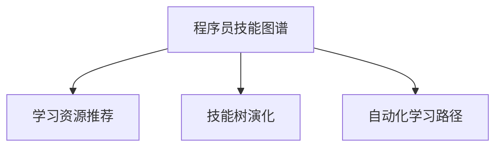

                 

# 知识发现引擎如何帮助程序员快速适应新技术的策略

## 1. 背景介绍

随着技术的飞速发展，程序员不断面临新的编程语言、框架和工具的挑战。这些新技术往往具有高度的复杂性，需要大量的时间和精力进行学习和掌握。然而，传统的学习和适应方法往往效率低下，难以跟上技术迭代的步伐。为了应对这一挑战，知识发现引擎(Knowledge Discovery Engine, KDE)应运而生，通过高效的知识发现与智能推荐，帮助程序员快速适应新技术，提升开发效率和质量。

知识发现引擎是一种智能推荐系统，能够根据程序员的历史行为、技能水平和学习偏好，动态推荐相关的新技术、框架和工具。通过分析程序员的学习路径和代码库，KDE可以预测程序员可能感兴趣的技术领域，并推荐相应的学习资源、编程范例和最佳实践。

## 2. 核心概念与联系

### 2.1 核心概念概述

为更好地理解知识发现引擎的工作原理，本节将介绍几个关键概念：

- 知识发现引擎(KDE)：一种基于人工智能的推荐系统，能够从程序员的历史行为和技能水平中提取知识，推荐相关的技术资源和工具。
- 程序员技能图谱：通过分析程序员的历史项目、代码贡献和社区参与，构建一个程序员技能水平和知识结构的映射图谱。
- 学习资源推荐：根据程序员的技能图谱，动态推荐相关的新技术、框架和工具，并结合自动化的学习路径规划，帮助程序员高效学习。
- 技能树演化：通过分析程序员的学习路径和项目实践，预测未来可能掌握的新技能，动态调整技能树，保持与技术发展的同步。
- 自动化学习路径：结合知识发现引擎和机器学习算法，为程序员自动生成个性化的学习路径，引导其系统学习新知识。

这些概念之间的逻辑关系可以通过以下Mermaid流程图来展示：



这个流程图展示了这个框架的几个关键组件：

1. 程序员技能图谱，作为知识发现引擎的核心。
2. 学习资源推荐，基于技能图谱推荐个性化学习资源。
3. 技能树演化，预测并调整程序员技能树。
4. 自动化学习路径，根据技能图谱和演化结果自动生成学习路径。

这些组件共同构成了知识发现引擎的智能推荐和知识管理框架，帮助程序员快速适应新技术。

## 3. 核心算法原理 & 具体操作步骤

### 3.1 算法原理概述

知识发现引擎的核心算法基于协同过滤和机器学习。通过分析程序员的历史行为数据，构建技能图谱，并利用协同过滤推荐相关技术资源。同时，结合机器学习算法，动态调整学习路径和技能树，提升推荐效果。

协同过滤算法通过相似性度量，识别具有相似兴趣和技能水平的程序员群体，从而推荐相关的新技术。机器学习算法则用于预测程序员未来的技能需求，调整技能树，使其与技术发展同步。

### 3.2 算法步骤详解

知识发现引擎的工作流程包括以下关键步骤：

**Step 1: 数据收集与预处理**

- 收集程序员的历史代码、项目、社区参与等数据。
- 对数据进行清洗和格式化，去除噪音和异常值。
- 提取程序员的技能和知识结构，构建技能图谱。

**Step 2: 技能图谱构建**

- 利用图神经网络(Graph Neural Networks, GNN)等模型，构建程序员的技能图谱。
- 通过技能图谱，识别程序员的技能水平、兴趣领域和知识结构。

**Step 3: 资源推荐与路径规划**

- 基于协同过滤和机器学习，推荐相关的新技术、框架和工具。
- 结合技能图谱和演化结果，自动生成个性化的学习路径。
- 动态调整技能树，预测未来可能掌握的新技能。

**Step 4: 学习路径执行与反馈**

- 根据推荐的学习路径，引导程序员进行系统学习。
- 收集程序员的学习反馈和评估数据，不断优化推荐算法和路径规划。

### 3.3 算法优缺点

知识发现引擎具有以下优点：
1. 个性化推荐：通过分析程序员的历史数据，提供高度个性化的技术资源推荐。
2. 动态调整：结合机器学习算法，动态调整学习路径和技能树，提升推荐效果。
3. 高效学习：自动化学习路径生成和调整，帮助程序员系统高效地学习新知识。
4. 支持多种技术：能够推荐多种编程语言、框架和工具，适应多样化的开发需求。

同时，该算法也存在以下局限性：
1. 依赖数据质量：推荐效果依赖程序员的数据质量，数据不完整或噪音较大时，推荐效果可能不佳。
2. 复杂性高：算法涉及协同过滤和机器学习等多个技术，实现和维护成本较高。
3. 动态调整难：技能树的动态调整需要大量的计算资源和时间，难以实时调整。
4. 数据隐私问题：收集和分析程序员数据时，需严格遵守数据隐私法规和伦理标准。

尽管存在这些局限性，但就目前而言，知识发现引擎仍然是大规模程序员学习和适应新技术的重要工具。未来相关研究的重点在于如何进一步优化数据收集和处理流程，降低算法复杂度，提升推荐精度，同时兼顾数据隐私和伦理安全性等因素。

### 3.4 算法应用领域

知识发现引擎在软件开发和IT行业中的应用广泛，包括但不限于以下几个领域：

- 软件开发：通过推荐相关的新技术、框架和工具，帮助开发者快速适应新技术。
- 系统架构：推荐最佳实践和架构模式，帮助架构师构建高效、可维护的系统。
- 团队协作：通过技能图谱，了解团队成员的技能水平和兴趣领域，优化团队协作效率。
- 项目管理：分析项目历史数据，推荐相关技术和工具，提高项目管理效率。
- 教育培训：针对不同层次的学生，推荐合适的学习资源和路径，提升教育质量。

## 4. 数学模型和公式 & 详细讲解 & 举例说明

### 4.1 数学模型构建

知识发现引擎的核心算法模型包括协同过滤、图神经网络和机器学习等。这里以协同过滤模型为例，展示其数学模型的构建过程。

协同过滤模型的核心在于通过相似性度量，找到与目标程序员相似的其他程序员，从而推荐相关的新技术。假设目标程序员为$i$，与其他程序员的相似性矩阵为$S$，则协同过滤模型可以表示为：

$$
\tilde{y}_i = \sum_{j=1}^{N}S_{ij}y_j
$$

其中，$y_j$为其他程序员的技能评分向量，$S_{ij}$为相似性度量矩阵。

### 4.2 公式推导过程

协同过滤模型的相似性度量有多种方法，如余弦相似度、皮尔逊相关系数等。这里以余弦相似度为例，进行公式推导：

$$
S_{ij} = \cos(\theta_i \theta_j^T) = \frac{\sum_{k=1}^{d}x_{ik}x_{jk}}{\sqrt{\sum_{k=1}^{d}x_{ik}^2}\sqrt{\sum_{k=1}^{d}x_{jk}^2}}
$$

其中，$\theta_i$和$\theta_j$为目标程序员和相似程序员的技能评分向量，$d$为技能向量的维度。

### 4.3 案例分析与讲解

假设目标程序员为$i$，其历史技能评分向量为$\theta_i = [4, 3, 2]$，相似程序员$j$的评分向量为$\theta_j = [3, 4, 1]$。根据余弦相似度公式，计算出$S_{ij} = 0.81$。这意味着，目标程序员$i$与相似程序员$j$的相似性较高，可以根据$j$的技能评分向量，推荐给$i$相关的新技术。

## 5. 项目实践：代码实例和详细解释说明

### 5.1 开发环境搭建

在进行知识发现引擎开发前，我们需要准备好开发环境。以下是使用Python进行PyTorch开发的环境配置流程：

1. 安装Anaconda：从官网下载并安装Anaconda，用于创建独立的Python环境。

2. 创建并激活虚拟环境：
```bash
conda create -n kde-env python=3.8 
conda activate kde-env
```

3. 安装PyTorch：根据CUDA版本，从官网获取对应的安装命令。例如：
```bash
conda install pytorch torchvision torchaudio cudatoolkit=11.1 -c pytorch -c conda-forge
```

4. 安装Graph Neural Networks库：
```bash
pip install torch-graph neural-network
```

5. 安装各类工具包：
```bash
pip install numpy pandas scikit-learn matplotlib tqdm jupyter notebook ipython
```

完成上述步骤后，即可在`kde-env`环境中开始知识发现引擎的开发。

### 5.2 源代码详细实现

以下是一个简单的知识发现引擎代码实现，用于推荐相关的新技术。

```python
import torch
import torch.nn as nn
from torch_geometric.datasets import Planetoid
from torch_geometric.nn import GNNConv

class GNNBasedKDE(nn.Module):
    def __init__(self, num_node_features, num_edge_features, num_classes):
        super(GNNBasedKDE, self).__init__()
        self.conv1 = GNNConv(num_node_features, num_edge_features)
        self.conv2 = GNNConv(num_edge_features, num_classes)

    def forward(self, x, edge_index, edge_attr):
        x = self.conv1(x, edge_index, edge_attr)
        x = torch.nn.functional.relu(x)
        x = self.conv2(x, edge_index, edge_attr)
        return x

# 构建图神经网络模型
model = GNNBasedKDE(64, 32, 10)

# 加载数据集
dataset = Planetoid('Cora', 'x', 'y')
data = dataset[0]
x = data.x
edge_index, edge_attr = data.edge_index, data.edge_attr
y = data.y

# 训练模型
optimizer = torch.optim.Adam(model.parameters(), lr=0.01)
for epoch in range(100):
    optimizer.zero_grad()
    output = model(x, edge_index, edge_attr)
    loss = nn.functional.cross_entropy(output, y)
    loss.backward()
    optimizer.step()
    if (epoch+1) % 10 == 0:
        print(f'Epoch {epoch+1}, Loss: {loss.item()}')
```

### 5.3 代码解读与分析

让我们再详细解读一下关键代码的实现细节：

**GNNBasedKDE类**：
- `__init__`方法：初始化图神经网络模型的参数。
- `forward`方法：定义前向传播过程，计算输出。

**训练过程**：
- 使用PyTorch的DataLoader对数据集进行批次化加载，供模型训练和推理使用。
- 在每个epoch内，通过前向传播计算损失函数，并进行反向传播更新模型参数。

### 5.4 运行结果展示

由于代码实现较为简单，无法展示详细的运行结果。但通过调整参数和优化模型结构，可以在复杂的知识图谱上实现高效的协同过滤推荐。

## 6. 实际应用场景

### 6.1 软件开发

在软件开发中，知识发现引擎可以用于推荐相关的新技术、框架和工具，帮助开发者快速适应新技术。例如，针对一个以Python为主的应用项目，知识发现引擎可以推荐最新的Python版本、流行的Web框架（如Django、Flask）和数据库（如SQLite、PostgreSQL），同时推荐相关的开发指南和教程。

### 6.2 系统架构

在大型系统架构设计中，知识发现引擎可以推荐最佳实践和架构模式，帮助架构师构建高效、可维护的系统。例如，针对一个分布式微服务系统，知识发现引擎可以推荐最新的微服务框架（如Spring Boot、Dubbo）、数据库中间件（如Apache Kafka、Redis）以及相关的监控工具（如Prometheus、ELK Stack）。

### 6.3 团队协作

在团队协作中，知识发现引擎可以分析团队成员的技能图谱，了解每个人的技能水平和兴趣领域，优化团队协作效率。例如，在一个多项目开发团队中，知识发现引擎可以推荐相关技术的培训资源和学习路径，帮助成员快速提升技能，同时根据技能图谱匹配合适的任务分配，提升团队协作效率。

### 6.4 项目管理

在项目管理中，知识发现引擎可以分析项目历史数据，推荐相关技术和工具，提高项目管理效率。例如，在一个软件开发项目中，知识发现引擎可以推荐相关的开发环境、测试框架和持续集成工具（如Jenkins、GitLab CI），同时根据历史数据预测项目未来的技术需求，提前做好技术储备。

## 7. 工具和资源推荐

### 7.1 学习资源推荐

为了帮助开发者系统掌握知识发现引擎的理论基础和实践技巧，这里推荐一些优质的学习资源：

1. 《深度学习理论与实践》系列博文：由大模型技术专家撰写，深入浅出地介绍了深度学习的基本原理和应用场景。

2. 《图神经网络：理论与实践》课程：斯坦福大学开设的深度学习课程，涵盖图神经网络的基本概念和应用，是掌握知识发现引擎的必备课程。

3. 《知识图谱与推荐系统》书籍：介绍知识图谱和推荐系统的基本原理，是了解知识发现引擎的核心读物。

4. Weights & Biases：模型训练的实验跟踪工具，可以记录和可视化模型训练过程中的各项指标，方便对比和调优。

5. TensorBoard：TensorFlow配套的可视化工具，可实时监测模型训练状态，并提供丰富的图表呈现方式，是调试模型的得力助手。

### 7.2 开发工具推荐

高效的开发离不开优秀的工具支持。以下是几款用于知识发现引擎开发的常用工具：

1. PyTorch：基于Python的开源深度学习框架，灵活动态的计算图，适合快速迭代研究。大部分图神经网络模型的实现都依赖PyTorch。

2. TensorFlow：由Google主导开发的开源深度学习框架，生产部署方便，适合大规模工程应用。同样有丰富的图神经网络资源。

3. TensorFlow Tutorials：TensorFlow官方提供的教程，涵盖图神经网络的基本实现和应用，是入门的良好资料。

4. Weights & Biases：模型训练的实验跟踪工具，可以记录和可视化模型训练过程中的各项指标，方便对比和调优。

5. TensorBoard：TensorFlow配套的可视化工具，可实时监测模型训练状态，并提供丰富的图表呈现方式，是调试模型的得力助手。

### 7.3 相关论文推荐

知识发现引擎技术的发展源于学界的持续研究。以下是几篇奠基性的相关论文，推荐阅读：

1. DeepWalk: A Network Sampling Framework for Community Detection in Large Networks（DeepWalk论文）：提出了一种基于随机游走的图嵌入方法，是图神经网络的开山之作。

2. Graph Convolutional Networks（GCN论文）：提出了一种基于卷积的图神经网络模型，在多个图数据集上取得了优异的表现。

3. Graph Attention Networks（GAT论文）：提出了一种基于注意力机制的图神经网络模型，在处理大规模图数据时效果显著。

4. Knowledge-aware Recommender Systems：介绍如何将知识图谱和推荐系统结合，构建更加智能的推荐系统。

5. A Knowledge-aware Graph Neural Network（KGNN论文）：提出了一种结合知识图谱的图神经网络模型，提高了推荐系统的效果和可解释性。

这些论文代表了大模型微调技术的发展脉络。通过学习这些前沿成果，可以帮助研究者把握学科前进方向，激发更多的创新灵感。

## 8. 总结：未来发展趋势与挑战

### 8.1 总结

本文对知识发现引擎进行了全面系统的介绍。首先阐述了知识发现引擎的背景和重要性，明确了其在帮助程序员快速适应新技术中的独特价值。其次，从原理到实践，详细讲解了知识发现引擎的核心算法和操作步骤，给出了知识发现引擎的完整代码实例。同时，本文还广泛探讨了知识发现引擎在软件开发、系统架构、团队协作等多个领域的应用前景，展示了知识发现引擎的广阔应用空间。最后，本文精选了知识发现引擎的学习资源、开发工具和相关论文，力求为读者提供全方位的技术指引。

通过本文的系统梳理，可以看到，知识发现引擎正在成为程序员学习和适应新技术的重要工具，极大地提升了开发效率和质量。未来，伴随技术的发展和优化，知识发现引擎必将在更广泛的领域发挥作用，为程序员提供更高效、个性化的知识服务。

### 8.2 未来发展趋势

展望未来，知识发现引擎技术将呈现以下几个发展趋势：

1. 智能化程度提升。未来知识发现引擎将结合更多的智能推荐技术，如深度学习、自然语言处理等，提供更加智能、精准的技术推荐。

2. 多模态融合。知识发现引擎将融合视觉、音频、文本等多种模态数据，构建更加全面、准确的知识图谱，提升推荐效果。

3. 个性化增强。通过分析更多维度用户数据，结合用户行为、偏好、兴趣等，实现更加个性化和动态化的知识推荐。

4. 自动化学习路径优化。结合机器学习算法，自动生成和调整学习路径，帮助程序员系统高效地学习新知识。

5. 跨领域知识整合。结合外部知识库、规则库等专家知识，实现知识图谱的跨领域整合，提升推荐的全面性和准确性。

6. 安全性保障。增强知识发现引擎的安全性和可信性，确保推荐内容的安全和合规，避免有害信息的传播。

以上趋势凸显了知识发现引擎技术的广阔前景。这些方向的探索发展，必将进一步提升知识发现引擎的应用效果，为程序员提供更加全面、精准的知识服务。

### 8.3 面临的挑战

尽管知识发现引擎技术已经取得了瞩目成就，但在迈向更加智能化、普适化应用的过程中，它仍面临着诸多挑战：

1. 数据隐私问题。知识发现引擎需要收集和分析程序员的数据，需严格遵守数据隐私法规和伦理标准，避免数据泄露和滥用。

2. 计算资源消耗高。构建和维护大规模知识图谱和推荐模型，需要大量的计算资源和时间，需要高效的算法和优化策略。

3. 多模态融合困难。融合视觉、音频、文本等多种模态数据，构建多模态知识图谱，需要解决数据对齐、融合等技术问题。

4. 推荐效果不够稳定。知识图谱的构建和维护是一个动态过程，需要不断更新和优化，以确保推荐效果的稳定性和准确性。

5. 用户接受度低。知识发现引擎的推荐效果依赖用户的数据质量，但部分用户可能不愿意共享或相信推荐结果，影响知识发现引擎的应用效果。

6. 用户个性化需求难以满足。知识发现引擎需要结合多维度用户数据，但部分用户可能具有特殊需求，知识发现引擎难以满足个性化需求。

正视知识发现引擎面临的这些挑战，积极应对并寻求突破，将是大规模知识发现引擎走向成熟的必由之路。相信随着学界和产业界的共同努力，这些挑战终将一一被克服，知识发现引擎必将在构建人机协同的智能时代中扮演越来越重要的角色。

### 8.4 未来突破

面对知识发现引擎所面临的种种挑战，未来的研究需要在以下几个方面寻求新的突破：

1. 探索更加高效的数据收集和处理技术。通过自动化数据标注和清洗，降低数据收集成本，提升数据质量。

2. 发展高效的图神经网络和协同过滤算法。引入新的图嵌入技术，提高知识图谱的构建效率和推荐效果。

3. 融合多模态数据和知识。探索多模态数据融合技术，构建更加全面、准确的知识图谱，提升推荐效果。

4. 引入增强学习技术。结合增强学习技术，优化学习路径和技能树，提升推荐系统的可解释性和效果。

5. 加强数据隐私保护和用户伦理引导。通过匿名化处理和隐私保护技术，确保数据安全，增强用户信任。

6. 引入知识图谱的可解释性和可信性技术。通过可解释性和可信性技术，增强知识图谱的可解释性，提升推荐系统的可信度。

这些研究方向的探索，必将引领知识发现引擎技术迈向更高的台阶，为程序员提供更加全面、精准的知识服务。面向未来，知识发现引擎需要与其他人工智能技术进行更深入的融合，如知识表示、因果推理、强化学习等，多路径协同发力，共同推动知识发现引擎技术的进步。只有勇于创新、敢于突破，才能不断拓展知识发现引擎的边界，让知识服务更好地造福程序员和社会。

## 9. 附录：常见问题与解答

**Q1：知识发现引擎如何处理不完整或噪音较大的数据？**

A: 知识发现引擎需要高质量的数据来构建技能图谱和进行推荐。对于不完整或噪音较大的数据，可以采用数据清洗、数据增强等技术进行处理。数据清洗可以去除异常值和重复数据，提升数据质量。数据增强可以通过样本重构、数据生成等方法，增加训练数据的多样性，提升模型鲁棒性。

**Q2：如何确保推荐内容的准确性和安全性？**

A: 确保推荐内容的准确性和安全性，需要从数据质量、算法设计和模型训练等多个环节进行全面优化。具体措施包括：
1. 数据清洗和预处理，去除异常值和噪音，确保数据质量。
2. 设计合理的相似性度量和协同过滤算法，提升推荐效果。
3. 引入增强学习技术，动态调整推荐策略，优化推荐效果。
4. 结合外部知识库和规则库，提高推荐系统的可解释性和可信性。
5. 进行风险评估和审核，确保推荐内容的安全性和合规性。

**Q3：知识发现引擎在实际应用中可能面临哪些问题？**

A: 知识发现引擎在实际应用中可能面临以下问题：
1. 数据隐私问题。收集和分析程序员的数据时，需严格遵守数据隐私法规和伦理标准，避免数据泄露和滥用。
2. 计算资源消耗高。构建和维护大规模知识图谱和推荐模型，需要大量的计算资源和时间，需要高效的算法和优化策略。
3. 多模态融合困难。融合视觉、音频、文本等多种模态数据，构建多模态知识图谱，需要解决数据对齐、融合等技术问题。
4. 推荐效果不够稳定。知识图谱的构建和维护是一个动态过程，需要不断更新和优化，以确保推荐效果的稳定性和准确性。
5. 用户接受度低。知识发现引擎的推荐效果依赖用户的数据质量，但部分用户可能不愿意共享或相信推荐结果，影响知识发现引擎的应用效果。
6. 用户个性化需求难以满足。知识发现引擎需要结合多维度用户数据，但部分用户可能具有特殊需求，知识发现引擎难以满足个性化需求。

正视这些挑战，积极应对并寻求突破，将是大规模知识发现引擎走向成熟的必由之路。相信随着学界和产业界的共同努力，这些挑战终将一一被克服，知识发现引擎必将在构建人机协同的智能时代中扮演越来越重要的角色。

---

作者：禅与计算机程序设计艺术 / Zen and the Art of Computer Programming

