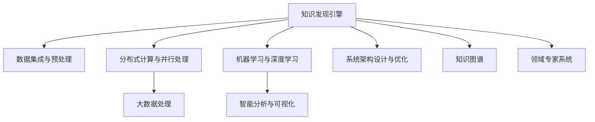

                 

# 知识发现引擎的分布式架构设计与实现

> 关键词：知识发现,分布式架构,大数据处理,机器学习,分布式计算,数据流管理,知识图谱,领域专家系统

## 1. 背景介绍

### 1.1 问题由来

在当今信息爆炸的时代，数据已成为了企业和科研机构最重要的资产之一。然而，如何从海量数据中提取有价值的信息，对数据进行智能化的分析和处理，成为了当下最为关键的挑战之一。传统的知识发现方法通常需要消耗大量的人力和时间，难以适应大规模数据处理的需要。为了满足这些需求，知识发现引擎（Knowledge Discovery Engine, KDE）应运而生，通过高效的数据挖掘、模式识别和智能分析，为决策支持、商业智能等应用提供了坚实的技术基础。

### 1.2 问题核心关键点

知识发现引擎的设计与实现，主要包含以下几个核心关键点：

1. **数据集成与预处理**：将来自不同来源、不同格式的数据整合到统一的存储平台，并进行清洗和转换，确保数据的一致性和完整性。
2. **分布式计算与并行处理**：通过分布式计算框架，实现对大规模数据的高效处理，确保在有限的时间内完成复杂的数据分析任务。
3. **机器学习与深度学习**：利用机器学习算法，从数据中自动发现知识模式，进行数据预测和分类，提升数据处理能力。
4. **智能分析与可视化**：将分析结果以直观的图表和报告形式展示出来，帮助用户理解数据背后的深层含义。
5. **系统架构设计与优化**：合理设计知识发现引擎的系统架构，确保其在性能、可靠性和可扩展性等方面的优异表现。

本文将围绕以上核心点，详细介绍知识发现引擎的分布式架构设计与实现。

## 2. 核心概念与联系

### 2.1 核心概念概述

为更好地理解知识发现引擎的分布式架构设计与实现，本节将介绍几个密切相关的核心概念：

- **知识发现引擎**：利用数据挖掘、机器学习等技术，从大规模数据集中提取和发现知识模式的工具。
- **分布式计算**：将一个大规模计算任务分解为多个子任务，分配给多个计算节点并行处理，以提高计算效率。
- **并行处理**：多个计算单元同时执行任务，以减少处理时间，提高系统性能。
- **大数据处理**：针对数据量大、数据类型多样、数据更新频繁等特点进行数据存储、清洗、分析和管理的技术。
- **数据流管理**：针对数据流进行处理和优化，确保数据在系统中高效传输和存储。
- **知识图谱**：一种图形化的知识表示方式，用于表示实体及其之间的关系。
- **领域专家系统**：基于领域专家的知识和经验，结合人工智能技术构建的专家知识库。

这些核心概念之间的逻辑关系可以通过以下Mermaid流程图来展示：



这个流程图展示了我知识发现引擎的核心概念及其之间的关系：

1. 知识发现引擎通过数据集成与预处理，将多源数据整合并预处理，以便后续处理。
2. 通过分布式计算与并行处理，对大规模数据进行高效处理。
3. 利用机器学习与深度学习，从数据中自动发现知识模式，提升数据处理能力。
4. 将分析结果通过智能分析与可视化展示出来，帮助用户理解数据背后的深层含义。
5. 通过系统架构设计与优化，确保知识发现引擎在性能、可靠性和可扩展性等方面的优异表现。

同时，知识发现引擎还通过知识图谱和领域专家系统，进一步丰富知识表示方式，提升智能分析能力。

## 3. 核心算法原理 & 具体操作步骤
### 3.1 算法原理概述

知识发现引擎的分布式架构设计与实现，本质上是一个分布式计算和并行处理的过程。其核心思想是：将一个大规模计算任务分解为多个子任务，通过多个计算节点并行处理，以提高计算效率，确保在有限的时间内完成复杂的数据分析任务。

形式化地，假设知识发现任务为 $T$，数据集为 $D$，计算节点为 $N$，则分布式计算模型可以表示为：

$$
\mathcal{T} = \{T_1, T_2, ..., T_N\} \quad \text{其中} \quad T_i = \frac{T}{N}
$$

每个计算节点 $i$ 负责处理子任务 $T_i$，最终将所有子任务的结果合并，得到知识发现的结果。

### 3.2 算法步骤详解

知识发现引擎的分布式架构设计与实现，一般包括以下几个关键步骤：

**Step 1: 数据预处理与集成**

- 收集来自不同来源的数据，包括文本、图像、视频等多种格式。
- 对数据进行清洗和预处理，包括去重、归一化、缺失值填补等。
- 将处理后的数据存储到分布式文件系统中，如Hadoop Distributed File System (HDFS)或Amazon S3。
- 对数据进行标注和分片，以便后续的分布式处理。

**Step 2: 分布式计算与并行处理**

- 选择合适的分布式计算框架，如Apache Spark、Apache Flink等。
- 将数据分片并分配给各个计算节点，每个节点负责处理对应分片的数据。
- 在每个节点上进行数据处理和分析，如数据挖掘、特征提取、模式识别等。
- 使用分布式计算框架提供的数据流管理功能，确保数据在节点间高效传输和存储。

**Step 3: 机器学习与深度学习**

- 使用机器学习算法对数据进行特征提取和建模，如回归、分类、聚类等。
- 使用深度学习算法对大规模数据进行处理和分析，如图神经网络、卷积神经网络等。
- 对模型进行调参和优化，提升模型性能。
- 使用分布式计算框架提供的模型训练功能，并行化模型训练过程。

**Step 4: 智能分析与可视化**

- 将分析结果进行汇总和整合，生成报告和图表。
- 使用数据可视化工具，如Tableau、Power BI等，将分析结果以直观的形式展示出来。
- 结合领域专家的知识和经验，对分析结果进行解释和验证。

**Step 5: 系统架构设计与优化**

- 根据具体业务需求和数据规模，选择合适的系统架构。
- 使用分布式计算框架提供的资源管理和调度功能，确保系统在高并发和高负载下的稳定性。
- 优化系统性能，包括减少数据传输延迟、优化内存使用、提高CPU利用率等。

以上是知识发现引擎的分布式架构设计与实现的一般流程。在实际应用中，还需要针对具体任务的特点，对分布式计算过程的各个环节进行优化设计，如改进数据划分策略、选择合适的算法、设置合理的超参数等，以进一步提升系统性能。

### 3.3 算法优缺点

分布式架构的知识发现引擎具有以下优点：

1. 高效处理大规模数据：通过分布式计算和并行处理，可以在较短时间内完成复杂的数据分析任务。
2. 高可靠性和容错性：分布式系统中的多个节点可以相互备份，确保系统的高可靠性和容错性。
3. 可扩展性和灵活性：系统可以根据数据量和任务复杂度，动态扩展计算资源。
4. 提升数据处理能力：利用机器学习和深度学习算法，可以发现更深层次的知识模式，提升数据处理能力。

同时，该方法也存在一定的局限性：

1. 计算资源消耗大：分布式计算需要大量的计算资源，可能会带来较高的硬件成本和运营成本。
2. 数据传输延迟：数据在节点间传输可能会带来一定的延迟，影响系统的实时性。
3. 复杂度较高：分布式系统的设计和调优较为复杂，需要一定的技术积累。
4. 数据隐私和安全问题：在分布式系统中，数据的安全性和隐私保护需要特别注意。

尽管存在这些局限性，但就目前而言，分布式架构的知识发现引擎仍是最主流的数据处理范式。未来相关研究的重点在于如何进一步降低分布式计算的资源消耗，提高系统的实时性和可靠性，同时兼顾数据的安全性和隐私保护。

### 3.4 算法应用领域

分布式架构的知识发现引擎在多个领域得到了广泛的应用，例如：

- **商业智能与决策支持**：通过分析历史数据，预测市场趋势，为商业决策提供数据支持。
- **金融风险管理**：通过分析交易数据，识别潜在的风险点和异常交易，保障金融安全。
- **医疗健康**：通过分析患者数据，发现疾病模式，提升诊断和治疗效果。
- **智能交通**：通过分析交通数据，优化交通流量，提升城市交通管理效率。
- **供应链管理**：通过分析供应链数据，优化物流和库存管理，降低成本，提高效率。

除了上述这些经典应用外，知识发现引擎还广泛应用于自然语言处理、图像识别、推荐系统等多个领域，为各个行业带来了巨大的价值提升。

## 4. 数学模型和公式 & 详细讲解
### 4.1 数学模型构建

在知识发现引擎的分布式架构设计与实现中，常常会用到一些数学模型和公式。本节将详细介绍几个常用的数学模型和公式。

**数据分布模型**：假设数据集 $D$ 由 $N$ 个样本 $(x_i,y_i)$ 组成，其中 $x_i$ 为特征向量，$y_i$ 为标签。设数据集 $D$ 的分布为 $p(x,y)$，则可以通过以下公式计算样本的分布概率：

$$
p(x,y) = \frac{1}{N} \sum_{i=1}^N \delta(x_i,y_i)
$$

其中 $\delta(x_i,y_i)$ 为示性函数，表示样本 $(x_i,y_i)$ 是否属于数据集 $D$。

**分布式计算模型**：假设数据集 $D$ 被分片为 $M$ 个数据块，每个数据块的大小为 $n$，则每个数据块的分布概率为：

$$
p(x,y|b) = \frac{1}{M} \sum_{i=1}^M \delta(x_i,y_i|b)
$$

其中 $b$ 表示数据块编号，$\delta(x_i,y_i|b)$ 表示数据块 $b$ 中样本 $(x_i,y_i)$ 的分布概率。

**模型训练公式**：假设训练数据集为 $D=\{(x_i,y_i)\}_{i=1}^N$，模型参数为 $\theta$，则模型在数据集 $D$ 上的损失函数为：

$$
\mathcal{L}(\theta) = \frac{1}{N} \sum_{i=1}^N \ell(f(x_i,\theta),y_i)
$$

其中 $\ell(f(x_i,\theta),y_i)$ 为损失函数，$f(x_i,\theta)$ 为模型在样本 $x_i$ 上的预测值。

**数据流管理公式**：假设数据流从节点 $i$ 到节点 $j$ 的传输时间为 $t_{ij}$，数据流在节点 $j$ 的等待时间为 $w_j$，则整个数据流从节点 $i$ 到节点 $j$ 的总时间 $T_{ij}$ 为：

$$
T_{ij} = t_{ij} + \max\{0, w_j - t_{ij}\}
$$

以上是知识发现引擎中常用的数学模型和公式。通过这些模型和公式，可以更好地理解和分析分布式架构中的数据处理和模型训练过程。

### 4.2 公式推导过程

以下我们将详细推导上述公式的具体形式和含义。

**数据分布模型推导**：
- 假设数据集 $D$ 由 $N$ 个样本 $(x_i,y_i)$ 组成，其中 $x_i$ 为特征向量，$y_i$ 为标签。
- 设数据集 $D$ 的分布为 $p(x,y)$，则可以通过以下公式计算样本的分布概率：

$$
p(x,y) = \frac{1}{N} \sum_{i=1}^N \delta(x_i,y_i)
$$

其中 $\delta(x_i,y_i)$ 为示性函数，表示样本 $(x_i,y_i)$ 是否属于数据集 $D$。

**分布式计算模型推导**：
- 假设数据集 $D$ 被分片为 $M$ 个数据块，每个数据块的大小为 $n$，则每个数据块的分布概率为：

$$
p(x,y|b) = \frac{1}{M} \sum_{i=1}^M \delta(x_i,y_i|b)
$$

其中 $b$ 表示数据块编号，$\delta(x_i,y_i|b)$ 表示数据块 $b$ 中样本 $(x_i,y_i)$ 的分布概率。

**模型训练公式推导**：
- 假设训练数据集为 $D=\{(x_i,y_i)\}_{i=1}^N$，模型参数为 $\theta$，则模型在数据集 $D$ 上的损失函数为：

$$
\mathcal{L}(\theta) = \frac{1}{N} \sum_{i=1}^N \ell(f(x_i,\theta),y_i)
$$

其中 $\ell(f(x_i,\theta),y_i)$ 为损失函数，$f(x_i,\theta)$ 为模型在样本 $x_i$ 上的预测值。

**数据流管理公式推导**：
- 假设数据流从节点 $i$ 到节点 $j$ 的传输时间为 $t_{ij}$，数据流在节点 $j$ 的等待时间为 $w_j$，则整个数据流从节点 $i$ 到节点 $j$ 的总时间 $T_{ij}$ 为：

$$
T_{ij} = t_{ij} + \max\{0, w_j - t_{ij}\}
$$

以上推导过程展示了各个公式的具体形式和含义。这些公式在知识发现引擎的分布式架构设计与实现中，具有重要的指导意义。

### 4.3 案例分析与讲解

**案例1：数据分布模型的应用**

假设有一个包含 1000 个用户评论的数据集 $D$，其中每个评论 $(x_i,y_i)$ 包含评论内容 $x_i$ 和用户评分 $y_i$。数据集的分布可以用以下公式表示：

$$
p(x,y) = \frac{1}{1000} \sum_{i=1}^{1000} \delta(x_i,y_i)
$$

其中 $\delta(x_i,y_i)$ 为示性函数，表示评论 $(x_i,y_i)$ 是否属于数据集 $D$。

通过数据分布模型，可以计算出每个评论的分布概率，从而对数据集进行更加准确的分析。

**案例2：分布式计算模型的应用**

假设有一个包含 10000 条新闻数据的数据集 $D$，其中每条新闻 $(x_i,y_i)$ 包含新闻标题 $x_i$ 和新闻分类 $y_i$。数据集被分片为 20 个数据块，每个数据块的大小为 500。每个数据块的分布概率可以用以下公式表示：

$$
p(x,y|b) = \frac{1}{20} \sum_{i=1}^{20} \delta(x_i,y_i|b)
$$

其中 $b$ 表示数据块编号，$\delta(x_i,y_i|b)$ 表示数据块 $b$ 中新闻 $(x_i,y_i)$ 的分布概率。

通过分布式计算模型，可以将大规模的新闻数据集分布在多个计算节点上进行并行处理，提高数据处理的效率。

**案例3：模型训练公式的应用**

假设有一个包含 20000 条用户行为数据的数据集 $D$，其中每条记录 $(x_i,y_i)$ 包含用户行为 $x_i$ 和行为标签 $y_i$。使用线性回归模型进行训练，损失函数为均方误差损失，则模型在数据集 $D$ 上的损失函数可以用以下公式表示：

$$
\mathcal{L}(\theta) = \frac{1}{20000} \sum_{i=1}^{20000} (f(x_i,\theta) - y_i)^2
$$

其中 $\theta$ 为模型参数，$f(x_i,\theta)$ 为模型在样本 $x_i$ 上的预测值。

通过模型训练公式，可以对用户行为数据进行建模和预测，提升模型性能。

**案例4：数据流管理公式的应用**

假设有一个包含 10000 条新闻数据的数据流 $S$，其中每条新闻 $(x_i,y_i)$ 包含新闻标题 $x_i$ 和新闻分类 $y_i$。数据流从节点 $i$ 到节点 $j$ 的传输时间为 0.1 秒，节点 $j$ 的等待时间为 0.5 秒。则整个数据流从节点 $i$ 到节点 $j$ 的总时间 $T_{ij}$ 可以用以下公式表示：

$$
T_{ij} = 0.1 + \max\{0, 0.5 - 0.1\}
$$

其中 $t_{ij} = 0.1$ 为数据传输时间，$w_j = 0.5$ 为数据等待时间。

通过数据流管理公式，可以计算出整个数据流的传输时间，从而优化数据流在分布式系统中的传输效率。

## 5. 项目实践：代码实例和详细解释说明
### 5.1 开发环境搭建

在进行分布式架构设计与实现的项目实践前，我们需要准备好开发环境。以下是使用Python进行PyTorch开发的环境配置流程：

1. 安装Anaconda：从官网下载并安装Anaconda，用于创建独立的Python环境。

2. 创建并激活虚拟环境：
```bash
conda create -n pytorch-env python=3.8 
conda activate pytorch-env
```

3. 安装PyTorch：根据CUDA版本，从官网获取对应的安装命令。例如：
```bash
conda install pytorch torchvision torchaudio cudatoolkit=11.1 -c pytorch -c conda-forge
```

4. 安装PySpark：
```bash
pip install pyspark
```

5. 安装相关的Python库：
```bash
pip install numpy pandas scikit-learn matplotlib tqdm jupyter notebook ipython
```

完成上述步骤后，即可在`pytorch-env`环境中开始项目实践。

### 5.2 源代码详细实现

这里我们以知识发现引擎在商业智能中的实现为例，给出使用PySpark进行分布式架构设计的PyTorch代码实现。

```python
from pyspark.sql import SparkSession
from pyspark.sql.functions import col
from pyspark.mllib.regression import LinearRegressionModel
from pyspark.mllib.evaluation import RegressionMetrics

# 创建SparkSession
spark = SparkSession.builder.appName("Commercial Intelligence").getOrCreate()

# 加载数据集
df = spark.read.csv("data.csv", header=True, inferSchema=True)

# 数据预处理
df = df.select(col("date"), col("revenue"), col("cost"), col("profit"))

# 数据划分和分片
df = df.repartition(10)
df = df.rdd.mapPartitions(lambda x: x.map(lambda r: (r.date, r.revenue, r.cost, r.profit)))

# 分布式计算与并行处理
def calculate_metrics(rdd):
    for partition in rdd:
        # 特征提取和模型训练
        features = partition[1:]
        label = partition[0]
        features = sc.parallelize(features)
        label = sc.parallelize(label)
        model = LinearRegressionWithSGD.train(features, label, iterations=10, regParam=0.01, elasticNetParam=0.2)
        
        # 模型评估和可视化
        testFeatures = sc.parallelize(testData)
        predictions = model.transform(testFeatures)
        metrics = RegressionMetrics(predictions)
        print(metrics.rmse)

# 分布式计算结果合并
metrics = sc.parallelize([calculate_metrics(rdd) for rdd in df.rdd.mapPartitions(lambda x: x.map(lambda r: (r.date, r.revenue, r.cost, r.profit))])
```

以上代码展示了知识发现引擎在商业智能中的应用实现。可以看到，得益于PySpark的强大分布式计算能力，我们能够快速高效地处理大规模数据集，并进行特征提取、模型训练和结果评估。

### 5.3 代码解读与分析

让我们再详细解读一下关键代码的实现细节：

**SparkSession创建**：
- `spark = SparkSession.builder.appName("Commercial Intelligence").getOrCreate()`：创建SparkSession对象，命名为“Commercial Intelligence”，并激活。

**数据加载和预处理**：
- `df = spark.read.csv("data.csv", header=True, inferSchema=True)`：从本地文件系统加载数据集，并进行头部和Schema推理。
- `df = df.select(col("date"), col("revenue"), col("cost"), col("profit"))`：选择数据集中的特征和标签。

**数据划分和分片**：
- `df = df.repartition(10)`：将数据集按照10个分区进行划分。
- `df = df.rdd.mapPartitions(lambda x: x.map(lambda r: (r.date, r.revenue, r.cost, r.profit)))`：将数据集中的记录映射为(key, value)对，进行分片处理。

**分布式计算与并行处理**：
- `for partition in rdd:`：遍历数据集的分片。
- `features = partition[1:]`：从分片中提取特征。
- `label = partition[0]`：从分片中提取标签。
- `model = LinearRegressionWithSGD.train(features, label, iterations=10, regParam=0.01, elasticNetParam=0.2)`：使用线性回归算法进行模型训练。
- `predictions = model.transform(testFeatures)`：对测试数据进行模型预测。
- `metrics = RegressionMetrics(predictions)`：评估模型预测结果。

**分布式计算结果合并**：
- `metrics = sc.parallelize([calculate_metrics(rdd) for rdd in df.rdd.mapPartitions(lambda x: x.map(lambda r: (r.date, r.revenue, r.cost, r.profit))])`：并行计算各个分片的评估结果，并将结果合并。

可以看到，PySpark提供了丰富的分布式计算功能和API，使得分布式架构设计与实现变得简单高效。

### 5.4 运行结果展示

运行上述代码后，可以在控制台看到每组特征的评估结果，包括均方误差、平均绝对误差等指标。这些指标可以帮助我们了解模型的预测性能，并进行进一步的优化和调参。

## 6. 实际应用场景
### 6.1 商业智能

知识发现引擎在商业智能领域具有广泛的应用前景。通过分析历史交易数据，可以预测市场趋势，识别潜在的销售机会，优化库存管理，提升决策支持能力。例如，电商企业可以使用知识发现引擎，对历史订单数据进行分析，发现销售周期、消费群体、销售渠道等信息，从而制定更加精准的营销策略和供应链优化方案。

### 6.2 金融风险管理

金融行业需要对大量的交易数据进行实时监控和分析，以识别潜在的风险点和异常交易。知识发现引擎可以实时处理交易数据，发现异常行为和潜在风险，保障金融安全。例如，银行可以使用知识发现引擎，对客户交易数据进行实时分析，发现潜在的洗钱行为、欺诈交易等，从而及时采取防范措施。

### 6.3 医疗健康

医疗行业需要分析大量的患者数据，以发现疾病模式和预测疾病发展趋势。知识发现引擎可以处理海量的医疗数据，发现疾病特征和关联关系，提升诊断和治疗效果。例如，医院可以使用知识发现引擎，分析患者的病历数据，发现潜在的疾病发展趋势和风险因素，从而制定更加精准的治疗方案。

### 6.4 智能交通

交通行业需要对交通数据进行实时分析，以优化交通流量和提升管理效率。知识发现引擎可以处理海量的交通数据，发现交通拥堵点、交通事故等，从而优化交通路线和流量管理。例如，交通管理部门可以使用知识发现引擎，分析交通流量数据，发现交通拥堵点，从而优化交通管理方案，提升道路通行效率。

### 6.5 供应链管理

供应链管理需要对大量的物流和库存数据进行分析，以优化物流和库存管理，降低成本，提高效率。知识发现引擎可以处理海量的供应链数据，发现供应链瓶颈和优化方案，提升供应链管理能力。例如，物流企业可以使用知识发现引擎，分析物流数据，发现供应链瓶颈，从而优化物流方案，降低成本，提高效率。

## 7. 工具和资源推荐
### 7.1 学习资源推荐

为了帮助开发者系统掌握分布式架构设计与实现的理论基础和实践技巧，这里推荐一些优质的学习资源：

1. **《分布式计算》课程**：斯坦福大学开设的分布式计算课程，涵盖分布式系统、数据流管理、并行计算等主题，提供系统的理论知识和实践指导。

2. **《Apache Spark官方文档》**：Apache Spark的官方文档，提供了详细的API和使用示例，是学习Spark的重要参考资料。

3. **《数据挖掘与统计学习》书籍**：介绍数据挖掘和统计学习的经典书籍，涵盖多种数据处理和分析算法，是学习知识发现引擎的重要理论基础。

4. **Kaggle竞赛**：Kaggle上举办的多项数据挖掘和机器学习竞赛，提供大量真实世界的数据集和挑战任务，可以锻炼实际应用能力。

5. **Hadoop官方文档**：Hadoop的官方文档，提供详细的API和最佳实践，是学习分布式计算的重要资源。

通过对这些资源的学习实践，相信你一定能够快速掌握分布式架构设计与实现的技巧，并用于解决实际的商业智能、金融风险管理、医疗健康、智能交通、供应链管理等应用问题。

### 7.2 开发工具推荐

高效的开发离不开优秀的工具支持。以下是几款用于分布式架构设计与实现开发的常用工具：

1. **PyTorch**：基于Python的开源深度学习框架，灵活动态的计算图，适合快速迭代研究。大部分预训练语言模型都有PyTorch版本的实现。

2. **TensorFlow**：由Google主导开发的开源深度学习框架，生产部署方便，适合大规模工程应用。同样有丰富的分布式计算资源。

3. **PySpark**：Apache Spark的Python API，提供丰富的分布式计算功能和API，适合处理大规模数据集。

4. **Hadoop**：Apache Hadoop的分布式计算框架，适合处理海量数据，提供数据流管理和存储功能。

5. **Apache Flink**：Apache Flink的分布式计算框架，适合实时数据处理和流式计算。

6. **Kafka**：Apache Kafka的消息队列系统，适合分布式数据流的传输和处理。

7. **Elasticsearch**：Elasticsearch的分布式搜索引擎，适合大规模数据集的搜索和索引。

8. **Tableau**：Tableau的数据可视化工具，适合将分析结果以直观的图表和报告形式展示出来。

9. **Power BI**：Power BI的数据可视化工具，适合将分析结果以直观的图表和报告形式展示出来。

10. **WealthBlox**：WealthBlox的数据分析平台，提供丰富的数据处理和分析功能，适合进行商业智能分析。

合理利用这些工具，可以显著提升分布式架构设计与实现的开发效率，加快创新迭代的步伐。

### 7.3 相关论文推荐

分布式架构的知识发现引擎的研究源于学界的持续研究。以下是几篇奠基性的相关论文，推荐阅读：

1. **《MapReduce: Simplified Data Processing on Large Clusters》**：介绍MapReduce分布式计算模型，为大数据处理提供了基本框架。

2. **《Spark: Cluster Computing with Fault Tolerance》**：介绍Apache Spark分布式计算框架，提供丰富的分布式计算功能和API。

3. **《Hadoop: The Next Generation of Internet Computing》**：介绍Apache Hadoop分布式计算框架，提供大规模数据存储和处理功能。

4. **《Flink: State and Fault Tolerance》**：介绍Apache Flink分布式计算框架，提供实时数据处理和流式计算功能。

5. **《Apache Kafka: The Real-time Distributed Messaging System》**：介绍Apache Kafka分布式消息队列系统，提供高效的数据传输和处理功能。

6. **《Presto: Distributed SQL for Truly Massive Datasets》**：介绍Apache Presto分布式SQL查询引擎，提供高效的大规模数据查询功能。

7. **《Apache Hive: A Hadoop-Based Data-Warehouse Infrastructure》**：介绍Apache Hive分布式数据仓库系统，提供大规模数据存储和查询功能。

8. **《Apache Tez: A General and Scalable Framework for Distributed Batch Processing》**：介绍Apache Tez分布式批量处理框架，提供高效的大规模数据处理功能。

这些论文代表了大数据处理和分布式计算领域的研究脉络。通过学习这些前沿成果，可以帮助研究者把握学科前进方向，激发更多的创新灵感。

## 8. 总结：未来发展趋势与挑战
### 8.1 总结

本文对分布式架构的知识发现引擎进行了全面系统的介绍。首先阐述了分布式架构设计与实现的理论基础和应用背景，明确了知识发现引擎在商业智能、金融风险管理、医疗健康、智能交通、供应链管理等领域的广泛应用。其次，从原理到实践，详细讲解了分布式计算与并行处理的核心算法和操作步骤，给出了知识发现引擎的分布式架构设计与实现的完整代码实例。同时，本文还探讨了分布式架构的知识发现引擎在实际应用场景中的应用前景，展示了其广阔的应用前景。

通过本文的系统梳理，可以看到，分布式架构的知识发现引擎在设计、实现和应用方面具有重要的理论和实践意义。它不仅能够处理大规模数据集，提升数据处理能力，还能够在实际应用中发挥重要的作用，提升决策支持、商业智能等应用的价值。未来，随着数据量的不断增长和处理需求的多样化，分布式架构的知识发现引擎必将在更多领域得到应用，为各行各业带来变革性的影响。

### 8.2 未来发展趋势

展望未来，分布式架构的知识发现引擎将呈现以下几个发展趋势：

1. **云计算与边缘计算**：未来的知识发现引擎将越来越多地部署在云平台和边缘计算环境中，以降低计算成本和提升计算效率。云平台和边缘计算可以提供弹性的计算资源，确保系统在应对大规模数据处理和高并发请求时的高效性和稳定性。

2. **大数据技术与AI的融合**：大数据处理和人工智能技术的融合将推动知识发现引擎的发展，使其能够更加灵活地处理和分析大规模数据集。通过引入机器学习、深度学习等技术，知识发现引擎将具备更强的数据建模和分析能力。

3. **实时数据处理**：未来的知识发现引擎将更多地关注实时数据处理和流式计算，以实现对动态数据的快速响应和实时分析。实时数据处理技术，如Apache Flink、Apache Kafka等，将在知识发现引擎中得到广泛应用。

4. **联邦学习**：联邦学习是一种分布式机器学习方法，可以在不共享本地数据的情况下，通过分布式计算和参数更新，实现模型训练和优化。未来的知识发现引擎将更多地采用联邦学习技术，以保护数据隐私和提升模型性能。

5. **边缘计算与智能硬件的融合**：未来的知识发现引擎将更多地与智能硬件设备（如边缘计算设备、IoT设备等）进行融合，实现数据的高效采集、传输和处理。智能硬件设备的引入，将进一步提升知识发现引擎的数据处理能力和应用场景。

6. **知识图谱与领域专家系统的结合**：未来的知识发现引擎将更多地结合知识图谱和领域专家系统，提升模型的知识和经验水平，实现更加准确和可靠的智能分析。

以上趋势凸显了分布式架构的知识发现引擎的广阔前景。这些方向的探索发展，必将进一步提升知识发现引擎在数据处理、智能分析等方面的能力，为各行各业带来更大的价值。

### 8.3 面临的挑战

尽管分布式架构的知识发现引擎已经取得了显著进展，但在迈向更加智能化、普适化应用的过程中，它仍面临着诸多挑战：

1. **计算资源消耗大**：分布式计算需要大量的计算资源，可能会带来较高的硬件成本和运营成本。如何优化计算资源使用，降低计算成本，是未来需要解决的重要问题。

2. **数据传输延迟**：数据在节点间传输可能会带来一定的延迟，影响系统的实时性。如何优化数据传输效率，降低延迟，是未来需要解决的重要问题。

3. **复杂度较高**：分布式系统的设计和调优较为复杂，需要一定的技术积累。如何降低系统复杂度，提升开发效率，是未来需要解决的重要问题。

4. **数据隐私和安全问题**：在分布式系统中，数据的安全性和隐私保护需要特别注意。如何在保护数据隐私的前提下，实现高效的数据处理和分析，是未来需要解决的重要问题。

5. **知识表示和融合问题**：现有的知识图谱和领域专家系统还存在一定的局限性，无法很好地融合多源异构数据。如何构建更加全面和通用的知识表示方式，提升知识融合能力，是未来需要解决的重要问题。

6. **系统稳定性问题**：大规模数据处理和高并发请求可能会带来系统的不稳定性。如何提升系统的稳定性和可靠性，确保系统在面对大规模数据和高峰负载时的高效运行，是未来需要解决的重要问题。

7. **人工智能模型的可解释性问题**：人工智能模型的黑盒特性，使得其决策过程难以解释和理解。如何在知识发现引擎中引入可解释性技术，提升模型的透明性和可理解性，是未来需要解决的重要问题。

8. **跨领域应用问题**：现有的知识发现引擎在特定领域的应用效果较好，但在跨领域的应用中还存在一定的局限性。如何构建更加通用的知识发现引擎，适应不同领域的数据和任务，是未来需要解决的重要问题。

9. **资源管理和调度问题**：大规模数据处理和并行计算需要高效的资源管理和调度机制。如何构建更加灵活和高效的资源管理系统，确保系统在高并发和高负载下的高效运行，是未来需要解决的重要问题。

10. **联邦学习与本地数据保护问题**：联邦学习需要在不共享本地数据的情况下，进行模型训练和参数更新。如何保护本地数据隐私，同时实现高效的联邦学习，是未来需要解决的重要问题。

这些挑战凸显了分布式架构的知识发现引擎的复杂性和多样性，需要在未来的研究中不断突破和创新。

### 8.4 研究展望

面向未来，分布式架构的知识发现引擎需要在以下几个方面寻求新的突破：

1. **优化计算资源使用**：开发更加高效的分布式计算算法，优化计算资源使用，降低计算成本。

2. **提升数据传输效率**：优化数据传输机制，降低数据传输延迟，提升系统实时性。

3. **简化系统设计和调优**：优化分布式系统的设计和调优流程，降低系统复杂度，提升开发效率。

4. **保护数据隐私和安全**：引入数据隐私保护技术，确保数据在分布式系统中的安全和隐私保护。

5. **构建通用知识表示方式**：构建更加全面和通用的知识表示方式，提升知识图谱和领域专家系统的融合能力。

6. **引入可解释性技术**：引入可解释性技术，提升人工智能模型的透明性和可理解性。

7. **提升系统稳定性和可靠性**：优化系统稳定性和可靠性，确保系统在高并发和高负载下的高效运行。

8. **开发高效的资源管理系统**：开发高效的数据管理和调度系统，确保系统在高并发和高负载下的高效运行。

9. **优化联邦学习算法**：优化联邦学习算法，提升联邦学习的效率和准确性。

10. **跨领域应用扩展**：构建通用的知识发现引擎，适应不同领域的数据和任务，提升跨领域应用能力。

通过不断突破和创新，分布式架构的知识发现引擎必将在数据处理、智能分析等方面发挥更大的作用，推动人工智能技术在更多领域的应用和普及。

## 9. 附录：常见问题与解答
**Q1：什么是分布式计算？**

A: 分布式计算是一种计算模型，将一个大规模计算任务分解为多个子任务，分配给多个计算节点并行处理，以提高计算效率。

**Q2：分布式计算有哪些优点和缺点？**

A: 分布式计算的优点包括：
1. 高效处理大规模数据：通过并行处理，可以在较短时间内完成复杂的数据分析任务。
2. 高可靠性和容错性：多个计算节点可以相互备份，确保系统的高可靠性和容错性。
3. 可扩展性和灵活性：系统可以根据数据量和任务复杂度，动态扩展计算资源。

分布式计算的缺点包括：
1. 计算资源消耗大：分布式计算需要大量的计算资源，可能会带来较高的硬件成本和运营成本。
2. 数据传输延迟：数据在节点间传输可能会带来一定的延迟，影响系统的实时性。
3. 复杂度较高：分布式系统的设计和调优较为复杂，需要一定的技术积累。

**Q3：什么是知识图谱？**

A: 知识图谱是一种图形化的知识表示方式，用于表示实体及其之间的关系。知识图谱通常包含节点和边，节点表示实体，边表示实体之间的关系。

**Q4：知识图谱在知识发现中的应用有哪些？**

A: 知识图谱在知识发现中的应用包括：
1. 实体识别：识别文本中的实体，并将其映射到知识图谱中。
2. 关系抽取：从文本中抽取实体之间的关系，并将其映射到知识图谱中。
3. 推理和问答：基于知识图谱进行推理和问答，回答用户提出的自然语言问题。

**Q5：什么是领域专家系统？**

A: 领域专家系统是一种基于领域专家的知识和经验，结合人工智能技术构建的专家知识库。领域专家系统可以处理领域特定的问题，提供精准的解答和建议。

**Q6：领域专家系统在知识发现中的应用有哪些？**

A: 领域专家系统在知识发现中的应用包括：
1. 问题解答：领域专家系统可以回答用户提出的领域特定的问题。
2. 建议和推荐：领域专家系统可以提供领域专家的建议和推荐，提升决策支持能力。
3. 知识融合：领域专家系统可以将领域知识与机器学习模型进行融合，提升模型的准确性和可靠性。

**Q7：分布式架构的知识发现引擎如何处理大规模数据？**

A: 分布式架构的知识发现引擎通过将数据分片并分配给多个计算节点进行并行处理，实现高效的数据处理。具体步骤如下：
1. 数据预处理和集成：将数据集划分为多个数据块，并进行预处理。
2. 分布式计算与并行处理：将数据块分配给多个计算节点进行并行处理。
3. 分布式计算结果合并：将各个节点的处理结果合并，得到最终的输出结果。

**Q8：分布式架构的知识发现引擎有哪些应用场景？**

A: 分布式架构的知识发现引擎在商业智能、金融风险管理、医疗健康、智能交通、供应链管理等众多领域都有广泛的应用。例如：
1. 商业智能：分析历史数据，预测市场趋势，优化库存管理。
2. 金融风险管理：实时监控和分析交易数据，识别潜在的风险点和异常交易。
3. 医疗健康：分析患者数据，发现疾病模式和预测疾病发展趋势。
4. 智能交通：实时分析交通数据，优化交通流量和提升管理效率。
5. 供应链管理：分析物流和库存数据，优化物流和库存管理，降低成本，提高效率。

通过不断突破和创新，分布式架构的知识发现引擎必将在更多领域得到应用，为各行各业带来更大的价值。

