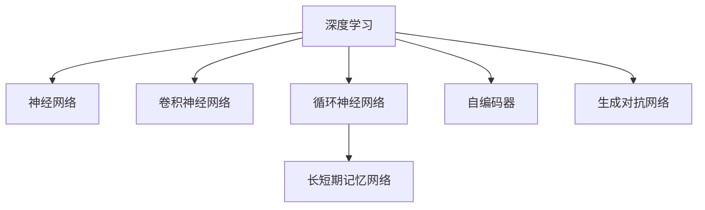
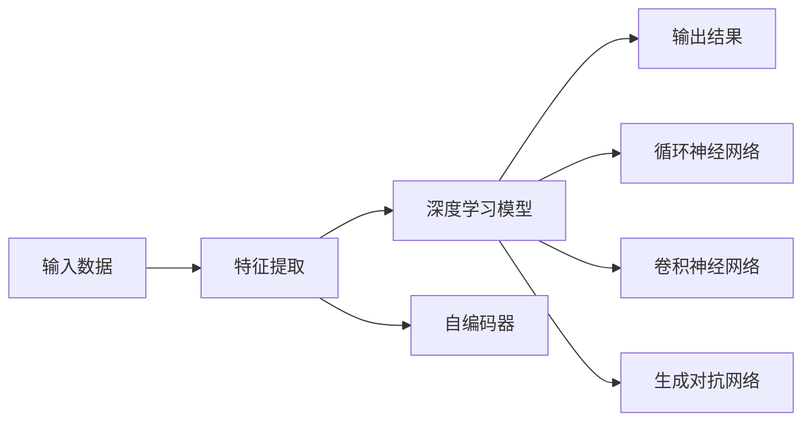

                 

# 知识发现引擎的深度学习模型应用

## 1. 背景介绍

在当今数据驱动的时代，知识发现(Knowledge Discovery, KDD)已成为跨行业、跨学科的重要领域。通过深度学习技术，特别是基于神经网络的模型，可以从大规模数据中提取出有价值的信息和模式，为决策支持、商业智能、医疗健康等领域带来革命性突破。本文将系统介绍深度学习模型在知识发现中的应用，涵盖原理、算法、实践等方面，旨在帮助读者全面掌握这一前沿技术。

## 2. 核心概念与联系

### 2.1 核心概念概述

在探讨深度学习模型在知识发现中的应用前，首先需要理解几个核心概念：

- **深度学习(Deep Learning)**：一种基于多层神经网络的机器学习技术，通过层层抽象，从数据中学习高层次的特征表示。其核心在于通过反向传播算法进行参数优化，不断迭代训练，以提高模型的预测能力和泛化能力。

- **知识发现(KDD)**：从大规模数据中提取知识、发现模式、总结规律的过程。深度学习提供了一种高效、自动化的方式，可以处理复杂的非结构化数据，发现隐藏在数据背后的知识。

- **神经网络(Neural Network)**：由多个神经元相互连接构成的计算图，用于模拟人脑的神经信号传递过程。深度学习模型通常基于这种计算图进行构建。

- **卷积神经网络(CNN)**：一种适用于图像识别和处理任务的神经网络，通过卷积层和池化层提取图像特征。

- **循环神经网络(RNN)**：适用于序列数据处理的神经网络，通过循环结构保持序列信息的时序性。

- **长短期记忆网络(LSTM)**：一种RNN的变种，通过门控机制解决梯度消失问题，增强模型的记忆能力。

- **自编码器(Autoencoder)**：一种无监督学习算法，通过编码器和解码器学习数据的压缩和重构，实现特征提取和数据降维。

- **生成对抗网络(GAN)**：一种生成模型，通过对抗训练方式生成新的数据，可用于数据增强和数据生成。

这些概念之间的逻辑关系可以通过以下Mermaid流程图来展示：



这个流程图展示了深度学习模型在知识发现应用中的主要构成元素及其相互关系：

1. **深度学习**作为整体框架，融合了多种神经网络结构。
2. **卷积神经网络**适用于图像数据的处理和分析。
3. **循环神经网络**和**长短期记忆网络**适用于序列数据的建模和预测。
4. **自编码器**用于特征提取和数据降维。
5. **生成对抗网络**用于数据增强和生成。

### 2.2 核心概念原理和架构的 Mermaid 流程图

以下是深度学习模型在知识发现中应用的核心概念原理和架构的 Mermaid 流程图：



该流程图展示了深度学习模型在知识发现过程中的主要步骤：

1. **输入数据**进入模型。
2. **特征提取**模块通过自编码器等技术提取关键特征。
3. **深度学习模型**对特征进行进一步处理和分析。
4. **输出结果**即为发现的知识和模式。

## 3. 核心算法原理 & 具体操作步骤

### 3.1 算法原理概述

深度学习模型在知识发现中的应用主要依赖于其强大的特征提取和模式学习能力。具体而言，主要包括以下几个步骤：

1. **数据预处理**：对原始数据进行清洗、归一化、特征选择等预处理，以提升数据质量。
2. **特征提取**：通过卷积神经网络、自编码器等模型学习数据的特征表示。
3. **模型训练**：使用标注数据对深度学习模型进行有监督或无监督训练，学习数据的模式和规律。
4. **知识发现**：通过模型对新数据进行预测或分析，发现隐藏的规律和知识。

### 3.2 算法步骤详解

以医疗领域的知识发现为例，具体介绍深度学习模型的操作步骤：

#### Step 1: 数据预处理

1. **数据收集**：收集医疗领域的电子病历、医疗影像、基因组数据等。
2. **数据清洗**：去除噪声、缺失值，确保数据完整性。
3. **特征工程**：提取临床指标、基因型数据、影像特征等，进行归一化、编码等处理。

#### Step 2: 特征提取

1. **卷积神经网络**：对医疗影像数据进行卷积操作，提取局部特征。
2. **自编码器**：对基因组数据进行降维处理，提取关键基因型特征。
3. **循环神经网络**：对电子病历文本进行序列建模，提取时序特征。

#### Step 3: 模型训练

1. **损失函数设计**：根据任务需求设计损失函数，如交叉熵、均方误差等。
2. **优化器选择**：选择合适的优化算法，如Adam、SGD等，设置学习率、批大小等超参数。
3. **训练流程**：对模型进行迭代训练，不断调整参数以最小化损失函数。

#### Step 4: 知识发现

1. **模型评估**：在验证集上评估模型性能，选择最优模型。
2. **知识提取**：使用训练好的模型对新数据进行预测，发现隐藏的知识和模式。
3. **结果可视化**：通过可视化工具展示模型的输出结果，如热力图、散点图等。

### 3.3 算法优缺点

深度学习模型在知识发现中具有以下优点：

1. **自适应性强**：能够处理非结构化数据，从复杂数据中提取特征，发现隐藏模式。
2. **预测能力强**：通过多层神经网络实现复杂的特征抽取和模式学习。
3. **泛化能力好**：在大规模数据上训练的模型，能够在新数据上保持较好的泛化能力。

但同时，深度学习模型也存在一些缺点：

1. **计算资源消耗大**：大规模数据和复杂模型需要强大的计算资源。
2. **过拟合风险高**：模型复杂度高，容易过拟合，需要关注过拟合问题。
3. **可解释性不足**：深度学习模型通常被视为"黑盒"，难以解释其内部工作机制。
4. **数据依赖性强**：模型依赖高质量、大规模的标注数据，数据获取成本高。

### 3.4 算法应用领域

深度学习模型在知识发现中的应用领域广泛，涵盖了以下几个方面：

- **医疗健康**：通过分析电子病历、基因组数据、医学影像等，发现疾病模式，提高诊断准确性。
- **金融风险**：利用交易数据、新闻、社交媒体等信息，预测市场趋势，识别风险点。
- **商业智能**：通过分析客户数据、销售数据等，挖掘商业规律，优化业务流程。
- **工业制造**：通过分析设备数据、生产数据等，优化生产流程，提高产品质量。
- **自然语言处理**：通过分析文本数据，提取知识图谱，进行情感分析、文本分类等。

## 4. 数学模型和公式 & 详细讲解 & 举例说明

### 4.1 数学模型构建

在知识发现中，深度学习模型通常采用以下数学模型进行构建：

1. **卷积神经网络**：

$$
F(x) = \sum_{i=1}^{N} (w_i * x_i + b_i)
$$

其中 $x$ 为输入数据，$w$ 为卷积核，$b$ 为偏置项。

2. **循环神经网络**：

$$
h_t = f(w_1 h_{t-1} + w_2 x_t + b)
$$

其中 $h$ 为隐藏状态，$f$ 为激活函数，$x_t$ 为当前时刻的输入，$w$ 为权重矩阵，$b$ 为偏置项。

3. **长短期记忆网络**：

$$
c_t = f(c_{t-1}, h_{t-1})
$$

$$
h_t = g(c_t, x_t)
$$

其中 $c$ 为细胞状态，$h$ 为隐藏状态，$f$ 和 $g$ 为门控函数。

4. **自编码器**：

$$
z = g(x)
$$

$$
x' = h(z)
$$

其中 $z$ 为压缩后的特征，$g$ 和 $h$ 分别为编码器和解码器。

### 4.2 公式推导过程

以医疗影像数据为例，介绍卷积神经网络在特征提取中的推导过程：

1. **卷积操作**：

$$
y_i = \sum_{j=1}^{N} (w_{ij} * x_{i,j}) + b_i
$$

其中 $x_{i,j}$ 为输入数据在位置 $(i,j)$ 的值，$w_{ij}$ 为卷积核在位置 $(i,j)$ 的值，$b_i$ 为偏置项。

2. **池化操作**：

$$
y'_i = max(y_1, y_2, ..., y_n)
$$

其中 $y_i$ 为池化前后的值。

3. **多层堆叠**：

$$
y_{L} = g_L(\cdots g_1(y))
$$

其中 $L$ 为卷积层数，$g$ 为激活函数。

### 4.3 案例分析与讲解

假设我们要构建一个用于乳腺癌影像分类的卷积神经网络模型，步骤如下：

1. **数据预处理**：将医疗影像数据归一化、裁剪、扩充，准备用于训练。
2. **模型设计**：设计卷积层、池化层、全连接层等结构，设置超参数。
3. **模型训练**：使用标注数据对模型进行训练，最小化损失函数。
4. **知识发现**：将训练好的模型应用于新影像数据，预测乳腺癌类型。

## 5. 项目实践：代码实例和详细解释说明

### 5.1 开发环境搭建

为了实现深度学习模型在知识发现中的应用，我们需要搭建一个Python开发环境。具体步骤如下：

1. **安装Python**：从官网下载并安装最新版本的Python。
2. **安装深度学习框架**：选择TensorFlow、PyTorch、Keras等框架之一进行安装。
3. **安装相关库**：安装NumPy、Pandas、Matplotlib等库，用于数据处理和可视化。
4. **设置开发环境**：创建虚拟环境，安装所需的Python库和依赖。

### 5.2 源代码详细实现

以医疗影像分类为例，介绍使用Keras实现卷积神经网络的具体步骤：

```python
import keras
from keras.models import Sequential
from keras.layers import Conv2D, MaxPooling2D, Flatten, Dense

# 定义模型
model = Sequential()
model.add(Conv2D(32, kernel_size=(3, 3), activation='relu', input_shape=(64, 64, 3)))
model.add(MaxPooling2D(pool_size=(2, 2)))
model.add(Conv2D(64, kernel_size=(3, 3), activation='relu'))
model.add(MaxPooling2D(pool_size=(2, 2)))
model.add(Flatten())
model.add(Dense(128, activation='relu'))
model.add(Dense(1, activation='sigmoid'))

# 编译模型
model.compile(optimizer='adam', loss='binary_crossentropy', metrics=['accuracy'])

# 训练模型
model.fit(X_train, y_train, epochs=10, batch_size=32, validation_data=(X_test, y_test))

# 评估模型
loss, accuracy = model.evaluate(X_test, y_test)

# 预测新数据
predictions = model.predict(X_new)
```

### 5.3 代码解读与分析

在上述代码中，我们定义了一个包含卷积层、池化层、全连接层的卷积神经网络模型。具体分析如下：

- `Sequential`：定义一个顺序模型，依次添加各层。
- `Conv2D`：定义卷积层，提取图像特征。
- `MaxPooling2D`：定义池化层，减小特征图尺寸，提升计算效率。
- `Flatten`：定义展平层，将多维特征图展开为向量。
- `Dense`：定义全连接层，进行分类预测。
- `compile`：编译模型，设置优化器、损失函数、评估指标。
- `fit`：训练模型，指定训练数据、训练轮数、批次大小等。
- `evaluate`：评估模型，返回损失和准确率。
- `predict`：预测新数据，返回预测结果。

## 6. 实际应用场景

### 6.1 医疗健康

在医疗领域，深度学习模型可以应用于疾病预测、影像分析、基因组学等多个方面。例如，通过分析电子病历和医疗影像，可以发现癌症的早期迹象，提高诊断准确性。在基因组学中，深度学习模型可以通过分析基因型数据，预测个体患某种疾病的风险。

### 6.2 金融风险

金融领域中，深度学习模型可以用于预测市场趋势、识别风险点、欺诈检测等。通过分析交易数据、新闻、社交媒体等信息，可以预测股市走势，提前预警风险。

### 6.3 商业智能

在商业智能领域，深度学习模型可以用于客户行为分析、推荐系统、销售预测等。通过分析客户数据、销售数据，可以发现客户偏好和购买规律，优化业务流程，提升销售效率。

### 6.4 工业制造

在工业制造领域，深度学习模型可以用于设备故障预测、生产优化、质量检测等。通过分析设备数据、生产数据，可以预测设备故障，提前进行维护，提高生产效率。

### 6.5 自然语言处理

在自然语言处理领域，深度学习模型可以用于情感分析、文本分类、机器翻译等。通过分析文本数据，可以提取关键信息，生成高质量的文本摘要。

## 7. 工具和资源推荐

### 7.1 学习资源推荐

为了帮助读者全面掌握深度学习模型在知识发现中的应用，推荐以下学习资源：

1. 《深度学习》课程：由斯坦福大学Andrew Ng教授主讲的在线课程，系统讲解深度学习的基本概念和算法。
2. 《动手学深度学习》：由李沐等作者编写的书籍，包含丰富的代码示例和实践案例。
3. 《TensorFlow官方文档》：详细介绍了TensorFlow框架的各个模块和组件，是深度学习开发的重要参考。
4. Kaggle竞赛：通过参与Kaggle竞赛，实战练习深度学习模型的应用。
5. GitHub开源项目：浏览和参与开源项目，学习前沿技术和应用案例。

### 7.2 开发工具推荐

在深度学习模型开发中，推荐使用以下工具：

1. PyTorch：基于Python的深度学习框架，灵活高效，适合研究和开发。
2. TensorFlow：谷歌开发的深度学习框架，生产部署方便，适合大规模工程应用。
3. Keras：基于TensorFlow的高级深度学习框架，易用性强，适合快速开发。
4. Jupyter Notebook：交互式编程环境，支持代码调试和可视化。
5. Git和GitHub：版本控制和代码托管工具，方便团队协作和代码共享。

### 7.3 相关论文推荐

深度学习模型在知识发现中的应用涉及多个前沿研究方向，推荐以下经典论文：

1. "Convolutional Neural Networks for Medical Image Classification"：探讨卷积神经网络在医疗影像分类中的应用。
2. "Long Short-Term Memory Networks"：介绍长短期记忆网络在序列数据处理中的应用。
3. "Autoencoder-based Feature Learning for Healthcare"：讨论自编码器在医疗数据降维中的应用。
4. "Generative Adversarial Networks for Fraud Detection"：研究生成对抗网络在欺诈检测中的应用。
5. "Attention is All You Need"：介绍Transformer模型在自然语言处理中的应用。

## 8. 总结：未来发展趋势与挑战

### 8.1 研究成果总结

深度学习模型在知识发现中的应用取得了显著进展，广泛应用于医疗、金融、商业等多个领域。未来，随着算力的提升和数据规模的扩大，深度学习模型的性能将进一步提升，应用范围将进一步扩展。

### 8.2 未来发展趋势

未来，深度学习模型在知识发现中的应用将呈现以下几个发展趋势：

1. **模型规模化**：深度学习模型将向更大规模发展，参数量不断增加，能够处理更复杂的任务。
2. **自监督学习**：通过无监督或半监督学习方式，减少对标注数据的依赖，提高模型的泛化能力。
3. **多模态融合**：将图像、文本、声音等多种模态数据融合，提升模型的综合分析能力。
4. **联邦学习**：通过分布式训练方式，保护数据隐私，提升模型效率。
5. **生成对抗网络**：生成对抗网络在数据增强、数据生成方面的应用将更加广泛。
6. **强化学习**：结合强化学习技术，提升模型的决策能力，应用于更加复杂的任务。

### 8.3 面临的挑战

尽管深度学习模型在知识发现中取得了重要进展，但仍面临诸多挑战：

1. **数据质量**：高质量、大规模的标注数据获取难度大，成本高。
2. **模型复杂度**：大规模模型需要强大的计算资源，存在过拟合风险。
3. **可解释性**：深度学习模型通常被视为"黑盒"，难以解释其内部工作机制。
4. **隐私保护**：在处理敏感数据时，数据隐私保护问题尤为重要。
5. **伦理道德**：深度学习模型可能会学习到偏见和有害信息，引发伦理道德问题。

### 8.4 研究展望

面对未来发展的挑战，未来的研究需要在以下几个方面进行深入探索：

1. **数据获取与处理**：探索自动化标注、半监督学习等方法，提高数据获取效率和质量。
2. **模型简化**：研究参数高效微调、压缩算法等，降低模型复杂度，提高计算效率。
3. **可解释性**：引入可解释性技术，增强模型的透明性和可解释性。
4. **隐私保护**：研究差分隐私、联邦学习等技术，保护数据隐私。
5. **伦理道德**：制定伦理规范，建立模型审查机制，确保模型符合伦理道德要求。

总之，深度学习模型在知识发现中的应用前景广阔，但也面临着诸多挑战。未来，只有在数据、模型、算法、伦理等多个维度协同创新，才能推动深度学习模型在知识发现中的应用取得更大突破。

## 9. 附录：常见问题与解答

**Q1: 深度学习模型在知识发现中有什么优势？**

A: 深度学习模型在知识发现中的优势主要包括：

1. **自适应性强**：能够处理非结构化数据，从复杂数据中提取特征，发现隐藏模式。
2. **预测能力强**：通过多层神经网络实现复杂的特征抽取和模式学习。
3. **泛化能力好**：在大规模数据上训练的模型，能够在新数据上保持较好的泛化能力。

**Q2: 深度学习模型在知识发现中存在哪些缺点？**

A: 深度学习模型在知识发现中存在以下缺点：

1. **计算资源消耗大**：大规模数据和复杂模型需要强大的计算资源。
2. **过拟合风险高**：模型复杂度高，容易过拟合，需要关注过拟合问题。
3. **可解释性不足**：深度学习模型通常被视为"黑盒"，难以解释其内部工作机制。
4. **数据依赖性强**：模型依赖高质量、大规模的标注数据，数据获取成本高。

**Q3: 深度学习模型在知识发现中如何应用？**

A: 深度学习模型在知识发现中的应用主要包括：

1. **数据预处理**：对原始数据进行清洗、归一化、特征选择等预处理，以提升数据质量。
2. **特征提取**：通过卷积神经网络、自编码器等模型学习数据的特征表示。
3. **模型训练**：使用标注数据对深度学习模型进行有监督或无监督训练，学习数据的模式和规律。
4. **知识发现**：通过模型对新数据进行预测或分析，发现隐藏的规律和知识。

**Q4: 深度学习模型在知识发现中如何优化？**

A: 深度学习模型在知识发现中的优化主要包括以下几个方面：

1. **模型简化**：研究参数高效微调、压缩算法等，降低模型复杂度，提高计算效率。
2. **数据增强**：通过数据扩充、数据增强等方法，增加训练数据多样性，提高模型泛化能力。
3. **正则化**：使用L2正则、Dropout等技术，防止模型过拟合。
4. **超参数调优**：通过网格搜索、贝叶斯优化等方法，寻找最优的超参数组合。

**Q5: 深度学习模型在知识发现中有什么应用场景？**

A: 深度学习模型在知识发现中的应用场景主要包括：

1. **医疗健康**：通过分析电子病历、基因组数据、医学影像等，发现疾病模式，提高诊断准确性。
2. **金融风险**：利用交易数据、新闻、社交媒体等信息，预测市场趋势，识别风险点。
3. **商业智能**：通过分析客户数据、销售数据等，挖掘商业规律，优化业务流程。
4. **工业制造**：通过分析设备数据、生产数据等，优化生产流程，提高产品质量。
5. **自然语言处理**：通过分析文本数据，提取关键信息，生成高质量的文本摘要。

作者：禅与计算机程序设计艺术 / Zen and the Art of Computer Programming

