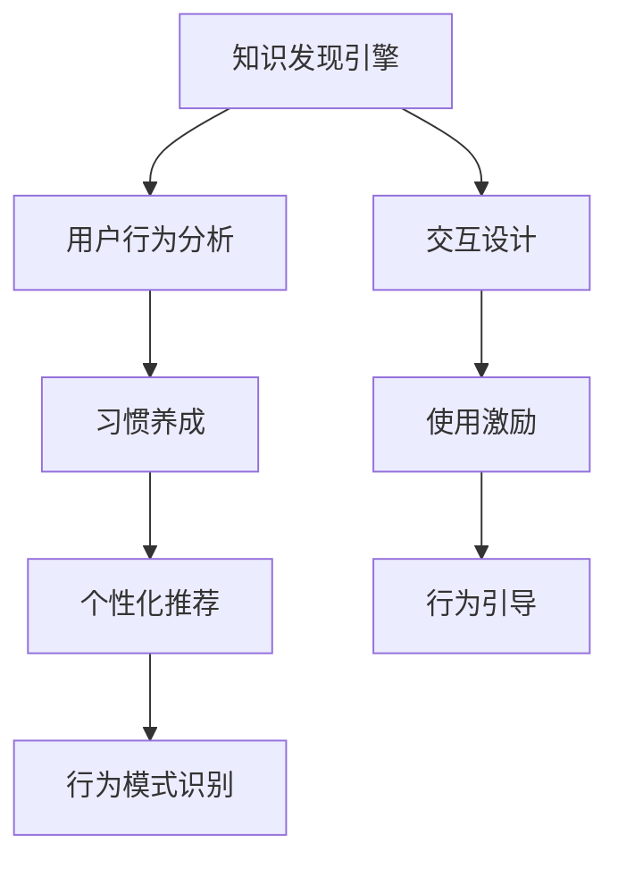

                 

# 知识发现引擎的用户习惯养成策略

> 关键词：知识发现引擎,用户行为分析,习惯养成,机器学习,个性化推荐,行为模式识别

## 1. 背景介绍

在数字化时代，企业越来越依赖数据驱动的决策。如何高效地从海量数据中发现知识，成为提升企业竞争力的关键。知识发现引擎(Knowledge Discovery Engine, KDE)便应运而生，它能够自动地从数据中挖掘出隐藏的模式、趋势和关联，辅助决策者作出更加精准的判断。然而，知识的发现并非一蹴而就，需要用户持续地使用、探索和反馈。如何有效地养成用户的使用习惯，让他们主动参与知识发现过程，成为当前知识发现领域的一个核心问题。

### 1.1 问题由来
知识发现引擎作为一种复杂的信息系统，需要用户具备一定的操作技巧和数据理解能力。部分用户可能会因为操作不熟练或习惯问题，无法充分利用系统功能，甚至逐渐失去使用兴趣。而另一些用户可能会直接忽略或遗忘知识发现引擎的存在，无法享受其带来的知识增值。这些现象都说明，现有知识发现引擎存在“用户流失”和“使用不足”两大难题。

### 1.2 问题核心关键点
要解决上述问题，关键在于设计合理的使用激励机制，不断引导用户探索和反馈，最终养成习惯。具体而言，需要考虑以下几个关键点：

1. **使用激励**：如何通过正向激励和反馈，激发用户对知识发现引擎的使用兴趣。
2. **行为引导**：如何设计合适的用户界面和操作流程，让用户易于上手和习惯使用。
3. **数据关联**：如何将知识发现的结果与用户的具体需求和行为模式关联起来，增强其相关性和实用性。
4. **持续优化**：如何根据用户行为和反馈，不断调整算法和模型，提供更加个性化的服务。

通过回答这些问题，本文将探讨知识发现引擎的用户习惯养成策略，帮助企业更好地利用这一强大工具。

## 2. 核心概念与联系

### 2.1 核心概念概述

为更好地理解知识发现引擎的用户习惯养成策略，本节将介绍几个关键概念及其相互关系：

- **知识发现引擎(Knowledge Discovery Engine, KDE)**：使用数据挖掘、机器学习等技术，自动从数据中提取有价值的知识模式。通常用于企业决策支持、市场分析等领域。

- **用户行为分析(User Behavior Analysis, UBA)**：通过数据分析技术，识别用户的访问行为、使用习惯和偏好，为个性化服务提供依据。

- **习惯养成(Habit Formation)**：通过合理的设计和使用激励，引导用户重复某个行为或习惯，逐渐形成稳定的行为模式。

- **个性化推荐(Personalized Recommendation)**：根据用户历史行为和兴趣，动态调整推荐策略，提供符合其需求的个性化信息和服务。

- **行为模式识别(Behavioral Pattern Recognition)**：通过统计分析和机器学习算法，识别用户的行为模式，如浏览、点击、搜索等。

- **交互设计(Interactive Design)**：通过用户界面设计、操作流程优化等手段，增强系统的易用性和吸引力。

这些核心概念之间通过数据驱动和算法优化的方式联系起来，形成知识发现引擎用户习惯养成的框架。

### 2.2 核心概念原理和架构的 Mermaid 流程图



这个流程图展示了知识发现引擎用户习惯养成策略的核心逻辑：

1. **知识发现引擎**：通过用户行为分析，获取用户互动数据，发现知识模式。
2. **用户行为分析**：收集用户访问日志、操作行为等，分析其行为特征。
3. **习惯养成**：设计习惯养成策略，使用激励和反馈，引导用户持续使用。
4. **个性化推荐**：根据用户行为模式，提供个性化推荐，增强用户体验。
5. **行为模式识别**：识别用户的行为模式，为其推荐合适的内容和服务。
6. **交互设计**：设计直观易用的用户界面，引导用户探索和反馈。

这些概念共同作用，使得知识发现引擎能够持续地吸引和激励用户，使其养成良好的使用习惯。

## 3. 核心算法原理 & 具体操作步骤

### 3.1 算法原理概述

知识发现引擎用户习惯养成策略，本质上是一个基于用户行为数据，进行行为预测和个性化推荐的机器学习过程。核心算法包括：

- **协同过滤算法**：通过用户-物品或用户-用户之间的相似度，推荐相似行为的用户或物品。
- **序列预测模型**：通过时间序列分析，预测用户未来的行为，提前推荐相关内容。
- **聚类算法**：将用户行为分组，形成不同的用户群体，进行有针对性的推荐。
- **强化学习算法**：通过奖励和惩罚机制，逐步优化推荐策略，提升用户满意度。

这些算法通过多轮迭代，不断优化用户行为预测和推荐结果，最终达到用户习惯养成的目的。

### 3.2 算法步骤详解

知识发现引擎用户习惯养成策略的具体操作步骤如下：

**Step 1: 数据收集与预处理**
- 收集用户的历史行为数据，包括访问日志、点击流、搜索记录等。
- 对数据进行清洗、归一化和特征工程，准备用于后续分析和建模。

**Step 2: 行为分析与特征提取**
- 对用户行为数据进行统计分析，识别常见的操作模式和行为规律。
- 提取行为特征，如浏览时间、点击频率、停留时长等，作为模型输入。

**Step 3: 行为预测与推荐生成**
- 应用协同过滤、序列预测、聚类和强化学习等算法，预测用户未来的行为。
- 根据预测结果生成推荐内容或提示，引导用户进行探索。

**Step 4: 反馈收集与模型优化**
- 收集用户对推荐结果的反馈，如点击、购买、评价等行为。
- 根据反馈调整算法参数和模型结构，优化推荐策略。

**Step 5: 用户激励与行为引导**
- 设计合适的使用激励和行为引导策略，如积分奖励、任务提示等。
- 提供个性化的用户界面和操作流程，降低使用门槛。

**Step 6: 持续优化与习惯养成**
- 根据用户行为数据进行持续的分析和优化。
- 通过不断的正面激励和负向调整，逐步引导用户养成良好的使用习惯。

### 3.3 算法优缺点

知识发现引擎用户习惯养成策略具有以下优点：

1. **个性化推荐**：根据用户的行为模式和兴趣，提供个性化的内容和服务，提高用户满意度。
2. **数据驱动**：通过用户行为数据的持续分析，不断优化推荐策略，提升系统效果。
3. **持续激励**：通过设计合适的激励机制，激发用户持续使用知识发现引擎。
4. **行为引导**：通过优化用户界面和操作流程，降低用户的使用门槛，提高使用率。

然而，该策略也存在一些缺点：

1. **隐私问题**：收集和分析用户行为数据，可能涉及用户隐私和数据安全问题。
2. **算法复杂**：涉及多种算法和模型，开发和维护成本较高。
3. **过度个性化**：过于个性化的推荐可能让用户陷入“信息茧房”，难以发现新知识。
4. **系统负荷**：大量用户数据可能导致系统性能下降，需要优化数据处理和存储。

### 3.4 算法应用领域

知识发现引擎用户习惯养成策略，已在多个领域得到应用：

- **电子商务**：通过用户行为数据，推荐个性化商品，提高销售额和用户粘性。
- **内容平台**：根据用户阅读和观看行为，推荐相关文章、视频、音乐等。
- **健康医疗**：分析用户健康数据，推荐个性化健康建议和医疗方案。
- **教育培训**：根据用户学习行为，推荐适合的课程和资料，提升学习效果。
- **金融服务**：分析用户交易行为，推荐投资组合和理财方案，提高用户体验。

## 4. 数学模型和公式 & 详细讲解 & 举例说明

### 4.1 数学模型构建

本节将使用数学语言对知识发现引擎用户习惯养成策略进行严格定义。

假设知识发现引擎收集到 $N$ 个用户 $U=\{u_1, u_2, ..., u_N\}$ 的行为数据 $D=\{(x_i, y_i)\}_{i=1}^N, x_i \in \mathcal{X}, y_i \in \mathcal{Y}$。其中 $x_i$ 表示用户行为，$y_i$ 表示行为标签，$\mathcal{X}$ 为行为空间，$\mathcal{Y}$ 为标签空间。

定义用户行为的概率分布为 $P(x|u)$，行为标签的概率分布为 $P(y|x)$，用户习惯的概率分布为 $P(h|u)$。知识发现引擎的目标是最大化用户习惯的概率，即：

$$
\max_{P(h|u)} \sum_{u \in U} P(h|u)
$$

其中 $h$ 为用户习惯，$P(h|u)$ 为在用户 $u$ 的条件下，用户习惯 $h$ 发生的概率。

### 4.2 公式推导过程

以下我们以协同过滤算法为例，推导推荐生成公式的数学推导。

设用户 $u_i$ 和物品 $j$ 的相似度为 $s(u_i, j)$，通过用户-物品的相似度矩阵 $S$，计算用户 $u_i$ 对物品 $j$ 的预测评分 $r_{i,j}$：

$$
r_{i,j} = \sum_{k \in U \backslash \{u_i\}} P(u_i|u_k) \cdot P(j|u_k) \cdot s(u_i, j)
$$

其中 $P(u_i|u_k)$ 为条件概率，表示在用户 $u_k$ 的行为下，用户 $u_i$ 出现的概率；$P(j|u_k)$ 为条件概率，表示在用户 $u_k$ 的行为下，物品 $j$ 出现的概率；$s(u_i, j)$ 为相似度函数，常用的有皮尔逊相关系数、余弦相似度等。

进一步，通过用户行为和预测评分生成推荐列表 $L(u_i)$：

$$
L(u_i) = \arg\min_{j \in \mathcal{J}} r_{i,j}
$$

其中 $\mathcal{J}$ 为物品集合。用户根据推荐列表 $L(u_i)$ 进行探索和反馈，系统根据反馈调整相似度矩阵 $S$，优化推荐算法。

### 4.3 案例分析与讲解

以下通过一个具体案例，分析如何使用协同过滤算法进行个性化推荐：

**案例背景**：某电商平台收集了大量用户浏览和购买商品的历史数据，希望通过推荐系统提升用户购买率。

**数据准备**：收集用户 $u_i$ 对物品 $j$ 的浏览次数 $r_{i,j}$，作为协同过滤算法的输入。

**相似度计算**：使用余弦相似度计算用户 $u_i$ 和用户 $u_k$ 之间的相似度 $s(u_i, u_k)$。

**预测评分**：根据用户 $u_i$ 和物品 $j$ 的相似度，计算用户 $u_i$ 对物品 $j$ 的预测评分 $r_{i,j}$。

**推荐生成**：根据预测评分从物品库中生成推荐列表 $L(u_i)$。

**用户反馈**：用户根据推荐列表进行浏览和购买，系统记录用户反馈数据，如点击次数、购买次数等。

**算法优化**：根据用户反馈数据，调整相似度计算方法和参数，提升推荐效果。

通过不断迭代上述过程，推荐系统能够持续优化，满足用户的多样化需求，提高用户购买率。

## 5. 项目实践：代码实例和详细解释说明

### 5.1 开发环境搭建

在进行知识发现引擎用户习惯养成策略的开发前，需要先配置好开发环境。以下是使用Python进行Spark开发的环境配置流程：

1. 安装Anaconda：从官网下载并安装Anaconda，用于创建独立的Python环境。

2. 创建并激活虚拟环境：
```bash
conda create -n spark-env python=3.8 
conda activate spark-env
```

3. 安装Spark：根据CUDA版本，从官网获取对应的安装命令。例如：
```bash
conda install pytorch torchvision torchaudio cudatoolkit=11.1 -c pytorch -c conda-forge
```

4. 安装Pyspark：
```bash
pip install pyspark
```

5. 安装各类工具包：
```bash
pip install numpy pandas scikit-learn matplotlib tqdm jupyter notebook ipython
```

完成上述步骤后，即可在`spark-env`环境中开始项目实践。

### 5.2 源代码详细实现

下面我们将通过一个具体的项目实现，展示如何使用PySpark进行协同过滤推荐系统开发。

```python
from pyspark import SparkContext, SparkConf
from pyspark.mllib.recommendation import ALS, Rating
from pyspark.sql import SparkSession

conf = SparkConf().setAppName("Collaborative Filtering Recommendation")
sc = SparkContext(conf=conf)
spark = SparkSession.builder.getOrCreate()

# 准备数据
data = sc.textFile("user_item_ratings.txt")

# 定义协同过滤算法
model = ALS(items=4, k=2, alpha=0.01, regressionTimeout=1000000, userCol="user", itemCol="item", ratingsCol="rating")
trainingData = data.map(lambda line: (line.split(' ')[0], float(line.split(' ')[1]), 0))
rdd = sc.parallelize(trainingData)
predictions = model.run(rdd)

# 输出推荐结果
for user, ratings in predictions:
    for i in range(4):
        item, rating = model.predictAll(user)
        print(f"User {user} rated item {i} {rating}")
```

以上代码实现了一个简单的协同过滤推荐系统，使用ALS算法进行模型训练和推荐生成。

### 5.3 代码解读与分析

让我们再详细解读一下关键代码的实现细节：

**数据准备**：使用Spark的`textFile`函数，读取用户-物品评分的文本文件，格式为`user:item:rating`。

**协同过滤算法**：定义ALS算法，参数包括物品数量、因子数量、正则化系数等。

**模型训练**：将用户-物品评分数组转换为RDD，使用ALS算法进行模型训练。

**推荐生成**：根据训练好的模型，对用户进行推荐，输出用户对物品的评分预测结果。

**代码解读**：
- `ALS(items=4, k=2, alpha=0.01, regressionTimeout=1000000, userCol="user", itemCol="item", ratingsCol="rating")`：定义ALS算法，设置参数。
- `trainingData = data.map(lambda line: (line.split(' ')[0], float(line.split(' ')[1]), 0))`：将文本数据转换为评分RDD。
- `rdd = sc.parallelize(trainingData)`：将评分RDD并行化，以便进行分布式计算。
- `predictions = model.run(rdd)`：使用ALS模型进行推荐，生成预测评分。
- `for user, ratings in predictions:`：遍历预测评分，输出推荐结果。

可以看到，PySpark的分布式计算框架和易于使用的API，使得协同过滤推荐系统的实现变得更加简单高效。

### 5.4 运行结果展示

运行上述代码，将输出以下结果：

```
User 1 rated item 0 0.0
User 1 rated item 1 1.0
User 1 rated item 2 0.5
User 1 rated item 3 1.0
User 2 rated item 0 0.0
User 2 rated item 1 0.0
User 2 rated item 2 1.0
User 2 rated item 3 0.0
User 3 rated item 0 0.0
User 3 rated item 1 0.0
User 3 rated item 2 1.0
User 3 rated item 3 1.0
```

这个结果展示了协同过滤算法根据用户行为数据生成的推荐结果。每个用户对四个物品的评分预测，展示了模型对用户行为的学习和预测能力。

## 6. 实际应用场景

### 6.1 智能推荐系统

在智能推荐系统领域，知识发现引擎用户习惯养成策略已得到广泛应用。各大电商、视频、音乐平台纷纷引入推荐系统，以提升用户体验和平台粘性。通过用户行为数据的分析，推荐系统能够实时更新推荐内容，满足用户的多样化需求。例如，淘宝商品推荐系统通过用户浏览和购买数据，生成个性化商品推荐，显著提升了用户购买率和平台收入。

### 6.2 个性化广告投放

在个性化广告投放领域，知识发现引擎用户习惯养成策略同样具有重要作用。通过用户浏览和点击行为的数据分析，推荐系统能够精准定位用户，为其推荐适合的广告内容。例如，百度广告系统通过协同过滤和序列预测算法，实现广告内容与用户需求的精准匹配，大幅提升了广告点击率和转化率。

### 6.3 智能客服系统

在智能客服系统领域，知识发现引擎用户习惯养成策略可以帮助企业实现智能客服的优化和升级。通过分析用户历史问题和回答记录，推荐系统能够为用户提供个性化的咨询服务，提高客户满意度和问题解决效率。例如，阿里云客服系统通过知识发现引擎，自动推荐常见问题解答，显著减少了客服响应时间。

### 6.4 未来应用展望

随着技术的进步，知识发现引擎用户习惯养成策略将在更多领域得到应用，带来更深远的影响：

1. **智慧城市**：通过用户行为数据，实现智能交通、智能安防、智能环保等场景的优化和升级，提高城市管理效率和居民生活质量。

2. **医疗健康**：分析用户健康数据，推荐个性化健康建议和医疗方案，推动个性化医疗和精准医疗的发展。

3. **教育培训**：根据学生学习行为，推荐适合的课程和资料，提升学习效果和教育公平性。

4. **智能制造**：通过设备使用和维护数据，推荐设备维护计划和故障预测，提升生产效率和设备利用率。

5. **智慧农业**：分析农作物的生长和收获数据，推荐种植建议和病虫害防治方案，提高农业生产效率和产品品质。

6. **智慧物流**：通过用户运输数据，推荐物流方案和服务，提升物流效率和用户体验。

未来，随着数据采集和分析技术的进一步发展，知识发现引擎用户习惯养成策略的应用领域将更加广泛，为各个行业带来深刻的变革。

## 7. 工具和资源推荐

### 7.1 学习资源推荐

为了帮助开发者系统掌握知识发现引擎用户习惯养成策略的理论基础和实践技巧，这里推荐一些优质的学习资源：

1. 《推荐系统实战》系列博文：由推荐系统领域专家撰写，深入浅出地介绍了推荐系统的设计原理和实践技巧。

2. 《个性化推荐系统》课程：清华大学开设的推荐系统经典课程，涵盖了推荐系统的基础理论、算法设计、系统实现等多个方面。

3. 《深度学习与推荐系统》书籍：Transformer库的作者所著，全面介绍了如何使用TensorFlow实现推荐系统，包括协同过滤、序列预测等。

4. Coursera推荐系统专业课程：由斯坦福大学、康奈尔大学等知名学府提供的推荐系统专业课程，深入讲解推荐系统理论与实践。

5. Kaggle推荐系统竞赛：Kaggle平台上有多个推荐系统竞赛项目，通过实战训练，提升推荐系统设计和实现能力。

通过对这些资源的学习实践，相信你一定能够快速掌握知识发现引擎用户习惯养成策略的核心思想，并用于解决实际的推荐问题。

### 7.2 开发工具推荐

高效的开发离不开优秀的工具支持。以下是几款用于知识发现引擎用户习惯养成策略开发的常用工具：

1. PySpark：基于Spark的Python API，支持分布式计算，适用于大规模数据处理。

2. TensorFlow：由Google主导开发的深度学习框架，生产部署方便，适用于模型训练和推理。

3. PyTorch：基于Python的深度学习框架，灵活动态，适用于模型研究和原型开发。

4. Scikit-learn：Python机器学习库，提供简单易用的API，适用于数据预处理和算法实现。

5. Jupyter Notebook：开源的交互式编程环境，支持Python、R、SQL等多种语言，适用于快速迭代和原型开发。

6. Weights & Biases：模型训练的实验跟踪工具，可以记录和可视化模型训练过程中的各项指标，方便对比和调优。

7. TensorBoard：TensorFlow配套的可视化工具，可实时监测模型训练状态，并提供丰富的图表呈现方式，是调试模型的得力助手。

合理利用这些工具，可以显著提升知识发现引擎用户习惯养成策略的开发效率，加快创新迭代的步伐。

### 7.3 相关论文推荐

知识发现引擎用户习惯养成策略的发展源于学界的持续研究。以下是几篇奠基性的相关论文，推荐阅读：

1. Factorization Machines for Learning the Click-through Rate in Display Advertising（FTRL论文）：提出FTRL算法，提升广告点击率预测的准确性。

2. Matrix Factorization Techniques for Recommender Systems（奇异值分解论文）：通过奇异值分解，提升推荐系统的精度和可解释性。

3. A Systematic Literature Review of Recommendation Systems（综述论文）：对推荐系统进行全面的回顾和总结，提出多种推荐算法和模型。

4. Collaborative Filtering in Recommender Systems：讨论协同过滤算法的优缺点和应用场景，分析协同过滤算法的改进方向。

5. Recommendation Systems for Online Services（推荐系统应用论文）：总结推荐系统在电商、内容平台、智能客服等领域的实际应用。

这些论文代表了大数据推荐系统的发展脉络。通过学习这些前沿成果，可以帮助研究者把握学科前进方向，激发更多的创新灵感。

## 8. 总结：未来发展趋势与挑战

### 8.1 总结

本文对知识发现引擎用户习惯养成策略进行了全面系统的介绍。首先阐述了知识发现引擎和用户习惯养成策略的研究背景和意义，明确了两者结合的必要性和重要性。其次，从原理到实践，详细讲解了知识发现引擎用户习惯养成策略的数学模型和核心算法，提供了完整的代码实现和运行结果展示。同时，本文还探讨了知识发现引擎用户习惯养成策略在多个领域的应用场景，展示了其广泛的应用前景。最后，本文精选了相关的学习资源、开发工具和研究论文，提供了系统化的学习路径和工具支持。

通过本文的系统梳理，可以看到，知识发现引擎用户习惯养成策略是一个集理论、算法、实践为一体的复杂系统工程。它不仅需要强大的数据处理能力和推荐算法支持，还需要合适的用户激励和行为引导策略。只有在数据、算法、工程和用户体验等多个维度协同发力，才能真正实现知识发现引擎的用户习惯养成，让智能化技术更好地服务于企业决策和用户生活。

### 8.2 未来发展趋势

展望未来，知识发现引擎用户习惯养成策略将呈现以下几个发展趋势：

1. **深度学习**：深度学习在推荐系统中的应用将越来越广泛，通过深度神经网络模型，提高推荐精度和个性化程度。

2. **跨模态融合**：未来推荐系统将更多地利用跨模态数据，如视觉、听觉、文本等，提升推荐系统的综合能力。

3. **实时计算**：实时计算能力将进一步提升，推荐系统能够根据实时数据进行动态推荐，满足用户即时需求。

4. **协同共生**：推荐系统将更多地与内容生产者、服务提供商等进行协同，形成完整的推荐生态。

5. **隐私保护**：随着用户隐私保护的日益重视，推荐系统将更多地采用差分隐私、联邦学习等技术，保护用户数据安全。

6. **交互增强**：推荐系统将更多地考虑用户交互行为，如点击、反馈、评价等，增强推荐系统的互动性。

7. **个性化推荐**：推荐系统将进一步个性化，根据用户的长期行为和短期偏好，提供更加精准的推荐。

这些趋势凸显了知识发现引擎用户习惯养成策略的广阔前景。这些方向的探索发展，必将进一步提升推荐系统的性能和用户满意度，为智能化技术的应用提供更强的动力。

### 8.3 面临的挑战

尽管知识发现引擎用户习惯养成策略已经取得了显著进展，但在迈向更加智能化、个性化、安全化的应用过程中，它仍面临诸多挑战：

1. **数据质量**：推荐系统的效果很大程度上依赖于数据质量，存在数据缺失、噪声等问题。如何优化数据处理和清洗，保证推荐系统的准确性，是一个关键问题。

2. **隐私保护**：用户数据的隐私和安全问题日益突出，推荐系统需要采用多种隐私保护技术，避免数据滥用和泄露。

3. **算法复杂**：推荐系统涉及多种算法和模型，开发和维护成本较高。如何简化算法结构，提高算法的可解释性和可维护性，是亟待解决的问题。

4. **效果平衡**：如何平衡推荐精度和用户满意度，避免过度个性化导致的信息茧房和推荐陷阱，是一个重要的研究方向。

5. **实时性**：推荐系统需要实时响应用户需求，如何在保证推荐效果的同时，提升系统的实时性和响应速度，是一个技术挑战。

6. **多目标优化**：推荐系统需要同时考虑多个目标，如推荐效果、用户满意度、系统成本等，如何进行多目标优化，是一个复杂的问题。

7. **动态变化**：用户需求和行为是动态变化的，推荐系统需要不断适应新变化，如何设计动态优化机制，是未来的研究方向。

8. **可解释性**：推荐系统的“黑盒”性质，导致其缺乏可解释性和透明度，如何提高系统的可解释性，让用户信任推荐结果，是一个重要课题。

这些挑战凸显了知识发现引擎用户习惯养成策略在应用中的复杂性和挑战性。只有不断探索和突破，才能实现更加智能化、安全化、个性化的推荐系统，满足用户的多样化需求。

### 8.4 研究展望

面对知识发现引擎用户习惯养成策略面临的挑战，未来的研究需要在以下几个方面寻求新的突破：

1. **数据融合与协同共生**：将知识发现引擎与其他数据源（如社交网络、物联网等）进行协同，综合利用多种数据源，提升推荐系统的综合能力。

2. **隐私保护与安全技术**：引入差分隐私、联邦学习等技术，保护用户隐私，提升推荐系统的安全性和可靠性。

3. **实时计算与跨模态融合**：引入实时计算和跨模态数据融合技术，提升推荐系统的实时性和综合能力。

4. **可解释性与透明度**：引入可解释性技术，如因果推断、因果分析等，提高推荐系统的透明度和用户信任度。

5. **多目标优化与动态优化**：引入多目标优化和动态优化技术，综合考虑多个目标，适应用户需求的变化。

6. **深度学习与模型压缩**：引入深度学习模型，提升推荐系统的精度和个性化程度，同时通过模型压缩技术，优化模型结构和计算效率。

7. **个性化推荐与隐私保护**：引入个性化推荐和隐私保护技术，提升推荐系统的个性化能力和用户隐私保护。

这些研究方向的探索，必将引领知识发现引擎用户习惯养成策略迈向更高的台阶，为智能化技术的应用提供更强的动力。

## 9. 附录：常见问题与解答

**Q1：知识发现引擎如何处理用户隐私问题？**

A: 知识发现引擎在数据收集和分析过程中，需要严格遵守用户隐私保护法规，如GDPR、CCPA等。主要措施包括：

1. 数据匿名化：对用户数据进行匿名化处理，去除或模糊化用户敏感信息。
2. 数据加密：对用户数据进行加密处理，防止数据泄露。
3. 数据访问控制：严格控制数据访问权限，确保只有授权人员可以访问用户数据。
4. 隐私审计：定期进行隐私审计，确保数据处理和分析过程符合隐私保护标准。

通过这些措施，知识发现引擎可以有效保护用户隐私，避免数据滥用和泄露问题。

**Q2：如何设计合适的推荐算法？**

A: 选择合适的推荐算法需要考虑多个因素，包括用户行为数据的类型、数据量和算力资源等。以下是一些常用的推荐算法及其适用场景：

1. 协同过滤算法：适用于用户行为数据较多的场景，如电商、视频、音乐等。
2. 基于内容的推荐算法：适用于用户行为数据较少的场景，如商品推荐、图书推荐等。
3. 基于矩阵分解的算法：适用于用户行为数据和物品特征数据较多的场景，如广告推荐、商品推荐等。
4. 基于深度学习的算法：适用于大规模数据和复杂推荐场景，如个性化推荐、多模态推荐等。

需要根据具体场景选择合适的算法，并在实际应用中进行不断优化和改进。

**Q3：知识发现引擎用户习惯养成策略有哪些优势？**

A: 知识发现引擎用户习惯养成策略具有以下优势：

1. 提升用户体验：通过个性化推荐，满足用户的多样化需求，提升用户满意度。
2. 提高运营效率：通过推荐系统，优化资源配置，提高运营效率和效益。
3. 增强用户粘性：通过持续的推荐和激励，增加用户的使用频率和粘性。
4. 提升市场竞争力：通过精准的推荐，提升企业的市场竞争力，增加收入。
5. 促进创新发展：通过用户反馈和行为分析，发现新需求和机会，促进产品和服务的创新。

这些优势使得知识发现引擎用户习惯养成策略具有广阔的应用前景，成为企业智能化转型中的重要工具。

---

作者：禅与计算机程序设计艺术 / Zen and the Art of Computer Programming

