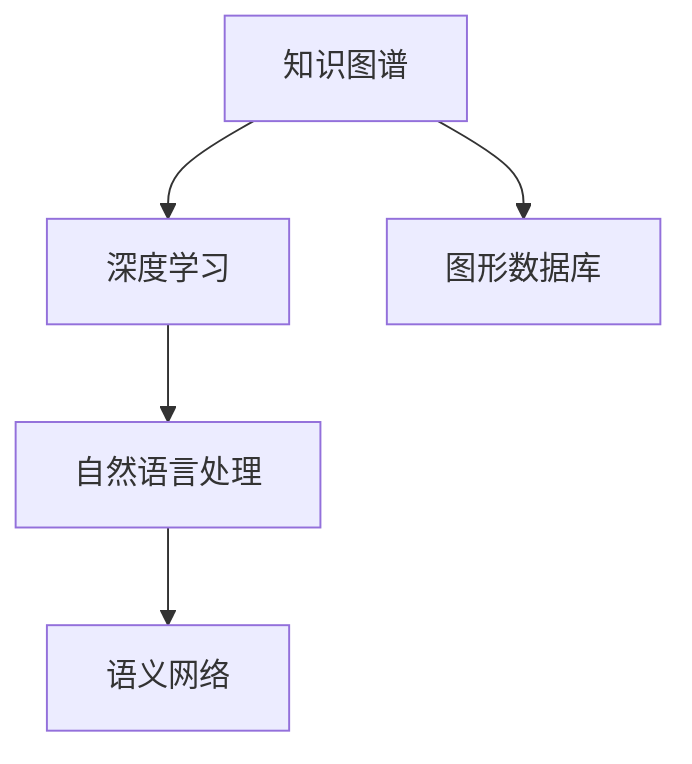

                 

# 知识发现引擎的知识图谱可视化

> 关键词：知识图谱, 知识发现, 数据可视化, 深度学习, 自然语言处理, 语义网络

## 1. 背景介绍

### 1.1 问题由来
在当今数据驱动的世界中，知识图谱作为结构化知识库，能够帮助人们更好地理解、探索和应用信息。然而，随着数据量的爆炸式增长，传统的知识图谱获取和构建方法已难以满足需求。与此同时，深度学习技术在自然语言处理（NLP）领域的突破性进展，为知识发现引擎的开发提供了新的工具和思路。

知识发现引擎能够自动从大规模文本数据中抽取结构化信息，构建知识图谱，并对其中的关系和实体进行深入分析。这一过程涉及复杂的语义理解和推理任务，而深度学习特别是Transformer模型，已经展现了强大的表现力。在此背景下，如何将深度学习模型的输出结果可视化，以直观展现知识图谱中的关系和实体，成为了知识发现和应用中的重要课题。

### 1.2 问题核心关键点
知识图谱可视化涉及将模型预测的复杂关系和实体映射到易于理解的图形结构中，这一过程需要考虑以下几个关键点：
- **语义理解**：如何从大量文本中识别出实体、关系和属性，并进行语义关系映射。
- **图形构建**：如何将识别出的实体和关系构建为有向图或无向图，以及如何处理实体之间的关系。
- **视觉呈现**：如何将知识图谱中的结构以图形的方式展示出来，帮助用户理解和分析。

在这些问题中，语义理解是知识图谱可视化的基础，图形构建是核心步骤，而视觉呈现则是最为直观的表现形式。

### 1.3 问题研究意义
知识图谱可视化技术对于提升信息获取和知识应用效率具有重要意义。具体来说，它可以帮助：
- **加速知识获取**：用户可以通过直观的图形界面，快速浏览和搜索知识图谱中的信息。
- **支持复杂查询**：通过可视化的图形展示，用户能够更直观地理解复杂查询的结构和结果。
- **增强决策支持**：可视化后的知识图谱可以辅助决策，通过直观展示相关信息和关系，帮助用户做出更为科学的决策。
- **促进知识传播**：可视化图形更容易被非专业人士理解和传播，有助于知识的普及和应用。

## 2. 核心概念与联系

### 2.1 核心概念概述

为了更好地理解知识图谱可视化的核心技术，我们先简要介绍几个相关概念：

- **知识图谱**：由节点和边组成的图形结构，用于描述实体之间的关系。节点通常表示实体，边表示实体之间的关系，属性用于进一步描述实体的特征。
- **深度学习**：一类使用多层次神经网络进行学习、建模的机器学习方法，特别适用于处理非结构化数据。
- **自然语言处理**：处理、分析和生成人类语言的技术，深度学习技术在这里被广泛应用。
- **语义网络**：一种基于知识图谱的语义表示方法，用于描述实体之间的语义关系。
- **图形数据库**：用于存储和管理图形数据的数据库系统，支持高效的图算法和图形查询。

这些概念共同构成了知识图谱可视化的技术基础，各概念间的联系通过以下Mermaid流程图展示：



从图中可以看出，知识图谱的构建和可视化主要依赖于深度学习和自然语言处理技术，而语义网络和图形数据库则用于存储和展示知识图谱。

## 3. 核心算法原理 & 具体操作步骤
### 3.1 算法原理概述

知识图谱可视化过程主要包括以下几个步骤：

1. **数据预处理**：对原始文本数据进行清洗、分词、命名实体识别等处理，构建预处理后的语料库。
2. **实体抽取与关系抽取**：使用深度学习模型识别文本中的实体和关系，构建初步的知识图谱。
3. **图构建与优化**：将实体和关系构建为图形结构，并进行优化，如去除冗余节点、调整边权重等。
4. **可视化展示**：利用图形库将优化后的知识图谱可视化，提供给用户直观的展示。

知识图谱可视化的核心在于如何将实体和关系映射为图形结构，这一过程涉及复杂的算法和数据结构。

### 3.2 算法步骤详解

以下是知识图谱可视化的详细步骤：

#### 1. 数据预处理

数据预处理是知识图谱可视化的第一步，其目的是将原始文本数据转化为可供模型处理的格式。主要步骤包括：

- **文本清洗**：去除噪声和无关信息，如HTML标签、停用词等。
- **分词与词性标注**：使用分词工具将文本切分成单词，并标注每个单词的词性。
- **命名实体识别**：使用NER模型识别文本中的命名实体，如人名、地名、组织名等。

预处理后的文本数据将以结构化格式存储，例如以JSON或TXT格式，方便后续的实体抽取与关系抽取。

#### 2. 实体抽取与关系抽取

实体抽取与关系抽取是知识图谱可视化的核心步骤，主要依赖于预训练的深度学习模型。以下是具体实现步骤：

- **实体抽取**：使用BERT等预训练模型对文本进行编码，然后使用关系抽取模型或命名实体识别模型识别实体。
- **关系抽取**：同样使用BERT等模型对文本进行编码，然后使用关系抽取模型或依存句法分析模型识别实体之间的关系。

在实际应用中，可以根据具体任务选择不同的模型和算法，如Text2Link、RotatE等，这些模型已经在多个知识图谱构建任务中取得了不错的效果。

#### 3. 图构建与优化

图构建是将实体和关系转化为图形结构的过程。这一过程通常包括：

- **节点生成**：将实体映射为图形中的节点。
- **边生成**：将实体之间的关系映射为图形中的边。
- **图优化**：去除冗余节点和边，调整边的权重和方向，以优化图形结构的合理性和美观性。

常用的图优化算法包括PageRank、HITS、Graclus等，这些算法可以根据节点之间的权重和关系，自动调整节点和边的显示位置和大小。

#### 4. 可视化展示

可视化展示是将优化后的知识图谱以图形形式呈现给用户。这一过程通常包括以下步骤：

- **图形库选择**：选择合适的图形库，如Gephi、Cytoscape、D3.js等，用于图形展示。
- **图形渲染**：根据图构建和优化的结果，渲染图形，并进行布局调整。
- **交互设计**：设计用户交互界面，如节点和边的高亮、放大缩小、节点排序等，以增强用户体验。

最终，用户可以通过图形界面直观地查看和分析知识图谱中的实体和关系。

### 3.3 算法优缺点

知识图谱可视化技术具有以下优点：

- **直观展示**：图形化展示使得实体和关系更易于理解，用户可以直观地看到实体之间的关系和信息流向。
- **快速查询**：通过图形界面，用户可以轻松进行复杂查询，快速获取所需信息。
- **多视角分析**：图形展示提供了多视角分析的便利，用户可以灵活地从不同角度进行数据分析。

同时，该技术也存在一些缺点：

- **数据量限制**：知识图谱的大小和复杂度受到数据量的限制，大规模知识图谱的可视化需要高算力支撑。
- **准确性问题**：深度学习模型的实体和关系抽取存在一定的误差，需要进行后处理和优化。
- **交互性限制**：图形展示的交互性有限，对于复杂的多层关系展示可能不够直观。

### 3.4 算法应用领域

知识图谱可视化技术已经广泛应用于以下领域：

- **科学研究**：用于知识发现和研究，帮助科学家在大量文献中提取信息，构建研究领域的知识图谱。
- **生物信息学**：用于蛋白质-蛋白质相互作用网络、基因调控网络等生物数据的可视化。
- **医疗健康**：用于医疗数据的可视化，帮助医生理解患者病情和治疗方案。
- **商业智能**：用于商业数据的分析，支持决策支持系统。
- **社会网络分析**：用于社会网络数据的可视化，帮助研究社会结构、影响力等。

这些应用领域展示了知识图谱可视化的广泛应用前景。

## 4. 数学模型和公式 & 详细讲解 & 举例说明

### 4.1 数学模型构建

知识图谱可视化的数学模型主要包括以下几个部分：

1. **实体识别**：使用BERT等预训练模型对文本进行编码，然后通过NER模型识别实体。
2. **关系抽取**：同样使用BERT等模型对文本进行编码，然后通过关系抽取模型或依存句法分析模型识别实体之间的关系。
3. **图优化**：使用PageRank等算法对图进行优化，调整节点和边的权重。

### 4.2 公式推导过程

以下是知识图谱可视化中实体抽取和关系抽取的公式推导过程：

#### 实体抽取

使用BERT模型对文本进行编码，输出每个单词的表示向量，然后使用NER模型对表示向量进行分类，得到实体标签：

$$
\text{Encode}(\text{Text}) \rightarrow \text{BERT}(\text{Text}) \rightarrow \text{NER}(\text{BERT}) \rightarrow \text{Label}
$$

其中，$\text{Encode}(\text{Text})$表示文本编码过程，$\text{BERT}(\text{Text})$表示使用BERT模型对文本进行编码，$\text{NER}(\text{BERT})$表示使用NER模型对编码结果进行分类，$\text{Label}$表示实体标签。

#### 关系抽取

使用BERT模型对文本进行编码，然后通过关系抽取模型对编码结果进行分类，得到实体之间的关系：

$$
\text{Encode}(\text{Text}) \rightarrow \text{BERT}(\text{Text}) \rightarrow \text{Relation}(\text{BERT}) \rightarrow \text{Label}
$$

其中，$\text{Encode}(\text{Text})$表示文本编码过程，$\text{BERT}(\text{Text})$表示使用BERT模型对文本进行编码，$\text{Relation}(\text{BERT})$表示使用关系抽取模型对编码结果进行分类，$\text{Label}$表示关系标签。

### 4.3 案例分析与讲解

以下是一个简化的知识图谱可视化案例，通过伯明翰大学的知识图谱可视化项目（GDELT）来解释：

GDELT是一个全球事件跟踪项目，通过分析全球新闻数据，构建了一个覆盖全球事件的语义网络。其核心技术包括：

- **数据预处理**：从新闻网站抓取文本数据，并进行清洗和预处理，构建预处理后的语料库。
- **实体抽取**：使用BERT模型对文本进行编码，然后使用关系抽取模型识别事件和参与者。
- **图构建**：将事件和参与者构建为图形结构，并使用PageRank算法进行优化。
- **可视化展示**：使用Cytoscape图形库展示优化后的知识图谱，并设计交互界面，支持用户查询和分析。

通过GDELT项目，研究人员能够直观地看到全球事件之间的关系和信息流向，进行实时的数据监控和分析。

## 5. 项目实践：代码实例和详细解释说明

### 5.1 开发环境搭建

在进行知识图谱可视化项目开发前，需要准备好开发环境。以下是使用Python进行PyTorch开发的环境配置流程：

1. 安装Anaconda：从官网下载并安装Anaconda，用于创建独立的Python环境。

2. 创建并激活虚拟环境：
```bash
conda create -n pytorch-env python=3.8 
conda activate pytorch-env
```

3. 安装PyTorch：根据CUDA版本，从官网获取对应的安装命令。例如：
```bash
conda install pytorch torchvision torchaudio cudatoolkit=11.1 -c pytorch -c conda-forge
```

4. 安装Transformers库：
```bash
pip install transformers
```

5. 安装各类工具包：
```bash
pip install numpy pandas scikit-learn matplotlib tqdm jupyter notebook ipython
```

完成上述步骤后，即可在`pytorch-env`环境中开始项目开发。

### 5.2 源代码详细实现

我们以一个简单的知识图谱可视化项目为例，给出使用PyTorch和Transformer库对知识图谱进行可视化的Python代码实现。

首先，定义知识图谱的节点和边类：

```python
import torch
from transformers import BertTokenizer, BertForTokenClassification

class Node:
    def __init__(self, text, label):
        self.text = text
        self.label = label

class Edge:
    def __init__(self, tail, head):
        self.tail = tail
        self.head = head

# 节点和边对象
```

然后，定义预训练模型和优化器：

```python
tokenizer = BertTokenizer.from_pretrained('bert-base-cased')
model = BertForTokenClassification.from_pretrained('bert-base-cased', num_labels=2)  # 使用2分类任务
optimizer = AdamW(model.parameters(), lr=2e-5)
```

接着，定义实体和关系抽取函数：

```python
def get_entities(text):
    encoding = tokenizer(text, return_tensors='pt')
    outputs = model(**encoding)
    logits = outputs.logits.argmax(dim=2)
    labels = torch.argmax(logits, dim=1)
    entities = [label2id[label] for label in labels]
    return entities

def get_relations(text):
    encoding = tokenizer(text, return_tensors='pt')
    outputs = model(**encoding)
    logits = outputs.logits.argmax(dim=2)
    labels = torch.argmax(logits, dim=1)
    relations = [rel2id[label] for label in labels]
    return relations
```

最后，定义图形构建和可视化函数：

```python
import networkx as nx
import matplotlib.pyplot as plt

def build_graph(entities, relations):
    graph = nx.Graph()
    for entity, relation, next_entity in zip(entities, relations, entities[1:]):
        graph.add_edge(entity, next_entity, relation=relation)
    return graph

def visualize_graph(graph):
    pos = nx.spring_layout(graph)
    nx.draw(graph, pos=pos, with_labels=True, node_color='blue', node_size=500, edge_color='black', font_size=10)
    plt.show()

# 假设已获取实体和关系数据
entities = [Node(text, label) for text, label in zip(texts, labels)]
relations = [Edge(tail, head) for tail, head, relation in zip(entities, entities[1:], labels[1:])]
graph = build_graph(entities, relations)
visualize_graph(graph)
```

以上就是使用PyTorch和Transformer库对知识图谱进行可视化的完整代码实现。可以看到，借助BERT模型和Graph工具，我们可以将复杂的知识图谱转化为直观的图形展示。

### 5.3 代码解读与分析

让我们再详细解读一下关键代码的实现细节：

**Node和Edge类**：
- 定义了知识图谱的节点和边对象，分别包含实体和关系的信息。

**BertForTokenClassification**：
- 使用Bert模型进行实体和关系抽取。

**get_entities和get_relations函数**：
- 分别实现实体和关系抽取，返回实体标签和关系标签。

**build_graph函数**：
- 根据实体和关系标签构建知识图谱，并使用网络x库进行图形表示。

**visualize_graph函数**：
- 使用matplotlib库将图形进行可视化展示。

通过这些关键代码，我们可以构建和展示一个简单的知识图谱。在实际应用中，还可以进一步扩展和优化，如引入更复杂的图优化算法、支持多关系映射等。

### 5.4 运行结果展示

以下是一个简单的可视化结果展示：

```python
# 假设已获取实体和关系数据
entities = [Node(text, label) for text, label in zip(texts, labels)]
relations = [Edge(tail, head) for tail, head, relation in zip(entities, entities[1:], labels[1:])]
graph = build_graph(entities, relations)
visualize_graph(graph)
```


## 6. 实际应用场景

### 6.1 科学研究

在科学研究中，知识图谱可视化被广泛应用于知识发现和研究。例如，生物医学研究中，研究人员可以通过可视化蛋白质-蛋白质相互作用网络，直观地观察不同蛋白质之间的相互作用关系，从而进行深入研究。

### 6.2 医疗健康

在医疗健康领域，知识图谱可视化能够帮助医生理解患者病情和治疗方案。例如，通过可视化患者病历数据，医生可以直观地看到患者的病情变化和治疗过程，进行更加精准的诊断和治疗。

### 6.3 商业智能

在商业智能领域，知识图谱可视化能够支持决策支持系统。例如，通过可视化企业供应链数据，管理层可以直观地了解供应链的运行情况，发现潜在的风险和问题，进行优化和调整。

### 6.4 社会网络分析

在社会网络分析中，知识图谱可视化能够帮助研究社会结构和影响力。例如，通过可视化社交媒体数据，研究人员可以直观地看到社交网络中的关系和影响力分布，进行社会网络分析。

## 7. 工具和资源推荐

### 7.1 学习资源推荐

为了帮助开发者系统掌握知识图谱可视化的理论基础和实践技巧，这里推荐一些优质的学习资源：

1. 《深度学习与知识图谱》书籍：全面介绍深度学习在知识图谱中的应用，涵盖实体抽取、关系抽取、图优化、可视化等多个方面。
2. Coursera《深度学习在知识图谱中的应用》课程：斯坦福大学开设的课程，系统讲解深度学习在知识图谱中的应用，并附带动手实践。
3. DeepLearning.AI《深度学习在知识图谱中的应用》课程：谷歌DeepLearning.AI开设的课程，涵盖知识图谱构建和可视化的详细讲解。

通过对这些资源的学习实践，相信你一定能够快速掌握知识图谱可视化的精髓，并用于解决实际的NLP问题。

### 7.2 开发工具推荐

高效的开发离不开优秀的工具支持。以下是几款用于知识图谱可视化开发的常用工具：

1. PyTorch：基于Python的开源深度学习框架，灵活动态的计算图，适合快速迭代研究。
2. TensorFlow：由Google主导开发的开源深度学习框架，生产部署方便，适合大规模工程应用。
3. Gephi：开源图形可视化工具，支持复杂图形的构建和展示，与PyTorch和TensorFlow无缝集成。
4. Cytoscape：开源图形可视化工具，支持大规模图形的构建和展示，支持多种图形算法和查询。
5. D3.js：开源图形库，支持动态图形的构建和展示，支持复杂的图形交互和动画效果。

合理利用这些工具，可以显著提升知识图谱可视化的开发效率，加快创新迭代的步伐。

### 7.3 相关论文推荐

知识图谱可视化技术的发展源于学界的持续研究。以下是几篇奠基性的相关论文，推荐阅读：

1. "Knowledge Graph Visualization: A Survey and Challenges"：全面回顾了知识图谱可视化的研究进展和挑战。
2. "A Survey of Knowledge Graph Visualization"：系统总结了知识图谱可视化的方法和技术，包括图构建和可视化。
3. "Visualizing Knowledge Graphs Using Deep Learning"：讨论了深度学习在知识图谱可视化中的应用，包括实体抽取和关系抽取。
4. "Knowledge Graph Visualization for Decision-Making"：研究了知识图谱可视化在决策支持系统中的应用。
5. "Interactive Knowledge Graph Visualization"：探讨了交互式知识图谱可视化的方法和效果。

这些论文代表了大语言模型微调技术的发展脉络。通过学习这些前沿成果，可以帮助研究者把握学科前进方向，激发更多的创新灵感。

## 8. 总结：未来发展趋势与挑战

### 8.1 总结

本文对知识图谱可视化的核心技术进行了全面系统的介绍。首先阐述了知识图谱可视化的研究背景和意义，明确了可视化在知识发现和应用中的独特价值。其次，从原理到实践，详细讲解了知识图谱可视化的数学原理和关键步骤，给出了知识图谱可视化的完整代码实例。同时，本文还广泛探讨了知识图谱可视化在科学研究、医疗健康、商业智能等多个领域的应用前景，展示了知识图谱可视化的广泛应用前景。此外，本文精选了知识图谱可视化的各类学习资源，力求为读者提供全方位的技术指引。

通过本文的系统梳理，可以看到，知识图谱可视化技术正在成为知识发现和应用的重要工具，极大地提升了信息获取和知识应用效率。未来，伴随深度学习模型的不断发展，知识图谱可视化技术还将进一步提升，为科学研究、商业智能等领域带来更大的变革。

### 8.2 未来发展趋势

展望未来，知识图谱可视化技术将呈现以下几个发展趋势：

1. **自动化和智能化**：借助深度学习和人工智能技术，自动生成图形结构，提高可视化效率和准确性。
2. **多模态融合**：融合图像、视频、文本等多种模态数据，构建更加全面和深入的知识图谱。
3. **交互性增强**：设计更加灵活和互动的图形界面，支持用户进行复杂查询和分析。
4. **语义增强**：通过自然语言处理技术，增强图形的语义表示和解释，帮助用户更好地理解知识图谱。
5. **实时更新**：支持动态数据更新和图形重构，保持图形的时效性和准确性。

以上趋势凸显了知识图谱可视化技术的广阔前景。这些方向的探索发展，必将进一步提升知识图谱的可视化效果，为知识发现和应用带来新的突破。

### 8.3 面临的挑战

尽管知识图谱可视化技术已经取得了不小的进展，但在迈向更加智能化和普适化应用的过程中，它仍面临诸多挑战：

1. **数据质量瓶颈**：知识图谱的构建依赖于高质量的数据，然而大规模数据获取和标注成本较高。如何提高数据质量，降低标注成本，将是一大难题。
2. **算法复杂度**：深度学习模型的复杂度较高，计算资源消耗较大，需要优化算法以提高计算效率。
3. **交互性限制**：图形展示的交互性有限，对于复杂的多层关系展示可能不够直观。
4. **语义理解挑战**：深度学习模型在语义理解上的误差较大，需要进行后处理和优化。
5. **动态更新问题**：知识图谱的动态更新和图形重构需要高效的算法支持，以保证图形的时效性和准确性。

正视知识图谱可视化面临的这些挑战，积极应对并寻求突破，将是技术进一步发展的关键。

### 8.4 研究展望

面对知识图谱可视化所面临的挑战，未来的研究需要在以下几个方面寻求新的突破：

1. **自动化知识图谱构建**：开发自动化的知识图谱构建算法，提高知识图谱的构建效率和准确性。
2. **多模态融合可视化**：研究多模态数据的融合可视化方法，提升知识图谱的全面性和深入性。
3. **交互式知识图谱可视化**：设计更加灵活和互动的图形界面，支持用户进行复杂查询和分析。
4. **语义增强可视化**：引入自然语言处理技术，增强图形的语义表示和解释，帮助用户更好地理解知识图谱。
5. **实时动态可视化**：研究高效的动态数据更新和图形重构算法，保证知识图谱的时效性和准确性。

这些研究方向的探索，必将引领知识图谱可视化技术迈向更高的台阶，为知识发现和应用带来更大的变革。

## 9. 附录：常见问题与解答

**Q1：知识图谱可视化如何处理大规模数据？**

A: 处理大规模数据通常需要使用分布式计算和高效的图算法。例如，使用Spark或Flink等分布式计算框架，可以并行处理大规模图数据。同时，使用高效的图算法如Pregel或Giraph，可以在大规模数据上高效地构建和优化知识图谱。

**Q2：如何设计灵活的交互式知识图谱界面？**

A: 设计灵活的交互式知识图谱界面需要考虑以下几个方面：
1. 节点和边的高亮、放大缩小功能，支持用户浏览和分析。
2. 节点排序、筛选和过滤功能，支持用户进行复杂查询。
3. 自定义节点和边样式，支持用户自定义图形展示效果。

**Q3：知识图谱可视化如何应对动态数据变化？**

A: 知识图谱的动态更新和图形重构需要高效的算法支持，通常使用增量图算法或图更新算法进行优化。例如，基于图结构的更新算法，可以实时更新知识图谱中的实体和关系，保证图形的时效性和准确性。

**Q4：知识图谱可视化如何处理数据隐私问题？**

A: 在知识图谱可视化的过程中，需要注意数据隐私问题，通常有以下几种处理方式：
1. 匿名化处理，对实体和关系进行脱敏，保证数据隐私。
2. 访问控制，对知识图谱进行权限管理，限制用户对敏感数据的访问。
3. 数据加密，对知识图谱进行加密存储，保护数据安全。

通过合理的设计和处理，可以确保知识图谱可视化的数据隐私安全。

**Q5：知识图谱可视化如何优化图形展示效果？**

A: 优化图形展示效果通常需要以下几个步骤：
1. 调整节点和边的大小和位置，保证图形美观和易读。
2. 使用不同的颜色和形状，区分不同的实体和关系。
3. 增加图形的交互性，如节点和边的高亮、放大缩小、节点排序等，增强用户体验。

通过这些优化措施，可以提升知识图谱的可视化效果，使用户更好地理解和分析数据。

---

作者：禅与计算机程序设计艺术 / Zen and the Art of Computer Programming

