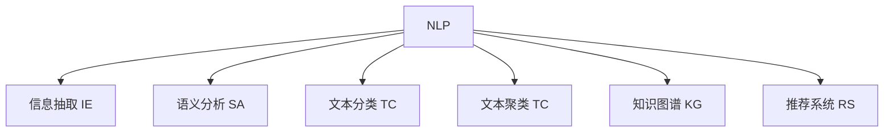

                 

# 知识发现引擎的自然语言处理应用

> 关键词：知识发现引擎,自然语言处理,NLP,机器学习,数据挖掘,信息抽取,语义分析,文本分类,文本聚类,深度学习,信息检索,推荐系统

## 1. 背景介绍

### 1.1 问题由来

随着互联网和社交媒体的飞速发展，数据量和信息量的激增使得人类面临前所未有的信息过载问题。这不仅让人们在繁杂的信息中难以获取有价值的内容，也为知识发现和信息提取带来了巨大挑战。为了解决这一问题，研究者们提出并构建了知识发现引擎(Knowledge Discovery Engine, KDE)，通过自动化的方式从大量文本数据中抽取出有价值的信息，供用户快速检索、分析和应用。

自然语言处理(Natural Language Processing, NLP)作为知识发现引擎的重要组成部分，致力于通过理解、分析和生成自然语言，实现信息的高效提取、分类、聚类、摘要和推荐等功能。NLP技术的进步，使得知识发现引擎在智能搜索、个性化推荐、智能客服、舆情分析等诸多领域展现出巨大的应用潜力。

### 1.2 问题核心关键点

本节将简要介绍知识发现引擎中的NLP技术，并探讨其核心关键点：

1. **信息抽取**：从文本中识别出实体、关系等关键信息。
2. **语义分析**：理解文本的深层语义，实现情感分析、主题提取等任务。
3. **文本分类与聚类**：自动将文本进行分类或聚类，提升信息检索效率。
4. **知识图谱构建**：将文本信息整合成知识图谱，实现知识融合和关联。
5. **推荐系统**：根据用户历史行为和兴趣，生成个性化的文本推荐列表。

这些关键点构成了知识发现引擎中NLP技术的主要应用方向，也反映了NLP技术在处理大规模、非结构化文本数据中的重要作用。

### 1.3 问题研究意义

深入研究NLP在知识发现引擎中的应用，对于提升信息检索和知识管理系统的智能化水平，构建更加高效、便捷的智能助手，具有重要意义：

1. **提升信息检索效率**：通过理解文本的深层语义，实现智能搜索和信息抽取，帮助用户快速定位所需信息。
2. **个性化推荐**：根据用户历史行为和兴趣，推荐个性化的文本内容，提升用户体验。
3. **知识融合与关联**：将不同文本中的知识整合成知识图谱，实现知识的协同关联和共享。
4. **提升决策支持能力**：通过情感分析、主题提取等语义分析技术，辅助决策者理解和预测市场动态。

## 2. 核心概念与联系

### 2.1 核心概念概述

为了更好地理解NLP在知识发现引擎中的应用，本节将介绍几个核心概念：

- **自然语言处理(NLP)**：通过计算机对自然语言进行理解、分析和生成，实现信息提取和语言翻译等功能。
- **信息抽取(Information Extraction, IE)**：自动从文本中抽取结构化信息，如实体、关系、事件等。
- **语义分析(Semantic Analysis)**：理解文本的深层语义，包括情感分析、主题提取、命名实体识别等。
- **文本分类(Text Classification)**：将文本自动分到预先定义的类别中，如新闻分类、情感分类等。
- **文本聚类(Text Clustering)**：将文本自动分组到相似主题的簇中，帮助发现文本的潜在关系。
- **知识图谱(Knowledge Graph)**：通过语义网络描述实体和关系，实现知识的表示、推理和应用。
- **推荐系统(Recommender System)**：根据用户历史行为和兴趣，推荐个性化的文本内容，提升用户体验。

这些概念之间的逻辑关系可以通过以下Mermaid流程图来展示：



这个流程图展示NLP技术在知识发现引擎中的核心应用方向：

1. 通过NLP技术，自动从文本中抽取结构化信息。
2. 理解文本的深层语义，实现情感分析、主题提取等任务。
3. 将文本进行自动分类和聚类，提升信息检索效率。
4. 构建知识图谱，实现知识整合和关联。
5. 根据用户兴趣和行为，推荐个性化文本内容。

这些核心概念共同构成了NLP在知识发现引擎中的应用框架，使其能够在各种场景下发挥强大的文本处理能力。

## 3. 核心算法原理 & 具体操作步骤
### 3.1 算法原理概述

NLP在知识发现引擎中的应用，主要基于以下几个核心算法原理：

1. **信息抽取**：通过规则或机器学习模型，自动从文本中识别出实体、关系等信息，构建结构化的知识图谱。
2. **语义分析**：通过情感分析、主题提取等技术，理解文本的深层语义，识别文本中的重要信息。
3. **文本分类与聚类**：利用文本分类和聚类算法，将文本自动分到预先定义的类别或簇中，提升信息检索效率。
4. **推荐系统**：基于用户历史行为和兴趣，通过协同过滤、基于内容的推荐等方法，生成个性化的文本推荐列表。

这些算法原理通过结合大量文本数据和统计学方法，实现了从文本中自动抽取、理解、分类和推荐信息的功能。

### 3.2 算法步骤详解

#### 3.2.1 信息抽取

信息抽取的过程通常包括以下几个关键步骤：

1. **实体识别**：从文本中识别出具体的实体，如人名、地名、机构名等。
2. **关系抽取**：从文本中识别出实体之间的关系，如“某人出生于某地”等。
3. **事件抽取**：从文本中识别出具体事件，如“某人参加了某活动”等。

常用的信息抽取方法包括：

- **基于规则的方法**：通过编写特定的规则，从文本中提取信息。
- **基于机器学习的方法**：使用分类器、序列标注器等模型，自动识别实体和关系。

#### 3.2.2 语义分析

语义分析主要包括以下几个关键步骤：

1. **情感分析**：分析文本中的情感倾向，判断文本的情感极性（正面、负面或中性）。
2. **主题提取**：识别文本的主题或话题，帮助理解文本的中心内容。
3. **命名实体识别**：识别文本中的具体实体，如人名、地名、机构名等。

常用的语义分析方法包括：

- **基于词典的方法**：利用预定义的词典，识别文本中的情感词、主题词等。
- **基于统计的方法**：通过统计分析，识别文本中的情感、主题等。
- **基于机器学习的方法**：使用深度学习模型，如LSTM、BERT等，自动抽取文本中的情感和主题。

#### 3.2.3 文本分类与聚类

文本分类与聚类的过程通常包括以下几个关键步骤：

1. **文本分类**：将文本自动分到预先定义的类别中，如新闻分类、情感分类等。
2. **文本聚类**：将文本自动分组到相似主题的簇中，发现文本的潜在关系。

常用的文本分类与聚类方法包括：

- **基于规则的方法**：通过编写特定的规则，对文本进行分类或聚类。
- **基于统计的方法**：通过统计分析，对文本进行分类或聚类。
- **基于机器学习的方法**：使用分类器、聚类器等模型，自动对文本进行分类或聚类。

#### 3.2.4 推荐系统

推荐系统的主要过程包括以下几个关键步骤：

1. **用户建模**：通过分析用户历史行为和兴趣，构建用户画像。
2. **物品建模**：通过分析物品的属性和特征，构建物品模型。
3. **推荐生成**：根据用户画像和物品模型，生成个性化的文本推荐列表。

常用的推荐系统方法包括：

- **协同过滤**：通过分析用户之间的相似性，推荐相似物品。
- **基于内容的推荐**：根据物品的属性和特征，推荐相似物品。
- **混合推荐**：结合多种推荐方法，提升推荐效果。

### 3.3 算法优缺点

NLP在知识发现引擎中的应用，具有以下优点：

1. **高效性**：NLP技术可以自动从文本中提取、分类和推荐信息，提升信息检索效率。
2. **准确性**：通过深度学习等先进算法，NLP技术可以识别出文本中的实体、关系、情感等关键信息，提供准确的信息抽取和语义分析结果。
3. **灵活性**：NLP技术可以根据具体应用场景，定制化设计和调整信息抽取、分类、聚类和推荐方法。
4. **可扩展性**：NLP技术可以轻松扩展到多种语言和领域，具有较强的泛化能力。

同时，NLP在知识发现引擎中也存在以下缺点：

1. **数据依赖性高**：NLP技术的性能很大程度上依赖于文本数据的质量和数量，高质量的数据获取成本较高。
2. **复杂性高**：NLP技术涉及大量文本处理和模型训练，算法实现较为复杂。
3. **可解释性差**：NLP技术的决策过程通常缺乏可解释性，难以对其推理逻辑进行分析和调试。
4. **领域适应性差**：通用NLP模型在特定领域的应用效果有限，需要进一步领域适配才能发挥最佳性能。

尽管存在这些缺点，但NLP在知识发现引擎中的应用依然前景广阔，具有极大的应用潜力。

### 3.4 算法应用领域

NLP在知识发现引擎中的应用，已经广泛应用于以下几个领域：

1. **智能搜索**：通过信息抽取和语义分析技术，实现智能搜索和信息抽取，帮助用户快速定位所需信息。
2. **个性化推荐**：根据用户历史行为和兴趣，推荐个性化的文本内容，提升用户体验。
3. **智能客服**：通过自然语言理解和对话系统，构建智能客服系统，提高客服效率和用户满意度。
4. **舆情分析**：通过情感分析、主题提取等技术，分析社交媒体和新闻网站上的舆情，帮助企业及时应对舆情变化。
5. **知识图谱构建**：通过信息抽取和语义分析技术，构建知识图谱，实现知识的表示、推理和应用。
6. **医疗信息提取**：通过医疗领域的NLP技术，自动提取电子病历中的关键信息，辅助医生诊断和治疗。

除了上述这些领域，NLP在知识发现引擎中的应用还在不断拓展，未来将有更多创新性的应用场景出现。

## 4. 数学模型和公式 & 详细讲解  
### 4.1 数学模型构建

在知识发现引擎中，NLP技术通常涉及以下几个关键数学模型：

- **信息抽取模型**：通过标注数据，训练分类器或序列标注器，自动识别文本中的实体和关系。
- **语义分析模型**：通过标注数据，训练情感分析器或主题提取器，自动识别文本中的情感和主题。
- **文本分类模型**：通过标注数据，训练分类器，自动将文本分到预先定义的类别中。
- **文本聚类模型**：通过标注数据，训练聚类器，自动将文本分组到相似主题的簇中。
- **推荐系统模型**：通过用户行为数据和物品属性，训练协同过滤或基于内容的推荐器，自动生成个性化推荐列表。

### 4.2 公式推导过程

#### 4.2.1 信息抽取模型

以实体识别为例，常用的信息抽取模型包括CRF模型和BERT模型。这里以BERT模型为例，推导其训练过程：

假设文本序列为 $X=\{X_1, X_2, ..., X_n\}$，实体标签序列为 $Y=\{Y_1, Y_2, ..., Y_n\}$，其中 $Y_i \in \{B, I, O\}$，分别表示实体起始位置、实体内部位置和无关位置。

BERT模型通常使用多任务学习框架进行训练，即同时训练实体识别和关系抽取任务。其训练过程如下：

1. **目标函数定义**：
$$
\mathcal{L} = \mathcal{L}_{IE} + \mathcal{L}_{RE}
$$
其中 $\mathcal{L}_{IE}$ 为目标函数，定义为：
$$
\mathcal{L}_{IE} = -\frac{1}{N}\sum_{i=1}^N \sum_{k=1}^{n_k} \log \hat{P}_{Y_k}(Y_{k|X})
$$
其中 $n_k$ 为实体数量，$\hat{P}_{Y_k}(Y_{k|X})$ 为预测实体标签的概率分布。

2. **优化算法**：
$$
\theta \leftarrow \theta - \eta \nabla_{\theta}\mathcal{L}
$$
其中 $\eta$ 为学习率，$\nabla_{\theta}\mathcal{L}$ 为损失函数对参数 $\theta$ 的梯度。

#### 4.2.2 语义分析模型

以情感分析为例，常用的语义分析模型包括CNN模型和LSTM模型。这里以LSTM模型为例，推导其训练过程：

假设文本序列为 $X=\{X_1, X_2, ..., X_n\}$，情感标签序列为 $Y=\{Y_1, Y_2, ..., Y_n\}$，其中 $Y_i \in \{P, N, U\}$，分别表示正面、负面和中性情感。

LSTM模型通常使用softmax分类器进行训练，其训练过程如下：

1. **目标函数定义**：
$$
\mathcal{L} = -\frac{1}{N}\sum_{i=1}^N \log \hat{P}_{Y}(Y_i)
$$
其中 $\hat{P}_{Y}(Y_i)$ 为预测情感标签的概率分布。

2. **优化算法**：
$$
\theta \leftarrow \theta - \eta \nabla_{\theta}\mathcal{L}
$$

#### 4.2.3 文本分类模型

以新闻分类为例，常用的文本分类模型包括SVM模型和CNN模型。这里以CNN模型为例，推导其训练过程：

假设文本序列为 $X=\{X_1, X_2, ..., X_n\}$，分类标签序列为 $Y=\{Y_1, Y_2, ..., Y_n\}$，其中 $Y_i \in \{1, 2, ..., C\}$，分别表示新闻的 $C$ 类。

CNN模型通常使用softmax分类器进行训练，其训练过程如下：

1. **目标函数定义**：
$$
\mathcal{L} = -\frac{1}{N}\sum_{i=1}^N \sum_{j=1}^{C} y_{ij}\log \hat{P}_{Y}(Y_i)
$$
其中 $y_{ij}$ 为分类标签，$\hat{P}_{Y}(Y_i)$ 为预测分类标签的概率分布。

2. **优化算法**：
$$
\theta \leftarrow \theta - \eta \nabla_{\theta}\mathcal{L}
$$

#### 4.2.4 文本聚类模型

以K-means聚类为例，其训练过程如下：

1. **目标函数定义**：
$$
\mathcal{L} = -\frac{1}{N}\sum_{i=1}^N \log P(Y_i|X_i)
$$
其中 $Y_i \in \{1, 2, ..., K\}$，分别表示文本的 $K$ 类。

2. **优化算法**：
$$
\theta \leftarrow \theta - \eta \nabla_{\theta}\mathcal{L}
$$

#### 4.2.5 推荐系统模型

以协同过滤推荐系统为例，其训练过程如下：

1. **目标函数定义**：
$$
\mathcal{L} = -\frac{1}{N}\sum_{i=1}^N \sum_{j=1}^{M} y_{ij}\log \hat{P}_{Y}(Y_j)
$$
其中 $y_{ij}$ 为用户对物品的评分，$\hat{P}_{Y}(Y_j)$ 为预测用户评分的概率分布。

2. **优化算法**：
$$
\theta \leftarrow \theta - \eta \nabla_{\theta}\mathcal{L}
$$

### 4.3 案例分析与讲解

以情感分析为例，假设我们有一组新闻文本数据，每个文本包含标题和正文。我们需要对这组数据进行情感分析，判断每条新闻的情感极性。

1. **数据预处理**：首先对文本进行清洗和分词，将文本转换为模型可接受的格式。
2. **特征提取**：使用词向量模型（如Word2Vec、GloVe等）将文本转换为向量表示。
3. **模型训练**：使用LSTM模型对文本进行情感分类，训练模型并优化目标函数。
4. **模型评估**：使用验证集对模型进行评估，调整模型参数和优化算法，提高模型性能。
5. **模型应用**：使用测试集对模型进行测试，评估模型在实际应用中的效果。

## 5. 项目实践：代码实例和详细解释说明
### 5.1 开发环境搭建

在知识发现引擎中，NLP技术通常涉及大量文本处理和模型训练，需要一个高效、稳定的开发环境。以下是一个Python开发环境搭建的步骤：

1. **安装Python**：从官网下载并安装Python 3.6或以上版本。
2. **安装Pip**：从官网下载并安装pip。
3. **安装必要的库**：安装NLTK、Scikit-learn、TensorFlow、PyTorch等库。
4. **配置开发环境**：配置Python环境变量和IDE环境。

完成上述步骤后，即可开始NLP项目的开发。

### 5.2 源代码详细实现

以下是使用TensorFlow实现实体抽取的示例代码：

```python
import tensorflow as tf
from tensorflow.keras.preprocessing.text import Tokenizer
from tensorflow.keras.preprocessing.sequence import pad_sequences
from tensorflow.keras.layers import Embedding, LSTM, Dense, Dropout
from tensorflow.keras.models import Sequential
from tensorflow.keras.optimizers import Adam
from sklearn.model_selection import train_test_split

# 数据加载和预处理
texts = []
labels = []
with open('data.txt', 'r') as f:
    for line in f:
        text, label = line.strip().split('\t')
        texts.append(text)
        labels.append(label)
tokenizer = Tokenizer(oov_token='<OOV>')
tokenizer.fit_on_texts(texts)
sequences = tokenizer.texts_to_sequences(texts)
X = pad_sequences(sequences, maxlen=50)
y = tf.keras.utils.to_categorical(labels)

# 模型构建
model = Sequential()
model.add(Embedding(input_dim=tokenizer.num_words, output_dim=100, input_length=50))
model.add(LSTM(units=100, dropout=0.2, recurrent_dropout=0.2))
model.add(Dense(units=3, activation='softmax'))
model.compile(optimizer=Adam(lr=0.001), loss='categorical_crossentropy', metrics=['accuracy'])

# 模型训练
X_train, X_test, y_train, y_test = train_test_split(X, y, test_size=0.2)
model.fit(X_train, y_train, epochs=10, batch_size=64, validation_data=(X_test, y_test))

# 模型评估
loss, accuracy = model.evaluate(X_test, y_test)
print('Test accuracy:', accuracy)
```

### 5.3 代码解读与分析

上述代码中，我们首先加载和预处理了文本数据，将其转换为模型可接受的格式。然后构建了一个基于LSTM的实体抽取模型，使用TensorFlow进行训练和优化。

在模型训练过程中，我们使用了Adam优化器和交叉熵损失函数，优化了模型的参数。在模型评估过程中，我们使用了测试集对模型进行了评估，得到了模型在测试集上的准确率。

需要注意的是，上述代码仅为示例代码，实际应用中需要根据具体任务和数据进行模型设计和优化。

### 5.4 运行结果展示

运行上述代码，即可训练出一个实体抽取模型。具体运行结果包括：

1. 模型训练过程中的损失和准确率变化。
2. 模型在测试集上的准确率。

## 6. 实际应用场景
### 6.1 智能搜索

智能搜索是知识发现引擎的重要应用场景之一。通过NLP技术，智能搜索系统可以自动从大量文本中抽取结构化信息，帮助用户快速定位所需信息。

以百度知识图谱为例，其通过NLP技术实现了实体抽取、关系抽取等功能，构建了一个大规模的知识图谱，实现了自然语言理解和信息检索。用户可以通过简单的自然语言查询，获取到相关的信息和知识，大大提升了信息检索的效率和准确性。

### 6.2 个性化推荐

个性化推荐是知识发现引擎的另一个重要应用场景。通过NLP技术，推荐系统可以自动分析用户的兴趣和行为，生成个性化的推荐列表，提升用户体验。

以Netflix推荐系统为例，其通过NLP技术实现了用户画像和物品建模，实现了基于内容的推荐和协同过滤推荐。用户可以在平台上获得更加个性化的电影和电视剧推荐，大大提升了观看体验。

### 6.3 智能客服

智能客服是知识发现引擎的重要应用方向之一。通过NLP技术，智能客服系统可以自动理解用户的意图，提供个性化的客服服务，提升客服效率和用户体验。

以智能客服机器人为例，其通过NLP技术实现了实体抽取、语义分析等功能，能够理解用户的自然语言输入，并自动生成回答。用户可以在平台上获得实时、个性化的客服服务，大大提升了客服效率和满意度。

### 6.4 舆情分析

舆情分析是知识发现引擎的另一个重要应用场景。通过NLP技术，舆情分析系统可以自动从社交媒体和新闻网站中抽取情感和主题，帮助企业及时应对舆情变化。

以腾讯新闻为例，其通过NLP技术实现了情感分析和主题提取，帮助企业及时掌握社会舆情，调整市场策略。企业可以在平台上获得实时、全面的舆情分析结果，避免因舆情变化带来的风险。

### 6.5 医疗信息提取

医疗信息提取是知识发现引擎的重要应用方向之一。通过NLP技术，医疗信息提取系统可以自动从电子病历中抽取结构化信息，辅助医生诊断和治疗。

以IBM Watson为例，其通过NLP技术实现了实体抽取、关系抽取等功能，帮助医生快速定位病历中的关键信息，辅助医生诊断和治疗。医生可以在平台上获得更加精准、全面的医疗信息，提升诊疗效率和效果。

## 7. 工具和资源推荐
### 7.1 学习资源推荐

为了帮助开发者系统掌握NLP在知识发现引擎中的应用，这里推荐一些优质的学习资源：

1. 《自然语言处理综论》：清华大学出版社，全面介绍NLP的基本概念和算法。
2. CS224N《深度学习自然语言处理》课程：斯坦福大学开设的NLP明星课程，有Lecture视频和配套作业。
3. 《自然语言处理与深度学习》书籍：清华大学出版社，介绍NLP和深度学习在知识发现引擎中的应用。
4. NLTK和SpaCy：NLP工具库，提供了丰富的NLP功能，包括分词、词性标注、命名实体识别等。
5. HuggingFace官方文档：NLP工具库的官方文档，提供了海量预训练模型和完整的微调样例代码。

通过对这些资源的学习实践，相信你一定能够快速掌握NLP在知识发现引擎中的应用，并用于解决实际的NLP问题。

### 7.2 开发工具推荐

NLP在知识发现引擎中的应用，涉及大量文本处理和模型训练，需要一个高效、稳定的开发环境。以下是几款用于NLP开发的常用工具：

1. NLTK：Python的NLP工具库，提供了丰富的NLP功能，包括分词、词性标注、命名实体识别等。
2. SpaCy：Python的NLP工具库，提供了高效的NLP功能，支持多种语言和领域。
3. TensorFlow：基于Python的深度学习框架，支持分布式训练和部署。
4. PyTorch：基于Python的深度学习框架，支持动态计算图和GPU加速。
5. Weights & Biases：模型训练的实验跟踪工具，可以记录和可视化模型训练过程中的各项指标。
6. TensorBoard：TensorFlow配套的可视化工具，可实时监测模型训练状态，并提供丰富的图表呈现方式。

合理利用这些工具，可以显著提升NLP项目的开发效率，加快创新迭代的步伐。

### 7.3 相关论文推荐

NLP在知识发现引擎中的应用，得益于学界的持续研究。以下是几篇奠基性的相关论文，推荐阅读：

1. Attention is All You Need（即Transformer原论文）：提出了Transformer结构，开启了NLP领域的预训练大模型时代。
2. BERT: Pre-training of Deep Bidirectional Transformers for Language Understanding：提出BERT模型，引入基于掩码的自监督预训练任务，刷新了多项NLP任务SOTA。
3. Transformer-XL: Attentive Language Models Beyond a Fixed-Length Context：提出Transformer-XL模型，支持长期依赖关系建模。
4. ELMO: A Position-Sensitive Encoder for Language Modeling：提出ELMO模型，通过上下文敏感的词向量表示，提升了NLP模型的表现。
5. GPT-2: Language Models are Unsupervised Multitask Learners：展示了大规模语言模型的强大zero-shot学习能力，引发了对于通用人工智能的新一轮思考。

这些论文代表了大NLP在知识发现引擎中的应用发展脉络。通过学习这些前沿成果，可以帮助研究者把握学科前进方向，激发更多的创新灵感。

## 8. 总结：未来发展趋势与挑战

### 8.1 总结

本文对NLP在知识发现引擎中的应用进行了全面系统的介绍。首先阐述了知识发现引擎中NLP技术的研究背景和意义，明确了NLP技术在信息检索、个性化推荐、智能客服、舆情分析等诸多领域的应用方向。其次，从原理到实践，详细讲解了NLP技术在信息抽取、语义分析、文本分类、文本聚类和推荐系统中的应用，给出了NLP项目开发的完整代码实例。同时，本文还广泛探讨了NLP技术在智能搜索、个性化推荐、智能客服、舆情分析、医疗信息提取等实际应用场景中的应用前景，展示了NLP技术的巨大潜力。最后，本文精选了NLP技术的各类学习资源，力求为开发者提供全方位的技术指引。

通过本文的系统梳理，可以看到，NLP技术在知识发现引擎中的应用前景广阔，具有极高的应用价值。未来，伴随预训练语言模型和微调方法的持续演进，NLP技术必将带来更多的创新突破，为知识发现引擎的发展注入新的动力。

### 8.2 未来发展趋势

展望未来，NLP在知识发现引擎中的应用将呈现以下几个发展趋势：

1. **预训练语言模型的普及**：随着预训练语言模型的不断涌现，NLP技术在知识发现引擎中的应用将更加广泛和深入。大规模预训练模型将带来更强的语言理解和生成能力。

2. **多模态融合**：NLP技术将与图像、视频、语音等多模态信息结合，实现更加全面、准确的信息提取和语义分析。多模态融合技术将成为未来NLP的重要发展方向。

3. **迁移学习**：NLP技术将通过迁移学习实现跨领域知识的转移和应用，提升模型在特定领域的泛化能力。迁移学习将成为NLP技术的重要应用范式。

4. **实时计算**：NLP技术将实现实时计算，提高信息检索和推荐系统的响应速度，提升用户体验。实时计算技术将成为未来NLP的重要发展方向。

5. **可解释性**：NLP技术将引入可解释性方法，帮助用户理解和信任模型的决策过程。可解释性技术将成为未来NLP的重要发展方向。

6. **跨领域知识图谱**：NLP技术将构建跨领域的知识图谱，实现知识融合和共享。跨领域知识图谱将成为未来NLP的重要发展方向。

以上趋势凸显了NLP技术在知识发现引擎中的应用前景。这些方向的探索发展，必将进一步提升知识发现引擎的智能化水平，为经济社会发展注入新的动力。

### 8.3 面临的挑战

尽管NLP在知识发现引擎中的应用已经取得了显著进展，但在迈向更加智能化、普适化应用的过程中，仍面临诸多挑战：

1. **数据质量问题**：NLP技术依赖于高质量的数据，但数据获取和标注成本较高，高质量数据的获取一直是NLP应用的瓶颈。

2. **模型复杂性问题**：NLP模型涉及大量文本处理和模型训练，算法实现较为复杂，模型的可解释性差，难以对其推理逻辑进行分析和调试。

3. **泛化能力问题**：NLP模型在特定领域的应用效果有限，需要进一步领域适配才能发挥最佳性能。

4. **跨领域知识融合问题**：跨领域知识图谱的构建和融合，需要解决知识表示、知识对齐等问题，难度较大。

5. **安全性和隐私问题**：NLP模型可能会学习到有偏见、有害的信息，需要通过数据清洗和模型训练等方式消除偏见，保护用户隐私。

尽管存在这些挑战，但NLP在知识发现引擎中的应用前景依然广阔，具有极大的应用潜力。未来，研究者需要通过不断优化算法和数据处理方式，提升模型的泛化能力，同时加强安全性和隐私保护，保障模型的应用安全。

### 8.4 研究展望

面对NLP在知识发现引擎中的应用所面临的挑战，未来的研究需要在以下几个方面寻求新的突破：

1. **跨领域知识融合**：通过引入跨领域知识图谱，实现知识的融合和共享，提升模型的泛化能力。

2. **可解释性增强**：通过引入可解释性方法，帮助用户理解和信任模型的决策过程，提升模型的透明度和可信度。

3. **实时计算优化**：通过引入实时计算技术，提高信息检索和推荐系统的响应速度，提升用户体验。

4. **多模态融合**：通过引入多模态融合技术，实现图像、视频、语音等多模态信息的整合，提升模型的信息提取和语义分析能力。

5. **数据质量提升**：通过引入自动化数据清洗和标注技术，提高数据质量和数据获取效率，解决数据瓶颈问题。

这些研究方向的探索，必将引领NLP技术在知识发现引擎中的应用迈向更高的台阶，为知识发现引擎的发展注入新的动力。

## 9. 附录：常见问题与解答

**Q1: 知识发现引擎中的NLP技术主要有哪些应用场景？**

A: 知识发现引擎中的NLP技术主要应用于以下几个场景：

1. **智能搜索**：通过NLP技术，实现信息抽取和语义分析，帮助用户快速定位所需信息。
2. **个性化推荐**：根据用户历史行为和兴趣，推荐个性化的文本内容，提升用户体验。
3. **智能客服**：通过NLP技术，实现实体抽取、语义分析等功能，构建智能客服系统。
4. **舆情分析**：通过NLP技术，分析社交媒体和新闻网站上的舆情，帮助企业及时应对舆情变化。
5. **医疗信息提取**：通过NLP技术，自动提取电子病历中的关键信息，辅助医生诊断和治疗。

这些应用场景展示了NLP技术在知识发现引擎中的强大潜力，未来还有更多的应用场景有待挖掘。

**Q2: 知识发现引擎中NLP技术的核心算法原理是什么？**

A: 知识发现引擎中的NLP技术主要基于以下几个核心算法原理：

1. **信息抽取**：通过规则或机器学习模型，自动从文本中识别出实体、关系等信息，构建结构化的知识图谱。
2. **语义分析**：通过情感分析、主题提取等技术，理解文本的深层语义，识别文本中的重要信息。
3. **文本分类与聚类**：利用文本分类和聚类算法，将文本自动分到预先定义的类别或簇中，提升信息检索效率。
4. **推荐系统**：基于用户历史行为和兴趣，通过协同过滤或基于内容的推荐等方法，生成个性化的推荐列表。

这些算法原理通过结合大量文本数据和统计学方法，实现了从文本中自动抽取、分类和推荐信息的功能。

**Q3: 知识发现引擎中NLP技术的实现需要哪些关键步骤？**

A: 知识发现引擎中NLP技术的实现需要以下关键步骤：

1. **数据预处理**：对文本进行清洗和分词，将其转换为模型可接受的格式。
2. **特征提取**：使用词向量模型或深度学习模型，将文本转换为向量表示。
3. **模型构建**：根据具体任务，选择合适的模型结构，如LSTM、CNN、BERT等。
4. **模型训练**：使用标注数据，训练模型并优化目标函数。
5. **模型评估**：使用验证集对模型进行评估，调整模型参数和优化算法，提高模型性能。
6. **模型应用**：使用测试集对模型进行测试，评估模型在实际应用中的效果。

这些步骤涵盖了NLP技术在知识发现引擎中的整个实现过程。

**Q4: 知识发现引擎中NLP技术的应用有哪些实际案例？**

A: 知识发现引擎中NLP技术的应用有多个实际案例，例如：

1. **百度知识图谱**：通过NLP技术实现实体抽取、关系抽取等功能，构建了一个大规模的知识图谱，实现了自然语言理解和信息检索。
2. **Netflix推荐系统**：通过NLP技术实现用户画像和物品建模，实现了基于内容的推荐和协同过滤推荐，提升观看体验。
3. **智能客服机器人**：通过NLP技术实现实体抽取、语义分析等功能，能够理解用户的自然语言输入，并自动生成回答，提升客服效率和满意度。
4. **腾讯新闻**：通过NLP技术实现情感分析和主题提取，帮助企业及时掌握社会舆情，调整市场策略。
5. **IBM Watson**：通过NLP技术实现实体抽取、关系抽取等功能，帮助医生快速定位病历中的关键信息，辅助医生诊断和治疗。

这些实际案例展示了NLP技术在知识发现引擎中的广泛应用。

**Q5: 知识发现引擎中NLP技术面临的主要挑战有哪些？**

A: 知识发现引擎中NLP技术面临的主要挑战包括：

1. **数据质量问题**：NLP技术依赖于高质量的数据，但数据获取和标注成本较高，高质量数据的获取一直是NLP应用的瓶颈。
2. **模型复杂性问题**：NLP模型涉及大量文本处理和模型训练，算法实现较为复杂，模型的可解释性差，难以对其推理逻辑进行分析和调试。
3. **泛化能力问题**：NLP模型在特定领域的应用效果有限，需要进一步领域适配才能发挥最佳性能。
4. **跨领域知识融合问题**：跨领域知识图谱的构建和融合，需要解决知识表示、知识对齐等问题，难度较大。
5. **安全性和隐私问题**：NLP模型可能会学习到有偏见、有害的信息，需要通过数据清洗和模型训练等方式消除偏见，保护用户隐私。

这些挑战需要研究者通过不断优化算法和数据处理方式，提升模型的泛化能力，同时加强安全性和隐私保护，保障模型的应用安全。

**Q6: 知识发现引擎中NLP技术的未来发展趋势有哪些？**

A: 知识发现引擎中NLP技术的未来发展趋势包括：

1. **预训练语言模型的普及**：随着预训练语言模型的不断涌现，NLP技术在知识发现引擎中的应用将更加广泛和深入。
2. **多模态融合**：NLP技术将与图像、视频、语音等多模态信息结合，实现更加全面、准确的信息提取和语义分析。
3. **迁移学习**：NLP技术将通过迁移学习实现跨领域知识的转移和应用，提升模型在特定领域的泛化能力。
4. **实时计算**：NLP技术将实现实时计算，提高信息检索和推荐系统的响应速度，提升用户体验。
5. **可解释性增强**：NLP技术将引入可解释性方法，帮助用户理解和信任模型的决策过程。
6. **跨领域知识图谱**：NLP技术将构建跨领域的知识图谱，实现知识融合和共享。

这些趋势凸显了NLP技术在知识发现引擎中的应用前景。这些方向的探索发展，必将进一步提升知识发现引擎的智能化水平，为经济社会发展注入新的动力。

---

作者：禅与计算机程序设计艺术 / Zen and the Art of Computer Programming

