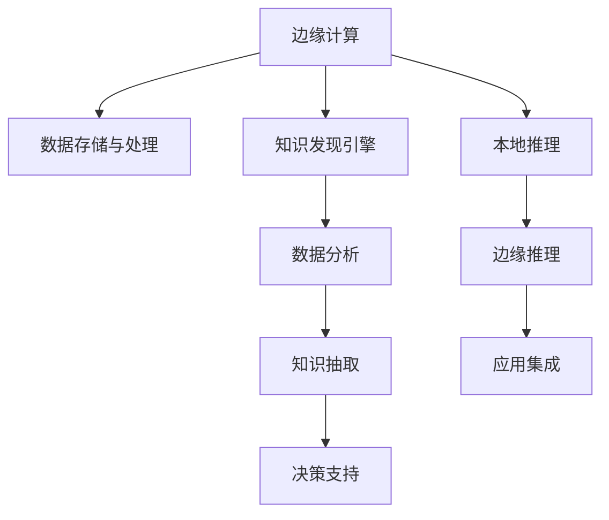

                 

# 知识发现引擎的边缘计算应用

## 1. 背景介绍

在当今数据驱动的时代，知识发现（Knowledge Discovery, KD）作为人工智能（AI）和机器学习（ML）领域的一个重要分支，日益受到广泛关注。通过对大数据的分析和挖掘，KD能够帮助企业和组织从海量数据中提取有用信息，支持决策制定和业务优化。随着物联网（IoT）设备数量的激增，数据的生成和传播速度也在不断提升，边缘计算（Edge Computing）在分布式环境下的优势逐渐显现。本博文将探讨知识发现引擎如何在边缘计算环境中应用，以提供更高效、更智能的决策支持。

## 2. 核心概念与联系

### 2.1 核心概念概述

边缘计算与知识发现引擎是当今技术发展中的两大热门话题。边缘计算是一种分布式计算架构，数据在靠近数据源（如传感器、物联网设备等）的本地进行处理，从而减少数据传输延时和带宽消耗，提升数据处理的实时性和效率。而知识发现引擎则通过自动化分析和挖掘数据，揭示数据背后的模式、趋势和关联，帮助用户做出更好的决策。将这两个概念结合起来，边缘计算环境下知识发现引擎的应用，可以大幅提升数据处理的实时性和智能化程度。

为更好地理解这种结合，我们可以通过以下Mermaid流程图展示其核心概念之间的联系：



该流程图示意图将边缘计算与知识发现引擎的应用过程整合在一起，展示了数据在本地边缘设备上的存储和处理，经过知识发现引擎的分析和挖掘，最终通过边缘推理实现实时决策支持的过程。

### 2.2 核心概念原理和架构

#### 2.2.1 边缘计算

边缘计算的核心理念是将数据处理和推理任务从中心服务器转移到靠近数据源的本地边缘设备上，以减少延迟、降低带宽消耗并提升响应速度。这通常涉及以下几个关键组件：

- **边缘设备**：如智能手机、智能家居设备、传感器等，负责数据的采集和初步处理。
- **边缘计算平台**：如IoT网关、边缘服务器等，用于接收来自边缘设备的数据，进行预处理、存储和推理。
- **云服务**：如云计算平台，用于存储海量数据和复杂的模型，提供计算和存储资源支持。

#### 2.2.2 知识发现引擎

知识发现引擎是一种利用算法和模型自动挖掘数据中潜在知识的工具。其主要包括以下几个关键环节：

- **数据预处理**：清洗、筛选和转换原始数据，使其适合进行分析。
- **特征工程**：提取、选择和构建数据特征，提高模型的准确性和泛化能力。
- **模型训练**：选择合适的机器学习模型，如回归、分类、聚类等，对数据进行训练和优化。
- **知识抽取**：从训练好的模型中抽取关键知识和模式，如关联规则、异常检测、趋势预测等。
- **决策支持**：基于提取的知识，辅助用户进行决策制定，如推荐系统、风险评估等。

### 2.3 核心概念的联系

边缘计算与知识发现引擎的结合，主要是通过边缘计算平台将本地采集的数据进行处理和分析，并将分析结果通过边缘推理应用于实时决策。这种结合有以下几个关键联系：

- **数据实时性**：边缘计算平台靠近数据源，可以实时处理和分析数据，极大提升了知识发现的实时性。
- **计算效率**：将数据处理任务从中心服务器转移到边缘设备，减少了数据传输延时和带宽消耗，提高了计算效率。
- **决策支持**：知识发现引擎的分析结果可以通过边缘推理，直接应用于实时决策支持，帮助用户做出更快速的反应。

## 3. 核心算法原理 & 具体操作步骤

### 3.1 算法原理概述

知识发现引擎在边缘计算环境下的应用，主要通过以下几个关键步骤实现：

1. **数据采集与存储**：通过边缘设备实时采集数据，并将其存储在边缘计算平台中。
2. **数据预处理与特征工程**：对采集到的数据进行清洗、筛选和特征构建，为后续模型训练和分析做准备。
3. **模型训练与优化**：在边缘计算平台或云端，使用机器学习模型对数据进行训练和优化，提取有用的知识模式。
4. **边缘推理与决策支持**：将训练好的模型部署在边缘设备上，实时处理新数据，并通过边缘推理生成决策支持结果。

### 3.2 算法步骤详解

#### 3.2.1 数据采集与存储

在边缘计算环境中，数据采集通常由传感器、物联网设备等边缘设备完成。这些设备通常通过无线网络（如Wi-Fi、蓝牙、Zigbee等）将数据传输到边缘计算平台，如图示中的IoT网关或边缘服务器。在存储过程中，数据通常会被分散存储在多个边缘设备或边缘计算节点上，以便于后续的分布式处理和推理。

#### 3.2.2 数据预处理与特征工程

数据预处理和特征工程是知识发现引擎应用的关键环节。预处理包括清洗、去噪、归一化等步骤，以确保数据的质量和一致性。特征工程则通过提取、选择和构建数据特征，提高模型的准确性和泛化能力。这些步骤通常在边缘计算平台或云端进行，如图示中的边缘服务器或云计算平台。

#### 3.2.3 模型训练与优化

模型训练和优化是知识发现引擎的核心任务。在边缘计算环境中，模型训练可以通过分布式计算方式实现，即将训练任务分解到多个边缘计算节点或云端计算节点上进行并行处理。这不仅可以提高计算效率，还可以减轻中心服务器的负载。模型优化则通过调整模型参数和超参数，进一步提升模型性能。

#### 3.2.4 边缘推理与决策支持

边缘推理是知识发现引擎在边缘计算环境下的应用结果。通过将训练好的模型部署在边缘设备上，可以实时处理新数据，并生成决策支持结果。这些结果可以直接用于实时决策支持，如图示中的边缘推理结果和决策支持建议。

### 3.3 算法优缺点

#### 3.3.1 优点

- **实时性**：由于数据在边缘设备上实时处理，可以极大地提升知识发现的实时性，支持实时决策支持。
- **计算效率**：通过分布式计算和边缘推理，减少了数据传输延时和带宽消耗，提高了计算效率。
- **安全性**：将数据处理任务在本地边缘设备上进行，可以减少数据泄露的风险，提高数据安全性。

#### 3.3.2 缺点

- **复杂度**：边缘计算环境中，数据分布、模型训练和推理等环节复杂度较高，需要综合考虑硬件资源、网络环境等因素。
- **负载均衡**：边缘计算平台需要合理分配计算资源，避免某些边缘节点负载过重。
- **扩展性**：随着数据量的增加，边缘计算平台需要具备良好的扩展性，以支持更多的边缘设备和数据处理需求。

### 3.4 算法应用领域

知识发现引擎在边缘计算环境下的应用，主要适用于以下几个领域：

- **智能制造**：在工业生产中，实时数据采集和分析可以帮助企业优化生产流程，提高生产效率。
- **智慧城市**：通过实时数据分析，智慧城市可以提升交通管理、环境监测等方面的智能化水平。
- **智能医疗**：在医疗领域，实时数据采集和分析可以帮助医生进行早期诊断和治疗，提升医疗服务质量。
- **智能交通**：在交通领域，实时数据分析可以帮助城市规划者优化交通流量，减少交通拥堵。

## 4. 数学模型和公式 & 详细讲解 & 举例说明

### 4.1 数学模型构建

在知识发现引擎中，常用的数学模型包括回归模型、分类模型、聚类模型等。这些模型通常通过以下步骤构建：

1. **模型选择**：选择合适的机器学习模型，如线性回归、决策树、支持向量机等。
2. **模型训练**：使用训练数据对模型进行训练，调整模型参数和超参数，优化模型性能。
3. **模型评估**：使用测试数据对模型进行评估，计算模型在测试集上的准确率、召回率、F1值等指标。
4. **模型应用**：将训练好的模型应用于新数据，生成决策支持结果。

### 4.2 公式推导过程

以线性回归模型为例，其数学公式如下：

$$
y = \beta_0 + \beta_1 x_1 + \beta_2 x_2 + \cdots + \beta_n x_n + \epsilon
$$

其中，$y$ 表示模型预测结果，$x_1, x_2, \cdots, x_n$ 表示输入特征，$\beta_0, \beta_1, \cdots, \beta_n$ 表示模型参数，$\epsilon$ 表示随机误差。

在线性回归中，模型参数$\beta_0, \beta_1, \cdots, \beta_n$通常通过最小化损失函数来求解。常用的损失函数包括均方误差（MSE）和均方根误差（RMSE）。其公式如下：

$$
\text{MSE} = \frac{1}{n} \sum_{i=1}^n (y_i - \hat{y}_i)^2
$$

其中，$y_i$ 表示实际值，$\hat{y}_i$ 表示模型预测值。

通过求解上述损失函数的最小值，可以计算出模型参数$\beta_0, \beta_1, \cdots, \beta_n$。

### 4.3 案例分析与讲解

以智能制造中的应用为例，假设某制造企业希望通过实时数据采集和分析，优化生产流程，提高生产效率。该企业可以在生产车间部署传感器，实时采集生产设备的状态和运行数据。这些数据包括设备温度、振动、电流等指标。通过对这些数据进行预处理和特征构建，可以建立回归模型预测设备的故障概率，并根据预测结果调整生产计划，避免设备故障带来的生产延误。

## 5. 项目实践：代码实例和详细解释说明

### 5.1 开发环境搭建

在边缘计算环境中，开发环境通常包括边缘计算平台和云服务平台。以下是搭建开发环境的步骤：

1. **边缘计算平台**：搭建IoT网关或边缘服务器，支持数据采集、存储和预处理。
2. **云服务平台**：搭建云计算平台，支持模型训练和推理。
3. **开发工具**：安装Python、TensorFlow等开发工具，支持数据处理和模型训练。

### 5.2 源代码详细实现

以下是使用TensorFlow进行知识发现引擎在边缘计算环境中的应用示例代码：

```python
import tensorflow as tf

# 定义模型
def build_model(input_dim, output_dim):
    model = tf.keras.models.Sequential([
        tf.keras.layers.Dense(64, activation='relu', input_shape=(input_dim,)),
        tf.keras.layers.Dense(output_dim, activation='sigmoid')
    ])
    return model

# 加载数据
def load_data():
    # 数据预处理
    # ...
    # 特征构建
    # ...
    # 数据分割为训练集和测试集
    # ...
    return train_data, test_data

# 模型训练与优化
def train_model(model, train_data, epochs):
    model.compile(optimizer='adam', loss='binary_crossentropy', metrics=['accuracy'])
    model.fit(train_data, epochs=epochs, validation_data=test_data)
    return model

# 边缘推理与决策支持
def inference(model, input_data):
    # 进行边缘推理，生成决策支持结果
    # ...
    return result

# 主函数
if __name__ == '__main__':
    # 数据加载
    train_data, test_data = load_data()
    
    # 模型构建
    model = build_model(input_dim, output_dim)
    
    # 模型训练与优化
    epochs = 10
    trained_model = train_model(model, train_data, epochs)
    
    # 边缘推理与决策支持
    result = inference(trained_model, input_data)
    print(result)
```

### 5.3 代码解读与分析

在上述代码中，首先定义了一个简单的线性回归模型，使用TensorFlow进行构建和训练。然后通过数据加载函数加载数据，并进行预处理和特征构建。最后，将训练好的模型应用于边缘设备上，进行实时推理和决策支持。

### 5.4 运行结果展示

在实际应用中，可以通过如下步骤展示运行结果：

1. **数据采集与存储**：使用边缘设备实时采集数据，存储在边缘计算平台中。
2. **数据预处理与特征工程**：对采集到的数据进行清洗、筛选和特征构建。
3. **模型训练与优化**：在边缘计算平台或云端对模型进行训练和优化。
4. **边缘推理与决策支持**：将训练好的模型部署在边缘设备上，实时处理新数据，并生成决策支持结果。

## 6. 实际应用场景

### 6.1 智能制造

在智能制造领域，知识发现引擎在边缘计算环境下的应用可以帮助企业优化生产流程，提高生产效率。例如，通过实时数据分析，可以预测设备故障，优化生产计划，减少生产延误。

### 6.2 智慧城市

在智慧城市领域，实时数据分析可以帮助城市规划者优化交通流量，减少交通拥堵。通过边缘计算平台，实时处理交通数据，生成交通流量预测结果，并根据预测结果调整交通信号灯，改善交通状况。

### 6.3 智能医疗

在智能医疗领域，实时数据分析可以帮助医生进行早期诊断和治疗。通过边缘计算平台，实时采集患者健康数据，并利用知识发现引擎进行分析和预测，生成健康监测报告，辅助医生制定治疗方案。

### 6.4 智能交通

在智能交通领域，实时数据分析可以帮助城市规划者优化交通流量，减少交通拥堵。通过边缘计算平台，实时处理交通数据，生成交通流量预测结果，并根据预测结果调整交通信号灯，改善交通状况。

## 7. 工具和资源推荐

### 7.1 学习资源推荐

1. **机器学习与深度学习教程**：如Coursera、Udacity等在线课程，涵盖机器学习、深度学习等基础知识。
2. **TensorFlow官方文档**：TensorFlow的官方文档，提供了详尽的API说明和实例代码，是学习TensorFlow的必备资源。
3. **IoT开发教程**：如Arduino、ESP32等开发教程，涵盖IoT设备硬件设计和软件编程。
4. **云计算平台教程**：如AWS、Azure、Google Cloud等平台的官方文档和教程，提供云服务和边缘计算相关的开发指南。

### 7.2 开发工具推荐

1. **TensorFlow**：用于机器学习模型的构建和训练。
2. **IoT网关**：如ESP8266、ESP32等，用于边缘设备的数据采集和存储。
3. **边缘计算平台**：如Raspberry Pi、树莓派等，用于边缘计算和模型推理。
4. **云服务平台**：如AWS、Azure、Google Cloud等，用于模型训练和存储。

### 7.3 相关论文推荐

1. **Edge Computing: A Computational Paradigm for Smartphone and IoT**：一篇关于边缘计算的综述论文，介绍了边缘计算的基本概念和应用场景。
2. **Knowledge Discovery in Databases: A Guide**：一本关于知识发现的经典教材，涵盖知识发现的理论基础和实践方法。
3. **TensorFlow Lite for Edge Devices**：一篇关于TensorFlow Lite在边缘计算环境中的应用论文，介绍了如何在边缘设备上部署和优化TensorFlow模型。

## 8. 总结：未来发展趋势与挑战

### 8.1 研究成果总结

本文介绍了知识发现引擎在边缘计算环境中的应用，探讨了其核心算法原理和操作步骤。通过实际案例，展示了知识发现引擎在智能制造、智慧城市、智能医疗和智能交通等领域的广泛应用。

### 8.2 未来发展趋势

未来，知识发现引擎在边缘计算环境下的应用将呈现以下发展趋势：

1. **实时性进一步提升**：随着边缘计算技术的发展，实时数据分析的效率将进一步提升，支持更快速、更精准的决策支持。
2. **计算资源更加丰富**：边缘计算平台和云服务平台将提供更加丰富的计算资源，支持更大规模、更复杂的知识发现任务。
3. **数据安全性增强**：边缘计算平台将采用更加先进的数据安全技术，保护数据隐私和安全性。
4. **自动化程度提高**：知识发现引擎将更加自动化，通过智能算法自动进行数据预处理、模型训练和推理。

### 8.3 面临的挑战

尽管知识发现引擎在边缘计算环境下的应用前景广阔，但也面临以下挑战：

1. **数据分布不均**：不同设备和场景的数据分布可能不均，需要针对性地优化数据采集和预处理。
2. **模型复杂度增加**：随着数据量的增加，知识发现引擎的模型复杂度也将增加，需要优化模型训练和推理的效率。
3. **边缘计算平台部署成本高**：边缘计算平台的部署和维护成本较高，需要权衡成本和收益。
4. **数据隐私和安全问题**：边缘计算平台需要保护数据隐私和安全，防止数据泄露和滥用。

### 8.4 研究展望

未来的研究可以从以下几个方向进行探索：

1. **优化数据采集和预处理**：针对不同设备和场景，优化数据采集和预处理流程，提高数据质量和一致性。
2. **优化模型训练和推理**：针对模型复杂度，优化模型训练和推理的算法和工具，提高计算效率和实时性。
3. **提高数据隐私和安全**：在边缘计算平台中引入先进的数据安全技术，保护数据隐私和安全。
4. **自动化智能算法**：开发更加智能、自动化的算法，提高知识发现引擎的自动化程度和应用效果。

总之，知识发现引擎在边缘计算环境下的应用前景广阔，但也面临诸多挑战。通过不断的技术创新和实践探索，知识发现引擎将在更多领域发挥重要作用，推动人工智能技术的发展和应用。

## 9. 附录：常见问题与解答

**Q1: 边缘计算环境下知识发现引擎的优点是什么？**

A: 边缘计算环境下知识发现引擎的优点包括：
1. **实时性**：数据在边缘设备上实时处理，可以极大提升知识发现的实时性。
2. **计算效率**：通过分布式计算和边缘推理，减少了数据传输延时和带宽消耗，提高了计算效率。
3. **数据安全性**：将数据处理任务在本地边缘设备上进行，可以减少数据泄露的风险，提高数据安全性。

**Q2: 边缘计算环境下知识发现引擎的缺点是什么？**

A: 边缘计算环境下知识发现引擎的缺点包括：
1. **复杂度**：边缘计算环境中的数据分布、模型训练和推理等环节复杂度较高，需要综合考虑硬件资源、网络环境等因素。
2. **负载均衡**：边缘计算平台需要合理分配计算资源，避免某些边缘节点负载过重。
3. **扩展性**：随着数据量的增加，边缘计算平台需要具备良好的扩展性，以支持更多的边缘设备和数据处理需求。

**Q3: 边缘计算环境下知识发现引擎的典型应用场景有哪些？**

A: 边缘计算环境下知识发现引擎的典型应用场景包括：
1. **智能制造**：实时数据分析可以帮助企业优化生产流程，提高生产效率。
2. **智慧城市**：实时数据分析可以帮助城市规划者优化交通流量，减少交通拥堵。
3. **智能医疗**：实时数据分析可以帮助医生进行早期诊断和治疗。
4. **智能交通**：实时数据分析可以帮助城市规划者优化交通流量，减少交通拥堵。

**Q4: 如何优化边缘计算环境下知识发现引擎的性能？**

A: 优化边缘计算环境下知识发现引擎的性能可以从以下几个方面入手：
1. **数据预处理和特征工程**：优化数据预处理和特征构建流程，提高数据质量和一致性。
2. **模型训练和推理优化**：优化模型训练和推理的算法和工具，提高计算效率和实时性。
3. **边缘计算平台优化**：优化边缘计算平台的设计和部署，提高计算资源的利用率和负载均衡能力。

**Q5: 边缘计算环境下知识发现引擎的挑战有哪些？**

A: 边缘计算环境下知识发现引擎的挑战包括：
1. **数据分布不均**：不同设备和场景的数据分布可能不均，需要针对性地优化数据采集和预处理。
2. **模型复杂度增加**：随着数据量的增加，知识发现引擎的模型复杂度也将增加，需要优化模型训练和推理的效率。
3. **边缘计算平台部署成本高**：边缘计算平台的部署和维护成本较高，需要权衡成本和收益。
4. **数据隐私和安全问题**：边缘计算平台需要保护数据隐私和安全，防止数据泄露和滥用。

作者：禅与计算机程序设计艺术 / Zen and the Art of Computer Programming

