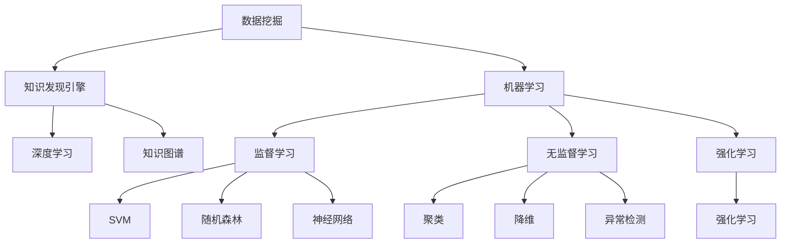

                 

# 知识发现引擎：人工智能时代的智慧之钥

## 1. 背景介绍

### 1.1 问题由来
随着大数据时代的到来，数据已不再是稀缺资源，而是海量的信息洪流。如何从中提取有价值的知识，指导决策和实践，成为当下最前沿的研究方向之一。知识发现（Knowledge Discovery, KD）便是这一领域的代表，通过挖掘数据中的潜在规律，帮助人们更好地理解现实世界。

知识发现的核心在于如何设计高效、智能的数据处理和分析工具，从海量数据中提取出有用信息。而这一过程，已不再是简单的统计分析或规则匹配，而是依赖于人工智能（AI）技术，特别是机器学习（Machine Learning, ML）和深度学习（Deep Learning, DL）模型的加持。

### 1.2 问题核心关键点
知识发现引擎（Knowledge Discovery Engine, KDE）是实现知识发现的关键技术。其核心任务在于：
- **数据预处理**：清洗、整理、筛选数据，减少噪声，提高数据质量。
- **特征工程**：提取、选择、变换特征，为后续模型训练提供高质量输入。
- **模型选择与训练**：选择合适的算法，对数据集进行有监督或无监督的训练，学习数据中的隐含模式。
- **结果评估与优化**：使用科学合理评估指标，如准确率、召回率、F1分数等，对模型效果进行评估，并根据反馈进行调整。

在大数据和人工智能的双重驱动下，知识发现引擎正向着更加智能、高效、自适应的方向发展，成为人工智能时代的“智慧之钥”。

## 2. 核心概念与联系

### 2.1 核心概念概述

为更好地理解知识发现引擎的工作原理，本节将介绍几个关键概念：

- **数据挖掘**：从大量数据中发现有用的、未知的、潜在信息和知识的过程。数据挖掘常与知识发现联系在一起，通常使用统计学、机器学习、模式识别等技术。
- **知识发现引擎**：一个自动化的系统，用于从原始数据中提取出有价值的信息和知识。KDE通常包含数据预处理、特征工程、模型训练和结果评估等多个模块。
- **机器学习**：一种通过算法和统计模型使计算机系统能够自动学习和改进的技术。机器学习分为监督学习、无监督学习和强化学习等，广泛应用于数据挖掘和知识发现领域。
- **深度学习**：一种特殊的机器学习方法，通过模拟人脑神经网络，对数据进行层次化、非线性表示和处理。深度学习模型如卷积神经网络（CNN）、循环神经网络（RNN）、变分自编码器（VAE）等，在KDE中占据重要地位。
- **知识图谱**：一种结构化的知识表示形式，将实体、属性、关系等信息以图形化的方式展现出来。知识图谱常用于辅助知识发现，提供实体之间的关系网络。

这些概念之间的逻辑关系可以通过以下Mermaid流程图来展示：



这个流程图展示了知识发现引擎的核心概念及其之间的关系：

1. 数据挖掘是知识发现的基础，常使用机器学习技术。
2. 机器学习中，监督学习、无监督学习和强化学习各自适用于不同的任务。
3. 深度学习作为机器学习的一种，在知识发现中尤为重要。
4. 知识图谱辅助知识发现，提供更直观、结构化的知识表示。

这些概念共同构成了知识发现引擎的技术框架，使得数据挖掘和知识发现更加高效、智能。

## 3. 核心算法原理 & 具体操作步骤
### 3.1 算法原理概述

知识发现引擎的核心在于从大量数据中提取有价值的知识。这一过程可以理解为一种“自顶向下”的数据挖掘，即从数据的一般特征中挖掘出隐含的模式和规律。

以监督学习为例，知识发现引擎通常分为以下几步：

1. **数据预处理**：清洗数据、填补缺失值、处理异常值，确保数据的质量和完整性。
2. **特征选择与工程**：提取特征、选择特征、变换特征，将原始数据转换为可供模型使用的数值型特征。
3. **模型训练**：使用选择的特征，训练机器学习或深度学习模型，学习数据中的隐含模式。
4. **结果评估与优化**：评估模型的性能，根据评估结果进行调参优化，提高模型效果。

这一流程可以用以下框架表示：

$$
\text{数据} \rightarrow (\text{清洗}+\text{补全}) \rightarrow (\text{特征选择}+\text{特征工程}) \rightarrow \text{模型训练} \rightarrow (\text{评估}+\text{优化}) \rightarrow \text{结果输出}
$$

其中，数据预处理和特征工程是知识发现引擎的预处理模块，模型训练是核心模块，结果评估与优化是后处理模块，结果输出则是最终的知识。

### 3.2 算法步骤详解

以下将详细讲解知识发现引擎的核心步骤和具体操作：

**Step 1: 数据预处理**
- **清洗数据**：去除重复、噪声、无关数据，确保数据质量。
- **补全数据**：填补缺失值，避免数据丢失对结果的影响。
- **处理异常值**：识别和处理异常值，避免其对模型训练产生负面影响。

**Step 2: 特征选择与工程**
- **特征提取**：从原始数据中提取有用的特征，如词频、TF-IDF等文本特征，或边缘、角点等图像特征。
- **特征选择**：从提取的特征中选择对模型训练有帮助的特征，使用如卡方检验、互信息等方法。
- **特征变换**：对特征进行标准化、归一化等变换，提高特征之间的可比性和模型效率。

**Step 3: 模型选择与训练**
- **选择模型**：根据任务类型，选择合适的机器学习或深度学习模型，如SVM、随机森林、CNN、RNN等。
- **训练模型**：使用训练集对模型进行有监督学习，调整模型参数以最小化损失函数。

**Step 4: 结果评估与优化**
- **评估模型**：使用测试集对模型进行评估，计算准确率、召回率、F1分数等指标。
- **优化模型**：根据评估结果，调整模型参数、优化算法、选择特征等，进一步提升模型性能。

**Step 5: 结果输出**
- **知识提取**：将训练好的模型应用于新数据，提取有用的知识。
- **结果展示**：将提取的知识以图表、报告等形式展示，便于理解和应用。

### 3.3 算法优缺点

知识发现引擎具有以下优点：
- **高效性**：自动化的流程能够显著提升数据处理和分析效率。
- **准确性**：通过机器学习模型的训练，能够提高知识提取的准确性。
- **可扩展性**：知识发现引擎适用于各种规模的数据集，具有较好的可扩展性。

同时，也存在一些缺点：
- **数据质量要求高**：数据预处理和特征工程对数据质量要求较高，质量差的数据可能导致分析结果不准确。
- **模型选择困难**：选择合适的模型和算法是一个复杂且具有挑战性的任务，需要丰富的经验和理论知识。
- **模型复杂度高**：复杂的模型训练过程需要大量的计算资源，可能对硬件设备要求较高。

### 3.4 算法应用领域

知识发现引擎的应用领域非常广泛，涵盖了金融、医疗、零售、制造、交通等多个行业。以下是几个典型应用：

- **金融风险管理**：通过分析历史交易数据，发现潜在的风险因素，提高风险管理能力。
- **医疗诊断**：从医疗记录中提取有用的健康信息，辅助医生进行诊断和治疗。
- **零售营销**：通过分析客户购买数据，发现购买模式和偏好，优化营销策略。
- **交通管理**：分析交通流量数据，发现交通瓶颈和规律，优化交通管理。
- **环境监测**：从环境数据中发现污染源和变化规律，辅助环境保护和治理。

## 4. 数学模型和公式 & 详细讲解 & 举例说明

### 4.1 数学模型构建

知识发现引擎的数学模型构建通常基于统计学和机器学习理论。以下以分类任务为例，展示一个简单的数学模型：

假设有一组样本数据 $D=\{(x_i, y_i)\}_{i=1}^N$，其中 $x_i \in \mathbb{R}^d$ 是特征向量，$y_i \in \{0, 1\}$ 是类别标签。目标是训练一个分类器 $f(x)$，使得 $f(x)$ 能准确预测新样本 $x$ 的类别 $y$。

常见的分类模型有线性分类器、决策树、支持向量机（SVM）等。以线性分类器为例，模型表达式为：

$$
f(x;w) = \max(\mathbf{w}^T x + b, 0)
$$

其中 $\mathbf{w}$ 和 $b$ 是模型的可学习参数，表示分类器的权重和偏置。

### 4.2 公式推导过程

线性分类器的目标是最小化损失函数：

$$
\min_{\mathbf{w},b} \sum_{i=1}^N L(y_i, f(x_i; \mathbf{w}, b))
$$

其中 $L(y_i, f(x_i; \mathbf{w}, b))$ 是损失函数，常用的有交叉熵损失、对数损失等。

假设使用交叉熵损失，则有：

$$
L(y_i, f(x_i; \mathbf{w}, b)) = -y_i \log f(x_i; \mathbf{w}, b) - (1-y_i) \log (1 - f(x_i; \mathbf{w}, b))
$$

将 $f(x)$ 代入上式，得到目标函数：

$$
\min_{\mathbf{w},b} \sum_{i=1}^N [-y_i (\mathbf{w}^T x_i + b) + y_i \log (1 - f(x_i; \mathbf{w}, b))]
$$

为了简化计算，通常对 $y_i (\mathbf{w}^T x_i + b)$ 进行分拆，得到：

$$
\min_{\mathbf{w},b} \frac{1}{2} ||\mathbf{w}||^2 + \sum_{i=1}^N y_i (\mathbf{w}^T x_i + b) + \sum_{i=1}^N y_i \log (1 - f(x_i; \mathbf{w}, b))
$$

为了求解上述问题，可以采用梯度下降等优化算法。设 $\eta$ 为学习率，$n$ 为样本数量，则参数的更新公式为：

$$
\mathbf{w} \leftarrow \mathbf{w} - \eta \nabla_{\mathbf{w}} \sum_{i=1}^N [-y_i (\mathbf{w}^T x_i + b) + y_i \log (1 - f(x_i; \mathbf{w}, b))]
$$

其中 $\nabla_{\mathbf{w}}$ 表示对 $\mathbf{w}$ 的梯度。

### 4.3 案例分析与讲解

以下通过一个简单的案例，展示知识发现引擎的应用过程：

**案例背景**：某零售公司希望通过分析客户购买数据，发现购买模式和偏好，优化营销策略。

**数据集**：收集了过去一年的客户购买数据，包括购买时间、商品类别、购买金额等。

**数据预处理**：
- **清洗数据**：去除重复和异常数据。
- **补全数据**：填补缺失值，如通过均值填补。
- **处理异常值**：识别和处理异常值，如通过截断或替换。

**特征选择与工程**：
- **特征提取**：提取特征如购买金额、购买频率、购买时间等。
- **特征选择**：选择购买频率、购买金额等与销售量高度相关的特征。
- **特征变换**：对特征进行归一化处理，提高模型的收敛速度。

**模型选择与训练**：
- **选择模型**：选择线性分类器或决策树模型。
- **训练模型**：使用历史数据对模型进行有监督学习，调整模型参数。

**结果评估与优化**：
- **评估模型**：使用测试集对模型进行评估，计算准确率、召回率等指标。
- **优化模型**：根据评估结果，调整模型参数、优化算法、选择特征等。

**结果输出**：
- **知识提取**：使用训练好的模型对新数据进行预测，提取有用的知识。
- **结果展示**：将提取的知识以图表、报告等形式展示，便于理解和应用。

通过上述案例，可以看出知识发现引擎的实际应用流程，从数据预处理到模型训练，再到结果输出，每一步都需要精心设计和优化。

## 5. 项目实践：代码实例和详细解释说明

### 5.1 开发环境搭建

在进行知识发现引擎的开发实践前，需要先准备好开发环境。以下是使用Python进行Scikit-learn开发的开发环境配置流程：

1. 安装Anaconda：从官网下载并安装Anaconda，用于创建独立的Python环境。

2. 创建并激活虚拟环境：
```bash
conda create -n sklearn-env python=3.8 
conda activate sklearn-env
```

3. 安装Scikit-learn：
```bash
pip install scikit-learn
```

4. 安装各类工具包：
```bash
pip install numpy pandas scikit-learn matplotlib tqdm jupyter notebook ipython
```

完成上述步骤后，即可在`sklearn-env`环境中开始知识发现引擎的开发实践。

### 5.2 源代码详细实现

下面以线性分类器为例，展示Scikit-learn库的知识发现引擎开发代码实现。

首先，定义数据处理函数：

```python
from sklearn.model_selection import train_test_split
from sklearn.preprocessing import StandardScaler
from sklearn.linear_model import LogisticRegression
from sklearn.metrics import accuracy_score

def preprocess_data(data):
    # 数据清洗
    data = data.drop_duplicates()
    data = data[data['amount'] > 0]
    data = data.dropna(subset=['date'])
    
    # 特征选择
    features = data[['date', 'amount', 'category']]
    labels = data['is_purchase']
    
    # 特征归一化
    scaler = StandardScaler()
    features = scaler.fit_transform(features)
    
    return features, labels
```

然后，定义训练和评估函数：

```python
def train_classifier(features, labels):
    # 划分训练集和测试集
    X_train, X_test, y_train, y_test = train_test_split(features, labels, test_size=0.2, random_state=42)
    
    # 模型训练
    classifier = LogisticRegression(solver='liblinear')
    classifier.fit(X_train, y_train)
    
    # 模型评估
    y_pred = classifier.predict(X_test)
    accuracy = accuracy_score(y_test, y_pred)
    return accuracy

def evaluate_classifier(classifier, features, labels):
    # 模型评估
    y_pred = classifier.predict(features)
    accuracy = accuracy_score(labels, y_pred)
    return accuracy
```

最后，启动训练流程并在测试集上评估：

```python
# 加载数据
data = pd.read_csv('purchase_data.csv')
features, labels = preprocess_data(data)

# 训练模型
accuracy = train_classifier(features, labels)
print(f"训练集上的准确率: {accuracy:.3f}")

# 测试模型
features_test, labels_test = preprocess_data(data)
accuracy_test = evaluate_classifier(classifier, features_test, labels_test)
print(f"测试集上的准确率: {accuracy_test:.3f}")
```

以上就是使用Scikit-learn对线性分类器进行知识发现引擎开发的完整代码实现。可以看到，Scikit-learn提供了丰富的机器学习算法和工具，使得知识发现引擎的开发变得相对简单。

### 5.3 代码解读与分析

让我们再详细解读一下关键代码的实现细节：

**preprocess_data函数**：
- **数据清洗**：去重、过滤无效数据、处理缺失值。
- **特征选择**：选择与目标变量高度相关的特征。
- **特征归一化**：使用标准化方法将特征归一化，提高模型的收敛速度。

**train_classifier函数**：
- **数据划分**：将数据划分为训练集和测试集。
- **模型训练**：使用LogisticRegression模型对训练集进行有监督学习。
- **模型评估**：计算模型在测试集上的准确率。

**evaluate_classifier函数**：
- **模型评估**：计算模型在测试集上的准确率。

**训练流程**：
- **加载数据**：从CSV文件中加载数据。
- **预处理数据**：使用preprocess_data函数进行数据预处理。
- **训练模型**：使用train_classifier函数训练模型，并输出训练集上的准确率。
- **测试模型**：使用evaluate_classifier函数测试模型，并输出测试集上的准确率。

可以看到，Scikit-learn使得知识发现引擎的开发变得简洁高效。开发者可以将更多精力放在数据处理、模型改进等高层逻辑上，而不必过多关注底层的实现细节。

当然，工业级的系统实现还需考虑更多因素，如模型的保存和部署、超参数的自动搜索、更灵活的任务适配层等。但核心的知识发现引擎开发流程基本与此类似。

## 6. 实际应用场景

### 6.1 金融风险管理

知识发现引擎在金融风险管理领域有着广泛应用。银行和金融机构通过分析历史交易数据，发现潜在的风险因素，建立风险评估模型，从而提高风险管理能力。

例如，某银行可以收集客户的交易记录，通过知识发现引擎提取风险特征，如交易频率、交易金额、交易类型等。然后使用分类器或回归器，预测客户是否存在违约风险。通过不断优化模型，银行能够及时识别高风险客户，采取防范措施，降低损失。

### 6.2 医疗诊断

在医疗诊断中，知识发现引擎可以通过分析医疗记录，提取有用的健康信息，辅助医生进行诊断和治疗。

例如，某医院可以收集患者的历史病历，提取如病史、实验室检查、影像诊断等特征。然后使用分类器或聚类器，预测患者的疾病类型和严重程度。通过不断优化模型，医生能够快速识别疾病，制定个性化治疗方案，提高治疗效果。

### 6.3 零售营销

零售公司通过分析客户购买数据，发现购买模式和偏好，优化营销策略。知识发现引擎可以帮助零售公司进行市场细分和客户画像分析。

例如，某零售公司可以收集客户购买记录，提取如购买频率、购买金额、购买时间等特征。然后使用聚类器，将客户分为不同的细分市场。通过分析不同细分市场的购买行为，零售公司能够制定针对性的营销策略，提高销售业绩。

### 6.4 交通管理

交通管理部门通过分析交通流量数据，发现交通瓶颈和规律，优化交通管理。知识发现引擎可以帮助交通管理部门进行交通分析和预测。

例如，某交通管理部门可以收集交通流量数据，提取如车流量、交通事故、道路施工等特征。然后使用回归器，预测不同时段的交通流量。通过分析交通流量变化规律，交通管理部门能够优化交通信号灯控制，提高交通效率。

## 7. 工具和资源推荐

### 7.1 学习资源推荐

为了帮助开发者系统掌握知识发现引擎的理论基础和实践技巧，这里推荐一些优质的学习资源：

1. 《机器学习》课程：由斯坦福大学Andrew Ng教授开设，系统讲解机器学习算法和应用，适合初学者入门。

2. 《Python数据科学手册》：通过丰富的案例和代码，讲解Python在数据科学中的应用，包括数据预处理、特征工程、模型训练等。

3. 《统计学习方法》：由李航教授所著，详细介绍了机器学习算法的基本原理和推导过程，是机器学习的经典教材。

4. Scikit-learn官方文档：提供了丰富的API文档和示例代码，适合快速上手Scikit-learn库。

5. Coursera《Applied Machine Learning》课程：由加州大学圣地亚哥分校开设，涵盖机器学习和深度学习的应用，适合实践操作。

通过对这些资源的学习实践，相信你一定能够快速掌握知识发现引擎的精髓，并用于解决实际的NLP问题。

### 7.2 开发工具推荐

高效的开发离不开优秀的工具支持。以下是几款用于知识发现引擎开发的常用工具：

1. Python：通过丰富的第三方库，支持数据处理、特征工程、模型训练等各个环节。

2. Scikit-learn：提供了丰富的机器学习算法和工具，易于上手和部署。

3. TensorFlow：由Google开发，支持深度学习模型的构建和训练，适合大规模数据集处理。

4. PyTorch：由Facebook开发，提供了灵活的深度学习框架，适合研究和实验。

5. Jupyter Notebook：基于Python的交互式笔记本环境，便于代码调试和实验记录。

合理利用这些工具，可以显著提升知识发现引擎的开发效率，加快创新迭代的步伐。

### 7.3 相关论文推荐

知识发现引擎的研究源于学界的持续研究。以下是几篇奠基性的相关论文，推荐阅读：

1. M. K. Ng. Machine Learning: The Case for Uncertainty. Journal of the American Statistical Association, 2001.

2. Y. Bengio, G. Hinton, and S. Kingsbury. Generalized denoising autoencoders as generative models. Advances in Neural Information Processing Systems, 2009.

3. J. H. Friedman. Greedy Function Approximation: A Gradient Boosting Machine. The Annals of Statistics, 2001.

4. T. Mikolov, I. Sutskever, K. Chen, G. S. Corrado, and J. Dean. Distributed Representations of Words and Phrases and their Compositionality. Neural Information Processing Systems, 2013.

5. A. Ng, M. Jordan, and Y. Weiss. On Unsupervised Feature Learning with Deep Learning. Advances in Neural Information Processing Systems, 2011.

这些论文代表了大数据和人工智能时代的知识发现引擎发展脉络。通过学习这些前沿成果，可以帮助研究者把握学科前进方向，激发更多的创新灵感。

## 8. 总结：未来发展趋势与挑战

### 8.1 总结

本文对知识发现引擎的理论基础和实践技巧进行了全面系统的介绍。首先阐述了知识发现引擎在人工智能时代的地位和作用，明确了其核心任务和应用场景。其次，从原理到实践，详细讲解了知识发现引擎的数学模型和操作步骤，给出了Scikit-learn库的知识发现引擎开发代码实现。同时，本文还广泛探讨了知识发现引擎在金融、医疗、零售、交通等多个领域的应用前景，展示了其在人工智能领域的广阔应用空间。此外，本文精选了知识发现引擎的学习资源、开发工具和相关论文，力求为读者提供全方位的技术指引。

通过本文的系统梳理，可以看出知识发现引擎在人工智能时代的独特价值和广阔前景。面向未来，知识发现引擎需要不断结合新的数据源和技术手段，进一步提高数据处理和分析的智能化水平，为人类认知智能的进化带来深远影响。

### 8.2 未来发展趋势

展望未来，知识发现引擎将呈现以下几个发展趋势：

1. **自动化和智能化**：随着AI技术的发展，知识发现引擎将进一步自动化和智能化，能够自主选择特征、模型和算法，提升数据处理的效率和效果。

2. **多模态数据融合**：未来的知识发现引擎将更加注重多模态数据的融合，将文本、图像、语音等多种数据形式进行协同分析，提取更加全面、准确的知识。

3. **实时数据处理**：实时数据处理能力将成为知识发现引擎的重要发展方向，通过流式处理和增量学习，使得模型能够及时响应数据变化，提供最新的分析结果。

4. **联邦学习**：联邦学习能够保护数据隐私，同时实现分布式数据处理和分析。未来的知识发现引擎将广泛采用联邦学习，实现跨地域、跨系统的知识共享和协同分析。

5. **增强学习**：增强学习能够优化模型的决策过程，提高知识发现引擎的智能水平。未来的知识发现引擎将结合增强学习，实现更加高效的模型训练和优化。

6. **跨领域应用**：未来的知识发现引擎将更加广泛地应用于各个领域，如医疗、金融、制造、交通等，为不同行业提供智能化的解决方案。

以上趋势凸显了知识发现引擎的广泛应用前景和智能化潜力。这些方向的探索发展，必将进一步提升知识发现引擎的性能和应用范围，为人工智能技术带来新的突破。

### 8.3 面临的挑战

尽管知识发现引擎已经取得了显著进展，但在迈向更加智能化、普适化应用的过程中，仍面临诸多挑战：

1. **数据质量问题**：高质量的数据是知识发现的基础，但实际应用中往往面临数据缺失、噪声、不一致等问题，影响分析结果的准确性。

2. **模型选择复杂**：选择适当的模型和算法是一个复杂且具有挑战性的任务，需要丰富的经验和理论知识，且不同领域的任务可能需要不同的模型和算法。

3. **计算资源需求高**：知识发现引擎通常需要处理大规模数据集，对计算资源和硬件设备要求较高，需要投入大量的时间和资金。

4. **结果解释性不足**：知识发现引擎的输出往往缺乏可解释性，难以理解和调试，特别是在复杂和异构的数据集上。

5. **隐私和安全问题**：知识发现引擎在处理敏感数据时，需注意数据隐私和安全问题，防止数据泄露和滥用。

6. **跨领域知识整合**：不同领域的知识存在差异，如何将不同领域的知识进行有效整合，是知识发现引擎的一大挑战。

这些挑战凸显了知识发现引擎在实际应用中的复杂性和难度。为应对这些挑战，未来的研究需要在数据治理、模型优化、资源调度、隐私保护等多个方面进行深入探索和创新。

### 8.4 研究展望

面对知识发现引擎所面临的种种挑战，未来的研究需要在以下几个方面寻求新的突破：

1. **自动化和智能化**：开发自动化和智能化的知识发现引擎，提升数据处理的效率和效果。

2. **多模态数据融合**：将文本、图像、语音等多种数据形式进行协同分析，提取更加全面、准确的知识。

3. **实时数据处理**：通过流式处理和增量学习，实现跨领域、跨系统的知识共享和协同分析。

4. **联邦学习**：采用联邦学习技术，保护数据隐私，同时实现分布式数据处理和分析。

5. **增强学习**：结合增强学习技术，优化模型的决策过程，提高智能水平。

6. **跨领域知识整合**：通过领域自适应和知识迁移，将不同领域的知识进行有效整合。

这些研究方向的探索，必将引领知识发现引擎技术迈向更高的台阶，为构建智能化的知识系统铺平道路。面向未来，知识发现引擎需要在数据治理、模型优化、资源调度、隐私保护等多个方面进行深入探索和创新，为人工智能技术带来新的突破。

## 9. 附录：常见问题与解答

**Q1：知识发现引擎如何选择合适的模型和算法？**

A: 选择合适的模型和算法是知识发现引擎的关键步骤之一，主要考虑以下因素：

1. **任务类型**：不同任务类型可能需要不同的模型和算法。例如，分类任务适合使用SVM、随机森林、神经网络等算法，回归任务适合使用线性回归、决策树回归等算法。

2. **数据特性**：数据特性（如稀疏性、噪声、样本数量等）对模型选择有重要影响。例如，稀疏数据适合使用稀疏矩阵算法，高噪声数据适合使用鲁棒性较强的算法。

3. **计算资源**：模型的计算复杂度对计算资源要求较高，需要根据实际情况选择合适的算法。例如，深度学习模型需要大量计算资源，而简单的线性回归算法则相对容易实现。

4. **先验知识**：利用领域知识和专家经验，指导模型和算法的选择。例如，在金融领域，可以使用金融工程知识，选择适合的算法模型。

**Q2：知识发现引擎如何处理异常值？**

A: 异常值是数据中的离群点，对模型训练和预测可能产生负面影响。处理异常值的方法包括：

1. **数据清洗**：识别并删除异常值，提高数据质量。

2. **鲁棒性算法**：选择对异常值不敏感的算法，如中位数、分位数等统计量，减少异常值的影响。

3. **离群值检测**：使用统计方法（如IQR、Z-score等）检测异常值，并进行处理。

4. **重采样**：对异常值进行重采样或替换，减少其对模型的影响。

**Q3：知识发现引擎如何提高模型的可解释性？**

A: 提高模型的可解释性是知识发现引擎的重要目标之一，方法包括：

1. **特征重要性分析**：分析特征对模型的贡献度，选择重要特征。

2. **模型可视化**：使用可视化工具（如t-SNE、LIME等）展示模型的决策过程。

3. **局部可解释性**：针对特定的样本或数据子集，使用局部可解释模型（如LR、LDA等）进行解释。

4. **模型融合**：结合多种模型，提高整体可解释性。

**Q4：知识发现引擎如何优化计算资源？**

A: 优化计算资源是知识发现引擎的重要任务之一，方法包括：

1. **模型裁剪**：去除不必要的层和参数，减小模型尺寸，加快推理速度。

2. **量化加速**：将浮点模型转为定点模型，压缩存储空间，提高计算效率。

3. **模型并行**：使用模型并行技术（如数据并行、模型并行等），提高训练和推理效率。

4. **硬件优化**：使用GPU、TPU等高性能设备，提升计算能力。

5. **增量学习**：通过增量学习技术，减少模型训练的计算资源消耗。

通过这些方法，可以显著提高知识发现引擎的计算效率，满足大规模数据处理的需要。

**Q5：知识发现引擎如何保护数据隐私？**

A: 数据隐私是知识发现引擎面临的重要问题，方法包括：

1. **数据匿名化**：通过数据匿名化技术（如差分隐私、数据扰动等）保护数据隐私。

2. **联邦学习**：在分布式环境中，使用联邦学习技术，保护数据隐私。

3. **本地计算**：在本地设备上进行数据处理和分析，避免数据传输。

4. **访问控制**：使用访问控制技术，限制数据的访问权限，防止数据泄露。

5. **加密技术**：使用数据加密技术，保护数据在传输和存储过程中的安全。

通过这些方法，可以保护数据隐私，确保知识发现引擎的安全性和可靠性。

---

作者：禅与计算机程序设计艺术 / Zen and the Art of Computer Programming

