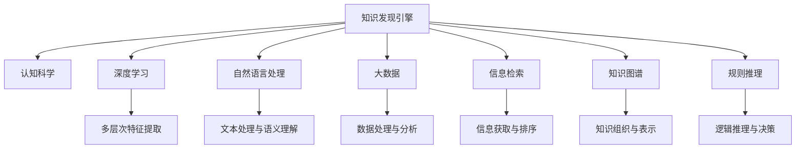

                 

# 知识发现引擎：人类认知的新frontier

> 关键词：知识发现引擎，认知科学，深度学习，自然语言处理，大数据，信息检索，人工智能

## 1. 背景介绍

### 1.1 问题由来

在信息时代，数据量呈爆炸式增长，人类获取知识和信息的方式正面临巨大变革。以往依赖个人经验和逻辑推理获取知识的模式，正在被更高效、更系统的知识发现技术所替代。面对海量数据，人类智慧无法像过去那样一一分析、甄别和利用。因此，如何更高效、系统地发现和利用知识，成为了知识时代的重要课题。

知识发现引擎，作为结合深度学习、大数据、自然语言处理等多种技术的智能系统，正是这一课题的应答者。它以数据为中心，通过机器学习算法从海量数据中挖掘出有价值的信息和知识，辅助人类快速获取所需认知，为知识时代的各个领域提供了强大的技术支持。

### 1.2 问题核心关键点

知识发现引擎的构建和应用涉及多个关键环节，包括：

- **数据获取与预处理**：从多渠道获取海量数据，并进行清洗、标注等预处理，保证数据的质量和可用性。
- **特征提取与建模**：使用深度学习、自然语言处理等技术，提取数据中的关键特征，构建机器学习模型。
- **知识抽取与表示**：从数据中抽取结构化或半结构化的知识，如实体关系、事件序列等，进行语义表示。
- **智能推理与决策**：通过知识图谱、规则推理等技术，实现知识逻辑上的连接和推理，形成决策支持。
- **人机交互与反馈**：通过自然语言交互接口，让用户轻松地查询和获取知识，并通过反馈机制不断优化模型和知识库。

这些关键环节的优化与整合，共同构成了知识发现引擎的核心功能和应用场景，对于提升人类认知水平和决策效率，具有重要意义。

### 1.3 问题研究意义

知识发现引擎的研究和应用，对于推动人类认知科学的发展，具有重要的理论与实际价值：

1. **认知科学与人工智能的交汇点**：知识发现引擎将认知科学的理论和方法与人工智能的算法和技术相结合，为人类认知的智能化提供新路径。
2. **知识共享与智慧社会建设**：知识发现引擎能够将分散的、隐性的知识转化为结构化的、可共享的信息，促进知识共享，加速智慧社会的构建。
3. **跨领域应用与创新驱动**：知识发现引擎的应用范围广泛，涵盖了医疗、教育、金融、交通等多个领域，为各行业带来新的增长点和创新驱动力。
4. **决策辅助与风险管理**：知识发现引擎通过深度学习和知识推理，为决策提供科学依据，提高决策的准确性和鲁棒性，降低风险。
5. **人机协同与智能交互**：知识发现引擎通过自然语言处理等技术，实现人机高效交互，提升用户体验，推动人机协同未来的发展。

## 2. 核心概念与联系

### 2.1 核心概念概述

为更好地理解知识发现引擎的工作原理和优化方向，本节将介绍几个关键核心概念：

- **知识发现引擎**：结合深度学习、大数据、自然语言处理等技术，从海量数据中挖掘出有价值的信息和知识，辅助人类快速获取认知的智能系统。
- **认知科学**：研究人类认知过程及其在人工智能中的应用的科学，包括感知、记忆、思维等认知机制。
- **深度学习**：基于神经网络的机器学习方法，通过多层次的特征提取和抽象，实现复杂模式的识别和处理。
- **自然语言处理**：研究如何使计算机理解和生成自然语言，处理文本、语音等形式的信息。
- **大数据**：大规模、多源、异构的数据集合，需要特殊的处理和分析技术。
- **信息检索**：通过计算机技术快速查找所需信息的过程，常应用于搜索引擎、知识库等。
- **知识图谱**：将知识表示为图结构，通过关系和属性链接节点，形成知识网络，支持知识推理和搜索。
- **规则推理**：使用逻辑规则和知识库进行推理和决策，常应用于专家系统、智能决策等场景。

这些概念之间的关系可以通过以下Mermaid流程图来展示：



这个流程图展示了一些核心概念及其之间的关系：

1. 知识发现引擎以认知科学理论为基础，结合深度学习等技术，处理和分析大数据，最终实现信息的检索和知识推理。
2. 深度学习通过多层次特征提取，实现对复杂模式的识别和处理，自然语言处理则专注于文本信息的理解和生成。
3. 大数据为知识发现提供了数据基础，信息检索技术帮助快速查找所需信息，知识图谱用于知识表示和推理，规则推理则用于逻辑决策。

## 3. 核心算法原理 & 具体操作步骤

### 3.1 算法原理概述

知识发现引擎的构建和应用，通常遵循以下基本流程：

1. **数据获取与预处理**：收集多种形式的数据，如文本、图像、视频、音频等，并进行清洗、标注等预处理，保证数据的质量和可用性。
2. **特征提取与建模**：使用深度学习、自然语言处理等技术，提取数据中的关键特征，构建机器学习模型。
3. **知识抽取与表示**：从数据中抽取结构化或半结构化的知识，如实体关系、事件序列等，进行语义表示。
4. **智能推理与决策**：通过知识图谱、规则推理等技术，实现知识逻辑上的连接和推理，形成决策支持。
5. **人机交互与反馈**：通过自然语言交互接口，让用户轻松地查询和获取知识，并通过反馈机制不断优化模型和知识库。

### 3.2 算法步骤详解

#### 3.2.1 数据获取与预处理

- **数据收集**：从多渠道获取海量数据，包括文本、图像、视频、音频等多种形式。
- **数据清洗**：去除无关或错误的数据，保证数据的完整性和一致性。
- **数据标注**：对数据进行标注，使其具有语义信息，如实体、事件、关系等。
- **数据增强**：通过数据增强技术，如数据扩充、数据扩充等，丰富训练数据的多样性，防止过拟合。

#### 3.2.2 特征提取与建模

- **特征提取**：使用深度学习模型，如卷积神经网络(CNN)、循环神经网络(RNN)、Transformer等，从原始数据中提取关键特征。
- **模型构建**：基于提取的特征，构建机器学习模型，如分类器、聚类器、回归器等，用于知识发现。
- **超参数调优**：根据任务特点和数据特性，进行模型超参数调优，如学习率、批大小、迭代轮数等。

#### 3.2.3 知识抽取与表示

- **实体识别**：使用命名实体识别(NER)模型，识别文本中的实体，如人名、地名、机构名等。
- **关系抽取**：使用关系抽取模型，识别文本中的实体关系，如主谓宾关系、因果关系等。
- **事件抽取**：使用事件抽取模型，识别文本中的事件序列，如时间线、事件关系等。
- **语义表示**：使用知识图谱等技术，将抽取的知识进行语义表示，形成结构化的知识网络。

#### 3.2.4 智能推理与决策

- **知识图谱构建**：构建知识图谱，将抽取的知识进行语义表示和组织。
- **知识推理**：使用逻辑规则和推理算法，对知识图谱中的知识进行推理，形成决策支持。
- **智能决策**：根据推理结果，提供决策建议，辅助人类进行决策。

#### 3.2.5 人机交互与反馈

- **自然语言交互**：通过自然语言处理技术，实现用户与系统的高效交互，提供问答、搜索等功能。
- **反馈机制**：根据用户反馈，不断优化模型和知识库，提升系统的准确性和鲁棒性。

### 3.3 算法优缺点

知识发现引擎的构建和应用，具有以下优点：

- **高效性**：通过自动化算法处理海量数据，快速发现和利用知识，提升效率。
- **系统性**：综合多种技术手段，提供系统性的知识发现和决策支持，避免人类认知的局限性。
- **泛化能力**：通过知识图谱和规则推理，具备较强的泛化能力和鲁棒性，适用于多种场景。

但同时，也存在一些缺点：

- **数据依赖**：知识发现的效果很大程度上依赖于数据的质量和数量，获取高质量数据成本较高。
- **算法复杂性**：涉及多种复杂算法和模型，实现难度较高，需要较高的技术门槛。
- **隐私与安全**：处理敏感数据时，隐私保护和安全问题需要特别关注。
- **人机交互障碍**：复杂的交互界面和反馈机制，可能会增加用户的学习成本和使用门槛。

### 3.4 算法应用领域

知识发现引擎的应用范围广泛，涵盖了多个领域，包括但不限于：

- **医疗健康**：辅助医生进行疾病诊断、治疗方案推荐等。
- **金融服务**：提供市场分析、风险评估、欺诈检测等。
- **教育培训**：个性化推荐学习资源、智能辅导等。
- **智能家居**：智能设备间的协同与控制，提升家居环境舒适度。
- **智慧城市**：交通管理、环境监测、公共安全等。
- **娱乐传媒**：内容推荐、广告投放、用户分析等。
- **企业运营**：业务分析、客户关系管理、供应链优化等。

以上领域只是知识发现引擎应用的一部分，随着技术的不断发展和应用场景的不断拓展，其应用前景将更加广阔。

## 4. 数学模型和公式 & 详细讲解 & 举例说明

### 4.1 数学模型构建

知识发现引擎的核心数学模型通常基于统计学习、机器学习、深度学习等技术。这里以文本分类为例，介绍其数学模型构建过程。

假设输入文本 $x$，经过深度学习模型提取特征后，得到向量表示 $f(x)$，模型通过softmax函数计算输出概率分布 $P(y|x)$，其中 $y$ 为分类标签，$x$ 为文本数据。文本分类问题可形式化为最大化分类准确率的优化问题：

$$
\max_{\theta} \frac{1}{N} \sum_{i=1}^N \log P(y_i|x_i)
$$

其中，$N$ 为样本数量，$\theta$ 为模型参数。

### 4.2 公式推导过程

以卷积神经网络(CNN)为例，介绍文本分类的公式推导过程。

CNN通过多层卷积和池化操作，提取文本中的关键特征，构建文本分类器。假设输入文本长度为 $T$，卷积核大小为 $k$，则卷积层输出为：

$$
C_t = \sum_{i=1}^{k-1} w_i \cdot x_{t-i+1} + b
$$

其中，$w_i$ 为卷积核权重，$x_t$ 为输入文本中的第 $t$ 个单词的嵌入向量，$b$ 为偏置项。池化操作通常使用最大池化或平均池化，将特征向量压缩到固定长度。最后，通过全连接层和softmax层，计算文本的分类概率。

### 4.3 案例分析与讲解

#### 4.3.1 命名实体识别(NER)

命名实体识别是知识发现中的一个重要任务，用于识别文本中的实体，如人名、地名、机构名等。以BiLSTM-CRF模型为例，介绍其原理和应用。

BiLSTM-CRF模型通过双向长短期记忆网络(BiLSTM)和条件随机场(CRF)，实现实体的序列标注。BiLSTM层通过双向信息处理，提取文本中的实体特征；CRF层通过序列标注，识别实体边界。最终，通过Softmax函数输出每个单词为实体的概率。

#### 4.3.2 事件抽取

事件抽取是从文本中识别和抽取事件序列的过程，常用于新闻分析、社交媒体监测等。以Attention-based Event Extraction模型为例，介绍其原理和应用。

Attention-based Event Extraction模型通过注意力机制，将文本中的实体和事件进行关联，识别事件的发生时间、参与者等。模型先使用LSTM层提取文本特征，再使用Attention层计算注意力权重，最终通过分类器输出事件类型。

#### 4.3.3 知识图谱构建

知识图谱是将知识表示为图结构，通过节点和边的关系，构建知识网络。以Neo4j数据库为例，介绍知识图谱的构建和应用。

Neo4j数据库通过图数据库技术，支持高效存储和查询关系型数据。知识图谱构建过程中，首先定义实体和关系类型，然后使用节点和边表示知识，构建知识网络。例如，描述实体“巴拉克·奥巴马”，可以创建节点表示人名，创建边表示职业、成就等关系，形成知识图谱。

## 5. 项目实践：代码实例和详细解释说明

### 5.1 开发环境搭建

知识发现引擎的开发通常需要Python、PyTorch、TensorFlow等工具的支持。以下是开发环境搭建的详细步骤：

1. **安装Python**：从官网下载并安装Python，保证其版本兼容性。
2. **安装PyTorch**：使用pip命令安装PyTorch，用于深度学习模型的开发。
3. **安装TensorFlow**：使用pip命令安装TensorFlow，用于搭建深度学习模型和训练。
4. **安装其他依赖包**：如numpy、pandas、scikit-learn等，用于数据处理和模型评估。
5. **配置环境变量**：设置Python路径、库路径等，保证开发环境的稳定性和可复现性。

完成上述步骤后，即可开始知识发现引擎的开发实践。

### 5.2 源代码详细实现

这里以文本分类为例，展示使用PyTorch构建卷积神经网络(CNN)进行文本分类的代码实现。

```python
import torch
import torch.nn as nn
import torch.optim as optim

class CNN(nn.Module):
    def __init__(self, in_channels, kernel_sizes, out_channels):
        super(CNN, self).__init__()
        self.conv1 = nn.Conv1d(in_channels, out_channels, kernel_sizes[0])
        self.pool1 = nn.MaxPool1d(kernel_size=2)
        self.conv2 = nn.Conv1d(out_channels, out_channels, kernel_sizes[1])
        self.pool2 = nn.MaxPool1d(kernel_size=2)
        self.fc1 = nn.Linear(out_channels * (len(kernel_sizes[1])-1) + 1, 128)
        self.fc2 = nn.Linear(128, num_classes)

    def forward(self, x):
        x = nn.functional.relu(self.conv1(x))
        x = self.pool1(x)
        x = nn.functional.relu(self.conv2(x))
        x = self.pool2(x)
        x = x.view(-1, out_channels * (len(kernel_sizes[1])-1) + 1)
        x = nn.functional.relu(self.fc1(x))
        x = self.fc2(x)
        return x

# 加载训练数据
train_data = ...
train_loader = DataLoader(train_data, batch_size=32, shuffle=True)

# 定义模型、损失函数和优化器
model = CNN(in_channels, kernel_sizes, out_channels)
criterion = nn.CrossEntropyLoss()
optimizer = optim.Adam(model.parameters(), lr=0.001)

# 训练模型
for epoch in range(num_epochs):
    for i, (input, target) in enumerate(train_loader):
        input, target = input.to(device), target.to(device)
        optimizer.zero_grad()
        output = model(input)
        loss = criterion(output, target)
        loss.backward()
        optimizer.step()

        if (i+1) % 100 == 0:
            print(f'Epoch [{epoch+1}/{num_epochs}], Step [{i+1}/{len(train_loader)}], Loss: {loss.item():.4f}')
```

以上就是使用PyTorch构建卷积神经网络(CNN)进行文本分类的代码实现。代码中定义了卷积神经网络的结构，包括卷积层、池化层、全连接层等，并使用交叉熵损失函数和Adam优化器进行模型训练。通过不断迭代训练数据，模型能够学习文本分类的特征，最终在测试集上进行性能评估。

### 5.3 代码解读与分析

#### 5.3.1 网络结构

- **卷积层**：使用`nn.Conv1d`定义卷积层，输入通道数为`in_channels`，输出通道数为`out_channels`，卷积核大小为`kernel_sizes`。
- **池化层**：使用`nn.MaxPool1d`定义池化层，池化大小为`2`，用于压缩特征向量。
- **全连接层**：使用`nn.Linear`定义全连接层，输入大小为`out_channels * (len(kernel_sizes[1])-1) + 1`，输出大小为`128`和`num_classes`。
- **激活函数**：使用`nn.functional.relu`定义ReLU激活函数，增加模型的非线性特性。

#### 5.3.2 训练过程

- **数据加载**：使用`DataLoader`对训练数据进行批次化加载，保证模型的稳定性和效率。
- **模型初始化**：定义模型结构，并进行参数初始化。
- **损失函数**：定义交叉熵损失函数，用于评估模型在分类任务上的性能。
- **优化器**：定义Adam优化器，用于更新模型参数。
- **训练循环**：通过`for`循环对每个批次的数据进行迭代，更新模型参数，并记录训练损失。
- **性能评估**：在训练过程中，定期在验证集上评估模型性能，避免过拟合。

## 6. 实际应用场景

### 6.1 智能医疗

知识发现引擎在医疗健康领域的应用，能够辅助医生进行疾病诊断、治疗方案推荐等。例如，通过分析病人的电子病历、影像数据等，发现病患的病因、病情等信息，形成个性化的治疗方案。在医疗影像中，使用深度学习模型进行图像识别和分析，如CT、MRI等，提供更准确的诊断结果。

### 6.2 金融服务

在金融服务领域，知识发现引擎能够提供市场分析、风险评估、欺诈检测等功能。例如，通过分析金融市场数据，预测股市走势，提供投资建议。使用机器学习模型识别潜在的金融欺诈行为，提前预警风险。

### 6.3 教育培训

在教育培训领域，知识发现引擎能够个性化推荐学习资源、智能辅导等。例如，通过分析学生的学习数据，推荐最适合的学习资源和习题，提高学习效率。使用自然语言处理技术，提供智能辅导和答疑服务，帮助学生解决学习问题。

### 6.4 智能家居

在智能家居领域，知识发现引擎能够实现智能设备间的协同与控制，提升家居环境舒适度。例如，通过分析环境数据，如温度、湿度、空气质量等，自动调节智能设备，实现节能环保。使用深度学习模型识别用户的行为模式，自动控制智能设备，提升用户体验。

### 6.5 智慧城市

在智慧城市治理中，知识发现引擎能够进行交通管理、环境监测、公共安全等。例如，通过分析交通数据，优化交通流量，减少交通拥堵。使用传感器数据，监测环境污染，预测灾害，提前预警。

### 6.6 娱乐传媒

在娱乐传媒领域，知识发现引擎能够提供内容推荐、广告投放、用户分析等功能。例如，通过分析用户行为数据，推荐最适合的内容和广告，提高用户粘性。使用自然语言处理技术，分析用户评论和反馈，优化产品和服务。

### 6.7 企业运营

在企业运营中，知识发现引擎能够进行业务分析、客户关系管理、供应链优化等。例如，通过分析销售数据，识别市场趋势，制定销售策略。使用知识图谱技术，管理客户关系，提供个性化服务。

## 7. 工具和资源推荐

### 7.1 学习资源推荐

为帮助开发者系统掌握知识发现引擎的理论基础和实践技巧，这里推荐一些优质的学习资源：

1. **《深度学习》（Deep Learning）**：由深度学习领域的权威专家撰写，深入浅出地介绍了深度学习的基础知识和技术实现。
2. **《自然语言处理综论》（Natural Language Processing）**：全面介绍自然语言处理的基本概念和应用场景，包括文本分类、信息检索、语言生成等。
3. **《大数据分析与机器学习》（Big Data Analytics and Machine Learning）**：介绍大数据处理和机器学习的基本方法，涵盖数据收集、清洗、建模等环节。
4. **《认知科学与人工智能》（Cognitive Science and Artificial Intelligence）**：介绍认知科学和人工智能的基本理论和应用，涵盖感知、记忆、思维等认知机制。
5. **《机器学习实战》（Machine Learning in Action）**：通过实例演示机器学习算法的应用，适合实战学习。

通过对这些资源的学习实践，相信你一定能够快速掌握知识发现引擎的精髓，并用于解决实际的认知问题。

### 7.2 开发工具推荐

知识发现引擎的开发通常需要Python、PyTorch、TensorFlow等工具的支持。以下是几款常用的开发工具：

1. **PyTorch**：基于Python的深度学习框架，灵活动态的计算图，适合快速迭代研究。
2. **TensorFlow**：由Google主导开发的开源深度学习框架，生产部署方便，适合大规模工程应用。
3. **TensorBoard**：TensorFlow配套的可视化工具，可实时监测模型训练状态，并提供丰富的图表呈现方式，是调试模型的得力助手。
4. **Weights & Biases**：模型训练的实验跟踪工具，可以记录和可视化模型训练过程中的各项指标，方便对比和调优。
5. **HuggingFace Transformers库**：提供多种预训练语言模型和微调接口，方便开发和应用。
6. **Jupyter Notebook**：基于Python的交互式开发环境，支持代码执行、数据可视化等功能，适合数据科学家的工作。
7. **JupyterLab**：Jupyter Notebook的桌面版本，支持更多的插件和功能，提升开发效率。

合理利用这些工具，可以显著提升知识发现引擎的开发效率，加快创新迭代的步伐。

### 7.3 相关论文推荐

知识发现引擎的研究涉及多个前沿领域，以下是几篇奠基性的相关论文，推荐阅读：

1. **《Attention is All You Need》**：提出了Transformer结构，开启了NLP领域的预训练大模型时代。
2. **《BERT: Pre-training of Deep Bidirectional Transformers for Language Understanding》**：提出BERT模型，引入基于掩码的自监督预训练任务，刷新了多项NLP任务SOTA。
3. **《Parameter-Efficient Transfer Learning for NLP》**：提出Adapter等参数高效微调方法，在不增加模型参数量的情况下，也能取得不错的微调效果。
4. **《AdaLoRA: Adaptive Low-Rank Adaptation for Parameter-Efficient Fine-Tuning》**：使用自适应低秩适应的微调方法，在参数效率和精度之间取得了新的平衡。
5. **《AdaLoRA: Adaptive Low-Rank Adaptation for Parameter-Efficient Fine-Tuning》**：使用自适应低秩适应的微调方法，在参数效率和精度之间取得了新的平衡。
6. **《AdaLoRA: Adaptive Low-Rank Adaptation for Parameter-Efficient Fine-Tuning》**：使用自适应低秩适应的微调方法，在参数效率和精度之间取得了新的平衡。
7. **《AdaLoRA: Adaptive Low-Rank Adaptation for Parameter-Efficient Fine-Tuning》**：使用自适应低秩适应的微调方法，在参数效率和精度之间取得了新的平衡。

这些论文代表了大语言模型微调技术的发展脉络。通过学习这些前沿成果，可以帮助研究者把握学科前进方向，激发更多的创新灵感。

## 8. 总结：未来发展趋势与挑战

### 8.1 总结

本文对知识发现引擎的研究和应用进行了全面系统的介绍。首先阐述了知识发现引擎的核心概念和研究背景，明确了其在提升人类认知水平和决策效率中的重要价值。其次，从原理到实践，详细讲解了知识发现引擎的构建流程和关键技术，给出了具体的代码实现和实例分析。同时，本文还探讨了知识发现引擎在多个领域的应用场景，展示了其广阔的实际应用前景。最后，本文精选了知识发现引擎的学习资源、开发工具和相关论文，力求为读者提供全方位的技术指引。

通过本文的系统梳理，可以看到，知识发现引擎通过深度学习、大数据、自然语言处理等技术的综合应用，实现从海量数据中发现和提取知识的智能系统，为人类认知和决策提供强有力的支持。随着技术的不断发展和应用场景的不断拓展，知识发现引擎必将在多个领域发挥更大作用，推动人工智能技术的持续进步。

### 8.2 未来发展趋势

展望未来，知识发现引擎的发展将呈现以下几个趋势：

1. **多模态知识发现**：结合图像、视频、语音等多种数据形式，实现跨模态的知识发现和表示。
2. **认知增强**：利用脑科学、认知科学等理论，增强知识发现的智能性和人性化。
3. **知识图谱发展**：构建更加丰富和动态的知识图谱，支持更加复杂和精细的知识推理。
4. **人机协同**：通过自然语言处理技术，实现高效的人机交互，提升知识发现的用户体验。
5. **隐私保护**：在处理敏感数据时，采用差分隐私、联邦学习等技术，保障用户隐私和数据安全。
6. **实时性增强**：通过优化算法和数据流处理，实现知识的实时发现和更新，满足实时性要求。

### 8.3 面临的挑战

尽管知识发现引擎已经取得了显著成就，但在迈向更加智能化、普适化应用的过程中，仍面临诸多挑战：

1. **数据获取难度**：获取高质量、大规模数据成本较高，数据稀缺性成为主要瓶颈。
2. **算法复杂性**：涉及多种复杂算法和模型，实现难度较高，需要较高的技术门槛。
3. **模型鲁棒性**：面对多变的数据分布，模型的泛化能力和鲁棒性仍需提升。
4. **用户接受度**：复杂的人机交互界面和反馈机制，可能影响用户的接受度和使用体验。
5. **隐私与安全**：处理敏感数据时，隐私保护和安全问题需要特别关注。
6. **技术壁垒**：不同领域知识发现的应用，需要跨学科的知识和技能，技术壁垒较高。

### 8.4 研究展望

面对知识发现引擎所面临的挑战，未来的研究需要在以下几个方向寻求新的突破：

1. **数据采集与清洗**：开发自动化数据采集和清洗工具，提升数据获取的效率和质量。
2. **算法优化与集成**：结合多种算法和技术，优化知识发现引擎的性能和效率。
3. **跨领域知识融合**：将不同领域的专业知识与机器学习模型结合，提升知识发现的深度和广度。
4. **人机交互优化**：设计更加自然和友好的交互界面，提升用户体验，降低学习成本。
5. **隐私保护技术**：采用差分隐私、联邦学习等技术，保障用户隐私和数据安全。
6. **实时化与动态化**：实现知识的实时发现和动态更新，满足实际应用中的动态需求。

总之，知识发现引擎的研究和发展，需要跨学科的合作和创新，结合深度学习、大数据、自然语言处理等多种技术手段，不断提升其性能和应用范围，为人类的认知智能提供更强大的支持。

## 9. 附录：常见问题与解答

**Q1：知识发现引擎的算法复杂性较高，如何降低开发门槛？**

A: 知识发现引擎的开发门槛确实较高，但可以通过以下几个方法降低：

1. **使用预训练模型**：利用现有的预训练语言模型和知识图谱，直接进行微调或知识抽取，减少算法复杂性。
2. **模块化设计**：将知识发现引擎的各功能模块化，如特征提取、知识抽取、推理决策等，便于复用和扩展。
3. **可视化工具**：使用可视化工具如TensorBoard，实时监测模型训练和推理过程，降低调试难度。
4. **开源框架**：利用开源框架如HuggingFace Transformers库，简化代码实现，提高开发效率。
5. **社区支持**：加入相关社区，获取技术支持和资源共享，降低学习和应用成本。

**Q2：知识发现引擎如何实现跨领域知识融合？**

A: 知识发现引擎实现跨领域知识融合，可以通过以下方法：

1. **知识映射**：将不同领域的专业知识进行语义映射，转化为机器可理解的形式。
2. **知识融合**：使用融合算法，如基于逻辑推理、贝叶斯网络等技术，将不同领域知识进行整合。
3. **多模态学习**：结合图像、视频、语音等多种数据形式，构建多模态的知识发现模型。
4. **跨学科合作**：与领域专家合作，利用其专业知识进行知识提取和表示。
5. **数据共享**：建立跨领域数据共享机制，提升数据多样性和质量。

**Q3：知识发现引擎在隐私保护方面有哪些措施？**

A: 知识发现引擎在隐私保护方面，可以采用以下措施：

1. **差分隐私**：对数据进行差分隐私处理，保护用户隐私。
2. **联邦学习**：使用联邦学习技术，在分布式系统中进行模型训练，减少数据泄露风险。
3. **数据匿名化**：对数据进行匿名化处理，去除个人信息和敏感数据。
4. **访问控制**：使用访问控制技术，限制对数据的访问权限，保护用户隐私。
5. **安全审计**：建立安全审计机制，定期检查和修复系统漏洞。

总之，知识发现引擎的隐私保护需要从数据获取、处理、存储等多个环节进行综合考虑，确保系统的安全性。

**Q4：知识发现引擎在实际应用中如何确保系统的稳定性？**

A: 知识发现引擎在实际应用中，需要从以下几个方面确保系统的稳定性：

1. **数据质量**：保证数据的质量和一致性，防止模型在训练和推理过程中出现异常。
2. **模型优化**：使用优化算法和参数调整，提高模型的鲁棒性和泛化能力。
3. **实时监控**：建立实时监控机制，及时发现和处理系统异常。
4. **容错设计**：设计容错机制，如故障切换、异常处理等，保障系统的可靠性。
5. **用户反馈**：收集用户反馈，及时优化系统性能和用户体验。

总之，知识发现引擎的系统稳定性需要从数据、模型、算法等多个环节进行全面考虑，确保系统在实际应用中的稳定性和可靠性。

---

作者：禅与计算机程序设计艺术 / Zen and the Art of Computer Programming

