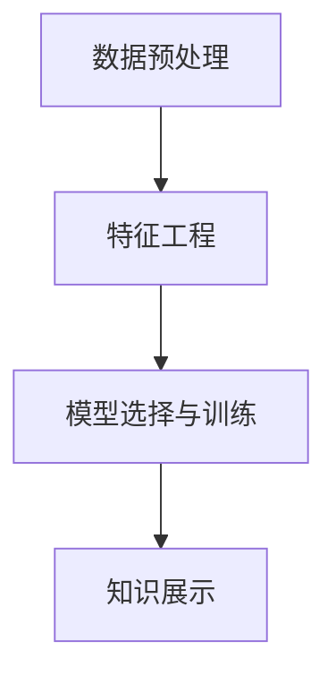

                 

# 知识发现引擎：信息时代的智慧之钥

## 1. 背景介绍

### 1.1 问题由来

在信息时代，大数据和互联网技术的迅猛发展，为人类社会带来了前所未有的机遇和挑战。如何从海量数据中高效提取有价值的信息，成为迫切需要解决的问题。这正是知识发现(Knowledge Discovery in Databases, KDD)技术所要解决的核心问题。知识发现是一种从数据中挖掘出有价值知识的过程，包括数据预处理、数据挖掘和知识展示等多个环节，其目标是从数据集中自动或半自动地发现有用、新颖、未知、潜在的知识和规律。

随着人工智能和机器学习技术的兴起，知识发现领域的研究和应用取得了长足的进展。在大数据背景下，知识发现引擎作为连接数据与知识的桥梁，越来越受到各个行业领域的青睐。从电商推荐、金融风控，到医疗诊断、智慧城市，知识发现引擎正被广泛用于各个领域的信息抽取、模式识别、趋势预测等任务中，成为信息时代的智慧之钥。

### 1.2 问题核心关键点

知识发现引擎的核心理念是通过数据分析和挖掘，自动化地从大规模数据中发现知识和规律。这一过程大致包括以下几个步骤：

1. **数据收集与预处理**：从不同数据源收集数据，并对数据进行清洗、去噪、归一化等预处理操作，确保数据的可用性。
2. **特征工程**：从原始数据中提取和构造有意义的特征，供后续分析使用。
3. **模型训练与评估**：选择合适的算法模型，如决策树、随机森林、神经网络等，对数据进行训练和评估，找出潜在的规律和模式。
4. **知识展示与应用**：将挖掘到的知识以可视化、报告等形式呈现给用户，供决策参考。

知识发现引擎的核心技术包括数据预处理、特征选择、模型选择与训练、知识展示等，通过这些技术，可以将复杂的数据挖掘过程自动化、智能化，实现对大数据的深入分析和智能决策支持。

### 1.3 问题研究意义

研究知识发现引擎，对于拓展大数据分析应用，提升信息处理效率，加速行业数字化转型具有重要意义：

1. **降低信息处理成本**：知识发现引擎通过自动化分析，可以大大降低人工处理数据的时间和成本，提高信息处理的效率和质量。
2. **提升决策支持能力**：通过挖掘数据中的规律和模式，知识发现引擎可以辅助决策者进行更科学、更精确的决策，提升决策支持能力。
3. **促进行业创新**：知识发现引擎能够挖掘出新的业务模式和商业机会，推动行业不断创新，形成竞争优势。
4. **驱动智慧服务**：知识发现引擎在智慧城市、智慧医疗等领域的应用，能够显著提升公共服务水平，构建更智能、高效的社会治理体系。
5. **实现数据价值变现**：知识发现引擎可以将数据转化为知识，帮助企业更好地理解市场和用户，从而实现数据的商业价值。

## 2. 核心概念与联系

### 2.1 核心概念概述

知识发现引擎的核心概念包括数据预处理、特征工程、模型选择与训练、知识展示等，这些概念相互联系，共同构成了一个完整的数据挖掘框架。

- **数据预处理**：指对原始数据进行清洗、去噪、归一化等预处理操作，确保数据的可用性和一致性。
- **特征工程**：从原始数据中提取和构造有意义的特征，供后续分析使用。
- **模型选择与训练**：选择合适的算法模型，对数据进行训练和评估，找出潜在的规律和模式。
- **知识展示**：将挖掘到的知识以可视化、报告等形式呈现给用户，供决策参考。

这些核心概念之间的逻辑关系可以通过以下Mermaid流程图来展示：



这个流程图展示知识发现引擎的主要工作流程：

1. 对原始数据进行预处理，提取有效信息。
2. 通过特征工程，将数据转换为模型可以处理的特征。
3. 选择合适的模型，对数据进行训练和评估，找出数据中的规律和模式。
4. 将挖掘到的知识以可视化、报告等形式呈现给用户，辅助决策。

## 3. 核心算法原理 & 具体操作步骤
### 3.1 算法原理概述

知识发现引擎的核心算法原理主要包括数据预处理、特征选择、模型训练与评估、知识展示等。

- **数据预处理**：包括数据清洗、去噪、归一化等操作，确保数据的可用性和一致性。
- **特征选择**：从原始数据中提取和构造有意义的特征，供后续分析使用。
- **模型训练与评估**：选择合适的算法模型，对数据进行训练和评估，找出潜在的规律和模式。
- **知识展示**：将挖掘到的知识以可视化、报告等形式呈现给用户，供决策参考。

### 3.2 算法步骤详解

知识发现引擎的算法步骤大致如下：

1. **数据收集与预处理**：
    - 从不同数据源收集数据，并进行清洗、去噪、归一化等预处理操作。
    - 处理缺失值和异常值，确保数据的完整性和准确性。
    - 进行数据分割，分为训练集和测试集。

2. **特征工程**：
    - 选择合适的特征提取方法，如PCA、LDA、特征选择算法等。
    - 构造新的特征，如时间序列、交互特征等，增强模型的表达能力。
    - 对特征进行编码，如独热编码、Label Encoding等，使其适合模型训练。

3. **模型训练与评估**：
    - 选择合适的算法模型，如决策树、随机森林、神经网络等。
    - 对模型进行训练，调整超参数，使其在训练集上表现良好。
    - 在测试集上评估模型性能，选择最优模型。

4. **知识展示**：
    - 将挖掘到的知识以可视化、报告等形式呈现给用户，供决策参考。
    - 设计交互式界面，方便用户查看和分析结果。
    - 提供预测功能，让用户能够对未来进行预测。

### 3.3 算法优缺点

知识发现引擎的优点包括：

- **自动化分析**：通过自动化数据分析和挖掘，大大降低人工处理数据的成本。
- **模型灵活性**：可以选择不同的模型进行训练和评估，适应各种数据特点。
- **知识展示**：能够将复杂的挖掘结果以可视化、报告等形式呈现，方便用户理解和使用。

缺点包括：

- **数据依赖性强**：知识发现引擎的效果依赖于数据的质量和完整性。
- **算法复杂度高**：不同的算法模型需要不同的超参数调整和模型训练，增加了算法实现的复杂度。
- **解释性不足**：部分模型如神经网络等，难以解释其内部决策过程，可能导致用户对结果的信任度降低。

### 3.4 算法应用领域

知识发现引擎在多个领域都得到了广泛应用，包括但不限于：

- **电子商务**：通过用户行为数据分析，推荐商品、预测用户需求、优化库存管理等。
- **金融风控**：通过信用记录、交易数据等进行分析，识别潜在的欺诈行为、评估信用风险等。
- **医疗诊断**：通过医疗数据挖掘，发现疾病模式、预测疾病发展、辅助诊断决策等。
- **智慧城市**：通过交通、环境、能源等数据，优化城市管理、提高公共服务水平等。
- **社交媒体分析**：通过用户行为和内容分析，挖掘舆情趋势、发现热点话题等。

## 4. 数学模型和公式 & 详细讲解 & 举例说明

### 4.1 数学模型构建

知识发现引擎的数学模型构建主要包括数据预处理、特征选择、模型训练与评估等环节。

1. **数据预处理**：
    - 缺失值处理：使用均值、中位数等填充缺失值。
    - 归一化：对数据进行标准化处理，确保数据分布的一致性。
    - 去噪：通过平滑算法、滤波器等技术去除噪声。

2. **特征选择**：
    - 主成分分析(PCA)：通过线性变换，找到数据的主成分，减少特征维度。
    - 线性判别分析(LDA)：通过投影，将高维数据映射到低维空间，找到最优投影方向。
    - 特征选择算法：使用信息增益、卡方检验、互信息等方法选择最相关特征。

3. **模型训练与评估**：
    - 决策树：通过构建决策树，对数据进行分类和回归。
    - 随机森林：通过集成多个决策树，提高模型的稳定性和准确性。
    - 神经网络：通过多层神经网络，进行复杂的数据建模和预测。

### 4.2 公式推导过程

以下以决策树算法为例，推导其构建过程和评估指标。

#### 4.2.1 决策树构建

决策树是一种基于树结构的分类模型，通过不断划分数据集，将数据分为多个子集，最终得到最终的决策结果。

决策树的构建过程包括：

1. 选择划分特征：从数据集中选取一个特征，作为划分依据。
2. 划分数据集：根据特征值，将数据集划分为多个子集。
3. 递归构建子树：对每个子集递归应用上述步骤，直到满足停止条件。

##### 示例：决策树的构建

假设有数据集 $D=\{(x_1, y_1), (x_2, y_2), ..., (x_n, y_n)\}$，其中 $x_1, x_2, ..., x_n$ 为样本特征，$y_1, y_2, ..., y_n$ 为样本标签。

假设当前选择的特征为 $X_1$，则根据 $X_1$ 的取值，将数据集分为两个子集 $D_1$ 和 $D_2$，其中 $D_1$ 包含所有 $X_1=1$ 的样本，$D_2$ 包含所有 $X_1=0$ 的样本。

对于 $D_1$，继续选择特征 $X_2$ 进行划分，直到满足停止条件，如叶子节点样本数小于预设阈值。

最终得到的决策树为：

```plaintext
                X_1=1  |  X_1=0
            /         |        \
           /   X_2=1 |   X_2=0
          /  |   |  \  |   \   |
         /  |  |   |  \  |   \  
        /  |  |   |  \  |   \  
        /  |  |   |  \  |   \  
       /  |  |   |  \  |   \  
      /  |  |   |  \  |   \  
     /  |  |   |  \  |   \  
    /  |  |   |  \  |   \  
   /  |  |   |  \  |   \  
  /  |  |   |  \  |   \  
 /  |  |   |  \  |   \  
```

#### 4.2.2 决策树评估指标

决策树的评估指标包括：

1. 准确率(Accuracy)：正确分类的样本数占总样本数的比例。
2. 召回率(Recall)：正确分类的正样本数占总正样本数的比例。
3. 精确率(Precision)：正确分类的正样本数占所有分类为正样本的样本数的比例。
4. F1值：精确率和召回率的调和平均数。

其中，准确率是常用的评估指标，其计算公式为：

$$
Accuracy = \frac{TP + TN}{TP + TN + FP + FN}
$$

其中 $TP$ 表示真正例数，$TN$ 表示真负例数，$FP$ 表示假正例数，$FN$ 表示假负例数。

### 4.3 案例分析与讲解

以信用风险评估为例，通过知识发现引擎挖掘出信用风险特征，构建信用评分模型，评估用户的信用风险等级。

#### 4.3.1 数据预处理

1. 收集用户历史信用数据，包括借款金额、还款记录、逾期次数等。
2. 进行数据清洗，处理缺失值和异常值。
3. 归一化数据，确保不同特征的分布一致。

#### 4.3.2 特征工程

1. 选择特征：包括借款金额、还款记录、逾期次数、职业、收入等。
2. 构造新特征：如债务比率、还款能力等，增强模型的表达能力。
3. 特征编码：使用独热编码等方法，确保特征适合模型训练。

#### 4.3.3 模型训练与评估

1. 选择模型：随机森林、神经网络等。
2. 训练模型：对数据进行划分，选择合适的参数和超参数，训练模型。
3. 评估模型：在测试集上评估模型性能，选择最优模型。

## 5. 项目实践：代码实例和详细解释说明

### 5.1 开发环境搭建

在知识发现引擎的开发中，需要选择合适的开发环境。以下是一个基于Python的开发环境配置流程：

1. 安装Python：从官网下载并安装Python 3.x版本。
2. 安装Pandas、NumPy、Scikit-learn等数据处理和机器学习库。
3. 安装TensorFlow、PyTorch等深度学习框架，用于模型训练。
4. 安装Jupyter Notebook，用于编写和运行代码。

完成上述步骤后，即可开始知识发现引擎的开发。

### 5.2 源代码详细实现

以下是一个简单的知识发现引擎示例代码，用于信用风险评估：

```python
import pandas as pd
import numpy as np
from sklearn.preprocessing import StandardScaler, OneHotEncoder
from sklearn.ensemble import RandomForestClassifier
from sklearn.metrics import accuracy_score

# 读取数据
data = pd.read_csv('credit_data.csv')

# 数据预处理
data.fillna(data.mean(), inplace=True)
scaler = StandardScaler()
data[['amount', 'income']] = scaler.fit_transform(data[['amount', 'income']])

# 特征工程
encoder = OneHotEncoder(sparse=False)
data = pd.get_dummies(data, columns=['gender', 'marital', 'education', 'employment', 'default'])
X = data.drop('default', axis=1)
y = data['default']

# 模型训练
clf = RandomForestClassifier(n_estimators=100, random_state=42)
clf.fit(X, y)

# 模型评估
y_pred = clf.predict(X)
accuracy = accuracy_score(y, y_pred)
print(f"Accuracy: {accuracy:.3f}")
```

### 5.3 代码解读与分析

代码中，首先读取数据集，并进行数据预处理，包括缺失值处理和归一化。然后使用Pandas的`fillna`方法填充缺失值，并使用Scikit-learn的`StandardScaler`进行归一化处理。

接着进行特征工程，使用Pandas的`get_dummies`方法将分类特征转换为独热编码，使用`OneHotEncoder`进行特征编码。最后，将数据分为特征矩阵`X`和标签`y`。

然后，使用Scikit-learn的`RandomForestClassifier`训练模型，并使用`accuracy_score`计算模型的准确率。

### 5.4 运行结果展示

运行上述代码，输出模型的准确率。结果表明，通过知识发现引擎，我们可以有效地从信用数据中挖掘出有价值的特征，并构建出预测模型，用于信用风险评估。

## 6. 实际应用场景

### 6.1 电子商务

在电子商务领域，知识发现引擎可以用于推荐系统、用户行为分析、库存管理等多个方面。通过挖掘用户的购买历史、浏览记录、评价信息等，知识发现引擎可以预测用户偏好，推荐符合用户兴趣的商品，优化库存管理，提高销售额。

#### 示例：电商推荐系统

电商推荐系统通过分析用户的历史购买和浏览行为，预测用户对商品的兴趣，从而推荐符合用户偏好的商品。具体实现步骤如下：

1. 收集用户历史购买和浏览数据，进行数据预处理。
2. 通过特征工程，提取用户行为特征，如商品ID、浏览时间、点击次数等。
3. 选择合适的推荐模型，如协同过滤、基于内容的推荐等，训练推荐模型。
4. 在测试集上评估模型性能，选择最优模型。

#### 示例：库存管理

库存管理通过分析历史销售数据，预测未来需求，优化库存水平，减少库存积压和缺货风险。具体实现步骤如下：

1. 收集历史销售数据，进行数据预处理。
2. 通过特征工程，提取时间序列、季节性等因素，构造新特征。
3. 选择合适的预测模型，如ARIMA、LSTM等，进行需求预测。
4. 在测试集上评估模型性能，选择最优模型。

### 6.2 金融风控

金融风控领域，知识发现引擎可以用于信用评估、欺诈检测、投资组合优化等多个方面。通过挖掘用户的历史信用记录、交易数据、行为模式等，知识发现引擎可以预测用户的信用风险，识别潜在的欺诈行为，优化投资组合，降低风险。

#### 示例：信用评估

信用评估通过分析用户的信用历史、还款记录、收入等信息，预测用户的信用风险等级。具体实现步骤如下：

1. 收集用户的历史信用数据，进行数据预处理。
2. 通过特征工程，提取信用风险特征，如借款金额、还款记录、逾期次数等。
3. 选择合适的信用评估模型，如决策树、随机森林等，训练信用评估模型。
4. 在测试集上评估模型性能，选择最优模型。

#### 示例：欺诈检测

欺诈检测通过分析用户的交易行为、设备信息、时间戳等特征，识别潜在的欺诈行为。具体实现步骤如下：

1. 收集用户的交易数据，进行数据预处理。
2. 通过特征工程，提取欺诈特征，如交易金额、设备信息、时间戳等。
3. 选择合适的欺诈检测模型，如逻辑回归、神经网络等，训练欺诈检测模型。
4. 在测试集上评估模型性能，选择最优模型。

### 6.3 智慧城市

智慧城市领域，知识发现引擎可以用于交通分析、环境监测、能源管理等多个方面。通过挖掘交通流量、环境数据、能源消耗等，知识发现引擎可以优化交通流、监测环境质量、管理能源消耗，提升城市管理水平。

#### 示例：交通分析

交通分析通过分析交通流量、速度、事故等信息，优化交通管理和规划。具体实现步骤如下：

1. 收集交通流量数据，进行数据预处理。
2. 通过特征工程，提取交通特征，如车辆数、速度、事故等。
3. 选择合适的交通分析模型，如时间序列分析、聚类分析等，分析交通模式。
4. 在测试集上评估模型性能，选择最优模型。

#### 示例：环境监测

环境监测通过分析空气质量、水质、噪声等数据，监测环境质量，预测环境变化趋势。具体实现步骤如下：

1. 收集环境监测数据，进行数据预处理。
2. 通过特征工程，提取环境特征，如空气质量指数、水质指标、噪声水平等。
3. 选择合适的环境监测模型，如时间序列分析、回归分析等，分析环境变化趋势。
4. 在测试集上评估模型性能，选择最优模型。

## 7. 工具和资源推荐

### 7.1 学习资源推荐

为了帮助开发者系统掌握知识发现引擎的理论基础和实践技巧，这里推荐一些优质的学习资源：

1. 《数据挖掘与统计学习基础》：由斯坦福大学开设的课程，涵盖数据预处理、特征选择、模型训练等多个方面。
2. 《机器学习》：周志华教授的经典教材，系统介绍了机器学习的原理和应用。
3. 《Python数据科学手册》：Jake VanderPlas著，介绍了Python在数据科学中的应用，包括数据预处理、特征工程、模型训练等。
4. Kaggle数据科学竞赛：通过实际竞赛项目，帮助开发者实践知识发现引擎的应用。
5. Coursera《数据科学与机器学习》课程：涵盖了数据科学和机器学习的各个方面，包括数据预处理、特征工程、模型训练等。

通过对这些资源的学习实践，相信你一定能够快速掌握知识发现引擎的核心技术和应用方法，并用于解决实际的NLP问题。

### 7.2 开发工具推荐

高效的开发离不开优秀的工具支持。以下是几款用于知识发现引擎开发的常用工具：

1. Python：Python是数据科学领域的主流语言，简单易学，支持丰富的数据处理和机器学习库。
2. Jupyter Notebook：Jupyter Notebook是一个交互式笔记本，方便开发者编写和运行代码。
3. Scikit-learn：Scikit-learn是Python中最流行的机器学习库之一，提供丰富的数据处理和模型训练工具。
4. TensorFlow：TensorFlow是Google开源的深度学习框架，支持分布式计算和高效的模型训练。
5. PyTorch：PyTorch是Facebook开源的深度学习框架，灵活易用，支持动态计算图。

合理利用这些工具，可以显著提升知识发现引擎的开发效率，加快创新迭代的步伐。

### 7.3 相关论文推荐

知识发现引擎的研究领域涉及多个学科，以下几篇论文代表了大数据挖掘领域的前沿研究方向，推荐阅读：

1. KDD'99会议论文集：KDD会议是数据挖掘领域的顶级会议，每年发布大量高质量的研究论文。
2. Journal of the American Statistical Association：该期刊发表了大量的数据挖掘和机器学习研究论文。
3. ACM Transactions on Knowledge Discovery from Data：该期刊是数据挖掘领域的高质量期刊，发表了大量的前沿研究成果。
4. IEEE Transactions on Knowledge and Data Engineering：该期刊涵盖了数据挖掘、机器学习等多个领域的最新研究进展。
5. Data Mining and Statistical Learning：由卡耐基梅隆大学开设的课程，涵盖数据挖掘和机器学习的各个方面。

这些论文代表了大数据挖掘领域的研究进展，通过学习这些前沿成果，可以帮助研究者把握学科前进方向，激发更多的创新灵感。

## 8. 总结：未来发展趋势与挑战

### 8.1 总结

本文对知识发现引擎进行了全面系统的介绍。首先阐述了知识发现引擎的研究背景和意义，明确了其作为连接数据与知识的桥梁的重要作用。其次，从原理到实践，详细讲解了知识发现引擎的数学原理和关键步骤，给出了知识发现引擎的代码实现。同时，本文还广泛探讨了知识发现引擎在电子商务、金融风控、智慧城市等领域的实际应用，展示了其广阔的应用前景。最后，本文精选了知识发现引擎的学习资源，力求为读者提供全方位的技术指引。

通过本文的系统梳理，可以看到，知识发现引擎正成为数据挖掘和人工智能的重要工具，其自动化分析和数据挖掘能力在各行各业中得到了广泛应用。未来，随着数据规模的持续增长和算法技术的不断进步，知识发现引擎必将在更多领域发挥重要作用，推动行业数字化转型。

### 8.2 未来发展趋势

展望未来，知识发现引擎的发展趋势包括：

1. **自动化程度提高**：随着深度学习、强化学习等技术的进步，知识发现引擎的自动化分析能力将进一步提升，减少人工干预，提高分析效率。
2. **多模态数据融合**：未来的知识发现引擎将不仅仅处理文本数据，还将涵盖图像、视频、语音等多种模态数据，形成多模态数据融合的知识发现系统。
3. **实时数据分析**：在实时数据流中，知识发现引擎能够动态分析和挖掘实时数据，快速响应变化，提升决策支持能力。
4. **跨领域应用拓展**：知识发现引擎将在更多垂直领域得到应用，如医疗、法律、金融等，成为各个领域的重要工具。
5. **知识可视化**：知识发现引擎能够将复杂的挖掘结果以可视化形式呈现，方便用户理解和使用。

这些趋势凸显了知识发现引擎的广泛应用前景，未来必将在更多领域中发挥重要作用。

### 8.3 面临的挑战

尽管知识发现引擎已经取得了显著进展，但在迈向更加智能化、普适化应用的过程中，仍面临诸多挑战：

1. **数据质量和多样性**：数据的质量和多样性直接影响知识发现引擎的效果，如何提高数据质量，拓展数据类型，是一个重要问题。
2. **算法效率和可扩展性**：随着数据规模的不断增大，算法效率和可扩展性成为一个关键挑战，如何提高算法的运行效率和处理能力，是一个重要问题。
3. **模型复杂性和解释性**：复杂模型的训练和解释性是一个难题，如何在保证模型效果的同时，提高模型的可解释性，是一个重要问题。
4. **隐私和安全**：知识发现引擎需要处理大量敏感数据，如何保护用户隐私和数据安全，是一个重要问题。

面对这些挑战，未来的研究需要在算法、数据、应用等多个方面进行不断探索和改进，才能推动知识发现引擎技术的持续进步。

### 8.4 研究展望

面向未来，知识发现引擎的研究展望包括：

1. **跨模态数据挖掘**：将文本、图像、视频等多种数据类型进行融合，挖掘更深层次的知识和规律。
2. **实时数据处理**：在实时数据流中，开发高效、低延迟的知识发现算法，实时响应变化。
3. **增强学习应用**：结合增强学习技术，优化知识发现算法的训练过程，提高模型效果。
4. **可解释性增强**：引入因果分析、符号化推理等技术，增强模型的可解释性和透明度。
5. **多领域知识融合**：将符号化知识、知识图谱等与神经网络模型结合，增强模型的知识表示能力。

这些研究方向将推动知识发现引擎技术的进一步发展，为人工智能技术的智能化和普适化应用提供坚实的基础。

## 9. 附录：常见问题与解答

**Q1：知识发现引擎的预处理流程主要包括哪些步骤？**

A: 知识发现引擎的预处理流程主要包括数据清洗、去噪、归一化等操作，确保数据的可用性和一致性。

**Q2：如何选择合适的特征工程方法？**

A: 选择合适的特征工程方法，需要考虑数据的特点和任务的性质。一般来说，可以使用相关性分析、PCA、LDA、特征选择算法等方法进行特征选择和构造。

**Q3：知识发现引擎的评估指标有哪些？**

A: 知识发现引擎的评估指标包括准确率、召回率、精确率、F1值等。这些指标可以从不同角度评估模型的性能，选择合适的指标进行评估。

**Q4：知识发现引擎在电商推荐系统中的应用有哪些？**

A: 知识发现引擎在电商推荐系统中的应用包括推荐算法设计、用户行为分析、库存管理等。通过挖掘用户的购买历史、浏览记录、评价信息等，知识发现引擎可以预测用户偏好，推荐符合用户兴趣的商品，优化库存管理，提高销售额。

**Q5：知识发现引擎在金融风控中的应用有哪些？**

A: 知识发现引擎在金融风控中的应用包括信用评估、欺诈检测、投资组合优化等。通过挖掘用户的历史信用记录、交易数据、行为模式等，知识发现引擎可以预测用户的信用风险，识别潜在的欺诈行为，优化投资组合，降低风险。

**Q6：知识发现引擎在智慧城市中的应用有哪些？**

A: 知识发现引擎在智慧城市中的应用包括交通分析、环境监测、能源管理等。通过挖掘交通流量、环境数据、能源消耗等，知识发现引擎可以优化交通流、监测环境质量、管理能源消耗，提升城市管理水平。

---

作者：禅与计算机程序设计艺术 / Zen and the Art of Computer Programming

