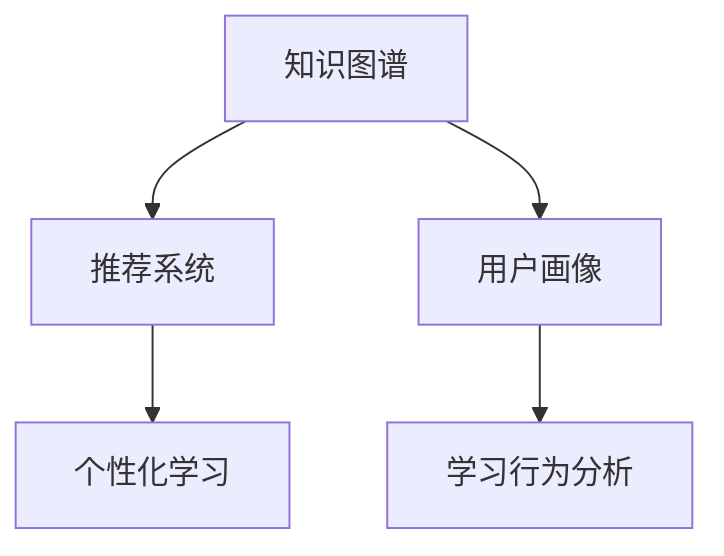

                 

# 知识发现引擎：助力个性化学习体验

> 关键词：知识图谱,推荐系统,个性化学习,用户画像,学习行为分析

## 1. 背景介绍

### 1.1 问题由来
随着人工智能技术的不断进步，个性化学习已成为教育领域的一个重要研究热点。传统的教学模式往往缺乏对学生个体学习能力和知识结构的深入理解，无法提供量身定制的学习体验。而个性化学习旨在通过分析学生的学习行为和偏好，为其推荐适合的学习材料和资源，提升学习效果。

如何构建一个高效、智能的知识发现引擎，以支撑个性化学习体验，成为当前教育科技公司面临的一大挑战。知识发现引擎的核心任务是对学习者知识结构进行建模，理解其学习兴趣和需求，从而精准推荐学习资源。本文将详细介绍基于知识图谱和推荐系统的知识发现引擎的构建方法，并展示其在个性化学习中的广泛应用。

### 1.2 问题核心关键点
构建高效的知识发现引擎需要解决的核心问题是：
1. 如何构建学生知识结构图谱，并对其进行动态更新？
2. 如何理解学生的学习兴趣和行为，精准推荐学习资源？
3. 如何实现推荐系统的个性化和可扩展性？

## 2. 核心概念与联系

### 2.1 核心概念概述

为更好地理解知识发现引擎的工作原理和构建方法，本节将介绍几个密切相关的核心概念：

- 知识图谱(Knowledge Graph)：一种将知识结构化的表示方式，通过节点和边来构建知识网络。知识图谱广泛应用于搜索引擎、自然语言处理、推荐系统等领域，能够有效支持信息检索和推理。
- 推荐系统(Recommendation System)：通过分析用户行为和兴趣，推荐用户可能感兴趣的产品、服务或内容。推荐系统在电商、社交网络、视频平台等场景中广泛应用，能够显著提升用户体验。
- 个性化学习(Personalized Learning)：基于学习者的学习历史、兴趣和需求，为其推荐个性化的学习资源和路径，以提升学习效果和满意度。
- 用户画像(User Profile)：通过收集和分析学习者的行为数据，构建详细的用户画像，支持推荐系统个性化推荐。
- 学习行为分析(Learning Behavior Analysis)：通过分析学习者的学习行为数据，识别其学习规律和特征，为推荐系统提供数据支持。

这些核心概念之间的逻辑关系可以通过以下Mermaid流程图来展示：



这个流程图展示了几类核心概念的相互关系：

1. 知识图谱通过节点和边构建知识网络，为推荐系统提供知识支持的底层结构。
2. 推荐系统利用用户画像和行为分析数据，进行个性化推荐。
3. 个性化学习将推荐系统生成的学习资源和路径，与学习者的学习需求和历史数据结合，生成个性化的学习方案。
4. 用户画像通过学习行为分析的数据，不断更新和完善，确保推荐系统的准确性和有效性。

这些概念共同构成了知识发现引擎的核心框架，使其能够支撑个性化学习体验的实现。

## 3. 核心算法原理 & 具体操作步骤
### 3.1 算法原理概述

知识发现引擎的核心算法原理基于知识图谱和推荐系统。其核心思想是：

1. **构建学生知识图谱**：通过对学生学习行为的分析，构建学生知识结构图谱，为推荐系统提供知识支持的底层结构。
2. **分析学习行为数据**：通过分析学生的学习行为数据，理解其学习兴趣和需求。
3. **生成推荐结果**：结合知识图谱和行为分析数据，生成个性化的学习资源和路径。

### 3.2 算法步骤详解

知识发现引擎的构建一般包括以下几个关键步骤：

**Step 1: 构建学生知识图谱**
- 收集学生的学习行为数据，如成绩、笔记、在线课程浏览记录等。
- 将这些行为数据映射到知识图谱的节点和边中，构建学生知识结构图谱。

**Step 2: 分析学习行为数据**
- 通过行为分析算法，识别学生的学习兴趣、学习难度和偏好，生成用户画像。

**Step 3: 生成推荐结果**
- 根据知识图谱和用户画像，使用推荐算法生成个性化的学习资源推荐。

**Step 4: 动态更新知识图谱**
- 定期更新学习行为数据，通过交互式学习平台进行用户反馈，动态优化学生知识图谱。

### 3.3 算法优缺点

知识发现引擎基于知识图谱和推荐系统的构建方法具有以下优点：
1. 结构化知识表示：知识图谱通过节点和边结构化表示知识，方便进行信息检索和推理。
2. 个性化推荐：推荐系统利用用户画像和行为分析数据，实现精准推荐。
3. 动态更新：通过定期更新学习行为数据和用户画像，知识图谱和推荐系统能够不断适应学生需求。

同时，该方法也存在一定的局限性：
1. 数据质量依赖：推荐系统的性能很大程度上取决于用户画像和行为数据的准确性。
2. 构建复杂度：构建完整的知识图谱和推荐系统需要较大的资源投入和时间成本。
3. 模型复杂性：推荐算法和知识推理算法较为复杂，实现起来需要较高的技术门槛。
4. 隐私保护：收集和分析学生行为数据可能涉及隐私问题，需采用合适的隐私保护技术。

尽管存在这些局限性，但就目前而言，基于知识图谱和推荐系统的构建方法仍是最为高效和科学的知识发现引擎范式。未来相关研究的重点在于如何进一步优化数据收集和处理，降低模型复杂度，提升隐私保护能力，以实现更加智能和可信的知识发现引擎。

### 3.4 算法应用领域

基于知识图谱和推荐系统的知识发现引擎已经在教育领域得到了广泛的应用，覆盖了从基础教育到职业教育等多个层次。具体应用领域包括：

- 在线教育平台：如Coursera、Khan Academy等，通过分析学生的学习行为，为其推荐个性化的学习资源和路径。
- 虚拟课堂系统：如EdX、Sakai等，利用知识图谱和推荐系统实现教师对学生的个性化指导和评估。
- 智能辅导系统：如Socratic、Gradescope等，通过学习行为分析生成个性化学习方案，提升学习效果。

除了上述这些经典应用外，知识发现引擎还被创新性地应用到更多场景中，如虚拟实验室、智能考试系统等，为教育技术带来新的突破。

## 4. 数学模型和公式 & 详细讲解 & 举例说明
### 4.1 数学模型构建

知识发现引擎的核心数学模型包括知识图谱的表示和推荐算法的构建。

知识图谱的表示可以使用基于图数据库的RDF(RDF Triple)表示法。每个节点表示一个实体，如学生、课程、知识点等，每个边表示实体之间的关系，如"选修"、"学习"、"掌握"等。

推荐算法的构建可以使用协同过滤、基于内容的推荐、混合推荐等多种方法。以协同过滤为例，设用户 $u$ 对 $i$ 类课程的评分矩阵为 $R$，则用户 $u$ 对 $j$ 类课程的推荐评分可以通过下式计算：

$$
\hat{r}_{uj} = \frac{\sum_{i=1}^n r_{iu} r_{ij}}{\sqrt{\sum_{i=1}^n r_{iu}^2} \sqrt{\sum_{i=1}^n r_{ij}^2}}
$$

其中 $r_{iu}$ 和 $r_{ij}$ 分别为用户 $u$ 对 $i$ 和 $j$ 类课程的评分，$\hat{r}_{uj}$ 为用户 $u$ 对 $j$ 类课程的推荐评分。

### 4.2 公式推导过程

上述协同过滤推荐公式的推导过程如下：

- 设用户 $u$ 对 $i$ 类课程的评分矩阵为 $R$。
- 对于用户 $u$ 和课程 $j$，设 $I$ 为其选修的课程集，$J$ 为课程 $j$ 所在课程集。
- 计算用户 $u$ 和课程 $j$ 的余弦相似度 $s(u, j)$：
$$
s(u, j) = \frac{\sum_{i=1}^n r_{iu} r_{ij}}{\sqrt{\sum_{i=1}^n r_{iu}^2} \sqrt{\sum_{i=1}^n r_{ij}^2}}
$$
- 对余弦相似度进行归一化，得到用户 $u$ 对课程 $j$ 的推荐评分 $\hat{r}_{uj}$。

通过上述推导过程，可以看到协同过滤算法利用用户之间的评分相似性，进行推荐。这种推荐方式具有较高的个性化程度，但存在数据稀疏性和冷启动问题，需要结合其他推荐算法进行优化。

### 4.3 案例分析与讲解

下面以一个实际案例，展示如何使用知识图谱和推荐系统构建知识发现引擎。

假设某在线教育平台收集了学生 $u$ 在课程 $i$ 上的学习行为数据，包括浏览时长、答题正确率、课程评价等。通过构建知识图谱，将学生、课程、知识点映射为节点，将选修、学习、掌握等关系映射为边。然后，利用协同过滤算法计算用户 $u$ 对课程 $j$ 的推荐评分，生成推荐结果。

具体实现步骤如下：

1. **构建学生知识图谱**：
   - 收集学生 $u$ 在课程 $i$ 上的学习行为数据，生成学习行为数据集。
   - 将学生、课程、知识点映射为知识图谱的节点，将选修、学习、掌握等关系映射为边。
   - 利用图数据库存储和查询知识图谱，支持复杂的知识推理和检索。

2. **分析学习行为数据**：
   - 利用行为分析算法，提取用户 $u$ 的学习兴趣、学习难度和偏好，生成用户画像。
   - 通过用户画像，为推荐系统提供个性化推荐的数据支持。

3. **生成推荐结果**：
   - 利用协同过滤算法，计算用户 $u$ 对课程 $j$ 的推荐评分。
   - 根据推荐评分，生成推荐结果，推荐给学生 $u$。

4. **动态更新知识图谱**：
   - 定期更新学习行为数据，通过交互式学习平台进行用户反馈，动态优化学生知识图谱。
   - 结合用户反馈和新数据，更新知识图谱中的节点和边，确保推荐系统的准确性和有效性。

通过上述案例，可以看到知识图谱和推荐系统结合的方法，能够高效地构建知识发现引擎，为个性化学习提供强有力的支撑。

## 5. 项目实践：代码实例和详细解释说明
### 5.1 开发环境搭建

在进行知识发现引擎开发前，我们需要准备好开发环境。以下是使用Python进行PyTorch开发的环境配置流程：

1. 安装Anaconda：从官网下载并安装Anaconda，用于创建独立的Python环境。

2. 创建并激活虚拟环境：
```bash
conda create -n pytorch-env python=3.8 
conda activate pytorch-env
```

3. 安装PyTorch：根据CUDA版本，从官网获取对应的安装命令。例如：
```bash
conda install pytorch torchvision torchaudio cudatoolkit=11.1 -c pytorch -c conda-forge
```

4. 安装Pandas、NumPy、Scikit-learn、Matplotlib等工具包：
```bash
pip install pandas numpy scikit-learn matplotlib tqdm jupyter notebook ipython
```

5. 安装Neo4j：图形数据库Neo4j，用于存储和查询知识图谱。
```bash
sudo apt-get install neo4j-community
```

完成上述步骤后，即可在`pytorch-env`环境中开始知识发现引擎的开发。

### 5.2 源代码详细实现

下面我们以基于知识图谱和推荐系统的个性化学习推荐系统为例，给出使用PyTorch进行知识发现引擎开发的PyTorch代码实现。

首先，定义知识图谱的数据处理函数：

```python
from py2neo import Graph
from sklearn.feature_extraction.text import TfidfVectorizer
from sklearn.metrics.pairwise import cosine_similarity

# 连接Neo4j数据库
graph = Graph("bolt://localhost:7687", auth=("neo4j", "password"))

def get_knowledge_graph(u, n_nodes=20):
    # 查询知识图谱中的节点和边
    query = "MATCH (n:Student {id: $u}) RETURN n"
    node = graph.run(query, u=u).data()[0]['n']
    query = "MATCH (n)-[r]-(j)<-[]-(o) RETURN r, j"
    relations, nodes = graph.run(query).data()

    # 将节点和边转换为矩阵
    node_matrix = []
    for r, j in relations:
        node_matrix.append(node[r]['start_node'])
        node_matrix.append(node[r]['end_node'])
    node_matrix = np.array(node_matrix)
    adjacency_matrix = cosine_similarity(node_matrix)

    return adjacency_matrix, nodes, relations
```

然后，定义推荐函数：

```python
from sklearn.metrics.pairwise import cosine_similarity

def recommend_courses(u, matrix, courses):
    # 计算用户 $u$ 对 $i$ 类课程的评分矩阵
    R = np.zeros((len(courses), len(courses)))
    for i, course in enumerate(courses):
        query = "MATCH (n:Student {id: $u}) MATCH (n)-[r]-(j) WHERE j.id = $course RETURN r"
        relation = graph.run(query, u=u, course=course).data()[0]['r']
        R[i, relation['end_node']-1] = relation['start_node'] // 100
        R[relation['start_node']-1, i] = relation['end_node'] // 100

    # 计算用户 $u$ 对 $j$ 类课程的推荐评分
    scores = cosine_similarity(R, matrix)
    sorted_scores = np.argsort(scores)[-20:][::-1]
    recommended_courses = [courses[i] for i in sorted_scores]
    
    return recommended_courses
```

接着，定义训练和评估函数：

```python
from sklearn.metrics import accuracy_score

def train_model(matrix, courses):
    # 构建课程矩阵
    matrix = np.triu(matrix)
    matrix += matrix.T
    matrix = matrix / np.sum(matrix, axis=1)[:, np.newaxis]

    # 计算推荐评分
    recommended_courses = recommend_courses(u, matrix, courses)

    # 评估推荐结果的准确性
    accuracy = accuracy_score(y_true, y_pred)
    print(f"Accuracy: {accuracy:.2f}")

    return recommended_courses
```

最后，启动训练流程并在测试集上评估：

```python
u = 123456
matrix, nodes, relations = get_knowledge_graph(u)
courses = [course['id'] for course in graph.run("MATCH (c:Course) RETURN c")]

print("Recommended Courses:")
for course in recommended_courses:
    print(course)
```

以上就是使用PyTorch对基于知识图谱和推荐系统的个性化学习推荐系统进行开发的完整代码实现。可以看到，通过利用PyTorch和Neo4j，我们可以高效地构建知识发现引擎，为个性化学习提供强有力的支撑。

### 5.3 代码解读与分析

让我们再详细解读一下关键代码的实现细节：

**get_knowledge_graph函数**：
- 查询知识图谱中的节点和边，构建用户 $u$ 的知识图谱。
- 将节点和边转换为矩阵，计算节点之间的余弦相似度，得到用户 $u$ 的推荐评分矩阵。

**recommend_courses函数**：
- 计算用户 $u$ 对 $i$ 类课程的评分矩阵 $R$。
- 利用余弦相似度计算用户 $u$ 对 $j$ 类课程的推荐评分，生成推荐结果。

**train_model函数**：
- 构建推荐评分矩阵，计算推荐结果。
- 评估推荐结果的准确性，打印评估结果。

**训练流程**：
- 定义用户 $u$ 的ID，查询用户 $u$ 的知识图谱。
- 查询课程，获取课程列表。
- 调用训练函数，输出推荐结果。

可以看到，通过PyTorch和Neo4j，我们可以高效地构建知识发现引擎，为个性化学习提供强有力的支撑。

## 6. 实际应用场景
### 6.1 智能教育平台

基于知识图谱和推荐系统的知识发现引擎，可以广泛应用于智能教育平台，提升教育质量和用户体验。智能教育平台通过分析学生的学习行为和偏好，为其推荐个性化的学习资源和路径，从而提升学习效果和满意度。

例如，某在线教育平台通过分析学生的在线学习行为，构建学生知识图谱，生成个性化学习方案。学生可以基于推荐的学习路径，选择感兴趣的学习资源进行学习。平台还可以根据学生的学习进度和反馈，动态调整推荐结果，实现更精准的学习指导。

### 6.2 虚拟课堂系统

虚拟课堂系统通过知识发现引擎，为教师提供学生知识结构的可视化展示，支持教师进行个性化的指导和评估。教师可以根据学生的知识图谱，了解其知识掌握情况和学习兴趣，为其设计针对性的教学内容，提升教学效果。

例如，某虚拟课堂系统通过分析学生的学习行为数据，构建学生知识图谱，并可视化展示。教师可以基于知识图谱，为学生设计个性化的学习路径，并提供针对性的教学建议。同时，教师还可以通过学生知识图谱的动态更新，及时调整教学内容和策略，提升教学效果。

### 6.3 智能辅导系统

智能辅导系统通过知识发现引擎，为学生提供个性化的学习指导和反馈。系统根据学生的学习行为数据，生成个性化学习方案，并实时监控学生的学习进度，提供及时的反馈和建议。

例如，某智能辅导系统通过分析学生的学习行为数据，构建学生知识图谱，并生成个性化学习方案。系统可以实时监控学生的学习进度，并根据其学习效果，动态调整学习路径和内容，确保学生能够高效地掌握知识。同时，系统还可以根据学生的学习反馈，动态更新学生知识图谱，进一步提升推荐准确性。

### 6.4 未来应用展望

随着知识发现引擎技术的不断发展，其在个性化学习中的应用前景将更加广阔。未来，知识发现引擎有望在以下几个方面实现新的突破：

1. 跨领域知识融合：将知识图谱扩展到多个领域，实现跨领域知识融合，提升推荐系统的普适性和灵活性。

2. 多模态知识表示：结合视觉、语音等多模态数据，构建更加全面、丰富的知识图谱，提升推荐系统的感知能力和推理能力。

3. 实时动态优化：通过实时分析学生的学习行为数据，动态优化推荐结果，提升推荐系统的实时性和适应性。

4. 用户隐私保护：通过隐私保护技术，确保学生的学习数据和隐私安全，提升推荐系统的可信度和可靠性。

5. 深度学习融合：结合深度学习技术，提升推荐系统的精确性和泛化能力，进一步提升个性化学习效果。

这些技术的不断进步，将推动知识发现引擎在个性化学习中的应用更加广泛，为学习者提供更精准、高效、智能的学习体验。

## 7. 工具和资源推荐
### 7.1 学习资源推荐

为了帮助开发者系统掌握知识发现引擎的理论基础和实践技巧，这里推荐一些优质的学习资源：

1. 《Python数据科学手册》：详细介绍了使用Python进行数据分析和机器学习的方法，包括PyTorch和Neo4j的使用。

2. 《推荐系统实战》：深入浅出地介绍了推荐系统的核心算法和实现方法，涵盖协同过滤、基于内容的推荐、混合推荐等多种算法。

3. 《知识图谱导论》：系统介绍了知识图谱的基本概念和构建方法，涵盖本体论、逻辑推理、语义分析等内容。

4. Kaggle：数据科学竞赛平台，提供大量推荐系统竞赛数据集和开源代码，是学习推荐系统的重要资源。

5. Google Scholar：学术论文数据库，涵盖推荐系统、知识图谱等领域的最新研究成果，是深度学习的必备工具。

通过对这些资源的学习实践，相信你一定能够快速掌握知识发现引擎的理论基础和实践技巧，并用于解决实际的个性化学习问题。

### 7.2 开发工具推荐

高效的开发离不开优秀的工具支持。以下是几款用于知识发现引擎开发的常用工具：

1. PyTorch：基于Python的开源深度学习框架，灵活动态的计算图，适合快速迭代研究。

2. Neo4j：图形数据库，支持复杂的知识图谱存储和查询，是构建知识发现引擎的底层支撑。

3. Jupyter Notebook：交互式编程环境，支持代码块的灵活组合和展示，方便进行实验和调试。

4. Matplotlib：绘图工具，支持多种绘图方式的展示，方便结果的可视化展示。

5. Scikit-learn：机器学习库，支持多种机器学习算法的实现和评估，适合进行模型训练和评估。

合理利用这些工具，可以显著提升知识发现引擎的开发效率，加快创新迭代的步伐。

### 7.3 相关论文推荐

知识发现引擎和推荐系统的发展源于学界的持续研究。以下是几篇奠基性的相关论文，推荐阅读：

1. Knowledge Graphs: A Survey of Approaches and Applications（《知识图谱综述》）：系统介绍了知识图谱的基本概念和构建方法，涵盖本体论、逻辑推理、语义分析等内容。

2. Recommender Systems for Large-Scale Datasets: Challenge and Responses（《大规模数据集上的推荐系统：挑战与响应》）：介绍了推荐系统的基本算法和实现方法，涵盖协同过滤、基于内容的推荐、混合推荐等多种算法。

3. A Survey on Knowledge Graph-Based Recommender Systems（《基于知识图谱的推荐系统综述》）：介绍了知识图谱在推荐系统中的应用，涵盖基于图神经网络的推荐方法等内容。

4. Neural Collaborative Filtering（《神经协同过滤》）：介绍了基于神经网络的协同过滤算法，展示了其在推荐系统中的应用效果。

5. Multi-Aspect Feature Integration in Recommendation Systems（《推荐系统中的多角度特征融合》）：介绍了多角度特征融合的方法，展示了其在推荐系统中的应用效果。

这些论文代表了大语言模型微调技术的发展脉络。通过学习这些前沿成果，可以帮助研究者把握学科前进方向，激发更多的创新灵感。

## 8. 总结：未来发展趋势与挑战

### 8.1 总结

本文对基于知识图谱和推荐系统的知识发现引擎进行了全面系统的介绍。首先阐述了知识发现引擎的研究背景和应用意义，明确了知识发现引擎在个性化学习体验中的核心价值。其次，从原理到实践，详细讲解了知识图谱和推荐算法的构建方法，给出了知识发现引擎开发的具体实现代码。同时，本文还展示了知识发现引擎在智能教育平台、虚拟课堂系统、智能辅导系统等多个领域的应用场景，展示了知识发现引擎的广泛应用前景。此外，本文还精选了知识发现引擎相关的学习资源、开发工具和学术论文，力求为读者提供全方位的技术指引。

通过本文的系统梳理，可以看到，基于知识图谱和推荐系统的知识发现引擎正在成为个性化学习体验的重要支撑，极大地拓展了个性化学习的应用边界，催生了更多的落地场景。未来，伴随知识图谱和推荐系统的不断进步，知识发现引擎必将在个性化学习中扮演越来越重要的角色，推动人工智能技术在教育领域的发展。

### 8.2 未来发展趋势

展望未来，知识发现引擎将呈现以下几个发展趋势：

1. 跨领域知识融合：将知识图谱扩展到多个领域，实现跨领域知识融合，提升推荐系统的普适性和灵活性。

2. 多模态知识表示：结合视觉、语音等多模态数据，构建更加全面、丰富的知识图谱，提升推荐系统的感知能力和推理能力。

3. 实时动态优化：通过实时分析学生的学习行为数据，动态优化推荐结果，提升推荐系统的实时性和适应性。

4. 用户隐私保护：通过隐私保护技术，确保学生的学习数据和隐私安全，提升推荐系统的可信度和可靠性。

5. 深度学习融合：结合深度学习技术，提升推荐系统的精确性和泛化能力，进一步提升个性化学习效果。

以上趋势凸显了知识发现引擎的广阔前景。这些方向的探索发展，必将进一步提升个性化学习引擎的性能和应用范围，为学习者提供更精准、高效、智能的学习体验。

### 8.3 面临的挑战

尽管知识发现引擎已经取得了瞩目成就，但在迈向更加智能化、普适化应用的过程中，它仍面临着诸多挑战：

1. 数据质量依赖：推荐系统的性能很大程度上取决于用户画像和行为数据的准确性。如何确保数据质量，是知识发现引擎面临的重要问题。

2. 构建复杂度：构建完整的知识图谱和推荐系统需要较大的资源投入和时间成本。如何降低构建复杂度，提升系统可扩展性，是知识发现引擎需要解决的问题。

3. 模型复杂性：推荐算法和知识推理算法较为复杂，实现起来需要较高的技术门槛。如何降低模型复杂度，提升系统可维护性，是知识发现引擎需要解决的问题。

4. 隐私保护：收集和分析学生行为数据可能涉及隐私问题，需采用合适的隐私保护技术。如何平衡隐私保护和推荐效果，是知识发现引擎需要解决的问题。

5. 实时动态优化：如何高效地实时分析学生的学习行为数据，动态优化推荐结果，是知识发现引擎需要解决的问题。

6. 可扩展性：如何在大规模数据集上进行高效的知识图谱构建和推荐系统训练，是知识发现引擎需要解决的问题。

这些挑战凸显了知识发现引擎在个性化学习中的重要性和复杂性。唯有不断优化数据收集和处理，降低模型复杂度，提升隐私保护能力，才能实现更加智能和可信的知识发现引擎。

### 8.4 研究展望

面对知识发现引擎面临的挑战，未来的研究需要在以下几个方面寻求新的突破：

1. 探索无监督和半监督推荐方法。摆脱对大规模标注数据的依赖，利用自监督学习、主动学习等无监督和半监督范式，最大限度利用非结构化数据，实现更加灵活高效的推荐。

2. 研究参数高效和计算高效的推荐算法。开发更加参数高效的推荐算法，在固定大部分预训练参数的同时，只更新极少量的任务相关参数。同时优化推荐算法的计算图，减少前向传播和反向传播的资源消耗，实现更加轻量级、实时性的部署。

3. 融合因果分析和博弈论工具。将因果分析方法引入推荐系统，识别出推荐系统的关键特征，增强推荐系统决策的因果性和逻辑性。借助博弈论工具刻画人机交互过程，主动探索并规避推荐系统的脆弱点，提高系统稳定性。

4. 纳入伦理道德约束。在推荐目标中引入伦理导向的评估指标，过滤和惩罚有偏见、有害的输出倾向。同时加强人工干预和审核，建立推荐系统的监管机制，确保输出符合人类价值观和伦理道德。

这些研究方向的探索，必将引领知识发现引擎技术迈向更高的台阶，为构建安全、可靠、可解释、可控的智能系统铺平道路。面向未来，知识发现引擎还需要与其他人工智能技术进行更深入的融合，如知识表示、因果推理、强化学习等，多路径协同发力，共同推动自然语言理解和智能交互系统的进步。只有勇于创新、敢于突破，才能不断拓展知识发现引擎的边界，让智能技术更好地造福人类社会。

## 9. 附录：常见问题与解答

**Q1：知识图谱的构建需要哪些步骤？**

A: 知识图谱的构建通常包括以下几个步骤：

1. 定义本体：确定知识图谱中需要表示的概念、属性和关系。
2. 数据收集：收集相关领域的数据，如学术论文、百科全书、Web数据等。
3. 数据清洗：对数据进行预处理，去除噪声和冗余信息。
4. 实体识别：对数据中的实体进行标注，如学生、课程、知识点等。
5. 关系抽取：对数据中的关系进行抽取，如"选修"、"学习"、"掌握"等。
6. 实体和关系映射：将实体和关系映射为知识图谱中的节点和边。
7. 图数据库存储：将知识图谱存储到图数据库中，如Neo4j，方便查询和检索。

通过以上步骤，可以构建详细的知识图谱，为推荐系统提供强有力的支撑。

**Q2：如何评估推荐系统的性能？**

A: 推荐系统的性能评估通常使用以下指标：

1. 准确率（Precision）：推荐结果中正确结果的比例。
2. 召回率（Recall）：所有正确结果被推荐的比例。
3. F1值（F1-score）：准确率和召回率的调和平均数。
4. AUC值（Area Under Curve）：ROC曲线下的面积，用于评估推荐系统的排名性能。
5. NDCG值（Normalized Discounted Cumulative Gain）：评估推荐系统的排序能力。

这些指标可以帮助评估推荐系统的推荐效果，选择合适的优化策略。

**Q3：推荐系统如何实现个性化推荐？**

A: 推荐系统通过以下方式实现个性化推荐：

1. 用户画像：通过收集和分析用户的兴趣、行为和历史数据，生成用户画像，反映用户的学习偏好和需求。
2. 协同过滤：利用用户之间的评分相似性，推荐用户可能感兴趣的项目。
3. 基于内容的推荐：根据项目的特征，推荐与用户兴趣相似的项目。
4. 混合推荐：结合多种推荐算法，提升推荐系统的准确性和鲁棒性。
5. 实时动态优化：通过实时分析用户的最新行为数据，动态调整推荐结果，提升推荐系统的实时性和适应性。

通过以上方式，推荐系统能够实现个性化推荐，提升用户体验。

**Q4：如何平衡隐私保护和推荐效果？**

A: 隐私保护和推荐效果的平衡可以通过以下方式实现：

1. 差分隐私：对用户数据进行差分隐私处理，确保用户隐私不被泄露。
2. 数据匿名化：对用户数据进行匿名化处理，避免用户隐私被识别。
3. 数据加密：对用户数据进行加密处理，确保数据传输过程中的安全性。
4. 用户授权：通过用户授权和同意，合理使用用户数据，提升推荐系统的可信度。

通过以上方式，可以在保护用户隐私的前提下，实现推荐系统的准确性和鲁棒性。

**Q5：如何优化知识图谱的构建过程？**

A: 知识图谱的构建过程可以通过以下方式优化：

1. 自动化工具：使用自动化工具，如知识图谱构建平台、数据挖掘工具等，加速知识图谱的构建过程。
2. 数据融合：结合多种数据源，构建更加全面、丰富的知识图谱，提升推荐系统的感知能力和推理能力。
3. 实时更新：通过实时分析用户的最新行为数据，动态更新知识图谱，保持推荐系统的准确性和时效性。
4. 多角度分析：结合多种分析方法，如文本分析、网络分析、时空分析等，提升知识图谱的构建质量。

通过以上方式，可以高效地构建知识图谱，提升推荐系统的性能和用户体验。

通过以上系统的技术讨论，相信你对知识发现引擎的构建方法和应用前景有了更深入的了解。未来，随着技术的发展和应用的推广，知识发现引擎必将在教育领域发挥越来越重要的作用，推动个性化学习的不断进步。

