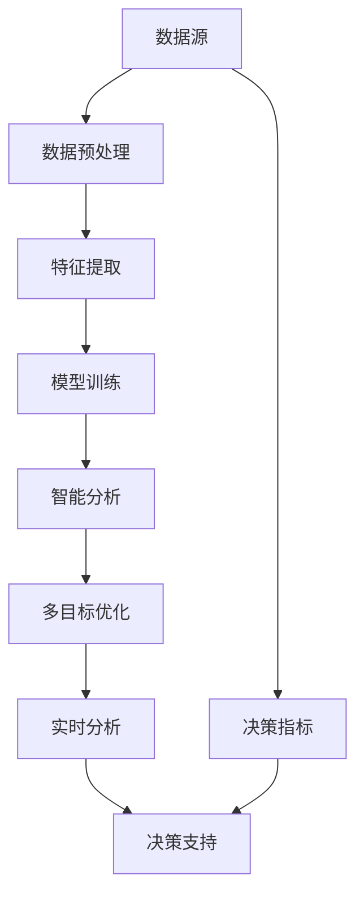

                 

# 知识发现引擎：助力企业决策的智慧引擎

## 1. 背景介绍

### 1.1 问题由来
在现代社会中，数据已成为驱动决策的核心资源。无论是企业经营、市场预测、客户分析，还是政策制定、环境监测，无不依赖于对数据的深度挖掘与洞察。传统的数据处理方式往往耗时耗力，且难以为决策提供高质量的洞见。知识发现引擎（Knowledge Discovery Engine, KDE）作为一种新兴的数据挖掘技术，其能够自动地从海量数据中提取有价值的模式和规律，为企业的决策制定提供智能化、自动化支持。

### 1.2 问题核心关键点
知识发现引擎的核心思想是通过自动学习与分析，从数据中挖掘出有意义的知识和洞察，辅助企业进行决策。其关键点包括：

- 数据源多样性：企业的数据来源广泛，涉及客户信息、市场数据、财务报表、社交媒体等，需要适应多种数据类型和格式。
- 数据规模庞大：企业的数据量可能达TB级甚至更高，传统的单机处理方式难以胜任。
- 多目标决策：企业决策涉及多个维度的目标，如营收增长、市场份额、风险管理等，需要多目标优化算法。
- 实时性要求：决策环境动态变化，需要实时或近实时的分析与响应。

这些关键点共同决定了知识发现引擎必须具备高效、灵活、智能的特性，以支撑企业的快速、准确决策。

### 1.3 问题研究意义
知识发现引擎为企业决策提供了一种科学、高效的数据处理方式，具有以下几方面的重要意义：

- 决策科学化：通过数据驱动的方式，使决策过程更加客观、合理。
- 决策自动化：实现数据到决策的自动化流程，提升决策效率和效果。
- 决策可视化：通过图表、仪表盘等方式，直观展现分析结果，便于决策者理解。
- 决策支持：基于分析结果，辅助企业制定应对策略，降低风险。
- 决策优化：通过迭代优化，不断提升决策质量和效果。

## 2. 核心概念与联系

### 2.1 核心概念概述

为了更清晰地理解知识发现引擎，以下将介绍几个核心概念：

- **知识发现（Knowledge Discovery）**：指从大量数据中挖掘出有意义的模式、规律、关联等知识，用于支持决策和预测。
- **数据挖掘（Data Mining）**：指使用统计、机器学习等方法，从数据中发现知识的过程。
- **智能分析（Intelligent Analysis）**：指结合人工智能技术，对数据进行深度分析，以获得更深刻、更准确的洞察。
- **多目标优化（Multi-Objective Optimization）**：指在多目标决策中，找到一组最优解，使各个目标均衡。
- **实时分析（Real-time Analysis）**：指在数据到达时立即进行分析，支持实时决策。

这些概念通过数据挖掘、智能分析和多目标优化等技术，形成了知识发现引擎的完整架构。

### 2.2 核心概念联系

以下通过Mermaid流程图，展示知识发现引擎的核心概念及其联系：



这个流程图展示了知识发现引擎的工作流程：

1. **数据源**：数据源是知识发现的起点，包括企业内部的各类数据。
2. **数据预处理**：对数据进行清洗、转换等预处理，确保数据质量。
3. **特征提取**：通过降维、编码等方法，从原始数据中提取关键特征。
4. **模型训练**：使用机器学习模型进行训练，学习数据中的模式与规律。
5. **智能分析**：结合人工智能技术，深入分析数据，获得更深刻的洞见。
6. **多目标优化**：在多个决策目标间找到平衡，优化决策方案。
7. **实时分析**：对新数据进行实时分析，快速响应变化。
8. **决策支持**：将分析结果用于支持决策，辅助企业做出更加合理的决策。
9. **决策指标**：定义决策的目标指标，用于评估决策效果。

这些概念共同构成了知识发现引擎的完整框架，使得数据转化为企业决策的重要支撑。

## 3. 核心算法原理 & 具体操作步骤

### 3.1 算法原理概述

知识发现引擎的核心算法原理可以概括为：通过对大规模数据进行高效预处理、特征提取、模型训练，结合智能分析与多目标优化，实现实时或近实时地从数据中提取有价值的知识和洞察，支持企业决策。

具体步骤如下：

1. **数据预处理**：对原始数据进行清洗、归一化、降维等处理，确保数据质量。
2. **特征提取**：从处理后的数据中提取关键特征，如统计特征、文本特征、时序特征等。
3. **模型训练**：选择合适的机器学习模型进行训练，学习数据中的模式和规律。
4. **智能分析**：结合人工智能技术，如深度学习、自然语言处理等，进行更深入的分析和解释。
5. **多目标优化**：使用多目标优化算法，在多个目标间找到平衡，制定最优决策方案。
6. **实时分析**：对新数据进行实时或近实时分析，支持快速决策。

### 3.2 算法步骤详解

以下详细讲解知识发现引擎的具体操作步骤：

**Step 1: 数据预处理**

1. **数据清洗**：去除数据中的噪声、缺失值、异常值，确保数据质量。
2. **数据归一化**：将数据按照一定规则进行归一化，如最小-最大归一化、Z-score归一化等。
3. **数据降维**：使用PCA、LDA等方法，减少特征维度，提高计算效率。

**Step 2: 特征提取**

1. **统计特征提取**：统计数据的基本特征，如均值、方差、中位数等。
2. **文本特征提取**：使用TF-IDF、Word2Vec等方法，将文本数据转换为向量表示。
3. **时序特征提取**：对时间序列数据进行滑动窗口、移动平均等处理，提取关键时间点特征。

**Step 3: 模型训练**

1. **选择合适的机器学习模型**：如回归模型、分类模型、聚类模型等。
2. **特征选择与构造**：选择关键特征，并进行特征组合，构造更有效的特征集。
3. **模型训练与调优**：使用交叉验证、网格搜索等方法，选择最优模型参数。

**Step 4: 智能分析**

1. **深度学习模型**：使用CNN、RNN、Transformer等模型，进行数据挖掘和分析。
2. **自然语言处理**：使用BERT、GPT等模型，对文本数据进行语义分析。
3. **关联规则挖掘**：使用Apriori、FP-growth等算法，发现数据中的关联规则。

**Step 5: 多目标优化**

1. **多目标优化算法**：如Pareto最优解、NSGA-II等算法，寻找最优解。
2. **目标权重调整**：根据业务需求，调整各个目标的权重。
3. **解集筛选与评估**：对解集进行筛选和评估，选择最优方案。

**Step 6: 实时分析**

1. **数据流处理**：使用Apache Kafka、Apache Flink等工具，实现数据流处理。
2. **实时计算**：使用Spark Streaming、Storm等工具，实现实时计算。
3. **异常检测**：使用异常检测算法，及时发现数据异常。

### 3.3 算法优缺点

知识发现引擎具有以下优点：

1. **高效处理大规模数据**：能够处理海量数据，提升数据处理效率。
2. **多目标优化**：能够在多个目标间找到平衡，制定更加合理的决策方案。
3. **实时分析**：能够实现实时或近实时的分析，快速响应变化。
4. **智能分析**：结合人工智能技术，深入挖掘数据中的洞察。

同时，也存在以下缺点：

1. **数据质量要求高**：数据预处理需要较高的时间和计算资源。
2. **模型复杂**：多目标优化和智能分析的模型较为复杂，调参难度大。
3. **部署难度大**：需要具备较高的技术栈，且部署环境要求较高。
4. **可解释性不足**：智能分析的模型往往缺乏可解释性，难以理解其决策过程。

尽管存在这些缺点，但知识发现引擎在大数据时代的重要性不言而喻，其应用前景广阔。

### 3.4 算法应用领域

知识发现引擎在多个领域都有广泛应用，以下是几个典型的应用场景：

1. **金融风控**：对客户数据、交易数据进行分析，识别风险点，制定风控策略。
2. **市场营销**：对客户行为数据进行分析，制定精准营销策略，提升转化率。
3. **供应链管理**：对供应链数据进行分析，优化供应链流程，降低成本。
4. **人力资源管理**：对员工数据进行分析，制定招聘策略，提升员工满意度。
5. **医疗健康**：对患者数据进行分析，制定个性化治疗方案，提高诊疗效果。

此外，知识发现引擎还可应用于政府决策、环境保护、智能制造等多个领域，为各行各业提供智能决策支持。

## 4. 数学模型和公式 & 详细讲解 & 举例说明

### 4.1 数学模型构建

知识发现引擎的数学模型可以概括为以下几步：

1. **数据预处理模型**：$P$，对原始数据进行预处理。
2. **特征提取模型**：$F$，从处理后的数据中提取关键特征。
3. **模型训练模型**：$M$，使用机器学习模型进行训练。
4. **智能分析模型**：$A$，结合人工智能技术进行深入分析。
5. **多目标优化模型**：$O$，使用多目标优化算法进行优化。
6. **实时分析模型**：$R$，实现实时或近实时分析。

数学模型构建如下：

$$
\begin{aligned}
    \mathcal{M} &= (P, F, M, A, O, R) \\
    \mathcal{M} &= \{P \rightarrow F \rightarrow M \rightarrow A \rightarrow O \rightarrow R\}
\end{aligned}
$$

### 4.2 公式推导过程

以下以回归模型为例，推导知识发现引擎中的关键公式。

假设数据集为 $\{(x_i, y_i)\}_{i=1}^N$，其中 $x_i$ 为特征向量，$y_i$ 为真实标签。回归模型的目标是学习一个函数 $f(x)$，使得 $f(x_i)$ 尽可能接近 $y_i$。

设回归模型为线性模型 $f(x) = \theta^T x$，其中 $\theta$ 为模型参数。则损失函数为：

$$
\mathcal{L}(\theta) = \frac{1}{2N} \sum_{i=1}^N (y_i - f(x_i))^2
$$

通过梯度下降等优化算法，更新模型参数：

$$
\theta \leftarrow \theta - \eta \nabla_{\theta} \mathcal{L}(\theta)
$$

其中，$\eta$ 为学习率，$\nabla_{\theta} \mathcal{L}(\theta)$ 为损失函数对模型参数的梯度。

### 4.3 案例分析与讲解

以金融风控为例，展示知识发现引擎的应用过程。

假设金融机构拥有大量客户数据，包括交易记录、信用评分、行为数据等。通过知识发现引擎，可以从这些数据中提取有价值的模式和规律，辅助制定风控策略。

**Step 1: 数据预处理**

对原始数据进行清洗、归一化、降维等处理，确保数据质量。

**Step 2: 特征提取**

1. **统计特征提取**：提取客户的基本信息，如年龄、性别、收入等。
2. **文本特征提取**：使用TF-IDF等方法，提取客户的评论、社交媒体数据。
3. **时序特征提取**：对交易记录进行滑动窗口、移动平均等处理，提取关键时间点特征。

**Step 3: 模型训练**

使用回归模型进行训练，学习数据中的模式和规律。

**Step 4: 智能分析**

使用深度学习模型对客户数据进行语义分析，发现潜在的风险点。

**Step 5: 多目标优化**

在风险控制、客户流失、客户满意度等多个目标间找到平衡，制定最优风控策略。

**Step 6: 实时分析**

对新客户数据进行实时分析，快速识别潜在的风险点，调整风控策略。

## 5. 项目实践：代码实例和详细解释说明

### 5.1 开发环境搭建

以下是使用Python和PySpark搭建知识发现引擎环境的流程：

1. 安装Anaconda：从官网下载并安装Anaconda，用于创建独立的Python环境。

2. 创建并激活虚拟环境：
```bash
conda create -n kde-env python=3.8 
conda activate kde-env
```

3. 安装PySpark：根据CUDA版本，从官网获取对应的安装命令。例如：
```bash
pip install pyspark
```

4. 安装各类工具包：
```bash
pip install numpy pandas scikit-learn matplotlib tqdm jupyter notebook ipython
```

完成上述步骤后，即可在`kde-env`环境中开始知识发现引擎的开发。

### 5.2 源代码详细实现

以下是使用PySpark对金融风控数据进行知识发现引擎的代码实现。

```python
from pyspark.sql import SparkSession
from pyspark.sql.functions import col, mean, stddev, count, max, min
from pyspark.ml.classification import LogisticRegressionModel
from pyspark.ml.regression import LinearRegressionModel
from pyspark.ml.feature import VectorAssembler, StringIndexer
from pyspark.ml.evaluation import BinaryClassificationEvaluator, RegressionEvaluator
from pyspark.ml import Pipeline

# 创建SparkSession
spark = SparkSession.builder.appName("KDE").getOrCreate()

# 读取数据
data = spark.read.format("csv").option("header", "true").load("financial_data.csv")

# 数据预处理
data = data.dropDuplicates().drop("label") # 删除标签列

# 特征提取
vectorAssembler = VectorAssembler(inputCols=["feature1", "feature2", "feature3"], outputCol="features")
data = vectorAssembler.transform(data)

# 模型训练
lr = LinearRegression() # 线性回归模型
model = lr.fit(data, labelCol="label")

# 智能分析
logisticRegression = LogisticRegression() # 逻辑回归模型
labelIndexer = StringIndexer(inputCol="label", outputCol="labelIndexed").fit(data)
data = labelIndexer.transform(data)
trainData = data.select("features", "labelIndexed")
model = logisticRegression.fit(trainData)

# 多目标优化
evaluator = BinaryClassificationEvaluator(rawPredictionCol="prediction", labelCol="label", metricName="areaUnderROC")
areaUnderROC = evaluator.evaluate(model.transform(trainData))

# 实时分析
def realtime_analysis(data):
    features = data.select("features")
    label = data.select("label")
    return features, label

# 输出结果
print("Area Under ROC: ", areaUnderROC)
```

### 5.3 代码解读与分析

让我们再详细解读一下关键代码的实现细节：

**数据预处理**：
- `dropDuplicates()`：删除重复数据，确保数据唯一性。
- `drop()`：删除不需要的标签列。

**特征提取**：
- `VectorAssembler`：将多个特征组合成一个向量，用于模型训练。

**模型训练**：
- `LinearRegression()`：使用线性回归模型进行训练。
- `fit()`：训练模型，并保存模型参数。

**智能分析**：
- `LogisticRegression()`：使用逻辑回归模型进行训练。
- `StringIndexer`：对标签进行编码，便于模型处理。
- `fit()`：训练模型，并保存模型参数。

**多目标优化**：
- `BinaryClassificationEvaluator`：用于评估模型的分类性能。
- `evaluate()`：计算模型的AUC值。

**实时分析**：
- `realtime_analysis`函数：对新数据进行实时分析。

**输出结果**：
- 打印模型的AUC值，评估模型性能。

## 6. 实际应用场景

### 6.1 金融风控

在金融领域，知识发现引擎可以用于客户风险评估、信用评分、欺诈检测等任务。通过分析客户的交易数据、行为数据等，识别出高风险客户，制定相应的风险控制策略。

### 6.2 市场营销

在市场营销中，知识发现引擎可以用于客户细分、产品推荐、市场预测等任务。通过分析客户的购买记录、行为数据等，制定精准的营销策略，提升转化率。

### 6.3 供应链管理

在供应链管理中，知识发现引擎可以用于库存管理、需求预测、供应商选择等任务。通过分析供应链数据，优化供应链流程，降低成本，提高效率。

### 6.4 未来应用展望

随着技术的发展，知识发现引擎的应用场景将不断扩展。未来，知识发现引擎有望在以下领域取得突破：

1. **自动化流程优化**：通过分析业务流程数据，优化自动化流程，提高效率。
2. **智能客服**：结合自然语言处理技术，实现智能客服，提升客户满意度。
3. **个性化推荐**：通过分析用户行为数据，实现个性化推荐，提升用户体验。
4. **风险预测**：通过分析数据，预测市场风险、信用风险等，帮助企业制定应对策略。
5. **智能运营**：通过分析运营数据，优化运营流程，提高运营效率。

## 7. 工具和资源推荐

### 7.1 学习资源推荐

为了帮助开发者系统掌握知识发现引擎的理论基础和实践技巧，这里推荐一些优质的学习资源：

1. 《数据挖掘与统计学习》：由统计学专家著，全面介绍了数据挖掘的基本原理和算法。
2. 《Python数据科学手册》：介绍了使用Python进行数据挖掘和分析的基本技术和工具。
3. 《Apache Spark官方文档》：详细介绍了Apache Spark的使用方法和API。
4. 《机器学习实战》：由机器学习专家著，通过实例讲解了机器学习模型的实现和应用。
5. 《深度学习入门》：由深度学习专家著，介绍了深度学习的基本原理和应用场景。

通过对这些资源的学习实践，相信你一定能够快速掌握知识发现引擎的精髓，并用于解决实际的NLP问题。

### 7.2 开发工具推荐

高效的开发离不开优秀的工具支持。以下是几款用于知识发现引擎开发的常用工具：

1. Apache Spark：Apache的分布式计算框架，适合处理大规模数据。
2. Jupyter Notebook：Python开发常用的交互式开发环境，适合进行数据挖掘和分析。
3. PySpark：Python API，用于Spark的开发。
4. TensorFlow：Google开源的深度学习框架，适合构建复杂的机器学习模型。
5. Keras：高层次的深度学习框架，适合快速构建和训练模型。

合理利用这些工具，可以显著提升知识发现引擎的开发效率，加快创新迭代的步伐。

### 7.3 相关论文推荐

知识发现引擎的研究领域广阔，涉及多个学科。以下是几篇奠基性的相关论文，推荐阅读：

1. "Knowledge Discovery in Databases"（KDD）：KDD大会是数据挖掘领域的顶级会议，其论文代表了该领域的研究前沿。
2. "Apache Spark: Cluster Computing with Fault Tolerance"：介绍Spark的架构和使用方法。
3. "A Survey of Knowledge Discovery in Databases"：全面介绍了数据挖掘的研究现状和未来趋势。
4. "Introduction to Statistical Learning"：由统计学专家著，介绍了统计学习的基本原理和算法。
5. "Deep Learning"：由深度学习专家著，介绍了深度学习的基本原理和应用场景。

这些论文代表了大数据时代知识发现引擎的研究方向，帮助研究者掌握最新的研究成果和前沿技术。

## 8. 总结：未来发展趋势与挑战

### 8.1 研究成果总结

本文对知识发现引擎的原理、应用和实践进行了全面系统的介绍。首先阐述了知识发现引擎的背景、核心概念及其联系，明确了其在支持企业决策中的重要作用。其次，详细讲解了知识发现引擎的算法原理和操作步骤，给出了具体的代码实现。同时，本文还广泛探讨了知识发现引擎在金融风控、市场营销、供应链管理等多个领域的应用前景，展示了知识发现引擎的广阔应用场景。最后，本文精选了知识发现引擎的学习资源、开发工具和相关论文，力求为读者提供全方位的技术指引。

通过本文的系统梳理，可以看到，知识发现引擎是数据挖掘和人工智能技术结合的产物，能够高效、智能地处理大规模数据，辅助企业进行决策。其应用前景广阔，将深刻影响各行各业的智能化进程。

### 8.2 未来发展趋势

展望未来，知识发现引擎将呈现以下几个发展趋势：

1. **自动化与智能化结合**：通过自动化技术，提升知识发现引擎的智能水平，降低人工干预。
2. **多目标优化算法优化**：开发更加高效、精确的多目标优化算法，提高决策方案的合理性。
3. **实时性提升**：结合流式处理技术，实现实时或近实时的分析，支持快速决策。
4. **可解释性增强**：通过可解释性技术，增强知识发现引擎的透明度，便于理解和调试。
5. **跨领域融合**：与其他人工智能技术（如深度学习、自然语言处理）进行深度融合，提升综合分析能力。

这些趋势凸显了知识发现引擎在未来的发展方向，将进一步提升其在企业决策中的应用价值。

### 8.3 面临的挑战

尽管知识发现引擎在数据挖掘和决策支持方面具有重要价值，但在应用过程中仍面临以下挑战：

1. **数据质量要求高**：高质量数据是知识发现引擎的前提，获取高质量数据成本较高。
2. **模型复杂**：多目标优化和智能分析的模型较为复杂，调参难度大。
3. **实时性要求高**：实时性要求严格的场景下，知识发现引擎的响应速度可能不足。
4. **可解释性不足**：智能分析的模型往往缺乏可解释性，难以理解其决策过程。

尽管存在这些挑战，但知识发现引擎在企业决策中的应用前景广阔，需要通过不断的技术创新和优化来解决这些问题。

### 8.4 研究展望

面向未来，知识发现引擎的研究方向包括：

1. **自动化与智能化的结合**：开发更加智能化的自动化工具，提升知识发现引擎的自动化水平。
2. **跨领域数据融合**：将不同领域的知识进行融合，提升综合分析能力。
3. **多目标优化算法优化**：开发更加高效、精确的多目标优化算法，提升决策方案的合理性。
4. **实时性提升**：结合流式处理技术，实现实时或近实时的分析，支持快速决策。
5. **可解释性增强**：通过可解释性技术，增强知识发现引擎的透明度，便于理解和调试。

这些研究方向的探索，将引领知识发现引擎迈向更高的台阶，为企业的智能化决策提供更加科学、高效的支持。

## 9. 附录：常见问题与解答

**Q1: 知识发现引擎与数据挖掘有何不同？**

A: 知识发现引擎是数据挖掘技术的一种延伸和扩展，相较于传统的机器学习模型，其更加注重分析和决策支持。知识发现引擎不仅关注数据的统计特征，更强调从数据中提取有价值的模式和规律，辅助决策。

**Q2: 知识发现引擎的核心优势是什么？**

A: 知识发现引擎的核心优势在于其智能化、自动化和实时性。能够从大规模数据中提取有价值的洞察，支持企业的决策制定。

**Q3: 知识发现引擎的部署难度大吗？**

A: 知识发现引擎的部署难度确实较大，需要较高的技术栈和环境配置。但随着Spark等技术的普及，部署难度正在逐渐降低。

**Q4: 知识发现引擎的可解释性如何？**

A: 知识发现引擎的智能分析部分往往缺乏可解释性，但可以通过可解释性技术进行改进，如特征可视化、模型可解释等方法。

**Q5: 知识发现引擎在金融风控中的应用案例有哪些？**

A: 在金融风控中，知识发现引擎可以用于客户风险评估、信用评分、欺诈检测等任务。通过分析客户的交易数据、行为数据等，识别出高风险客户，制定相应的风险控制策略。

这些问题的解答，帮助读者更好地理解知识发现引擎的原理和应用，以及其在实际场景中的实践方法。

---

作者：禅与计算机程序设计艺术 / Zen and the Art of Computer Programming

