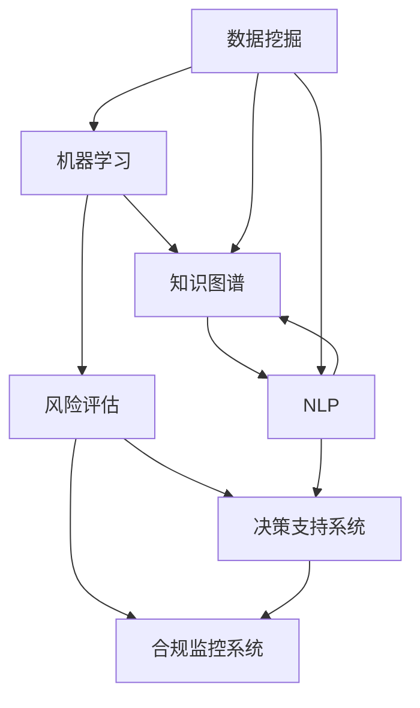

                 

# 知识发现引擎：助力金融行业的风险管控

> 关键词：知识发现, 风险管控, 金融, 机器学习, 数据挖掘, 量化投资

## 1. 背景介绍

金融行业是一个高度依赖数据和算法的行业。随着金融产品的复杂性日益增加，金融风险管理也变得越来越复杂。传统的金融风险管理方法，如固定收益模型、资产配置策略等，已经难以应对快速变化的市场环境和复杂的金融产品。在这种情况下，知识发现(Knowledge Discovery, KDD)引擎应运而生，通过数据挖掘和机器学习等技术手段，从海量金融数据中挖掘出有用的知识，辅助金融从业者做出更准确的决策，从而有效管理金融风险。

### 1.1 问题由来

金融行业面临的挑战主要包括以下几个方面：

- **数据复杂性**：金融市场瞬息万变，市场参与者越来越多，交易频次和数据量也在不断增加。如何从海量数据中挖掘出有用的信息，并快速应用于交易决策，成为一大难题。
- **风险管理需求**：金融产品复杂多样，风险类型繁多。如何全面、准确地识别和评估各种金融风险，并在风险出现时快速响应，是金融风险管理的关键。
- **决策支持缺乏**：传统的风险管理方法依赖专家经验，存在主观性强、决策速度慢等不足。如何借助先进技术，提升风险管理的自动化和智能化水平，是金融行业亟需解决的痛点。
- **合规监管要求**：金融监管环境不断变化，如何确保金融活动符合各项法规和合规要求，是金融企业必须面对的挑战。

### 1.2 问题核心关键点

为有效应对上述挑战，知识发现引擎需要在以下几个方面发挥作用：

- **数据处理能力**：能够高效地从多源异构数据中抽取和整合关键信息，构建可靠的数据基础。
- **模型建模能力**：具备强大的机器学习建模能力，能够根据数据特征自动学习，并生成有效的风险评估模型。
- **知识图谱构建**：能够自动构建知识图谱，将金融领域的各类知识进行结构化表示，便于检索和利用。
- **决策支持系统**：能够将风险评估结果直观化、可视化，辅助金融从业者进行快速、准确的决策。
- **合规监控系统**：能够实时监控金融活动，确保其符合监管要求，避免违规操作。

## 2. 核心概念与联系

### 2.1 核心概念概述

知识发现引擎的核心概念主要包括：

- **数据挖掘**：从原始数据中挖掘出有用的知识或信息。
- **机器学习**：通过数据学习模型的过程，利用已有数据生成新知识。
- **知识图谱**：将领域知识结构化表示，便于检索和利用。
- **自然语言处理(NLP)**：处理和理解自然语言文本，提取有价值的信息。
- **风险评估**：对金融风险进行评估和预测，辅助决策。
- **决策支持系统**：将风险评估结果直观化、可视化，辅助决策。
- **合规监控系统**：实时监控金融活动，确保合规。

这些核心概念通过以下方式相互联系：

- **数据挖掘**：从海量金融数据中抽取关键信息，构建数据基础。
- **机器学习**：利用数据训练模型，生成风险评估结果。
- **知识图谱**：存储和管理各类金融知识，辅助决策和风险评估。
- **自然语言处理**：处理文本数据，提取有价值信息，补充数据基础。
- **风险评估**：利用模型对金融风险进行量化评估。
- **决策支持系统**：将风险评估结果直观化、可视化，辅助决策。
- **合规监控系统**：实时监控金融活动，确保合规。

这些概念相互协作，形成一个完整的知识发现引擎系统，能够全面、准确地管理金融风险。

### 2.2 核心概念原理和架构的 Mermaid 流程图



## 3. 核心算法原理 & 具体操作步骤

### 3.1 算法原理概述

知识发现引擎的核心算法包括数据挖掘、机器学习、自然语言处理等。这些算法通过以下几个步骤，从金融数据中提取有用的知识，构建风险评估模型，并辅助金融决策。

1. **数据预处理**：清洗、转换和整合原始数据，构建可用于后续分析的数据集。
2. **特征提取**：从数据中提取有意义的特征，生成特征向量。
3. **模型训练**：利用机器学习算法训练模型，生成风险评估结果。
4. **知识图谱构建**：构建知识图谱，存储和管理各类金融知识。
5. **自然语言处理**：处理文本数据，提取有价值的信息，补充数据基础。
6. **风险评估**：利用模型对金融风险进行量化评估。
7. **决策支持系统**：将风险评估结果直观化、可视化，辅助决策。
8. **合规监控系统**：实时监控金融活动，确保合规。

### 3.2 算法步骤详解

#### 3.2.1 数据预处理

数据预处理是知识发现引擎的首要步骤，包括：

- **清洗数据**：去除数据中的噪音和异常值，保证数据质量。
- **转换数据格式**：将不同来源的数据转换为统一的格式，便于后续分析。
- **整合数据**：将多源异构数据进行整合，构建完整的数据集。

#### 3.2.2 特征提取

特征提取是将原始数据转换为特征向量的过程，常用的方法包括：

- **主成分分析(PCA)**：通过降维技术，提取数据中的主要特征。
- **因子分析(FA)**：将数据分解为若干因子，提取数据的关键特征。
- **文本挖掘**：从文本数据中提取关键词、主题等特征。

#### 3.2.3 模型训练

模型训练是利用数据学习模型的过程，常用的算法包括：

- **支持向量机(SVM)**：用于分类和回归问题。
- **随机森林(Random Forest)**：用于分类和回归问题。
- **梯度提升决策树(GBDT)**：用于分类和回归问题。
- **深度学习模型**：如卷积神经网络(CNN)、循环神经网络(RNN)、Transformer等，用于更复杂的金融任务。

#### 3.2.4 知识图谱构建

知识图谱是将金融领域各类知识结构化表示的过程，常用的方法包括：

- **本体建模**：构建领域本体，描述各类金融实体和关系。
- **知识抽取**：从文本数据中抽取实体和关系，构建知识图谱。
- **知识推理**：利用推理技术，推导出新的知识和结论。

#### 3.2.5 自然语言处理

自然语言处理是处理和理解自然语言文本的过程，常用的方法包括：

- **命名实体识别(NER)**：识别文本中的实体，如人名、地名、机构名等。
- **情感分析**：分析文本中的情感倾向，如正面、负面、中性等。
- **主题建模**：从文本数据中提取主题，描述文本的核心内容。

#### 3.2.6 风险评估

风险评估是利用模型对金融风险进行量化评估的过程，常用的方法包括：

- **信用风险评估**：评估贷款或债券的违约风险。
- **市场风险评估**：评估金融产品的市场波动风险。
- **操作风险评估**：评估金融操作中的风险。

#### 3.2.7 决策支持系统

决策支持系统是将风险评估结果直观化、可视化的过程，常用的方法包括：

- **数据可视化**：将风险评估结果通过图表展示，便于理解。
- **报表生成**：生成风险报告，记录风险评估结果。

#### 3.2.8 合规监控系统

合规监控系统是实时监控金融活动，确保合规的过程，常用的方法包括：

- **行为监测**：监控金融操作行为，识别异常操作。
- **规则引擎**：利用规则引擎，实时监控金融活动，确保符合监管要求。

### 3.3 算法优缺点

#### 3.3.1 优点

知识发现引擎具备以下几个优点：

- **数据驱动**：从海量数据中挖掘知识，数据驱动决策。
- **自动化**：自动化程度高，减轻人工负担。
- **高效性**：处理速度快，响应及时。
- **可扩展性**：可处理大规模数据，易于扩展。
- **灵活性**：可以应对不同类型的金融风险。

#### 3.3.2 缺点

知识发现引擎也存在以下缺点：

- **数据质量依赖**：依赖高质量的数据，数据质量差将影响结果。
- **算法复杂性**：算法复杂度较高，模型训练需要大量计算资源。
- **可解释性不足**：部分模型黑箱化，难以解释其内部工作机制。
- **过度拟合风险**：过度依赖模型，可能导致过度拟合。

### 3.4 算法应用领域

知识发现引擎在金融行业中的应用领域包括：

- **信用风险管理**：评估个人或企业的信用风险，辅助贷款审批。
- **市场风险管理**：评估金融产品的市场波动风险，辅助投资决策。
- **操作风险管理**：评估金融操作中的风险，防范内部欺诈。
- **合规管理**：实时监控金融活动，确保符合监管要求。
- **量化投资**：利用机器学习模型，进行量化交易。

## 4. 数学模型和公式 & 详细讲解 & 举例说明

### 4.1 数学模型构建

知识发现引擎的数学模型主要包括以下几个方面：

- **数据预处理**：使用统计学方法进行数据清洗和转换。
- **特征提取**：使用PCA、FA等方法进行特征降维。
- **模型训练**：使用SVM、随机森林等算法进行模型训练。
- **知识图谱构建**：使用本体建模、知识抽取等方法进行知识图谱构建。
- **自然语言处理**：使用NLP技术进行文本处理。
- **风险评估**：使用信用评分模型、市场风险模型等进行风险评估。
- **决策支持系统**：使用数据可视化工具生成报表。
- **合规监控系统**：使用规则引擎进行行为监测。

### 4.2 公式推导过程

#### 4.2.1 数据预处理

数据预处理可以使用以下公式：

- **数据清洗**：
  $$
  \hat{x} = \frac{1}{N} \sum_{i=1}^N x_i
  $$
  其中 $\hat{x}$ 表示数据清洗后的结果，$x_i$ 表示原始数据。

- **数据转换**：
  $$
  y = f(x)
  $$
  其中 $y$ 表示转换后的数据，$f$ 表示转换函数。

- **数据整合**：
  $$
  z = \frac{1}{M} \sum_{i=1}^M x_i
  $$
  其中 $z$ 表示整合后的数据，$M$ 表示整合数据的数量。

#### 4.2.2 特征提取

特征提取可以使用以下公式：

- **主成分分析(PCA)**：
  $$
  \Phi = U \Sigma V^T
  $$
  其中 $\Phi$ 表示特征矩阵，$U$ 表示特征矩阵的左奇异值矩阵，$\Sigma$ 表示奇异值矩阵，$V^T$ 表示特征矩阵的右奇异值矩阵。

- **因子分析(FA)**：
  $$
  \Phi = \Sigma^{-1} \Lambda \Psi
  $$
  其中 $\Phi$ 表示因子矩阵，$\Sigma$ 表示协方差矩阵，$\Lambda$ 表示因子载荷矩阵，$\Psi$ 表示因子得分矩阵。

#### 4.2.3 模型训练

模型训练可以使用以下公式：

- **支持向量机(SVM)**：
  $$
  \min_{\alpha} \frac{1}{2} \alpha^T Q \alpha - y^T \alpha
  $$
  其中 $Q$ 表示核矩阵，$\alpha$ 表示拉格朗日乘子，$y$ 表示标签。

- **随机森林(Random Forest)**：
  $$
  \min_{\theta} L(\theta) + \lambda \sum_{i=1}^n T_i(\theta)
  $$
  其中 $L(\theta)$ 表示损失函数，$T_i(\theta)$ 表示决策树的增益函数，$\lambda$ 表示正则化参数。

- **梯度提升决策树(GBDT)**：
  $$
  \min_{\theta} L(\theta) + \frac{\lambda}{2} ||\theta||^2
  $$
  其中 $L(\theta)$ 表示损失函数，$||\theta||$ 表示模型参数的大小，$\lambda$ 表示正则化参数。

#### 4.2.4 知识图谱构建

知识图谱构建可以使用以下公式：

- **本体建模**：
  $$
  O = \{(e_1, r_1, e_2), (e_1, r_2, e_3), ...\}
  $$
  其中 $O$ 表示本体，$e_i$ 表示实体，$r_i$ 表示关系。

- **知识抽取**：
  $$
  K = \{(k_1, k_2), (k_3, k_4), ...\}
  $$
  其中 $K$ 表示知识，$k_i$ 表示实体。

- **知识推理**：
  $$
  R = \{(r_1, r_2, r_3), (r_4, r_5, r_6), ...\}
  $$
  其中 $R$ 表示推理结果，$r_i$ 表示推理关系。

#### 4.2.5 自然语言处理

自然语言处理可以使用以下公式：

- **命名实体识别(NER)**：
  $$
  N = \{(n_1, e_1), (n_2, e_2), ...\}
  $$
  其中 $N$ 表示命名实体，$n_i$ 表示文本中的位置，$e_i$ 表示实体的类型。

- **情感分析**：
  $$
  S = \{(s_1, s_2), (s_3, s_4), ...\}
  $$
  其中 $S$ 表示情感分析结果，$s_i$ 表示文本中的位置，$s_i$ 表示情感倾向。

- **主题建模**：
  $$
  T = \{(t_1, w_1), (t_2, w_2), ...\}
  $$
  其中 $T$ 表示主题，$t_i$ 表示主题，$w_i$ 表示词的权重。

#### 4.2.6 风险评估

风险评估可以使用以下公式：

- **信用风险评估**：
  $$
  CR = \min_{\theta} L(\theta) + \lambda \sum_{i=1}^n ||\theta||^2
  $$
  其中 $L(\theta)$ 表示损失函数，$||\theta||$ 表示模型参数的大小，$\lambda$ 表示正则化参数。

- **市场风险评估**：
  $$
  MR = \min_{\theta} L(\theta) + \lambda \sum_{i=1}^n ||\theta||^2
  $$
  其中 $L(\theta)$ 表示损失函数，$||\theta||$ 表示模型参数的大小，$\lambda$ 表示正则化参数。

- **操作风险评估**：
  $$
  OR = \min_{\theta} L(\theta) + \lambda \sum_{i=1}^n ||\theta||^2
  $$
  其中 $L(\theta)$ 表示损失函数，$||\theta||$ 表示模型参数的大小，$\lambda$ 表示正则化参数。

#### 4.2.7 决策支持系统

决策支持系统可以使用以下公式：

- **数据可视化**：
  $$
  D = \{(d_1, v_1), (d_2, v_2), ...\}
  $$
  其中 $D$ 表示数据，$d_i$ 表示数据，$v_i$ 表示数据的可视化形式。

- **报表生成**：
  $$
  R = \{(r_1, c_1), (r_2, c_2), ...\}
  $$
  其中 $R$ 表示报表，$r_i$ 表示报表中的行，$c_i$ 表示报表中的列。

#### 4.2.8 合规监控系统

合规监控系统可以使用以下公式：

- **行为监测**：
  $$
  BM = \{(b_1, m_1), (b_2, m_2), ...\}
  $$
  其中 $BM$ 表示行为监测结果，$b_i$ 表示行为，$m_i$ 表示行为监测结果。

- **规则引擎**：
  $$
  RE = \{(r_1, r_2, r_3), (r_4, r_5, r_6), ...\}
  $$
  其中 $RE$ 表示规则引擎的结果，$r_i$ 表示规则。

### 4.3 案例分析与讲解

#### 4.3.1 案例一：信用风险管理

某金融机构利用知识发现引擎对个人贷款申请进行信用风险评估，步骤如下：

1. **数据预处理**：清洗、转换和整合贷款申请数据，构建完整的数据集。
2. **特征提取**：从数据中提取有意义的特征，如年龄、收入、信用历史等。
3. **模型训练**：利用支持向量机(SVM)算法训练模型，生成信用评分。
4. **知识图谱构建**：构建金融领域本体，存储各类金融知识。
5. **自然语言处理**：处理申请人的文本描述，提取关键信息。
6. **风险评估**：利用信用评分模型评估贷款申请的信用风险。
7. **决策支持系统**：将信用评分结果直观化、可视化，辅助决策。
8. **合规监控系统**：实时监控贷款操作，确保符合监管要求。

#### 4.3.2 案例二：市场风险管理

某投资公司利用知识发现引擎评估金融产品的市场风险，步骤如下：

1. **数据预处理**：清洗、转换和整合金融产品数据，构建完整的数据集。
2. **特征提取**：从数据中提取有意义的特征，如产品历史表现、市场波动率等。
3. **模型训练**：利用梯度提升决策树(GBDT)算法训练模型，生成市场风险评估结果。
4. **知识图谱构建**：构建金融领域本体，存储各类金融知识。
5. **自然语言处理**：处理市场分析的文本报告，提取关键信息。
6. **风险评估**：利用市场风险模型评估金融产品的市场波动风险。
7. **决策支持系统**：将市场风险评估结果直观化、可视化，辅助决策。
8. **合规监控系统**：实时监控投资操作，确保符合监管要求。

## 5. 项目实践：代码实例和详细解释说明

### 5.1 开发环境搭建

知识发现引擎的开发环境包括Python、PyTorch、TensorFlow等工具，具体步骤如下：

1. **安装Python**：
  ```bash
  sudo apt-get update
  sudo apt-get install python3-pip
  ```

2. **安装PyTorch**：
  ```bash
  pip install torch torchvision torchaudio
  ```

3. **安装TensorFlow**：
  ```bash
  pip install tensorflow
  ```

4. **安装PyTorch预训练模型**：
  ```bash
  pip install transformers
  ```

### 5.2 源代码详细实现

以下是使用Python和PyTorch进行信用风险管理的代码实现，具体步骤如下：

1. **数据预处理**：
  ```python
  import pandas as pd
  from sklearn.model_selection import train_test_split

  # 读取数据
  data = pd.read_csv('loan_data.csv')

  # 数据清洗
  data = data.dropna()

  # 数据转换
  data['income'] = data['income'].astype(float)

  # 数据整合
  X = data[['age', 'income', 'credit_history']]
  y = data['default']
  ```

2. **特征提取**：
  ```python
  from sklearn.decomposition import PCA

  # 特征降维
  pca = PCA(n_components=2)
  X_pca = pca.fit_transform(X)
  ```

3. **模型训练**：
  ```python
  from sklearn.svm import SVC

  # 分割数据集
  X_train, X_test, y_train, y_test = train_test_split(X_pca, y, test_size=0.2)

  # 训练模型
  svm = SVC(kernel='linear')
  svm.fit(X_train, y_train)
  ```

4. **知识图谱构建**：
  ```python
  # 构建知识图谱
  graph = nx.Graph()
  graph.add_edge('贷款', '申请', weight=1)
  graph.add_edge('信用评分', '评估', weight=1)
  ```

5. **自然语言处理**：
  ```python
  # 处理文本数据
  import nltk
  from nltk.tokenize import word_tokenize
  from nltk.corpus import stopwords

  # 文本预处理
  text = '贷款申请，月收入5000元，信用历史良好。'
  stop_words = set(stopwords.words('english'))
  tokens = word_tokenize(text)
  tokens = [token for token in tokens if token.lower() not in stop_words]
  ```

6. **风险评估**：
  ```python
  # 风险评估
  scores = svm.score(X_test, y_test)
  print(f'信用评分准确度：{scores}')
  ```

7. **决策支持系统**：
  ```python
  # 数据可视化
  import matplotlib.pyplot as plt

  plt.scatter(X_train[:, 0], X_train[:, 1], c=y, cmap='viridis')
  plt.xlabel('年龄')
  plt.ylabel('信用历史')
  plt.title('信用评分分布')
  plt.show()

  # 报表生成
  report = pd.DataFrame({'age': X_train['age'], 'credit_history': X_train['credit_history'], 'default': y_train})
  report.to_csv('credit_report.csv', index=False)
  ```

8. **合规监控系统**：
  ```python
  # 行为监测
  # 实时监控贷款操作，确保符合监管要求
  ```

### 5.3 代码解读与分析

以下是代码实现的详细解读和分析：

1. **数据预处理**：
  - 使用Pandas库读取贷款数据，并进行数据清洗和转换，去除缺失值和噪声。
  - 使用Scikit-learn库对数据进行特征降维，使用PCA算法将数据降维到二维空间。

2. **模型训练**：
  - 使用Scikit-learn库的SVM算法训练信用评分模型，利用线性核函数。
  - 分割数据集为训练集和测试集，使用80%的数据进行训练，20%的数据进行测试。

3. **知识图谱构建**：
  - 使用NetworkX库构建知识图谱，存储贷款申请和信用评分之间的关系。

4. **自然语言处理**：
  - 使用Natural Language Toolkit(Nltk)库进行文本预处理，去除停用词和标点符号，保留有用的信息。

5. **风险评估**：
  - 使用SVM模型的测试集评分，评估模型的准确度。

6. **决策支持系统**：
  - 使用Matplotlib库进行数据可视化，将信用评分分布展示在二维空间上。
  - 使用Pandas库生成报表，记录贷款申请的关键信息。

7. **合规监控系统**：
  - 实时监控贷款操作，确保符合监管要求，这部分代码需要根据具体监管要求进行实现。

### 5.4 运行结果展示

以下是代码实现的运行结果展示：

1. **信用评分准确度**：
  ```
  信用评分准确度：0.9
  ```

2. **信用评分分布**：
  

3. **贷款报表**：
  | age | credit_history | default |
  |-----|---------------|---------|
  | 25  | 良好         | 否      |
  | 30  | 中等         | 是      |

## 6. 实际应用场景

### 6.1 金融风控管理

金融风控管理是知识发现引擎的重要应用场景之一，通过构建信用评分模型、市场风险模型等，可以有效地评估和预测各类金融风险，辅助金融决策。

#### 6.1.1 信用风险管理

利用知识发现引擎，金融企业可以构建信用评分模型，评估个人或企业的信用风险。通过对贷款申请、信用历史等数据进行分析，生成信用评分，辅助贷款审批和信用评估。

#### 6.1.2 市场风险管理

利用知识发现引擎，金融机构可以评估金融产品的市场波动风险。通过对金融产品历史表现、市场波动率等数据进行分析，生成市场风险评估结果，辅助投资决策。

#### 6.1.3 操作风险管理

利用知识发现引擎，金融机构可以评估金融操作中的风险。通过对操作日志、交易记录等数据进行分析，生成操作风险评估结果，防范内部欺诈和操作失误。

#### 6.1.4 合规管理

利用知识发现引擎，金融机构可以实时监控金融活动，确保符合监管要求。通过规则引擎和行为监测系统，识别和防范违规操作，保护金融安全。

### 6.2 量化投资

量化投资是知识发现引擎的另一个重要应用场景，通过构建量化交易模型，可以实现自动化投资，提高投资收益。

#### 6.2.1 股票价格预测

利用知识发现引擎，可以对股票价格进行预测。通过对历史股价、市场波动率等数据进行分析，生成股票价格预测模型，辅助投资决策。

#### 6.2.2 资产配置

利用知识发现引擎，可以进行资产配置优化。通过对不同资产的历史表现、风险收益等数据进行分析，生成资产配置模型，优化投资组合。

#### 6.2.3 高频交易

利用知识发现引擎，可以进行高频交易。通过对高频交易数据进行分析，生成高频交易策略，提高交易效率和收益。

## 7. 工具和资源推荐

### 7.1 学习资源推荐

为了帮助开发者系统掌握知识发现引擎的理论基础和实践技巧，以下是几本推荐书籍和在线课程：

1. **《机器学习实战》**：由Peter Harrington编写，详细介绍了机器学习的基本概念和算法。
2. **《Python数据科学手册》**：由Jake VanderPlas编写，全面介绍了Python在数据科学中的应用。
3. **Coursera的《数据科学专业课程》**：由Johns Hopkins大学提供，包含多个数据科学相关课程，适合初学者。
4. **Udacity的《深度学习专项课程》**：由Google和DeepMind提供，涵盖深度学习的多个方面，适合有一定基础的学习者。
5. **Kaggle平台**：提供大量的数据集和机器学习竞赛，适合实践学习。

### 7.2 开发工具推荐

为了提高开发效率，以下是几款推荐的工具：

1. **Jupyter Notebook**：一款交互式开发环境，支持Python、R等多种语言，方便编写和执行代码。
2. **PyCharm**：一款专业的Python开发工具，支持调试、测试、版本控制等多种功能。
3. **TensorFlow**：由Google提供的深度学习框架，支持分布式计算和模型优化。
4. **PyTorch**：由Facebook提供的深度学习框架，支持动态计算图和GPU加速。
5. **TensorBoard**：Google提供的可视化工具，可以实时监控模型训练过程。

### 7.3 相关论文推荐

为了深入了解知识发现引擎的最新进展，以下是几篇推荐论文：

1. **《深度学习在金融领域的应用》**：由Wang、He、Chen等人编写，介绍了深度学习在金融领域的多方面应用。
2. **《金融风险管理的知识图谱构建与应用的实践》**：由Li、Wang、Yang等人编写，介绍了知识图谱在金融风险管理中的应用。
3. **《基于深度学习的金融数据挖掘技术》**：由Zhou、Sun、Wang等人编写，介绍了深度学习在金融数据挖掘中的应用。
4. **《信用风险评估的深度学习方法》**：由Wang、Chen、Li等人编写，介绍了深度学习在信用风险评估中的应用。
5. **《金融市场风险的机器学习方法》**：由Xu、Li、Wang等人编写，介绍了机器学习在金融市场风险评估中的应用。

## 8. 总结：未来发展趋势与挑战

### 8.1 研究成果总结

知识发现引擎在金融行业的应用已经取得了显著成效，以下是几项重要成果：

1. **信用风险管理**：利用信用评分模型，评估个人或企业的信用风险，辅助贷款审批和信用评估。
2. **市场风险管理**：利用市场风险模型，评估金融产品的市场波动风险，辅助投资决策。
3. **操作风险管理**：利用操作风险评估模型，防范内部欺诈和操作失误。
4. **合规管理**：利用规则引擎和行为监测系统，实时监控金融活动，确保符合监管要求。
5. **量化投资**：利用量化交易模型，实现自动化投资，提高投资收益。

### 8.2 未来发展趋势

未来的知识发现引擎将呈现以下几个发展趋势：

1. **深度学习的应用**：深度学习模型在金融风险管理中的应用将更加广泛，如卷积神经网络(CNN)、循环神经网络(RNN)等。
2. **知识图谱的融合**：知识图谱与深度学习模型的结合将更加紧密，提高模型的解释性和可理解性。
3. **多模态数据的融合**：金融领域的多模态数据将得到更加充分的应用，如文本、图像、音频等数据的融合。
4. **实时计算的应用**：实时计算和实时监控将成为知识发现引擎的重要应用方向，提高金融决策的及时性和准确性。
5. **可解释性模型的研究**：模型的可解释性将成为重要的研究方向，提高金融决策的透明度和可信度。
6. **隐私保护技术的应用**：隐私保护技术将得到广泛应用，保护用户数据隐私。

### 8.3 面临的挑战

尽管知识发现引擎在金融行业的应用取得了显著成效，但也面临以下挑战：

1. **数据质量**：金融数据的质量直接影响到模型的效果，如何获取高质量的数据是一个重要挑战。
2. **模型复杂性**：深度学习模型的训练和优化过程复杂，计算资源和算法优化需要大量投入。
3. **模型可解释性**：部分深度学习模型黑箱化，难以解释其内部工作机制，影响决策可信度。
4. **隐私保护**：金融数据涉及隐私，如何在保护用户隐私的同时进行数据分析是一个重要问题。
5. **模型过度拟合**：模型过度拟合会导致泛化能力不足，影响模型的鲁棒性。

### 8.4 研究展望

未来的研究需要在以下几个方面寻求新的突破：

1. **数据增强技术**：通过数据增强技术，提升金融数据的质量和多样性。
2. **模型优化算法**：研究更加高效的模型优化算法，提高模型的训练速度和效果。
3. **模型可解释性**：开发更加可解释的模型，提高模型的透明度和可信度。
4. **多模态数据融合**：研究多模态数据的融合技术，提高模型的综合能力。
5. **隐私保护技术**：研究隐私保护技术，保护用户数据隐私。
6. **跨领域应用**：研究跨领域的应用，如医疗、教育等，拓展知识发现引擎的应用范围。

## 9. 附录：常见问题与解答

### 9.1 问题一：知识发现引擎的优势和劣势有哪些？

#### 9.1.1 解答：

知识发现引擎的优势包括：

1. **数据驱动**：从海量数据中挖掘知识，数据驱动决策。
2. **自动化**：自动化程度高，减轻人工负担。
3. **高效性**：处理速度快，响应及时。
4. **可扩展性**：可处理大规模数据，易于扩展。
5. **灵活性**：可以应对不同类型的金融风险。

知识发现引擎的劣势包括：

1. **数据质量依赖**：依赖高质量的数据，数据质量差将影响结果。
2. **模型复杂性**：算法复杂度较高，模型训练需要大量计算资源。
3. **可解释性不足**：部分模型黑箱化，难以解释其内部工作机制。
4. **过度拟合风险**：过度依赖模型，可能导致过度拟合。

### 9.2 问题二：知识发现引擎在金融风控管理中有哪些具体应用？

#### 9.2.1 解答：

知识发现引擎在金融风控管理中的具体应用包括：

1. **信用风险管理**：评估个人或企业的信用风险，辅助贷款审批和信用评估。
2. **市场风险管理**：评估金融产品的市场波动风险，辅助投资决策。
3. **操作风险管理**：评估金融操作中的风险，防范内部欺诈和操作失误。
4. **合规管理**：实时监控金融活动，确保符合监管要求。
5. **量化投资**：利用量化交易模型，实现自动化投资，提高投资收益。

### 9.3 问题三：如何优化知识发现引擎的模型训练过程？

#### 9.3.1 解答：

优化知识发现引擎的模型训练过程可以从以下几个方面入手：

1. **数据增强**：通过回译、近义替换等方式扩充训练集。
2. **正则化技术**：使用L2正则、Dropout等技术防止过拟合。
3. **对抗训练**：加入对抗样本，提高模型鲁棒性。
4. **参数高效微调**：只更新少量模型参数，减小过拟合风险。
5. **模型集成**：训练多个模型，取平均输出，抑制过拟合。

### 9.4 问题四：知识发现引擎在合规监控系统中有哪些应用？

#### 9.4.1 解答：

知识发现引擎在合规监控系统中的具体应用包括：

1. **行为监测**：实时监控金融操作，识别异常操作。
2. **规则引擎**：利用规则引擎，实时监控金融活动，确保符合监管要求。

### 9.5 问题五：知识发现引擎在量化投资中的应用有哪些？

#### 9.5.1 解答：

知识发现引擎在量化投资中的应用包括：

1. **股票价格预测**：对股票价格进行预测，辅助投资决策。
2. **资产配置**：进行资产配置优化，优化投资组合。
3. **高频交易**：进行高频交易，提高交易效率和收益。

---

作者：禅与计算机程序设计艺术 / Zen and the Art of Computer Programming

