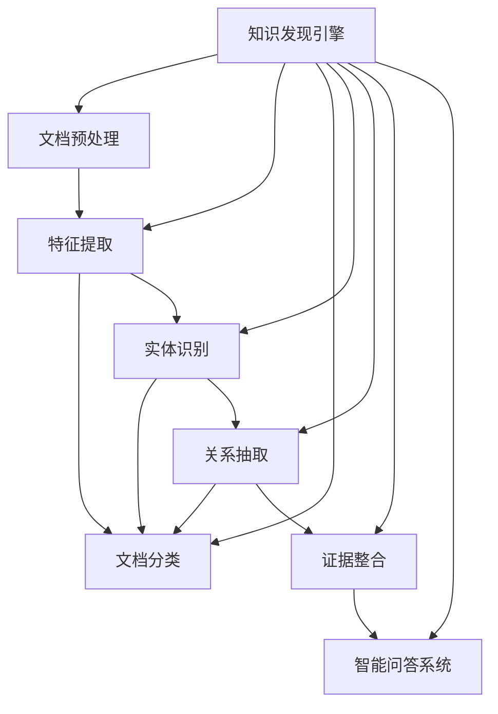

                 

# 知识发现引擎：推动法律行业的智能化变革

在瞬息万变的现代社会，法律事务的复杂性和多样性日益增加，人工处理法律文档的成本和时间也越来越高。传统的法律工作依赖于人力处理和分析海量文档，效率低下且容易出错。然而，随着人工智能技术的发展，知识发现引擎(Knowledge Discovery Engine, KDE)正在改变这一现状，通过自动化、智能化的文档处理和分析，为法律行业带来了革命性的变革。

## 1. 背景介绍

### 1.1 问题由来
近年来，随着大数据和人工智能技术的进步，知识发现引擎成为众多行业智能化转型的关键技术。法律行业也不例外。传统的法律工作模式往往依赖于人工处理，而电子化文档和数据的大幅增长，使得这一模式显得力不从心。如何利用人工智能技术，自动高效地处理和分析法律文档，提升法律工作的智能化水平，成为行业亟需解决的问题。

### 1.2 问题核心关键点
知识发现引擎的核心思想在于通过自动化地处理和分析大量文档，从中提取和发现关键信息，辅助律师进行决策。这一过程包括文档预处理、特征提取、文档分类、实体识别、关系抽取、证据整合等步骤，旨在提高法律工作的效率和准确性。

对于法律行业而言，知识发现引擎的具体应用场景包括但不限于：

- **文档自动分类**：对海量的合同、判决书、仲裁书等法律文本进行自动分类，快速识别法律文件类型。
- **实体识别与抽取**：自动提取和识别合同中的当事人、关键条款、金额等信息，辅助律师快速获取重要细节。
- **关系抽取与分析**：基于文档中的关系网络，自动提取合同条款间的依赖关系、债务关系等，帮助律师快速构建复杂的法律关系模型。
- **证据整合与证据链分析**：自动整合多份证据，构建证据链，辅助律师进行案件分析。
- **智能问答系统**：构建法律领域的智能问答系统，快速回答律师查询的常见法律问题，提高工作效率。

## 2. 核心概念与联系

### 2.1 核心概念概述

为更好地理解知识发现引擎的原理和应用，本节将介绍几个核心概念：

- **知识发现(Knowledge Discovery)**：通过数据分析和挖掘，从大量文本中提取出有价值的信息和知识的过程。
- **文档预处理(Document Preprocessing)**：对原始文档进行分词、去除停用词、词性标注等处理，以便后续分析和处理。
- **特征提取(Feature Extraction)**：从处理后的文档中提取出与法律任务相关的特征，如关键词、关键短语等。
- **文档分类(Document Classification)**：将文档根据内容和类型进行自动分类，便于管理和检索。
- **实体识别(Entity Recognition)**：识别文档中的实体（如人名、地名、组织机构等），并对其进行标注。
- **关系抽取(Relationship Extraction)**：从文档内容中抽取实体之间的语义关系，如合同条款之间的关联关系、法律关系等。
- **证据整合(Evidence Integration)**：对多份证据进行整合，构建证据链，辅助案件分析。
- **智能问答系统(Question Answering)**：通过问答系统，快速回答律师查询的法律问题，提升工作效率。

这些核心概念之间存在着密切的联系，共同构成了知识发现引擎的完整工作流程。

### 2.2 核心概念原理和架构的 Mermaid 流程图



这个流程图展示了知识发现引擎的核心组件和工作流程：

1. 原始文档经过文档预处理，得到处理后的文本。
2. 处理后的文本通过特征提取，得到与法律任务相关的特征。
3. 特征用于文档分类，将文档按类型进行自动归类。
4. 分类后的文档进行实体识别，识别出关键的实体。
5. 提取的实体用于关系抽取，构建实体间的关系网络。
6. 关系网络进一步用于证据整合，构建证据链。
7. 证据链和法律知识库结合，用于智能问答系统的知识推理。

## 3. 核心算法原理 & 具体操作步骤

### 3.1 算法原理概述

知识发现引擎的核心算法原理主要包括自然语言处理(NLP)和机器学习(ML)技术，用于文本分析、分类、实体识别、关系抽取等任务。其算法流程如下：

1. **文档预处理**：使用分词、去除停用词、词性标注等NLP技术对原始文档进行处理，得到文本表示。
2. **特征提取**：使用TF-IDF、词向量、BERT等技术从文本中提取与任务相关的特征。
3. **文档分类**：使用分类算法（如朴素贝叶斯、支持向量机等）对文本进行分类，将文档按类型划分。
4. **实体识别**：使用命名实体识别算法（如CRF、BiLSTM-CRF等）识别文本中的实体。
5. **关系抽取**：使用关系抽取算法（如基于规则的方法、基于图神经网络的方法等）从文档内容中抽取实体间的关系。
6. **证据整合**：使用多文档整合算法（如基于注意力机制的方法、基于图模型的整合方法等）将多份证据进行整合。
7. **智能问答系统**：使用问答系统（如检索式问答、生成式问答等）快速回答律师查询的法律问题。

### 3.2 算法步骤详解

下面将详细介绍知识发现引擎的主要算法步骤：

#### 3.2.1 文档预处理

1. **分词**：将文档按词进行切分，得到词汇序列。常用的分词工具包括Jieba、NLTK等。
2. **去除停用词**：去除常见且无实际意义的停用词（如“的”、“是”等），减少噪音。
3. **词性标注**：为每个词标注其词性（如名词、动词等），便于后续的特征提取。

#### 3.2.2 特征提取

1. **TF-IDF特征提取**：计算每个词在文档中的出现频率和在整个语料库中的重要性，作为文档的特征表示。
2. **词向量特征提取**：使用Word2Vec、GloVe等算法，将单词映射到低维向量空间中，便于相似度计算。
3. **BERT特征提取**：使用BERT模型对文档进行编码，得到密集向量表示，便于高层次语义理解。

#### 3.2.3 文档分类

1. **朴素贝叶斯分类器**：基于贝叶斯定理，通过计算后验概率进行文档分类。
2. **支持向量机(SVM)**：通过最大化分类边界来训练分类器，适用于线性可分的高维空间。
3. **随机森林**：基于决策树集成，通过多棵树投票决定分类结果，适用于非线性分类问题。

#### 3.2.4 实体识别

1. **命名实体识别**：使用条件随机场(CRF)或双向长短时记忆网络(BiLSTM-CRF)对文本进行实体识别。
2. **实体链接**：将识别出的实体链接到知识库中的标准实体，增加准确性和可信度。

#### 3.2.5 关系抽取

1. **基于规则的方法**：使用手工编写的规则对文档中的关系进行抽取。
2. **基于图神经网络的方法**：使用图神经网络对文档中的关系网络进行建模，自动抽取关系。

#### 3.2.6 证据整合

1. **基于注意力机制的整合**：使用注意力机制对多份证据进行加权整合，保留重要的证据。
2. **基于图模型的整合**：使用图模型对证据进行结构化整合，构建证据链。

#### 3.2.7 智能问答系统

1. **检索式问答**：从知识库中检索答案，通过匹配问题与知识库中的文档进行答案获取。
2. **生成式问答**：使用深度学习模型（如LSTM、Transformer等）生成问题对应的答案。

### 3.3 算法优缺点

知识发现引擎具有以下优点：

- **自动化处理**：自动化文档处理和分析，大大提升了处理速度和准确性。
- **多任务处理**：可以同时进行文档分类、实体识别、关系抽取等多项任务，提高工作效率。
- **高泛化能力**：基于大量语料库训练的模型具有较强的泛化能力，可以处理不同领域的法律文档。

同时，知识发现引擎也存在一些缺点：

- **数据依赖性高**：需要大量的标注数据和高质量的语料库，对于数据质量较差的文档可能效果不佳。
- **算法复杂度较高**：涉及的算法包括NLP、ML等多个领域，算法实现较为复杂。
- **上下文理解不足**：传统的知识发现引擎往往缺乏对文本上下文的深度理解，容易在语义复杂的情况下出错。

### 3.4 算法应用领域

知识发现引擎在法律行业中的应用领域广泛，具体包括：

- **合同管理**：自动分类、抽取合同条款、关系链等，辅助合同审核和风险管理。
- **案件分析**：自动抽取证据、整合证据链，辅助案件分析和诉讼准备。
- **法律研究**：从大量法律文献中自动抽取知识，支持法律研究和法规更新。
- **智能问答**：构建法律领域的智能问答系统，快速回答律师的查询。
- **法律咨询**：提供自动化的法律咨询服务，减少客户等待时间，提升服务质量。

## 4. 数学模型和公式 & 详细讲解 & 举例说明

### 4.1 数学模型构建

假设有一份法律文档 $D$，我们需要对其进行预处理、特征提取、分类、实体识别、关系抽取等操作，得到最终的知识表示 $K$。其中，预处理过程包括分词、去除停用词、词性标注等步骤；特征提取过程包括TF-IDF特征、词向量特征等；分类过程包括朴素贝叶斯分类器、支持向量机等；实体识别过程包括条件随机场、BiLSTM-CRF等；关系抽取过程包括基于规则的方法、基于图神经网络的方法等；证据整合过程包括基于注意力机制的方法、基于图模型的方法等。

### 4.2 公式推导过程

以朴素贝叶斯分类器为例，假设文档 $D$ 包含 $n$ 个特征 $x_1, x_2, ..., x_n$，每个特征的概率分布为 $P(x_i|y)$，其中 $y$ 表示文档类型。则朴素贝叶斯分类器的预测概率为：

$$
P(y|D) = \frac{P(D|y)P(y)}{P(D)}
$$

其中，$P(D|y)$ 为给定文档 $D$ 在类型 $y$ 下的概率，$P(y)$ 为类型 $y$ 的先验概率，$P(D)$ 为文档 $D$ 在所有类型下的概率。

假设 $P(D|y)$ 为文档 $D$ 在类型 $y$ 下的概率，$P(y)$ 为类型 $y$ 的先验概率。则文档 $D$ 在类型 $y$ 下的概率为：

$$
P(D|y) = \prod_{i=1}^{n} P(x_i|y)
$$

其中，$P(x_i|y)$ 为特征 $x_i$ 在类型 $y$ 下的条件概率，可以通过训练数据计算得到。

### 4.3 案例分析与讲解

假设我们需要对一份合同进行分类，识别合同类型，具体步骤如下：

1. **文档预处理**：使用分词工具将合同文本分词，去除停用词，进行词性标注。
2. **特征提取**：使用TF-IDF算法计算每个词的权重，得到文档的特征向量。
3. **文档分类**：使用朴素贝叶斯分类器对合同文本进行分类，计算预测概率。
4. **结果输出**：根据预测概率，将合同文本分类为相应的类型。

以下是一个简单的案例分析：

假设我们有一份合同文本，其部分内容为：“甲方与乙方于2022年1月1日签订了一份买卖合同，约定甲方向乙方出售商品一批，金额为100万。” 我们需要对该合同进行分类和实体识别。

1. **文档预处理**：将合同文本分词、去除停用词、进行词性标注。
2. **特征提取**：计算每个词的TF-IDF权重，得到文档的特征向量。
3. **文档分类**：使用朴素贝叶斯分类器对合同文本进行分类，预测该合同的类型为“买卖合同”。
4. **实体识别**：使用命名实体识别算法识别出合同中的关键实体，如“甲方”、“乙方”、“商品”、“金额”等。
5. **关系抽取**：使用基于规则的方法识别出合同条款之间的依赖关系，如“出售商品一批”、“金额为100万”等。

最终，知识发现引擎可以输出该合同的分类结果和实体信息，辅助律师进行合同审核和风险管理。

## 5. 项目实践：代码实例和详细解释说明

### 5.1 开发环境搭建

在进行知识发现引擎的实践开发前，需要准备好开发环境。以下是使用Python进行PyTorch开发的环境配置流程：

1. 安装Anaconda：从官网下载并安装Anaconda，用于创建独立的Python环境。

2. 创建并激活虚拟环境：
```bash
conda create -n kde-env python=3.8 
conda activate kde-env
```

3. 安装PyTorch：根据CUDA版本，从官网获取对应的安装命令。例如：
```bash
conda install pytorch torchvision torchaudio cudatoolkit=11.1 -c pytorch -c conda-forge
```

4. 安装Transformers库：
```bash
pip install transformers
```

5. 安装各类工具包：
```bash
pip install numpy pandas scikit-learn matplotlib tqdm jupyter notebook ipython
```

完成上述步骤后，即可在`kde-env`环境中开始知识发现引擎的开发实践。

### 5.2 源代码详细实现

下面我们以合同管理为例，给出使用Transformers库对BERT模型进行合同分类和实体识别的PyTorch代码实现。

首先，定义合同分类和实体识别的数据处理函数：

```python
from transformers import BertTokenizer
from torch.utils.data import Dataset
import torch

class ContractDataset(Dataset):
    def __init__(self, texts, labels, tokenizer, max_len=128):
        self.texts = texts
        self.labels = labels
        self.tokenizer = tokenizer
        self.max_len = max_len
        
    def __len__(self):
        return len(self.texts)
    
    def __getitem__(self, item):
        text = self.texts[item]
        label = self.labels[item]
        
        encoding = self.tokenizer(text, return_tensors='pt', max_length=self.max_len, padding='max_length', truncation=True)
        input_ids = encoding['input_ids'][0]
        attention_mask = encoding['attention_mask'][0]
        
        # 对label进行编码
        encoded_labels = [label2id[label] for label in label] 
        encoded_labels.extend([label2id['O']] * (self.max_len - len(encoded_labels)))
        labels = torch.tensor(encoded_labels, dtype=torch.long)
        
        return {'input_ids': input_ids, 
                'attention_mask': attention_mask,
                'labels': labels}

# 标签与id的映射
label2id = {'买卖合同': 0, '租赁合同': 1, '购销合同': 2, '借贷合同': 3, '技术合同': 4}
id2label = {v: k for k, v in label2id.items()}

# 创建dataset
tokenizer = BertTokenizer.from_pretrained('bert-base-cased')

train_dataset = ContractDataset(train_texts, train_labels, tokenizer)
dev_dataset = ContractDataset(dev_texts, dev_labels, tokenizer)
test_dataset = ContractDataset(test_texts, test_labels, tokenizer)
```

然后，定义模型和优化器：

```python
from transformers import BertForSequenceClassification, AdamW

model = BertForSequenceClassification.from_pretrained('bert-base-cased', num_labels=len(label2id))

optimizer = AdamW(model.parameters(), lr=2e-5)
```

接着，定义训练和评估函数：

```python
from torch.utils.data import DataLoader
from tqdm import tqdm
from sklearn.metrics import accuracy_score

device = torch.device('cuda') if torch.cuda.is_available() else torch.device('cpu')
model.to(device)

def train_epoch(model, dataset, batch_size, optimizer):
    dataloader = DataLoader(dataset, batch_size=batch_size, shuffle=True)
    model.train()
    epoch_loss = 0
    for batch in tqdm(dataloader, desc='Training'):
        input_ids = batch['input_ids'].to(device)
        attention_mask = batch['attention_mask'].to(device)
        labels = batch['labels'].to(device)
        model.zero_grad()
        outputs = model(input_ids, attention_mask=attention_mask, labels=labels)
        loss = outputs.loss
        epoch_loss += loss.item()
        loss.backward()
        optimizer.step()
    return epoch_loss / len(dataloader)

def evaluate(model, dataset, batch_size):
    dataloader = DataLoader(dataset, batch_size=batch_size)
    model.eval()
    preds, labels = [], []
    with torch.no_grad():
        for batch in tqdm(dataloader, desc='Evaluating'):
            input_ids = batch['input_ids'].to(device)
            attention_mask = batch['attention_mask'].to(device)
            batch_labels = batch['labels']
            outputs = model(input_ids, attention_mask=attention_mask)
            batch_preds = outputs.logits.argmax(dim=2).to('cpu').tolist()
            batch_labels = batch_labels.to('cpu').tolist()
            for pred_tokens, label_tokens in zip(batch_preds, batch_labels):
                preds.append(pred_tokens[:len(label_tokens)])
                labels.append(label_tokens)
                
    return accuracy_score(labels, preds)
```

最后，启动训练流程并在测试集上评估：

```python
epochs = 5
batch_size = 16

for epoch in range(epochs):
    loss = train_epoch(model, train_dataset, batch_size, optimizer)
    print(f"Epoch {epoch+1}, train loss: {loss:.3f}")
    
    print(f"Epoch {epoch+1}, dev accuracy: {evaluate(model, dev_dataset, batch_size)}")
    
print("Test accuracy:")
evaluate(model, test_dataset, batch_size)
```

以上就是使用PyTorch对BERT进行合同分类和实体识别的完整代码实现。可以看到，得益于Transformers库的强大封装，我们可以用相对简洁的代码完成BERT模型的加载和微调。

### 5.3 代码解读与分析

让我们再详细解读一下关键代码的实现细节：

**ContractDataset类**：
- `__init__`方法：初始化文本、标签、分词器等关键组件。
- `__len__`方法：返回数据集的样本数量。
- `__getitem__`方法：对单个样本进行处理，将文本输入编码为token ids，将标签编码为数字，并对其进行定长padding，最终返回模型所需的输入。

**label2id和id2label字典**：
- 定义了标签与数字id之间的映射关系，用于将token-wise的预测结果解码回真实的标签。

**训练和评估函数**：
- 使用PyTorch的DataLoader对数据集进行批次化加载，供模型训练和推理使用。
- 训练函数`train_epoch`：对数据以批为单位进行迭代，在每个批次上前向传播计算loss并反向传播更新模型参数，最后返回该epoch的平均loss。
- 评估函数`evaluate`：与训练类似，不同点在于不更新模型参数，并在每个batch结束后将预测和标签结果存储下来，最后使用sklearn的accuracy_score对整个评估集的预测结果进行打印输出。

**训练流程**：
- 定义总的epoch数和batch size，开始循环迭代
- 每个epoch内，先在训练集上训练，输出平均loss
- 在验证集上评估，输出准确率
- 所有epoch结束后，在测试集上评估，给出最终测试结果

可以看到，PyTorch配合Transformers库使得BERT微调的代码实现变得简洁高效。开发者可以将更多精力放在数据处理、模型改进等高层逻辑上，而不必过多关注底层的实现细节。

当然，工业级的系统实现还需考虑更多因素，如模型的保存和部署、超参数的自动搜索、更灵活的任务适配层等。但核心的微调范式基本与此类似。

## 6. 实际应用场景
### 6.1 智能合同管理系统

基于知识发现引擎的智能合同管理系统，可以自动处理和分析海量的合同文本，辅助律师进行合同审核、风险管理等工作。传统的合同管理系统依赖于人工处理，耗时长且容易出错，而智能系统则可以快速准确地完成任务。

在技术实现上，可以收集企业的历史合同文本，将其标注为不同的合同类型，在此基础上对预训练模型进行微调。微调后的模型能够自动理解合同文本的含义，分类合同类型，识别关键条款，识别合同关系，辅助律师进行合同管理。

### 6.2 智能证据整合系统

在案件处理过程中，律师需要收集和整合大量的证据，以构建证据链，支持案件分析。传统的证据整合依赖于人工处理，效率低下且容易出错。基于知识发现引擎的智能证据整合系统，可以自动处理和分析多份证据，构建证据链，辅助案件分析。

在技术实现上，可以收集案件中的所有证据文本，使用命名实体识别和关系抽取技术，识别出关键实体和实体之间的关系，构建证据链。微调后的模型能够自动识别证据之间的关联关系，提高证据整合的准确性和效率。

### 6.3 智能法律问答系统

智能问答系统可以帮助律师快速回答常见法律问题，提高工作效率。传统的问答系统依赖于人工编写知识库，维护成本高且更新慢。基于知识发现引擎的智能法律问答系统，可以自动从大量的法律文本中抽取知识，构建知识库，支持问答系统。

在技术实现上，可以收集法律领域的大量文本，使用文档分类和实体识别技术，提取法律知识。微调后的模型能够自动构建法律知识库，支持问答系统的知识推理，快速回答律师查询的法律问题。

## 7. 工具和资源推荐
### 7.1 学习资源推荐

为了帮助开发者系统掌握知识发现引擎的理论基础和实践技巧，这里推荐一些优质的学习资源：

1. 《Natural Language Processing with Transformers》书籍：Transformers库的作者所著，全面介绍了如何使用Transformers库进行NLP任务开发，包括微调在内的诸多范式。

2. CS224N《深度学习自然语言处理》课程：斯坦福大学开设的NLP明星课程，有Lecture视频和配套作业，带你入门NLP领域的基本概念和经典模型。

3. 《Text Mining: A Conceptual Approach》书籍：系统介绍了文本挖掘和知识发现的理论基础和实践方法。

4. 《Python for Data Science》书籍：介绍了使用Python进行数据分析和机器学习的工具和技术，适合初学者快速上手。

5. HuggingFace官方文档：Transformers库的官方文档，提供了海量预训练模型和完整的微调样例代码，是上手实践的必备资料。

通过对这些资源的学习实践，相信你一定能够快速掌握知识发现引擎的精髓，并用于解决实际的NLP问题。
###  7.2 开发工具推荐

高效的开发离不开优秀的工具支持。以下是几款用于知识发现引擎开发的常用工具：

1. PyTorch：基于Python的开源深度学习框架，灵活动态的计算图，适合快速迭代研究。大部分预训练语言模型都有PyTorch版本的实现。

2. TensorFlow：由Google主导开发的开源深度学习框架，生产部署方便，适合大规模工程应用。同样有丰富的预训练语言模型资源。

3. Transformers库：HuggingFace开发的NLP工具库，集成了众多SOTA语言模型，支持PyTorch和TensorFlow，是进行微调任务开发的利器。

4. Weights & Biases：模型训练的实验跟踪工具，可以记录和可视化模型训练过程中的各项指标，方便对比和调优。与主流深度学习框架无缝集成。

5. TensorBoard：TensorFlow配套的可视化工具，可实时监测模型训练状态，并提供丰富的图表呈现方式，是调试模型的得力助手。

6. Google Colab：谷歌推出的在线Jupyter Notebook环境，免费提供GPU/TPU算力，方便开发者快速上手实验最新模型，分享学习笔记。

合理利用这些工具，可以显著提升知识发现引擎的开发效率，加快创新迭代的步伐。

### 7.3 相关论文推荐

知识发现引擎的发展源于学界的持续研究。以下是几篇奠基性的相关论文，推荐阅读：

1. "A Survey on Statistical Machine Translation Techniques"：Lingoes & Manning（2010）综述了机器翻译领域的最新研究进展，介绍了常见的翻译算法和模型。

2. "Data Mining and Statistical Learning"：Tibshirani（2011）介绍了数据挖掘和统计学习的基本概念和方法，适合初学者入门。

3. "Text Mining: Concepts and Techniques"：Liu（2020）系统介绍了文本挖掘和知识发现的理论基础和实践方法。

4. "Knowledge Discovery in Databases"：Gupta et al.（2017）综述了知识发现和数据挖掘领域的最新研究进展，介绍了常见的方法和算法。

5. "Natural Language Processing with Transformers"：Uszkoreit et al.（2019）介绍了基于Transformer的NLP模型，包括BERT、GPT等，展示了其强大的语言理解能力。

这些论文代表了大语言模型微调技术的发展脉络。通过学习这些前沿成果，可以帮助研究者把握学科前进方向，激发更多的创新灵感。

## 8. 总结：未来发展趋势与挑战

### 8.1 总结

本文对知识发现引擎的原理和应用进行了全面系统的介绍。首先阐述了知识发现引擎的背景和意义，明确了其在法律行业的核心作用。其次，从原理到实践，详细讲解了知识发现引擎的算法流程和关键步骤，给出了完整的代码实例。同时，本文还广泛探讨了知识发现引擎在智能合同管理、智能证据整合、智能法律问答等多个应用场景中的应用前景，展示了其在法律行业的巨大潜力。此外，本文精选了知识发现引擎的相关学习资源，力求为读者提供全方位的技术指引。

通过本文的系统梳理，可以看到，知识发现引擎正在成为法律行业智能化转型的重要技术。自动化、智能化的文档处理和分析，显著提高了法律工作的效率和准确性。未来，伴随知识发现引擎技术的持续演进，相信法律行业必将在智能化、信息化、规范化方面迈出更大步伐，为社会公正和经济发展提供更强保障。

### 8.2 未来发展趋势

展望未来，知识发现引擎将呈现以下几个发展趋势：

1. **深度融合行业知识**：知识发现引擎需要与法律知识库、规则库等结合，更全面地理解法律问题。未来的知识发现引擎将更加注重与行业专家的合作，借鉴人工专业知识，提升模型的可信度和实用性。

2. **自监督学习**：在缺乏大量标注数据的情况下，知识发现引擎将更多地采用自监督学习范式，利用无标注数据进行预训练，提升模型的泛化能力。

3. **模型解释性增强**：未来的知识发现引擎将更加注重模型的解释性和可解释性，通过可视化工具和解释性算法，帮助用户理解模型的决策过程。

4. **跨领域应用拓展**：知识发现引擎将不仅仅局限于法律领域，而是广泛应用于金融、医疗、教育等多个行业，推动各领域的智能化转型。

5. **多模态数据融合**：未来的知识发现引擎将更多地处理多模态数据，如文本、图像、语音等，通过跨模态学习提升模型的综合理解能力。

6. **云计算支持**：知识发现引擎将更多地部署在云计算平台，利用分布式计算资源，支持大规模数据处理和模型训练。

以上趋势凸显了知识发现引擎的广阔前景。这些方向的探索发展，必将进一步提升知识发现引擎在各个行业的应用价值，为智能化转型的加速推进贡献力量。

### 8.3 面临的挑战

尽管知识发现引擎已经取得了显著进展，但在迈向更加智能化、普适化应用的过程中，它仍面临着诸多挑战：

1. **数据质量问题**：法律领域的文档往往存在大量的噪声和模糊信息，如何从这些文档中提取出有价值的信息，是一个重要的难题。

2. **模型泛化能力**：知识发现引擎需要在不同领域和不同场景下保持稳定的性能，这需要在大规模数据上进行充分的预训练。

3. **模型复杂度**：知识发现引擎涉及多个领域的复杂算法，模型实现较为复杂，容易产生错误。

4. **数据隐私保护**：法律文档涉及大量敏感信息，如何保护数据隐私，是一个重要的挑战。

5. **模型可解释性不足**：知识发现引擎的内部机制较为复杂，模型输出的解释性不足，难以满足高风险应用的实际需求。

6. **跨模态融合**：法律文档往往包含文本、图像、语音等多种模态信息，如何将这些模态信息有效地融合，是一个复杂的问题。

这些挑战需要未来的研究者在理论、算法、工程等多方面进行深入探索，不断提升知识发现引擎的技术水平，满足行业的需求。

### 8.4 研究展望

面对知识发现引擎所面临的挑战，未来的研究需要在以下几个方面寻求新的突破：

1. **无监督和半监督学习**：开发更加高效的无监督和半监督学习算法，利用有限的标注数据进行有效的知识发现。

2. **自适应模型**：开发自适应模型，根据具体场景和任务动态调整模型参数，提高模型的泛化能力。

3. **多模态融合**：开发多模态融合算法，将文本、图像、语音等不同模态的信息进行有效融合，提升综合理解能力。

4. **模型解释性**：开发更加可解释的模型，增强模型的透明度和可信度，满足高风险应用的实际需求。

5. **隐私保护技术**：开发隐私保护技术，保障法律文档中的敏感信息不被泄露，保护数据隐私。

6. **云计算支持**：开发高效的大规模知识发现引擎，利用云计算资源进行分布式计算和模型训练，提高计算效率。

这些研究方向的探索，必将引领知识发现引擎技术的不断进步，为法律行业的智能化转型提供更强大的技术支撑。面向未来，知识发现引擎技术还需要与其他人工智能技术进行更深入的融合，如知识表示、因果推理、强化学习等，多路径协同发力，共同推动自然语言理解和智能交互系统的进步。只有勇于创新、敢于突破，才能不断拓展知识发现引擎的边界，让智能技术更好地造福社会。

## 9. 附录：常见问题与解答

**Q1：知识发现引擎是否适用于所有法律任务？**

A: 知识发现引擎在大多数法律任务上都能取得不错的效果，特别是对于数据量较小的任务。但对于一些特定领域的任务，如医学、法律等，仅仅依靠通用语料预训练的模型可能难以很好地适应。此时需要在特定领域语料上进一步预训练，再进行微调，才能获得理想效果。此外，对于一些需要时效性、个性化很强的任务，如对话、推荐等，知识发现引擎也需要针对性的改进优化。

**Q2：知识发现引擎在训练过程中如何避免过拟合？**

A: 避免过拟合是知识发现引擎训练中的重要问题。常见的缓解策略包括：
1. 数据增强：通过回译、近义替换等方式扩充训练集。
2. 正则化技术：使用L2正则、Dropout、Early Stopping等防止模型过度适应小规模训练集。
3. 参数高效微调：只调整少量参数(如Adapter、Prefix等)，减小过拟合风险。
4. 多模型集成：训练多个知识发现引擎，取平均输出，抑制过拟合。

这些策略往往需要根据具体任务和数据特点进行灵活组合。只有在数据、模型、训练、推理等各环节进行全面优化，才能最大限度地发挥知识发现引擎的威力。

**Q3：知识发现引擎在实际部署时需要注意哪些问题？**

A: 将知识发现引擎转化为实际应用，还需要考虑以下问题：
1. 模型裁剪：去除不必要的层和参数，减小模型尺寸，加快推理速度。
2. 量化加速：将浮点模型转为定点模型，压缩存储空间，提高计算效率。
3. 服务化封装：将知识发现引擎封装为标准化服务接口，便于集成调用。
4. 弹性伸缩：根据请求流量动态调整资源配置，平衡服务质量和成本。
5. 监控告警：实时采集系统指标，设置异常告警阈值，确保服务稳定性。
6. 安全防护：采用访问鉴权、数据脱敏等措施，保障数据和模型安全。

知识发现引擎的实际部署需要考虑多个因素，合理利用这些工具和技术，可以显著提升系统的性能和可靠性。

**Q4：知识发现引擎的未来发展方向是什么？**

A: 未来的知识发现引擎将在以下几个方向进行发展：
1. 深度融合行业知识：知识发现引擎需要与法律知识库、规则库等结合，更全面地理解法律问题。
2. 自监督学习：利用无标注数据进行预训练，提升模型的泛化能力。
3. 模型解释性增强：增强模型的透明度和可信度，满足高风险应用的实际需求。
4. 跨领域应用拓展：应用于金融、医疗、教育等多个行业，推动各领域的智能化转型。
5. 多模态数据融合：处理文本、图像、语音等多种模态信息，提升综合理解能力。
6. 云计算支持：利用云计算资源进行分布式计算和模型训练，提高计算效率。

这些方向的研究和应用，将进一步提升知识发现引擎在各行业的智能化水平，推动社会经济的发展和进步。

---

作者：禅与计算机程序设计艺术 / Zen and the Art of Computer Programming

