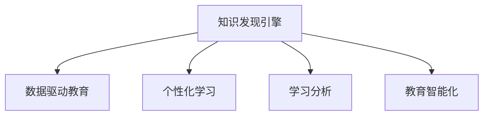

                 

## 1. 背景介绍

### 1.1 问题由来
教育领域长期以来面临着教学资源不均衡、教学效果难以量化、教学模式单一等问题。传统教育体系依赖于教师的经验和知识传承，缺乏系统化和数据驱动的智慧支撑。随着人工智能(AI)和大数据技术的迅猛发展，知识发现引擎成为推动教育领域智慧革命的关键手段。

### 1.2 问题核心关键点
知识发现引擎是一种基于数据驱动的知识获取、组织、应用和优化的智能系统。其核心在于通过对海量教育数据的深度分析，自动挖掘出有价值的知识模式和洞察，从而辅助教学设计、个性化推荐、学习分析等，提升教育效果和学习体验。

知识发现引擎融合了机器学习、自然语言处理、数据挖掘等前沿技术，能够从海量的教育数据中提取出隐含的知识和模式。这不仅为教育者提供个性化教学建议，也为学习者提供智能化的学习支持。

### 1.3 问题研究意义
知识发现引擎在教育领域的研究和应用具有重要意义：

1. **提升教学质量**：通过分析学生学习行为和成绩，自动生成个性化教学方案，提升课堂教学效果。
2. **推动教育公平**：利用AI技术，将优质教育资源推广到边远地区，助力教育均衡发展。
3. **激发学习兴趣**：通过智能推荐和互动式学习，提高学生学习动机和参与度。
4. **优化评估体系**：利用学习分析技术，动态调整评估标准和方法，促进公平、科学的教育评估。
5. **支持终身学习**：支持学生在学习生涯中获取持续学习支持，实现终身学习目标。

## 2. 核心概念与联系

### 2.1 核心概念概述

为更好地理解知识发现引擎的工作原理和优化方向，本节将介绍几个密切相关的核心概念：

- **知识发现引擎(Knowledge Discovery Engine, KDE)**：基于数据驱动的智能系统，能够自动从教育数据中挖掘出有意义的知识模式和洞察，为教育决策提供数据支持。
- **数据驱动教育(Data-Driven Education)**：利用大数据和人工智能技术，自动化地收集、分析和应用教育数据，优化教学过程和学习效果。
- **个性化学习(Adaptive Learning)**：根据学生个体差异，自动调整教学内容、方法和时间，提供个性化的学习体验。
- **学习分析(Learning Analytics)**：通过分析学习行为数据，识别学习模式和绩效，提供科学的教育决策支持。
- **教育智能化(EdTech)**：结合信息技术，创新教育模式，提升教育质量和效率。

这些核心概念之间的逻辑关系可以通过以下Mermaid流程图来展示：



这个流程图展示出知识发现引擎的核心概念及其之间的关系：

1. 知识发现引擎通过深度分析教育数据，挖掘出有价值的知识模式。
2. 挖掘出的知识模式被应用于数据驱动教育，为个性化学习提供支持。
3. 个性化学习采用智能化的教学策略，提升学习效果。
4. 学习分析技术通过监测学生行为，持续优化教学设计。
5. 教育智能化将技术应用于教育各个环节，促进教育模式创新。

## 3. 核心算法原理 & 具体操作步骤
### 3.1 算法原理概述

知识发现引擎的核心算法基于机器学习和数据挖掘技术，主要包括如下几个步骤：

1. **数据预处理**：清洗、归一化、特征提取等预处理操作，确保数据质量。
2. **模型训练**：选择合适的机器学习模型进行训练，如决策树、随机森林、深度学习等。
3. **知识挖掘**：利用模型对数据进行深度分析，自动挖掘出有意义的知识模式。
4. **知识展示**：将挖掘出的知识以可视化图表、报告等形式展示出来，辅助决策。
5. **应用优化**：将知识模式应用于教学设计、学习推荐、评估优化等环节，提升教育效果。

### 3.2 算法步骤详解

以学习分析为例，详细讲解知识发现引擎的算法步骤：

1. **数据收集**：收集学生的学习行为数据，包括在线学习平台访问记录、成绩数据、互动讨论内容等。
2. **数据清洗**：处理缺失值、异常值，标准化数据格式，确保数据质量。
3. **特征工程**：提取和学习行为相关的特征，如学习时间、互动频率、成绩变化等。
4. **模型训练**：使用随机森林、支持向量机(SVM)等分类算法，对学生进行分类，识别出高潜力学生、存在问题学生等。
5. **知识挖掘**：分析学生分类结果，挖掘出学习行为与成绩之间的关联，生成学习分析报告。
6. **知识展示**：将分析结果以图表、报告等形式展示，提供给教师参考。

### 3.3 算法优缺点

知识发现引擎在教育领域的应用具有以下优点：

1. **高效智能**：利用AI技术自动化地进行数据处理和分析，提升效率。
2. **决策支持**：提供科学的数据分析结果，辅助教师进行教学设计和优化。
3. **个性化支持**：根据学生学习数据，提供个性化的学习方案和建议。
4. **反馈优化**：实时监测学生学习情况，动态调整教学策略。

同时，该方法也存在一定的局限性：

1. **数据质量依赖**：知识发现效果高度依赖于数据质量，不完整、不准确的数据可能导致误导性分析。
2. **隐私保护**：教育数据的隐私保护要求较高，需要在数据处理和使用中严格遵守相关法律法规。
3. **模型复杂性**：高复杂度模型可能面临过拟合和计算负担过大的问题，需要精心选择和调参。
4. **解释性不足**：黑盒模型往往难以解释决策过程，增加了教学者和家长的理解难度。
5. **伦理问题**：数据挖掘和分析可能暴露学生隐私，引发伦理争议。

尽管存在这些局限性，但就目前而言，知识发现引擎在大数据和AI技术的支持下，已经在教育领域展现出了巨大的潜力和价值。未来相关研究将继续探索如何更好地处理数据质量、保护隐私、提高模型解释性和应对伦理问题，以期将知识发现引擎更广泛地应用于教育场景。

### 3.4 算法应用领域

知识发现引擎在教育领域的应用非常广泛，涵盖以下几个关键领域：

1. **学习分析(Learning Analytics)**：通过分析学生行为数据，识别学习模式和绩效，为教学设计和改进提供支持。
2. **个性化学习(Adaptive Learning)**：根据学生个体差异，自动调整教学内容和方法，提升学习效果。
3. **智能推荐系统(Recommendation Systems)**：基于学生学习行为和成绩，推荐合适的学习资源和路径。
4. **智能答疑系统(Chatbots)**：利用自然语言处理技术，提供智能化的学习答疑和指导。
5. **自动化评估(Automated Assessment)**：通过数据分析，自动生成评估标准和方法，减少教师工作负担。
6. **教育决策支持(Educational Decision Support)**：利用知识发现结果，辅助教育管理决策，优化资源配置。

除了上述这些领域，知识发现引擎还在教育游戏的智能化、虚拟教室建设、学习内容分析等方面得到了应用，推动了教育信息化和智能化进程。

## 4. 数学模型和公式 & 详细讲解 & 举例说明

### 4.1 数学模型构建

假设有一个包含$m$个学生、$n$个学习行为特征的教育数据集$D=\{(x_i, y_i)\}_{i=1}^m$，其中$x_i$表示学生$i$的学习行为特征向量，$y_i$表示学生$i$的学习成绩。

定义学习行为与成绩之间的非线性关系：

$$
y_i = f(x_i) + \epsilon_i
$$

其中$f(\cdot)$为非线性函数，$\epsilon_i$为随机误差。我们的目标是通过学习$f(\cdot)$，进行学习分析，识别出学习行为与成绩之间的关联。

### 4.2 公式推导过程

以决策树为例，推导知识发现引擎的数学模型。

决策树模型通过构建树状结构，将数据分割成若干子集，每个子集对应一个叶子节点，节点上标注着该子集的特征和输出。通过特征选择和树剪枝等算法，构建一棵泛化能力强的决策树。

决策树的构建过程如下：

1. **特征选择**：从所有特征中选择一个最优特征$x_j$，使得数据分割后的子集纯度最高。
2. **节点划分**：根据最优特征$x_j$的值，将数据集划分为若干子集。
3. **递归过程**：对每个子集重复上述过程，直到满足停止条件。

最终生成的决策树为：

$$
T = \{(x_j, \{(x_i, y_i)\}_{i \in N_j})\}_{j=1}^k
$$

其中$N_j$为节点$x_j$对应的子集。

### 4.3 案例分析与讲解

假设有一个包含以下学习行为特征的数据集：

- 学习时间：每天学习的小时数
- 互动频率：与教师和同学互动的次数
- 成绩：每门课程的考试成绩

利用决策树模型，对数据进行分析，挖掘出学习行为与成绩之间的关系。假设选择“学习时间”作为最优特征，生成的决策树为：

```mermaid
graph TB
    A[学习时间] --> B{≥8小时}[A>=8]
    A[学习时间] --> C{<8小时}[C<8]
    B --> D{成绩优秀}
    C --> E{成绩一般}
```

这表示每天学习时间超过8小时的学生中，有60%的成绩优秀；每天学习时间不足8小时的学生中，有40%的成绩一般。该分析结果可以辅助教师制定教学策略，提升学生学习效果。

## 5. 项目实践：代码实例和详细解释说明
### 5.1 开发环境搭建

在进行教育领域的知识发现引擎开发前，我们需要准备好开发环境。以下是使用Python进行KDE开发的常见环境配置流程：

1. 安装Anaconda：从官网下载并安装Anaconda，用于创建独立的Python环境。

2. 创建并激活虚拟环境：
```bash
conda create -n kde-env python=3.8 
conda activate kde-env
```

3. 安装相关库：
```bash
conda install pandas numpy scikit-learn matplotlib seaborn
```

4. 安装PyTorch：
```bash
pip install torch torchvision torchaudio
```

5. 安装TensorFlow：
```bash
pip install tensorflow
```

6. 安装NLTK和SpaCy：
```bash
pip install nltk spacy
```

完成上述步骤后，即可在`kde-env`环境中开始知识发现引擎的开发实践。

### 5.2 源代码详细实现

我们以一个简单的学习分析系统为例，实现基于决策树的KDE模型。首先，定义数据预处理和特征工程函数：

```python
import pandas as pd
from sklearn.model_selection import train_test_split
from sklearn.tree import DecisionTreeClassifier
from sklearn.metrics import accuracy_score
from sklearn.ensemble import RandomForestClassifier

def load_data(filename):
    data = pd.read_csv(filename)
    return data

def preprocess_data(data):
    # 处理缺失值
    data = data.fillna(method='ffill')
    # 标准化数据
    data = (data - data.mean()) / data.std()
    return data

def feature_engineering(data):
    # 选择特征
    features = ['learning_time', 'interaction_frequency']
    labels = ['exam_score']
    # 训练集和测试集划分
    X_train, X_test, y_train, y_test = train_test_split(data[features], data[labels], test_size=0.2)
    return X_train, X_test, y_train, y_test
```

然后，定义模型训练和评估函数：

```python
def train_model(X_train, X_test, y_train, y_test):
    # 随机森林模型训练
    model = RandomForestClassifier(n_estimators=100, random_state=42)
    model.fit(X_train, y_train)
    # 模型评估
    y_pred = model.predict(X_test)
    accuracy = accuracy_score(y_test, y_pred)
    return accuracy

def evaluate_model(model, X_test, y_test):
    # 模型评估
    y_pred = model.predict(X_test)
    accuracy = accuracy_score(y_test, y_pred)
    return accuracy
```

最后，启动训练流程并在测试集上评估：

```python
# 加载数据
data = load_data('student_data.csv')
# 数据预处理
data = preprocess_data(data)
# 特征工程
X_train, X_test, y_train, y_test = feature_engineering(data)
# 模型训练
accuracy_train = train_model(X_train, X_test, y_train, y_test)
# 模型评估
accuracy_test = evaluate_model(model, X_test, y_test)
print('训练集精度:', accuracy_train)
print('测试集精度:', accuracy_test)
```

以上就是使用Python实现基于决策树的KDE模型的完整代码实现。可以看到，利用Scikit-learn等库，进行数据预处理、模型训练和评估的代码实现相对简洁高效。

### 5.3 代码解读与分析

让我们再详细解读一下关键代码的实现细节：

**load_data函数**：
- 使用pandas库读取数据文件，返回DataFrame对象。

**preprocess_data函数**：
- 处理缺失值，使用前向填充(ffill)方法。
- 标准化数据，将数据转换为均值为0、标准差为1的分布。

**feature_engineering函数**：
- 选择特征，定义学习时间、互动频率为输入特征，考试成绩为输出标签。
- 训练集和测试集划分，使用train_test_split方法，80%作为训练集，20%作为测试集。

**train_model函数**：
- 使用随机森林模型进行训练，设定100棵决策树。
- 计算模型在测试集上的准确率。

**evaluate_model函数**：
- 使用训练好的模型进行评估，计算准确率。

**训练流程**：
- 加载数据
- 预处理数据
- 特征工程
- 模型训练
- 模型评估

可以看到，通过简单的代码实现，我们即可以构建出一个基于决策树的KDE系统，并对其进行训练和评估。这些步骤和代码，为后续在教育领域进行深入实践提供了坚实的基础。

当然，工业级的系统实现还需考虑更多因素，如模型的可扩展性、算法的选择和调优、可视化展示等。但核心的知识发现引擎框架基本与此类似。

## 6. 实际应用场景
### 6.1 智能推荐系统

智能推荐系统是知识发现引擎在教育领域的重要应用场景。通过分析学生的学习行为和成绩，推荐适合的学习资源和路径，帮助学生高效学习。

具体而言，可以收集学生的学习数据，包括在线学习平台的学习记录、论坛讨论、作业成绩等。利用知识发现引擎，识别出学生的学习偏好和薄弱环节，自动推荐相应的学习资料和习题。同时，根据学生的反馈和进度，动态调整推荐策略，实现个性化推荐。

### 6.2 学习行为分析

学习行为分析通过分析学生的学习行为数据，识别出学习模式和绩效，为教学设计和改进提供支持。

通过学习分析，可以发现学生的学习行为与成绩之间的关联，识别出学习过程中的薄弱环节，提供针对性的学习建议。例如，如果发现某个时间段内的学习时间与成绩呈负相关，可以建议学生调整学习时间，提高学习效率。

### 6.3 智能答疑系统

智能答疑系统利用自然语言处理技术，提供智能化的学习答疑和指导，解决学生在学习过程中遇到的问题。

通过知识发现引擎，可以分析学生的问题类型和难度，自动匹配合适的答案模板和解释。学生可以通过聊天界面提交问题，系统自动回复解答，提供详细的解释和参考资源。

### 6.4 未来应用展望

随着知识发现引擎的不断进步，其在教育领域的应用将更加广泛和深入。未来，知识发现引擎有望在以下领域取得突破：

1. **自适应学习系统**：根据学生的学习情况和行为，动态调整教学内容和策略，提供个性化的学习路径。
2. **学习效果预测**：利用机器学习模型，预测学生的学习效果和未来表现，提供早期干预和辅导。
3. **教育数据分析平台**：构建教育数据平台，整合多源数据，提供全面的教育分析报告。
4. **教育资源推荐引擎**：根据学生的学习需求，推荐合适的教育资源，如在线课程、学习材料等。
5. **教育智能决策支持**：利用知识发现结果，辅助教育管理决策，优化资源配置和政策制定。

这些方向的发展将进一步推动教育智能化进程，提升教育质量和效率，为学生提供更优质的学习体验。

## 7. 工具和资源推荐
### 7.1 学习资源推荐

为了帮助开发者系统掌握知识发现引擎的理论基础和实践技巧，这里推荐一些优质的学习资源：

1. **《Python数据科学手册》**：由知名数据科学家Jake VanderPlas撰写，系统介绍了数据科学的基本概念和Python库的使用，非常适合入门学习。
2. **Kaggle**：全球最大的数据科学竞赛平台，提供丰富的数据集和实战项目，适合锻炼和提升技能。
3. **Coursera**：提供由斯坦福大学、密歇根大学等顶级学府开设的数据科学课程，系统学习数据科学的知识体系。
4. **NLP相关的书籍和博客**：如《Python自然语言处理》、《深度学习与自然语言处理》等书籍，以及自然语言处理领域的知名博客，如KDnuggets、Towards Data Science等。
5. **机器学习社区和论坛**：如Kaggle、Stack Overflow、Reddit等，获取最新的机器学习技术和实践经验。

通过这些资源的学习实践，相信你一定能够快速掌握知识发现引擎的精髓，并用于解决实际的NLP问题。

### 7.2 开发工具推荐

高效的开发离不开优秀的工具支持。以下是几款用于知识发现引擎开发的常用工具：

1. **Python**：Python语言简洁易学，拥有丰富的第三方库，适合进行数据处理和机器学习开发。
2. **TensorFlow**：由Google主导开发的深度学习框架，支持分布式训练和模型部署，适合大规模工程应用。
3. **PyTorch**：由Facebook主导开发的深度学习框架，动态计算图和易用性使其成为学术和工业界的首选。
4. **NLTK**：自然语言处理工具包，提供丰富的NLP功能，适合进行文本分析和处理。
5. **SpaCy**：高质量的自然语言处理库，支持实体识别、词性标注等任务，适合构建高效的自然语言处理应用。
6. **Jupyter Notebook**：交互式的开发环境，支持Python和R等语言，便于快速迭代和实验。

合理利用这些工具，可以显著提升知识发现引擎的开发效率，加快创新迭代的步伐。

### 7.3 相关论文推荐

知识发现引擎的研究源于学界的持续研究。以下是几篇奠基性的相关论文，推荐阅读：

1. **《PAC-MAN goes to school: Connecting learning contexts, learning events, and performance》**：研究学习分析在教育中的应用，提出了学习行为与成绩之间的非线性关联模型。
2. **《A Data-Driven Approach to Recommender Systems》**：介绍了基于用户行为数据的推荐系统，利用协同过滤、内容推荐等方法，提升推荐效果。
3. **《Learning Analytics: Building Connections Between Learning Data and Educational Theory and Research》**：介绍了学习分析的理论基础和方法，探讨了学习数据如何支持教育研究和实践。
4. **《Adaptive Learning Systems: Architectures for Intelligent Tutoring Systems》**：研究自适应学习系统的架构和设计，提出了智能导师系统的典型应用。
5. **《Towards a New Generation of Intelligent Tutoring Systems: Technology and Pedagogy for Adaptive Learning》**：探讨了智能导师系统的发展方向，提出了基于知识发现的自适应学习模型。

这些论文代表了大数据和AI技术在教育领域的应用前景，为后续研究提供了理论基础和实践参考。

## 8. 总结：未来发展趋势与挑战
### 8.1 总结

本文对知识发现引擎在教育领域的应用进行了全面系统的介绍。首先阐述了知识发现引擎的研究背景和意义，明确了其在提升教学效果和学习体验方面的重要价值。其次，从原理到实践，详细讲解了知识发现引擎的数学模型和算法步骤，给出了知识发现引擎任务开发的完整代码实例。同时，本文还广泛探讨了知识发现引擎在智能推荐、学习分析、智能答疑等教育场景中的应用前景，展示了知识发现引擎的巨大潜力和价值。此外，本文精选了知识发现引擎的学习资源，力求为读者提供全方位的技术指引。

通过本文的系统梳理，可以看到，知识发现引擎通过深度分析教育数据，挖掘出有价值的知识模式和洞察，为教育决策提供科学支持。知识发现引擎的开发和应用，不仅能够提升教育质量和效果，还为教育智能化、个性化和数据驱动提供了有力保障。

### 8.2 未来发展趋势

展望未来，知识发现引擎在教育领域的应用将呈现以下几个发展趋势：

1. **自适应学习系统**：利用知识发现引擎，实现基于学生学习情况的个性化教学设计，提供动态调整的教学内容和策略，提升学习效果。
2. **数据驱动教育**：构建教育数据平台，整合多源数据，提供全面的教育分析报告，支持教育决策。
3. **智能推荐引擎**：利用知识发现引擎，自动推荐适合的学习资源和路径，提高学生学习效率。
4. **学习效果预测**：利用机器学习模型，预测学生的学习效果和未来表现，提供早期干预和辅导。
5. **教育智能决策支持**：利用知识发现引擎，辅助教育管理决策，优化资源配置和政策制定。

这些趋势展示了知识发现引擎在教育领域的应用前景，相信未来将会有更多的教育智能系统涌现，推动教育信息化和智能化进程。

### 8.3 面临的挑战

尽管知识发现引擎在教育领域的应用已经取得了显著成效，但在迈向更加智能化、普适化应用的过程中，仍面临着诸多挑战：

1. **数据质量**：知识发现引擎的准确性和效果高度依赖于数据质量，不完整、不准确的数据可能导致误导性分析。如何保证数据的全面性和真实性，仍然是一个难题。
2. **隐私保护**：教育数据的隐私保护要求较高，如何在数据处理和使用中严格遵守相关法律法规，是知识发现引擎应用的重要保障。
3. **算法复杂性**：高复杂度模型可能面临过拟合和计算负担过大的问题，需要精心选择和调参。
4. **模型解释性**：黑盒模型往往难以解释决策过程，增加了教学者和家长的理解难度，如何提高模型可解释性，是未来研究的重要方向。
5. **伦理问题**：数据挖掘和分析可能暴露学生隐私，引发伦理争议，如何在技术上保障数据隐私，需要持续研究和改进。

### 8.4 研究展望

面对知识发现引擎面临的这些挑战，未来的研究需要在以下几个方面寻求新的突破：

1. **数据清洗和预处理**：开发更高效的数据清洗和预处理技术，保证数据的全面性和真实性。
2. **隐私保护技术**：研究数据隐私保护技术，确保数据使用的合法性和安全性。
3. **模型优化与解释**：开发更高效的模型优化算法，提高模型的泛化能力和可解释性。
4. **伦理问题研究**：研究伦理问题的解决方案，确保知识发现引擎的应用符合伦理和法律要求。
5. **跨领域应用**：将知识发现引擎应用于更多领域，如医疗、商业、金融等，推动智慧城市的建设。

这些研究方向将进一步提升知识发现引擎在教育领域的应用效果，推动教育智能化和数据驱动的发展，为学生提供更加优质、个性化和智能化的学习体验。

## 9. 附录：常见问题与解答

**Q1：知识发现引擎是否适用于所有教育任务？**

A: 知识发现引擎在大多数教育任务上都能取得不错的效果，特别是对于数据量较小的任务。但对于一些特定领域的任务，如医学、法律等，仅仅依靠通用语料预训练的模型可能难以很好地适应。此时需要在特定领域语料上进一步预训练，再进行微调，才能获得理想效果。此外，对于一些需要时效性、个性化很强的任务，如对话、推荐等，知识发现引擎也需要针对性的改进优化。

**Q2：知识发现引擎的训练数据如何选择？**

A: 知识发现引擎的训练数据应尽可能全面、真实地反映学生的学习行为和成绩，数据集的收集和标注工作非常重要。数据集应涵盖学生的在线学习平台访问记录、论坛讨论、作业成绩等多方面信息，以便更准确地挖掘出学习行为与成绩之间的关联。

**Q3：如何应对知识发现引擎的计算负担？**

A: 知识发现引擎涉及大规模数据处理和复杂模型训练，计算负担较大。可以通过分布式计算、模型压缩等技术进行优化。例如，使用GPU、TPU等高性能设备加速计算，或者使用Transformer模型等参数高效模型减少计算资源消耗。

**Q4：知识发现引擎的应用场景有哪些？**

A: 知识发现引擎在教育领域的应用非常广泛，包括智能推荐系统、学习行为分析、智能答疑系统、学习效果预测等。此外，还可以应用于教育决策支持、教育资源推荐平台、智慧课堂等场景，提升教育质量和学习效果。

**Q5：知识发现引擎的开发过程中需要注意哪些问题？**

A: 知识发现引擎的开发过程中需要注意数据质量、模型复杂性、隐私保护、模型解释性、伦理问题等。需要精心选择数据集、算法模型，确保数据和模型的合规性，并在开发过程中不断测试和优化。

通过这些常见问题的解答，相信读者对知识发现引擎的原理、应用和开发有了更深入的理解，能够更好地应用于实际的教育场景。

---

作者：禅与计算机程序设计艺术 / Zen and the Art of Computer Programming

