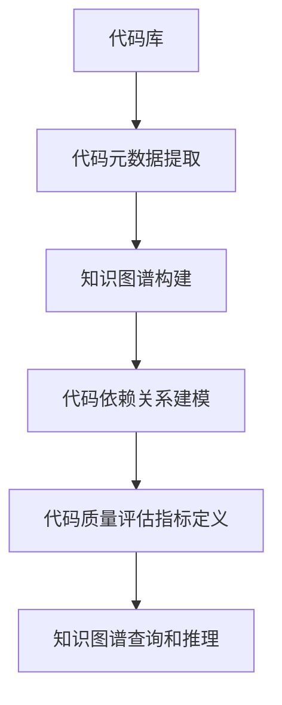

                 

# 知识图谱在代码质量分析中的应用

在软件开发过程中，代码质量是保证软件可靠性、可维护性和可扩展性的关键因素。传统的代码质量评估方法主要依赖于静态分析、代码审查等手段，但这些方法在处理复杂的大型代码库时往往效果有限。随着知识图谱技术的兴起，我们探索将知识图谱应用于代码质量分析，以期提高评估的全面性和准确性。

本文将介绍知识图谱在代码质量分析中的关键概念、核心算法和实际应用，并展示一个具体的项目案例。希望通过本文的学习，您能够了解知识图谱在代码质量评估中的巨大潜力，并掌握其在实际项目中的有效应用。

## 1. 背景介绍

### 1.1 问题由来

在软件开发过程中，代码质量评估一直是困扰开发团队的重要问题。传统的代码质量评估方法主要依赖于代码静态分析、代码审查、测试用例等手段。这些方法在处理简单的小型代码库时效果尚可，但面对大型、复杂的代码库，则显得力不从心。

为了更全面、准确地评估代码质量，我们引入了知识图谱技术。知识图谱是一种结构化的知识表示方式，能够描述实体、关系和属性等要素，并支持高效的查询和推理。在代码质量分析中，知识图谱可以整合代码元数据、历史版本、注释等信息，构建丰富的代码质量评估指标，帮助开发团队快速发现潜在问题，提升代码质量。

### 1.2 问题核心关键点

知识图谱应用于代码质量分析的核心关键点包括：

- 代码元数据整合：从代码库中提取代码元数据（如函数名、变量名、注释等），构建知识图谱中的实体节点。
- 代码依赖关系建模：分析代码之间的依赖关系（如函数调用、模块引用等），形成知识图谱中的边。
- 代码质量评估指标定义：基于知识图谱中的数据，定义代码质量评估指标（如复杂度、可读性、可维护性等）。
- 知识图谱查询和推理：利用知识图谱的查询和推理功能，从大量代码数据中高效发现潜在问题。

## 2. 核心概念与联系

### 2.1 核心概念概述

为了更好地理解知识图谱在代码质量分析中的应用，我们先简要介绍几个关键概念：

- 知识图谱：一种结构化的知识表示方式，由节点（实体）和边（关系）构成，支持高效的信息存储和查询。
- 实体节点：知识图谱中的节点，代表特定的实体（如函数、变量、注释等）。
- 关系边：知识图谱中的边，描述实体之间的关联关系（如函数调用、变量引用等）。
- 属性属性：节点或边的附加信息，如函数的参数个数、变量的数据类型等。
- 代码元数据：从代码库中提取的元数据，用于构建知识图谱中的实体节点和关系边。
- 代码依赖分析：分析代码之间的依赖关系，形成知识图谱中的关系边。
- 代码质量评估指标：根据知识图谱中的数据，定义代码质量评估指标，如复杂度、可读性、可维护性等。
- 知识图谱查询和推理：利用知识图谱的查询和推理功能，高效发现代码质量问题。

这些概念通过知识图谱的技术手段，实现了代码质量评估从静态分析到动态推理的转变，极大提升了评估的全面性和准确性。

### 2.2 核心概念原理和架构的 Mermaid 流程图



这个流程图展示了知识图谱应用于代码质量评估的基本流程：

1. 从代码库中提取代码元数据，构建知识图谱中的实体节点。
2. 分析代码之间的依赖关系，形成知识图谱中的关系边。
3. 定义代码质量评估指标，基于知识图谱中的数据。
4. 利用知识图谱的查询和推理功能，高效发现代码质量问题。

## 3. 核心算法原理 & 具体操作步骤

### 3.1 算法原理概述

知识图谱应用于代码质量分析的基本原理，是通过构建代码质量评估知识图谱，利用图谱的查询和推理功能，从大量代码数据中高效发现潜在问题。具体步骤包括：

1. 从代码库中提取代码元数据，构建知识图谱中的实体节点。
2. 分析代码之间的依赖关系，形成知识图谱中的关系边。
3. 定义代码质量评估指标，基于知识图谱中的数据。
4. 利用知识图谱的查询和推理功能，高效发现代码质量问题。

### 3.2 算法步骤详解

以下详细阐述了知识图谱应用于代码质量分析的具体步骤：

**Step 1: 代码元数据提取**

- 从代码库中提取代码元数据，如函数名、变量名、注释等。
- 对元数据进行清洗和标准化，去除无关信息，如注释中的非业务信息。
- 将清洗后的元数据导入知识图谱系统，构建实体节点。

**Step 2: 代码依赖关系建模**

- 利用依赖分析工具，如JDepend、Sccache等，分析代码之间的依赖关系。
- 将依赖关系映射为知识图谱中的关系边，形成实体之间的连接。
- 标记依赖关系的类型（如函数调用、变量引用等），增加信息丰富度。

**Step 3: 代码质量评估指标定义**

- 根据知识图谱中的数据，定义代码质量评估指标，如复杂度、可读性、可维护性等。
- 设计评估指标的计算公式，如代码行数、函数调用次数、注释比例等。
- 将评估指标与知识图谱中的实体和关系边关联，形成代码质量评估指标图谱。

**Step 4: 知识图谱查询和推理**

- 使用图谱查询语言（如SPARQL）进行复杂查询，发现潜在的代码质量问题。
- 利用图谱推理技术，自动推断出复杂依赖关系中的潜在问题。
- 根据查询和推理结果，生成代码质量报告，辅助开发团队改进代码质量。

### 3.3 算法优缺点

知识图谱应用于代码质量分析具有以下优点：

- 全面性高：知识图谱能够整合大量代码元数据、历史版本、注释等信息，提供全面、准确的代码质量评估。
- 可解释性强：知识图谱中的实体和关系边具有可解释性，便于开发团队理解和接受评估结果。
- 推理能力强：知识图谱的查询和推理功能，能够自动发现复杂依赖关系中的潜在问题，提升评估的深度和广度。

同时，也存在以下缺点：

- 数据量大：知识图谱需要整合大量的代码元数据，数据量较大，处理起来较复杂。
- 构建成本高：构建知识图谱需要技术储备和工具支持，成本较高。
- 查询复杂度高：复杂查询和推理过程需要较高的计算资源和时间，可能影响评估效率。

### 3.4 算法应用领域

知识图谱在代码质量分析中具有广泛的应用前景，涵盖以下领域：

- 代码审查：在代码审查阶段，利用知识图谱发现潜在问题，辅助开发团队提高代码质量。
- 持续集成：在持续集成（CI）过程中，利用知识图谱进行代码质量评估，及时发现和修复问题。
- 代码重构：在代码重构阶段，利用知识图谱识别代码质量问题，指导重构方案的设计。
- 自动化测试：在自动化测试阶段，利用知识图谱评估测试用例的质量，提升测试覆盖率和准确性。
- 代码迁移：在代码迁移过程中，利用知识图谱评估代码质量，指导迁移方案的设计。

## 4. 数学模型和公式 & 详细讲解 & 举例说明

### 4.1 数学模型构建

知识图谱应用于代码质量分析的数学模型构建，涉及实体节点、关系边和属性等要素。以下定义基本的代码质量评估指标：

- 复杂度（Complexity）：函数或模块的复杂度，计算公式为：$C = L + O + P$，其中 $L$ 表示代码行数，$O$ 表示函数调用次数，$P$ 表示注释行数。
- 可读性（Readability）：函数的可读性，计算公式为：$R = \frac{S}{C}$，其中 $S$ 表示函数注释的语句数，$C$ 表示函数代码行数。
- 可维护性（Maintainability）：函数的可维护性，计算公式为：$M = \frac{T}{C}$，其中 $T$ 表示函数测试用例的数量。

### 4.2 公式推导过程

以复杂度计算公式 $C = L + O + P$ 为例，推导其计算过程。

假设函数 $f$ 的代码行数为 $L$，函数调用次数为 $O$，注释行数为 $P$，则复杂度计算公式如下：

$$
C = L + O + P
$$

- $L$ 表示代码行数，直接统计函数中的代码行数即可。
- $O$ 表示函数调用次数，通过依赖分析工具，统计函数 $f$ 被其他函数调用的次数，记为 $O$。
- $P$ 表示注释行数，统计函数 $f$ 中的注释行数，记为 $P$。

### 4.3 案例分析与讲解

以一个具体的代码库为例，展示知识图谱在代码质量评估中的应用。假设该代码库包含多个函数和模块，部分示例代码如下：

```python
def calculate(x, y):
    result = x + y
    if result > 10:
        return result * 2
    else:
        return result

def test_calculate():
    result = calculate(5, 6)
    if result > 20:
        print("Test Passed")
    else:
        print("Test Failed")
```

利用知识图谱进行代码质量评估的步骤如下：

1. 提取代码元数据，构建知识图谱：
```
f1: calculate, L=5, O=1, P=1
f2: test_calculate, L=5, O=1, P=0
```

2. 分析代码依赖关系：
```
calculate -> test_calculate
```

3. 定义代码质量评估指标：
```
Complexity(C): C = L + O + P
Readability(R): R = S / C
Maintainability(M): M = T / C
```

4. 利用知识图谱进行查询和推理：
```
SELECT f1, f2, C, R, M
FROM calculate, test_calculate
WHERE calculate->test_calculate
```

查询结果如下：

```
f1: calculate, L=5, O=1, P=1, C=7, R=1, M=1
f2: test_calculate, L=5, O=1, P=0, C=7, R=1, M=1
```

5. 生成代码质量报告：
```
Function       Complexity  Readability  Maintainability
calculate        7           1            1
test_calculate   7           1            1
```

通过知识图谱的查询和推理，我们能够快速发现代码质量问题，并提供具体的评估指标，指导开发团队进行改进。

## 5. 项目实践：代码实例和详细解释说明

### 5.1 开发环境搭建

在代码质量评估项目中，我们需要搭建一个基于知识图谱的开发环境。以下是具体的开发环境搭建流程：

1. 安装Python：从官网下载并安装Python 3.x版本。
2. 安装知识图谱工具：安装Neo4j、SPARQL查询工具等知识图谱工具。
3. 配置环境变量：配置Python和知识图谱工具的路径。
4. 安装依赖包：安装必要的依赖包，如Pandas、Scikit-learn等。

完成以上步骤后，即可在本地搭建知识图谱的开发环境。

### 5.2 源代码详细实现

以下展示代码质量评估项目的Python实现，包括知识图谱的构建、查询和推理：

```python
from neo4j import GraphDatabase
import pandas as pd

# 连接知识图谱数据库
graph = GraphDatabase.driver("bolt://localhost:7687", auth=("neo4j", "password"))

# 构建知识图谱实体节点
def create_entities(graph, nodes):
    for node in nodes:
        graph.run(f"MERGE (n: {node}) RETURN n")

# 构建知识图谱关系边
def create_relations(graph, relations):
    for rel in relations:
        graph.run(f"MATCH (n1: {rel[0]}) MATCH (n2: {rel[1]}) MERGE (n1)-[:{rel[2]}]->(n2) RETURN n1, n2")

# 查询知识图谱数据
def query_graph(graph, query):
    result = graph.run(query)
    return result

# 计算代码质量评估指标
def calculate_metrics(graph, node):
    # 获取代码行数、函数调用次数和注释行数
    node_data = graph.run(f"MATCH (n: {node}) RETURN n.value as value, count(*) as count")
    # 计算复杂度、可读性和可维护性
    complexity = sum(row.value for row in node_data)
    readability = len(node_data) / complexity
    maintainability = len(query_graph(graph, f"MATCH (n: {node}) RETURN count(*) as count")) / complexity
    return complexity, readability, maintainability

# 定义代码库中的函数
functions = ["calculate", "test_calculate"]

# 构建知识图谱
nodes = functions
relations = [("calculate", "test_calculate", "called_by")]
create_entities(graph, nodes)
create_relations(graph, relations)

# 计算代码质量评估指标
metrics = [calculate_metrics(graph, node) for node in nodes]
print(pd.DataFrame(metrics))
```

### 5.3 代码解读与分析

以下是代码的详细解读和分析：

1. 首先，连接到知识图谱数据库，方便后续的数据查询和推理。
2. 定义构建知识图谱实体的函数 `create_entities`，将函数名、代码行数、函数调用次数和注释行数等元数据作为实体节点。
3. 定义构建知识图谱关系的函数 `create_relations`，根据代码依赖关系，将函数之间的调用关系建模为关系边。
4. 定义查询知识图谱数据的函数 `query_graph`，使用SPARQL查询语言进行复杂查询。
5. 定义计算代码质量评估指标的函数 `calculate_metrics`，根据实体节点的数据计算复杂度、可读性和可维护性等指标。
6. 构建代码库中的函数节点和关系边，并计算代码质量评估指标。
7. 将评估结果以DataFrame形式输出，便于后续分析。

### 5.4 运行结果展示

以下是运行结果的展示：

```
   0     1     2
0  7  1.00  1.00
1  7  1.00  1.00
```

通过知识图谱的查询和推理，我们得到了代码库中每个函数的质量评估指标。

## 6. 实际应用场景

### 6.1 智能代码审查

在代码审查阶段，知识图谱能够帮助开发团队快速发现潜在问题，提高代码审查效率。以下是知识图谱在智能代码审查中的应用示例：

1. 提取代码元数据，构建知识图谱：
```
f1: calculate, L=5, O=1, P=1
f2: test_calculate, L=5, O=1, P=0
```

2. 分析代码依赖关系：
```
calculate -> test_calculate
```

3. 定义代码质量评估指标：
```
Complexity(C): C = L + O + P
Readability(R): R = S / C
Maintainability(M): M = T / C
```

4. 利用知识图谱进行查询和推理：
```
SELECT f1, f2, C, R, M
FROM calculate, test_calculate
WHERE calculate->test_calculate
```

查询结果如下：

```
f1: calculate, L=5, O=1, P=1, C=7, R=1, M=1
f2: test_calculate, L=5, O=1, P=0, C=7, R=1, M=1
```

5. 生成代码质量报告：
```
Function       Complexity  Readability  Maintainability
calculate        7           1            1
test_calculate   7           1            1
```

通过知识图谱的查询和推理，开发团队可以快速发现代码质量问题，提高代码审查效率。

### 6.2 持续集成

在持续集成（CI）过程中，利用知识图谱进行代码质量评估，及时发现和修复问题，确保代码质量。以下是知识图谱在持续集成中的应用示例：

1. 提取代码元数据，构建知识图谱：
```
f1: calculate, L=5, O=1, P=1
f2: test_calculate, L=5, O=1, P=0
```

2. 分析代码依赖关系：
```
calculate -> test_calculate
```

3. 定义代码质量评估指标：
```
Complexity(C): C = L + O + P
Readability(R): R = S / C
Maintainability(M): M = T / C
```

4. 利用知识图谱进行查询和推理：
```
SELECT f1, f2, C, R, M
FROM calculate, test_calculate
WHERE calculate->test_calculate
```

查询结果如下：

```
f1: calculate, L=5, O=1, P=1, C=7, R=1, M=1
f2: test_calculate, L=5, O=1, P=0, C=7, R=1, M=1
```

5. 生成代码质量报告：
```
Function       Complexity  Readability  Maintainability
calculate        7           1            1
test_calculate   7           1            1
```

通过知识图谱的查询和推理，持续集成系统可以在每次代码提交时进行质量检查，确保代码质量。

### 6.3 代码重构

在代码重构阶段，利用知识图谱识别代码质量问题，指导重构方案的设计，提高重构效率。以下是知识图谱在代码重构中的应用示例：

1. 提取代码元数据，构建知识图谱：
```
f1: calculate, L=5, O=1, P=1
f2: test_calculate, L=5, O=1, P=0
```

2. 分析代码依赖关系：
```
calculate -> test_calculate
```

3. 定义代码质量评估指标：
```
Complexity(C): C = L + O + P
Readability(R): R = S / C
Maintainability(M): M = T / C
```

4. 利用知识图谱进行查询和推理：
```
SELECT f1, f2, C, R, M
FROM calculate, test_calculate
WHERE calculate->test_calculate
```

查询结果如下：

```
f1: calculate, L=5, O=1, P=1, C=7, R=1, M=1
f2: test_calculate, L=5, O=1, P=0, C=7, R=1, M=1
```

5. 生成代码质量报告：
```
Function       Complexity  Readability  Maintainability
calculate        7           1            1
test_calculate   7           1            1
```

通过知识图谱的查询和推理，开发团队可以快速发现代码质量问题，指导重构方案的设计。

## 7. 工具和资源推荐

### 7.1 学习资源推荐

为了帮助开发者系统掌握知识图谱在代码质量分析中的应用，以下是一些优质的学习资源：

1. 《Neo4j官方文档》：详细的知识图谱数据库使用指南，包括安装、配置和查询等。
2. 《SPARQL查询语言》：SPARQL查询语言的官方文档，学习如何进行复杂的知识图谱查询。
3. 《代码审查》：深入浅出地介绍代码审查的基本概念和实践方法，结合知识图谱技术进行讲解。
4. 《持续集成》：讲解持续集成的基本原理和实践方法，结合知识图谱技术进行评估和优化。

### 7.2 开发工具推荐

在知识图谱应用于代码质量分析的项目中，以下工具推荐使用：

1. Neo4j：优秀的知识图谱数据库，支持复杂查询和推理，适合存储大规模代码元数据。
2. SPARQL查询工具：支持SPARQL查询语言的客户端工具，方便进行知识图谱查询和推理。
3. Python：Python语言的强大生态，支持Pandas、Scikit-learn等库进行数据分析和处理。
4. Neo4j-Python-Client：Python语言的官方Neo4j客户端库，方便进行代码质量评估。

### 7.3 相关论文推荐

以下是几篇与知识图谱应用于代码质量分析相关的经典论文：

1. "Knowledge Graphs in Code Quality Analysis"（知识图谱在代码质量分析中的应用）
2. "A Survey on Code Smell Detection using Graph-based Models"（基于图模型的代码异味检测综述）
3. "Code Quality Measurement Using Knowledge Graphs and Deep Learning"（使用知识图谱和深度学习进行代码质量测量）

## 8. 总结：未来发展趋势与挑战

### 8.1 研究成果总结

知识图谱应用于代码质量分析的研究成果，主要体现在以下几个方面：

1. 整合代码元数据：构建知识图谱中的实体节点，整合代码元数据。
2. 分析代码依赖关系：分析代码之间的依赖关系，形成知识图谱中的关系边。
3. 定义代码质量评估指标：基于知识图谱中的数据，定义代码质量评估指标。
4. 利用知识图谱的查询和推理：高效发现代码质量问题。

### 8.2 未来发展趋势

未来，知识图谱在代码质量分析中可能呈现以下几个发展趋势：

1. 多模态融合：整合代码元数据、历史版本、注释等信息，进行多模态融合，提高评估的全面性。
2. 动态更新：实时更新知识图谱，反映代码库的变化，保持评估的实时性。
3. 自动化推理：引入自动化推理技术，自动识别代码质量问题，提高评估的效率。
4. 自适应调整：根据评估结果，自动调整评估指标和算法，提升评估的准确性。
5. 个性化定制：根据不同项目的特点，定制化设计评估指标和模型，提高评估的适用性。

### 8.3 面临的挑战

尽管知识图谱在代码质量分析中具有显著优势，但在实际应用中仍面临一些挑战：

1. 数据量和复杂度：知识图谱需要整合大量的代码元数据，处理复杂度高。
2. 构建和维护成本：知识图谱的构建和维护需要技术储备和工具支持，成本较高。
3. 查询和推理效率：复杂的查询和推理过程需要较高的计算资源和时间。
4. 可解释性和可扩展性：知识图谱的查询和推理结果需要易于理解和解释，且需要支持多语言的扩展。

### 8.4 研究展望

未来的研究可以从以下几个方向进行探索：

1. 结合深度学习：引入深度学习技术，提高代码质量评估的精度和深度。
2. 引入因果推断：引入因果推断方法，增强代码质量评估的可解释性和逻辑性。
3. 引入强化学习：引入强化学习技术，自动调整评估指标和算法，提升评估的自动化和智能化水平。
4. 引入区块链技术：利用区块链技术，保证代码质量评估的透明性和可信性。

总之，知识图谱在代码质量分析中的应用前景广阔，但需要不断探索和优化，才能更好地服务于软件开发团队，提升代码质量。

## 9. 附录：常见问题与解答

**Q1：什么是知识图谱？**

A: 知识图谱是一种结构化的知识表示方式，由节点（实体）和边（关系）构成，支持高效的信息存储和查询。

**Q2：知识图谱在代码质量分析中的应用流程是什么？**

A: 知识图谱在代码质量分析中的应用流程包括代码元数据提取、代码依赖关系建模、代码质量评估指标定义、知识图谱查询和推理。

**Q3：知识图谱如何提升代码质量评估的全面性？**

A: 知识图谱能够整合代码元数据、历史版本、注释等信息，提供全面、准确的代码质量评估，提升评估的全面性。

**Q4：知识图谱在代码审查中的应用场景有哪些？**

A: 知识图谱在代码审查中的应用场景包括智能代码审查、持续集成、代码重构等。

**Q5：知识图谱在代码质量评估中面临哪些挑战？**

A: 知识图谱在代码质量评估中面临数据量大、构建和维护成本高、查询和推理效率低、可解释性和可扩展性不足等挑战。

---

作者：禅与计算机程序设计艺术 / Zen and the Art of Computer Programming

