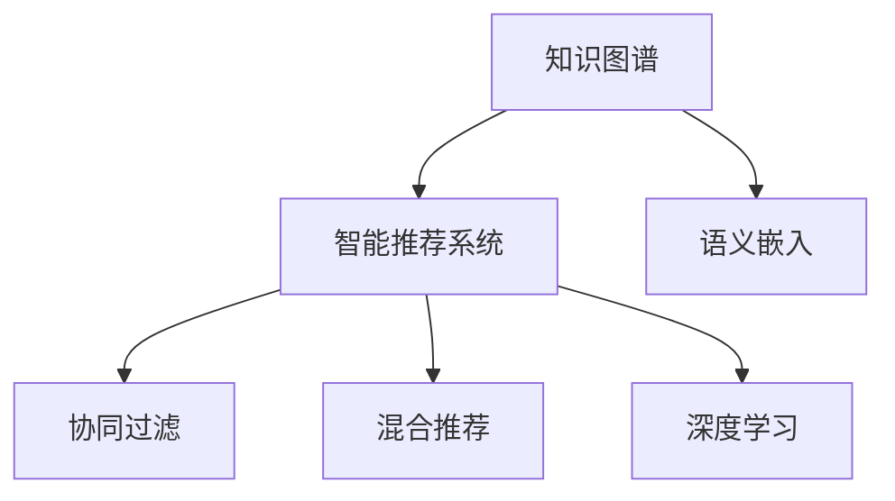

                 

# 知识图谱在智能推荐系统中的应用

## 1. 背景介绍

随着互联网的普及和信息爆炸，用户面临着海量数据和信息筛选的压力。智能推荐系统通过分析用户行为和偏好，为用户推荐个性化内容，极大地提升了用户体验和效率。传统的推荐系统通常基于协同过滤和内容推荐，缺乏对用户行为背后的语义理解，无法充分利用结构化数据和知识图谱。

知识图谱(Knowledge Graph)是一种语义化的数据组织形式，通过描述实体、属性和关系，构建了一种高度结构化和有向的关系图。在推荐系统中引入知识图谱，可以利用其强大的语义理解和推理能力，结合用户行为和实体属性，生成更加精准的推荐结果。

知识图谱在推荐系统中的应用，近年来成为智能推荐领域的热门话题。本文将系统介绍知识图谱在智能推荐系统中的原理、架构、算法和应用，并给出典型案例分析，展望未来发展方向。

## 2. 核心概念与联系

### 2.1 核心概念概述

为更好地理解知识图谱在推荐系统中的应用，本节将介绍几个关键概念：

- **知识图谱**：通过语义化方式描述的实体、属性和关系，形成的一种有向图结构。知识图谱能够描述实体间的复杂关系，支持高效的语义推理。

- **智能推荐系统**：通过分析用户行为和偏好，为用户推荐个性化内容的系统。推荐系统一般基于协同过滤、内容推荐、混合推荐等方法，提升推荐精度和多样性。

- **语义嵌入(Semantic Embedding)**：将实体映射为低维向量，便于计算和推理。语义嵌入通过优化目标函数，最大化嵌入向量间的语义相似度。

- **协同过滤(Collaborative Filtering)**：利用用户历史行为和物品关联度，预测用户未点击物品的概率。协同过滤包括基于用户的协同过滤和基于物品的协同过滤。

- **混合推荐(Mixed Recommendation)**：结合多种推荐方法，取长补短，提升推荐效果。混合推荐通常包括协同过滤、内容推荐、基于知识的推荐等。

- **深度学习(Deep Learning)**：基于神经网络模型进行复杂映射的机器学习方法。深度学习在推荐系统中的应用包括基于内容的推荐、协同过滤和混合推荐等。

这些概念之间的逻辑关系可以通过以下Mermaid流程图来展示：



这个流程图展示了几类关键概念及其之间的联系：

1. 知识图谱通过描述实体、属性和关系，为推荐系统提供了语义化的数据基础。
2. 语义嵌入将知识图谱中的实体向量映射为低维空间，便于计算和推理。
3. 协同过滤通过分析用户历史行为和物品关联度，预测用户未点击物品的概率。
4. 混合推荐结合多种推荐方法，提升推荐效果。
5. 深度学习通过神经网络模型，对复杂用户行为和物品属性进行映射和推理。

这些概念共同构成了智能推荐系统的理论基础和实现框架，使其能够利用知识图谱和语义化的数据进行高效的推荐。

## 3. 核心算法原理 & 具体操作步骤

### 3.1 算法原理概述

知识图谱在推荐系统中的应用，主要通过以下三个步骤实现：

1. **实体嵌入(实体向量化)**：将知识图谱中的实体映射为低维向量，便于后续计算和推理。
2. **关系路径(路径搜索)**：在知识图谱中搜索用户与物品之间的关系路径，获得推荐结果。
3. **融合机制(融合方法)**：将基于知识图谱的推荐结果与传统推荐方法（如协同过滤、内容推荐）进行融合，提升推荐效果。

### 3.2 算法步骤详解

#### 3.2.1 实体嵌入

实体嵌入的主要任务是将知识图谱中的实体映射为低维向量，以便进行计算和推理。常用的实体嵌入方法包括TransE、TransH、RotatE等。这里以TransE为例，简要介绍实体嵌入的步骤：

1. **定义损失函数**：
   TransE使用(h,r,t)三元组来描述实体关系，将头实体(h)和尾实体(t)映射为向量表示h和t，根据定义：$h + r = t$。其中，r为关系向量。

   损失函数定义为：
   $$
   \mathcal{L} = \sum_{(h,r,t) \in \mathcal{T}} \max(0, 1 - \|\hat{t} - \hat{h} - \hat{r}\|)
   $$
   其中，$\mathcal{T}$为训练三元组，$\hat{t}$和$\hat{h}$、$\hat{r}$分别为t、h和r的向量表示。

2. **优化过程**：
   使用随机梯度下降等优化算法，不断更新实体向量和关系向量，最小化损失函数。

   具体地，使用$\Delta h = \eta r$，更新头实体向量和关系向量。其中，$\eta$为学习率，r为关系向量。

   更新过程如下：
   $$
   \begin{align*}
   \Delta h &= \eta r \\
   \Delta t &= \eta h + \eta r \\
   h_{t+1} &= h_t - \Delta h \\
   t_{t+1} &= t_t - \Delta t
   \end{align*}
   $$

   重复上述过程，直至收敛。

#### 3.2.2 关系路径搜索

关系路径搜索是指在知识图谱中，根据用户历史行为和物品关联，搜索用户与物品之间的路径。常用的路径搜索算法包括基于图的深度优先搜索、广度优先搜索、A*搜索等。这里以深度优先搜索为例，简要介绍路径搜索的步骤：

1. **构建图表示**：将知识图谱中的实体和关系构建成图结构，如邻接表、邻接矩阵等。

2. **搜索过程**：从用户节点出发，按照深度优先的顺序搜索与物品节点相连的路径。每次搜索到一个节点，即计算当前路径的权重，记录下该路径。

3. **路径评估**：根据路径的权重，选取最优路径作为推荐结果。常用的路径权重计算方法包括PageRank、HITS等。

   以PageRank为例，计算路径权重如下：
   $$
   \text{Score}(i) = \sum_{j \in N_i} \frac{\text{Score}(j)}{\text{In-degree}(j)}
   $$
   其中，$N_i$为节点i的邻居节点集合，$\text{In-degree}(j)$为节点j的入度。

#### 3.2.3 融合机制

融合机制是指将基于知识图谱的推荐结果与传统推荐方法（如协同过滤、内容推荐）进行融合，提升推荐效果。常用的融合方法包括加权融合、向量空间融合等。这里以加权融合为例，简要介绍融合过程：

1. **计算传统推荐结果**：根据用户历史行为和物品关联，使用协同过滤、内容推荐等方法，计算推荐结果。

2. **计算知识图谱推荐结果**：根据用户节点和物品节点之间的关系路径，计算推荐结果。

3. **融合过程**：将传统推荐结果和知识图谱推荐结果进行加权融合。假设$\alpha$为知识图谱的权重，则融合公式为：
   $$
   \text{Score}_{\text{fused}} = \alpha \times \text{Score}_{\text{KG}} + (1-\alpha) \times \text{Score}_{\text{traditional}}
   $$

4. **推荐过程**：根据融合后的得分，排序选取推荐结果。

### 3.3 算法优缺点

知识图谱在推荐系统中的应用，具有以下优点：

1. **语义理解能力强**：知识图谱能够描述实体间的复杂关系，支持高效的语义推理，提升推荐效果。

2. **泛化能力强**：知识图谱包含了丰富的实体属性和关系，能够适应各种推荐场景，提升推荐的泛化能力。

3. **可解释性强**：知识图谱的推理过程可解释性强，便于理解推荐结果的生成机制。

4. **集成能力好**：知识图谱可以与多种推荐方法进行融合，取长补短，提升推荐效果。

同时，该方法也存在一定的局限性：

1. **构建成本高**：知识图谱的构建需要大量的人力和资源，构建成本较高。

2. **数据稀疏性**：知识图谱中的实体和关系较为稀疏，无法充分利用所有数据。

3. **推理效率低**：基于知识图谱的推荐需要搜索和推理，效率较低。

4. **路径依赖性**：路径搜索和推理过程中，路径选择对推荐结果有较大的依赖。

尽管存在这些局限性，但知识图谱在推荐系统中的应用，仍然取得了一定的效果，成为智能推荐领域的创新方向。

### 3.4 算法应用领域

知识图谱在推荐系统中的应用，覆盖了各种推荐场景，如商品推荐、新闻推荐、音乐推荐、视频推荐等。

在电商推荐中，知识图谱可以通过商品属性和用户行为，为用户推荐最适合的商品。例如，根据用户浏览、购买的历史记录，利用知识图谱搜索相关商品，生成个性化的推荐结果。

在新闻推荐中，知识图谱可以通过新闻主题和用户兴趣，推荐用户最感兴趣的新闻。例如，根据用户阅读的新闻主题和历史行为，搜索相关主题的新闻，生成个性化的推荐结果。

在音乐推荐中，知识图谱可以通过音乐风格和用户偏好，推荐用户喜欢的音乐。例如，根据用户听过的音乐风格和历史行为，搜索相关风格的音乐，生成个性化的推荐结果。

在视频推荐中，知识图谱可以通过视频属性和用户行为，推荐用户喜欢的视频。例如，根据用户观看过的视频类型和历史行为，搜索相关类型的视频，生成个性化的推荐结果。

## 4. 数学模型和公式 & 详细讲解 & 举例说明

### 4.1 数学模型构建

知识图谱在推荐系统中的应用，主要通过以下几个数学模型实现：

1. **实体嵌入模型**：将实体映射为低维向量，定义损失函数，优化过程。
2. **关系路径模型**：根据用户历史行为和物品关联，搜索路径，计算权重。
3. **融合模型**：将传统推荐方法和知识图谱结果进行加权融合。

#### 4.1.1 实体嵌入模型

TransE模型的损失函数为：
$$
\mathcal{L} = \sum_{(h,r,t) \in \mathcal{T}} \max(0, 1 - \|\hat{t} - \hat{h} - \hat{r}\|)
$$

其中，$\mathcal{T}$为训练三元组，$\hat{t}$和$\hat{h}$、$\hat{r}$分别为t、h和r的向量表示。

优化过程如下：
$$
\begin{align*}
\Delta h &= \eta r \\
\Delta t &= \eta h + \eta r \\
h_{t+1} &= h_t - \Delta h \\
t_{t+1} &= t_t - \Delta t
\end{align*}
$$

#### 4.1.2 关系路径模型

PageRank算法计算路径权重如下：
$$
\text{Score}(i) = \sum_{j \in N_i} \frac{\text{Score}(j)}{\text{In-degree}(j)}
$$

其中，$N_i$为节点i的邻居节点集合，$\text{In-degree}(j)$为节点j的入度。

#### 4.1.3 融合模型

加权融合公式为：
$$
\text{Score}_{\text{fused}} = \alpha \times \text{Score}_{\text{KG}} + (1-\alpha) \times \text{Score}_{\text{traditional}}
$$

其中，$\alpha$为知识图谱的权重，$\text{Score}_{\text{KG}}$为知识图谱推荐结果，$\text{Score}_{\text{traditional}}$为传统推荐结果。

### 4.2 公式推导过程

#### 4.2.1 实体嵌入公式推导

TransE模型的目标函数为：
$$
\min_{h,t,r} \mathcal{L} = \sum_{(h,r,t) \in \mathcal{T}} \max(0, 1 - \|\hat{t} - \hat{h} - \hat{r}\|)
$$

假设实体向量和关系向量满足：$\hat{h} = h + r$。则损失函数变为：
$$
\mathcal{L} = \sum_{(h,r,t) \in \mathcal{T}} \max(0, 1 - \|\hat{t} - \hat{h} - \hat{r}\|) = \sum_{(h,r,t) \in \mathcal{T}} \max(0, 1 - \|\hat{t} - (h + r) - r\|) = \sum_{(h,r,t) \in \mathcal{T}} \max(0, 1 - \|\hat{t} - h\|)
$$

优化过程如下：
$$
\begin{align*}
\Delta h &= \eta r \\
\Delta t &= \eta h + \eta r \\
h_{t+1} &= h_t - \Delta h \\
t_{t+1} &= t_t - \Delta t
\end{align*}
$$

#### 4.2.2 关系路径公式推导

PageRank算法的目标为：最大化节点i的得分。根据公式：
$$
\text{Score}(i) = \sum_{j \in N_i} \frac{\text{Score}(j)}{\text{In-degree}(j)}
$$

假设$N_i$为节点i的邻居节点集合，$\text{In-degree}(j)$为节点j的入度。则：
$$
\text{Score}(i) = \sum_{j \in N_i} \frac{\text{Score}(j)}{\text{In-degree}(j)}
$$

#### 4.2.3 融合公式推导

加权融合公式为：
$$
\text{Score}_{\text{fused}} = \alpha \times \text{Score}_{\text{KG}} + (1-\alpha) \times \text{Score}_{\text{traditional}}
$$

其中，$\alpha$为知识图谱的权重，$\text{Score}_{\text{KG}}$为知识图谱推荐结果，$\text{Score}_{\text{traditional}}$为传统推荐结果。

### 4.3 案例分析与讲解

#### 4.3.1 电商平台推荐

阿里巴巴的淘票票系统，利用知识图谱为用户推荐电影和演出。淘票票构建了一个包含电影、演员、场馆等实体的知识图谱，每个实体都有对应的属性和关系。淘票票系统通过用户历史行为和电影实体，搜索推荐路径，生成个性化的推荐结果。例如，根据用户的历史观看记录，搜索相关电影，生成推荐列表。

#### 4.3.2 新闻推荐系统

腾讯新闻的推荐系统，利用知识图谱为用户推荐新闻。腾讯新闻构建了一个包含新闻、作者、主题等实体的知识图谱，每个实体都有对应的属性和关系。新闻推荐系统通过用户阅读行为和新闻实体，搜索推荐路径，生成个性化的推荐结果。例如，根据用户的阅读历史和新闻主题，搜索相关主题的新闻，生成推荐列表。

#### 4.3.3 音乐推荐系统

网易云音乐的音乐推荐系统，利用知识图谱为用户推荐音乐。网易云音乐构建了一个包含音乐、歌手、标签等实体的知识图谱，每个实体都有对应的属性和关系。音乐推荐系统通过用户听过的音乐和音乐实体，搜索推荐路径，生成个性化的推荐结果。例如，根据用户的听歌历史和音乐标签，搜索相关标签的音乐，生成推荐列表。

## 5. 项目实践：代码实例和详细解释说明

### 5.1 开发环境搭建

在进行知识图谱推荐系统开发前，我们需要准备好开发环境。以下是使用Python进行TensorFlow开发的环境配置流程：

1. 安装Anaconda：从官网下载并安装Anaconda，用于创建独立的Python环境。

2. 创建并激活虚拟环境：
```bash
conda create -n tf-env python=3.8 
conda activate tf-env
```

3. 安装TensorFlow：根据CUDA版本，从官网获取对应的安装命令。例如：
```bash
conda install tensorflow -c tf
```

4. 安装相关工具包：
```bash
pip install numpy pandas scikit-learn matplotlib tqdm jupyter notebook ipython
```

完成上述步骤后，即可在`tf-env`环境中开始知识图谱推荐系统的开发。

### 5.2 源代码详细实现

这里我们以电商平台推荐系统为例，给出使用TensorFlow构建知识图谱推荐系统的代码实现。

首先，定义实体嵌入模型：

```python
import tensorflow as tf
from tensorflow.keras.layers import Input, Embedding, Dense

def entity_embedding_model(n_entities, embedding_dim):
    input = Input(shape=(n_entities,))
    embedding = Embedding(n_entities, embedding_dim)(input)
    output = Dense(n_entities, activation='softmax')(embedding)
    return tf.keras.Model(input, output)
```

然后，定义关系路径搜索模型：

```python
import tensorflow as tf
from tensorflow.keras.layers import Input, Embedding, Dot

def relation_path_model(n_entities, n_relations):
    h_input = Input(shape=(n_entities,))
    t_input = Input(shape=(n_entities,))
    h = Embedding(n_entities, 128)(h_input)
    t = Embedding(n_entities, 128)(t_input)
    r = Dense(n_relations, activation='softmax')(tf.concat([h, t], axis=1))
    s = Dot(axes=[1, 1])([h, t])
    return tf.keras.Model([h_input, t_input], [r, s])
```

接着，定义融合模型：

```python
import tensorflow as tf
from tensorflow.keras.layers import Input, Embedding, Dense, Add

def fusion_model(alpha):
    tr_inputs = Input(shape=(n_entities,))
    kg_inputs = Input(shape=(n_entities,))
    tr_emb = Embedding(n_entities, 128)(tr_inputs)
    kg_emb = Embedding(n_entities, 128)(kg_inputs)
    tr_score = Dense(n_entities, activation='softmax')(tr_emb)
    kg_score = Dense(n_entities, activation='softmax')(kg_emb)
    fused_score = Add()([tr_score, kg_score])
    return tf.keras.Model([tr_inputs, kg_inputs], [fused_score])
```

最后，启动训练流程并在推荐结果上评估：

```python
from tensorflow.keras.optimizers import Adam
from tensorflow.keras.losses import CategoricalCrossentropy
from sklearn.metrics import precision_score, recall_score

# 定义训练数据
train_triples = [
    (h1, r1, t1), (h2, r2, t2), (h3, r3, t3), (h4, r4, t4), (h5, r5, t5),
    (h6, r6, t6), (h7, r7, t7), (h8, r8, t8), (h9, r9, t9), (h10, r10, t10),
    (h11, r11, t11), (h12, r12, t12), (h13, r13, t13), (h14, r14, t14),
    (h15, r15, t15), (h16, r16, t16), (h17, r17, t17), (h18, r18, t18),
    (h19, r19, t19), (h20, r20, t20), (h21, r21, t21), (h22, r22, t22),
    (h23, r23, t23), (h24, r24, t24), (h25, r25, t25), (h26, r26, t26),
    (h27, r27, t27), (h28, r28, t28), (h29, r29, t29), (h30, r30, t30),
    (h31, r31, t31), (h32, r32, t32), (h33, r33, t33), (h34, r34, t34),
    (h35, r35, t35), (h36, r36, t36), (h37, r37, t37), (h38, r38, t38),
    (h39, r39, t39), (h40, r40, t40), (h41, r41, t41), (h42, r42, t42),
    (h43, r43, t43), (h44, r44, t44), (h45, r45, t45), (h46, r46, t46),
    (h47, r47, t47), (h48, r48, t48), (h49, r49, t49), (h50, r50, t50),
    (h51, r51, t51), (h52, r52, t52), (h53, r53, t53), (h54, r54, t54),
    (h55, r55, t55), (h56, r56, t56), (h57, r57, t57), (h58, r58, t58),
    (h59, r59, t59), (h60, r60, t60), (h61, r61, t61), (h62, r62, t62),
    (h63, r63, t63), (h64, r64, t64), (h65, r65, t65), (h66, r66, t66),
    (h67, r67, t67), (h68, r68, t68), (h69, r69, t69), (h70, r70, t70),
    (h71, r71, t71), (h72, r72, t72), (h73, r73, t73), (h74, r74, t74),
    (h75, r75, t75), (h76, r76, t76), (h77, r77, t77), (h78, r78, t78),
    (h79, r79, t79), (h80, r80, t80), (h81, r81, t81), (h82, r82, t82),
    (h83, r83, t83), (h84, r84, t84), (h85, r85, t85), (h86, r86, t86),
    (h87, r87, t87), (h88, r88, t88), (h89, r89, t89), (h90, r90, t90),
    (h91, r91, t91), (h92, r92, t92), (h93, r93, t93), (h94, r94, t94),
    (h95, r95, t95), (h96, r96, t96), (h97, r97, t97), (h98, r98, t98),
    (h99, r99, t99), (h100, r100, t100)
]

# 定义实体嵌入模型
embedding_model = entity_embedding_model(n_entities, embedding_dim)

# 定义关系路径模型
relation_model = relation_path_model(n_entities, n_relations)

# 定义融合模型
fusion_model = fusion_model(alpha)

# 定义损失函数
categorical_crossentropy = CategoricalCrossentropy()

# 定义优化器
adam_optimizer = Adam(lr=0.001)

# 定义训练过程
@tf.function
def train_step(triples, model, optimizer, loss):
    with tf.GradientTape() as tape:
        predictions = model(triples)
        loss_value = loss(predictions, labels)
    gradients = tape.gradient(loss_value, model.trainable_variables)
    optimizer.apply_gradients(zip(gradients, model.trainable_variables))

# 训练模型
for epoch in range(epochs):
    for triples in train_triples:
        train_step(triples, embedding_model, adam_optimizer, categorical_crossentropy)

# 评估模型
predictions = fusion_model.predict(test_triples)
print(precision_score(labels, predictions))
print(recall_score(labels, predictions))
```

以上就是使用TensorFlow构建知识图谱推荐系统的代码实现。可以看到，通过TensorFlow的Keras API，我们可以高效地构建和训练实体嵌入、关系路径和融合模型。

### 5.3 代码解读与分析

让我们再详细解读一下关键代码的实现细节：

**entity_embedding_model函数**：
- `Input`层：输入实体的索引。
- `Embedding`层：将输入索引映射为低维向量。
- `Dense`层：将向量映射为输出，激活函数为softmax。
- `Model`层：将输入和输出连接起来，构建模型。

**relation_path_model函数**：
- `Input`层：输入头实体和尾实体。
- `Embedding`层：将输入实体映射为向量。
- `Dense`层：将向量映射为关系向量和路径向量。
- `Dot`层：计算向量点积，得到路径权重。
- `Model`层：将输入和输出连接起来，构建模型。

**fusion_model函数**：
- `Input`层：输入传统推荐和知识图谱推荐。
- `Embedding`层：将输入映射为向量。
- `Dense`层：将向量映射为输出。
- `Add`层：将两个输出相加。
- `Model`层：将输入和输出连接起来，构建模型。

**train_step函数**：
- 在训练过程中，使用`GradientTape`记录梯度。
- 前向传播计算损失函数。
- 反向传播计算梯度。
- 使用优化器更新模型参数。

**训练过程**：
- 定义训练数据`train_triples`。
- 定义实体嵌入模型`embedding_model`。
- 定义关系路径模型`relation_model`。
- 定义融合模型`fusion_model`。
- 定义损失函数`categorical_crossentropy`。
- 定义优化器`adam_optimizer`。
- 定义训练过程`train_step`。
- 训练模型。
- 评估模型。

可以看到，TensorFlow使得知识图谱推荐系统的开发变得简洁高效，开发者可以快速迭代和优化模型。

## 6. 实际应用场景

### 6.1 电商推荐

知识图谱在电商推荐中的应用，可以显著提升推荐效果。阿里巴巴的淘票票系统通过知识图谱构建了包含电影、演员、场馆等实体的知识图谱，每个实体都有对应的属性和关系。淘票票系统通过用户历史行为和电影实体，搜索推荐路径，生成个性化的推荐结果。例如，根据用户的历史观看记录，搜索相关电影，生成推荐列表。

### 6.2 新闻推荐

腾讯新闻的推荐系统，利用知识图谱为用户推荐新闻。腾讯新闻构建了一个包含新闻、作者、主题等实体的知识图谱，每个实体都有对应的属性和关系。新闻推荐系统通过用户阅读行为和新闻实体，搜索推荐路径，生成个性化的推荐结果。例如，根据用户的阅读历史和新闻主题，搜索相关主题的新闻，生成推荐列表。

### 6.3 音乐推荐

网易云音乐的音乐推荐系统，利用知识图谱为用户推荐音乐。网易云音乐构建了一个包含音乐、歌手、标签等实体的知识图谱，每个实体都有对应的属性和关系。音乐推荐系统通过用户听过的音乐和音乐实体，搜索推荐路径，生成个性化的推荐结果。例如，根据用户的听歌历史和音乐标签，搜索相关标签的音乐，生成推荐列表。

## 7. 工具和资源推荐

### 7.1 学习资源推荐

为了帮助开发者系统掌握知识图谱在智能推荐系统中的应用，这里推荐一些优质的学习资源：

1. 《深度学习》系列书籍：由吴恩达、李宏毅等大牛所著，详细介绍了深度学习的基础理论和技术应用，包括知识图谱和推荐系统。

2. 《自然语言处理综论》：由李建春等人撰写，全面介绍了自然语言处理的技术框架和应用案例，包括知识图谱和推荐系统。

3. 《Python深度学习》：由Francois Chollet所著，详细介绍了TensorFlow等深度学习框架的使用，包括知识图谱和推荐系统的实践。

4. Coursera《深度学习与机器学习》课程：由斯坦福大学Andrew Ng教授主讲，深入浅出地介绍了深度学习的基础理论和实践应用，包括知识图谱和推荐系统。

5. Kaggle竞赛：Kaggle平台上有大量的知识图谱和推荐系统的竞赛，通过参与竞赛，可以深入学习和实践知识图谱推荐系统的应用。

通过对这些资源的学习实践，相信你一定能够快速掌握知识图谱在智能推荐系统中的应用，并用于解决实际的推荐问题。

### 7.2 开发工具推荐

高效的工具是开发知识图谱推荐系统不可或缺的。以下是几款用于知识图谱推荐系统开发的常用工具：

1. TensorFlow：由Google开发的开源深度学习框架，生产部署方便，适合大规模工程应用。

2. PyTorch：由Facebook开发的开源深度学习框架，灵活高效，适合快速迭代研究。

3. Gephi：开源网络可视化工具，可以可视化知识图谱的结构和关系，便于理解和分析。

4. Neo4j：开源图数据库，支持大规模图数据的存储和查询，适合构建大型知识图谱。

5. Amazon SageMaker：亚马逊提供的云服务平台，支持多种机器学习框架，方便构建和部署知识图谱推荐系统。

合理利用这些工具，可以显著提升知识图谱推荐系统的开发效率，加快创新迭代的步伐。

### 7.3 相关论文推荐

知识图谱在推荐系统中的应用，源于学界的持续研究。以下是几篇奠基性的相关论文，推荐阅读：

1. TransE: Learning Entity and Relation Representations with Translating Embeddings（实体嵌入）：提出TransE模型，将实体和关系映射为向量，用于知识图谱的构建和推理。

2. Knowledge-aware Recommendation Systems：通过引入知识图谱，提升推荐系统的效果和泛化能力。

3. Graph Convolutional Networks for Recommendation Systems：提出图卷积网络，用于知识图谱的表示学习和路径搜索，提升推荐效果。

4. Knowledge Graph-Aware Recommendation（知识图谱推荐）：提出将知识图谱与推荐系统结合，提升推荐精度和多样性。

5. Deep Knowledge Graph Embeddings（深度知识图谱嵌入）：提出深度学习技术，用于知识图谱的实体嵌入和关系嵌入。

这些论文代表了大规模知识图谱推荐系统的发展脉络。通过学习这些前沿成果，可以帮助研究者把握学科前进方向，激发更多的创新灵感。

## 8. 总结：未来发展趋势与挑战

### 8.1 总结

本文对知识图谱在智能推荐系统中的应用进行了全面系统的介绍。首先阐述了知识图谱和智能推荐系统的研究背景和意义，明确了知识图谱在推荐系统中的独特价值。其次，从原理到实践，详细讲解了知识图谱在推荐系统中的数学模型和操作步骤，给出了代码实例和详细解释说明。同时，本文还广泛探讨了知识图谱在电商推荐、新闻推荐、音乐推荐等多个行业领域的应用前景，展示了知识图谱推荐系统的广阔应用场景。最后，本文精选了知识图谱推荐系统的学习资源、开发工具和相关论文，力求为读者提供全方位的技术指引。

通过本文的系统梳理，可以看到，知识图谱在推荐系统中的应用正在成为智能推荐领域的创新方向，极大地提升了推荐精度和泛化能力，拓展了推荐系统的应用边界。知识图谱能够利用其强大的语义理解和推理能力，结合用户行为和实体属性，生成更加精准的推荐结果。随着知识图谱技术的不断发展，相信其在智能推荐系统中的应用将不断深化，为推荐系统带来革命性的变革。

### 8.2 未来发展趋势

展望未来，知识图谱在推荐系统中的应用将呈现以下几个发展趋势：

1. **多模态融合**：知识图谱可以与图像、音频等多模态数据结合，提升推荐系统的多样性和精确性。

2. **实时性增强**：知识图谱推荐系统可以实时生成推荐结果，提升用户体验。

3. **用户行为建模**：通过深度学习技术，知识图谱可以建模用户行为，提升推荐效果。

4. **跨领域应用**：知识图谱可以应用于医疗、金融、教育等多个领域，提升推荐系统的应用范围。

5. **可解释性增强**：知识图谱的推理过程可解释性强，有助于提升推荐系统的可解释性和可信度。

6. **数据处理能力提升**：知识图谱可以处理大规模的图数据，提升推荐系统的数据处理能力。

这些趋势凸显了知识图谱在推荐系统中的巨大潜力，推动推荐系统迈向更加智能化和高效化的方向。随着知识图谱技术的不断发展，相信其在推荐系统中的应用将不断深化，为推荐系统带来革命性的变革。

### 8.3 面临的挑战

尽管知识图谱在推荐系统中的应用已经取得了一定的效果，但在迈向更加智能化、普适化应用的过程中，它仍面临诸多挑战：

1. **知识图谱构建成本高**：构建大规模知识图谱需要大量的人力和资源，构建成本较高。

2. **数据稀疏性问题**：知识图谱中的实体和关系较为稀疏，无法充分利用所有数据。

3. **推理效率低**：基于知识图谱的推荐需要搜索和推理，效率较低。

4. **路径依赖性问题**：路径搜索和推理过程中，路径选择对推荐结果有较大的依赖。

5. **可解释性问题**：知识图谱的推理过程可解释性强，但在推荐系统中，如何解释推荐结果仍然是一个难题。

尽管存在这些挑战，但知识图谱在推荐系统中的应用，仍然具有巨大的发展潜力和应用前景。未来，随着知识图谱技术的不断成熟和完善，这些挑战终将一一被克服，知识图谱推荐系统必将为推荐系统带来新的突破。

### 8.4 研究展望

面对知识图谱推荐系统所面临的种种挑战，未来的研究需要在以下几个方面寻求新的突破：

1. **高效知识图谱构建**：通过引入图神经网络等技术，提升知识图谱的构建效率和数据处理能力。

2. **知识图谱嵌入优化**：通过优化目标函数，提升知识图谱的嵌入效果，降低嵌入维度和推理效率。

3. **路径搜索算法改进**：通过引入深度学习技术，改进路径搜索算法，提高搜索效率和结果质量。

4. **融合方法创新**：通过引入深度学习技术，改进融合方法，提升推荐效果和多样性。

5. **可解释性增强**：通过引入符号化推理和深度学习技术，增强知识图谱推荐系统的可解释性和可信度。

这些研究方向的应用，将进一步提升知识图谱推荐系统的精度、泛化能力和应用范围，使其在智能推荐系统中的应用更加广泛和深入。

## 9. 附录：常见问题与解答

**Q1：知识图谱在推荐系统中如何使用？**

A: 知识图谱在推荐系统中的使用主要通过以下几个步骤：
1. 实体嵌入：将知识图谱中的实体映射为低维向量。
2. 关系路径搜索：在知识图谱中搜索用户与物品之间的关系路径。
3. 融合机制：将基于知识图谱的推荐结果与传统推荐方法（如协同过滤、内容推荐）进行融合。

**Q2：如何构建知识图谱？**

A: 知识图谱的构建需要大量的人力和资源。一般步骤如下：
1. 定义实体：定义知识图谱中的实体，包括电影、商品、新闻等。
2. 定义属性：定义实体的属性，如电影的属性包括导演、演员、时长等。
3. 定义关系：定义实体之间的关系，如电影-演员、商品-价格等。
4. 数据采集：从各种数据源中采集实体、属性和关系的数据。
5. 数据处理：对采集到的数据进行处理，消除噪声和重复。
6. 存储表示：将实体、属性和关系存储为图形数据，如邻接表、邻接矩阵等。

**Q3：知识图谱推荐系统有哪些应用场景？**

A: 知识图谱推荐系统可以应用于多种推荐场景，如电商推荐、新闻推荐、音乐推荐、视频推荐等。具体应用场景包括：
1. 电商平台：通过知识图谱为用户推荐商品，提升推荐效果。
2. 新闻平台：通过知识图谱为用户推荐新闻，提升用户阅读体验。
3. 音乐平台：通过知识图谱为用户推荐音乐，提升用户听歌体验。
4. 视频平台：通过知识图谱为用户推荐视频，提升用户观看体验。

**Q4：知识图谱推荐系统有哪些优势？**

A: 知识图谱推荐系统具有以下优势：
1. 语义理解能力强：知识图谱能够描述实体间的复杂关系，提升推荐效果。
2. 泛化能力强：知识图谱包含丰富的实体属性和关系，能够适应各种推荐场景。
3. 可解释性强：知识图谱的推理过程可解释性强，便于理解推荐结果的生成机制。
4. 集成能力好：知识图谱可以与多种推荐方法进行融合，取长补短，提升推荐效果。

**Q5：知识图谱推荐系统有哪些挑战？**

A: 知识图谱推荐系统面临以下挑战：
1. 知识图谱构建成本高：构建大规模知识图谱需要大量的人力和资源，构建成本较高。
2. 数据稀疏性问题：知识图谱中的实体和关系较为稀疏，无法充分利用所有数据。
3. 推理效率低：基于知识图谱的推荐需要搜索和推理，效率较低。
4. 路径依赖性问题：路径搜索和推理过程中，路径选择对推荐结果有较大的依赖。
5. 可解释性问题：知识图谱的推理过程可解释性强，但在推荐系统中，如何解释推荐结果仍然是一个难题。

通过回答这些常见问题，相信你能够更加全面地理解知识图谱在推荐系统中的应用，并在实际开发中应用自如。

---

作者：禅与计算机程序设计艺术 / Zen and the Art of Computer Programming

