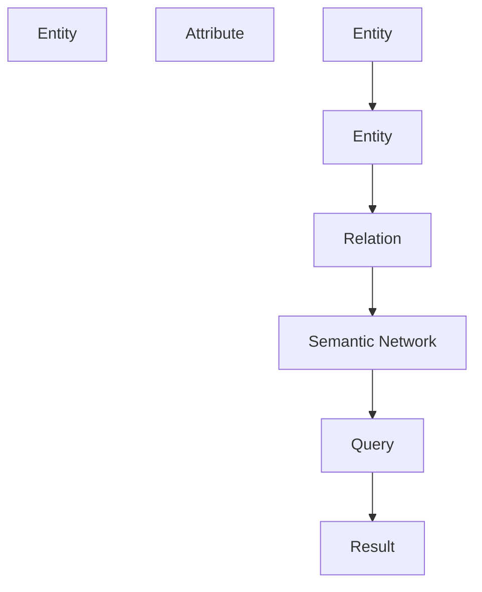

                 

# 知识图谱在知识发现引擎中的应用

## 1. 背景介绍

### 1.1 问题由来
在当今信息爆炸的时代，如何从海量的文本数据中高效提取有价值的知识，构建知识图谱，并利用知识图谱进行知识发现，成为了一个备受关注的问题。传统的方法如搜索引擎、信息抽取、知识图谱构建等已经相对成熟，但仍然存在以下局限性：

- **效率低下**：在海量文本数据中抽取知识需要耗费大量的时间和人力。
- **准确度不足**：自动抽取的实体和关系往往存在噪音和歧义。
- **泛化能力弱**：现有的知识抽取和构建方法难以处理新领域和新概念。
- **孤立性**：知识图谱通常孤立地构建和查询，缺乏与上下文的关联。

为了解决这些问题，知识发现引擎应运而生。知识发现引擎通过自动构建、更新和查询知识图谱，实现从文本数据中抽取、关联、推理和应用知识，具有高效、准确、泛化性强、具备上下文关联等优点。其中，知识图谱作为核心组件，发挥着至关重要的作用。

### 1.2 问题核心关键点
知识图谱是知识发现引擎的基础，其核心思想是构建一个结构化的语义网络，将现实世界中的实体及其相互关系映射到计算机可处理的形式。知识图谱的构建和查询涉及以下关键问题：

1. **实体抽取和关系抽取**：从文本中自动抽取实体和实体之间的关系。
2. **知识融合与更新**：整合异构数据源和新的知识，更新现有知识图谱。
3. **语义推理与查询**：基于知识图谱进行复杂的语义推理，实现基于查询的智能问答。
4. **上下文关联**：利用上下文信息增强知识图谱的泛化能力，提高查询精度。

## 2. 核心概念与联系

### 2.1 核心概念概述

知识图谱是一个由实体、关系和属性构成的语义网络。每个实体表示现实世界中的一个对象，关系表示实体之间的关联，属性表示实体的特征。知识图谱构建和查询通常涉及以下几个核心概念：

- **实体（Entity）**：指现实世界中的对象，如人名、地点、组织等。
- **关系（Relation）**：指实体之间的连接，如“工作于”、“属于”、“领导”等。
- **属性（Attribute）**：指实体的特征，如“年龄”、“性别”、“职业”等。
- **语义网络（Semantic Network）**：指由实体、关系和属性构成的语义结构。
- **知识图谱（Knowledge Graph）**：指大规模的语义网络，包含大量实体、关系和属性的知识。

### 2.2 核心概念原理和架构的 Mermaid 流程图



这个流程图展示了知识图谱的基本构成和应用流程：实体和关系构成语义网络，语义网络构成知识图谱，知识图谱通过查询产生结果。

## 3. 核心算法原理 & 具体操作步骤

### 3.1 算法原理概述

知识图谱的构建和查询涉及深度学习和自然语言处理（NLP）等多种技术，主要包括实体抽取、关系抽取、知识融合与更新、语义推理与查询等。这些技术的核心算法包括：

- **命名实体识别（Named Entity Recognition, NER）**：从文本中识别出具体的实体。
- **依存句法分析（Dependency Parsing）**：分析句子中单词之间的依赖关系，帮助抽取关系。
- **语义表示学习（Semantic Representation Learning）**：学习实体的语义表示，方便进行关系抽取和语义推理。
- **知识融合与更新（Knowledge Integration and Updating）**：整合异构数据源和新知识，更新现有知识图谱。
- **基于知识图谱的推理（Reasoning over Knowledge Graphs）**：基于知识图谱进行复杂的语义推理，支持智能问答和自动生成文本。

### 3.2 算法步骤详解

#### 3.2.1 实体抽取

实体抽取是知识图谱构建的第一步，通常采用以下两种方法：

1. **规则基方法**：
   - **步骤1**：定义一组规则，识别出符合规则的实体。
   - **步骤2**：通过规则匹配，将文本中符合规则的部分抽取为实体。
   - **步骤3**：去除重复和噪音实体，得到最终抽取结果。

2. **深度学习方法**：
   - **步骤1**：构建深度学习模型，如CRF、BiLSTM-CRF等，进行实体标注。
   - **步骤2**：使用标注结果训练模型，得到更加准确的实体识别结果。
   - **步骤3**：通过后处理，去除低置信度和噪音实体，得到最终抽取结果。

#### 3.2.2 关系抽取

关系抽取通常采用以下两种方法：

1. **模板匹配**：
   - **步骤1**：定义一组关系模板，如“工作于”、“属于”等。
   - **步骤2**：在文本中匹配模板，识别出符合模板的关系。
   - **步骤3**：去除重复和噪音关系，得到最终抽取结果。

2. **深度学习方法**：
   - **步骤1**：构建深度学习模型，如LSTM-CRF、BiLSTM-CRF等，进行关系标注。
   - **步骤2**：使用标注结果训练模型，得到更加准确的关系识别结果。
   - **步骤3**：通过后处理，去除低置信度和噪音关系，得到最终抽取结果。

#### 3.2.3 知识融合与更新

知识融合与更新通常采用以下两种方法：

1. **规则基方法**：
   - **步骤1**：定义一组融合规则，如“若两个实体的类型相同，则将它们合并为一个实体”。
   - **步骤2**：根据融合规则，对知识图谱进行整合。
   - **步骤3**：更新知识图谱，添加新的实体和关系。

2. **深度学习方法**：
   - **步骤1**：构建深度学习模型，如Neural Schema Matching（NSM）等，进行知识融合。
   - **步骤2**：使用标注结果训练模型，得到更加准确的融合结果。
   - **步骤3**：更新知识图谱，添加新的实体和关系。

#### 3.2.4 语义推理与查询

语义推理与查询通常采用以下两种方法：

1. **基于图算法**：
   - **步骤1**：构建图表示的语义网络。
   - **步骤2**：使用图算法，如PageRank、DeepWalk等，进行语义推理。
   - **步骤3**：根据推理结果，生成查询结果。

2. **基于深度学习**：
   - **步骤1**：构建深度学习模型，如Graph Neural Networks（GNNs）等，进行语义推理。
   - **步骤2**：使用推理结果训练模型，得到更加准确的推理结果。
   - **步骤3**：根据推理结果，生成查询结果。

### 3.3 算法优缺点

知识图谱构建和查询涉及多种技术，每种技术的优缺点如下：

- **实体抽取**：
  - **优点**：规则基方法适用于标准化数据的抽取，速度快；深度学习方法适用于复杂数据的抽取，准确度高。
  - **缺点**：规则基方法需要人工定义规则，难以处理复杂多样化的数据；深度学习方法需要大量标注数据，训练成本高。

- **关系抽取**：
  - **优点**：模板匹配适用于已知关系抽取，速度快；深度学习方法适用于未知关系抽取，准确度高。
  - **缺点**：模板匹配依赖于人工定义的模板，难以处理未知关系；深度学习方法需要大量标注数据，训练成本高。

- **知识融合与更新**：
  - **优点**：规则基方法适用于同构数据的融合，速度快；深度学习方法适用于异构数据的融合，准确度高。
  - **缺点**：规则基方法需要人工定义规则，难以处理复杂多样的数据；深度学习方法需要大量标注数据，训练成本高。

- **语义推理与查询**：
  - **优点**：基于图算法适用于大规模语义网络的推理，速度快；基于深度学习适用于复杂语义网络的推理，准确度高。
  - **缺点**：基于图算法需要大量计算资源，推理速度慢；基于深度学习需要大量标注数据，训练成本高。

### 3.4 算法应用领域

知识图谱技术在多个领域都有广泛的应用，主要包括：

- **医疗领域**：构建疾病、药物、基因等知识图谱，支持智能诊断和治疗。
- **金融领域**：构建金融市场、公司、客户等知识图谱，支持风险评估和反欺诈。
- **电商领域**：构建商品、用户、评论等知识图谱，支持个性化推荐和市场分析。
- **旅游领域**：构建景点、酒店、交通等知识图谱，支持旅游规划和推荐。
- **法律领域**：构建法律案例、法规、判决等知识图谱，支持法律咨询和案件分析。

## 4. 数学模型和公式 & 详细讲解 & 举例说明

### 4.1 数学模型构建

知识图谱的构建和查询涉及多种数学模型，以下以实体抽取为例进行详细讲解。

假设实体抽取任务为从文本中识别出具体的人名（Person）、地名（Location）和组织名（Organization）。设文本序列为 $X = \{x_1, x_2, ..., x_n\}$，其中 $x_i$ 为第 $i$ 个单词。设实体标签序列为 $Y = \{y_1, y_2, ..., y_n\}$，其中 $y_i \in \{P, L, O\}$ 表示 $x_i$ 的实体类型。则实体抽取任务可表示为序列标注问题。

采用CRF模型进行实体抽取，设 $\theta$ 为模型参数，则预测标签序列的概率分布为：

$$
P(Y|X;\theta) = \prod_{i=1}^n P(y_i|x_i;\theta)
$$

其中，$P(y_i|x_i;\theta)$ 表示给定输入 $x_i$ 和参数 $\theta$，预测标签 $y_i$ 的条件概率。

### 4.2 公式推导过程

以CRF模型为例，其参数 $\theta$ 包括特征函数 $\phi_i$ 和转移概率 $a_i$，具体推导如下：

1. **特征函数**：
   - 设定特征函数为 $\phi_i = (\phi_i^c, \phi_i^r, \phi_i^p)$，其中：
     - $\phi_i^c$：单词特征，如单词本身、词性等。
     - $\phi_i^r$：上下文特征，如相邻单词、前后空格等。
     - $\phi_i^p$：前向和后向平滑概率，防止过拟合。

   特征函数可以表示为：

   $$
   \phi_i = \left[ \begin{array}{c}
   w^c \cdot c_i \\
   w^r \cdot r_i \\
   w^p \cdot p_i
   \end{array} \right]
   $$

2. **转移概率**：
   - 设定转移概率 $a_i = (a_i^c, a_i^r, a_i^p)$，其中：
     - $a_i^c$：前后标签连续概率。
     - $a_i^r$：前后标签不连续概率。
     - $a_i^p$：前后标签平滑概率。

   转移概率可以表示为：

   $$
   a_i = \left[ \begin{array}{c}
   b_i \cdot c_i \\
   b_i \cdot r_i \\
   b_i \cdot p_i
   \end{array} \right]
   $$

   其中，$b_i$ 为平滑概率，通常取 $b_i = \frac{1}{V}$，$V$ 为标签的数目。

3. **概率分布**：
   - 设 $Z$ 为归一化因子，则标签序列 $Y$ 的条件概率为：

   $$
   P(Y|X;\theta) = \frac{\exp \sum_{i=1}^n \left[ \phi_i + a_i(y_{i-1}, y_i) \right]}{Z}
   $$

4. **最大化似然估计**：
   - 使用似然函数最大化准则，对模型参数 $\theta$ 进行训练，即：

   $$
   \theta^* = \mathop{\arg\max}_{\theta} P(Y|X;\theta)
   $$

   常用的优化算法包括EM算法、最大似然估计等。

### 4.3 案例分析与讲解

以维基百科中的句子为例：

- **输入文本**："北京是中国的首都。"
- **实体抽取结果**：[北京-PER, 中国-ORG]

该句子中，通过命名实体识别模型，成功识别出“北京”和“中国”两个实体，并标注出它们的类型分别为人名和组织名。该过程包括特征提取、模型计算和后处理三个步骤。

## 5. 项目实践：代码实例和详细解释说明

### 5.1 开发环境搭建

在进行知识图谱构建和查询实践前，需要先搭建开发环境。以下是在Python中使用NLTK和spaCy进行实体抽取和关系抽取的开发环境配置流程：

1. 安装Anaconda：从官网下载并安装Anaconda，用于创建独立的Python环境。

2. 创建并激活虚拟环境：
   ```bash
   conda create -n nlp-env python=3.8 
   conda activate nlp-env
   ```

3. 安装依赖包：
   ```bash
   pip install nltk spacy
   ```

4. 下载语料库和模型：
   ```bash
   python -m spacy download en_core_web_sm
   python -m spacy download en_core_web_md
   ```

完成上述步骤后，即可在 `nlp-env` 环境中开始知识图谱构建和查询实践。

### 5.2 源代码详细实现

以下代码展示了使用NLTK和spaCy进行实体抽取的Python实现。

```python
import nltk
from spacy import displacy
from spacy.lang.en import English

# 下载并加载英文模型
nlp = English()

# 处理输入文本
doc = nlp("Barack Obama was born in Hawaii.")

# 抽取命名实体
entities = [(ent.text, ent.label_) for ent in doc.ents]
print(entities)

# 可视化实体抽取结果
displacy.render(doc, style="ent", jupyter=True)
```

在上述代码中，首先通过 `spacy` 库加载英文模型，然后处理输入文本，抽取命名实体并打印输出。最后使用 `displacy` 库可视化实体抽取结果。

### 5.3 代码解读与分析

**NLTK命名实体识别（NER）**：
- **步骤1**：定义词性标注器 `nltk.pos_tag`，将单词和词性标注出来。
- **步骤2**：定义命名实体识别器 `nltk.ne_chunk`，对标注结果进行命名实体识别。
- **步骤3**：定义实体标注器 `nltk.chunk.ne_chunk`，将命名实体进行分组。

**spaCy命名实体识别（NER）**：
- **步骤1**：加载英文模型 `nlp.load("en_core_web_sm")`，初始化命名实体识别器。
- **步骤2**：对输入文本进行处理，`doc = nlp("Barack Obama was born in Hawaii.")`。
- **步骤3**：抽取命名实体，`doc.ents` 返回所有命名实体及其标签。
- **步骤4**：可视化命名实体抽取结果，`displacy.render(doc, style="ent", jupyter=True)`。

通过以上代码，我们可以看到，在Python中使用NLTK和spaCy进行实体抽取非常简洁高效，适合进行快速实验和开发。

## 6. 实际应用场景

### 6.1 智能问答系统

智能问答系统通过知识图谱的构建和查询，实现对自然语言问题的自动回答。以下是一个智能问答系统的示例：

1. **知识图谱构建**：从维基百科等开放数据源中抽取实体和关系，构建知识图谱。
2. **用户输入**：用户输入自然语言问题，如“美国的首都是哪里？”。
3. **实体识别和关系抽取**：系统对用户输入进行实体识别和关系抽取。
4. **语义推理**：根据知识图谱进行语义推理，找到问题答案。
5. **答案生成**：生成并输出答案，如“美国的首都是华盛顿。”

智能问答系统的实现步骤如下：

1. **知识图谱构建**：使用 `nltk` 和 `spaCy` 库进行实体抽取和关系抽取，构建知识图谱。
2. **知识融合与更新**：定期从开放数据源中更新知识图谱。
3. **用户输入处理**：对用户输入进行分词、词性标注、命名实体识别等预处理。
4. **实体识别和关系抽取**：使用深度学习模型对用户输入进行实体识别和关系抽取。
5. **语义推理**：使用基于图算法或深度学习模型的推理算法进行语义推理，找到问题答案。
6. **答案生成**：根据推理结果生成答案，并输出给用户。

### 6.2 推荐系统

推荐系统通过知识图谱的构建和查询，实现对用户行为的智能分析，生成个性化推荐。以下是一个推荐系统的示例：

1. **知识图谱构建**：从电商网站等数据源中抽取商品、用户和评论等实体和关系，构建知识图谱。
2. **用户行为分析**：记录用户浏览、点击、购买等行为，进行用户画像分析。
3. **知识融合与更新**：定期从电商网站等数据源中更新知识图谱。
4. **用户画像构建**：对用户行为进行分析，生成用户画像。
5. **推荐生成**：根据用户画像和知识图谱进行推荐生成。
6. **推荐展示**：将推荐结果展示给用户，供用户选择。

推荐系统的实现步骤如下：

1. **知识图谱构建**：使用 `nltk` 和 `spaCy` 库进行实体抽取和关系抽取，构建知识图谱。
2. **用户行为分析**：对用户行为数据进行分析和处理，生成用户画像。
3. **知识融合与更新**：定期从电商网站等数据源中更新知识图谱。
4. **推荐生成**：使用基于图算法或深度学习模型的推荐算法进行推荐生成。
5. **推荐展示**：将推荐结果展示给用户，供用户选择。

### 6.3 金融风险管理

金融风险管理通过知识图谱的构建和查询，实现对金融市场的智能分析，规避风险。以下是一个金融风险管理的示例：

1. **知识图谱构建**：从金融市场等数据源中抽取公司、股票、基金等实体和关系，构建知识图谱。
2. **市场分析**：分析金融市场的数据，如股票价格、市场波动等。
3. **知识融合与更新**：定期从金融市场等数据源中更新知识图谱。
4. **风险评估**：根据知识图谱进行风险评估，如识别出高风险股票。
5. **风险预警**：根据风险评估结果进行风险预警，如触发止损策略。

金融风险管理的实现步骤如下：

1. **知识图谱构建**：使用 `nltk` 和 `spaCy` 库进行实体抽取和关系抽取，构建知识图谱。
2. **市场分析**：对金融市场数据进行分析，生成市场分析报告。
3. **知识融合与更新**：定期从金融市场等数据源中更新知识图谱。
4. **风险评估**：使用基于图算法或深度学习模型的风险评估算法进行风险评估，如识别出高风险股票。
5. **风险预警**：根据风险评估结果进行风险预警，如触发止损策略。

## 7. 工具和资源推荐

### 7.1 学习资源推荐

为了帮助开发者系统掌握知识图谱构建和查询的理论基础和实践技巧，这里推荐一些优质的学习资源：

1. 《知识图谱：理论、技术与应用》系列书籍：详细介绍了知识图谱的理论基础和多种构建与查询技术。
2. 《Graph Neural Networks: A Survey》论文：全面总结了图神经网络的最新研究进展和应用场景。
3 《NLP with Python》书籍：介绍了如何使用Python进行NLP任务的开发，包括实体抽取、关系抽取等知识图谱构建方法。
4 《Knowledge Graphs for Business Intelligence》报告：介绍了知识图谱在商业智能中的应用，包括推荐系统、智能问答等。
5 《Practical Natural Language Processing》书籍：介绍了NLP的多种实践技术，包括命名实体识别、关系抽取等知识图谱构建方法。

通过对这些资源的学习实践，相信你一定能够快速掌握知识图谱构建和查询的精髓，并用于解决实际的NLP问题。

### 7.2 开发工具推荐

知识图谱的构建和查询涉及多种工具，以下推荐一些常用的工具：

1. NLTK：Python自然语言处理库，支持实体抽取、关系抽取等NLP任务。
2. spaCy：Python自然语言处理库，支持命名实体识别、依存句法分析等NLP任务。
3. Stanford CoreNLP：Java自然语言处理库，支持实体抽取、关系抽取等NLP任务。
4. GATE：Java自然语言处理框架，支持命名实体识别、关系抽取等NLP任务。
5. Google NLP API：Google提供的自然语言处理API，支持实体抽取、关系抽取等NLP任务。

合理利用这些工具，可以显著提升知识图谱构建和查询任务的开发效率，加快创新迭代的步伐。

### 7.3 相关论文推荐

知识图谱构建和查询涉及多种研究论文，以下推荐一些关键论文：

1. Canonical Feature Extractor Network for Enhanced Relation Prediction（ACL 2018）：提出了一种特征抽取网络，用于增强关系预测。
2. Knowledge Graph Embeddings（IJCAI 2015）：提出了一种知识图谱嵌入方法，用于优化实体和关系表示。
3. Neural Schema Matching（TODS 2017）：提出了一种神经网络模型，用于知识融合与更新。
4. Topic-Based Named Entity Recognition with Distributed Representation（ACL 2015）：提出了一种基于主题的命名实体识别方法，用于构建知识图谱。
5. Scalable Knowledge Graph Representation Learning with Efficient Object-agnostic Graph Neural Networks（ICML 2019）：提出了一种高效的知识图谱表示学习算法，用于构建大规模知识图谱。

这些论文代表了大规模知识图谱构建和查询技术的发展脉络。通过学习这些前沿成果，可以帮助研究者把握学科前进方向，激发更多的创新灵感。

## 8. 总结：未来发展趋势与挑战

### 8.1 总结

本文对知识图谱构建和查询的方法进行了全面系统的介绍。首先阐述了知识图谱构建和查询的重要性，明确了知识图谱在知识发现引擎中的核心地位。其次，从原理到实践，详细讲解了知识图谱构建和查询的数学模型和关键步骤，给出了知识图谱构建和查询的完整代码实例。同时，本文还广泛探讨了知识图谱在智能问答、推荐系统、金融风险管理等多个领域的应用前景，展示了知识图谱技术的广泛适用性和巨大潜力。最后，本文精选了知识图谱构建和查询的学习资源、开发工具和相关论文，力求为读者提供全方位的技术指引。

通过本文的系统梳理，可以看到，知识图谱构建和查询技术正在成为智能问答、推荐系统等领域的重要范式，极大地拓展了知识图谱的应用边界，催生了更多的落地场景。受益于大规模数据和深度学习技术的进步，知识图谱构建和查询正在逐步从研究实验室走向实际应用，为人工智能技术的发展提供了新的动力。

### 8.2 未来发展趋势

展望未来，知识图谱构建和查询技术将呈现以下几个发展趋势：

1. **数据驱动**：知识图谱构建和查询将更多依赖于大规模数据的驱动，从传统的专家知识到数据驱动的知识获取。
2. **自动化构建**：知识图谱构建将更多依赖于自动化技术，从手动标注到自动抽取，提高构建效率和准确性。
3. **动态更新**：知识图谱将更多依赖于动态更新机制，从静态图谱到动态图谱，提高知识的时效性和普适性。
4. **融合多模态数据**：知识图谱构建和查询将更多融合多模态数据，从文本到图像、语音等，提高知识图谱的全面性和可用性。
5. **跨领域应用**：知识图谱构建和查询将更多应用于跨领域场景，从单一领域到跨领域，提高知识图谱的泛化能力和适用性。

以上趋势凸显了知识图谱构建和查询技术的广阔前景。这些方向的探索发展，必将进一步提升知识图谱系统的性能和应用范围，为构建智能系统提供新的技术路径。

### 8.3 面临的挑战

尽管知识图谱构建和查询技术已经取得了瞩目成就，但在迈向更加智能化、普适化应用的过程中，它仍面临诸多挑战：

1. **数据质量问题**：知识图谱构建和查询依赖于高质量的数据源，如何从海量数据中筛选出有价值的数据，是一个重要挑战。
2. **噪声和歧义**：自动抽取的实体和关系往往存在噪音和歧义，如何降低噪音和解决歧义，是一个重要挑战。
3. **跨领域融合**：知识图谱在不同领域中的应用，需要跨领域融合，如何实现领域知识的有效整合，是一个重要挑战。
4. **模型可解释性**：知识图谱模型的决策过程通常缺乏可解释性，如何增强模型可解释性，是一个重要挑战。
5. **实时性和性能**：大规模知识图谱的构建和查询，需要高实时性和高性能，如何优化模型结构和算法，是一个重要挑战。

这些挑战需要我们持续创新和优化，才能使知识图谱技术更好地服务于实际应用。

### 8.4 研究展望

面对知识图谱构建和查询技术所面临的种种挑战，未来的研究需要在以下几个方面寻求新的突破：

1. **跨领域知识融合**：利用跨领域知识，增强知识图谱的泛化能力和适用性。
2. **知识图谱嵌入**：使用知识图谱嵌入技术，优化实体和关系的表示，提高知识图谱的质量。
3. **知识图谱推理**：利用知识图谱推理技术，实现高效的语义推理和知识发现。
4. **多模态知识融合**：融合多模态数据，提高知识图谱的全面性和可用性。
5. **知识图谱动态更新**：利用动态更新机制，提高知识图谱的时效性和普适性。
6. **知识图谱模型优化**：优化知识图谱模型结构和算法，提高知识图谱的实时性和性能。

这些研究方向的探索，必将引领知识图谱构建和查询技术迈向更高的台阶，为构建安全、可靠、可解释、可控的智能系统提供新的动力。面向未来，知识图谱构建和查询技术还需要与其他人工智能技术进行更深入的融合，如知识表示、因果推理、强化学习等，多路径协同发力，共同推动自然语言理解和智能交互系统的进步。

## 9. 附录：常见问题与解答

**Q1：知识图谱构建和查询需要大量标注数据，如何降低标注成本？**

A: 知识图谱构建和查询依赖于高质量的标注数据，降低标注成本可以从以下几个方面入手：

1. **利用众包标注**：利用众包平台进行标注，如Amazon Mechanical Turk等，可以显著降低标注成本。
2. **自动生成标注**：利用现有的标注数据，自动生成新的标注数据，如利用数据生成算法自动生成实体关系数据。
3. **半监督学习**：利用未标注数据和少量标注数据，使用半监督学习方法进行标注，如利用半监督学习算法自动生成标注数据。
4. **知识图谱共享**：利用现有的知识图谱数据，共享并利用已有数据源，避免重复标注。

这些方法可以显著降低知识图谱构建和查询的标注成本，提升标注效率。

**Q2：知识图谱的构建和查询涉及多种算法和技术，如何选择合适的算法？**

A: 知识图谱的构建和查询涉及多种算法和技术，选择合适的算法需要考虑以下几个方面：

1. **任务类型**：根据任务类型选择合适的算法，如实体抽取、关系抽取、语义推理等。
2. **数据特点**：根据数据特点选择合适的算法，如数据的多样性、领域性等。
3. **模型复杂度**：根据模型复杂度选择合适的算法，如模型的深度、参数量等。
4. **性能要求**：根据性能要求选择合适的算法，如模型的准确性、实时性等。

常用的算法包括：

1. **命名实体识别（NER）**：CRF、BiLSTM-CRF、BERT等。
2. **关系抽取（Relation Extraction）**：模板匹配、神经网络等。
3. **知识融合与更新（Knowledge Integration and Updating）**：NSM、GNNs等。
4. **基于图算法**：PageRank、DeepWalk等。
5. **基于深度学习**：GNNs、GraphSAGE等。

选择合适的算法需要综合考虑任务类型、数据特点、模型复杂度和性能要求等因素，以达到最优的构建和查询效果。

**Q3：知识图谱的构建和查询涉及多种技术，如何实现跨领域融合？**

A: 知识图谱的跨领域融合是一个重要研究方向，实现跨领域融合可以从以下几个方面入手：

1. **领域映射**：将不同领域的数据进行映射，如通过领域映射算法将金融领域的实体映射到医疗领域的实体。
2. **知识融合**：将不同领域的知识进行融合，如通过知识融合算法将金融领域和医疗领域的数据进行整合。
3. **多源数据融合**：将多个数据源的数据进行融合，如通过多源数据融合算法将金融领域和医疗领域的数据进行整合。
4. **跨领域表示学习**：通过跨领域表示学习算法，将不同领域的知识进行表示学习，如利用跨领域表示学习算法将金融领域和医疗领域的数据进行整合。

常用的方法包括：

1. **领域映射**：使用领域映射算法进行跨领域映射，如Label Space Alignment、Cross-domain Alignment等。
2. **知识融合**：使用知识融合算法进行跨领域融合，如NSM、GNNs等。
3. **多源数据融合**：使用多源数据融合算法进行跨领域融合，如Multi-Graph Fusion、Multi-view Graph Fusion等。
4. **跨领域表示学习**：使用跨领域表示学习算法进行跨领域融合，如Transductive Multi-view Embedding、Cross-domain Representation Learning等。

这些方法可以显著提高知识图谱的跨领域融合能力，增强知识图谱的泛化能力和适用性。

**Q4：知识图谱的构建和查询涉及多种技术，如何提高知识图谱的可解释性？**

A: 知识图谱的可解释性是一个重要研究方向，提高知识图谱的可解释性可以从以下几个方面入手：

1. **可视化表示**：通过可视化表示，使知识图谱更加直观和可理解。
2. **可解释性模型**：使用可解释性模型进行知识图谱构建和查询，如可解释性神经网络、可解释性图神经网络等。
3. **推理可解释性**：通过推理可解释性，使知识图谱的推理过程更加透明和可解释。
4. **上下文关联**：通过上下文关联，使知识图谱的推理过程更加合理和可解释。

常用的方法包括：

1. **可视化表示**：使用可视化工具，如Gephi、Cytoscape等，将知识图谱可视化展示。
2. **可解释性模型**：使用可解释性模型，如LIME、SHAP等，进行知识图谱的解释和理解。
3. **推理可解释性**：使用推理可解释性方法，如Path Mining、Graph Path Analysis等，使知识图谱的推理过程更加透明和可解释。
4. **上下文关联**：利用上下文信息，如时间、地点、人物等，增强知识图谱的可解释性。

这些方法可以显著提高知识图谱的可解释性，增强知识图谱的透明度和可信度。

**Q5：知识图谱的构建和查询涉及多种技术，如何提高知识图谱的实时性和性能？**

A: 知识图谱的实时性和性能是一个重要研究方向，提高知识图谱的实时性和性能可以从以下几个方面入手：

1. **高效算法**：使用高效算法进行知识图谱构建和查询，如图神经网络、深度学习等。
2. **分布式计算**：使用分布式计算进行知识图谱构建和查询，如MapReduce、Spark等。
3. **模型压缩**：使用模型压缩技术，如知识蒸馏、模型剪枝等，提高知识图谱的实时性和性能。
4. **缓存机制**：使用缓存机制，如Redis、Memcached等，提高知识图谱的访问速度和效率。

常用的方法包括：

1. **高效算法**：使用高效算法，如GraphSAGE、GNNs等，进行知识图谱的构建和查询。
2. **分布式计算**：使用分布式计算，如MapReduce、Spark等，进行知识图谱的构建和查询。
3. **模型压缩**：使用模型压缩技术，如知识蒸馏、模型剪枝等，提高知识图谱的实时性和性能。
4. **缓存机制**：使用缓存机制，如Redis、Memcached等，提高知识图谱的访问速度和效率。

这些方法可以显著提高知识图谱的实时性和性能，增强知识图谱的应用效果和用户体验。

---

作者：禅与计算机程序设计艺术 / Zen and the Art of Computer Programming

