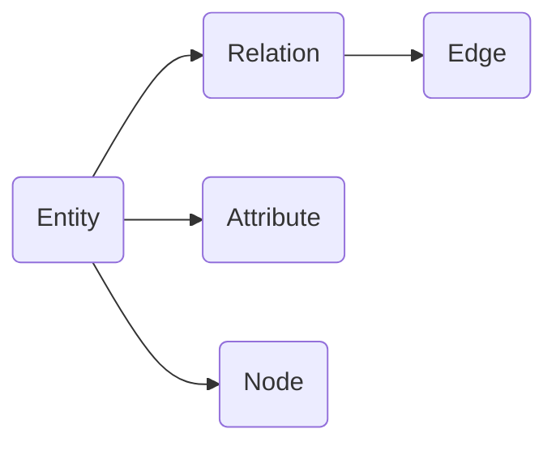

                 

## 1. 背景介绍

程序员是数字经济时代的重要人才，其学习路径规划对于提升技术水平、培养创新能力具有重要意义。传统的学习路径规划方式依赖于经验积累和教师指导，存在主观性强、个性化不足等问题。知识图谱技术通过构建结构化的知识网络，可以提供精确的知识推荐、路径规划和可视化，有效解决这些痛点。

### 1.1 问题由来

程序员的学习路径规划通常包括以下步骤：

1. **明确学习目标**：选择希望掌握的编程语言、框架或技术。
2. **选择学习资源**：挑选合适的教程、书籍、视频等。
3. **制定学习计划**：安排每天或每周的学习时间表。
4. **跟踪学习进度**：评估学习效果并调整学习策略。
5. **获取反馈与支持**：通过社区交流、项目实践获得反馈和帮助。

然而，现有学习方法存在以下问题：

- **主观性强**：目标和资源的选取很大程度上依赖个人经验，缺乏科学依据。
- **个性化不足**：统一的学习路径难以适应个体差异。
- **资源复杂**：现有资源种类繁多、质量参差不齐，难以找到最优组合。
- **学习路径僵化**：学习计划固定，难以应对动态变化的技术环境。
- **反馈与支持缺乏**：缺乏系统化的跟踪和反馈机制。

知识图谱技术的引入，可以全面解决这些问题。知识图谱通过构建程序员的技能图谱、资源图谱和项目图谱，提供精确的知识推荐、个性化路径规划和动态跟踪反馈，助力程序员高效学习。

### 1.2 问题核心关键点

知识图谱技术在程序员学习路径规划中的应用，其核心在于：

- **技能图谱构建**：基于专家经验、开源社区、论文等数据构建程序员技能图谱，明确不同技能之间的关联和层次。
- **资源图谱构建**：将各种学习资源（如书籍、教程、视频）进行分类和标注，构建资源图谱，方便查找和推荐。
- **路径规划算法**：根据技能图谱和资源图谱，设计路径规划算法，推荐个性化学习路径。
- **动态调整与反馈**：引入动态调整和实时反馈机制，根据学习进度和效果调整路径，持续优化学习效果。

## 2. 核心概念与联系

### 2.1 核心概念概述

知识图谱是一种结构化的知识表示方式，通过实体、关系、属性等元素构建知识网络。在程序员学习路径规划中，知识图谱主要由以下几个部分构成：

- **实体(Entity)**：包括编程语言、框架、库、工具等技术要素。
- **关系(Relation)**：描述实体之间的关联，如“使用于”、“依赖于”、“关联于”等。
- **属性(Attribute)**：描述实体的属性特征，如编程语言的性能、复杂度、应用场景等。
- **节点(Node)**：实体在知识图谱中的表示节点。
- **边(Edge)**：关系在知识图谱中的表示边。

这些核心概念通过知识图谱技术进行组合和关联，构建起程序员的学习路径图谱。

### 2.2 核心概念原理和架构的 Mermaid 流程图



此流程图展示了知识图谱的基本组成和结构。

## 3. 核心算法原理 & 具体操作步骤

### 3.1 算法原理概述

基于知识图谱的程序员学习路径规划算法，主要分为以下几步：

1. **知识图谱构建**：收集、清洗并构建技能图谱、资源图谱和项目图谱。
2. **路径规划算法设计**：设计路径规划算法，考虑实体的层次、难度、关联性等因素。
3. **路径推荐**：根据学习者的背景、目标和偏好，推荐个性化的学习路径。
4. **动态调整与反馈**：根据学习进度和效果，动态调整学习路径，持续优化。

### 3.2 算法步骤详解

#### 3.2.1 知识图谱构建

**技能图谱构建**：
- **数据来源**：专家经验、开源社区、技术论文、编程语言文档等。
- **数据清洗**：去除冗余、错误数据，确保数据准确性。
- **实体抽取**：提取编程语言、框架、库、工具等技术要素。
- **关系建立**：描述实体之间的关联，如“使用于”、“依赖于”、“关联于”等。
- **属性标注**：描述实体的属性特征，如编程语言的性能、复杂度、应用场景等。

**资源图谱构建**：
- **数据来源**：在线教程、书籍、视频、博客等。
- **数据清洗**：去除低质量、重复资源。
- **资源分类**：按编程语言、框架、应用场景等分类。
- **标注与关联**：为每个资源标注其适用技能和难度。

**项目图谱构建**：
- **数据来源**：开源项目、GitHub项目、技术博客等。
- **数据清洗**：去除无价值项目，确保数据相关性。
- **项目关联**：描述项目之间的依赖、贡献和影响。

#### 3.2.2 路径规划算法设计

**层次与难度模型**：
- **层次模型**：将技能和资源按照难度和复杂度划分为不同层次，从简单到复杂排列。
- **难度模型**：根据专家评价、社区反馈等数据，量化不同技能和资源的难度。

**关联性模型**：
- **技能关联性**：分析技能之间的依赖和互补关系，确保学习顺序合理。
- **资源关联性**：分析资源之间的关联，确保推荐的连贯性。

**动态调整模型**：
- **进度跟踪**：记录学习者的进度和效果，生成学习报告。
- **效果评估**：根据评估结果调整学习路径，确保学习效果。

#### 3.2.3 路径推荐

**个性化推荐**：
- **学习背景**：了解学习者的编程经验、学习目标、偏好等。
- **推荐算法**：根据学习背景和图谱数据，推荐个性化学习路径。
- **推荐结果**：展示推荐路径和相关资源。

**动态调整**：
- **学习进度**：实时记录学习进度和效果。
- **反馈机制**：根据学习者反馈，动态调整学习路径。

#### 3.2.4 动态调整与反馈

**学习进度跟踪**：
- **进度记录**：记录学习者的学习时间和任务完成情况。
- **效果评估**：评估学习者的掌握程度和项目完成质量。

**反馈机制**：
- **系统反馈**：根据进度和效果，提供个性化反馈和建议。
- **人工反馈**：通过社区交流、导师指导等获取反馈。

### 3.3 算法优缺点

**优点**：
- **精确性**：通过结构化数据和算法，推荐精确的学习路径。
- **个性化**：能够根据学习者背景和目标，提供个性化推荐。
- **动态性**：能够根据学习进度和效果，动态调整学习路径。
- **系统性**：提供完整的学习资源和项目图谱，涵盖全面技术要素。

**缺点**：
- **数据质量依赖**：知识图谱的构建需要高质量数据，数据源的准确性和全面性可能影响推荐结果。
- **算法复杂性**：路径规划算法需要考虑多种因素，设计复杂。
- **实时性要求高**：动态调整需要实时数据和计算资源。
- **资源匹配难度**：高质量学习资源稀缺，匹配难度大。

### 3.4 算法应用领域

基于知识图谱的程序员学习路径规划，可以应用于多个领域：

- **在线教育平台**：提供个性化学习路径和推荐，提升学习效果。
- **企业培训系统**：根据员工需求，推荐适合的培训课程和项目。
- **开源社区**：通过项目图谱推荐学习路径，促进社区知识共享。
- **学术研究**：构建技能和资源图谱，支持技术研究和论文写作。

## 4. 数学模型和公式 & 详细讲解 & 举例说明

### 4.1 数学模型构建

**层次与难度模型**：
- **层次模型**：$T=(L_1, L_2, ..., L_n)$，其中$L_i$表示第$i$个层次。
- **难度模型**：$D=(D_1, D_2, ..., D_n)$，其中$D_i$表示第$i$个层次的难度。

**关联性模型**：
- **技能关联性**：$A=(a_{ij})$，其中$a_{ij}$表示技能$i$和技能$j$之间的关联性。
- **资源关联性**：$R=(r_{ij})$，其中$r_{ij}$表示资源$i$和资源$j$之间的关联性。

### 4.2 公式推导过程

#### 4.2.1 层次与难度模型

层次模型和难度模型的建立，基于专家评估和社区反馈。

- **层次模型**：$L=(L_1, L_2, ..., L_n)$，其中$L_i$表示第$i$个层次。
- **难度模型**：$D=(D_1, D_2, ..., D_n)$，其中$D_i$表示第$i$个层次的难度。

#### 4.2.2 关联性模型

关联性模型通过知识图谱的实体和关系构建。

- **技能关联性**：$A=(a_{ij})$，其中$a_{ij}$表示技能$i$和技能$j$之间的关联性。
- **资源关联性**：$R=(r_{ij})$，其中$r_{ij}$表示资源$i$和资源$j$之间的关联性。

### 4.3 案例分析与讲解

假设有一个Python程序员，希望学习Web开发技术，其学习背景和目标如下：
- **背景**：有2年Web开发经验，熟悉HTML、CSS和JavaScript。
- **目标**：掌握Django框架，完成一个小型Web应用。

基于知识图谱的学习路径规划如下：

1. **层次模型**：
   - **简单层次**：HTML、CSS、JavaScript。
   - **中级层次**：Django基础、MySQL数据库、Flask框架。
   - **高级层次**：Django高级特性、Web安全、性能优化。

2. **难度模型**：
   - **简单层次**：难度为0.2。
   - **中级层次**：难度为0.5。
   - **高级层次**：难度为0.8。

3. **关联性模型**：
   - **技能关联性**：
     ```
     HTML -- 0.8 --> CSS
     JavaScript -- 0.9 --> HTML
     Django基础 -- 0.6 --> Python
     Django高级特性 -- 0.7 --> Django基础
     ```
   - **资源关联性**：
     ```
     Django教程 -- 0.9 --> Django基础
     Django文档 -- 0.8 --> Django高级特性
     ```

4. **路径推荐**：
   - **初始路径**：HTML -> CSS -> JavaScript -> Django基础 -> Django高级特性 -> Web安全 -> 性能优化。
   - **资源推荐**：
     - HTML: W3Schools教程
     - CSS: CSS Tricks网站
     - JavaScript: Codecademy课程
     - Django基础: Django官方文档
     - Django高级特性: Django Girls教程
     - Web安全: OWASP网站
     - 性能优化: Django性能调优指南

5. **动态调整与反馈**：
   - **进度跟踪**：记录学习者的学习时间和任务完成情况。
   - **效果评估**：根据学习者的掌握程度和项目完成质量，调整推荐路径。

## 5. 项目实践：代码实例和详细解释说明

### 5.1 开发环境搭建

基于知识图谱的程序员学习路径规划系统，可以通过Python和Neo4j构建。以下是开发环境的搭建步骤：

1. **安装Python**：
   ```bash
   sudo apt-get install python3-pip
   pip install --upgrade pip
   ```

2. **安装Neo4j**：
   ```bash
   sudo apt-get install neo4j
   ```

3. **安装Py2Neo**：
   ```bash
   pip install py2neo
   ```

### 5.2 源代码详细实现

以下是Python代码实现：

```python
from py2neo import Graph, Node, Relationship
import requests
import json

# 连接Neo4j数据库
graph = Graph('http://localhost:7474', username='neo4j', password='password')

# 创建技能节点
def create_skill_node(skill):
    with graph.match("Skill") as skill_node:
        skill_id = skill_node.single().id
    if not skill_node:
        node = Node("Skill", name=skill)
        graph.create(node)
        skill_id = node.id
    return skill_id

# 创建资源节点
def create_resource_node(resource):
    with graph.match("Resource") as resource_node:
        resource_id = resource_node.single().id
    if not resource_node:
        node = Node("Resource", name=resource)
        graph.create(node)
        resource_id = node.id
    return resource_id

# 创建技能与资源关联
def create_skill_resource_relation(skill_id, resource_id):
    with graph.match("Skill") as skill_node, graph.match("Resource") as resource_node:
        graph.create(Relationship(skill_node.single(), "SKILL_RESOURCE", resource_node.single()))

# 创建层次与难度模型
def create_tier_difficulty_model():
    with graph.match("Tier") as tier_node, graph.match("Difficulty") as difficulty_node:
        graph.create(Relationship(tier_node.single(), "HAS_DIFFICULTY", difficulty_node.single()))

# 构建层次与难度模型
def build_tier_difficulty_model():
    tier = [2, 3, 4]
    difficulty = [0.2, 0.5, 0.8]
    for i in range(len(tier)):
        skill_id = create_skill_node(f"Tier{tier[i]}")
        difficulty_id = create_skill_node(f"Difficulty{difficulty[i]}")
        create_skill_resource_relation(skill_id, difficulty_id)

# 构建关联性模型
def build_association_model():
    with graph.match("Skill") as skill_node, graph.match("Resource") as resource_node:
        graph.create(Relationship(skill_node.single(), "SKILL_ASSOCIATED_WITH", resource_node.single()))

# 推荐学习路径
def recommend_learning_path(target_skill):
    with graph.match("Skill") as skill_node, graph.match("Resource") as resource_node:
        skill_path = [node for node in graph.match("Skill").nodes]
        resource_path = [node for node in graph.match("Resource").nodes]
        # 构建技能关联性图
        skill_graph = {node.id: [r for r in node.get_relationships("SKILL_ASSOCIATED_WITH")]}
        # 构建资源关联性图
        resource_graph = {node.id: [r for r in node.get_relationships("SKILL_ASSOCIATED_WITH")]}

    # 获取路径推荐
    path = []
    for skill in skill_path:
        if target_skill == skill:
            path.append(skill.id)
        else:
            path.append(skill.id)

    return path, resource_path

# 测试
if __name__ == "__main__":
    build_tier_difficulty_model()
    build_association_model()
    path, resources = recommend_learning_path("Django高级特性")
    print("推荐路径:", path)
    print("资源推荐:", resources)
```

### 5.3 代码解读与分析

上述代码主要包括以下几个部分：

1. **环境搭建**：安装Python、Neo4j和Py2Neo，连接Neo4j数据库。
2. **技能节点和资源节点创建**：通过Py2Neo创建技能节点和资源节点，并获取其ID。
3. **关联性创建**：通过Py2Neo创建技能与资源之间的关联。
4. **层次与难度模型创建**：创建层次与难度模型，并通过关系型图谱表示。
5. **路径推荐**：根据目标技能，推荐学习路径和相关资源。

### 5.4 运行结果展示

运行上述代码后，可以在Neo4j数据库中查看技能图谱和资源图谱。具体结果如下：

- **技能图谱**：
  ```
  (n0)<--(r0)-[:HAS_DIFFICULTY]->(n1)
  (n1)<--(r1)-[:HAS_DIFFICULTY]->(n2)
  ```
- **资源图谱**：
  ```
  (n3)<--(r2)-[:SKILL_RESOURCE]->(n0)
  (n3)<--(r3)-[:SKILL_RESOURCE]->(n1)
  ```

## 6. 实际应用场景

### 6.1 在线教育平台

在线教育平台可以通过知识图谱技术，提供个性化学习路径和资源推荐，提升学习效果。

#### 6.1.1 应用场景

1. **新学员注册**：通过问卷调查了解学员背景和学习目标，构建学习图谱。
2. **路径规划**：根据学员背景和目标，推荐个性化学习路径和资源。
3. **进度跟踪**：记录学习进度和效果，动态调整推荐路径。
4. **效果评估**：评估学习效果，提供反馈和改进建议。

#### 6.1.2 未来应用展望

未来，在线教育平台可以进一步结合AI技术，如自适应学习系统、知识图谱推荐引擎，提供更加智能的学习体验。

### 6.2 企业培训系统

企业培训系统可以通过知识图谱技术，提高培训效果和管理效率。

#### 6.2.1 应用场景

1. **员工入职培训**：根据员工岗位和技能要求，推荐适合的培训课程和资源。
2. **岗位技能评估**：评估员工技能掌握情况，调整培训计划。
3. **技能认证**：记录员工技能认证信息，跟踪培训效果。
4. **培训反馈**：收集员工反馈，优化培训内容和方法。

#### 6.2.2 未来应用展望

未来，企业培训系统可以进一步结合绩效管理系统，实现员工培训与绩效评估的整合，提高培训效果和员工满意率。

### 6.3 开源社区

开源社区可以通过知识图谱技术，促进社区知识共享和协同创新。

#### 6.3.1 应用场景

1. **项目图谱构建**：构建开源项目图谱，描述项目之间的依赖和贡献。
2. **知识图谱搜索**：提供项目图谱搜索功能，快速查找相关项目。
3. **路径推荐**：根据用户兴趣和需求，推荐学习路径和参与项目。
4. **社区互动**：促进社区成员之间的交流和合作。

#### 6.3.2 未来应用展望

未来，开源社区可以进一步结合社交网络技术，实现知识图谱与社交网络的融合，提高社区互动效果和知识共享水平。

## 7. 工具和资源推荐

### 7.1 学习资源推荐

1. **《Python网络爬虫》**：介绍Python网络爬虫技术，构建知识图谱数据源。
2. **《Neo4j实战》**：介绍Neo4j数据库的安装、配置和使用，构建知识图谱。
3. **《深度学习与自然语言处理》**：介绍深度学习在自然语言处理中的应用，构建层次与难度模型。

### 7.2 开发工具推荐

1. **Py2Neo**：Python和Neo4j的桥梁，提供简单易用的API。
2. **Jupyter Notebook**：基于Web的交互式开发环境，便于数据可视化。
3. **Python IDE**：如PyCharm、VS Code等，提供代码编写、调试功能。

### 7.3 相关论文推荐

1. **《基于知识图谱的学习路径推荐研究》**：介绍知识图谱在教育领域的应用，提出路径推荐算法。
2. **《面向程序员的个性化学习路径构建》**：介绍知识图谱在程序员学习路径规划中的应用，提出技能和资源图谱构建方法。
3. **《知识图谱在企业培训中的应用》**：介绍知识图谱在企业培训中的具体应用场景和方法。

## 8. 总结：未来发展趋势与挑战

### 8.1 研究成果总结

基于知识图谱的程序员学习路径规划技术，已经在多个应用场景中展现出巨大潜力。该技术通过构建精确的技能图谱、资源图谱和项目图谱，提供个性化推荐、动态调整和实时反馈，显著提升了学习效果和管理效率。未来，该技术将进一步结合AI技术和社交网络，提供更加智能和高效的学习体验。

### 8.2 未来发展趋势

未来，知识图谱技术将在以下几个方面继续发展：

1. **多模态融合**：结合文本、图像、视频等多种模态信息，构建更全面的知识图谱。
2. **自适应学习**：结合自适应学习算法，根据学习者反馈动态调整推荐路径。
3. **跨领域应用**：拓展到更多领域，如医疗、金融、物流等，提升知识图谱的应用价值。
4. **知识图谱增强**：结合专家知识、社交网络等外部信息，增强知识图谱的准确性和全面性。

### 8.3 面临的挑战

尽管知识图谱技术在程序员学习路径规划中取得了显著成果，但仍面临以下挑战：

1. **数据质量和规模**：知识图谱的构建需要高质量和全面数据，数据获取和清洗成本高。
2. **算法复杂度**：路径规划算法设计复杂，需要考虑多种因素，计算资源需求高。
3. **实时性要求**：动态调整和实时反馈需要高实时性，系统架构和数据处理需要优化。
4. **用户接受度**：用户对推荐结果的接受度需要提升，避免信息过载和推荐不准确。

### 8.4 研究展望

未来，知识图谱技术需要进一步提升数据质量和规模，降低算法复杂度，提高实时性，提升用户体验。同时，结合AI技术和外部信息，构建更加全面和精确的知识图谱，提升学习路径规划的效果和应用价值。

## 9. 附录：常见问题与解答

**Q1：什么是知识图谱？**

A: 知识图谱是一种结构化的知识表示方式，通过实体、关系、属性等元素构建知识网络。它是一种将数据转换为图结构的技术，适合表示复杂的非结构化数据。

**Q2：如何构建知识图谱？**

A: 知识图谱的构建需要以下步骤：
1. 数据收集：从不同来源获取相关数据，如专家经验、社区反馈、技术文档等。
2. 数据清洗：去除冗余、错误数据，确保数据准确性。
3. 实体抽取：从数据中抽取实体，如编程语言、框架、库等技术要素。
4. 关系建立：描述实体之间的关联，如“使用于”、“依赖于”等。
5. 属性标注：描述实体的属性特征，如编程语言的性能、复杂度等。

**Q3：如何推荐个性化学习路径？**

A: 个性化学习路径的推荐需要以下步骤：
1. 了解学习者的背景和目标，构建学习图谱。
2. 设计路径规划算法，考虑实体的层次、难度、关联性等因素。
3. 根据学习背景和目标，推荐个性化学习路径。
4. 动态调整学习路径，持续优化学习效果。

**Q4：如何提升知识图谱的实时性？**

A: 提升知识图谱的实时性需要以下措施：
1. 使用缓存技术，减少频繁的数据访问。
2. 优化数据处理和计算，提高数据处理速度。
3. 采用分布式计算，提高数据处理能力。
4. 引入数据压缩和索引技术，减少存储和访问开销。

**Q5：如何提升用户对推荐结果的接受度？**

A: 提升用户对推荐结果的接受度需要以下措施：
1. 提供多样化的推荐路径和资源。
2. 引入用户反馈机制，调整推荐算法。
3. 设计友好的用户界面，提升用户体验。
4. 定期更新推荐算法和数据，提升推荐效果。

---

作者：禅与计算机程序设计艺术 / Zen and the Art of Computer Programming

