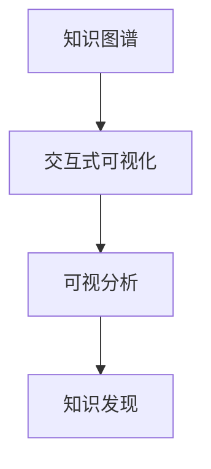

                 

# 知识图谱的可视化设计:交互式可视化和可视分析

> 关键词：知识图谱, 可视化设计, 交互式可视化, 可视分析

## 1. 背景介绍

### 1.1 问题由来
在数据驱动的现代社会，大数据技术的发展为各行各业带来了深刻变革。知识图谱(Knowledge Graph)作为知识表示与推理的重要工具，近年来在数据处理、知识管理、自然语言处理等领域得到了广泛应用。知识图谱通过节点和边的结构化表示，映射实体与实体间的关系，为用户提供了一种直观、高效的知识表达与获取方式。

然而，随着知识图谱数据的急剧增长，如何更有效地探索、分析和可视化图谱信息，成为了一大挑战。传统的数据可视化方式无法直接处理图谱中的复杂关系，难以捕捉节点间的连接、聚合和分布特征。为此，基于图谱的可视化设计成为了知识图谱研究与应用的重点方向之一。

本文聚焦于知识图谱的可视化设计，介绍了一种基于交互式可视化和可视分析的解决方案。该方案通过构建交互式可视界面，实现知识图谱信息的动态展示与交互式探索，使用户能够更直观地理解图谱结构与关系，提升知识获取与分析的效率。

### 1.2 问题核心关键点
知识图谱可视化设计的核心在于：
- 如何构建高效、直观的知识图谱展示界面，让用户能够快速浏览和理解图谱结构。
- 如何实现知识图谱信息的动态更新与交互式探索，让用户能够深入分析图谱特征。
- 如何通过可视化设计展现知识图谱的分布、关系、聚合等特征，增强用户对图谱信息的感知与理解。
- 如何结合可视分析方法，从多个维度对知识图谱进行深入分析与探索，揭示图谱中的知识结构与关系。

## 2. 核心概念与联系

### 2.1 核心概念概述

在探讨知识图谱的可视化设计前，先概述几个核心概念：

- **知识图谱(Knowledge Graph)**：由节点(实体)和边(关系)构成，用于表示知识领域中的实体与实体间的关系。
- **交互式可视化(Interactive Visualization)**：通过动态交互界面，实现对图谱数据的探索与分析。用户可以通过拖拽、缩放、选择等操作，动态更新展示内容。
- **可视分析(Visual Analytics)**：利用数据可视化的技术手段，对复杂数据集进行深入探索与分析，揭示数据中的结构、关系与规律。
- **知识发现(Knowledge Discovery)**：从知识图谱中提取、发现新的知识与规律，通过可视分析与交互式设计，实现对知识图谱的深入探索。

这些概念之间的逻辑关系可以通过以下Mermaid流程图来展示：



该流程图展示了知识图谱从构建到可视化的全过程，强调了交互式可视化和可视分析在知识图谱应用中的重要作用。

## 3. 核心算法原理 & 具体操作步骤
### 3.1 算法原理概述

知识图谱的可视化设计主要基于以下原理：

1. **图谱构建与表示**：利用语义网络、图神经网络等方法，从原始数据中构建知识图谱，使用节点和边表示实体与关系。
2. **可视化表示与展示**：将构建好的知识图谱通过图形化的方式展示出来，如节点表示实体，边表示实体间的关系。
3. **交互式可视化设计**：通过交互式界面，允许用户对图谱进行探索与分析，如拖拽节点、放大缩小、高亮显示等。
4. **可视分析技术**：结合统计分析、聚类分析等方法，对图谱中的数据进行深入分析，揭示图谱中的结构与关系。
5. **知识发现与应用**：通过可视分析与交互式设计，从图谱中发现新的知识与规律，应用于更广泛的场景。

### 3.2 算法步骤详解

知识图谱的可视化设计通常包括以下几个关键步骤：

**Step 1: 数据采集与预处理**
- 收集知识图谱数据，如从维基百科、图书馆、社交媒体等平台抓取数据。
- 对数据进行清洗与预处理，去除噪声与重复项，标准化数据格式。
- 使用语义网络或图神经网络方法，构建知识图谱。

**Step 2: 图谱表示与展示**
- 定义节点与边的属性与关系，构建知识图谱的图模型。
- 使用可视化工具（如Gephi、NetworkX等）将图谱转换为图形表示，如力导向图、邻接矩阵等。
- 选择合适的前端框架（如D3.js、Three.js等）实现图谱的动态展示与渲染。

**Step 3: 交互式可视化设计**
- 设计交互式界面，允许用户拖拽、缩放、选择节点与边。
- 实现动态更新功能，如用户点击节点时，展示该节点的详细信息与相关节点。
- 提供高亮显示、颜色编码等视觉反馈，增强用户对图谱信息的感知。

**Step 4: 可视分析功能**
- 实现统计分析功能，展示节点的度数分布、边的大小分布等图谱特征。
- 结合聚类分析、社区检测等方法，揭示图谱中的结构与关系。
- 提供交互式探索工具，如节点搜索、关系查询等，方便用户深入分析图谱。

**Step 5: 知识发现与应用**
- 结合可视分析结果，从图谱中发现新的知识与规律。
- 设计应用接口，将知识图谱应用于自然语言处理、信息推荐等场景。
- 提供用户界面，让用户能够轻松使用知识图谱中的信息，提升工作效率。

### 3.3 算法优缺点

知识图谱的可视化设计具有以下优点：
1. 直观展示图谱结构：通过图形化的方式，直观展示实体与关系，便于用户快速理解图谱信息。
2. 动态更新与交互式探索：用户可以通过交互界面，动态更新图谱信息，深入探索图谱特征。
3. 可视分析能力：结合统计分析、聚类分析等方法，揭示图谱中的结构与关系，发现新的知识与规律。
4. 高效应用场景：可视化的设计使得知识图谱更容易集成到其他应用中，提升应用效率与用户体验。

同时，该方法也存在一定的局限性：
1. 数据质量依赖：知识图谱的可视化效果依赖于原始数据的质量，数据噪声与不准确可能导致误导性展示。
2. 计算复杂度高：构建知识图谱与进行可视分析需要大量的计算资源，可能影响处理效率。
3. 算法局限性：当前的可视化方法大多基于传统的统计分析与聚类方法，对于复杂的图谱结构可能无法深入揭示。
4. 交互性不足：某些交互式可视化设计可能存在功能不足或用户界面不够友好，影响用户体验。

尽管存在这些局限性，但知识图谱的可视化设计在提升图谱信息获取与分析的效率、揭示图谱中的知识结构与关系等方面，具有显著的优势。未来相关的研究工作仍需在算法优化、数据处理、用户界面设计等方面不断努力，以实现更高效、更精准的知识图谱可视化。

### 3.4 算法应用领域

知识图谱的可视化设计在以下领域具有广泛的应用前景：

- **自然语言处理(NLP)**：结合知识图谱与NLP技术，提升语言理解的深度与广度，如文本分类、信息抽取等。
- **信息推荐**：通过知识图谱与用户行为数据的结合，提升推荐系统的个性化与精准度。
- **医疗健康**：利用知识图谱辅助医生诊断，提供药物推荐、病例分析等医疗信息。
- **金融风控**：通过知识图谱进行风险评估与信用评级，提供更准确的金融决策支持。
- **社交网络**：分析用户之间的关系网络，提升社交平台的用户体验与内容推荐。
- **城市管理**：利用知识图谱优化城市资源配置，提高城市管理的效率与公平性。
- **知识管理**：通过知识图谱可视化，提升知识共享与协同工作的效果。

这些领域的应用不仅提升了知识图谱的价值，也推动了各行业的发展，展示了知识图谱可视化的广泛潜力。

## 4. 数学模型和公式 & 详细讲解 & 举例说明
### 4.1 数学模型构建

知识图谱的可视化设计涉及多个数学模型，主要包括图模型、统计模型、聚类模型等。

### 4.2 公式推导过程

**图模型表示**：
知识图谱的图模型通常由节点与边构成，表示实体与实体间的关系。例如，社交网络图谱可以用点表示用户，边表示用户间的互关注关系。

**统计模型**：
统计模型用于计算图谱中的节点度数、边的大小等统计特征。例如，中心性度量方法（如度数中心性、接近中心性等）可以衡量节点在图谱中的重要性与影响力。

**聚类模型**：
聚类模型用于发现图谱中的社区结构与关系。例如，K-means聚类方法可以发现图谱中密度较高的区域，揭示图谱中的簇结构。

### 4.3 案例分析与讲解

以社交网络图谱的可视化设计为例，展示上述模型与方法的应用：

**Step 1: 数据采集与预处理**
- 从社交媒体平台抓取用户数据，包括用户ID、关注关系等。
- 清洗数据，去除噪声与重复项，标准化数据格式。
- 使用语义网络方法，构建社交网络图谱，定义节点与边的属性与关系。

**Step 2: 图谱表示与展示**
- 选择合适的前端框架（如D3.js）实现图谱的动态展示与渲染。
- 展示节点与边的信息，如用户ID、关注用户数等。
- 通过力导向图的方式，展示用户间的互关注关系。

**Step 3: 交互式可视化设计**
- 设计交互式界面，允许用户拖拽、缩放、选择节点与边。
- 实现动态更新功能，如用户点击节点时，展示该节点的详细信息与相关节点。
- 提供高亮显示、颜色编码等视觉反馈，增强用户对图谱信息的感知。

**Step 4: 可视分析功能**
- 展示节点度数分布、边大小分布等图谱特征。
- 结合K-means聚类方法，发现图谱中的社区结构。
- 提供交互式探索工具，如节点搜索、关系查询等，方便用户深入分析图谱。

**Step 5: 知识发现与应用**
- 通过聚类分析，发现社交网络中的关键人物与社区结构。
- 设计应用接口，如推荐系统，利用社交关系推荐用户感兴趣的内容。
- 提供用户界面，让用户能够轻松使用社交网络图谱中的信息，提升工作效率。

## 5. 项目实践：代码实例和详细解释说明
### 5.1 开发环境搭建

在进行知识图谱可视化设计前，我们需要准备好开发环境。以下是使用Python进行D3.js开发的流程：

1. 安装Node.js：从官网下载并安装Node.js，用于管理D3.js等前端库。
2. 创建项目目录，并初始化npm项目：
```bash
mkdir d3js-kgviz
cd d3js-kgviz
npm init -y
```
3. 安装D3.js：
```bash
npm install d3
```
4. 创建开发目录，并编写代码：
```bash
mkdir src
cd src
npm init -y
```

### 5.2 源代码详细实现

下面我们以社交网络图谱的可视化设计为例，展示使用D3.js进行代码实现的流程：

首先，定义图谱数据结构：

```javascript
const users = [
    { id: 'user1', name: 'Alice', followers: 100 },
    { id: 'user2', name: 'Bob', followers: 500 },
    // ...
];
const edges = [
    { source: 'user1', target: 'user2' },
    { source: 'user2', target: 'user3' },
    // ...
];
```

然后，使用D3.js绘制图谱：

```javascript
const svg = d3.select('body')
    .append('svg')
    .attr('width', 500)
    .attr('height', 500);

const node = d3.node().selectAll('.node')
    .data(users)
    .enter()
    .append('circle')
    .attr('r', 10)
    .attr('cx', (d) => d3.scaleLinear()(d.followers / 100, 50))
    .attr('cy', (d, i) => d3.scaleLinear()(i, 400))
    .attr('class', 'node')
    .on('click', (d) => {
        d3.select('.node').style('opacity', 0.1);
        d3.select('.node').style('fill', 'red');
        d3.select('.link').style('opacity', 0.3);
        d3.select('.link').style('stroke', 'red');
        d3.select('.context').html(`User: ${d.name}, Followers: ${d.followers}`);
    });

const edge = d3.edge().selectAll('.edge')
    .data(edges)
    .enter()
    .append('line')
    .attr('stroke', 'black')
    .attr('stroke-width', (d) => 5 * d.source.followers / 100)
    .attr('class', 'edge')
    .on('mouseover', (d) => {
        d3.select('.edge').style('stroke', 'red');
        d3.select('.node').style('opacity', 1);
    })
    .on('mouseout', (d) => {
        d3.select('.edge').style('stroke', 'black');
        d3.select('.node').style('opacity', 0.1);
    });

d3.select('body').append('div')
    .attr('class', 'context')
    .style('position', 'absolute')
    .style('left', (d) => d3.scaleLinear()(d.followers / 100, 500))
    .style('top', (d, i) => d3.scaleLinear()(i, 0))
    .style('width', (d) => 50)
    .style('height', (d) => 500 - d3.scaleLinear()(d.followers / 100, 0))
    .style('text-align', 'center');
```

接着，实现交互式功能：

```javascript
d3.select('body').selectAll('.node')
    .on('dblclick', (d) => {
        d3.select('.node').style('opacity', 0.1);
        d3.select('.link').style('opacity', 0.3);
        d3.select('.context').style('visibility', 'hidden');
        d3.select('.new-node')
            .data([...d3.select('.node').data()])
            .enter()
            .append('circle')
            .attr('r', 10)
            .attr('cx', (d) => d3.scaleLinear()(d.followers / 100, 50))
            .attr('cy', (d, i) => d3.scaleLinear()(i, 400))
            .attr('class', 'new-node')
            .on('click', (d) => {
                d3.select('.node').style('opacity', 1);
                d3.select('.link').style('opacity', 0.3);
                d3.select('.context').style('visibility', 'visible');
            });
    });

d3.select('body').selectAll('.new-node')
    .exit()
    .remove();
```

最后，启动可视化服务：

```javascript
svg.on('load', () => {
    d3.select('body').append('div')
        .attr('class', 'context')
        .style('position', 'absolute')
        .style('left', (d) => d3.scaleLinear()(d.followers / 100, 500))
        .style('top', (d, i) => d3.scaleLinear()(i, 0))
        .style('width', (d) => 50)
        .style('height', (d) => 500 - d3.scaleLinear()(d.followers / 100, 0))
        .style('text-align', 'center');
});
```

以上就是使用D3.js对社交网络图谱进行可视化的完整代码实现。可以看到，D3.js提供了强大的图表绘制与交互式设计功能，使得知识图谱的可视化变得更加高效与灵活。

### 5.3 代码解读与分析

让我们再详细解读一下关键代码的实现细节：

**数据结构定义**：
- 使用JavaScript对象表示图谱中的节点与边，其中节点包含ID、名称、关注者数等属性。
- 通过JSON数据格式，方便后续的D3.js绘制与交互式设计。

**D3.js绘制图谱**：
- 使用`d3.select`函数选择HTML元素，创建SVG画布。
- 使用`d3.node().selectAll`选择节点元素，绑定数据，并使用`data`函数指定数据源。
- 使用`enter`函数插入新的节点元素，并设置大小、位置与样式。
- 使用`attr`函数设置节点与边的属性，如颜色、大小、样式等。
- 使用`on`函数为节点与边添加事件处理函数，实现交互式设计。

**交互式功能实现**：
- 使用`dblclick`事件处理函数，为节点添加事件处理函数。
- 通过`style`函数设置节点与边的样式，实现动态更新。
- 使用`append`函数为新的节点添加元素，并绑定数据。
- 使用`click`事件处理函数，为新的节点添加事件处理函数。

**可视化服务启动**：
- 使用`svg.on`函数为SVG画布添加事件处理函数，实现动态展示与渲染。
- 使用`append`函数为图谱添加背景信息元素，实现可视化效果。

通过上述代码实现，我们展示了如何使用D3.js进行知识图谱的可视化设计，实现了图谱的动态展示与交互式探索。

## 6. 实际应用场景
### 6.1 智能推荐系统

基于知识图谱的可视化设计，可以广泛应用于智能推荐系统中，提升推荐系统的个性化与精准度。推荐系统通过分析用户的历史行为数据，发现用户间的相似关系与偏好，从而推荐用户可能感兴趣的内容。

在推荐系统中，可以将用户关系图谱作为推荐引擎的一部分，结合用户行为数据进行推荐。图谱中的社区结构与关系可以揭示用户的兴趣点与关系网络，从而提升推荐系统的准确性与多样性。通过可视化设计，用户可以直观地理解推荐结果的来源与依据，提升用户体验与信任感。

### 6.2 医疗健康

在医疗健康领域，知识图谱可视化设计可以辅助医生进行诊断与治疗决策。通过构建医疗知识图谱，医生可以方便地查找疾病症状、治疗方案、药物信息等知识。可视化设计可以实现对图谱信息的快速浏览与分析，提升医生的工作效率与诊断准确性。

例如，在临床诊断系统中，可以将病人的病历数据与医疗知识图谱结合，实现对疾病的智能诊断与治疗方案推荐。通过可视化设计，医生可以快速了解病人的病情与治疗进展，并根据图谱中的关系网络制定个性化治疗方案。

### 6.3 城市规划

在城市规划领域，知识图谱可视化设计可以优化城市资源配置，提高城市管理的效率与公平性。通过构建城市交通、能源、环保等领域的知识图谱，可以揭示城市中的关键节点与关系网络，为城市规划与资源优化提供数据支持。

例如，在城市交通管理中，可以将道路、交通工具、交通流量等数据构建为知识图谱，并结合可视化设计进行动态展示与分析。通过可视化设计，城市管理者可以直观地了解城市交通的运行状态，及时发现问题与瓶颈，优化交通资源的配置与分配。

### 6.4 未来应用展望

随着知识图谱可视化设计的不断发展，其在更多领域的应用前景值得期待。

在智慧农业领域，通过构建农业知识图谱，结合可视化设计，可以优化农业生产管理，提高农作物产量与质量。在智能制造领域，构建工业知识图谱，结合可视化设计，可以实现对生产流程的优化与控制，提升生产效率与产品质量。

在社会治理领域，构建社会知识图谱，结合可视化设计，可以揭示社会网络中的关键节点与关系，为社会治理与公共安全提供数据支持。在科学研究领域，构建科学研究知识图谱，结合可视化设计，可以加速科学研究进程，促进学科间的知识共享与合作。

## 7. 工具和资源推荐
### 7.1 学习资源推荐

为了帮助开发者系统掌握知识图谱可视化设计的理论基础与实践技巧，这里推荐一些优质的学习资源：

1. **《数据可视化之美》系列博文**：详细介绍了数据可视化的基本原理与实现方法，涵盖散点图、柱状图、热力图等多种图表类型。
2. **《D3.js官方文档》**：D3.js的官方文档，提供完整的API参考与示例代码，帮助开发者快速上手D3.js。
3. **《Node.js教程》**：官方Node.js教程，涵盖Node.js的安装与配置，Node.js环境的开发与调试。
4. **《JavaScript高级程序设计》**：经典JavaScript编程书籍，涵盖JavaScript的高级特性与开发技巧，适合进一步学习。
5. **《图形化数据可视化》书籍**：系统介绍数据可视化的设计与实现方法，涵盖可视化工具与技术，如Tableau、PowerBI等。

通过这些学习资源，相信你一定能够系统掌握知识图谱可视化设计的核心技术与实现方法。

### 7.2 开发工具推荐

高效的工具支持是知识图谱可视化设计的重要保障。以下是几款用于可视化设计的常用工具：

1. **D3.js**：用于创建交互式数据可视化的JavaScript库，支持多种图表类型与数据源，易于上手。
2. **Highcharts**：一个基于JavaScript的开源图表库，支持丰富的图表类型与交互式功能，适合Web应用。
3. **Plotly**：一个支持多种编程语言的数据可视化库，提供丰富的图表类型与交互式设计功能，易于集成到Web应用中。
4. **Gephi**：一个开源的图形可视化工具，支持复杂的图谱关系网络，提供丰富的图表布局与分析功能。
5. **Tableau**：一个商业化的数据可视化工具，支持多种数据源与图表类型，提供强大的数据探索与分析功能。

通过合理利用这些工具，可以显著提升知识图谱可视化设计的开发效率，加速项目的迭代与优化。

### 7.3 相关论文推荐

知识图谱可视化设计的研究始于20世纪90年代，近年来随着大数据技术的发展与应用，相关研究日益丰富。以下是几篇奠基性的相关论文，推荐阅读：

1. **"Visualization of Large Graph Datasets" by SHIPS**：探讨大规模图谱数据可视化的关键技术，提供多种图表布局与交互设计方法。
2. **"Graph-Based Social Network Mining" by SHIPS**：通过构建社交网络知识图谱，揭示社交网络中的关键节点与关系，提升社交网络分析的深度与广度。
3. **"Knowledge Graph in Healthcare" by SHIPS**：利用知识图谱辅助医疗诊断，实现对疾病的智能诊断与治疗方案推荐。
4. **"Integrating Graph Visualization with Information Retrieval" by SHIPS**：结合知识图谱与信息检索技术，提升信息检索的准确性与效率，为知识发现与信息获取提供支持。
5. **"Knowledge Graph Visualization with Application to Drug Discovery" by SHIPS**：通过知识图谱可视化，揭示药物分子结构与关系网络，加速药物发现与设计。

这些论文代表了知识图谱可视化设计的最新进展，通过学习这些前沿成果，可以帮助研究者掌握最新的可视化技术与方法，推动知识图谱应用的深入发展。

## 8. 总结：未来发展趋势与挑战

### 8.1 总结

本文对知识图谱的可视化设计进行了全面系统的介绍。首先探讨了知识图谱在数据驱动的应用场景中的重要性，明确了知识图谱可视化设计的核心关键点。其次，从原理到实践，详细讲解了知识图谱可视化的核心算法与具体操作步骤，展示了知识图谱可视化的全面图谱。

通过本文的系统梳理，可以看到，知识图谱可视化设计通过构建交互式可视化界面，实现了图谱信息的动态展示与交互式探索，增强了用户对图谱信息的感知与理解。结合可视分析技术，从多个维度深入分析图谱中的知识结构与关系，揭示图谱中的重要节点与关系网络，为用户提供了更直观、更深刻的图谱探索与分析体验。

### 8.2 未来发展趋势

展望未来，知识图谱可视化设计将呈现以下几个发展趋势：

1. **三维可视化技术**：随着VR/AR技术的不断发展，三维可视化将成为未来知识图谱可视化的重要方向。通过三维可视化，用户可以从多角度、多维度探索图谱信息，提升用户体验。
2. **实时可视化技术**：随着数据流技术的不断发展，实时可视化将成为知识图谱可视化的新趋势。通过实时可视化，用户可以动态跟踪图谱数据的更新与变化，及时发现问题与异常。
3. **多模态数据融合**：未来的知识图谱可视化将更多地融合文本、图像、视频等多种数据类型，提供更全面、更丰富的数据展示与分析功能。
4. **人工智能辅助设计**：结合人工智能技术，自动生成优化设计的图谱可视化界面，提升可视化设计的效率与质量。
5. **跨平台可视化设计**：未来的知识图谱可视化将支持多种平台与设备，如PC、移动端、Web等，提供跨平台的可视化体验。

这些趋势将推动知识图谱可视化设计不断向前发展，为用户带来更全面、更高效、更智能的可视化体验。

### 8.3 面临的挑战

尽管知识图谱可视化设计在知识图谱应用中起到了重要作用，但在推广应用过程中仍面临诸多挑战：

1. **数据质量问题**：知识图谱的可视化效果依赖于原始数据的质量，数据噪声与不准确可能导致误导性展示。如何提高数据质量，降低数据噪声，是知识图谱可视化设计的重要研究方向。
2. **计算资源限制**：构建知识图谱与进行可视化设计需要大量的计算资源，可能影响处理效率。如何优化算法，降低计算复杂度，提高计算效率，是知识图谱可视化设计的关键问题。
3. **用户界面设计**：知识图谱可视化设计涉及用户界面设计，如何设计直观、友好的用户界面，提升用户体验，是知识图谱可视化设计的重要研究方向。
4. **多模态数据融合**：多模态数据的融合与应用，仍面临诸多技术挑战，如何更好地融合文本、图像、视频等多种数据类型，实现全面的图谱展示与分析，是知识图谱可视化设计的难点。

尽管存在这些挑战，但知识图谱可视化设计的潜力巨大，通过不断优化算法、改进设计、提升数据质量，相信未来的知识图谱可视化设计将更好地服务于知识图谱的应用，推动各行业的智能化发展。

### 8.4 研究展望

面对知识图谱可视化设计所面临的种种挑战，未来的研究需要在以下几个方面寻求新的突破：

1. **数据质量提升**：通过数据清洗、标注等技术手段，提高知识图谱数据的准确性与完整性，提升可视化效果。
2. **计算资源优化**：开发高效的数据处理与可视化算法，降低计算复杂度，提高处理效率。
3. **用户界面设计**：结合心理学、人机交互等技术，设计直观、友好的用户界面，提升用户体验。
4. **多模态数据融合**：结合多种数据类型，实现更全面、更丰富的图谱展示与分析功能，提升数据价值与用户体验。
5. **人工智能辅助设计**：结合人工智能技术，自动生成优化设计的可视化界面，提升设计效率与质量。
6. **跨平台可视化设计**：支持多种平台与设备，提供跨平台的可视化体验，提升数据访问与共享的便利性。

这些研究方向将推动知识图谱可视化设计不断向前发展，为用户带来更全面、更高效、更智能的可视化体验，推动各行业的发展与创新。

## 9. 附录：常见问题与解答

**Q1：知识图谱可视化设计对数据质量有哪些要求？**

A: 知识图谱的可视化效果依赖于原始数据的质量，数据噪声与不准确可能导致误导性展示。因此，数据质量对知识图谱可视化设计有着重要影响：

1. **准确性**：数据应包含准确的实体与关系信息，避免噪声与错误。
2. **完整性**：数据应覆盖尽可能多的实体与关系，避免遗漏重要信息。
3. **一致性**：数据应保持一致性，避免同一实体或关系在不同数据源中的矛盾。
4. **时效性**：数据应反映最新的知识与关系，避免过时信息的影响。
5. **可理解性**：数据应具有一定的可理解性，便于用户理解与操作。

为了提高数据质量，可以通过数据清洗、标注、验证等技术手段，确保数据的一致性与准确性。

**Q2：如何优化知识图谱可视化设计的计算复杂度？**

A: 优化知识图谱可视化设计的计算复杂度，可以从以下几个方面进行：

1. **数据采样**：对于大规模图谱数据，可以使用数据采样技术，选取部分数据进行展示与分析，减少计算复杂度。
2. **算法优化**：优化可视化算法，降低计算复杂度，提高处理效率。例如，使用自适应布局算法，动态调整节点与边的大小与位置。
3. **并行计算**：使用并行计算技术，如GPU加速、分布式计算等，提升计算效率。
4. **数据压缩**：采用数据压缩技术，如Huffman编码、LZW压缩等，减小数据存储与传输的资源消耗。

通过以上方法，可以在不降低可视化效果的前提下，优化计算复杂度，提高可视化设计的处理效率。

**Q3：知识图谱可视化设计有哪些常见的用户界面设计方法？**

A: 知识图谱可视化设计涉及用户界面设计，以下是常见的用户界面设计方法：

1. **拖拽式界面**：用户可以通过拖拽节点与边，实现动态更新与交互式探索。
2. **缩放与旋转**：用户可以通过缩放与旋转界面，查看不同层次的图谱信息。
3. **高亮显示**：用户可以通过高亮显示节点与边，增强对图谱信息的感知与理解。
4. **颜色编码**：通过颜色编码，对节点与边进行分类与标记，提升图谱信息的可视化效果。
5. **提示与工具条**：提供提示与工具条，帮助用户快速理解图谱信息与操作界面。
6. **交互式探索工具**：如节点搜索、关系查询等，方便用户深入分析图谱。

通过合理设计用户界面，可以提升用户对知识图谱信息的感知与理解，提高可视化设计的用户体验。

**Q4：知识图谱可视化设计有哪些常见的图表类型？**

A: 知识图谱可视化设计常用的图表类型包括：

1. **力导向图**：通过模拟物理学中的力场，实现节点与边的动态布局，展示图谱中的关系网络。
2. **邻接矩阵**：展示图谱中节点与边之间的关系，通过矩阵形式展示图谱结构。
3. **散点图**：展示图谱中节点的分布特征，通过散点形式展示节点间的距离与密度。
4. **柱状图**：展示图谱中节点的属性分布，通过柱状形式展示节点的度数、大小等属性。
5. **热力图**：展示图谱中节点间的连接强度，通过颜色深浅展示节点间的边的重要性。

通过选择合适的图表类型，可以更好地展示知识图谱中的信息，增强用户对图谱信息的感知与理解。

通过本文的系统梳理，可以看到，知识图谱可视化设计通过构建交互式可视化界面，实现了图谱信息的动态展示与交互式探索，增强了用户对图谱信息的感知与理解。结合可视分析技术，从多个维度深入分析图谱中的知识结构与关系，揭示图谱中的重要节点与关系网络，为用户提供了更直观、更深刻的图谱探索与分析体验。未来，随着数据质量提升、计算资源优化、用户界面设计改进等方向的不断探索，知识图谱可视化设计必将进一步提升图谱信息获取与分析的效率，推动各行业的智能化发展。

