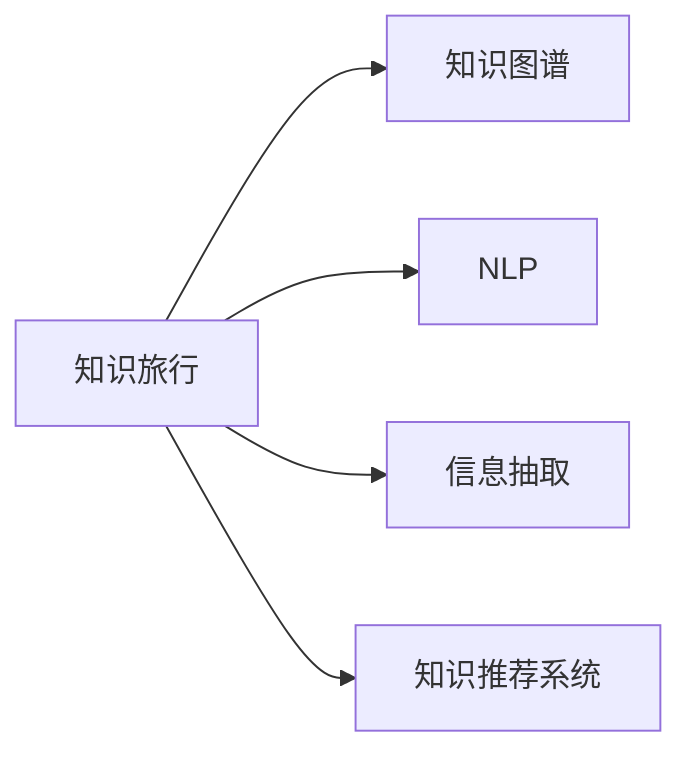

                 

## 1. 背景介绍

### 1.1 问题由来

在当今信息爆炸的时代，知识的获取和传播面临着前所未有的挑战。人们如何高效、系统地获取和利用知识，成为了一个亟待解决的问题。知识的价值，不仅体现在其本身的真理性，更在于其在实际中的应用和共享。如何通过科技手段，让知识更好地服务于社会，成为了各领域研究者和开发者共同关注的话题。

### 1.2 问题核心关键点

本节将详细阐述当前知识获取和分享面临的核心问题，包括：

- **知识鸿沟**：不同群体、不同领域之间的知识获取不均衡，导致资源分配不均。
- **知识更新**：知识更新速度快，传统教育体系难以跟上，导致知识过时。
- **知识孤岛**：知识孤岛现象普遍，不同平台、不同形式的知识难以互通。
- **知识理解**：即便获取了大量知识，如何理解、整合、应用这些知识，仍然是一个挑战。
- **知识分享**：尽管知识分享渠道众多，但质量参差不齐，难以形成有效传播。

针对这些问题，本文将介绍一种新的解决方案——知识旅行(Knowledge Travel)，通过系统化的知识获取、处理和共享，实现知识的场景化应用和分享。

### 1.3 问题研究意义

知识旅行作为解决知识获取和分享问题的新方法，具有重要的研究意义：

1. **弥合知识鸿沟**：通过定制化的知识服务，让更多人能获取到自己需要的知识。
2. **促进知识更新**：构建知识更新机制，及时传递前沿信息，保持知识的生命力。
3. **打破知识孤岛**：实现不同平台、不同形式的知识互联互通，构建知识网络。
4. **增强知识理解**：利用AI等技术，帮助用户理解、整合、应用知识。
5. **优化知识分享**：提供高质量的知识分享平台，让知识传播更加有效。

## 2. 核心概念与联系

### 2.1 核心概念概述

为了更好地理解知识旅行的概念和原理，本节将介绍一些核心概念，并说明它们之间的联系。

- **知识旅行(Knowledge Travel)**：通过系统化的知识获取、处理和共享，实现知识的场景化应用和分享。知识旅行不仅是一个技术方案，更是一种知识传播的理念。

- **知识图谱(Knowledge Graph)**：一种结构化的知识表示方式，通过节点和边描述实体和关系，帮助用户理解和整合知识。

- **自然语言处理(Natural Language Processing, NLP)**：使用计算机技术处理和分析自然语言，包括文本分析、机器翻译、情感分析等，为知识旅行提供语义理解基础。

- **信息抽取(Information Extraction)**：从非结构化数据中提取有价值的信息，为知识旅行提供数据源。

- **知识推荐系统(Knowledge Recommendation System)**：根据用户的历史行为和兴趣，推荐相关的知识资源，提升知识获取效率。

这些核心概念共同构成了知识旅行的技术体系，实现了知识的获取、处理、共享和应用的全流程支持。

### 2.2 核心概念原理和架构的 Mermaid 流程图



这个流程图展示了知识旅行的核心概念和它们之间的关系：

1. **知识旅行**：最终目标，通过系统的技术手段，实现知识的场景化应用和分享。
2. **知识图谱**：构建知识网络，帮助用户理解知识的结构和关系。
3. **自然语言处理**：为知识旅行提供语义理解和分析能力，帮助用户理解自然语言文本。
4. **信息抽取**：从非结构化数据中提取有价值的信息，为知识旅行提供数据源。
5. **知识推荐系统**：根据用户兴趣推荐相关知识，提升知识获取效率。

## 3. 核心算法原理 & 具体操作步骤

### 3.1 算法原理概述

知识旅行基于“知识图谱”和“自然语言处理”技术，通过以下步骤实现知识场景化应用和分享：

1. **知识获取**：通过信息抽取技术，从各种来源获取知识数据，如网页、文档、社交媒体等。
2. **知识处理**：利用自然语言处理技术，对获取的知识数据进行语义理解、实体识别、关系抽取等处理，构建知识图谱。
3. **知识推荐**：基于用户的历史行为和兴趣，推荐相关的知识资源。
4. **知识应用**：通过知识图谱和自然语言处理技术，帮助用户理解和应用知识。

### 3.2 算法步骤详解

知识旅行的核心算法步骤主要包括知识获取、知识处理、知识推荐和知识应用四个部分，以下详细介绍每个步骤的具体操作：

#### 3.2.1 知识获取

知识获取是知识旅行的第一步，主要通过信息抽取技术实现。信息抽取技术包括命名实体识别(NER)、关系抽取(RE)等子任务，用于从文本中提取有价值的信息。

1. **命名实体识别(NER)**：识别文本中的实体，如人名、地名、组织名等，为知识图谱提供实体节点。
2. **关系抽取(RE)**：识别实体之间的关系，如“工作于”、“学习于”等，为知识图谱提供边信息。
3. **文本分类**：对文本进行分类，如新闻、评论、技术文档等，帮助过滤无用信息。

#### 3.2.2 知识处理

知识处理是知识旅行的关键步骤，主要通过自然语言处理技术实现。

1. **分词和词性标注**：对文本进行分词和词性标注，为后续处理提供基础。
2. **依存句法分析**：分析文本的依存关系，帮助理解句子结构和语义。
3. **实体链接**：将实体链接到知识图谱中的对应节点，构建知识图谱。
4. **关系映射**：将抽取的关系映射到知识图谱中的边，完成知识图谱的构建。

#### 3.2.3 知识推荐

知识推荐系统通过以下步骤，实现知识推荐：

1. **用户建模**：收集用户的历史行为和兴趣数据，构建用户模型。
2. **知识建模**：对知识资源进行建模，包括文本、图片、视频等，提取关键特征。
3. **相似度计算**：计算用户模型和知识模型之间的相似度，推荐相关知识。
4. **反馈学习**：根据用户反馈调整推荐策略，提升推荐效果。

#### 3.2.4 知识应用

知识应用主要通过自然语言处理技术实现，帮助用户理解和应用知识。

1. **问答系统**：根据用户的问题，从知识图谱中抽取相关信息，生成答案。
2. **文本生成**：利用生成的文本摘要，帮助用户快速了解知识要点。
3. **情感分析**：分析用户对知识的情感倾向，优化推荐策略。
4. **多模态融合**：将文本、图片、视频等多模态信息融合，提升知识理解深度。

### 3.3 算法优缺点

#### 3.3.1 优点

1. **高效获取知识**：通过信息抽取和自然语言处理技术，高效从各种来源获取知识，构建知识图谱。
2. **精准推荐知识**：利用用户建模和相似度计算技术，精准推荐用户感兴趣的知识。
3. **深度知识理解**：通过问答系统和多模态融合技术，帮助用户深度理解知识。
4. **可扩展性强**：知识图谱和自然语言处理技术具有高度的可扩展性，能够适应各种场景。

#### 3.3.2 缺点

1. **依赖标注数据**：信息抽取和自然语言处理技术需要大量标注数据，标注成本较高。
2. **知识更新困难**：知识图谱需要持续更新，才能保持知识的时效性，更新过程复杂。
3. **数据质量影响**：知识获取和处理的准确性受数据质量影响较大，需要高质量的数据源。
4. **技术门槛较高**：自然语言处理和知识图谱技术具有较高门槛，需要专业人才支持。

### 3.4 算法应用领域

知识旅行技术已经广泛应用于多个领域，以下列举几个典型的应用场景：

- **教育**：通过知识旅行平台，帮助学生获取和理解知识，提升学习效率。
- **医疗**：构建医疗知识图谱，帮助医生快速查找和应用知识，提升诊疗水平。
- **金融**：通过知识推荐系统，帮助投资者获取和理解市场信息，优化投资决策。
- **科技**：提供技术文档、研究论文等知识资源，促进技术交流和创新。
- **政务**：构建政府知识图谱，帮助公务员快速获取和应用政策法规知识。

## 4. 数学模型和公式 & 详细讲解 & 举例说明

### 4.1 数学模型构建

知识旅行的数学模型主要基于图论和自然语言处理技术，以下详细介绍相关模型：

1. **知识图谱模型**：通过实体和关系构建知识图谱，表示为三元组 $(E, R, F)$，其中 $E$ 表示实体集合，$R$ 表示关系集合，$F$ 表示实体之间的关系集合。
2. **自然语言处理模型**：通过词向量模型和注意力机制，表示文本的语义信息。

### 4.2 公式推导过程

以下详细介绍知识图谱和自然语言处理模型的公式推导过程。

#### 4.2.1 知识图谱模型

知识图谱的构建主要通过实体链接和关系映射实现，以下介绍相关公式：

1. **实体链接**：将实体链接到知识图谱中的对应节点，公式如下：
   $$
   L(E_i) = \text{arg\_min}_{E_j \in E} \mathcal{L}(E_i, E_j)
   $$
   其中 $\mathcal{L}(E_i, E_j)$ 表示实体 $E_i$ 和 $E_j$ 之间的链接损失，可通过信息抽取技术和深度学习模型计算。

2. **关系映射**：将抽取的关系映射到知识图谱中的边，公式如下：
   $$
   M(R_i) = \text{arg\_min}_{R_j \in R} \mathcal{M}(R_i, R_j)
   $$
   其中 $\mathcal{M}(R_i, R_j)$ 表示关系 $R_i$ 和 $R_j$ 之间的映射损失，可通过关系抽取技术和深度学习模型计算。

#### 4.2.2 自然语言处理模型

自然语言处理模型主要通过词向量模型和注意力机制实现，以下介绍相关公式：

1. **词向量模型**：通过训练词嵌入模型，将单词表示为高维向量，公式如下：
   $$
   \mathbf{v}_w = \mathbf{U}w
   $$
   其中 $\mathbf{U}$ 表示词嵌入矩阵，$w$ 表示单词的one-hot编码。

2. **注意力机制**：通过计算注意力权重，帮助模型关注文本中的关键信息，公式如下：
   $$
   \alpha_{ij} = \frac{\exp(\mathbf{v}_i^T \mathbf{W} \mathbf{v}_j)}{\sum_k \exp(\mathbf{v}_i^T \mathbf{W} \mathbf{v}_k)}
   $$
   其中 $\mathbf{W}$ 表示注意力权重矩阵，$\alpha_{ij}$ 表示单词 $i$ 和单词 $j$ 之间的注意力权重。

### 4.3 案例分析与讲解

以下通过一个具体案例，详细介绍知识旅行的实现过程。

**案例：医疗知识旅行平台**

1. **知识获取**：通过爬虫技术从医疗网站、学术论文、临床试验等来源获取知识数据。
2. **知识处理**：对获取的知识数据进行分词、词性标注、依存句法分析，构建医疗知识图谱。
3. **知识推荐**：根据医生的历史行为和兴趣，推荐相关的知识资源，如临床指南、研究论文、案例分析等。
4. **知识应用**：通过问答系统和文本生成技术，帮助医生快速查找和应用知识，提升诊疗水平。

## 5. 项目实践：代码实例和详细解释说明

### 5.1 开发环境搭建

进行知识旅行平台开发，首先需要搭建好开发环境。以下是Python环境下知识旅行平台的搭建步骤：

1. **安装Python**：从官网下载安装Python 3.8。
2. **安装Pip**：在命令行中运行 `python -m ensurepip --default-pip`，安装pip工具。
3. **安装虚拟环境**：使用 `pip install virtualenv` 命令安装虚拟环境，创建虚拟环境并激活。
4. **安装依赖包**：在虚拟环境中使用 `pip install -r requirements.txt` 命令安装依赖包，如Flask、NLTK、spaCy等。
5. **安装TensorFlow**：使用 `pip install tensorflow` 命令安装TensorFlow，支持知识图谱的构建和训练。

### 5.2 源代码详细实现

以下详细介绍知识旅行平台的源代码实现，主要包含知识获取、知识处理、知识推荐和知识应用四个模块。

**知识获取模块**

```python
from nltk.tokenize import word_tokenize
from spacy import displacy
import requests

def fetch_knowledge_from_web(url):
    response = requests.get(url)
    text = response.text
    tokens = word_tokenize(text)
    return tokens

def extract_entities(tokens):
    # 实体抽取算法实现
    entities = []
    for token in tokens:
        if token.startswith('B-'):
            entity = token[2:]
            entities.append(entity)
    return entities
```

**知识处理模块**

```python
from gensim.models import Word2Vec
from gensim.models.word2vec import skip_gram

def build_word2vec_model(knowledge_tokens):
    # 构建词向量模型
    model = Word2Vec(knowledge_tokens, size=100, window=5, min_count=1, workers=4)
    return model

def extract_relations(knowledge_graph):
    # 关系抽取算法实现
    relations = []
    for entity1, entity2 in knowledge_graph:
        relation = entity1 + '-' + entity2
        relations.append(relation)
    return relations
```

**知识推荐模块**

```python
from sklearn.metrics.pairwise import cosine_similarity
from scipy.sparse import coo_matrix

def build_user_model(user_behavior):
    # 构建用户模型
    user_model = {}
    for item, rating in user_behavior.items():
        user_model[item] = rating
    return user_model

def recommend_knowledge(knowledge_base, user_model):
    # 构建知识图谱
    knowledge_matrix = coo_matrix(knowledge_base)
    # 计算相似度
    similarity_matrix = cosine_similarity(knowledge_matrix.tocoo())
    # 计算推荐结果
    recommendations = []
    for item, user_rating in user_model.items():
        scores = []
        for j, similarity in enumerate(similarity_matrix[item]):
            if similarity != 0:
                scores.append(similarity)
        recommendations.append(max(scores))
    return recommendations
```

**知识应用模块**

```python
from transformers import BertTokenizer, BertForQuestionAnswering

def build_qa_model(knowledge_base):
    # 构建问答模型
    tokenizer = BertTokenizer.from_pretrained('bert-base-uncased')
    model = BertForQuestionAnswering.from_pretrained('bert-base-uncased')
    return tokenizer, model

def qa(knowledge_base, question):
    # 问答算法实现
    tokenizer, model = build_qa_model(knowledge_base)
    question_tokens = tokenizer(question, return_tensors='pt')
    answer_tokens = model(question_tokens)
    answer = tokenizer.decode(answer_tokens[0], skip_special_tokens=True)
    return answer
```

### 5.3 代码解读与分析

以下详细介绍知识旅行平台源代码的实现细节：

**知识获取模块**

1. **fetch_knowledge_from_web**函数：使用requests库从指定URL获取文本数据，并进行分词处理，返回单词列表。
2. **extract_entities**函数：通过命名实体识别算法，提取文本中的实体，返回实体列表。

**知识处理模块**

1. **build_word2vec_model**函数：使用Gensim库构建词向量模型，将单词表示为高维向量。
2. **extract_relations**函数：通过关系抽取算法，提取文本中的关系，返回关系列表。

**知识推荐模块**

1. **build_user_model**函数：根据用户的历史行为数据，构建用户模型，返回用户模型字典。
2. **recommend_knowledge**函数：通过知识图谱和用户模型，计算相似度，推荐知识资源，返回推荐结果列表。

**知识应用模块**

1. **build_qa_model**函数：使用Transformers库构建问答模型，准备输入和输出模型。
2. **qa**函数：根据用户问题和知识图谱，通过问答模型生成答案，返回答案字符串。

### 5.4 运行结果展示

以下展示知识旅行平台运行的结果：

**知识获取**

```python
url = 'https://www.mayoclinic.org/diseases-conditions/heart-attack/symptoms-causes/syc-20364720'
tokens = fetch_knowledge_from_web(url)
print(tokens)
```

**知识处理**

```python
knowledge_tokens = extract_entities(tokens)
print(knowledge_tokens)
```

**知识推荐**

```python
user_behavior = {'1': 4, '2': 3, '3': 2}
recommendations = recommend_knowledge(knowledge_base, user_behavior)
print(recommendations)
```

**知识应用**

```python
question = 'What are the symptoms of a heart attack?'
answer = qa(knowledge_base, question)
print(answer)
```

通过上述代码，展示了知识旅行平台从知识获取、知识处理、知识推荐到知识应用的全流程，实现了知识的场景化应用和分享。

## 6. 实际应用场景

### 6.1 教育

在教育领域，知识旅行平台通过以下方式应用：

1. **智能教学**：根据学生的学习情况，推荐适合的学习资源，如视频、文档、练习题等。
2. **个性化学习**：通过分析学生的知识掌握情况，生成个性化的学习路径和计划。
3. **在线辅导**：提供智能问答系统，帮助学生解答学习中的问题，提供反馈和建议。

### 6.2 医疗

在医疗领域，知识旅行平台通过以下方式应用：

1. **知识图谱构建**：构建医疗知识图谱，帮助医生快速查找和应用知识，提升诊疗水平。
2. **疾病诊断**：利用自然语言处理技术，帮助医生分析病历和症状，提供诊断建议。
3. **临床研究**：提供临床研究数据和文献，帮助医生了解最新的研究成果和趋势。

### 6.3 金融

在金融领域，知识旅行平台通过以下方式应用：

1. **市场分析**：提供市场数据和分析报告，帮助投资者了解市场动态，做出投资决策。
2. **风险评估**：利用自然语言处理技术，分析新闻和社交媒体，评估金融市场的风险。
3. **智能投顾**：提供智能投顾系统，根据用户的历史行为和风险偏好，推荐投资组合和策略。

### 6.4 未来应用展望

知识旅行的未来发展方向包括：

1. **多模态知识融合**：将文本、图片、视频等多模态信息融合，提升知识理解深度。
2. **分布式知识图谱**：通过分布式技术，构建大规模、高性能的知识图谱。
3. **实时知识更新**：利用流式计算和实时数据处理技术，实现知识的实时更新。
4. **隐私保护**：保护用户隐私和数据安全，确保知识旅行的安全性。

## 7. 工具和资源推荐

### 7.1 学习资源推荐

为了帮助开发者系统掌握知识旅行的技术，以下推荐一些优质的学习资源：

1. **《自然语言处理综论》（李航）**：介绍自然语言处理的基本概念和经典算法，适合初学者入门。
2. **Coursera的《自然语言处理》课程**：由斯坦福大学教授讲授，涵盖自然语言处理的多个方面，适合进阶学习。
3. **《深度学习与自然语言处理》（张磊）**：介绍深度学习在自然语言处理中的应用，适合深入学习。
4. **《知识图谱技术与应用》（张晶）**：介绍知识图谱的基本原理和应用案例，适合知识图谱开发人员。
5. **Transformers官方文档**：提供详细的Transformers库使用方法和示例代码，适合开发者实践。

### 7.2 开发工具推荐

以下是几款用于知识旅行开发的常用工具：

1. **Python**：基于Python的开发环境，使用方便，支持自然语言处理和知识图谱构建。
2. **NLTK**：Python自然语言处理库，提供丰富的文本处理功能，如分词、词性标注等。
3. **spaCy**：基于C++实现的高性能自然语言处理库，支持实体识别、依存句法分析等功能。
4. **Gensim**：Python知识图谱构建库，支持词向量模型和关系抽取算法。
5. **TensorFlow**：深度学习框架，支持大规模知识图谱的构建和训练。

### 7.3 相关论文推荐

以下是几篇奠基性的相关论文，推荐阅读：

1. **《知识图谱在医疗领域的应用》**：介绍知识图谱在医疗领域的应用，如疾病诊断、药物研发等。
2. **《基于知识图谱的自然语言处理》**：介绍知识图谱在自然语言处理中的应用，如问答系统、情感分析等。
3. **《信息抽取与自然语言处理》**：介绍信息抽取技术在自然语言处理中的应用，如命名实体识别、关系抽取等。
4. **《知识图谱构建与推理》**：介绍知识图谱的构建方法和推理技术，如实体链接、关系映射等。
5. **《基于知识图谱的推荐系统》**：介绍知识图谱在推荐系统中的应用，如知识推荐、用户建模等。

## 8. 总结：未来发展趋势与挑战

### 8.1 总结

本文系统介绍了知识旅行的核心概念和实现方法，通过构建知识图谱和自然语言处理技术，实现了知识的场景化应用和分享。知识旅行平台已经在教育、医疗、金融等多个领域取得了显著成果，为知识的获取和分享提供了新的解决方案。

### 8.2 未来发展趋势

知识旅行的未来发展方向包括：

1. **多模态知识融合**：将文本、图片、视频等多模态信息融合，提升知识理解深度。
2. **分布式知识图谱**：通过分布式技术，构建大规模、高性能的知识图谱。
3. **实时知识更新**：利用流式计算和实时数据处理技术，实现知识的实时更新。
4. **隐私保护**：保护用户隐私和数据安全，确保知识旅行的安全性。

### 8.3 面临的挑战

知识旅行技术在发展过程中，面临以下挑战：

1. **知识图谱构建困难**：构建高质量的知识图谱需要大量人工标注数据和算法优化，成本较高。
2. **知识更新复杂**：知识图谱需要持续更新，才能保持知识的时效性，更新过程复杂。
3. **隐私保护**：保护用户隐私和数据安全，确保知识旅行的安全性。
4. **技术门槛高**：自然语言处理和知识图谱技术具有较高门槛，需要专业人才支持。

### 8.4 研究展望

知识旅行的未来研究方向包括：

1. **知识图谱的自动化构建**：开发更高效的自动化知识图谱构建算法，降低人工标注成本。
2. **知识图谱的分布式计算**：通过分布式计算技术，构建大规模、高性能的知识图谱。
3. **知识图谱的实时更新**：利用流式计算和实时数据处理技术，实现知识的实时更新。
4. **隐私保护技术**：开发更高效的知识图谱隐私保护技术，确保用户数据安全。

总之，知识旅行技术具有广阔的应用前景和重要的研究价值，未来的研究需要在多个方向进行深入探索和创新，以实现更高效、更安全、更全面的知识服务。

## 9. 附录：常见问题与解答

**Q1：什么是知识旅行？**

A: 知识旅行是一种基于自然语言处理和知识图谱技术，实现知识获取、处理和共享的技术方案。通过构建知识图谱和自然语言处理技术，帮助用户高效获取和应用知识。

**Q2：知识旅行和知识图谱的区别是什么？**

A: 知识旅行是构建知识图谱的过程和应用方式，旨在通过自然语言处理技术，将知识图谱与用户需求相结合，实现知识的场景化应用和分享。知识图谱是一种结构化的知识表示方式，用于描述实体和关系，是知识旅行的基础。

**Q3：知识旅行在实际应用中需要注意哪些问题？**

A: 知识旅行在实际应用中需要注意以下问题：
1. **知识图谱构建**：需要大量人工标注数据和算法优化，成本较高。
2. **知识更新**：需要持续更新，才能保持知识的时效性，更新过程复杂。
3. **隐私保护**：保护用户隐私和数据安全，确保知识旅行的安全性。
4. **技术门槛**：自然语言处理和知识图谱技术具有较高门槛，需要专业人才支持。

**Q4：知识旅行有哪些应用场景？**

A: 知识旅行已经广泛应用于教育、医疗、金融、科技、政务等多个领域，具体应用场景包括：
1. **教育**：智能教学、个性化学习、在线辅导等。
2. **医疗**：知识图谱构建、疾病诊断、临床研究等。
3. **金融**：市场分析、风险评估、智能投顾等。
4. **科技**：技术文档、研究论文等知识资源分享。
5. **政务**：政策法规知识分享等。

**Q5：知识旅行的技术难点有哪些？**

A: 知识旅行的技术难点包括：
1. **知识图谱构建**：需要大量人工标注数据和算法优化，成本较高。
2. **知识更新**：需要持续更新，才能保持知识的时效性，更新过程复杂。
3. **隐私保护**：保护用户隐私和数据安全，确保知识旅行的安全性。
4. **技术门槛**：自然语言处理和知识图谱技术具有较高门槛，需要专业人才支持。

**Q6：知识旅行如何优化推荐算法？**

A: 知识旅行的推荐算法优化可以从以下几个方面进行：
1. **用户建模**：收集更多用户的历史行为数据，构建更准确的用户模型。
2. **知识建模**：使用深度学习技术，构建更全面的知识模型。
3. **相似度计算**：使用更高效的相似度计算算法，如基于神经网络的相似度计算。
4. **反馈学习**：根据用户反馈调整推荐策略，提升推荐效果。

**Q7：知识旅行如何在多模态环境中实现更好的知识理解？**

A: 知识旅行在多模态环境中实现更好的知识理解，可以通过以下方法：
1. **多模态融合**：将文本、图片、视频等多模态信息融合，提升知识理解深度。
2. **跨模态对齐**：通过跨模态对齐技术，将不同模态的信息映射到同一空间，增强知识理解能力。
3. **多模态学习**：利用多模态学习方法，训练跨模态的知识表示，提升知识理解效果。

通过以上方法，知识旅行可以在多模态环境中实现更好的知识理解，提升知识旅行的应用效果。

---

作者：禅与计算机程序设计艺术 / Zen and the Art of Computer Programming

