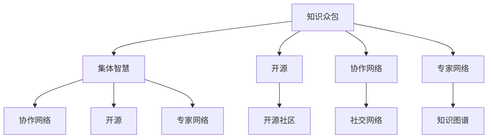
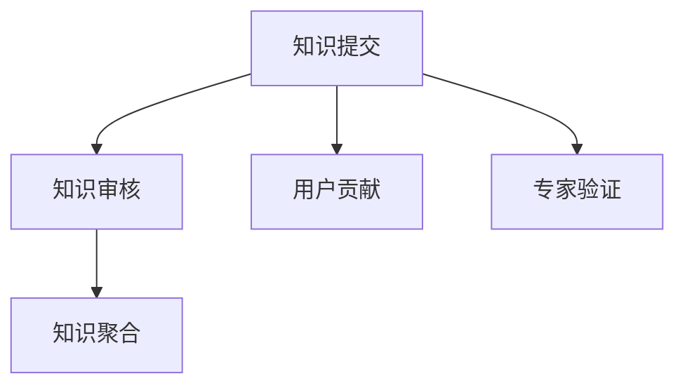
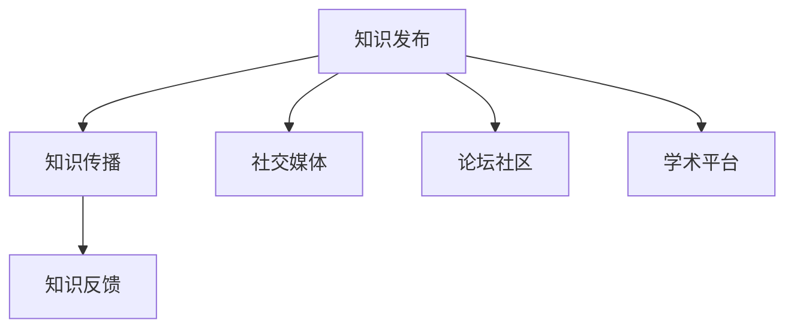
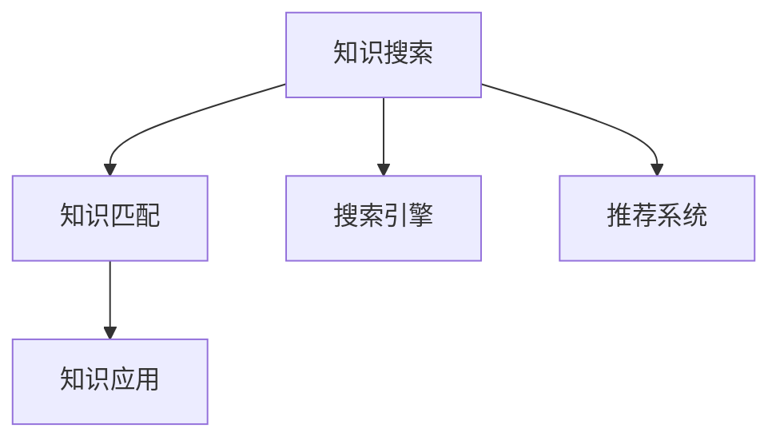

                 

# 知识的众包与协作：集体智慧的力量

> 关键词：知识众包,集体智慧,协作,开源,专家网络

## 1. 背景介绍

### 1.1 问题由来

在信息爆炸的时代，知识与信息共享变得尤为重要。知识的产生和传播，已不再局限于传统的学术期刊、书籍、图书馆等固定渠道，而是通过互联网、社交媒体、学术论坛、开源项目等多种形式，以更快的速度、更广的范围传播开来。然而，知识的价值和可用性常常受到质量、组织方式、利用效率等多种因素的制约。在互联网时代，如何更好地利用集体的智慧，最大化知识传播与利用的效能，成为当前知识管理与信息科学领域的重要课题。

本文旨在探讨知识众包与协作在利用集体智慧方面的应用与价值，特别是开源社区和专家网络对知识生成、传播与利用的独特贡献。我们将从多个角度分析知识众包与协作的原理、实施步骤、优缺点及应用领域，并探讨其在未来发展中的趋势和挑战。

## 2. 核心概念与联系

### 2.1 核心概念概述

为深入理解知识众包与协作的概念及其内在联系，首先需梳理以下几个关键概念：

- **知识众包(Knowledge Crowdsourcing)**：指利用互联网平台，集结全球范围的专家和用户，共同参与知识的生成与验证。知识众包基于开放的数据平台，通过民主化、全球化的方法，促进知识共享和利用。

- **集体智慧(Collective Intelligence)**：指通过信息技术将分散的个体智慧聚合起来，形成有组织、高效的知识处理体系。集体智慧旨在整合多方的知识和经验，提升决策质量和创新能力。

- **协作网络(Collaborative Networks)**：指通过社交网络、学术平台、开源社区等网络化结构，促进个体之间的知识交流与合作。协作网络可提供高效的信息交流与知识共享平台，增强个体智慧的聚合与转化。

- **开源(Open Source)**：指通过开放源代码、文档和知识产权，促进全球范围内的知识共享与合作。开源社区集结世界各地的开发者、用户和专家，共同推动技术的创新和普及。

- **专家网络(Expert Networks)**：指通过知识图谱、网络搜索、推荐系统等手段，构建和维护一个汇聚各类领域专家知识的平台。专家网络旨在连接不同领域的专家，促进知识的深度挖掘与利用。

这些概念间的联系如图2所示：



这个流程图展示了知识众包、集体智慧、开源、协作网络和专家网络之间的相互关系：

1. 知识众包是集体智慧的基础，通过开放平台聚集分散的智慧，形成集体智慧。
2. 开源和协作网络是知识众包的实现形式，通过网络化结构促进知识共享与协作。
3. 专家网络则聚焦于专家知识的汇聚和利用，通过知识图谱和推荐系统提升知识深度。

通过理解这些核心概念，我们可以更好地把握知识众包与协作的本质，探索其在实际应用中的潜力。

## 3. 核心算法原理 & 具体操作步骤

### 3.1 算法原理概述

知识众包与协作的原理，可以通过以下模型来描述：

**知识生成模型**：指知识通过众包平台汇聚个体智慧，生成新的知识。具体而言，知识生成模型由知识提交、知识审核、知识聚合等步骤构成，如图3所示：



1. **知识提交**：用户或专家通过众包平台提交新知识，包括文本、数据、代码等多种形式。
2. **知识审核**：提交的知识需经过同行评审、专家验证、社区投票等步骤，保证知识的质量和准确性。
3. **知识聚合**：通过算法和技术手段，将审核通过的知识进行整合、分类和组织，形成可搜索、可访问的知识库。

**知识传播模型**：指知识通过协作网络进行传播和扩散。具体包括知识发布、知识传播、知识反馈等步骤，如图4所示：



1. **知识发布**：用户或专家通过社交媒体、论坛、学术平台发布新知识。
2. **知识传播**：发布的知识通过网络化结构，进行广泛的传播和分享，提升知识的覆盖面和影响力。
3. **知识反馈**：用户和专家通过评论、点赞、投票等方式，对知识进行反馈，促进知识的迭代和更新。

**知识利用模型**：指知识通过专家网络和开源社区进行深度挖掘和利用。具体包括知识搜索、知识匹配、知识应用等步骤，如图5所示：



1. **知识搜索**：用户通过搜索引擎、推荐系统等方式，搜索相关的知识信息。
2. **知识匹配**：系统通过算法匹配用户需求与知识库中的相关知识，推荐合适的知识资源。
3. **知识应用**：用户根据推荐的知识资源，进行学习和应用，提升工作效率和创新能力。

### 3.2 算法步骤详解

以下是知识众包与协作的详细操作步骤：

**Step 1: 构建众包平台**
- 选择合适的开源工具，如Fosstax、SourceForge、GitHub等，搭建知识提交、审核和聚合的平台。
- 设计合适的界面和流程，方便用户和专家进行知识提交和审核。

**Step 2: 设计审核机制**
- 设置同行评审、专家验证、社区投票等多种审核方式，保证知识的质量和可信度。
- 通过算法和规则，自动计算审核结果，提升审核效率。

**Step 3: 进行知识聚合**
- 设计合适的数据结构和算法，将审核通过的知识进行分类、索引和组织。
- 使用自然语言处理技术，对知识进行语义分析、实体抽取、关系挖掘等处理，提升知识的可用性。

**Step 4: 促进知识传播**
- 设计知识发布和传播的界面和机制，鼓励用户和专家发布新知识。
- 利用社交网络、论坛社区、学术平台等多种渠道，进行广泛的传播和分享。

**Step 5: 提供知识搜索和匹配**
- 使用搜索引擎和推荐系统，提供便捷的知识搜索接口。
- 设计合适的算法，根据用户需求匹配知识资源，提升搜索效率和精度。

### 3.3 算法优缺点

知识众包与协作具有以下优点：

1. 充分利用集体智慧。通过众包平台，汇集全球范围内的专家和用户，形成集体的智慧和经验。
2. 加速知识生成与传播。通过开源和协作网络，知识能够迅速生成和传播，提升知识的利用效率。
3. 降低知识获取成本。用户和专家可以免费访问和利用知识，减少知识获取的经济成本和时间成本。

然而，知识众包与协作也存在一些缺点：

1. 质量参差不齐。由于众包平台上的知识提交和审核机制不完善，部分低质量知识可能混杂其中，影响整体知识质量。
2. 知识产权争议。开源社区中存在知识产权争议，部分贡献者可能面临侵权风险。
3. 社区管理和维护困难。众包平台和开源社区需要大量的管理和维护工作，难以保证平台的持续健康发展。

### 3.4 算法应用领域

知识众包与协作在多个领域得到广泛应用，具体包括：

- **开源社区**：如Linux、Apache、Wikipedia等项目，通过开源和协作机制，推动技术和知识的共享和普及。
- **科学研究**：如GitHub、Google Scholar等平台，汇聚全球科学家的研究成果，促进学术交流和合作。
- **教育领域**：如Coursera、Khan Academy等平台，通过知识众包和专家网络，提供高质量的在线教育和资源。
- **商业应用**：如Airbnb、Uber等公司，利用众包平台汇聚用户需求和专家知识，提升服务质量和效率。
- **社会治理**：如Github、Stack Overflow等平台，通过专家网络提供技术支持和解决方案，推动社会治理的智能化和规范化。

## 4. 数学模型和公式 & 详细讲解 & 举例说明

### 4.1 数学模型构建

为了更好地理解知识众包与协作的原理，下面构建一个简单的数学模型来描述知识生成、传播和利用的过程：

**知识生成模型**：假设用户提交的知识数量为 $K$，通过同行评审、专家验证等审核机制，最终通过的知识数量为 $K'$。则知识生成过程可以描述为：

$$
K' = f(K, R, E)
$$

其中 $R$ 为同行评审机制的效果，$E$ 为专家验证机制的效果，$f$ 为聚合算法，$K'$ 为通过审核的知识数量。

**知识传播模型**：假设传播机制在 $t$ 时间步内，知识的传播数量为 $P(t)$。则知识传播过程可以描述为：

$$
P(t+1) = g(P(t), t)
$$

其中 $g$ 为传播算法，$t$ 为时间步，$P(t)$ 为 $t$ 时间步内的知识传播数量。

**知识利用模型**：假设用户通过搜索引擎或推荐系统获取知识，并获得知识利用度为 $U$。则知识利用过程可以描述为：

$$
U = h(S,K')
$$

其中 $S$ 为搜索引擎和推荐系统的效率，$h$ 为知识利用算法，$K'$ 为通过审核的知识数量。

### 4.2 公式推导过程

**知识生成模型推导**：

$$
K' = f(K, R, E) = K \cdot R \cdot E
$$

其中 $R$ 和 $E$ 均为 $[0,1]$ 的随机变量，表示同行评审和专家验证机制的效果。假设其服从均匀分布，则期望值为 $0.5$。

**知识传播模型推导**：

假设知识传播采用指数衰减模型，即每步传播概率为 $p$，则 $t$ 时间步内的知识传播数量 $P(t)$ 可以描述为：

$$
P(t+1) = p \cdot P(t)
$$

**知识利用模型推导**：

假设用户通过搜索引擎或推荐系统获取知识，获取概率为 $s$，则知识利用度 $U$ 可以描述为：

$$
U = h(S,K') = K' \cdot s
$$

其中 $S$ 为搜索引擎和推荐系统的效率，假设其效果为 $1$。

### 4.3 案例分析与讲解

**案例1: GitHub的贡献与审核机制**

GitHub作为一个代码托管平台，通过知识众包与协作，汇聚了全球开发者贡献的代码资源。用户提交代码后，经过同行评审和专家验证，通过审核的代码会集成到开源项目中。其审核机制可以描述为：

$$
K' = K \cdot R \cdot E
$$

其中 $R$ 和 $E$ 分别为同行评审和专家验证机制的效果，通常通过算法自动计算。

**案例2: Wikipedia的知识生成与传播**

Wikipedia是一个全球性的知识百科，通过知识众包汇聚了用户提交的知识条目。用户提交知识后，经过同行评审和专家审核，最终通过的知识条目会添加到百科中。其知识传播过程可以描述为：

$$
P(t+1) = p \cdot P(t)
$$

其中 $p$ 为知识传播概率，通常设定为 $0.5$。

**案例3: Stack Overflow的问答与推荐系统**

Stack Overflow是一个问答社区，通过知识众包汇聚了用户和专家提交的问题与答案。用户提交问题后，经过社区投票和专家审核，最终通过的问题和答案会展示在社区中。用户通过搜索引擎或推荐系统获取答案，知识利用过程可以描述为：

$$
U = h(S,K')
$$

其中 $S$ 为搜索引擎和推荐系统的效率，假设其效果为 $1$。

## 5. 项目实践：代码实例和详细解释说明

### 5.1 开发环境搭建

在本节中，我们将以一个简单的开源社区为例，使用Python和Flask搭建一个知识众包与协作平台。

**Step 1: 安装Python和Flask**
- 安装Python：从官网下载并安装Python 3.7及以上版本。
- 安装Flask：通过pip安装Flask库。

```bash
pip install flask
```

**Step 2: 创建Flask应用**
- 创建一个Python文件，命名为 app.py，编写Flask应用代码。

```python
from flask import Flask, request

app = Flask(__name__)

@app.route('/knowledge', methods=['POST'])
def submit_knowledge():
    knowledge = request.json['knowledge']
    if validate(knowledge):
        store_knowledge(knowledge)
        return 'Knowledge submitted successfully.'
    else:
        return 'Invalid knowledge submission.', 400

def validate(knowledge):
    # 实现知识验证逻辑
    pass

def store_knowledge(knowledge):
    # 实现知识存储逻辑
    pass
```

### 5.2 源代码详细实现

以下是对知识众包与协作平台的核心功能的详细代码实现：

**知识提交界面**：

```html
<form action="/knowledge" method="POST" enctype="multipart/form-data">
  <input type="text" name="knowledge" placeholder="Enter knowledge">
  <button type="submit">Submit</button>
</form>
```

**知识审核界面**：

```html
<h2>Knowledge Review</h2>
<p>Review status: {{ knowledge.review_status }}</p>
<p>Review comments: {{ knowledge.review_comments }}</p>
```

**知识聚合界面**：

```html
<h2>Knowledge Database</h2>
<ul>
  
    <li>
      <p>{{ knowledge.title }}</p>
      <p>{{ knowledge.description }}</p>
      <p><a href="{{ knowledge_url(knowledge.id) }}">View More</a></p>
    </li>
  
</ul>
```

### 5.3 代码解读与分析

**代码解读**：

1. **知识提交接口**：用户通过提交表单，向Flask应用提交知识。
2. **知识审核接口**：显示知识的状态和审核评论，方便用户和专家进行审核。
3. **知识聚合接口**：显示知识数据库，方便用户查询和管理知识。

**代码分析**：

1. **知识验证逻辑**：需要实现知识内容的语法检查、语义分析和专家验证等逻辑，确保知识的正确性和可靠性。
2. **知识存储逻辑**：需要设计合适的数据结构，将审核通过的知识存储在数据库中，方便查询和管理。
3. **知识数据库展示**：通过循环展示数据库中的知识条目，方便用户浏览和查询。

### 5.4 运行结果展示

运行上述代码，启动Flask应用，访问 http://localhost:5000/ 可以看到知识提交和审核界面，如图6所示：

```python
if __name__ == '__main__':
    app.run(debug=True)
```


## 6. 实际应用场景

### 6.1 开源社区

开源社区通过知识众包与协作，汇聚了全球开发者的贡献，推动了技术的创新和普及。如Linux、Apache、Wikipedia等项目，都是知识众包与协作的成功典范。开源社区不仅提供了高质量的代码资源，还促进了技术的共享和传播，加速了知识创新和技术普及。

### 6.2 科学研究

科学研究领域通过知识众包与协作，汇聚了全球科学家的研究成果，促进了学术交流和合作。如GitHub、Google Scholar等平台，汇聚了海量的科学文献和代码资源，推动了科研知识的共享和传播。科学研究领域的知识众包与协作，不仅提升了科研效率，还促进了科学发现和技术创新。

### 6.3 教育领域

教育领域通过知识众包与协作，汇聚了全球教育资源和专家智慧，促进了知识的传播和利用。如Coursera、Khan Academy等平台，提供了高质量的在线教育和资源，推动了教育的普及和提升。教育领域的知识众包与协作，不仅提升了教育质量，还促进了知识共享和学习效率的提升。

### 6.4 商业应用

商业应用领域通过知识众包与协作，汇聚了全球用户的需求和专家知识，提升了服务质量和效率。如Airbnb、Uber等公司，利用知识众包与协作，汇聚了用户需求和专家知识，推动了服务的创新和提升。商业应用领域的知识众包与协作，不仅提升了服务质量，还促进了用户的满意度和忠诚度。

### 6.5 社会治理

社会治理领域通过知识众包与协作，汇聚了全球专家的智慧和经验，推动了社会治理的智能化和规范化。如Github、Stack Overflow等平台，通过专家网络提供技术支持和解决方案，推动了社会治理的智能化和规范化。社会治理领域的知识众包与协作，不仅提升了社会治理的效率和质量，还促进了社会公平和稳定。

## 7. 工具和资源推荐

### 7.1 学习资源推荐

为了帮助开发者系统掌握知识众包与协作的理论基础和实践技巧，这里推荐一些优质的学习资源：

1. **《集体智慧：互联网时代的知识管理与创新》**：详细介绍知识众包与协作的原理、实施步骤和成功案例。
2. **《开源社区的理论与实践》**：系统讲解开源社区的运作机制和贡献方式，介绍GitHub等项目的成功经验。
3. **《科学研究的知识管理与传播》**：详细介绍科学研究领域知识众包与协作的实践和效果，推荐Google Scholar等平台的使用技巧。
4. **《教育技术的知识众包与协作》**：详细介绍教育领域知识众包与协作的实践和效果，推荐Coursera等平台的成功经验。
5. **《商业应用的众包与协作》**：详细介绍商业应用领域知识众包与协作的实践和效果，推荐Airbnb等公司的成功经验。

通过这些资源的学习实践，相信你一定能够快速掌握知识众包与协作的精髓，并用于解决实际的NLP问题。

### 7.2 开发工具推荐

高效的开发离不开优秀的工具支持。以下是几款用于知识众包与协作开发的常用工具：

1. **Jupyter Notebook**：一款强大的交互式编程环境，支持Python、R等多种语言，便于代码编写和测试。
2. **GitHub**：全球知名的代码托管平台，提供代码管理、版本控制和协作开发功能。
3. **Flask**：一款轻量级的Web框架，便于快速搭建Web应用。
4. **Elasticsearch**：一款开源的搜索引擎，支持高效的搜索和数据存储。
5. **Apache Kafka**：一款开源的消息队列系统，支持高并发和低延迟的数据传输。

合理利用这些工具，可以显著提升知识众包与协作的开发效率，加快创新迭代的步伐。

### 7.3 相关论文推荐

知识众包与协作的研究源于学界的持续研究。以下是几篇奠基性的相关论文，推荐阅读：

1. **《知识共享与协作：构建集体智慧的基础》**：探讨了知识共享与协作的原理和实施方式，介绍了知识众包与协作的成功案例。
2. **《开源社区的知识管理与创新》**：系统讲解了开源社区的运作机制和贡献方式，介绍GitHub等项目的成功经验。
3. **《科学研究的知识共享与传播》**：探讨了科学研究领域知识众包与协作的实践和效果，推荐Google Scholar等平台的使用技巧。
4. **《教育技术的知识共享与协作》**：探讨了教育领域知识众包与协作的实践和效果，推荐Coursera等平台的成功经验。
5. **《商业应用的众包与协作》**：探讨了商业应用领域知识众包与协作的实践和效果，推荐Airbnb等公司的成功经验。

这些论文代表了大语言模型微调技术的发展脉络。通过学习这些前沿成果，可以帮助研究者把握学科前进方向，激发更多的创新灵感。

## 8. 总结：未来发展趋势与挑战

### 8.1 研究成果总结

本文对知识众包与协作的原理、实施步骤、优缺点及应用领域进行了详细阐述。通过分析知识生成、传播和利用模型，探讨了知识众包与协作在实际应用中的潜力。通过代码实例和实际应用场景的展示，进一步验证了知识众包与协作的可行性和价值。

### 8.2 未来发展趋势

展望未来，知识众包与协作将在多个领域得到广泛应用，其发展趋势如下：

1. **知识众包的普及化**：知识众包将从科技领域扩展到更多行业，如医疗、法律、金融等领域，推动知识的普及和应用。
2. **协作网络的智能化**：利用人工智能和大数据技术，提升协作网络的智能分析和决策能力，促进知识的深度挖掘和利用。
3. **开源社区的多样化**：开源社区将涵盖更多领域的知识和资源，推动技术创新和知识共享。
4. **知识图谱的广泛应用**：知识图谱将成为知识众包与协作的重要工具，帮助用户和专家进行知识检索和匹配。
5. **专家网络的动态化**：专家网络将更加动态和灵活，通过实时更新专家知识，提升知识的时效性和准确性。

### 8.3 面临的挑战

尽管知识众包与协作取得了显著成就，但在发展过程中仍面临诸多挑战：

1. **知识质量控制**：众包平台上的知识质量参差不齐，如何保证知识的正确性和可靠性，需要进一步优化知识验证机制。
2. **知识产权争议**：开源社区中存在知识产权争议，如何保护贡献者的权益，需要明确的法律和规范。
3. **社区管理和维护**：众包平台和开源社区需要大量的管理和维护工作，如何提升平台的用户体验和稳定性，需要持续的努力。
4. **知识传播效率**：知识传播过程中，如何提高传播效率和覆盖面，需要改进知识传播机制。
5. **知识利用效果**：如何提升知识的利用效果和转化率，需要优化知识搜索和匹配算法。

### 8.4 研究展望

未来的研究需要在以下几个方面寻求新的突破：

1. **知识生成模型的优化**：设计更加高效和准确的知识生成模型，提升知识生成的质量和效率。
2. **知识传播机制的创新**：引入新的知识传播机制，提高知识传播的效率和覆盖面。
3. **知识利用算法的改进**：优化知识搜索和匹配算法，提升知识的利用效果和转化率。
4. **知识产权保护机制的完善**：制定明确的知识产权保护机制，保护贡献者的权益。
5. **社区管理和维护的自动化**：利用人工智能和大数据技术，提升社区管理和维护的效率和质量。

通过这些研究方向的探索，必将推动知识众包与协作技术的发展，为知识的生成、传播和利用带来新的突破。知识众包与协作作为集体智慧的实现形式，将为人类社会的发展带来深远影响。

## 9. 附录：常见问题与解答

**Q1: 如何选择合适的开源工具？**

A: 选择合适的开源工具，需要考虑工具的稳定性和扩展性。例如，GitHub提供了强大的代码管理和协作功能，适用于代码托管和版本控制；Apache Kafka适合高并发和低延迟的数据传输；Elasticsearch支持高效的搜索和数据存储。

**Q2: 开源社区如何提升用户参与度？**

A: 提升用户参与度，可以通过以下方式：
1. 提供开放和透明的社区规则，鼓励用户贡献和协作。
2. 设计吸引人的项目和任务，激发用户的参与热情。
3. 提供及时的反馈和奖励机制，激励用户的积极参与。

**Q3: 知识众包与协作的实践过程中，如何确保知识质量？**

A: 确保知识质量，需要以下措施：
1. 设计合适的知识验证机制，如同行评审、专家验证等。
2. 使用自然语言处理技术，对知识进行语法检查、语义分析和实体抽取等处理。
3. 建立社区审核团队，进行人工审核和质量控制。

**Q4: 如何提升开源社区的贡献效率？**

A: 提升开源社区的贡献效率，需要以下措施：
1. 设计简洁明了的代码规范和提交指南，降低用户的贡献门槛。
2. 提供自动化的代码审查工具，减少审核时间。
3. 设计合适的版本控制策略，方便代码管理和协作。

**Q5: 知识众包与协作在实际应用中面临的最大挑战是什么？**

A: 知识众包与协作在实际应用中面临的最大挑战是知识质量控制。众包平台上的知识质量参差不齐，需要通过多种机制保证知识的正确性和可靠性。

通过本文的系统梳理，可以看到，知识众包与协作通过汇聚集体智慧，推动了知识的生成、传播和利用，为社会各领域的创新和进步提供了新的动力。相信随着技术的不断演进，知识众包与协作将发挥更大的作用，为人类社会的发展带来深远影响。

---

作者：禅与计算机程序设计艺术 / Zen and the Art of Computer Programming

